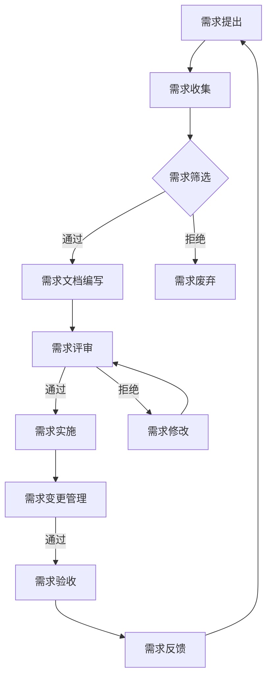

                 

### 《敏捷研发中的需求沟通效率提升策略》

#### 关键词：敏捷研发、需求沟通、效率提升、团队协作、跨团队沟通、需求管理

#### 摘要：

本文旨在探讨敏捷研发中需求沟通效率的提升策略。敏捷研发是一种以快速响应变化和高效交付价值为核心的开发模式，而需求沟通则是敏捷研发成功的关键要素。本文将首先概述敏捷研发的概念和特点，随后深入探讨需求沟通的重要性、障碍和目标。在此基础上，我们将详细分析敏捷研发中的需求管理、团队协作、跨团队沟通以及需求沟通技巧。最后，通过实际案例和最佳实践，总结出提升需求沟通效率的策略和方法。

### 第1章：敏捷研发与需求沟通

#### 1.1 敏捷研发概述

敏捷研发（Agile Development）是一种以人为核心、迭代、循序渐进的开发方法。其核心理念是“更快地交付、持续改进、响应变化”，旨在通过灵活的应对策略，快速响应市场和用户需求，提高软件产品的质量和开发效率。

**1.1.1 敏捷开发与传统开发的对比**

传统开发方法，如瀑布模型（Waterfall Model），是一种线性、顺序的开发过程，其特点是需求明确、计划性强。然而，随着软件项目的复杂度和市场环境的变化，传统开发方法逐渐暴露出其不足：

- **需求变更难**：在项目启动时，需求往往已经固化，后期变更困难。
- **开发周期长**：线性开发过程导致项目周期较长，不利于快速响应市场变化。
- **沟通效率低**：开发人员和客户之间的沟通渠道不畅，导致需求理解偏差。

相较之下，敏捷开发强调迭代、渐进式开发，更适用于复杂和变化频繁的项目。其特点包括：

- **迭代开发**：开发过程分为多个短周期的迭代，每个迭代产出可用的软件功能。
- **用户反馈**：每个迭代结束后，收集用户反馈，以便调整下一个迭代的需求。
- **需求灵活**：需求可以在开发过程中随时调整，以更好地满足用户需求。

**1.1.2 敏捷开发的核心原则**

敏捷开发遵循一系列核心原则，这些原则指导开发团队如何高效协作，实现项目目标。核心原则包括：

- **个体和互动重于流程与工具**：强调团队成员的沟通和协作，而不仅仅是依赖流程和工具。
- **可工作的软件重于详尽的文档**：注重实际产出，而非文档的完整性。
- **客户合作重于合同谈判**：与客户保持密切合作，确保需求的理解和实现。
- **响应变化重于遵循计划**：灵活应对需求变化，而不是一味遵循既定计划。

**1.1.3 敏捷研发的常见实践**

敏捷研发中，常见实践包括：

- **每日站会**：团队成员每天开会，讨论进展、问题和计划。
- **迭代规划**：在迭代开始时，规划下一个迭代的工作任务。
- **回顾会议**：每个迭代结束后，团队回顾，总结经验教训。
- **持续集成**：通过自动化测试和持续集成，确保代码质量。
- **用户故事**：使用用户故事（User Story）来描述需求，便于理解和实现。

**1.2 需求沟通的重要性**

需求沟通在敏捷研发中扮演着至关重要的角色。有效的需求沟通能够确保开发团队准确理解用户需求，从而实现高质量、高效率的软件交付。

**1.2.1 需求沟通的基本原则**

有效的需求沟通应遵循以下基本原则：

- **明确性**：需求描述应清晰明确，避免歧义。
- **一致性**：需求应在整个项目中保持一致，避免冲突。
- **及时性**：需求变化应及时沟通，避免影响项目进度。
- **完整性**：需求沟通应覆盖所有相关方面，确保无遗漏。

**1.2.2 需求沟通的障碍与挑战**

需求沟通中常见的障碍和挑战包括：

- **语言障碍**：团队成员可能来自不同背景，语言和表达方式不同，导致理解困难。
- **信息不对称**：需求提出者和开发团队之间的信息不对称，导致需求理解偏差。
- **沟通频率不足**：沟通频率低，导致需求变化和问题积累。
- **文化差异**：不同文化背景的团队在沟通方式和习惯上可能存在差异。

**1.2.3 需求沟通的目标与策略**

需求沟通的目标是确保开发团队准确理解用户需求，实现以下目标：

- **需求理解的准确性**：确保开发团队对需求有准确的理解，减少误解和错误。
- **需求变更的控制**：有效管理需求变更，确保项目进度和质量。
- **沟通渠道的畅通**：建立畅通的沟通渠道，确保信息传递高效、无障碍。

实现这些目标，可以采取以下策略：

- **建立明确的沟通机制**：制定沟通计划，明确沟通频率、方式和渠道。
- **使用标准化的需求文档**：使用统一的需求文档模板，确保需求描述的一致性和完整性。
- **加强跨部门合作**：通过跨部门协作，确保需求在不同团队之间的传递和实现。
- **利用沟通工具**：使用高效的沟通工具，如即时通讯软件、视频会议等，提高沟通效率。

#### Mermaid 流程图：

### 第2章：敏捷研发中的需求管理

#### 2.1 需求收集与筛选

需求收集是敏捷研发中的关键环节，其目标是确保开发团队准确理解用户需求，为后续的开发工作奠定基础。

**2.1.1 需求收集的方法**

需求收集可以采用以下几种方法：

- **用户访谈**：通过与用户面对面交流，获取用户的需求和痛点。
- **问卷调查**：通过问卷收集用户的需求和反馈，适用于大量用户群体。
- **观察分析**：观察用户在使用产品过程中的行为和反馈，了解用户需求。
- **竞争分析**：分析竞争对手的产品和功能，了解市场需求和趋势。

**2.1.2 需求筛选的技巧**

在收集到大量需求后，需要通过筛选确定哪些需求应该纳入开发计划。以下是一些筛选技巧：

- **优先级排序**：根据需求的紧急程度、重要性和可行性进行排序，确定优先级。
- **用户价值**：评估需求对用户的实际价值，优先满足用户核心需求。
- **资源限制**：考虑项目资源和时间限制，合理分配需求。
- **技术可行性**：评估需求的技术可行性，避免引入高风险需求。

**2.1.3 需求优先级确定**

需求优先级确定是需求管理的重要环节。以下是一些确定需求优先级的方法：

- **MoSCoW 方法**：将需求分为“必须要有（M）”、“应该要有（S）”、“可以延迟（C）”、“不会实现（W）”四个等级。
- **Kano 模型**：根据用户满意度将需求分为“基本需求”、“性能需求”、“魅力需求”和“无需求”四个等级。
- **成本效益分析**：评估需求的成本和收益，选择具有高成本效益的需求。

#### 2.2 需求文档编写

需求文档是需求管理中的重要成果，其目的是明确需求，为开发团队提供清晰的指导。

**2.2.1 需求文档的结构**

需求文档通常包括以下部分：

- **封面**：包括文档标题、版本号、编制人和日期。
- **概述**：简要介绍需求文档的目的、范围和重要性。
- **需求描述**：详细描述每个需求的功能、性能、约束和接口。
- **需求分析**：对需求进行分析，包括用户需求、业务需求和系统需求。
- **需求变更记录**：记录需求变更的详细信息，包括变更日期、变更内容和变更原因。

**2.2.2 需求文档的撰写要点**

撰写需求文档时，应遵循以下要点：

- **清晰性**：需求描述应清晰、简洁，避免歧义。
- **准确性**：需求描述应准确反映用户需求，避免误解和错误。
- **一致性**：需求文档应在整个项目中保持一致，避免冲突。
- **可追溯性**：需求文档应具有可追溯性，方便后续跟踪和修改。

**2.2.3 需求文档的评审与更新**

需求文档编写完成后，需要进行评审和更新。以下是一些评审和更新要点：

- **内部评审**：组织内部评审会议，确保需求文档的完整性和准确性。
- **外部评审**：邀请相关利益相关者（如客户、产品经理等）参与评审，获取反馈。
- **版本控制**：使用版本控制系统（如 Git）管理需求文档，方便跟踪修改历史。
- **持续更新**：根据项目进展和用户反馈，持续更新需求文档，确保其有效性。

#### 2.3 需求变更管理

需求变更是敏捷研发中常见的问题。有效的需求变更管理有助于确保项目进度和质量。

**2.3.1 需求变更的类型**

需求变更可以分为以下几种类型：

- **新增需求**：在项目开发过程中新增的需求。
- **修改需求**：对已存在需求的功能、性能或约束进行修改。
- **废弃需求**：不再实现或推迟实现的需求。

**2.3.2 需求变更的评估与控制**

需求变更的评估和控制包括以下步骤：

- **需求变更申请**：提出需求变更申请，明确变更内容、原因和影响。
- **影响评估**：评估需求变更对项目进度、成本、质量和资源的影响。
- **变更决策**：根据评估结果，决定是否接受需求变更。
- **变更实施**：实施需求变更，包括修改需求文档、调整开发计划和资源分配。

**2.3.3 需求变更的沟通与协调**

需求变更的沟通与协调包括以下要点：

- **及时沟通**：需求变更应尽早通知相关利益相关者，确保信息的透明。
- **协同工作**：需求变更可能涉及多个团队和角色，需要协同工作，确保变更的实施。
- **变更记录**：记录需求变更的详细信息，包括变更内容、原因、影响和实施情况。

### 第3章：敏捷研发中的团队协作

#### 3.1 敏捷团队的组成

敏捷团队是一种以跨职能、协作和自组织为特点的团队模式，其目的是提高开发效率、降低沟通成本。

**3.1.1 敏捷团队的职责与角色**

敏捷团队的职责和角色包括：

- **产品负责人（Product Owner）**：负责定义产品愿景、目标和需求，确保团队按优先级开发。
- **Scrum Master**：负责确保团队遵循敏捷实践，解决团队遇到的障碍，促进协作。
- **开发人员（Developers）**：负责实现需求，包括设计、编码和测试。
- **测试人员（Testers）**：负责测试软件质量，确保功能符合需求。
- **用户代表（User Representatives）**：代表用户参与需求讨论和产品评审。

**3.1.2 敏捷团队的协作模式**

敏捷团队的协作模式通常包括以下方面：

- **每日站会**：团队每天开会，讨论进展、问题和计划。
- **迭代计划会议**：在迭代开始时，团队共同制定迭代计划。
- **回顾会议**：在每个迭代结束时，团队回顾，总结经验教训。
- **持续集成**：团队通过持续集成，确保代码质量和项目进度。

**3.1.3 敏捷团队的沟通工具**

敏捷团队常用的沟通工具包括：

- **即时通讯软件**：如 Slack、WhatsApp 等，用于实时沟通和协作。
- **项目管理工具**：如 Jira、Trello 等，用于任务分配、进度跟踪和协作。
- **代码管理工具**：如 Git、Svn 等，用于代码版本管理和协同开发。
- **视频会议软件**：如 Zoom、Microsoft Teams 等，用于远程会议和协作。

#### 3.2 敏捷流程与迭代

敏捷研发强调迭代开发和持续改进。每个迭代都是一个完整的开发周期，包括需求收集、规划、开发、测试和交付。

**3.2.1 敏捷开发流程**

敏捷开发流程通常包括以下阶段：

- **需求收集**：团队与用户和利益相关者沟通，了解用户需求和期望。
- **规划会议**：团队制定迭代计划，确定任务和目标。
- **开发**：团队按照计划进行开发，实现需求。
- **测试**：团队进行单元测试、集成测试和系统测试，确保软件质量。
- **交付**：团队将软件交付给用户，收集用户反馈。

**3.2.2 敏捷迭代的方法**

敏捷迭代的方法包括：

- **时间盒（Time-Boxing）**：每个迭代都有一个固定的时间周期，如两周或一个月。
- **增量交付（Incremental Delivery）**：每个迭代交付可用的软件功能，逐步完善。
- **用户故事（User Stories）**：使用用户故事描述需求，便于理解和实现。

**3.2.3 敏捷迭代中的需求沟通**

在敏捷迭代中，需求沟通至关重要。以下是一些需求沟通的要点：

- **迭代规划会议**：团队与产品负责人讨论迭代需求，确定优先级和计划。
- **每日站会**：团队成员讨论进展和问题，确保需求理解的准确性。
- **迭代回顾会议**：团队总结迭代经验教训，改进需求沟通方法。
- **用户反馈**：在每个迭代结束时，收集用户反馈，用于调整后续迭代的需求。

#### 3.3 团队内部沟通效率提升策略

团队内部沟通效率直接影响到项目的成功。以下是一些提升团队内部沟通效率的策略：

**3.3.1 沟通障碍的识别与解决**

团队内部沟通障碍主要包括：

- **语言障碍**：团队成员可能来自不同背景，语言和表达方式不同。
- **信息不对称**：团队成员可能不了解其他团队成员的工作内容和进展。
- **文化差异**：不同文化背景的团队在沟通方式和习惯上可能存在差异。

为解决这些障碍，可以采取以下措施：

- **语言培训**：组织语言培训，提高团队成员的语言沟通能力。
- **信息共享**：建立信息共享平台，确保团队成员了解其他成员的工作内容和进展。
- **文化适应**：了解不同文化背景的团队特点，采取相应的沟通策略。

**3.3.2 沟通频率与节奏的控制**

沟通频率和节奏的控制对团队内部沟通效率至关重要。以下是一些控制沟通频率和节奏的方法：

- **定期会议**：设定定期会议，如每日站会和每周回顾会议，确保沟通的频率和节奏。
- **即时沟通**：对于紧急问题和关键决策，采用即时沟通方式，如视频会议和即时通讯。
- **沟通工具**：使用高效的沟通工具，如项目管理软件和即时通讯软件，提高沟通效率。

**3.3.3 沟通方式的创新与优化**

为提高团队内部沟通效率，可以采用以下创新和优化方法：

- **虚拟会议**：利用虚拟会议技术，实现远程团队的实时沟通。
- **在线协作**：使用在线协作工具，如文档共享和项目管理软件，提高团队协作效率。
- **沟通技巧培训**：组织沟通技巧培训，提高团队成员的沟通能力和技巧。

### 第4章：敏捷研发中的跨团队沟通

#### 4.1 跨团队沟通的重要性

在大型敏捷研发项目中，跨团队沟通是确保项目成功的关键。有效的跨团队沟通能够确保不同团队之间的需求理解一致、协作顺畅，从而提高项目效率和质量。

**4.1.1 跨团队沟通的挑战**

跨团队沟通面临以下挑战：

- **信息不对称**：不同团队可能拥有不同的信息来源和渠道，导致信息不对称。
- **职责分工不明确**：不同团队之间的职责分工不明确，可能导致沟通责任不清晰。
- **文化差异**：不同团队可能来自不同文化背景，沟通方式和习惯存在差异。
- **沟通工具不统一**：不同团队可能使用不同的沟通工具，导致沟通效率降低。

**4.1.2 跨团队沟通的目标**

跨团队沟通的目标包括：

- **需求理解一致**：确保不同团队对需求有统一的理解，避免误解和错误。
- **协作顺畅**：促进不同团队之间的协作，确保项目进展顺利。
- **信息共享**：建立有效的信息共享机制，确保不同团队之间的信息传递高效、无障碍。

**4.1.3 跨团队沟通的策略**

以下是一些有效的跨团队沟通策略：

- **建立沟通机制**：制定跨团队沟通计划，明确沟通频率、方式和渠道。
- **统一沟通工具**：选择统一的沟通工具，确保不同团队之间的沟通顺畅。
- **明确职责分工**：明确不同团队的职责分工，确保沟通责任清晰。
- **文化适应**：了解不同团队的文化背景，采取相应的沟通策略。
- **定期沟通会议**：定期召开跨团队沟通会议，讨论项目进展、问题和需求。

#### 4.2 跨团队沟通的流程与机制

跨团队沟通的流程和机制是确保沟通顺畅、信息传递高效的重要保障。以下是一些常见的流程和机制：

**4.2.1 跨团队沟通的流程**

跨团队沟通流程通常包括以下步骤：

- **需求提出**：由产品负责人或业务部门提出需求，并分配给相关团队。
- **需求讨论**：相关团队进行需求讨论，明确需求细节和实现方案。
- **需求确认**：团队就需求达成一致，并记录需求文档。
- **开发与测试**：团队按照需求文档进行开发和测试，确保软件质量。
- **交付与验收**：将软件交付给业务部门，进行验收和反馈。

**4.2.2 跨团队沟通的机制**

跨团队沟通机制包括以下方面：

- **定期沟通会议**：定期召开跨团队沟通会议，讨论项目进展、问题和需求。
- **信息共享平台**：建立信息共享平台，确保不同团队之间的信息传递高效、无障碍。
- **沟通渠道**：明确沟通渠道，如邮件、即时通讯、视频会议等，确保沟通方式多样。
- **沟通记录**：记录跨团队沟通的详细信息，包括沟通内容、时间和参与人员，以便后续跟踪和改进。

**4.2.3 跨团队沟通的工具与技术**

以下是一些常用的跨团队沟通工具和技术：

- **项目管理软件**：如 Jira、Trello 等，用于任务分配、进度跟踪和协作。
- **文档管理工具**：如 Confluence、Google Docs 等，用于文档共享和协作。
- **即时通讯软件**：如 Slack、WhatsApp 等，用于实时沟通和协作。
- **视频会议软件**：如 Zoom、Microsoft Teams 等，用于远程会议和协作。

### 第5章：敏捷研发中的需求沟通技巧

#### 5.1 需求理解与澄清

需求理解是需求沟通的关键环节，其目标是确保开发团队准确理解用户需求。以下是一些需求理解与澄清的技巧：

**5.1.1 需求理解的步骤**

需求理解的步骤包括：

1. **初步理解**：通过需求文档、用户访谈和观察，初步了解用户需求。
2. **深入讨论**：与用户和利益相关者进行深入讨论，澄清需求的细节和实现方案。
3. **需求分析**：对需求进行分析，包括功能、性能、约束和接口等方面。
4. **验证与确认**：通过原型设计、演示和测试，验证需求理解的准确性，并与用户确认。

**5.1.2 需求澄清的技巧**

需求澄清的技巧包括：

- **提问技巧**：通过提问，引导用户详细描述需求，避免模糊和歧义。
- **举例说明**：使用具体实例，帮助用户更好地理解需求。
- **对比分析**：通过对比不同方案，确定最佳的需求实现方案。
- **定期回顾**：定期回顾需求，确保需求理解的持续性和一致性。

**5.1.3 需求理解的验证**

需求理解的验证是确保需求准确性的重要环节。以下是一些验证方法：

- **原型验证**：通过原型设计，展示需求实现的初步效果，获取用户反馈。
- **演示验证**：通过演示，展示需求实现的功能和性能，与用户进行交流。
- **测试验证**：通过测试，验证需求实现的准确性和可靠性，确保功能符合预期。

#### 5.2 沟通语言的选择与应用

在需求沟通中，选择合适的沟通语言至关重要。以下是一些沟通语言的选择与应用技巧：

**5.2.1 沟通语言的分类**

沟通语言可以分为以下几类：

- **专业术语**：使用专业术语，确保沟通的准确性和专业性。
- **用户语言**：使用用户熟悉的语言，确保需求易于理解和实现。
- **图表和原型**：使用图表和原型，直观地展示需求，提高沟通效果。
- **示例和案例**：通过示例和案例，帮助用户更好地理解需求。

**5.2.2 沟通语言的选择**

沟通语言的选择应考虑以下因素：

- **受众**：根据受众的特点，选择合适的沟通语言，确保需求易于理解。
- **情境**：根据沟通的情境，选择适当的沟通语言，提高沟通效果。
- **目的**：根据沟通的目的，选择合适的沟通语言，确保需求准确传达。

**5.2.3 沟通语言的应用场景**

以下是一些常见的沟通语言应用场景：

- **用户访谈**：使用用户语言，确保用户能够清楚地表达需求。
- **需求评审**：使用专业术语，确保评审会议的专业性和准确性。
- **文档编写**：使用图表和原型，确保需求文档的直观性和易读性。
- **演示说明**：使用示例和案例，帮助用户更好地理解需求。

#### 5.3 沟通障碍的识别与解决

在需求沟通中，沟通障碍是影响需求理解的重要因素。以下是一些沟通障碍的识别与解决方法：

**5.3.1 沟通障碍的类型**

常见的沟通障碍类型包括：

- **语言障碍**：专业术语、语言表达方式不同导致的沟通困难。
- **信息不对称**：不同团队或个人之间的信息不共享，导致理解偏差。
- **文化差异**：不同文化背景的团队在沟通方式和习惯上的差异。
- **心理障碍**：沟通者可能因为压力、抵触情绪等原因，导致沟通不畅。

**5.3.2 沟通障碍的原因**

沟通障碍的原因可能包括：

- **信息传递不畅**：信息传递过程中存在障碍，导致信息失真。
- **需求不明确**：需求描述不清晰，导致开发团队对需求理解不一致。
- **团队协作不力**：团队协作不力，导致沟通责任不明确，沟通效率降低。

**5.3.3 沟通障碍的解决方法**

解决沟通障碍可以采取以下方法：

- **建立沟通机制**：制定沟通计划，明确沟通频率、方式和渠道。
- **使用标准化语言**：使用统一的沟通语言，确保沟通的准确性和专业性。
- **提高沟通能力**：组织沟通技巧培训，提高团队成员的沟通能力和技巧。
- **加强信息共享**：建立信息共享平台，确保不同团队或个人之间的信息传递高效、无障碍。

### 第6章：敏捷研发中的需求管理工具

#### 6.1 需求管理工具的选择与使用

在敏捷研发中，需求管理工具是支持需求收集、分析、管理和跟踪的重要工具。选择合适的工具，并合理使用，可以提高需求管理的效率和准确性。

**6.1.1 需求管理工具的种类**

需求管理工具可以分为以下几类：

- **文档管理工具**：如 Confluence、Google Docs，用于编写和存储需求文档。
- **项目管理工具**：如 Jira、Trello，用于任务分配、进度跟踪和协作。
- **需求跟踪工具**：如 Jira、VersionOne，专门用于需求管理和跟踪。
- **原型设计工具**：如 Figma、Axure，用于创建原型和演示。

**6.1.2 需求管理工具的选择标准**

选择需求管理工具时，应考虑以下标准：

- **易用性**：工具应易于使用，确保团队成员能够快速上手。
- **功能丰富**：工具应具备丰富的功能，满足需求收集、分析和管理的需求。
- **可定制性**：工具应具备较高的可定制性，以适应不同的需求管理流程。
- **集成性**：工具应能够与其他开发工具和系统集成，提高协同效率。

**6.1.3 需求管理工具的使用技巧**

合理使用需求管理工具，可以提高需求管理的效率和准确性。以下是一些建议：

- **制定统一模板**：制定统一的需求文档模板，确保需求描述的一致性和规范性。
- **定期更新需求**：定期更新需求文档，确保需求信息的实时性和准确性。
- **权限管理**：设置适当的权限，确保不同团队成员能够访问和修改需求文档。
- **利用统计分析**：利用工具的统计分析功能，监控需求状态和进度，及时调整计划。

#### 6.2 需求跟踪与监控

需求跟踪与监控是确保需求得到有效管理和实现的重要环节。以下是一些关键要素和方法：

**6.2.1 需求跟踪的方法**

需求跟踪的方法包括：

- **需求状态跟踪**：记录每个需求的状态，如“待开发”、“开发中”、“测试中”、“已验收”等。
- **需求进度跟踪**：监控每个需求的进度，包括任务完成情况和开发周期。
- **需求变更跟踪**：记录需求变更的详细信息，包括变更原因、变更内容和变更影响。

**6.2.2 需求监控的指标**

需求监控的指标包括：

- **需求完成率**：衡量需求完成的数量和进度。
- **需求变更率**：衡量需求变更的频率和影响。
- **需求满意度**：评估用户对需求实现的满意度。

**6.2.3 需求监控的工具与技术**

以下是一些用于需求监控的工具和技术：

- **项目管理软件**：如 Jira、Trello，用于跟踪需求状态和进度。
- **自动化工具**：如 Jenkins、GitLab CI，用于自动化测试和构建，提高需求实现效率。
- **统计工具**：如 Google Analytics、Tableau，用于数据分析，提供决策支持。

#### 6.3 需求变更与版本管理

需求变更是敏捷研发中常见的情况。有效的需求变更和版本管理可以提高项目的灵活性和可控性。

**6.3.1 需求变更的管理流程**

需求变更的管理流程包括：

- **变更请求**：提出需求变更请求，包括变更原因、内容和影响。
- **变更评估**：评估需求变更对项目进度、成本、质量和资源的影响。
- **变更决策**：根据评估结果，决定是否接受需求变更。
- **变更实施**：实施需求变更，包括修改需求文档、调整开发计划和资源分配。

**6.3.2 需求版本的命名与跟踪**

需求版本的命名和跟踪是管理需求变更的重要环节。以下是一些建议：

- **版本命名**：采用统一的版本命名规则，如“需求编号_版本号”，确保版本信息的清晰和可追溯。
- **版本跟踪**：记录每个版本的需求变更记录，包括变更日期、变更内容和变更原因。

**6.3.3 需求变更的影响评估与处理**

需求变更的影响评估和处理是确保项目顺利推进的重要环节。以下是一些建议：

- **影响评估**：评估需求变更对项目进度、成本、质量和资源的影响。
- **风险控制**：识别潜在风险，制定应对措施，确保项目可控。
- **变更控制**：制定变更控制流程，确保变更的及时、准确和有序实施。

### 第7章：敏捷研发中的需求沟通案例分析

#### 7.1 案例介绍

本案例介绍的是一个中型敏捷研发项目，项目团队由产品负责人、Scrum Master、开发人员、测试人员和用户代表组成。项目目标是开发一个企业级在线教育平台，满足用户课程学习、作业提交、成绩查询等功能。

#### 7.1.1 案例背景

项目启动时，客户提出了一些基本需求，如课程展示、用户注册、学习记录等。随着项目的推进，客户不断提出新的需求，如课程分类、视频播放、作业批改等。同时，团队也发现了一些潜在问题，如系统性能、用户界面体验等。

#### 7.1.2 案例目标

项目目标是在六个月内完成在线教育平台的基本功能，并在后续迭代中不断完善和优化。具体目标包括：

- **需求理解一致**：确保开发团队准确理解用户需求。
- **高效沟通**：建立畅通的沟通渠道，确保项目进展顺利。
- **质量控制**：确保软件质量和用户体验。

#### 7.1.3 案例实施过程

项目实施过程分为以下几个阶段：

1. **需求收集**：通过用户访谈、问卷调查和观察分析，收集用户需求。
2. **需求分析**：对需求进行分析和优先级排序，确定关键需求。
3. **需求文档编写**：编写详细的需求文档，包括功能需求、性能需求和约束条件。
4. **迭代开发**：按照迭代计划，分阶段开发软件功能，每个迭代结束后进行测试和用户验收。
5. **需求变更管理**：对需求变更进行评估和控制，确保项目进度和质量。
6. **回顾与改进**：在每个迭代结束时，进行回顾会议，总结经验教训，改进需求沟通和管理流程。

#### 7.2 需求沟通的问题与挑战

在项目实施过程中，需求沟通面临以下问题和挑战：

**7.2.1 沟通障碍的类型**

- **语言障碍**：团队成员来自不同背景，专业术语和表达方式不同，导致理解困难。
- **信息不对称**：不同团队之间的信息传递不畅，导致需求理解偏差。
- **文化差异**：不同团队成员的文化背景和沟通习惯存在差异，导致沟通效率降低。

**7.2.2 沟通问题的原因**

- **需求不明确**：部分需求描述不清晰，导致开发团队对需求理解不一致。
- **沟通频率不足**：沟通频率低，导致需求变更和问题积累。
- **沟通责任不明确**：沟通责任不明确，导致沟通效率降低。

**7.2.3 沟通问题的解决措施**

为解决沟通问题，项目团队采取了以下措施：

- **建立沟通机制**：制定沟通计划，明确沟通频率、方式和渠道。
- **使用标准化语言**：使用统一的沟通语言和术语，确保沟通的准确性和一致性。
- **加强信息共享**：建立信息共享平台，确保不同团队之间的信息传递高效、无障碍。
- **定期沟通会议**：定期召开沟通会议，讨论项目进展、问题和需求。
- **培训与指导**：组织沟通技巧培训，提高团队成员的沟通能力和技巧。

#### 7.3 需求沟通的效果评估

项目实施过程中，需求沟通的效果进行了以下评估：

**7.3.1 需求理解的程度**

通过定期沟通会议和需求验证，开发团队对需求的理解程度较高。需求变更较少，需求变更的频率和影响也得到有效控制。

**7.3.2 需求变更的次数**

在项目期间，共发生了10次需求变更，其中5次为新增需求，3次为修改需求，2次为废弃需求。大部分需求变更在项目早期得到及时处理，对项目进度和质量的影响较小。

**7.3.3 需求实现的效率**

通过迭代开发和持续改进，项目团队在六个月内完成了基本功能，并顺利通过了用户验收。需求实现的效率较高，项目质量得到用户认可。

### 第8章：敏捷研发中的需求沟通策略优化

#### 8.1 需求沟通策略的优化目标

在敏捷研发中，需求沟通策略的优化目标是：

- **提高需求沟通的效率**：通过优化沟通流程、工具和方法，提高沟通效率，减少沟通成本。
- **降低沟通成本**：通过减少沟通障碍和沟通失误，降低沟通成本，提高资源利用率。
- **提高需求实现的准确性**：通过有效的需求理解和验证，提高需求实现的准确性，减少需求变更和返工。

#### 8.2 需求沟通策略的优化方法

为达到优化目标，可以采取以下策略：

**8.2.1 沟通工具的升级与优化**

- **选择合适的沟通工具**：根据团队规模和需求，选择适合的沟通工具，如即时通讯软件、项目管理工具和视频会议软件。
- **整合沟通工具**：整合不同沟通工具，实现信息的无缝传递和协同工作。
- **定制化工具**：根据团队需求，定制化沟通工具的功能和界面，提高用户体验。

**8.2.2 沟通流程的优化**

- **简化沟通流程**：简化沟通流程，减少不必要的环节和步骤，提高沟通效率。
- **明确沟通责任**：明确沟通责任，确保每个团队成员都知道自己的沟通职责，提高沟通效果。
- **定期评估和改进**：定期评估沟通流程的效果，发现问题和瓶颈，及时改进。

**8.2.3 沟通技巧的提升**

- **培训与指导**：组织沟通技巧培训，提高团队成员的沟通能力和技巧。
- **建立沟通文化**：建立开放、诚实、尊重的沟通文化，鼓励团队成员积极参与沟通，提高沟通效果。
- **鼓励反馈与改进**：鼓励团队成员提出改进意见，不断完善沟通流程和方法。

### 总结

敏捷研发中的需求沟通是确保项目成功的关键。本文分析了敏捷研发中需求沟通的重要性、障碍和策略，提出了提升需求沟通效率的方法和技巧。通过优化沟通工具、流程和技巧，可以降低沟通成本，提高需求实现的准确性，从而提高项目的整体效率和质量。

### 作者信息

作者：AI天才研究院/AI Genius Institute & 禅与计算机程序设计艺术 /Zen And The Art of Computer Programming

### 拓展阅读

- 《敏捷实践指南》（《Agile Practice Guide》） - Mike Cohn
- 《用户故事映射》（《User Story Mapping》） - Jeff Patton
- 《敏捷需求管理》（《Agile Requirements Modeling》） - Donald G. Beizer
- 《敏捷团队协作》（《Scrum Development》） - Ken Schwaber & Jeff Sutherland
- 《沟通的艺术》（《The Art of Communication》） - Stephen R. Covey

