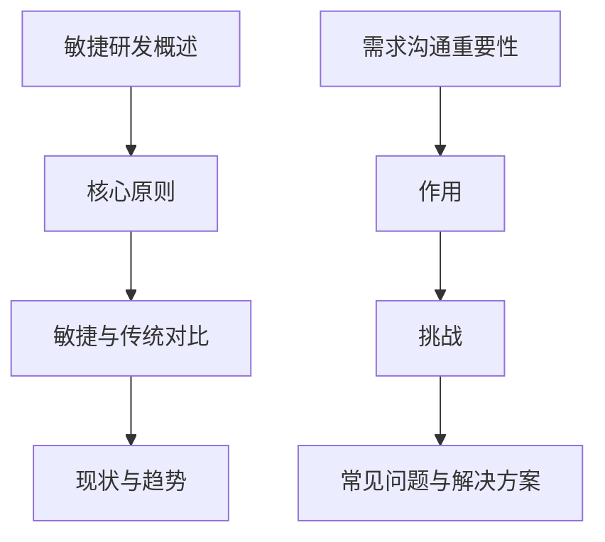

                 

### 《敏捷研发中的需求沟通渠道多样化》

关键词：敏捷研发、需求沟通、沟通渠道、口头沟通、书面沟通、虚拟沟通、社交沟通

摘要：在敏捷研发的过程中，需求沟通的质量和效率对项目成功与否起着决定性的作用。本文将深入探讨敏捷研发中需求沟通的重要性，分析多样化的沟通渠道，包括口头沟通、书面沟通、虚拟沟通和社交沟通等，并提供评估沟通有效性的方法与优化策略。

---

### 第一部分：敏捷研发与需求沟通

#### 第1章：敏捷研发概述

##### 1.1 敏捷方法的核心原则

敏捷研发是一种应对快速变化的需求的软件开发方法。其核心原则包括：

1. **个体和互动胜过过程和工具**：强调团队成员之间的互动和沟通的重要性。
2. **可工作的软件胜过详尽的文档**：文档应当是为了帮助沟通，而不是取代沟通。
3. **客户合作胜过合同谈判**：持续与客户沟通，确保软件能满足客户的需求。
4. **响应变化胜过遵循计划**：灵活应对变化，而不是严格遵循计划。

##### 1.2 敏捷研发与传统研发的对比

传统研发方法通常遵循瀑布模型，而敏捷研发则更灵活，具有以下特点：

1. **迭代开发**：项目被分为多个迭代周期，每个迭代都会交付一个可工作的软件版本。
2. **持续集成**：代码频繁集成，确保快速发现问题。
3. **团队协作**：团队成员角色更加灵活，协作更紧密。

##### 1.3 敏捷研发的现状与趋势

随着全球软件行业的快速发展，敏捷方法已经成为主流研发方式。越来越多的组织开始采用敏捷实践，以提升研发效率和产品质量。未来，敏捷方法将继续融合新的技术和工具，如DevOps、AI等，推动研发流程的进一步优化。

#### 第2章：需求沟通的重要性

##### 2.1 需求沟通的作用

需求沟通是敏捷研发的核心，其作用包括：

1. **明确需求**：确保团队理解并能够实现客户的需求。
2. **促进协作**：加强团队内部和与客户的沟通，提高协作效率。
3. **降低风险**：及时识别和解决潜在的问题，降低项目风险。

##### 2.2 需求沟通的挑战

在敏捷研发中，需求沟通面临以下挑战：

1. **需求变更**：客户需求的不确定性和快速变化使得沟通更加复杂。
2. **沟通渠道多样化**：需要选择合适的沟通渠道以满足不同场景的需求。
3. **沟通障碍**：团队成员之间可能存在的语言、文化和背景差异导致沟通障碍。

##### 2.3 需求沟通的常见问题与解决方案

常见问题包括需求理解不一致、信息传递错误、沟通不及时等。解决方案包括：

1. **定期需求评审**：确保需求得到准确理解和记录。
2. **使用统一的沟通平台**：如项目管理工具、邮件等，提高信息传递的效率。
3. **建立沟通机制**：如每日站会、迭代回顾等，确保沟通的持续性和有效性。

---

以上是第一部分的内容，接下来将详细探讨多样化的需求沟通渠道。在接下来的章节中，我们将逐一分析口头沟通、书面沟通、虚拟沟通和社交沟通等渠道的优缺点、应用场景和实践技巧。

---

**Mermaid 流程图：**


---

**Python 源代码：**
```python
# 示例：敏捷方法的核心原则
principles = [
    "个体和互动胜过过程和工具",
    "可工作的软件胜过详尽的文档",
    "客户合作胜过合同谈判",
    "响应变化胜过遵循计划"
]

for principle in principles:
    print(f"- {principle}")
```

---

**LaTeX 公式：**
$$
\text{需求沟通质量} = f(\text{沟通渠道}, \text{沟通频率}, \text{沟通反馈})
$$

---

在接下来的章节中，我们将逐步深入探讨敏捷研发中的多样化需求沟通渠道，为读者提供实用的沟通策略和实践技巧。敬请期待！

---

**作者：AI天才研究院/AI Genius Institute & 禅与计算机程序设计艺术 /Zen And The Art of Computer Programming**

