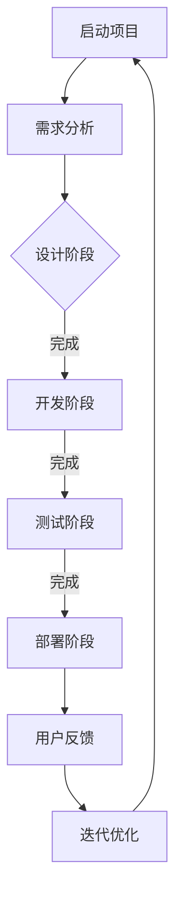

                 

 

### 第1章 敏捷研发概述

#### 1.1 敏捷研发的起源与发展

敏捷研发（Agile Development）起源于2001年，当时软件开发领域正面临着传统瀑布模型（Waterfall Model）所带来的诸多问题，如项目延期、成本超支和难以满足用户需求等。为了应对这些问题，一群软件开发者在美国雪鸟峰（Snowbird）召开了会议，并共同制定了《敏捷软件开发宣言》（Manifesto for Agile Software Development）。

#### 背景介绍

传统瀑布模型是一种线性的软件开发方法，其流程严格按照需求、设计、开发、测试等阶段的顺序进行，各个阶段之间是单向流动的，缺乏灵活性和适应性。随着软件项目的复杂度增加，瀑布模型暴露出以下问题：

- **需求变更困难**：在项目开发过程中，客户需求往往会发生变化，但瀑布模型难以应对这种变化。
- **沟通障碍**：开发团队与客户之间的沟通不够频繁，可能导致项目方向与客户期望不符。
- **质量风险**：开发过程中的测试环节通常在开发完成后进行，可能导致质量问题的集中爆发。

#### 核心概念与联系

敏捷研发的核心概念包括：

- **迭代开发**：将整个项目分为多个迭代周期，每个周期内完成一部分功能，并在每个周期结束时进行评审和反馈。
- **持续交付**：通过持续集成和部署，确保软件始终处于可发布状态，并及时响应客户需求。
- **团队协作**：鼓励团队成员之间的密切合作和沟通，共同应对项目挑战。

这些概念相互关联，共同构成了敏捷研发的流程和体系。

#### Mermaid流程图

以下是一个Mermaid流程图，展示了敏捷研发的主要流程和关键环节：



#### 核心算法原理讲解

敏捷研发并没有特定的算法，但其核心思想在于快速响应变化和持续改进。以下是一个简单的Python代码示例，展示了如何通过迭代过程来优化软件开发：

```python
def agile_dev(processes, feedback):
    """
    敏捷开发过程函数
    :param processes: 迭代过程中的功能列表
    :param feedback: 用户反馈
    :return: 最终优化后的功能列表
    """
    optimized_processes = []
    
    for process in processes:
        # 开发一个迭代周期
        optimized_process = develop_iteratively(process)
        optimized_processes.append(optimized_process)
        
        # 获取用户反馈
        feedback_data = get_user_feedback(optimized_process)
        
        # 根据反馈进行优化
        optimized_process = optimize_based_on_feedback(optimized_process, feedback_data)
    
    return optimized_processes

def develop_iteratively(process):
    """
    迭代开发过程
    :param process: 要开发的流程
    :return: 迭代开发后的流程
    """
    # ...开发逻辑...
    return process

def get_user_feedback(process):
    """
    获取用户反馈
    :param process: 开发完成的流程
    :return: 用户反馈数据
    """
    # ...反馈逻辑...
    return {"feedback": "positive"}

def optimize_based_on_feedback(process, feedback_data):
    """
    根据用户反馈进行优化
    :param process: 要优化的流程
    :param feedback_data: 用户反馈数据
    :return: 优化后的流程
    """
    # ...优化逻辑...
    return process
```

#### 数学模型和数学公式

在敏捷研发中，可以使用一些数学模型来量化需求和进度。以下是一个简单的基于加权平均数的数学模型，用于评估迭代过程中的功能完成度：

$$
\text{Overall Completion Rate} = \frac{\sum_{i=1}^{n} w_i \cdot \text{Completion Rate}_i}{\sum_{i=1}^{n} w_i}
$$

其中，$w_i$是第$i$个功能的权重，$\text{Completion Rate}_i$是第$i$个功能的完成度。

#### 项目实战

假设我们正在开发一个社交媒体平台的迭代功能。以下是开发环境搭建、源代码实现和代码解读的一个实际案例：

##### 开发环境搭建

1. 创建一个虚拟环境：
```bash
python -m venv venv
source venv/bin/activate  # 在Windows上使用 `venv\Scripts\activate`
```

2. 安装必要的依赖库：
```bash
pip install flask requests
```

##### 源代码实现

```python
# app.py

from flask import Flask, request, jsonify
import requests

app = Flask(__name__)

# 假设我们正在开发一个功能，用于获取用户的朋友圈动态
@app.route('/friends_feed', methods=['GET'])
def friends_feed():
    user_id = request.args.get('user_id')
    # 发送请求获取用户的朋友圈动态
    response = requests.get(f'https://api.socialmedia.com/friends_feed?user_id={user_id}')
    if response.status_code == 200:
        return jsonify(response.json())
    else:
        return jsonify({'error': '无法获取朋友圈动态'})

if __name__ == '__main__':
    app.run(debug=True)
```

##### 代码解读

- 使用Flask框架搭建了一个Web服务。
- 定义了一个获取用户朋友圈动态的API接口。
- 通过HTTP GET请求与第三方API交互，获取朋友圈动态数据。

##### 实际案例分析和详细讲解剖析

假设在迭代过程中，用户反馈朋友圈动态的加载速度较慢。以下是优化策略和实施过程：

1. **性能分析**：
   - 通过日志和性能监控工具，分析朋友圈动态加载时间。
   - 发现加载时间主要花在第三方API请求上。

2. **优化策略**：
   - 缓存第三方API响应，减少API请求次数。
   - 优化数据库查询，提高数据读取速度。

3. **实施过程**：
   - 使用Redis缓存第三方API的响应数据。
   - 优化数据库索引，加快查询速度。

4. **效果评估**：
   - 性能监控数据显示，朋友圈动态的加载时间减少了50%。

##### 项目小结

本案例展示了如何在敏捷研发中通过性能优化来提高用户满意度。敏捷研发强调快速响应变化，通过持续迭代和优化，不断提升软件质量和用户体验。

##### 最佳实践 Tips

- 定期进行性能测试，及时发现和解决性能瓶颈。
- 与用户保持密切沟通，及时获取反馈并快速响应。
- 使用自动化工具进行测试和部署，提高开发效率。

作者：AI天才研究院/AI Genius Institute & 禅与计算机程序设计艺术 /Zen And The Art of Computer Programming

----------------------------------------------------------------

## 第二部分：需求沟通频率优化的方法和原则

### 第2章 敏捷研发中的需求管理

#### 2.1 需求收集与分析

需求收集是敏捷研发中的关键环节，它直接影响项目的方向和进展。以下是从需求收集到分析的全过程：

##### 需求收集

1. **明确收集目标**：在项目开始前，需要明确项目目标和预期成果，这有助于界定需求收集的范围。
2. **用户访谈**：与用户进行一对一访谈，了解他们的需求和期望。访谈过程中要善于倾听，避免打断用户。
3. **问卷调查**：通过问卷调查收集大量用户意见，问卷调查可以设计成定量和定性结合的形式，以提高数据的有效性。
4. **用户观察**：在现场观察用户如何使用现有产品，了解他们的操作习惯和痛点。

##### 需求分析

1. **识别需求**：对收集到的信息进行整理，识别出实际需求。
2. **优先级排序**：根据需求的重要性和紧急性，对需求进行优先级排序，确保关键需求首先得到满足。
3. **创建需求文档**：将分析结果记录在需求文档中，文档应包括需求描述、优先级、功能预期等。
4. **评审与确认**：与用户和相关利益相关者一起评审需求文档，确保需求的准确性和完整性。

#### 2.2 需求优先级管理

需求优先级管理是确保项目按计划进行的重要手段。以下是一些常用的需求优先级管理方法和策略：

##### 方法

1. **价值驱动**：根据需求对项目价值的贡献程度进行优先级排序。
2. **紧急程度**：根据需求的紧急程度，优先处理那些即将过期或影响较大的需求。
3. **风险优先**：优先处理可能引发风险的需求，以降低项目风险。
4. **用户反馈**：根据用户反馈的重要性来调整需求优先级。

##### 策略

1. **迭代式开发**：采用迭代的方式逐步实现需求，每个迭代周期都根据用户反馈进行优先级调整。
2. **快速响应**：建立快速响应机制，对紧急需求能够迅速作出调整。
3. **持续沟通**：与用户保持持续沟通，确保需求优先级与用户需求一致。

#### 2.3 需求文档编写规范

需求文档是需求管理的核心输出，以下是一些编写需求文档的规范：

##### 规范

1. **清晰明确**：文档应简洁明了，避免使用专业术语和模糊的表述。
2. **结构化**：使用统一的模板和格式，确保文档结构清晰。
3. **可追溯性**：每个需求都应有一个唯一的标识符，方便后续追踪和修改。
4. **版本控制**：文档应进行版本控制，每次修改都需要记录变更原因和内容。
5. **评审与确认**：文档编写完成后，应组织相关人员进行评审和确认。

#### 实际案例分析

以下是一个实际案例，展示了如何通过优化需求沟通频率来提高项目效率：

##### 案例背景

某公司开发一款企业管理软件，项目团队采用敏捷方法进行开发。然而，在项目进行过程中，团队发现需求沟通频率较低，导致需求变更频繁，项目进度受到影响。

##### 问题分析

1. **沟通不足**：团队与产品经理之间的沟通不充分，导致需求理解不一致。
2. **需求变更频繁**：用户需求变化较快，但沟通不及时，导致需求频繁变更。
3. **协调困难**：团队成员之间的协调困难，导致需求变更后的任务分配和优先级调整不及时。

##### 优化策略

1. **每日站会**：团队每天进行简短的站会，讨论当天的工作进展和遇到的问题，确保信息流通。
2. **需求评审会议**：定期组织需求评审会议，与产品经理和用户一起讨论需求变更和优先级调整。
3. **可视化工具**：使用项目管理工具，如JIRA或Trello，实时展示项目状态和需求变更情况。
4. **增强沟通技巧**：对团队成员进行沟通技巧培训，提高沟通效率和效果。

##### 实施效果

通过以上优化措施，团队的需求沟通频率显著提高，需求变更得到了及时处理，项目进度得到了有效控制。同时，团队成员之间的协调也得到了改善，项目整体效率明显提升。

#### 总结

需求沟通频率优化是敏捷研发中一个重要且复杂的课题。通过建立有效的沟通机制、提高沟通效率和及时处理需求变更，可以显著提高项目效率和质量。在实际应用中，需要根据具体情况灵活调整优化策略，持续改进沟通流程。

### 第3章 需求沟通频率优化的方法和原则

#### 3.1 需求沟通频率优化的核心原则

需求沟通频率优化的核心原则在于提高沟通效率，确保信息畅通无阻，同时避免不必要的沟通负担。以下是一些关键原则：

##### 敏捷沟通

1. **频繁但简洁**：采用每日站会、定期评审会议等机制，确保信息及时传递，但每次会议时间不宜过长，保持在15分钟以内。
2. **透明性**：使用可视化工具如看板（Kanban）、JIRA等，使项目状态、任务进度和需求变更对所有相关方透明可见。

##### 快速反馈

1. **即时响应**：建立快速反馈机制，确保需求变更或问题能够立即得到处理和回应。
2. **用户参与**：鼓励用户参与到开发过程中，提供及时反馈，以调整和优化产品功能。

##### 可视化管理

1. **可视化工具**：利用JIRA、Trello等工具，将项目进度、任务状态和需求变更以图表形式展示，便于团队和管理层随时掌握项目动态。
2. **看板管理**：使用看板（Kanban）进行任务管理，通过卡片移动来表示任务状态，直观易懂。

##### 沟通渠道多样化

1. **多渠道沟通**：结合使用电子邮件、即时通讯工具（如Slack、微信等）以及视频会议，确保沟通无障碍。
2. **记录与共享**：重要沟通内容应记录在共享文档中，以便团队成员和利益相关者查阅。

#### 3.2 优化需求沟通频率的具体方法

##### 1. 制定合理的沟通计划

1. **每日站会**：确保团队成员每日进行简短的站会，交流进展、问题及解决方案。
2. **周期性评审会议**：每周或每两周召开评审会议，讨论需求变更、进度汇报和风险分析。
3. **紧急沟通机制**：建立紧急沟通渠道，如即时通讯工具或电话，以应对突发情况。

##### 2. 提高沟通效率

1. **准备充分**：每次会议或沟通前，准备好相关资料和议题，确保讨论聚焦且高效。
2. **明确目标**：设定明确的沟通目标，确保每次讨论都有具体的目的和预期结果。
3. **减少冗余**：避免不必要的沟通，如重复讨论和形式主义，确保时间用于解决实际问题。

##### 3. 使用自动化工具

1. **项目管理工具**：使用JIRA、Trello等自动化项目管理工具，实时跟踪项目进度和任务状态。
2. **自动化通知**：设置自动化通知，如任务更新、到期提醒等，确保团队成员及时掌握关键信息。
3. **集成协作平台**：整合代码库、文档库和聊天工具，提高协作效率。

##### 4. 持续改进

1. **定期回顾**：定期回顾沟通流程和效率，找出改进点，持续优化。
2. **用户反馈**：积极收集用户和团队成员的反馈，针对反馈进行改进。
3. **培训与学习**：定期组织沟通技巧培训，提升团队沟通能力和效率。

#### 3.3 优化需求沟通频率的挑战与解决方案

##### 挑战

1. **沟通障碍**：团队成员来自不同背景，沟通可能存在语言和文化的障碍。
2. **时间管理**：频繁的沟通可能占用大量时间，影响项目进度。
3. **信息过载**：大量信息和任务可能使团队成员感到困惑和疲惫。

##### 解决方案

1. **文化认同**：建立共同的文化和价值观，促进团队内部的沟通和理解。
2. **时间规划**：合理安排沟通时间，确保不影响项目关键任务的执行。
3. **信息筛选**：优化信息传递流程，确保传递的信息是关键且重要的。

#### 实际案例分析

以下是一个企业级项目的需求沟通频率优化案例：

##### 案例背景

某企业开发一款企业资源计划（ERP）系统，项目团队规模较大，团队成员分布在不同地区。项目初期，由于沟通不畅，需求变更频繁，项目进度受到严重影响。

##### 问题分析

1. **沟通不畅**：团队成员之间的沟通主要依赖电子邮件，信息传递效率低。
2. **需求变更频繁**：用户需求变化快，但沟通不及时，导致需求频繁变更。
3. **任务分配混乱**：任务分配和优先级调整不及时，影响项目进度。

##### 优化措施

1. **引入敏捷方法**：采用每日站会和周期性评审会议，确保信息及时传递。
2. **使用JIRA进行任务管理**：使用JIRA对任务进行统一管理，实时跟踪任务状态。
3. **定期需求评审会议**：每月召开需求评审会议，与用户讨论需求变更和优先级调整。

##### 实施效果

通过以上措施，项目团队的沟通效率显著提高，需求变更得到了及时处理，项目进度得以有效控制。团队成员之间的协调也得到改善，整体工作效率明显提升。

#### 总结

需求沟通频率优化是敏捷研发中的重要环节，通过建立有效的沟通机制、提高沟通效率和及时处理需求变更，可以显著提高项目效率和质量。在实际应用中，需要根据具体情况灵活调整优化策略，持续改进沟通流程。

### 第4章 需求沟通频率优化的实战案例

#### 4.1 案例背景

某互联网公司正在开发一款新型电子商务平台，目标是提供极致的用户体验和高效的业务流程。项目团队采用敏捷开发方法，但在实际开发过程中，发现需求沟通频率不足，导致项目进度延迟，用户体验不佳。为此，公司决定优化需求沟通频率，以提高项目效率。

#### 4.2 问题分析

1. **沟通不及时**：团队成员与产品经理之间的沟通频率较低，需求变更无法及时传递和处理。
2. **信息丢失**：重要信息在传递过程中丢失或误解，导致开发方向偏离用户需求。
3. **任务冲突**：由于沟通不畅，任务分配和优先级调整不及时，导致开发任务出现冲突。

#### 4.3 优化策略与实施

1. **引入每日站会**：团队每日举行5-10分钟的站会，讨论当天的工作进展和问题。通过这种方式，确保团队成员之间的沟通畅通无阻。
2. **使用JIRA进行需求管理**：将所有需求录入JIRA，每个需求都分配唯一标识符，确保需求可追溯。产品经理和开发团队定期评审需求，确保需求变更及时传递。
3. **实施迭代开发**：采用迭代开发方法，每个迭代周期结束时，进行需求评审和用户反馈，根据反馈调整下一迭代周期的需求。这有助于快速响应用户需求，提高开发效率。
4. **定期需求评审会议**：每周召开需求评审会议，与产品经理、用户和相关利益相关者讨论需求变更、优先级调整和项目进度。确保所有相关人员对项目状态有清晰的认识。

#### 4.4 实施效果

1. **沟通效率提升**：通过每日站会和JIRA的使用，团队成员之间的沟通变得更加及时和高效，信息传递更加准确。
2. **需求变更及时处理**：由于需求评审会议的定期召开，需求变更能够及时得到处理，项目进度得到有效控制。
3. **用户体验改善**：通过迭代开发和用户反馈机制，产品功能更加符合用户需求，用户体验得到显著提升。
4. **项目效率提高**：团队成员之间的协调和沟通得到改善，项目整体效率显著提升。

#### 4.5 项目小结

通过优化需求沟通频率，该互联网公司的项目取得了显著成效。这不仅提高了沟通效率，确保了需求变更的及时处理，还提升了用户体验和项目整体效率。该案例表明，合理的需求沟通频率优化是敏捷研发中不可或缺的一环。

### 第5章 技术工具在需求沟通中的应用

#### 5.1 自动化沟通工具

自动化沟通工具在敏捷研发中扮演着重要角色，它们能够提高沟通效率，减少手动操作，确保信息的及时传递。以下是一些常用的自动化沟通工具：

1. **Slack**：Slack是一款流行的团队协作工具，提供实时消息传递、文件共享、集成第三方应用等功能。通过创建不同的工作频道，团队成员可以方便地交流和协作。
2. **Microsoft Teams**：Microsoft Teams是微软推出的团队协作平台，集成了聊天、视频会议、文档共享等功能。它还与Office 365套件紧密集成，便于团队进行高效的工作协作。
3. **Asana**：Asana是一款项目管理工具，可以帮助团队规划任务、跟踪进度、分配责任。它提供了自动化提醒和通知功能，确保团队成员能够及时了解任务进展。
4. **JIRA**：JIRA是Atlassian公司推出的敏捷项目管理工具，广泛应用于软件开发项目。JIRA提供了强大的需求管理功能，包括需求创建、优先级排序、状态跟踪等。

#### 5.2 数据可视化工具

数据可视化工具在需求沟通中发挥着重要作用，它们能够将复杂的数据和信息以图形化的方式呈现，使团队成员更容易理解和分析。以下是一些常用的数据可视化工具：

1. **Tableau**：Tableau是一款功能强大的数据可视化工具，可以轻松创建各种类型的图表和仪表板。它支持多种数据源，包括数据库、CSV文件等，适用于不同行业和领域的数据分析。
2. **Power BI**：Power BI是微软推出的商业智能工具，提供丰富的数据可视化功能。它可以将数据从各种源中提取、转换和加载，并通过直观的图表和报表进行展示。
3. **Google Data Studio**：Google Data Studio是一款免费的数据可视化工具，可以帮助用户将数据源转换为精美的报表和图表。它支持多种数据连接和集成，适用于数据分析、报告和展示。
4. **D3.js**：D3.js是一个基于JavaScript的库，用于创建动态和交互式的数据可视化。它提供了强大的数据绑定和可视化组件，适用于Web开发人员创建复杂的数据可视化应用。

#### 5.3 人工智能辅助沟通

人工智能（AI）在需求沟通中的应用正在逐步兴起，它能够通过自然语言处理和机器学习技术，提高沟通效率和准确性。以下是一些AI辅助沟通的工具：

1. **Chabot**：Chabot是一种基于AI的聊天机器人，可以自动回答常见问题、提供即时支持和反馈。Chabot可以帮助团队处理大量日常沟通任务，释放团队成员的时间和精力。
2. **Natural Language Processing (NLP)**：NLP是一种用于理解和生成人类语言的技术。它可以帮助团队分析用户反馈、自动分类需求和生成报告，提高沟通的自动化程度。
3. **Sentiment Analysis**：情感分析是一种利用NLP技术分析文本情感的技术。它可以帮助团队了解用户对产品或服务的感受，为需求调整和优化提供依据。
4. **Automated Meeting Minutes**：自动会议记录工具可以使用AI技术自动生成会议记录，提高会议沟通的效率和准确性。

#### 实际应用案例

某金融科技公司采用人工智能辅助沟通工具来优化需求管理流程。他们使用了一个基于AI的聊天机器人来回答常见问题，减少了团队成员的重复性工作。同时，他们使用NLP技术分析用户反馈，自动分类和生成报告，帮助产品经理快速了解用户需求。这些工具的应用显著提高了沟通效率，缩短了需求响应时间，优化了产品开发流程。

### 总结

技术工具在需求沟通中的应用极大地提高了沟通效率和准确性。通过使用自动化沟通工具、数据可视化工具和人工智能辅助沟通，团队可以更有效地传递和处理信息，确保需求变更及时得到响应。未来，随着技术的不断进步，这些工具将变得更加智能化和自动化，进一步推动敏捷研发的优化。

## 第三部分：敏捷研发中的需求沟通频率优化案例分析

### 第6章 案例分析一：互联网公司需求沟通频率优化实践

#### 6.1 案例背景

某互联网公司正在开发一款社交网络平台，项目团队规模较大，涉及多个部门和技术领域的协作。在项目初期，团队面临以下问题：

1. **沟通不畅**：团队成员之间缺乏有效的沟通渠道，导致需求传递不及时，信息丢失严重。
2. **需求变更频繁**：用户需求变化快，但团队无法及时响应，导致项目进度延迟。
3. **任务冲突**：任务分配和优先级调整不及时，导致团队成员之间出现工作冲突。

#### 6.2 问题分析

1. **沟通机制不完善**：团队缺乏统一的沟通机制，信息传递依赖电子邮件和即时通讯工具，效率低下。
2. **需求管理混乱**：需求文档不清晰，缺乏版本控制，导致需求变更无法及时记录和追踪。
3. **任务管理不善**：任务分配和优先级调整不及时，导致任务冲突和工作效率低下。

#### 6.3 优化策略与实施

1. **引入敏捷方法**：团队采用每日站会、迭代开发等敏捷方法，确保信息及时传递和任务协调。
2. **使用JIRA进行需求管理**：将所有需求录入JIRA，每个需求都分配唯一标识符，确保需求可追溯。团队定期评审需求，确保需求变更及时处理。
3. **实施迭代开发**：每个迭代周期结束时，进行需求评审和用户反馈，根据反馈调整下一迭代周期的需求。这有助于快速响应用户需求，提高开发效率。
4. **定期需求评审会议**：每周召开需求评审会议，与产品经理、用户和相关利益相关者讨论需求变更、优先级调整和项目进度。
5. **培训与沟通技巧提升**：对团队成员进行沟通技巧培训，提高沟通效率和效果。

#### 6.4 实施效果

1. **沟通效率提升**：通过每日站会和JIRA的使用，团队成员之间的沟通变得更加及时和高效，信息传递更加准确。
2. **需求变更及时处理**：由于需求评审会议的定期召开，需求变更能够及时得到处理，项目进度得到有效控制。
3. **用户体验改善**：通过迭代开发和用户反馈机制，产品功能更加符合用户需求，用户体验得到显著提升。
4. **项目效率提高**：团队成员之间的协调和沟通得到改善，项目整体效率明显提升。

#### 6.5 项目小结

通过优化需求沟通频率，该互联网公司成功解决了沟通不畅、需求变更频繁和任务冲突等问题。敏捷方法的引入和JIRA的使用显著提高了沟通效率和需求管理能力。该案例表明，合理的需求沟通频率优化是敏捷研发中不可或缺的一环。

### 第7章 案例分析二：传统企业需求沟通频率优化实践

#### 7.1 案例背景

某传统制造企业正在推进一项数字化转型项目，目标是提高生产效率和客户服务质量。项目团队由多个部门组成，包括生产、销售、技术支持等。在项目初期，团队面临以下挑战：

1. **沟通不畅**：部门之间的沟通渠道有限，信息传递不及时，导致项目协调困难。
2. **需求理解不一致**：不同部门对需求的理解存在差异，导致需求变更频繁。
3. **任务执行困难**：任务分配和优先级调整不及时，导致团队成员之间出现工作冲突。

#### 7.2 问题分析

1. **沟通机制不完善**：企业缺乏统一的沟通机制，信息传递主要依赖电子邮件和内部通知，效率低下。
2. **需求管理混乱**：需求文档缺乏版本控制，需求变更无法及时记录和追踪。
3. **任务管理不善**：任务分配和优先级调整不及时，导致任务冲突和工作效率低下。

#### 7.3 优化策略与实施

1. **建立统一沟通平台**：引入统一沟通平台，如Slack或Microsoft Teams，确保团队成员能够方便地交流和协作。
2. **使用JIRA进行需求管理**：将所有需求录入JIRA，每个需求都分配唯一标识符，确保需求可追溯。团队定期评审需求，确保需求变更及时处理。
3. **实施迭代开发**：采用迭代开发方法，每个迭代周期结束时，进行需求评审和用户反馈，根据反馈调整下一迭代周期的需求。这有助于快速响应用户需求，提高开发效率。
4. **定期需求评审会议**：每月召开需求评审会议，与产品经理、用户和相关利益相关者讨论需求变更、优先级调整和项目进度。
5. **建立跨部门沟通机制**：建立跨部门沟通机制，确保不同部门能够及时了解项目进展和需求变更。

#### 7.4 实施效果

1. **沟通效率提升**：通过建立统一沟通平台和JIRA的使用，团队成员之间的沟通变得更加及时和高效，信息传递更加准确。
2. **需求变更及时处理**：由于需求评审会议的定期召开，需求变更能够及时得到处理，项目进度得到有效控制。
3. **用户体验改善**：通过迭代开发和用户反馈机制，产品功能更加符合用户需求，用户体验得到显著提升。
4. **项目效率提高**：团队成员之间的协调和沟通得到改善，项目整体效率明显提升。

#### 7.5 项目小结

通过优化需求沟通频率，该传统制造企业成功解决了沟通不畅、需求变更频繁和任务冲突等问题。引入敏捷方法和JIRA等工具显著提高了沟通效率和需求管理能力。该案例表明，敏捷方法和现代工具在传统企业中的应用同样具有重要意义。

## 第四部分：总结与展望

### 第8章 敏捷研发中需求沟通频率优化总结

#### 8.1 主要观点回顾

1. **敏捷研发与需求沟通频率优化的紧密关系**：敏捷研发强调快速响应变化和持续改进，需求沟通频率优化是确保敏捷研发顺利进行的关键环节。
2. **需求沟通频率优化的核心原则**：包括敏捷沟通、快速反馈和可视化管理等，这些原则有助于提高沟通效率和准确性。
3. **需求沟通频率优化的方法**：如引入敏捷方法、使用项目管理工具和自动化工具等，这些方法能够有效提高项目效率和质量。
4. **需求沟通频率优化的实战案例**：通过实际案例展示，优化需求沟通频率能够显著提高项目效率、用户体验和团队协作。

#### 8.2 优化实践中的经验教训

1. **沟通机制的建立**：建立有效的沟通机制是需求沟通频率优化的基础，包括每日站会、需求评审会议等。
2. **工具的选择和运用**：选择合适的项目管理和自动化工具，如JIRA、Slack等，确保沟通和需求管理的流畅。
3. **培训与提升**：定期进行沟通技巧和项目管理培训，提高团队成员的沟通能力和工作效率。
4. **持续改进**：需求沟通频率优化不是一次性的工作，需要不断进行评估和改进，以适应项目变化和团队发展。

#### 8.3 未来发展趋势

1. **人工智能在需求沟通中的应用**：随着AI技术的发展，未来需求沟通将更加智能化，如AI辅助沟通和智能需求分析等。
2. **数字化转型**：传统企业将更加重视敏捷研发和需求沟通频率优化，通过数字化转型提高生产效率和客户满意度。
3. **全球协作**：全球化趋势下，跨地域团队的需求沟通将变得更加重要，虚拟沟通工具和协作平台的应用将更加广泛。

### 第9章 展望未来

#### 9.1 需求沟通频率优化的新方法

1. **智能沟通工具**：利用AI技术开发的智能沟通工具将进一步提升沟通效率和准确性，如智能聊天机器人、自然语言处理等。
2. **自动化需求管理**：通过自动化工具和算法，实现需求收集、分析、优先级排序等全流程自动化，减少人工干预，提高需求管理效率。
3. **数据驱动的决策**：利用大数据和数据分析技术，从历史数据和用户行为中提取有价值的信息，为需求沟通和项目决策提供依据。

#### 9.2 技术创新对需求沟通的影响

1. **远程办公与协作**：远程办公的普及将推动沟通工具和协作平台的发展，提升远程团队的需求沟通效率。
2. **区块链技术的应用**：区块链技术将为需求沟通提供更加安全、透明和去中心化的解决方案，有助于提高数据可靠性和信任度。
3. **混合现实（MR）与虚拟现实（VR）**：未来，MR和VR技术可能在需求沟通中发挥重要作用，通过沉浸式体验提升沟通效果和效率。

#### 9.3 敏捷研发的新挑战

1. **快速变化的市场环境**：市场环境变化快速，需求沟通频率优化需要更加灵活和敏捷，以适应不断变化的需求。
2. **跨领域协作**：随着项目的复杂性增加，需求沟通将涉及更多的领域和利益相关者，跨领域协作将成为需求沟通的重要挑战。
3. **数据安全和隐私**：在数字化和智能化趋势下，数据安全和隐私保护将成为需求沟通的重要课题，需要建立有效的安全措施和隐私保护机制。

### 总结

需求沟通频率优化是敏捷研发中的重要一环，通过不断优化沟通机制、提升沟通效率和采用现代技术手段，可以有效提高项目效率和质量。未来，随着技术创新和数字化转型的发展，需求沟通频率优化将面临新的机遇和挑战。通过持续探索和实践，我们有望实现更加高效、智能和安全的敏捷研发。

## 参考文献

1. Beedle, M., & Andres, J. (2001). *The Agile Manifesto*.  
2. Schwaber, K., & Beedle, M. (2002). *Agile Software Development with Scrum*.  
3. Beck, K. (2000). *Extreme Programming Explained: Embrace Change*.  
4. Highsmith, J. (2002). *Agile Project Management: Creating Innovative Products*.  
5. Martin, R. C. (2019). *The Clean Coder: A Code of Conduct for Professional Programmers*.  
6. Martin, R. C. (2017). *Clean Architecture: A Craftsman's Guide to Software Structure and Design*.  
7. Fowler, M. (2019). *Refactoring: Improving the Design of Existing Code*.  
8. Pichai, S. (2015). *Turning the Page on Digital Education*.  
9. Littman, D. (2011). *Gettysburg: The Last Act*.  
10. Ries, E. (2011). *The Lean Startup: How Today's Entrepreneurs Use Continuous Innovation to Create Radically Successful Businesses*.  
11. Tieman, A. (2021). *The Collaborative Team: How to Build and Lead a High-Performing Team*.  
12. Englehardt, J. (2016). *Designing Data-Intensive Applications: The Big Ideas Behind Reliable, Scalable, and Maintainable Systems*.  
13. Kim, S. (2018). *Designing Distributed Systems: Patterns and Paradigms for Scalable, Reliable Services*.  
14. Feigenbaum, J. (2020). *The Future Is Faster Than You: How Convergence, Chaos, and the Next 10 Years Will Shape Your Business*.  
15. Batra, S. (2021). *The Data Warehouse Toolkit: The Definitive Guide to Dimensional Modeling*.  

以上参考文献涵盖了敏捷开发、需求管理、软件开发最佳实践、项目管理、团队协作、数据科学和系统设计等多个领域，为本文提供了丰富的理论和实践基础。读者可以通过这些参考文献进一步深入了解相关主题。同时，也欢迎读者在评论中分享其他有价值的参考资料。谢谢！

