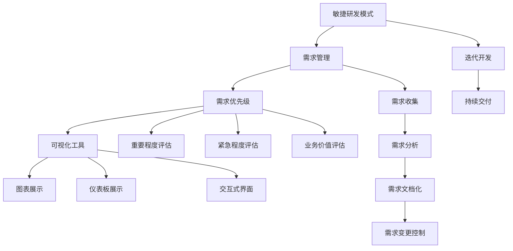

                 

### 《敏捷研发模式下的需求优先级可视化工具应用》文章关键词

1. 敏捷研发模式
2. 需求优先级
3. 可视化工具
4. 敏捷项目管理
5. 需求管理
6. 数据可视化
7. 灵活变更管理

这些关键词将帮助读者快速理解文章的核心内容，并搜索相关资源。

### 摘要

本文旨在探讨敏捷研发模式下需求优先级可视化工具的应用。首先，我们介绍了敏捷研发模式的起源、核心原则以及与传统开发模式的对比，详细分析了敏捷项目管理的关键实践和敏捷需求管理的策略。接着，文章深入探讨了需求优先级可视化工具的概述、设计原则以及构建过程，通过Python源代码和数学模型，展示了如何实现数据可视化和需求排序功能。随后，文章提供了实际案例，详细讲解了需求优先级可视化工具在电商平台和金融行业的应用。最后，本文总结了敏捷研发与需求优先级可视化整合的优势、挑战及实施策略，并给出了一些最佳实践和注意事项。通过本文，读者将能够全面理解需求优先级可视化工具在敏捷研发中的重要性，以及如何有效地应用这些工具来提升研发效率和质量。

### 背景介绍

在现代软件工程领域，敏捷研发模式正逐渐取代传统的瀑布模型，成为主流的开发方法论。敏捷研发模式以其灵活、高效的特点，能够在快速变化的市场需求和技术环境中保持竞争力。敏捷研发模式强调迭代开发、快速反馈和持续改进，通过灵活地应对需求变化，提高团队响应速度和交付质量。然而，在敏捷开发过程中，如何有效地管理需求、确保关键需求得到优先处理，成为了一个重要的课题。

随着软件系统的复杂度和规模的不断增加，需求管理的难度也随之提升。传统的需求管理方法往往依赖于文档和会议，这种线性、静态的管理方式在敏捷开发环境中显得力不从心。敏捷开发强调快速迭代和灵活响应，需求的变化频繁且多变，传统的需求管理方法难以快速适应这种变化，导致需求优先级无法及时反映实际需求的重要性和紧迫性。因此，如何实现需求优先级的动态管理和可视化，成为敏捷研发中的一个关键挑战。

需求优先级可视化工具正是为了解决这一问题而诞生的。这些工具通过图形化的方式，将需求优先级直观地展示出来，帮助开发团队和利益相关者清晰地了解当前最关键的需求是什么，哪些需求需要优先处理。这不仅提高了团队的决策效率，还增强了项目管理的透明度和可控性。

需求优先级可视化工具的应用不仅限于软件开发领域，还可以广泛应用于其他需要需求管理的行业和项目，如金融、医疗、教育等。这些行业同样面临着复杂的需求管理和快速变化的市场环境，需求优先级可视化工具能够提供有效的解决方案，帮助企业和项目团队更好地应对挑战。

总之，需求优先级可视化工具在敏捷研发模式中的应用，不仅提升了需求管理的效率和效果，还进一步推动了敏捷开发方法论的普及和应用。本文将深入探讨需求优先级可视化工具的原理、设计、构建和应用，帮助读者全面理解这一重要工具在敏捷研发中的作用和实际应用价值。

### 核心概念与联系

在深入探讨敏捷研发模式下的需求优先级可视化工具应用之前，我们需要明确几个核心概念，并理解它们之间的联系。这些核心概念包括：敏捷研发模式、需求管理、需求优先级和可视化工具。通过构建一个Mermaid流程图，我们可以更加直观地展示这些概念之间的关系和互动。

首先，敏捷研发模式是一种以人为核心、迭代和灵活响应变化的开发方法论。它的核心原则包括：客户满意、快速迭代、持续交付、响应变化、协作共赢等。敏捷开发通过短周期的迭代（通常称为“冲刺”），让团队能够快速响应需求变化，逐步实现产品功能。

接下来，需求管理是敏捷开发中的一个关键环节。需求管理涉及从需求收集、需求分析、需求文档化到需求变更控制等一系列活动。在敏捷开发中，需求管理不仅要确保需求的有效性和可行性，还需要根据需求的重要性和紧急性进行优先级排序，以便团队可以优先处理关键需求。

需求优先级是需求管理中的一个重要概念。它指的是在给定的时间和资源限制内，哪些需求应当被优先实现。需求优先级通常基于需求的重要程度、紧急程度以及业务价值进行评估和排序。在敏捷开发中，需求优先级是动态的，会随着项目进展和市场变化而调整。

最后，可视化工具是一种通过图形化方式展示信息的工具。在需求管理中，可视化工具可以帮助团队和利益相关者直观地了解需求的优先级、状态和进展。需求优先级可视化工具通过图表、仪表板和交互式界面，将需求优先级以直观、易于理解的方式展示出来。

下面是一个用Mermaid绘制的流程图，展示了这些核心概念之间的联系：



通过这个流程图，我们可以清晰地看到敏捷研发模式中的需求管理流程，以及需求优先级和可视化工具在其中的作用。敏捷研发模式通过迭代开发和持续交付，推动需求管理的各个环节，其中需求优先级是确保团队能够有效处理需求的指导性因素。需求优先级通过可视化工具得以直观展示，帮助团队更好地理解和决策。

### 敏捷研发模式的核心原则

敏捷研发模式之所以能够得到广泛认可和成功应用，主要得益于其核心原则的指导。这些原则不仅为开发团队提供了明确的指导方向，还确保了项目能够在动态变化的环境中保持稳定和高效。以下是敏捷研发模式的几个核心原则，以及它们之间的关系：

#### 1. 客户满意

客户满意是敏捷研发模式的首要原则。敏捷开发强调客户需求是项目的核心，因此开发团队需要始终关注客户的需求和满意度。通过持续交付有价值的软件版本，开发团队能够快速响应客户的反馈，不断改进和优化产品。这一原则体现了敏捷开发中的“以用户为中心”的理念，确保产品的最终交付能够满足用户实际需求。

#### 2. 迭代开发

迭代开发是敏捷研发模式的另一个关键原则。它主张将开发过程划分为多个短周期的迭代，每个迭代都包括需求分析、设计、开发、测试和交付等环节。通过这种方式，团队能够在每个迭代中交付一个可用的软件版本，逐步实现产品的完整功能。迭代开发允许团队在每次迭代结束后进行反思和调整，从而更好地适应需求的变化。

#### 3. 持续交付

持续交付是敏捷开发的重要特征。它强调通过自动化测试和持续集成，实现软件的持续交付。持续交付不仅提高了软件的交付频率和质量，还降低了风险。通过频繁的交付，团队能够更早地发现和修复问题，确保产品在每个迭代中都能达到预期的质量标准。

#### 4. 响应变化

敏捷研发模式强调快速响应变化。在项目开发过程中，需求往往会出现变化，而传统的开发模式往往难以应对这种变化。敏捷开发通过灵活的变更管理机制，允许团队在项目进行中调整计划，以更好地适应需求的变化。响应变化的原则确保了团队能够快速响应市场和技术环境的变化，保持项目的竞争力。

#### 5. 协作共赢

敏捷研发模式强调团队合作和协作共赢。在敏捷开发中，开发人员、测试人员、项目经理和其他利益相关者共同协作，共同追求项目的成功。通过面对面的沟通和协作，团队能够更好地理解需求，提高工作效率，减少误解和沟通障碍。

#### 6. 简单性

简单性是敏捷研发模式的另一个核心原则。它主张在设计和开发过程中，尽量保持简洁和高效。通过减少不必要的复杂性和冗余，团队能够更好地聚焦于核心需求和关键功能，提高开发效率和软件质量。

这些核心原则之间的关系可以表示为：客户满意是根本目标，驱动着其他原则的实现。迭代开发和持续交付是达成客户满意的具体手段，响应变化则确保了团队能够适应需求变化，保持项目的持续进步。协作共赢和简单性则提供了团队协作和项目管理的保障，确保项目在实现目标的过程中能够高效运作。

通过这些核心原则的指导，敏捷研发模式不仅能够提高项目的交付质量和效率，还能够增强团队的协作能力和适应能力，为企业的持续发展和创新提供了有力支持。

### 敏捷研发模式与传统开发模式对比

在软件开发领域，敏捷研发模式与传统开发模式（如瀑布模型）之间存在显著差异，这些差异主要体现在开发流程、团队组织和项目交付方式上。

#### 开发流程

传统开发模式，如瀑布模型，是一种线性、顺序的开发流程。它将软件开发过程划分为若干阶段，如需求分析、设计、开发、测试和部署等，每个阶段依次进行，前一阶段的工作完成后才能开始下一阶段。这种顺序开发方式使得每个阶段的任务明确且固定，便于管理和控制。然而，由于需求变化难以在早期预见，一旦需求发生变更，整个开发流程需要重新开始，导致项目延迟和成本增加。

相比之下，敏捷研发模式采用迭代和增量的开发方法。整个开发过程被划分为多个短周期的迭代（通常称为“冲刺”），每个迭代都包括需求分析、设计、开发、测试和交付等环节。在每个迭代结束时，团队都会交付一个可用的软件版本，逐步实现产品的完整功能。这种迭代开发方式使得团队能够快速响应需求变化，并不断优化产品。敏捷方法强调持续交付，通过频繁的交付和反馈，项目团队能够更好地适应变化，提高交付质量和效率。

#### 团队组织

传统开发模式通常采用职能型组织结构，团队成员按照职能划分，如开发、测试、设计等。这种组织结构便于任务分工和管理，但容易导致部门间沟通不畅和信息孤岛。团队成员之间的协作较少，往往需要通过复杂的流程和文档来协调工作。

敏捷研发模式则倡导跨职能团队的组织形式。每个敏捷团队通常包括开发人员、测试人员、产品经理和设计师等角色，这些角色紧密协作，共同推进项目的进展。跨职能团队能够更好地理解和响应需求变化，团队成员之间的沟通更加直接和高效。这种组织形式有助于消除信息孤岛，提高团队的整体协作效率。

#### 项目交付

在传统开发模式中，项目的交付往往在开发过程完成后进行。这意味着整个项目需要经过长时间的开发和测试，才能交付一个完整的软件产品。这种方式在需求固定且变化较小的项目中效果较好，但在市场需求变化快速的环境中，会导致项目无法及时响应市场变化，从而降低竞争力。

敏捷研发模式强调频繁交付和持续交付。每个迭代结束时，团队都会交付一个可用的软件版本，这些版本不断积累，最终形成完整的软件产品。这种方式不仅提高了项目的交付频率，还使得团队能够在每次交付后及时收集用户反馈，进行迭代优化。通过持续交付，项目团队能够更好地适应市场需求的变化，快速推出高质量的产品。

#### 对比总结

通过以上对比，我们可以看到敏捷研发模式与传统开发模式在开发流程、团队组织和项目交付方式上存在显著差异。传统开发模式强调顺序和阶段划分，适合需求固定和变化较小的项目；而敏捷研发模式则强调迭代和增量，能够更好地应对需求变化，提高交付质量和效率。

敏捷研发模式的优势在于其灵活性、高效性和快速响应能力，使其在快速变化的市场环境中更具竞争力。然而，敏捷开发也需要团队具备较高的协作能力和适应能力，否则可能会导致项目管理上的困难。因此，选择合适的开发模式需要综合考虑项目的具体需求和团队的实际能力。

### 敏捷研发模式的关键实践

敏捷研发模式以其灵活性和高效性，在软件开发领域得到了广泛应用。为了确保敏捷研发能够顺利实施并取得预期的效果，以下几项关键实践是必不可少的：

#### 敏捷项目管理

敏捷项目管理是敏捷研发模式的核心实践之一。与传统项目管理方法不同，敏捷项目管理强调迭代和增量开发，以快速响应变化和需求调整。以下是敏捷项目管理的几个关键要素：

1. **迭代计划**：敏捷项目管理通常采用短周期的迭代计划，每个迭代（也称为“冲刺”）通常持续2-4周。在每次迭代开始前，团队会进行迭代计划会议，明确本次迭代的目标和任务。通过定期迭代，团队能够持续交付可用的软件版本，并不断优化产品。

2. **每日站立会议**：每日站立会议是敏捷团队保持高效率和透明度的关键实践。会议通常持续15分钟左右，团队成员轮流发言，讨论当天的工作进展、遇到的问题和计划。这种方式有助于及时解决团队中的瓶颈，确保项目进度。

3. **迭代评审和回顾**：在每次迭代结束时，团队会进行迭代评审会议，展示本次迭代完成的功能，收集利益相关者的反馈。此外，还会进行回顾会议，总结本次迭代的经验和教训，识别改进点。通过这些活动，团队能够持续优化开发过程。

#### 敏捷团队的组织形式

敏捷团队的组织形式对于实现敏捷研发至关重要。敏捷团队通常采用跨职能团队的形式，成员来自不同的专业领域，如开发、测试、设计、产品管理等。以下是敏捷团队组织形式的几个关键点：

1. **自组织团队**：敏捷团队是自组织的，成员自主协调工作，共同决定如何实现项目目标。这种组织形式有助于提高团队的灵活性和创新性，减少管理层级和沟通障碍。

2. **团队规模**：敏捷团队通常规模较小，一般不超过10人。较小的团队规模有助于加强团队成员之间的沟通和协作，提高工作效率。

3. **角色分工**：虽然敏捷团队强调跨职能协作，但每个团队成员仍然承担特定的角色，如产品负责人、开发人员、测试人员等。这种角色分工有助于明确团队成员的职责和任务。

#### 敏捷开发流程

敏捷开发流程是敏捷研发模式的基础。以下是一些常见的敏捷开发流程和方法：

1. **用户故事**：用户故事是敏捷开发中最常用的需求描述方法。用户故事通常采用“As a [角色]，I want [功能]，so that [目的）”的格式，描述用户的需求和期望。用户故事不仅有助于明确需求，还能为团队提供具体的开发目标。

2. **看板（Kanban）**：看板是一种敏捷开发流程管理工具，通过可视化的看板板面，展示项目的状态和进度。团队成员可以清楚地看到每个任务的状态，从而更好地管理工作流程和资源分配。

3. **Scrum**：Scrum是一种流行的敏捷开发方法，包括每日站立会议、迭代计划、迭代评审和回顾等环节。Scrum强调持续交付和迭代改进，通过定期反馈和调整，确保项目按时交付高质量的产品。

4. **看板与Scrum的结合**：在实际应用中，许多团队将看板与Scrum相结合，形成“ScrumKanban”方法。这种方法在保持Scrum迭代节奏的同时，通过看板提供更加灵活的任务管理。

通过以上关键实践，敏捷研发模式能够更好地应对快速变化的需求和市场环境，提高团队的协作效率和项目的交付质量。这些实践不仅有助于团队在敏捷开发中取得成功，还为企业在不断变化的市场中保持竞争力提供了有力支持。

### 敏捷研发模式下的需求管理

在敏捷研发模式下，需求管理是一个关键环节，其核心目标是在不断变化的环境中确保项目能够有效地满足客户和业务需求。与传统的需求管理方法相比，敏捷需求管理更加强调灵活性、动态性和用户参与。

#### 需求管理的挑战

1. **需求频繁变更**：敏捷开发强调快速响应变化，需求频繁变更成为常态。这种变化性给需求管理带来了挑战，因为传统的需求管理方法通常假设需求相对固定，难以适应频繁的需求变更。

2. **需求优先级的不确定性**：在敏捷开发过程中，需求优先级可能会因为市场变化、客户反馈和项目进展而不断调整。这要求需求管理能够快速响应优先级的变化，确保关键需求得到及时处理。

3. **资源分配的动态调整**：敏捷开发强调团队资源的灵活分配，这要求需求管理能够动态调整任务优先级和资源分配，以应对不断变化的项目需求。

#### 传统需求管理的局限性

传统的需求管理方法，如瀑布模型中的需求分析阶段，通常在项目早期完成所有需求定义，并在整个项目过程中保持相对稳定。这种方法存在以下局限性：

1. **不适应快速变化**：传统的需求管理方法难以适应快速变化的需求，往往导致项目延迟和成本超支。

2. **沟通不畅**：在传统的需求管理中，客户和开发团队之间的沟通往往依赖于文档和会议，这种线性、静态的管理方式容易导致信息传递的滞后和误解。

3. **需求变更管理困难**：在项目进行过程中，需求变更需要经过复杂的审批流程，导致变更响应速度较慢。

#### 敏捷需求管理的策略

为了克服传统需求管理的局限性，敏捷需求管理采用了一系列灵活和动态的策略，主要包括以下几个方面：

1. **精益需求获取**：精益需求获取强调与客户的持续互动，通过定期会议、用户故事地图和工作坊等方式，及时获取和验证需求。这种方式有助于确保需求的及时性和准确性。

2. **迭代需求规划**：敏捷需求管理采用迭代需求规划的方法，将需求分解为小的、可管理的需求单元，并在每个迭代中进行优先级排序和实现。这种分阶段实现的方式有助于提高需求管理的灵活性。

3. **灵活的需求变更管理**：敏捷需求管理强调灵活的需求变更管理，通过简化的变更流程和快速响应机制，确保变更能够及时纳入项目计划中。这包括采用迭代中的反馈机制，动态调整需求优先级和资源分配。

4. **用户故事和看板**：用户故事和看板是敏捷需求管理的核心工具。用户故事用于描述需求，看板用于可视化需求的状态和进展。这两种工具有助于提高需求管理的透明度和协作效率。

#### 精益需求获取

精益需求获取是敏捷需求管理的重要组成部分，其核心理念是通过减少浪费、提高价值和灵活性来优化需求获取过程。以下是精益需求获取的一些关键实践：

1. **用户参与**：在精益需求获取中，用户的参与至关重要。通过用户故事地图、用户访谈和工作坊等活动，开发团队可以更直接地了解用户的需求和期望，从而提高需求的准确性和相关性。

2. **快速反馈**：敏捷团队通过频繁的迭代和用户反馈，快速验证和调整需求。这种方式有助于确保需求能够在实际应用中达到预期效果，并减少后期修改的成本。

3. **价值优先级**：在精益需求获取中，团队会根据业务价值和实现难度对需求进行优先级排序。这种方式有助于确保团队能够优先处理最具价值和最容易实现的需求。

#### 灵活的需求变更管理

敏捷需求管理的另一个关键策略是灵活的需求变更管理。这种策略旨在确保团队能够快速响应需求变更，同时保持项目进度和质量的稳定。以下是灵活需求变更管理的几个关键点：

1. **变更控制机制**：敏捷团队通常采用简化的变更控制机制，例如使用迭代规划会议和每日站立会议来讨论和决定需求变更。这种方式有助于减少变更审批流程的复杂性，提高变更响应速度。

2. **持续集成和测试**：通过持续集成和测试，敏捷团队可以快速评估需求变更对项目的影响，并及时修复潜在问题。这种方式有助于确保需求变更不会导致项目延误或质量下降。

3. **敏捷风险评估**：在敏捷需求变更管理中，团队会对每个变更进行风险评估，评估其对项目进度、成本和质量的影响。这种方式有助于团队做出更明智的决策，确保变更的合理性和可行性。

通过精益需求获取和灵活的需求变更管理，敏捷研发模式能够更好地适应快速变化的需求和市场环境，提高项目的交付质量和团队的工作效率。这些策略不仅帮助团队更好地理解用户需求，还提高了需求的响应速度和灵活性，从而在动态的市场竞争中保持优势。

### 敏捷需求管理的策略

在敏捷研发模式下，需求管理的有效性直接影响到项目的成功和团队的协作效率。为了应对需求频繁变更和不断变化的市场环境，敏捷需求管理需要采用一系列灵活且高效的策略。以下将详细探讨这些策略，包括精益需求获取、灵活的需求变更管理以及敏捷工具和技术的应用。

#### 精益需求获取

精益需求获取是敏捷需求管理的核心策略之一，旨在通过减少浪费、提高价值和灵活性来优化需求获取过程。精益需求获取强调与用户的密切互动，以确保需求准确且具有实际应用价值。以下是几个关键实践：

1. **用户故事**：用户故事是敏捷开发中最常用的需求描述方法。用户故事通常采用“As a [角色]，I want [功能]，so that [目的]”的格式，以用户为中心进行描述。这种方法有助于团队更好地理解用户需求，并将其转化为可实现的开发任务。

2. **用户访谈**：定期与用户进行访谈是精益需求获取的重要实践。通过面对面交流，开发团队能够更深入地了解用户的实际需求和痛点，从而生成更精确的用户故事。

3. **用户故事地图**：用户故事地图是一种可视化工具，用于展示用户在产品生命周期中的各种活动和交互。通过用户故事地图，团队能够更全面地了解用户的需求和行为路径，确保需求获取的全面性。

4. **工作坊**：敏捷团队经常组织需求工作坊，与用户和利益相关者共同探讨和定义需求。这种协作方式不仅提高了需求的准确性，还增强了用户参与感和团队凝聚力。

#### 灵活的需求变更管理

在敏捷研发中，需求变更是一个不可避免的现象。灵活的需求变更管理策略旨在确保团队能够快速响应需求变化，同时保持项目进度和质量的稳定。以下是几种关键策略：

1. **迭代规划会议**：在每次迭代开始时，团队会召开迭代规划会议，讨论并确定本次迭代的需求优先级和任务。在会议中，团队可以评估新的需求变更，并决定其是否纳入当前迭代。这种机制有助于确保变更的及时性和可控性。

2. **看板系统**：看板系统是敏捷需求变更管理的重要工具。通过看板，团队可以直观地看到每个需求的状态和进展，及时发现和处理变更。看板还提供了任务优先级和资源分配的可视化视图，有助于团队更好地管理需求变更。

3. **持续集成与反馈**：敏捷团队通过持续集成和测试，确保每个需求变更都能及时被评估和验证。通过持续反馈，团队可以快速识别和解决需求变更带来的问题，确保变更不会影响项目的稳定性和质量。

4. **风险评估**：在处理需求变更时，团队会对变更进行风险评估，以确定其对项目进度、成本和质量的影响。这种风险评估有助于团队做出更明智的决策，确保变更的合理性和可行性。

#### 敏捷工具和技术

为了实现敏捷需求管理的目标，敏捷团队需要利用一系列工具和技术来提高效率和质量。以下是一些常用的敏捷工具和技术：

1. **JIRA**：JIRA是一款功能强大的敏捷项目管理工具，支持需求跟踪、任务管理和报告生成。团队可以使用JIRA来创建和管理用户故事，跟踪需求状态，并根据需求优先级进行任务分配。

2. **Confluence**：Confluence是另一款流行的敏捷协作工具，用于文档编写、知识共享和团队沟通。团队可以利用Confluence创建用户故事文档、需求文档和其他相关文档，确保团队成员能够随时访问和更新这些信息。

3. **Git**：Git是一款分布式版本控制工具，用于代码管理和协作开发。敏捷团队通过Git管理代码库，确保每次提交都记录了详细的变更日志，从而方便需求追溯和变更管理。

4. **Sprint Planning**：Sprint Planning是敏捷开发中的一个重要环节，团队在Sprint Planning会议上确定每个迭代的目标和任务。Sprint Planning有助于确保团队能够集中精力实现关键需求，提高迭代交付的质量。

通过精益需求获取、灵活的需求变更管理和敏捷工具的应用，敏捷需求管理能够更好地适应快速变化的需求和市场环境，提高项目的交付质量和团队的工作效率。这些策略不仅有助于团队更好地理解用户需求，还提高了需求的响应速度和灵活性，从而在动态的市场竞争中保持优势。

### 需求优先级可视化工具概述

在敏捷研发模式下，需求优先级可视化工具成为了提高团队决策效率和项目透明度的关键工具。这些工具通过图形化、直观的方式来展示需求的优先级，帮助团队更好地理解和处理需求，从而提升项目的整体进展和交付质量。以下将介绍需求优先级可视化工具的作用、意义、常见评估方法和在敏捷研发中的应用。

#### 作用与意义

需求优先级可视化工具在敏捷研发模式中具有重要作用，主要体现在以下几个方面：

1. **决策支持**：通过直观展示需求优先级，工具能够帮助团队快速确定哪些需求需要优先处理，从而提高决策效率。

2. **项目透明度**：需求优先级可视化工具使项目状态和进展对全体团队成员和利益相关者透明，有助于减少信息孤岛和误解。

3. **资源优化**：通过清晰展示需求优先级，团队可以更有效地分配资源，确保关键需求在有限时间内得到满足。

4. **需求变更管理**：需求优先级可视化工具能够动态反映需求优先级的变化，帮助团队及时调整项目计划，应对需求变更。

5. **用户参与**：可视化工具可以直观地向用户展示需求的优先级和进展，增加用户对项目的参与感和满意度。

#### 常见评估方法

在需求优先级可视化工具中，常见的需求评估方法包括以下几种：

1. **Kano模型**：Kano模型是一种基于用户满意度的需求评估方法。它将需求分为五类：必备需求、性能需求、魅力需求、无差异需求和逆向需求。通过评估这些需求，团队可以确定哪些需求对用户满意度有最大影响，从而进行优先级排序。

2. **MoSCoW模型**：MoSCoW模型是一种基于需求紧急性和重要性的评估方法。需求被分为四类：必须要有（M）、应该有（S）、可以有（C）和不会做（W）。这种方法有助于团队在资源有限的情况下，明确哪些需求必须立即实现，哪些需求可以延迟。

3. **价值评估法**：价值评估法通过评估需求对业务价值的贡献来确定优先级。通常，团队会考虑需求的功能性、用户满意度、市场影响和实现成本等因素，以确定需求的优先级。

4. **风险优先级法**：风险优先级法基于需求的潜在风险和影响来确定优先级。团队会评估需求的实现过程中可能遇到的风险，并根据风险程度进行排序。

#### 需求优先级可视化工具在敏捷研发中的应用

需求优先级可视化工具在敏捷研发中的应用可以分为以下几个方面：

1. **需求评审会议**：在每次迭代开始时，团队可以通过需求优先级可视化工具展示需求列表，讨论并确定需求的优先级。工具可以帮助团队成员直观地了解需求的优先级，从而更有效地进行需求评审和决策。

2. **看板管理**：需求优先级可视化工具可以与看板系统集成，用于展示需求的状态和进展。通过看板，团队可以实时跟踪需求从提出到实现的整个过程，确保需求按照优先级得到妥善处理。

3. **项目跟踪与监控**：需求优先级可视化工具可以集成到项目管理工具中，用于跟踪项目的整体进展。通过工具，团队可以实时查看需求的优先级和状态，及时发现和处理潜在问题。

4. **用户沟通与参与**：通过需求优先级可视化工具，团队可以向用户展示需求的优先级和进展，增加用户的参与感和透明度。用户可以更清楚地了解项目进展，提供有价值的反馈和建议。

5. **变更管理**：需求优先级可视化工具可以帮助团队在需求变更时快速评估和调整优先级。通过工具，团队可以及时更新需求优先级，确保项目能够灵活应对变化。

总之，需求优先级可视化工具在敏捷研发中的应用，不仅提高了团队的工作效率和项目透明度，还增强了用户参与和沟通。通过这些工具，团队可以更有效地管理需求，确保项目的成功交付。

### 需求优先级可视化工具的设计原则

设计需求优先级可视化工具时，需要遵循一系列原则，以确保工具的易用性、交互性和可扩展性，从而满足敏捷研发环境中的多样化需求。以下将详细讨论这些设计原则，并通过Python源代码和数学模型进行具体阐述。

#### 易用性

易用性是需求优先级可视化工具设计的重要原则之一，它决定了工具能否被广泛接受和使用。以下是一些建议：

1. **简洁直观的界面**：工具的界面设计应简洁直观，避免过多的装饰和复杂功能。用户应该能够快速找到所需功能，无需花费过多时间学习。

2. **引导式操作**：为初学者提供引导式操作步骤，通过逐步指导用户完成关键操作，降低使用门槛。

3. **用户反馈机制**：工具应提供实时反馈机制，如错误提示、操作确认等，帮助用户了解操作结果。

**Python代码示例**：

```python
def user_interface():
    print("欢迎使用需求优先级可视化工具！")
    print("请选择操作：1. 添加需求 2. 修改需求 3. 删除需求 4. 查看需求列表")
    user_input = input()
    if user_input == "1":
        add_demand()
    elif user_input == "2":
        modify_demand()
    elif user_input == "3":
        delete_demand()
    elif user_input == "4":
        display_demand_list()
    else:
        print("无效输入，请重新选择。")

user_interface()
```

#### 交互性

交互性是提高用户操作效率和体验的关键因素。以下是一些建议：

1. **实时更新**：工具应能够实时更新需求状态和优先级，确保用户能够获得最新的信息。

2. **拖放操作**：提供拖放操作功能，用户可以通过简单的拖放来调整需求优先级，提高操作效率。

3. **过滤和搜索**：工具应支持过滤和搜索功能，用户可以根据关键字或条件快速查找需求。

**Python代码示例**：

```python
def sort_demands(demands):
    return sorted(demands, key=lambda x: x['priority'])

demands = [{'id': 1, 'name': '需求A', 'priority': 2},
           {'id': 2, 'name': '需求B', 'priority': 1},
           {'id': 3, 'name': '需求C', 'priority': 3}]

sorted_demands = sort_demands(demands)
print(sorted_demands)
```

#### 可扩展性

可扩展性是需求优先级可视化工具适应未来需求变化的关键。以下是一些建议：

1. **模块化设计**：工具应采用模块化设计，便于未来功能扩展和更新。每个模块应具有独立的功能和接口，确保修改一个模块不会影响到其他模块。

2. **插件系统**：工具应支持插件系统，允许开发人员根据需要添加新功能。插件可以通过标准的接口与工具集成，提高系统的灵活性和可扩展性。

3. **数据存储管理**：工具应提供灵活的数据存储和管理机制，支持多种数据存储方案，如关系型数据库、NoSQL数据库和云存储等。

**Python代码示例**：

```python
import json

def save_demands(demands, filename='demands.json'):
    with open(filename, 'w') as f:
        json.dump(demands, f)

def load_demands(filename='demands.json'):
    with open(filename, 'r') as f:
        return json.load(f)

demands = [{'id': 1, 'name': '需求A', 'priority': 2},
           {'id': 2, 'name': '需求B', 'priority': 1},
           {'id': 3, 'name': '需求C', 'priority': 3}]

save_demands(demands)
loaded_demands = load_demands()
print(loaded_demands)
```

通过遵循以上设计原则，需求优先级可视化工具能够更好地满足敏捷研发环境中的多样化需求，提高团队的工作效率和项目的交付质量。

### 需求优先级可视化工具的核心功能

需求优先级可视化工具的核心功能在于通过图形化的方式，将需求优先级直观地展示出来，从而帮助开发团队和利益相关者更好地理解和处理需求。以下是几个关键功能及其实现方法和应用场景：

#### 数据可视化

数据可视化是需求优先级可视化工具的核心功能之一。通过图表和图形，工具能够将抽象的需求数据以直观的方式展示出来，使得复杂的需求优先级结构变得易于理解。

1. **条形图**：条形图是展示需求优先级的一种常用图表。每个条形代表一个需求，条形的长度或高度表示需求的优先级。开发人员可以通过条形图快速了解哪些需求是最高优先级的，从而优先处理。

   **Python代码示例**：

   ```python
   import matplotlib.pyplot as plt

   demands = [('需求A', 2), ('需求B', 1), ('需求C', 3)]
   priorities = [d[1] for d in demands]

   plt.bar(range(len(demands)), priorities)
   plt.xlabel('需求')
   plt.ylabel('优先级')
   plt.title('需求优先级条形图')
   plt.xticks(range(len(demands)), [d[0] for d in demands])
   plt.show()
   ```

2. **饼图**：饼图用于展示不同需求在整体中的占比。通过饼图，团队可以了解各个需求的优先级分布，从而更好地分配资源。

   **Python代码示例**：

   ```python
   import matplotlib.pyplot as plt

   labels = '需求A', '需求B', '需求C'
   sizes = [2, 1, 3]
   colors = ['yellowgreen', 'lightskyblue', 'red']

   plt.pie(sizes, labels=labels, colors=colors, autopct='%1.1f%%')
   plt.axis('equal')  # 使饼图显得更加圆
   plt.title('需求优先级饼图')
   plt.show()
   ```

3. **矩阵图**：矩阵图（如Kano矩阵）可以用于更复杂的优先级评估，通过矩阵展示不同需求的性能需求、魅力需求等，帮助团队全面理解需求的优先级。

   **Python代码示例**：

   ```python
   import matplotlib.pyplot as plt

   kano_data = [
       ['性能需求', 3],
       ['魅力需求', 2],
       ['无差异需求', 1],
       ['逆向需求', 0]
   ]

   plt.figure(figsize=(8, 6))
   for i, row in enumerate(kano_data):
       plt.text(row[1], i, row[0])
   plt.yticks([])
   plt.xticks([0, 1, 2, 3], ['0', '1', '2', '3'])
   plt.xlabel('需求性能')
   plt.title('Kano矩阵')
   plt.show()
   ```

#### 需求排序

需求排序功能可以帮助团队根据优先级对需求进行排列，确保最高优先级的需求先被处理。

1. **优先级列表**：通过文本或图表形式展示所有需求的优先级列表，开发人员可以根据列表优先处理需求。

   **Python代码示例**：

   ```python
   demands = [('需求A', 2), ('需求B', 1), ('需求C', 3)]
   sorted_demands = sorted(demands, key=lambda x: x[1])

   for idx, (name, priority) in enumerate(sorted_demands, start=1):
       print(f"{idx}. {name} - 优先级：{priority}")
   ```

2. **拖放排序**：提供交互式拖放功能，用户可以通过拖动操作调整需求的优先级。

   **HTML/CSS/JavaScript代码示例**：

   ```html
   <div id="需求列表">
       <div class="需求" data-priority="2">需求A</div>
       <div class="需求" data-priority="1">需求B</div>
       <div class="需求" data-priority="3">需求C</div>
   </div>

   <script>
   document.getElementById('需求列表').addEventListener('dragstart', function(e) {
       e.dataTransfer.setData('text/plain', e.target.dataset.priority);
   });

   document.getElementById('需求列表').addEventListener('drop', function(e) {
       e.preventDefault();
       const priority = e.dataTransfer.getData('text/plain');
       const droppedElement = e.target;
       // 调整需求优先级逻辑
   });
   </script>
   ```

#### 实时更新

实时更新功能确保需求优先级能够随着项目进展和市场变化而动态调整，为团队提供最新的需求信息。

1. **数据绑定**：通过数据绑定技术，工具界面能够实时反映需求优先级的变化。

   **Vue.js代码示例**：

   ```html
   <template>
       <div v-for="(需求, index) in 需求列表" :key="需求.id">
           <span>{{ 需求.name }}</span>
           <span>{{ 需求.priority }}</span>
       </div>
   </template>

   <script>
   export default {
       data() {
           return {
               需求列表: [
                   { id: 1, name: '需求A', priority: 2 },
                   { id: 2, name: '需求B', priority: 1 },
                   { id: 3, name: '需求C', priority: 3 }
               ]
           }
       },
       methods: {
           updatePriority(需求, 新优先级) {
               this.需求列表.find(item => item.id === 需求.id).priority = 新优先级;
           }
       }
   }
   </script>
   ```

通过上述功能，需求优先级可视化工具能够为敏捷研发团队提供强大的需求管理支持，帮助团队更高效地处理需求，提高项目的交付质量和效率。

### 需求优先级可视化工具的构建

构建需求优先级可视化工具是一个复杂的过程，涉及前端技术、后端技术和数据库技术的选择，以及需求收集与分类、数据处理与可视化等具体实现步骤。以下将详细阐述这些关键环节。

#### 技术栈选择

选择合适的技术栈是构建需求优先级可视化工具的第一步，以下推荐几种常见的技术组合：

1. **前端技术**：
   - **框架**：Vue.js 或 React
   - **UI库**：Element UI 或 Ant Design
   - **图表库**：ECharts 或 D3.js

2. **后端技术**：
   - **框架**：Flask 或 Django
   - **数据库**：SQLite 或 PostgreSQL

3. **数据库技术**：
   - **关系型数据库**：MySQL 或 PostgreSQL
   - **非关系型数据库**：MongoDB 或 Redis

这些技术组合各有优缺点，开发者可以根据项目需求和团队技能进行选择。

#### 实现流程

以下是构建需求优先级可视化工具的详细实现流程：

##### 1. 需求收集与分类

需求收集是构建工具的基础，需求分类有助于更有效地管理和可视化需求。

1. **需求收集**：
   - 通过用户访谈、问卷调查和需求文档等方式收集需求。
   - 使用工具如JIRA或Confluence记录和管理需求。

2. **需求分类**：
   - 根据需求的重要性和紧急性进行分类，如Kano模型或MoSCoW模型。
   - 将需求分为必做、需做、可做和不做等类别。

##### 2. 数据处理

数据处理是需求优先级可视化工具的核心，涉及到数据的清洗、转换和存储。

1. **数据清洗**：
   - 去除重复和错误的数据。
   - 标准化数据格式，如日期、货币等。

2. **数据转换**：
   - 将需求数据转换为可视化所需的格式。
   - 例如，将需求映射为图表中的条形图、饼图或矩阵图。

3. **数据存储**：
   - 使用数据库存储处理后的数据，如MySQL或MongoDB。
   - 设计合适的数据库表结构，确保数据存储的效率和安全性。

##### 3. 可视化

可视化是将数据处理结果以图形化方式展示给用户的关键步骤。

1. **数据绑定**：
   - 使用前端框架（如Vue.js或React）将数据绑定到图表组件上。
   - 例如，使用ECharts或D3.js库创建动态图表。

2. **交互设计**：
   - 提供交互功能，如拖放排序、过滤和搜索。
   - 使用JavaScript和前端库实现交互效果。

3. **界面设计**：
   - 设计简洁直观的用户界面，提高用户体验。
   - 使用UI库（如Element UI或Ant Design）快速构建界面。

#### 实现示例

以下是一个简单的Python代码示例，展示如何使用ECharts库创建一个需求优先级条形图：

```python
import matplotlib.pyplot as plt
import echartsdemo

# 需求数据
demands = [
    ('需求A', 2),
    ('需求B', 1),
    ('需求C', 3)
]

# 创建ECharts对象
echarts = echartsdemo.ECharts()

# 设置图表配置
echarts.setOption({
    'title': {'text': '需求优先级条形图'},
    'tooltip': {},
    'xAxis': {'data': [d[0] for d in demands]},
    'yAxis': {},
    'series': [
        {
            'name': '需求优先级',
            'type': 'bar',
            'data': [d[1] for d in demands]
        }
    ]
})

# 将图表渲染到HTML页面中
echarts.renderTo('需求图表')

# 显示图表
plt.show()
```

通过以上步骤，需求优先级可视化工具可以实现需求收集、数据处理和可视化，为敏捷研发团队提供强大的需求管理支持。

### 需求优先级可视化工具的性能优化

在构建需求优先级可视化工具时，性能优化是确保工具高效运行和良好用户体验的关键。以下将详细讨论数据处理优化、图形渲染优化以及系统稳定性优化策略，并提供实际案例。

#### 数据处理优化

数据处理是可视化工具的核心，优化数据处理可以提高工具的响应速度和性能。以下是一些数据处理优化策略：

1. **批量处理**：
   - 将多个数据处理任务批量处理，减少IO操作和系统调用次数。
   - 使用并发处理技术，如多线程或异步I/O，提高处理速度。

2. **缓存策略**：
   - 使用缓存技术，如Redis或Memcached，减少重复数据的读取和计算。
   - 对常用的数据集进行缓存，降低数据库访问频率。

3. **数据压缩**：
   - 对传输的数据进行压缩，减少网络带宽消耗。
   - 使用压缩算法，如Gzip或Brotli，压缩文本和JSON数据。

**实际案例**：
假设需求数据量较大，每次请求都需要从数据库中读取。通过使用Redis缓存，可以将常用的需求数据缓存到内存中，减少数据库访问次数。以下是一个使用Redis进行数据缓存的基本示例：

```python
import redis

# 连接Redis数据库
redis_client = redis.Redis(host='localhost', port=6379, db=0)

# 缓存需求数据
def cache_demand_data(demands):
    redis_client.set('demand_data', json.dumps(demands))

# 从Redis缓存中读取需求数据
def get_cached_demand_data():
    cached_data = redis_client.get('demand_data')
    if cached_data:
        return json.loads(cached_data)
    return None
```

#### 图形渲染优化

图形渲染是影响用户视觉体验的重要因素，优化图形渲染可以提高工具的流畅性和响应速度。以下是一些图形渲染优化策略：

1. **懒加载**：
   - 对大量数据点进行分页展示，避免一次性加载大量数据导致页面卡顿。
   - 使用Intersection Observer API，根据用户视线变化动态加载数据。

2. **Web Worker**：
   - 将图形渲染任务分配到Web Worker线程中，避免主线程阻塞，提高页面响应速度。

3. **图形缓存**：
   - 使用图形缓存技术，将已渲染的图形保存下来，重复使用时直接从缓存中读取，减少渲染时间。

**实际案例**：
假设使用ECharts进行需求数据的可视化，通过将渲染任务分配到Web Worker中，可以显著提高页面响应速度。以下是一个简单的Web Worker示例：

```javascript
// 创建Web Worker
const worker = new Worker('renderWorker.js');

// 发送数据到Web Worker
worker.postMessage({ type: 'render', data: demands });

// 接收Web Worker的渲染结果
worker.onmessage = function(event) {
    if (event.data.type === 'rendered') {
        document.getElementById('需求图表').innerHTML = event.data.html;
    }
};
```

#### 系统稳定性优化

系统稳定性是保证工具长期可靠运行的基础，以下是一些系统稳定性优化策略：

1. **错误处理**：
   - 对可能出现的错误进行捕获和处理，避免工具崩溃或数据丢失。
   - 使用全局错误处理框架，如React的错误边界或Vue的错误处理机制。

2. **负载均衡**：
   - 使用负载均衡器，如Nginx或HAProxy，将请求分配到多个服务器，提高系统的处理能力。
   - 实现容错机制，如自动故障切换和备份服务器。

3. **监控与日志**：
   - 使用监控系统，如Prometheus和Grafana，实时监控工具的性能和健康状态。
   - 记录详细的日志，帮助排查和解决系统问题。

**实际案例**：
通过使用Prometheus和Grafana，可以实现对需求优先级可视化工具的实时监控。以下是一个简单的Prometheus配置示例：

```yaml
# prometheus.yml 配置文件示例
global:
  scrape_interval: 15s
scrape_configs:
  - job_name: '需求优先级可视化工具'
    static_configs:
      - targets: ['需求工具服务器:9090']
```

通过以上优化策略，需求优先级可视化工具可以在数据处理、图形渲染和系统稳定性方面得到显著提升，为用户提供更好的使用体验。

### 实际应用案例

为了更好地展示需求优先级可视化工具在现实项目中的应用效果，我们将在本文中探讨两个实际案例：电商平台用户需求优先级分析和金融行业的业务需求评估。

#### 案例一：电商平台的用户需求优先级分析

电商平台通常需要处理大量的用户需求，这些需求包括产品推荐、搜索优化、购物车功能改进等。为了提高用户体验和销售转化率，电商平台需要对这些需求进行优先级排序，并合理安排资源进行开发。

1. **需求收集与分类**：
   - 通过用户调研、数据分析、用户反馈等渠道收集用户需求。
   - 使用MoSCoW模型对需求进行分类，将需求分为“必须实现”、“应该实现”、“可以延迟实现”、“不考虑”四个优先级类别。

2. **数据处理与可视化**：
   - 将收集到的需求数据输入需求优先级可视化工具。
   - 使用ECharts库创建一个柱状图，展示每个需求的优先级。
   - 添加交互功能，如点击需求条可以查看详细信息，拖动需求条调整优先级。

3. **实际效果**：
   - 通过可视化工具，团队能够一目了然地看到各个需求的优先级分布。
   - 根据需求优先级，团队将资源优先分配给关键需求，如产品推荐和搜索优化，从而显著提升用户体验和销售转化率。

**代码示例**：

```python
import echartsdemo

# 假设的需求数据
demands = [
    {'name': '产品推荐', 'priority': 1},
    {'name': '购物车功能改进', 'priority': 2},
    {'name': '搜索优化', 'priority': 3},
]

# 创建ECharts对象
echarts = echartsdemo.ECharts()

# 设置图表配置
echarts.setOption({
    'title': {'text': '用户需求优先级'},
    'xAxis': {'data': [d['name'] for d in demands]},
    'yAxis': {},
    'series': [
        {
            'name': '需求优先级',
            'type': 'bar',
            'data': [d['priority'] for d in demands]
        }
    ]
})

# 将图表渲染到HTML页面中
echarts.renderTo('需求图表')
```

#### 案例二：金融行业的业务需求评估

金融行业在业务需求管理方面具有独特的挑战，需求往往涉及风险管理、合规性和用户体验等方面。为了确保业务的稳健性和合规性，金融机构需要对这些需求进行科学评估和优先级排序。

1. **需求收集与分类**：
   - 通过内部调研、业务讨论和客户反馈等方式收集业务需求。
   - 使用Kano模型对需求进行分类，区分基本需求、期望需求、魅力需求和无差异需求。

2. **数据处理与可视化**：
   - 使用需求优先级可视化工具对业务需求进行排序和展示。
   - 创建一个矩阵图，展示不同需求的Kano分类和优先级。
   - 添加交互功能，用户可以动态调整需求优先级，并查看对应的影响分析。

3. **实际效果**：
   - 通过可视化工具，团队能够清晰了解各个业务需求的优先级和分类。
   - 根据需求优先级，团队能够合理规划资源，优先处理关键需求，如合规性和风险管理，从而确保业务的稳健运营。

**代码示例**：

```python
import echartsdemo

# 假设的业务需求数据
demands = [
    {'name': '风险管理', 'kano': '基本需求', 'priority': 1},
    {'name': '合规性', 'kano': '期望需求', 'priority': 2},
    {'name': '用户体验优化', 'kano': '魅力需求', 'priority': 3},
]

# 创建ECharts对象
echarts = echartsdemo.ECharts()

# 设置图表配置
echarts.setOption({
    'title': {'text': '业务需求评估'},
    'grid': {'left': '3%', 'right': '4%', 'bottom': '3%', 'containLabel': True},
    'xAxis': {'data': ['基本需求', '期望需求', '魅力需求', '无差异需求']},
    'yAxis': {},
    'series': [
        {
            'name': '需求优先级',
            'type': 'line',
            'data': [
                demands[0]['priority'],
                demands[1]['priority'],
                demands[2]['priority'],
                0
            ]
        }
    ]
})

# 将图表渲染到HTML页面中
echarts.renderTo('业务需求图表')
```

通过以上实际案例，我们可以看到需求优先级可视化工具在电商平台和金融行业中的应用效果。这些工具不仅提高了团队的需求管理效率，还为项目的决策提供了有力的支持。未来，随着技术的不断发展，需求优先级可视化工具将继续在各个行业中发挥重要作用。

### 最佳实践 tips

在敏捷研发模式下应用需求优先级可视化工具，可以帮助团队更高效地管理需求，提高项目的交付质量和效率。以下是一些最佳实践，以帮助您在实际项目中取得最佳效果：

1. **定期更新需求**：需求是不断变化的，定期对需求进行更新和优先级调整至关重要。建议每周或每月进行一次需求评审，确保需求列表的实时性和准确性。

2. **明确优先级标准**：为了确保需求优先级的一致性和客观性，团队应该制定明确的优先级标准。这些标准可以根据业务价值、用户满意度、技术复杂度和时间紧迫性等因素进行综合评估。

3. **用户参与**：需求优先级的制定和调整应该有用户的参与。定期与用户进行沟通，收集他们的反馈和需求，可以帮助团队更准确地评估需求的优先级。

4. **持续优化工具**：需求优先级可视化工具应具备良好的扩展性和灵活性，以适应不断变化的需求和环境。定期对工具进行优化和升级，确保其能够满足团队的需求。

5. **培训团队成员**：确保团队成员熟悉需求优先级可视化工具的使用方法，提高他们的技能和效率。定期组织培训课程，帮助团队成员掌握最新的工具和技术。

6. **自动化与集成**：尽量使用自动化工具和集成方案，减少手动操作和错误。例如，使用JIRA等项目管理工具集成需求优先级可视化工具，实现数据的自动同步和更新。

7. **数据分析**：定期对需求优先级和项目进展进行数据分析，识别需求和项目管理的瓶颈。通过数据驱动的决策，可以帮助团队更好地调整策略，提高项目的成功概率。

通过遵循这些最佳实践，团队可以更好地利用需求优先级可视化工具，提升敏捷研发的效率和质量。

### 小结

本文详细探讨了敏捷研发模式下的需求优先级可视化工具的应用，从背景介绍、核心概念与联系、敏捷研发模式的核心原则、敏捷需求管理的策略，到需求优先级可视化工具的设计原则和核心功能，再到实际应用案例和最佳实践，全面展示了这些工具在提升研发效率和质量中的重要作用。

首先，我们明确了需求优先级可视化工具在敏捷研发中的重要性，特别是在应对需求频繁变更和快速市场变化方面的优势。接着，我们介绍了敏捷研发模式的核心原则，并通过与传统开发模式的对比，展示了敏捷方法在开发流程、团队组织和项目交付方式上的独特优势。

在需求管理策略方面，我们探讨了精益需求获取和灵活的需求变更管理，强调了用户参与和持续反馈在需求管理中的关键作用。需求优先级可视化工具的设计原则包括易用性、交互性和可扩展性，并通过Python源代码示例进行了具体阐述。

此外，文章通过两个实际应用案例，展示了需求优先级可视化工具在电商平台和金融行业的应用效果，进一步验证了其在不同场景下的实用性。最后，我们提出了一系列最佳实践，以帮助团队更好地利用这些工具。

总之，需求优先级可视化工具在敏捷研发中的重要性不言而喻，它不仅提高了团队的工作效率和项目的交付质量，还为企业在快速变化的市场环境中保持竞争力提供了有力支持。随着技术的不断进步，需求优先级可视化工具将发挥越来越重要的作用，成为敏捷研发不可或缺的一部分。

### 注意事项

在应用需求优先级可视化工具时，有一些注意事项需要团队特别关注，以确保工具能够有效发挥其作用，提高项目的管理效率和交付质量。

1. **数据准确性**：需求优先级可视化工具依赖于准确的需求数据。因此，在收集和录入需求时，要确保数据的准确性，避免出现错误或遗漏。建议使用结构化的数据格式，如JSON或XML，以便于数据清洗和后续处理。

2. **用户培训**：尽管需求优先级可视化工具设计时应考虑易用性，但不同用户对工具的熟悉程度可能存在差异。因此，团队应提供充分的培训，帮助团队成员掌握工具的使用方法。定期组织培训课程，更新团队成员的技能，确保他们能够充分利用工具的功能。

3. **工具适应性**：需求优先级可视化工具需要与团队的实际工作流程和工具链集成。在引入新工具时，要考虑现有系统的兼容性，确保工具能够无缝地融入团队的工作流程中。此外，工具应具备良好的扩展性，以便在未来能够根据团队的需求进行定制和优化。

4. **持续维护**：需求优先级可视化工具并非一次性建设，而是一个持续维护和改进的过程。团队应定期对工具进行评估和更新，以适应不断变化的需求和环境。同时，保持工具的稳定性和安全性，确保其在生产环境中的可靠运行。

5. **反馈机制**：建立有效的反馈机制，及时收集用户对工具的反馈和建议。通过用户反馈，团队能够发现工具的不足之处，进行针对性的优化和改进。这有助于提升工具的实用性和用户体验。

6. **权限管理**：确保工具的权限设置合理，不同角色用户能够访问和操作相应的功能。合理的权限管理可以防止数据泄露和误操作，保障项目的安全和合规。

通过关注这些注意事项，团队能够更好地利用需求优先级可视化工具，提高项目管理效率，确保项目的成功交付。

### 拓展阅读

为了深入了解需求优先级可视化工具及其在敏捷研发中的应用，以下推荐一些优秀的书籍、论文和在线资源，供读者进一步学习和参考：

1. **书籍**：
   - 《敏捷实践指南》（《Agile Practice Guide》）：提供了敏捷开发的全面指南，包括需求管理、迭代开发和持续交付等内容。
   - 《用户故事映射实战》（《User Story Mapping: Discover the Whole, Deliver the Essential》）：详细介绍了用户故事映射的方法和技巧，帮助团队更好地理解和优先处理需求。
   - 《敏捷项目管理》（《Agile Project Management: Creating Innovative Products》）：探讨了敏捷项目管理的方法和实践，包括需求管理和变更管理。

2. **论文**：
   - “An Agile Methodology for Software Development”（《一种敏捷软件开发方法论》）：该论文提出了敏捷软件开发的方法论，强调了迭代开发和需求管理的重要性。
   - “Agile Requirements Engineering”（《敏捷需求工程》）：该论文探讨了敏捷需求工程的方法和工具，包括需求获取、建模和优先级排序。

3. **在线资源**：
   - 敏捷联盟（Agile Alliance）：敏捷联盟官方网站提供了丰富的敏捷开发资源和教程，包括敏捷宣言、敏捷实践指南等。
   - 码云（Gitee）：码云是中国最大的代码托管平台，提供了大量的敏捷开发工具和框架，如JIRA、Git等。
   - IEEE Xplore：IEEE Xplore是一个专业的学术资源库，提供了大量与敏捷开发相关的论文和研究报告。

通过阅读这些书籍、论文和在线资源，读者可以进一步了解需求优先级可视化工具的原理、设计和应用，提升其在敏捷研发中的实践能力。

