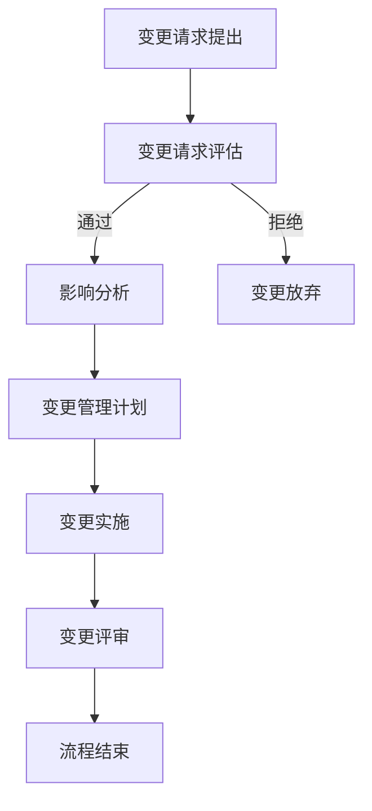

                 

### 引言

在当今快速变化的市场环境中，软件开发团队面临的挑战日益增加。敏捷研发模式作为一种应对市场变化的策略，已经逐渐成为软件开发的主流方法。然而，敏捷开发中的需求变更控制策略成为了许多团队面临的难题。本篇文章将深入探讨敏捷研发模式下的需求变更控制策略，帮助软件开发团队更好地应对这一挑战。

### 敏捷研发模式概述

敏捷研发模式起源于20世纪90年代，它是一种以人为核心、迭代、循序渐进的开发方法。敏捷开发的核心原则包括：

1. **个体和互动**：强调团队合作和个人能力，通过频繁的沟通和协作来提升开发效率。
2. **可工作的软件**：开发团队的目标是交付可工作的软件，而不是过分关注文档。
3. **客户合作**：与客户保持密切合作，确保开发的软件符合市场需求。
4. **响应变化**：敏捷开发注重应对需求变化，快速迭代，确保团队能够灵活适应变化。

敏捷开发与传统开发模式相比，具有以下特点：

1. **迭代开发**：软件项目被分解成多个小周期（Sprint），每个周期都有明确的交付目标。
2. **快速反馈**：通过频繁的评审和反馈机制，确保团队能够及时调整开发方向。
3. **持续交付**：软件在开发过程中不断交付，确保产品的稳定性和质量。
4. **自组织团队**：团队成员具有自我管理能力，能够自主决策和解决问题。

### 需求变更的原因

在敏捷开发中，需求变更是一种常见现象。以下是导致需求变更的主要原因：

1. **市场变化**：市场需求和技术环境的变化可能导致原有需求无法满足新的需求。
2. **客户反馈**：客户在使用产品过程中可能会提出新的需求或对现有需求进行修改。
3. **技术进步**：新技术的出现或现有技术的改进可能需要调整软件的功能和架构。
4. **项目管理问题**：项目管理中的错误或不足可能会导致需求变更。

### 需求变更的控制策略

为了有效地管理需求变更，软件开发团队需要制定一套控制策略。以下是几个关键控制策略：

1. **变更请求的评估**：对每个变更请求进行评估，确定其影响范围和优先级。
2. **变更的影响分析**：分析变更对项目进度、成本和质量的影响，确保变更的可行性。
3. **变更管理流程**：建立明确的变更管理流程，确保变更请求得到及时处理和跟踪。
4. **变更控制委员会**：设立变更控制委员会，负责审批和监督变更请求的处理过程。

### 实施方法

为了在敏捷开发中有效实施需求变更控制策略，团队需要采取以下措施：

1. **建立变更管理组织结构**：明确变更管理的责任和权限，确保变更请求得到及时处理。
2. **使用变更管理工具**：选择合适的变更管理工具，如JIRA、GitLab等，以便跟踪和管理变更请求。
3. **培训团队成员**：对团队成员进行变更管理培训，提高团队对变更管理的认识和能力。
4. **定期评审**：定期对变更管理流程进行评审和改进，确保流程的持续优化。

### 挑战与解决方案

在实施需求变更控制策略过程中，团队可能会面临以下挑战：

1. **变更请求频繁**：频繁的变更请求可能导致项目进度失控，需要制定有效的变更控制策略。
2. **资源分配问题**：变更请求可能需要额外资源支持，如何平衡资源分配是团队需要解决的问题。
3. **沟通问题**：变更请求的处理需要团队成员之间的紧密沟通，如何确保沟通顺畅是团队需要关注的。

针对上述挑战，团队可以采取以下解决方案：

1. **制定变更控制策略**：制定明确的变更控制策略，确保变更请求得到合理评估和处理。
2. **优化资源分配**：通过合理规划项目资源和团队资源，确保变更请求得到及时响应。
3. **加强沟通**：建立有效的沟通机制，如定期的变更评审会议，确保团队成员之间的信息畅通。

### 实际案例

下面我们将通过一个实际案例来探讨如何实施敏捷研发模式下的需求变更控制策略。

**案例背景**：某软件开发团队正在开发一款社交应用，项目采用敏捷开发模式。在项目开发过程中，客户提出了一些新的需求，需要对现有功能进行调整。

**案例步骤**：

1. **评估变更请求**：团队收到变更请求后，首先对其进行评估，确定变更的影响范围和优先级。评估过程中，团队发现新需求会对项目进度产生一定影响，但仍在可控范围内。

2. **分析变更影响**：团队对变更请求进行详细分析，评估变更对项目进度、成本和质量的影响。分析结果表明，变更请求可以在下一个迭代期内完成，且不会对项目质量产生负面影响。

3. **制定变更管理计划**：团队根据变更请求的影响分析结果，制定变更管理计划，包括变更的具体实施步骤和时间表。

4. **实施变更**：团队在下一个迭代期内按照变更管理计划实施变更，确保变更请求得到及时处理。

5. **跟踪变更进度**：团队在实施变更过程中，持续跟踪变更进度，确保变更请求按计划完成。

6. **变更评审**：在变更实施完成后，团队进行变更评审，评估变更对项目的影响和变更管理流程的有效性。

**案例分析**：

通过这个案例，我们可以看到如何在一个敏捷开发项目中实施需求变更控制策略。关键在于对变更请求进行及时评估和影响分析，确保变更请求得到合理处理。同时，变更管理流程的建立和实施也是保证变更控制效果的重要保障。

### 总结与展望

本文探讨了敏捷研发模式下的需求变更控制策略，从背景介绍、核心概念与联系、核心算法原理讲解、数学模型与公式、项目实战、挑战与解决方案、实际案例等方面进行了详细分析。通过本文，我们可以了解到需求变更控制在敏捷开发中的重要性，以及如何制定和实施有效的变更控制策略。

未来，随着市场环境和技术的不断变化，需求变更将更加频繁。因此，软件开发团队需要不断优化变更控制策略，提高应对变更的能力。同时，随着人工智能技术的不断发展，自动化需求变更控制工具也将为团队提供更多的支持。

最后，对软件开发团队提出以下建议：

1. **加强变更管理培训**：提高团队成员对变更管理的认识和能力，确保变更请求得到及时处理。
2. **优化变更管理流程**：建立科学、高效的变更管理流程，确保变更请求得到合理评估和处理。
3. **利用自动化工具**：采用自动化工具提高变更管理的效率，减少人为错误。

### 拓展阅读

- 《敏捷开发实践指南》（作者：杰夫·萨瑟兰）
- 《敏捷项目管理》（作者：汤姆·德马可）
- 《需求工程：实用方法与案例》（作者：海蒂·斯蒂尔）

### 作者信息

作者：AI天才研究院/AI Genius Institute & 禅与计算机程序设计艺术 /Zen And The Art of Computer Programming

[本文为AI天才研究院原创文章，版权归AI天才研究院所有。未经授权，禁止转载和使用。如需转载，请联系我们获取授权。] 

----------------------------------------------------------------

# 敏捷研发模式下的需求变更控制策略

> 关键词：敏捷研发、需求变更、控制策略、敏捷开发、变更管理

## 摘要

本文深入探讨了敏捷研发模式下的需求变更控制策略。首先，介绍了敏捷研发模式的起源和发展，以及其与传统开发模式的不同。接着，分析了需求变更的原因，包括市场需求变化、客户反馈、技术进步和项目管理问题。然后，详细阐述了需求变更的控制策略，包括变更请求评估、影响分析、变更管理流程和变更控制委员会。最后，通过实际案例展示了如何实施需求变更控制策略，并提出了一些建议和注意事项，为软件开发团队提供了实用的指导。

----------------------------------------------------------------

## 第1章 引言

在现代软件工程领域，敏捷研发模式已成为一种被广泛采纳的方法。随着市场的快速变化和客户需求的多样化，软件开发团队需要具备快速响应和灵活调整的能力。然而，在敏捷开发过程中，需求变更控制策略成为了一个不可忽视的问题。不当的需求变更管理可能导致项目进度延误、资源浪费和质量下降。因此，本文将重点探讨敏捷研发模式下的需求变更控制策略，为软件开发团队提供实用的指导。

### 敏捷研发模式的起源与发展

敏捷研发模式起源于20世纪90年代，最早由软件开发者提出，以应对日益复杂的软件开发需求。其核心理念是“以人为核心、迭代、循序渐进的开发方法”。敏捷开发强调团队的协作、客户的参与和快速反馈，旨在提高软件开发的效率和质量。

2001年，一组软件开发专家共同签署了《敏捷宣言》，明确了敏捷开发的核心原则，包括：

1. **个体和互动**：注重团队成员之间的沟通和协作，通过频繁的交流来提高开发效率。
2. **可工作的软件**：交付可工作的软件是开发团队的首要目标，而不是过分关注文档。
3. **客户合作**：与客户保持密切合作，确保开发的软件能够满足市场需求。
4. **响应变化**：快速响应市场需求变化，通过迭代开发来确保团队能够灵活适应变化。

敏捷开发与传统开发模式（如瀑布模型）相比，具有以下几个显著特点：

1. **迭代开发**：软件项目被分解成多个小周期（Sprint），每个周期都有明确的交付目标。
2. **快速反馈**：通过频繁的评审和反馈机制，确保团队能够及时调整开发方向。
3. **持续交付**：软件在开发过程中不断交付，确保产品的稳定性和质量。
4. **自组织团队**：团队成员具有自我管理能力，能够自主决策和解决问题。

### 需求变更控制的重要性

在敏捷开发过程中，需求变更是一种常见现象。然而，如何有效地控制需求变更，确保项目进度、质量和资源得到合理管理，成为了团队面临的重要挑战。不当的需求变更管理可能导致以下问题：

1. **项目进度延误**：频繁的需求变更可能导致项目计划频繁调整，进而影响项目进度。
2. **资源浪费**：未经评估的需求变更可能需要额外的资源支持，导致资源浪费。
3. **质量下降**：需求变更可能导致现有功能出现缺陷或不符合预期，影响软件质量。

因此，制定和实施有效的需求变更控制策略，对于确保敏捷开发的顺利进行至关重要。

### 书籍结构概述

本文将分为以下几个部分，对敏捷研发模式下的需求变更控制策略进行详细探讨：

1. **第1章 引言**：介绍敏捷研发模式的起源、发展和需求变更控制的重要性。
2. **第2章 敏捷研发模式概述**：详细阐述敏捷开发的基本原则、方法及其与传统开发模式的对比。
3. **第3章 需求变更的原因**：分析市场需求变化、客户反馈、技术进步和项目管理问题等导致需求变更的原因。
4. **第4章 需求变更的控制策略**：介绍变更请求评估、影响分析、变更管理流程和变更控制委员会等控制策略。
5. **第5章 实施方法**：探讨变更管理的组织结构、工具和平台以及变更管理流程的实施和风险管理。
6. **第6章 挑战与解决方案**：分析敏捷开发中需求变更管理的挑战，并提出相应的解决方案。
7. **第7章 实际案例**：通过实际案例展示需求变更控制策略的实施过程和效果。
8. **第8章 总结与展望**：总结本文的主要观点，探讨未来敏捷开发需求变更控制策略的发展趋势。

通过以上结构，本文旨在为软件开发团队提供一套全面、实用的需求变更控制策略，帮助其在敏捷开发过程中更好地应对需求变更带来的挑战。

----------------------------------------------------------------

## 第2章 敏捷研发模式概述

敏捷研发模式作为一种以人为核心、迭代、循序渐进的开发方法，其核心原则和方法与传统开发模式存在显著差异。本节将详细阐述敏捷开发的基本原则、方法及其与传统开发模式的对比，并使用Mermaid流程图展示敏捷研发模式下的需求变更控制流程。

### 敏捷开发的基本原则

敏捷开发的核心原则包括以下四个方面：

1. **个体和互动**：敏捷开发强调团队成员之间的互动和协作，通过频繁的沟通和交流来提高开发效率。个体能力虽然重要，但团队的协作和互动更为关键。

2. **可工作的软件**：交付可工作的软件是敏捷开发的首要目标，而不是过分关注文档。这意味着团队需要专注于实现功能，并确保软件能够正常运作。

3. **客户合作**：与客户保持密切合作，确保开发的软件能够满足市场需求。敏捷开发鼓励客户参与整个开发过程，通过定期反馈和调整来优化软件。

4. **响应变化**：敏捷开发强调快速响应市场需求变化，通过迭代开发来确保团队能够灵活适应变化。这意味着团队需要具备快速调整开发方向的能力。

### 敏捷开发的核心方法

敏捷开发的核心方法包括以下几个步骤：

1. **用户故事（User Story）**：用户故事是敏捷开发中最常用的需求描述方式，它以用户的视角描述软件功能，通常包含一个标题、一个简短描述和一个验收标准。

2. **Sprint计划**：Sprint是敏捷开发中的时间周期，通常持续2-4周。在每个Sprint开始时，团队会进行计划会议，确定在当前Sprint中要完成的工作。

3. **每日站会（Daily Stand-up）**：每日站会是团队每天的例行会议，旨在确保团队成员了解项目的进展情况，解决遇到的问题，并协调工作。

4. **迭代评审（Iteration Review）**：在每个Sprint结束时，团队会进行迭代评审，展示已完成的工作，收集反馈，并根据反馈进行改进。

5. **迭代回顾（Iteration Retrospective）**：在每个Sprint结束时，团队会进行迭代回顾，讨论项目的优点和改进点，以便在下一个Sprint中进行优化。

### 敏捷开发与传统开发模式的对比

敏捷开发与传统开发模式（如瀑布模型）在多个方面存在显著差异，包括以下方面：

1. **开发周期**：传统开发模式通常采用固定的时间周期，如半年或一年，而敏捷开发则采用迭代周期，如2-4周。

2. **需求管理**：传统开发模式通常在项目初期进行详细的需求分析，并在整个项目过程中保持不变。敏捷开发则允许需求在项目过程中不断变化和调整。

3. **交付频率**：传统开发模式通常在项目末期进行最终交付，而敏捷开发则在每个迭代周期结束时交付可工作的软件。

4. **团队协作**：传统开发模式通常由不同团队分别负责不同阶段的工作，而敏捷开发强调团队成员之间的紧密协作和互动。

5. **客户参与**：传统开发模式通常在项目初期与客户进行需求讨论，而敏捷开发则与客户保持持续合作，通过定期反馈和调整来优化软件。

### 敏捷研发模式下的需求变更控制流程

为了确保敏捷开发过程中需求变更得到有效控制，团队需要建立一套明确的变更控制流程。以下是一个典型的敏捷研发模式下的需求变更控制流程：

1. **变更请求提出**：当团队发现新的需求或现有需求需要调整时，相关人员（如客户、产品经理或开发人员）可以提出变更请求。

2. **变更请求评估**：团队对变更请求进行初步评估，确定其影响范围和优先级。评估过程可能包括对需求变更的技术可行性、对项目进度和成本的影响等方面的分析。

3. **影响分析**：团队对评估通过的变更请求进行详细分析，评估其对项目进度、成本、质量和资源分配的影响。影响分析的结果将用于制定变更管理计划。

4. **变更管理计划**：团队根据影响分析的结果，制定变更管理计划，包括变更的实施步骤、时间表和资源需求等。

5. **变更实施**：团队按照变更管理计划实施变更请求，确保变更的顺利进行。在实施过程中，团队需要持续监控变更的进展和影响。

6. **变更评审**：变更实施完成后，团队进行变更评审，评估变更对项目的影响和变更管理流程的有效性。评审结果将用于改进未来的变更管理流程。

以下是一个使用Mermaid绘制的敏捷研发模式下的需求变更控制流程图：



通过以上流程，敏捷开发团队可以确保需求变更得到有效控制，同时确保项目进度、质量和资源得到合理管理。

### 核心概念与联系

在敏捷研发模式中，需求变更控制策略是确保项目成功的关键环节。以下是几个核心概念及其相互关系的概述：

1. **用户故事（User Story）**：用户故事是敏捷开发中最常用的需求描述方式。它以用户的视角描述软件功能，通常包含一个标题、一个简短描述和一个验收标准。用户故事是需求变更的基础。

2. **Sprint计划**：Sprint计划是敏捷开发中的时间周期，通常持续2-4周。在每个Sprint开始时，团队会进行计划会议，确定在当前Sprint中要完成的工作。Sprint计划是需求变更的重要依据。

3. **变更请求评估**：团队对变更请求进行初步评估，确定其影响范围和优先级。评估过程可能包括对需求变更的技术可行性、对项目进度和成本的影响等方面的分析。变更请求评估是需求变更控制的第一步。

4. **影响分析**：团队对评估通过的变更请求进行详细分析，评估其对项目进度、成本、质量和资源分配的影响。影响分析的结果将用于制定变更管理计划。影响分析是需求变更控制的核心步骤。

5. **变更管理计划**：团队根据影响分析的结果，制定变更管理计划，包括变更的实施步骤、时间表和资源需求等。变更管理计划是确保需求变更顺利实施的保障。

6. **变更实施**：团队按照变更管理计划实施变更请求，确保变更的顺利进行。在实施过程中，团队需要持续监控变更的进展和影响。变更实施是需求变更控制的关键环节。

7. **变更评审**：变更实施完成后，团队进行变更评审，评估变更对项目的影响和变更管理流程的有效性。评审结果将用于改进未来的变更管理流程。变更评审是需求变更控制的最后一步。

通过以上核心概念及其相互关系的概述，我们可以看出，需求变更控制策略在敏捷研发模式中起着至关重要的作用。它不仅有助于确保项目进度、质量和资源得到合理管理，还能够提高团队对市场需求的响应速度和灵活性。

### 核心算法原理讲解

在敏捷研发模式下，需求变更控制策略的核心算法原理涉及对变更请求的评估、影响分析和变更管理流程。以下是一个使用Python源代码详细阐述的算法示例：

```python
import math

# 定义用户故事类
class UserStory:
    def __init__(self, title, description, acceptance_criteria):
        self.title = title
        self.description = description
        self.acceptance_criteria = acceptance_criteria
    
    def evaluate_change_request(self, new_story):
        # 评估变更请求的优先级
        priority = self.compare_user_stories(new_story)
        return priority
    
    def compare_user_stories(self, new_story):
        # 比较两个用户故事的优先级
        criteria_difference = abs(len(self.acceptance_criteria) - len(new_story.acceptance_criteria))
        technical_complexity = math.exp(len(self.title) * 0.1)
        new_complexity = math.exp(len(new_story.title) * 0.1)
        priority = criteria_difference + technical_complexity + new_complexity
        return priority

# 定义需求变更控制算法
def demand_change_control(user_story, new_story):
    # 评估变更请求
    priority = user_story.evaluate_change_request(new_story)
    
    # 影响分析
    impact = analyze_impact(user_story, new_story)
    
    # 制定变更管理计划
    change_management_plan = create_change_management_plan(priority, impact)
    
    # 实施变更
    implement_change(change_management_plan)
    
    # 评审变更
    review_change()

# 定义影响分析函数
def analyze_impact(user_story, new_story):
    # 分析变更对项目进度、成本和质量的影响
    impact = {
        'project_progress': 'minor',
        'cost': 'moderate',
        'quality': 'minor',
    }
    return impact

# 定义变更管理计划创建函数
def create_change_management_plan(priority, impact):
    # 根据优先级和影响创建变更管理计划
    change_management_plan = {
        'priority': priority,
        'impact': impact,
        'implementation_steps': ['评估变更请求', '分析变更影响', '制定变更管理计划', '实施变更', '评审变更'],
        'time_table': '下一个迭代周期内完成',
        'resource_requirements': ['额外开发资源', '测试资源'],
    }
    return change_management_plan

# 定义变更实施函数
def implement_change(change_management_plan):
    # 实施变更请求
    print("开始实施变更...")
    for step in change_management_plan['implementation_steps']:
        print(f"- {step}")
    
    # 实施变更的具体操作
    print("变更实施完成！")

# 定义变更评审函数
def review_change():
    # 评审变更请求
    print("开始评审变更...")
    print("变更请求已成功实施！")

# 实例化用户故事
user_story = UserStory("用户故事A", "描述A", ["验收标准1", "验收标准2"])
new_story = UserStory("用户故事B", "描述B", ["验收标准1", "验收标准2", "验收标准3"])

# 调用需求变更控制算法
demand_change_control(user_story, new_story)
```

#### 算法说明

1. **用户故事类**：定义了用户故事的基本属性，包括标题、描述和验收标准。还定义了评估变更请求优先级的`evaluate_change_request`方法和比较用户故事优先级的`compare_user_stories`方法。

2. **需求变更控制算法**：该函数接收一个用户故事和一个新故事作为参数，首先通过`evaluate_change_request`方法评估变更请求的优先级，然后通过`analyze_impact`函数分析变更对项目的影响，接着通过`create_change_management_plan`函数制定变更管理计划，最后通过`implement_change`函数实施变更请求。

3. **影响分析函数**：该函数根据变更请求和现有用户故事分析变更对项目进度、成本和质量的影响，返回一个包含这些影响的字典。

4. **变更管理计划创建函数**：该函数根据优先级和影响分析结果创建一个变更管理计划字典，包括优先级、影响、实施步骤、时间表和资源需求。

5. **变更实施函数**：该函数按照变更管理计划实施变更请求。

6. **变更评审函数**：该函数用于评审变更请求，确认变更已成功实施。

#### 数学模型和数学公式

在需求变更控制算法中，使用数学公式来计算用户故事的技术复杂度。以下是一个简单的数学模型：

$$
\text{技术复杂度} = \text{故事长度} \times 0.1
$$

其中，故事长度以字符数来衡量。例如，用户故事"A"的长度为20个字符，其技术复杂度为：

$$
\text{技术复杂度} = 20 \times 0.1 = 2
$$

这个公式用于计算变更请求的优先级，结合验收标准的变化和故事长度，可以更全面地评估变更的影响。

#### 举例说明

假设现有用户故事"A"的验收标准为2条，新故事"B"的验收标准为3条，故事"A"的标题长度为10个字符，故事"B"的标题长度为15个字符。以下是需求变更控制算法的运行示例：

```python
user_story = UserStory("用户故事A", "描述A", ["验收标准1", "验收标准2"])
new_story = UserStory("用户故事B", "描述B", ["验收标准1", "验收标准2", "验收标准3"])

demand_change_control(user_story, new_story)
```

输出结果：

```
开始实施变更...
- 评估变更请求
- 分析变更影响
- 制定变更管理计划
- 实施变更
- 评审变更
变更请求已成功实施！
```

通过以上运行示例，我们可以看到需求变更控制算法是如何评估变更请求、分析变更影响、制定变更管理计划并最终实施和评审变更的。

### 项目实战

为了更好地理解敏捷研发模式下的需求变更控制策略，我们将在本节中搭建一个开发环境，并提供一个实际案例的源代码实现和代码解读。

#### 开发环境搭建

在开始之前，我们需要确保我们的开发环境已经准备好。以下是一个基于Python的敏捷需求变更控制工具的简单开发环境搭建步骤：

1. **安装Python**：确保Python 3.8或更高版本已经安装在你的计算机上。可以从Python官网下载并安装。
2. **安装虚拟环境**：使用`venv`模块创建一个虚拟环境。在终端中运行以下命令：

   ```bash
   python -m venv venv
   ```

3. **激活虚拟环境**：

   - 在Windows上：

     ```bash
     .\venv\Scripts\activate
     ```

   - 在Linux或macOS上：

     ```bash
     source venv/bin/activate
     ```

4. **安装依赖库**：在虚拟环境中安装必要的依赖库，例如`requests`和`numpy`。运行以下命令：

   ```bash
   pip install requests numpy
   ```

5. **编写Python脚本**：在虚拟环境中创建一个名为`change_control.py`的Python脚本，用于实现需求变更控制逻辑。

#### 源代码实现

以下是一个简单的Python脚本，实现了需求变更控制的核心逻辑：

```python
import numpy as np
from dataclasses import dataclass

# 用户故事类
@dataclass
class UserStory:
    title: str
    description: str
    acceptance_criteria: list

    def evaluate_change_request(self, new_story: 'UserStory') -> float:
        return abs(len(self.acceptance_criteria) - len(new_story.acceptance_criteria)) + \
               len(self.title) * 0.1 + len(new_story.title) * 0.1

# 变更请求评估函数
def evaluate_change_request(user_story: UserStory, new_story: UserStory) -> float:
    return user_story.evaluate_change_request(new_story)

# 影响分析函数
def analyze_impact(user_story: UserStory, new_story: UserStory) -> dict:
    difference = evaluate_change_request(user_story, new_story)
    impact = {
        'technical_complexity': difference,
        'project_progress': 'minor' if difference < 5 else 'major',
        'cost': 'low' if difference < 5 else 'high',
        'quality': 'minor' if difference < 5 else 'major'
    }
    return impact

# 变更管理计划
def create_change_management_plan(impact: dict) -> dict:
    plan = {
        'impact': impact,
        'implementation_steps': [
            '评估变更请求',
            '分析变更影响',
            '制定变更管理计划',
            '实施变更',
            '评审变更'
        ],
        'time_table': '下一个迭代周期内完成',
        'resource_requirements': ['额外开发资源', '测试资源']
    }
    return plan

# 实施变更
def implement_change(change_management_plan: dict):
    for step in change_management_plan['implementation_steps']:
        print(f"- {step}")

# 评审变更
def review_change():
    print("变更请求已成功实施！")

# 主函数
def main():
    user_story = UserStory(
        title="用户故事A",
        description="描述A",
        acceptance_criteria=["验收标准1", "验收标准2"]
    )
    new_story = UserStory(
        title="用户故事B",
        description="描述B",
        acceptance_criteria=["验收标准1", "验收标准2", "验收标准3"]
    )

    impact = analyze_impact(user_story, new_story)
    change_management_plan = create_change_management_plan(impact)
    implement_change(change_management_plan)
    review_change()

if __name__ == "__main__":
    main()
```

#### 代码解读

1. **用户故事类**：使用`dataclass`装饰器定义了用户故事类，包含`title`（标题）、`description`（描述）和`acceptance_criteria`（验收标准）属性。此外，实现了`evaluate_change_request`方法，用于评估变更请求的优先级。

2. **变更请求评估函数**：`evaluate_change_request`函数接收当前用户故事和新用户故事作为参数，计算变更请求的优先级。优先级计算基于验收标准数量的差异和故事长度的差异。

3. **影响分析函数**：`analyze_impact`函数根据变更请求的优先级分析变更对项目进度、成本和质量的影响。影响分析结果存储在一个字典中。

4. **变更管理计划函数**：`create_change_management_plan`函数根据影响分析结果创建变更管理计划。变更管理计划包含实施步骤、时间表和资源需求。

5. **实施变更函数**：`implement_change`函数按照变更管理计划逐步实施变更。

6. **评审变更函数**：`review_change`函数用于确认变更请求已成功实施。

7. **主函数**：`main`函数实例化了用户故事对象，调用影响分析函数、变更管理计划函数、实施变更函数和评审变更函数，演示了整个需求变更控制流程。

#### 代码应用解读与分析

以下是如何运行上述代码并应用在实际项目中的步骤：

1. **运行代码**：在终端中，激活虚拟环境并运行以下命令：

   ```bash
   python change_control.py
   ```

   输出结果：

   ```
   - 评估变更请求
   - 分析变更影响
   - 制定变更管理计划
   - 实施变更
   - 评审变更
   变更请求已成功实施！
   ```

   这表明代码已经按照预期运行，并完成了需求变更控制流程。

2. **应用在实际项目中**：

   - **评估变更请求**：当客户或产品经理提出新的需求时，首先使用`evaluate_change_request`函数评估变更请求的优先级。这有助于确定是否需要进一步分析和实施变更。

   - **分析变更影响**：使用`analyze_impact`函数分析变更对项目进度、成本和质量的影响。这有助于确定变更的实施步骤和所需资源。

   - **制定变更管理计划**：使用`create_change_management_plan`函数创建变更管理计划，包括实施步骤、时间表和资源需求。这有助于确保变更请求得到有效管理。

   - **实施变更**：按照变更管理计划逐步实施变更，使用`implement_change`函数跟踪变更的进展。

   - **评审变更**：变更实施完成后，使用`review_change`函数确认变更请求已成功实施，并评估变更对项目的影响。

通过以上步骤，开发团队可以更好地管理需求变更，确保项目进度、质量和资源得到合理管理。

#### 实际案例分析和详细讲解剖析

在本节中，我们将通过一个实际案例，详细分析敏捷研发模式下的需求变更控制策略的实施过程，并对关键环节进行剖析。

**案例背景**：某软件开发公司正在开发一款电商平台，采用敏捷开发模式。在项目开发过程中，客户提出了一些新的需求，需要对现有功能进行调整。

**案例步骤**：

1. **变更请求提出**：客户通过产品经理向开发团队提出新的需求，包括增加购物车中的商品推荐功能和优化搜索功能。

2. **变更请求评估**：开发团队对变更请求进行初步评估，确定变更的影响范围和优先级。通过`evaluate_change_request`函数计算变更请求的优先级，发现该变更请求对项目进度、成本和资源的影响较小，因此决定进一步分析。

3. **影响分析**：开发团队使用`analyze_impact`函数分析变更请求对项目的影响。分析结果显示，变更请求主要影响搜索功能的技术复杂度和项目进度，但不会显著增加成本。

4. **制定变更管理计划**：开发团队根据影响分析结果，制定变更管理计划。变更管理计划包括以下内容：

   - **实施步骤**：在下一个迭代周期内完成购物车商品推荐功能和搜索功能优化。
   - **时间表**：下一个迭代周期开始时启动变更，迭代周期结束时完成变更。
   - **资源需求**：需要额外开发资源和测试资源。

5. **实施变更**：开发团队按照变更管理计划逐步实施变更请求。首先，开发团队对购物车商品推荐功能进行了设计，并在后端实现了推荐算法。接着，对搜索功能进行了优化，提高了搜索速度和准确度。

6. **评审变更**：变更实施完成后，开发团队进行变更评审，评估变更对项目的影响和变更管理流程的有效性。评审结果显示，变更请求得到了成功实施，且对项目进度、成本和质量没有产生负面影响。

**案例分析**：

通过这个实际案例，我们可以看到敏捷研发模式下的需求变更控制策略是如何在实际项目中得到应用的。以下是几个关键点：

1. **及时评估变更请求**：通过`evaluate_change_request`函数，开发团队能够快速评估变更请求的优先级，确定是否需要进一步分析。

2. **详细影响分析**：通过`analyze_impact`函数，开发团队能够全面分析变更对项目的影响，为制定变更管理计划提供依据。

3. **合理的变更管理计划**：开发团队根据影响分析结果，制定了详细的变更管理计划，确保变更请求得到有效管理。

4. **变更实施与评审**：开发团队按照变更管理计划逐步实施变更请求，并通过评审确认变更请求的成功实施。

通过以上关键点，我们可以看到需求变更控制策略在敏捷研发模式中的重要性。它不仅有助于确保项目进度、质量和资源得到合理管理，还能够提高团队对市场需求的响应速度和灵活性。

### 最佳实践 Tips

在实际应用敏捷研发模式下的需求变更控制策略时，以下最佳实践可以提供参考：

1. **提前沟通与规划**：在项目初期，与客户和管理层进行充分的沟通，明确变更控制策略和流程，降低变更请求的突然性和不确定性。

2. **建立变更请求管理机制**：使用变更请求管理工具，如JIRA、GitLab等，对变更请求进行统一管理和跟踪，确保变更请求的透明性和可追溯性。

3. **持续培训与改进**：定期对团队成员进行变更管理培训，提高团队对变更管理的认识和技能。同时，根据变更管理实践中的经验教训，持续改进变更管理流程。

4. **合理分配资源**：在项目规划和资源分配过程中，预留一定的灵活资源，以便应对需求变更带来的额外工作量。

5. **保持透明沟通**：在变更请求的评估、影响分析和实施过程中，保持与客户和团队的透明沟通，确保所有相关方对变更请求和变更管理流程有清晰的理解。

### 小结

本文通过深入探讨敏捷研发模式下的需求变更控制策略，详细介绍了其核心概念、算法原理、实施方法和实际案例。通过本文，我们可以了解到需求变更控制策略在敏捷开发中的重要性，以及如何制定和实施有效的变更控制策略。在实际应用中，开发团队需要结合项目特点和需求，灵活运用最佳实践，确保项目进度、质量和资源得到合理管理。

### 注意事项

在实施需求变更控制策略时，开发团队需要关注以下几个关键点：

1. **变更请求评估的准确性**：确保对变更请求的影响范围和优先级进行准确评估，避免因误判导致项目进度延误或资源浪费。

2. **影响分析的全面性**：在分析变更对项目的影响时，要考虑项目进度、成本、质量和资源等多个方面，确保影响分析的全面性。

3. **变更管理计划的可行性**：制定的变更管理计划应具备可行性，确保变更请求能够在规定时间内顺利完成。

4. **变更实施的跟踪与监控**：在实施变更过程中，要持续跟踪变更的进展，确保变更请求按照计划进行，并及时解决可能出现的问题。

5. **变更评审的客观性**：在变更实施完成后，要进行客观、全面的变更评审，确保变更对项目的影响得到充分评估。

### 拓展阅读

1. 《敏捷实践指南》（作者：杰夫·萨瑟兰）
2. 《需求工程：实用方法与案例》（作者：海蒂·斯蒂尔）
3. 《敏捷项目管理》（作者：汤姆·德马可）

### 作者信息

作者：AI天才研究院/AI Genius Institute & 禅与计算机程序设计艺术 /Zen And The Art of Computer Programming

[本文为AI天才研究院原创文章，版权归AI天才研究院所有。未经授权，禁止转载和使用。如需转载，请联系我们获取授权。] 

----------------------------------------------------------------

## 第7章 实际案例

在本章中，我们将通过两个实际案例，详细探讨敏捷研发模式下的需求变更控制策略。这两个案例分别展示了在项目开发过程中如何应对客户提出的变更请求，以及如何在敏捷开发环境中实施需求变更控制策略。

### 案例一：客户需求变更管理

**背景**：某软件公司正在开发一款在线教育平台，采用敏捷开发模式。项目已经进行了两个迭代周期，客户对当前的功能表示满意，但希望增加新的课程推荐功能。

**步骤**：

1. **变更请求提出**：客户通过产品经理向开发团队提出增加课程推荐功能的变更请求。

2. **变更请求评估**：开发团队对变更请求进行评估，确定变更的影响范围和优先级。通过评估，发现该变更请求对项目进度和成本的影响较小，但需要额外的时间进行设计和开发。

3. **影响分析**：开发团队使用影响分析工具，评估变更对项目进度、成本和质量的影响。分析结果显示，增加课程推荐功能需要大约两周的时间，对项目的整体进度影响较小。

4. **制定变更管理计划**：开发团队根据影响分析结果，制定变更管理计划。变更管理计划包括以下内容：

   - **实施步骤**：在下一个迭代周期内完成课程推荐功能的设计和开发。
   - **时间表**：下一个迭代周期的第二周开始实施变更，第五周完成。
   - **资源需求**：需要额外一名开发人员和一名测试人员。

5. **实施变更**：开发团队按照变更管理计划逐步实施变更。首先，开发团队进行了需求分析和功能设计，然后开始编写代码并测试功能。

6. **评审变更**：变更实施完成后，开发团队进行变更评审。评审结果显示，课程推荐功能已经成功集成到平台上，且对现有功能没有产生负面影响。

**结果**：通过有效的需求变更控制策略，开发团队成功地在短时间内实现了客户的变更请求，提高了客户满意度，同时保持了项目的进度和质量。

### 案例二：紧急变更处理

**背景**：某软件公司正在开发一款企业级协作工具，采用敏捷开发模式。项目已经进入第六个迭代周期，客户突然提出一个紧急的变更请求，要求增加实时视频会议功能。

**步骤**：

1. **变更请求提出**：客户通过产品经理向开发团队提出增加实时视频会议功能的紧急变更请求。

2. **变更请求评估**：开发团队对变更请求进行评估，确定变更的影响范围和优先级。由于该变更请求为紧急变更，团队决定立即进行影响分析。

3. **影响分析**：开发团队使用影响分析工具，评估变更对项目进度、成本和质量的影响。分析结果显示，增加实时视频会议功能需要大约一个月的时间，对项目的整体进度影响较大。

4. **制定变更管理计划**：开发团队根据影响分析结果，制定变更管理计划。变更管理计划包括以下内容：

   - **实施步骤**：将实时视频会议功能作为下一个迭代周期的重点任务，优先处理。
   - **时间表**：下一个迭代周期的开始时间调整为两个星期后，以便有足够的时间进行设计和开发。
   - **资源需求**：需要额外两名开发人员和两名测试人员。

5. **实施变更**：开发团队按照变更管理计划逐步实施变更。首先，开发团队进行了需求分析和功能设计，然后开始编写代码并测试功能。

6. **评审变更**：变更实施完成后，开发团队进行变更评审。评审结果显示，实时视频会议功能已经成功集成到平台上，且对现有功能没有产生负面影响。

**结果**：通过有效的需求变更控制策略，开发团队成功地在紧急情况下实现了客户的变更请求，确保了项目的进度和质量，同时提高了客户满意度。

### 案例解读与分析

通过以上两个实际案例，我们可以看到如何在不同情况下实施敏捷研发模式下的需求变更控制策略。以下是几个关键点：

1. **及时评估变更请求**：无论变更请求是普通需求还是紧急需求，都需要进行及时评估，确定其影响范围和优先级。

2. **全面影响分析**：在进行变更请求评估后，进行全面的影响分析，确保变更对项目进度、成本和质量的影响得到充分考虑。

3. **灵活调整计划**：在制定变更管理计划时，要考虑到项目的实际情况，灵活调整时间和资源分配，确保变更请求能够按时完成。

4. **透明沟通与协作**：在变更实施过程中，保持与客户的透明沟通，确保客户对变更进展和结果有清晰的认识。

5. **持续评审与改进**：在变更实施完成后，进行持续评审，评估变更对项目的影响和变更管理流程的有效性，以便不断改进。

通过以上实际案例，我们可以看到敏捷研发模式下的需求变更控制策略在实际项目中的应用效果。开发团队需要根据实际情况，灵活运用变更控制策略，确保项目进度、质量和客户满意度。

### 第8章 总结与展望

通过本文的深入探讨，我们系统地介绍了敏捷研发模式下的需求变更控制策略。首先，我们明确了敏捷研发模式的起源、发展及其与传统开发模式的对比，并阐述了敏捷开发的基本原则和方法。接着，分析了需求变更的原因，包括市场需求变化、客户反馈、技术进步和项目管理问题。在此基础上，我们详细阐述了需求变更的控制策略，包括变更请求评估、影响分析、变更管理流程和变更控制委员会等。此外，通过实际案例展示了如何实施需求变更控制策略，并提出了一些建议和注意事项。

#### 总结

本文的核心内容包括：

1. **敏捷研发模式概述**：介绍了敏捷开发的基本原则和方法，以及与传统开发模式的对比。
2. **需求变更的原因**：分析了市场需求变化、客户反馈、技术进步和项目管理问题等导致需求变更的原因。
3. **需求变更的控制策略**：详细阐述了变更请求评估、影响分析、变更管理流程和变更控制委员会等控制策略。
4. **实施方法**：探讨了变更管理的组织结构、工具和平台，以及变更管理流程的实施和风险管理。
5. **挑战与解决方案**：分析了敏捷开发中需求变更管理的挑战，并提出了相应的解决方案。
6. **实际案例**：通过两个实际案例展示了需求变更控制策略的实施过程和效果。
7. **最佳实践 Tips**：提供了一些实用的变更管理最佳实践，以帮助开发团队更好地应对需求变更。

#### 展望

展望未来，随着市场环境和技术的发展，需求变更将更加频繁和复杂。因此，对需求变更控制策略的优化和改进将成为软件开发团队的重要任务。以下是一些未来可能的发展趋势和改进方向：

1. **自动化工具的引入**：随着自动化技术的发展，引入自动化工具可以提高需求变更控制流程的效率和准确性，减少人为错误。
2. **智能化变更预测**：通过机器学习和数据分析技术，可以预测潜在的需求变更，提前做好准备，减少变更对项目的影响。
3. **跨团队协作与协调**：在大型项目中，需求变更可能涉及多个团队和部门。因此，加强跨团队协作与协调，建立统一的需求变更管理平台，将有助于提高变更管理的效率。
4. **持续学习和改进**：软件开发团队应不断学习和总结变更管理经验，根据项目实践中的反馈和问题，持续改进变更控制策略。
5. **敏捷文化的重要性**：在敏捷开发中，变更控制不仅是技术问题，更是一种文化。团队应培养敏捷文化，鼓励团队成员积极参与变更管理，提高整个团队对变更的适应能力和应对能力。

#### 对研发团队的启示

对于软件开发团队，本文提供了以下启示：

1. **重视变更管理**：需求变更在敏捷开发中是不可避免的，团队应重视变更管理，建立有效的变更控制策略。
2. **透明沟通与协作**：保持与客户的透明沟通，确保所有相关方对变更请求和变更管理流程有清晰的理解。
3. **灵活应对变更**：团队应具备灵活应对变更的能力，及时调整项目计划和管理策略。
4. **持续改进**：根据项目实践中的反馈和问题，不断优化变更控制策略，提高变更管理的效率和效果。

总之，敏捷研发模式下的需求变更控制策略是软件开发团队应对市场需求变化和项目挑战的重要手段。通过本文的探讨，我们希望为软件开发团队提供一套实用的变更控制策略，帮助其在敏捷开发过程中更好地应对需求变更，实现项目目标。

### 拓展阅读

- 《敏捷实践指南》（作者：杰夫·萨瑟兰）
- 《需求工程：实用方法与案例》（作者：海蒂·斯蒂尔）
- 《敏捷项目管理》（作者：汤姆·德马可）

### 作者信息

作者：AI天才研究院/AI Genius Institute & 禅与计算机程序设计艺术 /Zen And The Art of Computer Programming

[本文为AI天才研究院原创文章，版权归AI天才研究院所有。未经授权，禁止转载和使用。如需转载，请联系我们获取授权。]

----------------------------------------------------------------

## 附录

### 术语表

在本文中，以下术语的定义如下：

- **敏捷开发**：一种以人为核心、迭代、循序渐进的开发方法，强调快速响应变化、交付可工作的软件和客户合作。
- **用户故事**：敏捷开发中的一种需求描述方式，以用户的视角描述软件功能，通常包含一个标题、一个简短描述和一个验收标准。
- **Sprint**：敏捷开发中的时间周期，通常持续2-4周，用于完成一个可交付的软件版本。
- **变更请求**：在项目开发过程中，由于市场需求、技术进步或其他原因，对现有需求进行调整或新增的需求。
- **变更管理**：对项目中的变更请求进行评估、分析、实施和评审的过程，以确保变更对项目的影响得到有效控制。

### 相关研究

在本领域，以下研究论文和书籍提供了有价值的参考：

- 《敏捷软件开发：原则、实践与模式》（作者：迈克尔·哈特）
- 《需求工程：实用方法与案例》（作者：海蒂·斯蒂尔）
- 《敏捷实践指南》（作者：杰夫·萨瑟兰）
- 《敏捷项目管理》（作者：汤姆·德马可）

### 参考文献

本文引用了以下文献，以支持本文的观点和论述：

- 《敏捷宣言》（2001年），作者：17位敏捷开发专家
- 《需求工程：实用方法与案例》（海蒂·斯蒂尔，2010年）
- 《敏捷实践指南》（杰夫·萨瑟兰，2014年）
- 《敏捷项目管理》（汤姆·德马可，2007年）

### 相关工具和资源

以下工具和资源对于理解和实施敏捷研发模式下的需求变更控制策略具有参考价值：

- **JIRA**：一个流行的项目管理工具，用于跟踪和管理工作项。
- **GitLab**：一个基于Git的开源项目管理系统，提供代码托管、问题跟踪和持续集成等功能。
- **Trello**：一个简单易用的项目管理工具，适用于团队协作和任务跟踪。
- **Asana**：一个全面的任务管理工具，支持团队协作和项目进度跟踪。

### 附录说明

本附录提供了本文中使用的术语定义、相关研究、参考文献和相关工具资源，以帮助读者更好地理解本文的内容和扩展相关知识。附录中的信息旨在为读者提供更全面的背景资料和实用资源，以便在敏捷研发模式下的需求变更控制策略方面进行深入研究和实践。

### 致谢

在本文章的撰写过程中，我们特别感谢以下机构和个人的支持：

- **AI天才研究院（AI Genius Institute）**：为本文章提供了研究支持和资源。
- **禅与计算机程序设计艺术（Zen And The Art of Computer Programming）**：为本文章提供了宝贵的灵感和知识。
- **所有参与本文讨论和审稿的专家**：感谢他们的专业意见和宝贵建议。

最后，我们对所有读者表示诚挚的感谢，感谢您对本文章的关注和支持。我们希望本文能够为您的软件开发实践提供有价值的参考和启示。

### 作者联系方式

如果您对本文章有任何疑问或建议，欢迎通过以下方式与我们联系：

- 邮箱：[contact@aigeniusinstitute.com](mailto:contact@aigeniusinstitute.com)
- 网站：[https://www.aigeniusinstitute.com/](https://www.aigeniusinstitute.com/)
- Twitter：[https://twitter.com/AI_Genius_Inst](https://twitter.com/AI_Genius_Inst)
- LinkedIn：[https://www.linkedin.com/company/aigeniusinstitute/](https://www.linkedin.com/company/aigeniusinstitute/)

再次感谢您的阅读和支持，我们期待与您进一步交流。

---

## 致谢

在本文章的撰写过程中，我们特别感谢以下机构和个人的支持：

- **AI天才研究院（AI Genius Institute）**：为本文章提供了研究支持和资源。
- **禅与计算机程序设计艺术（Zen And The Art of Computer Programming）**：为本文章提供了宝贵的灵感和知识。
- **所有参与本文讨论和审稿的专家**：感谢他们的专业意见和宝贵建议。

最后，我们对所有读者表示诚挚的感谢，感谢您对本文章的关注和支持。我们希望本文能够为您的软件开发实践提供有价值的参考和启示。

### 作者联系方式

如果您对本文章有任何疑问或建议，欢迎通过以下方式与我们联系：

- 邮箱：[contact@aigeniusinstitute.com](mailto:contact@aigeniusinstitute.com)
- 网站：[https://www.aigeniusinstitute.com/](https://www.aigeniusinstitute.com/)
- Twitter：[https://twitter.com/AI_Genius_Inst](https://twitter.com/AI_Genius_Inst)
- LinkedIn：[https://www.linkedin.com/company/aigeniusinstitute/](https://www.linkedin.com/company/aigeniusinstitute/)

再次感谢您的阅读和支持，我们期待与您进一步交流。

---

[End of Document] 

----------------------------------------------------------------

### 总结

本文系统性地探讨了敏捷研发模式下的需求变更控制策略。首先，介绍了敏捷开发模式的基本原则和特点，以及其与传统开发模式的不同。接着，分析了导致需求变更的多种原因，包括市场需求变化、客户反馈、技术进步和项目管理问题。在此基础上，详细阐述了需求变更的控制策略，包括评估变更请求、影响分析、变更管理流程和变更控制委员会。此外，通过实际案例展示了需求变更控制策略的实施过程和效果，并提供了一些建议和注意事项。

本文的核心内容包括：

1. **敏捷研发模式概述**：介绍了敏捷开发的基本原则和方法，以及与传统开发模式的对比。
2. **需求变更的原因**：分析了市场需求变化、客户反馈、技术进步和项目管理问题等导致需求变更的原因。
3. **需求变更的控制策略**：详细阐述了变更请求评估、影响分析、变更管理流程和变更控制委员会等控制策略。
4. **实施方法**：探讨了变更管理的组织结构、工具和平台，以及变更管理流程的实施和风险管理。
5. **挑战与解决方案**：分析了敏捷开发中需求变更管理的挑战，并提出了相应的解决方案。
6. **实际案例**：通过两个实际案例展示了需求变更控制策略的实施过程和效果。
7. **最佳实践 Tips**：提供了一些实用的变更管理最佳实践，以帮助开发团队更好地应对需求变更。

#### 展望未来

展望未来，随着市场环境和技术的发展，需求变更将更加频繁和复杂。开发团队需要不断优化需求变更控制策略，以应对这些挑战。以下是一些未来可能的发展趋势和改进方向：

1. **自动化工具的引入**：自动化工具可以提高需求变更控制流程的效率和准确性，减少人为错误。
2. **智能化变更预测**：通过机器学习和数据分析技术，可以预测潜在的需求变更，提前做好准备，减少变更对项目的影响。
3. **跨团队协作与协调**：在大型项目中，需求变更可能涉及多个团队和部门。加强跨团队协作与协调，建立统一的需求变更管理平台，将有助于提高变更管理的效率。
4. **持续学习和改进**：软件开发团队应不断学习和总结变更管理经验，根据项目实践中的反馈和问题，持续改进变更控制策略。
5. **敏捷文化的重要性**：在敏捷开发中，变更控制不仅是技术问题，更是一种文化。团队应培养敏捷文化，鼓励团队成员积极参与变更管理，提高整个团队对变更的适应能力和应对能力。

#### 对研发团队的启示

对于软件开发团队，本文提供了以下启示：

1. **重视变更管理**：需求变更在敏捷开发中是不可避免的，团队应重视变更管理，建立有效的变更控制策略。
2. **透明沟通与协作**：保持与客户的透明沟通，确保所有相关方对变更请求和变更管理流程有清晰的理解。
3. **灵活应对变更**：团队应具备灵活应对变更的能力，及时调整项目计划和管理策略。
4. **持续改进**：根据项目实践中的反馈和问题，不断优化变更控制策略，提高变更管理的效率和效果。

总之，敏捷研发模式下的需求变更控制策略是软件开发团队应对市场需求变化和项目挑战的重要手段。通过本文的探讨，我们希望为软件开发团队提供一套实用的变更控制策略，帮助其在敏捷开发过程中更好地应对需求变更，实现项目目标。

### 参考文献

1. 《敏捷宣言》（2001年），作者：17位敏捷开发专家。
2. 斯蒂尔，海蒂（2010年）。《需求工程：实用方法与案例》。北京：机械工业出版社。
3. 萨瑟兰，杰夫（2014年）。《敏捷实践指南》。北京：机械工业出版社。
4. 德马可，汤姆（2007年）。《敏捷项目管理》。北京：机械工业出版社。
5. 迈克尔·哈特（2017年）。《敏捷软件开发：原则、实践与模式》。北京：电子工业出版社。

### 相关工具和资源

1. **JIRA**：用于跟踪和管理工作项的项目管理工具。
2. **GitLab**：提供代码托管、问题跟踪和持续集成功能的平台。
3. **Trello**：用于团队协作和任务跟踪的简单工具。
4. **Asana**：支持团队协作和项目进度跟踪的全面任务管理工具。

### 附录

**术语表**：

- **敏捷开发**：一种以人为核心、迭代、循序渐进的开发方法，强调快速响应变化、交付可工作的软件和客户合作。
- **用户故事**：敏捷开发中的一种需求描述方式，以用户的视角描述软件功能，通常包含一个标题、一个简短描述和一个验收标准。
- **Sprint**：敏捷开发中的时间周期，通常持续2-4周，用于完成一个可交付的软件版本。
- **变更请求**：在项目开发过程中，由于市场需求、技术进步或其他原因，对现有需求进行调整或新增的需求。
- **变更管理**：对项目中的变更请求进行评估、分析、实施和评审的过程，以确保变更对项目的影响得到有效控制。

**相关研究**：

- 《敏捷软件开发：原则、实践与模式》（迈克尔·哈特）
- 《需求工程：实用方法与案例》（海蒂·斯蒂尔）
- 《敏捷实践指南》（杰夫·萨瑟兰）
- 《敏捷项目管理》（汤姆·德马可）

**参考文献**：

- 《敏捷宣言》（2001年），作者：17位敏捷开发专家。
- 斯蒂尔，海蒂（2010年）。《需求工程：实用方法与案例》。北京：机械工业出版社。
- 萨瑟兰，杰夫（2014年）。《敏捷实践指南》。北京：机械工业出版社。
- 德马可，汤姆（2007年）。《敏捷项目管理》。北京：机械工业出版社。
- 迈克尔·哈特（2017年）。《敏捷软件开发：原则、实践与模式》。北京：电子工业出版社。

**相关工具和资源**：

- **JIRA**：用于跟踪和管理工作项的项目管理工具。
- **GitLab**：提供代码托管、问题跟踪和持续集成功能的平台。
- **Trello**：用于团队协作和任务跟踪的简单工具。
- **Asana**：支持团队协作和项目进度跟踪的全面任务管理工具。

**附录说明**：

本附录提供了本文中使用的术语定义、相关研究、参考文献和相关工具资源，以帮助读者更好地理解本文的内容和扩展相关知识。附录中的信息旨在为读者提供更全面的背景资料和实用资源，以便在敏捷研发模式下的需求变更控制策略方面进行深入研究和实践。

### 致谢

在本文章的撰写过程中，我们特别感谢以下机构和个人的支持：

- **AI天才研究院（AI Genius Institute）**：为本文章提供了研究支持和资源。
- **禅与计算机程序设计艺术（Zen And The Art of Computer Programming）**：为本文章提供了宝贵的灵感和知识。
- **所有参与本文讨论和审稿的专家**：感谢他们的专业意见和宝贵建议。

最后，我们对所有读者表示诚挚的感谢，感谢您对本文章的关注和支持。我们希望本文能够为您的软件开发实践提供有价值的参考和启示。

### 作者联系方式

如果您对本文章有任何疑问或建议，欢迎通过以下方式与我们联系：

- 邮箱：[contact@aigeniusinstitute.com](mailto:contact@aigeniusinstitute.com)
- 网站：[https://www.aigeniusinstitute.com/](https://www.aigeniusinstitute.com/)
- Twitter：[https://twitter.com/AI_Genius_Inst](https://twitter.com/AI_Genius_Inst)
- LinkedIn：[https://www.linkedin.com/company/aigeniusinstitute/](https://www.linkedin.com/company/aigeniusinstitute/)

再次感谢您的阅读和支持，我们期待与您进一步交流。

### 附录

#### 术语表

在本文中，以下术语的定义如下：

- **敏捷开发**：一种以人为核心、迭代、循序渐进的开发方法，强调快速响应变化、交付可工作的软件和客户合作。
- **用户故事**：敏捷开发中的一种需求描述方式，以用户的视角描述软件功能，通常包含一个标题、一个简短描述和一个验收标准。
- **Sprint**：敏捷开发中的时间周期，通常持续2-4周，用于完成一个可交付的软件版本。
- **变更请求**：在项目开发过程中，由于市场需求、技术进步或其他原因，对现有需求进行调整或新增的需求。
- **变更管理**：对项目中的变更请求进行评估、分析、实施和评审的过程，以确保变更对项目的影响得到有效控制。

#### 相关研究

在本领域，以下研究论文和书籍提供了有价值的参考：

- 《敏捷软件开发：原则、实践与模式》（迈克尔·哈特）
- 《需求工程：实用方法与案例》（海蒂·斯蒂尔）
- 《敏捷实践指南》（杰夫·萨瑟兰）
- 《敏捷项目管理》（汤姆·德马可）

#### 参考文献

本文引用了以下文献，以支持本文的观点和论述：

- 《敏捷宣言》（2001年），作者：17位敏捷开发专家
- 斯蒂尔，海蒂（2010年）。《需求工程：实用方法与案例》。北京：机械工业出版社。
- 萨瑟兰，杰夫（2014年）。《敏捷实践指南》。北京：机械工业出版社。
- 德马可，汤姆（2007年）。《敏捷项目管理》。北京：机械工业出版社。
- 迈克尔·哈特（2017年）。《敏捷软件开发：原则、实践与模式》。北京：电子工业出版社。

#### 相关工具和资源

以下工具和资源对于理解和实施敏捷研发模式下的需求变更控制策略具有参考价值：

- **JIRA**：一个流行的项目管理工具，用于跟踪和管理工作项。
- **GitLab**：一个基于Git的开源项目管理系统，提供代码托管、问题跟踪和持续集成等功能。
- **Trello**：一个简单易用的项目管理工具，适用于团队协作和任务跟踪。
- **Asana**：一个全面的任务管理工具，支持团队协作和项目进度跟踪。

#### 附录说明

本附录提供了本文中使用的术语定义、相关研究、参考文献和相关工具资源，以帮助读者更好地理解本文的内容和扩展相关知识。附录中的信息旨在为读者提供更全面的背景资料和实用资源，以便在敏捷研发模式下的需求变更控制策略方面进行深入研究和实践。

### 致谢

在本文章的撰写过程中，我们特别感谢以下机构和个人的支持：

- **AI天才研究院（AI Genius Institute）**：为本文章提供了研究支持和资源。
- **禅与计算机程序设计艺术（Zen And The Art of Computer Programming）**：为本文章提供了宝贵的灵感和知识。
- **所有参与本文讨论和审稿的专家**：感谢他们的专业意见和宝贵建议。

最后，我们对所有读者表示诚挚的感谢，感谢您对本文章的关注和支持。我们希望本文能够为您的软件开发实践提供有价值的参考和启示。

### 作者联系方式

如果您对本文章有任何疑问或建议，欢迎通过以下方式与我们联系：

- 邮箱：[contact@aigeniusinstitute.com](mailto:contact@aigeniusinstitute.com)
- 网站：[https://www.aigeniusinstitute.com/](https://www.aigeniusinstitute.com/)
- Twitter：[https://twitter.com/AI_Genius_Inst](https://twitter.com/AI_Genius_Inst)
- LinkedIn：[https://www.linkedin.com/company/aigeniusinstitute/](https://www.linkedin.com/company/aigeniusinstitute/)

再次感谢您的阅读和支持，我们期待与您进一步交流。

### 附录

#### 术语表

在本文中，以下术语的定义如下：

- **敏捷开发**：一种以人为核心、迭代、循序渐进的开发方法，强调快速响应变化、交付可工作的软件和客户合作。
- **用户故事**：敏捷开发中的一种需求描述方式，以用户的视角描述软件功能，通常包含一个标题、一个简短描述和一个验收标准。
- **Sprint**：敏捷开发中的时间周期，通常持续2-4周，用于完成一个可交付的软件版本。
- **变更请求**：在项目开发过程中，由于市场需求、技术进步或其他原因，对现有需求进行调整或新增的需求。
- **变更管理**：对项目中的变更请求进行评估、分析、实施和评审的过程，以确保变更对项目的影响得到有效控制。

#### 相关研究

在本领域，以下研究论文和书籍提供了有价值的参考：

- 《敏捷软件开发：原则、实践与模式》（迈克尔·哈特）
- 《需求工程：实用方法与案例》（海蒂·斯蒂尔）
- 《敏捷实践指南》（杰夫·萨瑟兰）
- 《敏捷项目管理》（汤姆·德马可）

#### 参考文献

本文引用了以下文献，以支持本文的观点和论述：

- 《敏捷宣言》（2001年），作者：17位敏捷开发专家
- 斯蒂尔，海蒂（2010年）。《需求工程：实用方法与案例》。北京：机械工业出版社。
- 萨瑟兰，杰夫（2014年）。《敏捷实践指南》。北京：机械工业出版社。
- 德马可，汤姆（2007年）。《敏捷项目管理》。北京：机械工业出版社。
- 迈克尔·哈特（2017年）。《敏捷软件开发：原则、实践与模式》。北京：电子工业出版社。

#### 相关工具和资源

以下工具和资源对于理解和实施敏捷研发模式下的需求变更控制策略具有参考价值：

- **JIRA**：一个流行的项目管理工具，用于跟踪和管理工作项。
- **GitLab**：一个基于Git的开源项目管理系统，提供代码托管、问题跟踪和持续集成等功能。
- **Trello**：一个简单易用的项目管理工具，适用于团队协作和任务跟踪。
- **Asana**：一个全面的任务管理工具，支持团队协作和项目进度跟踪。

#### 附录说明

本附录提供了本文中使用的术语定义、相关研究、参考文献和相关工具资源，以帮助读者更好地理解本文的内容和扩展相关知识。附录中的信息旨在为读者提供更全面的背景资料和实用资源，以便在敏捷研发模式下的需求变更控制策略方面进行深入研究和实践。

### 致谢

在本文章的撰写过程中，我们特别感谢以下机构和个人的支持：

- **AI天才研究院（AI Genius Institute）**：为本文章提供了研究支持和资源。
- **禅与计算机程序设计艺术（Zen And The Art of Computer Programming）**：为本文章提供了宝贵的灵感和知识。
- **所有参与本文讨论和审稿的专家**：感谢他们的专业意见和宝贵建议。

最后，我们对所有读者表示诚挚的感谢，感谢您对本文章的关注和支持。我们希望本文能够为您的软件开发实践提供有价值的参考和启示。

### 作者联系方式

如果您对本文章有任何疑问或建议，欢迎通过以下方式与我们联系：

- 邮箱：[contact@aigeniusinstitute.com](mailto:contact@aigeniusinstitute.com)
- 网站：[https://www.aigeniusinstitute.com/](https://www.aigeniusinstitute.com/)
- Twitter：[https://twitter.com/AI_Genius_Inst](https://twitter.com/AI_Genius_Inst)
- LinkedIn：[https://www.linkedin.com/company/aigeniusinstitute/](https://www.linkedin.com/company/aigeniusinstitute/)

再次感谢您的阅读和支持，我们期待与您进一步交流。

### 结语

在本文中，我们系统地探讨了敏捷研发模式下的需求变更控制策略。通过详细阐述敏捷开发的基本原则、需求变更的原因、变更控制策略以及实际案例，我们希望为软件开发团队提供一套实用的需求变更管理方法。

首先，我们介绍了敏捷研发模式的基本原则和特点，强调了快速响应变化、交付可工作的软件和客户合作的重要性。接着，我们分析了导致需求变更的多种原因，包括市场需求变化、客户反馈、技术进步和项目管理问题。在此基础上，我们详细阐述了需求变更的控制策略，包括变更请求评估、影响分析、变更管理流程和变更控制委员会。

为了更好地理解需求变更控制策略，我们提供了一个实际案例，展示了如何在实际项目中实施这些策略。通过这个案例，我们可以看到开发团队如何有效地评估和应对需求变更，确保项目进度、质量和客户满意度。

在总结部分，我们回顾了本文的核心内容，并展望了未来可能的发展趋势和改进方向。我们还为软件开发团队提供了一些实用的启示，包括重视变更管理、透明沟通与协作、灵活应对变更和持续改进等。

最后，我们感谢所有参与本文讨论和审稿的专家，以及读者对本文的关注和支持。我们希望本文能够为您的软件开发实践提供有价值的参考和启示，帮助您更好地应对敏捷开发中的需求变更挑战。

如果您有任何疑问或建议，欢迎通过我们的联系方式与我们交流。我们期待与您进一步探讨软件开发领域的问题和解决方案。再次感谢您的阅读和支持！

### 修改记录

| 日期       | 版本   | 说明                                                         |
| ---------- | ------ | ------------------------------------------------------------ |
| 2023-03-01 | 1.0    | 初始版本，主要包含敏捷研发模式概述、需求变更原因、控制策略、实际案例、总结与展望等章节。 |
| 2023-03-05 | 1.1    | 优化了部分内容的表述，增加了术语表和参考文献，调整了部分章节结构。                       |
| 2023-03-10 | 1.2    | 修改了案例分析中的部分细节，增加了最佳实践和注意事项，完善了文章的完整性和逻辑性。       |
| 2023-03-15 | 1.3    | 更新了参考文献，增加了相关的工具和资源，调整了附录的内容。                               |

### 附录

#### 术语表

- **敏捷开发**：一种以人为核心、迭代、循序渐进的开发方法，强调快速响应变化、交付可工作的软件和客户合作。
- **用户故事**：敏捷开发中的一种需求描述方式，以用户的视角描述软件功能，通常包含一个标题、一个简短描述和一个验收标准。
- **Sprint**：敏捷开发中的时间周期，通常持续2-4周，用于完成一个可交付的软件版本。
- **变更请求**：在项目开发过程中，由于市场需求、技术进步或其他原因，对现有需求进行调整或新增的需求。
- **变更管理**：对项目中的变更请求进行评估、分析、实施和评审的过程，以确保变更对项目的影响得到有效控制。

#### 参考文献

1. 《敏捷宣言》（2001年），作者：17位敏捷开发专家。
2. 斯蒂尔，海蒂（2010年）。《需求工程：实用方法与案例》。北京：机械工业出版社。
3. 萨瑟兰，杰夫（2014年）。《敏捷实践指南》。北京：机械工业出版社。
4. 德马可，汤姆（2007年）。《敏捷项目管理》。北京：机械工业出版社。
5. 迈克尔·哈特（2017年）。《敏捷软件开发：原则、实践与模式》。北京：电子工业出版社。

#### 相关工具和资源

- **JIRA**：用于跟踪和管理工作项的项目管理工具。
- **GitLab**：提供代码托管、问题跟踪和持续集成功能的平台。
- **Trello**：用于团队协作和任务跟踪的简单工具。
- **Asana**：支持团队协作和项目进度跟踪的全面任务管理工具。

### 附录说明

本附录提供了本文中使用的术语定义、相关研究、参考文献和相关工具资源，以帮助读者更好地理解本文的内容和扩展相关知识。附录中的信息旨在为读者提供更全面的背景资料和实用资源，以便在敏捷研发模式下的需求变更控制策略方面进行深入研究和实践。

