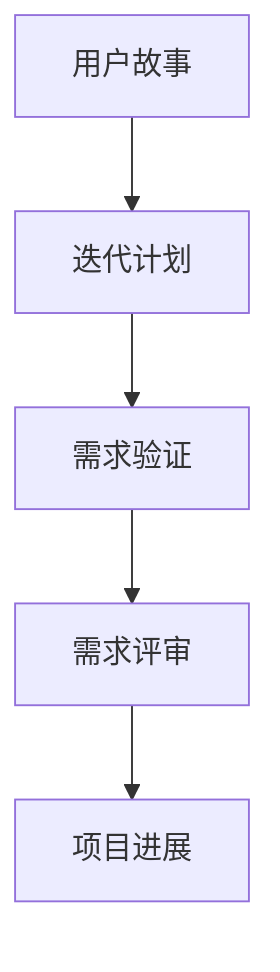

                 

# 敏捷研发模式下的需求评审新方法

## 关键词
敏捷研发，需求评审，用户故事地图，敏捷故事板，迭代管理，沟通与协作

## 摘要
在敏捷研发模式下，需求评审作为关键环节，其效率和准确性直接影响项目进展。本文将深入探讨敏捷研发模式下的需求评审新方法，包括用户故事地图、敏捷故事板等工具的应用，以及敏捷需求评审的流程管理、沟通与协作技巧。通过实际案例分析和详细讲解，本文旨在为敏捷项目团队提供有效的需求评审策略，助力项目成功。

## 引言
### 背景介绍
敏捷研发模式作为一种应对快速变化和复杂需求的方法论，在全球范围内得到广泛认可和实施。与传统研发模式相比，敏捷研发更注重灵活性和客户参与，通过快速迭代和持续交付来满足市场需求。在这种模式下，需求评审作为确保项目方向和产品质量的关键环节，其作用愈发突出。

### 核心概念与联系
在敏捷研发中，需求评审不仅仅是对需求文档的审核，更是一种持续的需求沟通和验证过程。核心概念包括用户故事、迭代计划和需求验证。这些概念相互关联，共同构建起敏捷需求评审的架构。

### 敏捷研发与需求评审的关系
敏捷研发强调客户价值和持续交付，需求评审则是在这一过程中确保需求得到准确理解和实现的重要手段。通过有效的需求评审，项目团队能够及时发现和解决潜在问题，降低风险，提高项目成功率。

## 第一部分：敏捷研发模式基础

### 第1章：敏捷研发模式概述

#### 1.1 敏捷研发模式的核心原则
敏捷研发模式的核心原则包括客户至上、迭代开发、持续交付、响应变化和团队合作。这些原则构成了敏捷方法论的基础，指导着项目团队在快速变化的环境中保持高效和灵活性。

#### 1.2 敏捷与传统的研发模式对比
与传统研发模式相比，敏捷研发更注重迭代和反馈，强调快速响应市场需求和客户需求变化。这种对比有助于理解敏捷需求评审的重要性。

#### 1.3 敏捷研发模式的常见实践
敏捷研发模式的常见实践包括每日站立会议、迭代规划、代码审查和回顾会议。这些实践有助于提升团队协作和项目透明度，为需求评审提供了良好的基础。

### 第2章：敏捷研发中的需求评审

#### 2.1 需求评审的重要性
需求评审是确保项目团队正确理解和实现需求的关键环节。它有助于识别需求中的模糊性、不一致性和错误，确保项目能够按计划顺利进行。

#### 2.2 传统需求评审的局限性
传统需求评审往往在项目后期进行，容易导致问题积压和项目延误。此外，传统评审方式对客户的参与度较低，难以及时响应需求变化。

#### 2.3 敏捷需求评审的新方法
敏捷需求评审采用了更加动态和参与性的方法，如用户故事地图、敏捷故事板和需求验证会议。这些新方法能够更好地适应敏捷研发模式的要求。

## 第二部分：敏捷需求评审新方法的应用

### 第3章：敏捷需求评审的工具与技术

#### 3.1 用户故事地图
用户故事地图是一种可视化工具，用于展示用户故事之间的关系和优先级。它有助于团队理解整体需求，确保每个用户故事都能够得到有效的实现。

#### 3.2 敏捷故事板
敏捷故事板是一种直观的看板工具，用于跟踪和管理用户故事的进度。通过敏捷故事板，团队能够实时了解项目的进展情况，及时调整计划和优先级。

#### 3.3 需求验证会议
需求验证会议是一种定期举行的需求审查会议，旨在验证用户故事的完整性和可实现性。通过需求验证会议，团队能够确保需求得到准确理解和实现。

### 第4章：敏捷需求评审的过程管理

#### 4.1 需求评审的流程设计
需求评审的流程设计包括需求收集、需求分析、需求评审和需求确认。通过合理的流程设计，团队能够高效地进行需求评审，确保需求得到有效管理。

#### 4.2 需求评审的迭代管理
迭代管理是敏捷研发的核心实践之一。在迭代管理中，需求评审作为关键环节，需要确保在每个迭代中都能够及时进行，以避免需求积压和项目延误。

#### 4.3 需求评审的质量保障
需求评审的质量保障包括评审标准、评审流程和评审人员的能力提升。通过质量保障措施，团队能够确保需求评审的准确性和有效性。

### 第5章：敏捷需求评审的沟通与协作

#### 5.1 沟通在敏捷需求评审中的作用
沟通是敏捷需求评审成功的关键。有效的沟通能够确保团队成员之间需求理解的准确性和一致性，提高项目进展的效率。

#### 5.2 多角色参与的需求评审
在敏捷需求评审中，多个角色（如产品经理、开发人员、测试人员和客户）的参与至关重要。通过多角色参与，团队能够从不同角度审视需求，确保需求的全面性和可实现性。

#### 5.3 提升沟通效率的策略
提升沟通效率的策略包括明确沟通目标、制定沟通计划、使用可视化工具和定期回顾。通过这些策略，团队能够提高沟通效果，确保需求评审的顺利进行。

### 第6章：敏捷需求评审的案例与实践

#### 6.1 成功的敏捷需求评审案例
通过分析成功的敏捷需求评审案例，我们可以了解到敏捷需求评审的最佳实践和方法，为其他项目提供借鉴。

#### 6.2 失败的敏捷需求评审案例
分析失败的敏捷需求评审案例，可以帮助我们识别常见的陷阱和问题，避免在类似情况下重蹈覆辙。

#### 6.3 案例分析与启示
通过对案例的分析，我们可以总结出敏捷需求评审的教训和启示，为敏捷项目团队提供实用的指导。

## 第三部分：敏捷需求评审新方法的深入探讨

### 第7章：敏捷需求评审在软件研发中的应用

#### 7.1 敏捷需求评审在软件研发中的流程
在软件研发中，敏捷需求评审的流程包括用户故事编写、故事地图绘制、故事板跟踪和需求验证会议。通过这些流程，团队能够确保软件研发过程中的需求得到有效管理。

#### 7.2 敏捷需求评审在软件研发中的实践
通过实际案例，我们可以看到敏捷需求评审在软件研发中的应用实践，以及如何通过需求评审提高软件质量和客户满意度。

#### 7.3 敏捷需求评审在软件研发中的效益分析
敏捷需求评审在软件研发中带来了哪些效益，如提高项目成功率、缩短开发周期、降低成本和提升客户满意度。通过效益分析，我们可以更清楚地认识到敏捷需求评审的重要性。

### 第8章：敏捷需求评审在其他领域的应用

#### 8.1 敏捷需求评审在移动应用开发中的应用
在移动应用开发中，敏捷需求评审如何帮助团队快速响应市场需求和客户反馈，确保应用的成功发布。

#### 8.2 敏捷需求评审在游戏开发中的应用
在游戏开发中，敏捷需求评审如何确保游戏功能的实现与市场需求的匹配，提高游戏质量。

#### 8.3 敏捷需求评审在其他领域的探索
敏捷需求评审在其他领域（如物联网、大数据等）的应用探索，以及如何根据不同领域的特点调整和优化需求评审方法。

### 第9章：敏捷需求评审的挑战与解决方案

#### 9.1 敏捷需求评审面临的挑战
敏捷需求评审在实施过程中可能遇到的挑战，如需求变化频繁、团队协作不畅、沟通效率低下等。

#### 9.2 应对敏捷需求评审挑战的策略
针对敏捷需求评审面临的挑战，提供相应的策略和解决方案，如强化团队协作、提升沟通技巧、采用自动化工具等。

#### 9.3 持续改进敏捷需求评审的方法
通过回顾和总结实践经验，不断改进敏捷需求评审的方法和流程，提高评审效率和准确性。

## 附录

### 附录A：敏捷需求评审工具推荐
介绍常用的敏捷需求评审工具，如用户故事地图工具、敏捷故事板工具等，帮助团队选择合适的工具。

### 附录B：敏捷需求评审资源推荐
推荐相关的书籍、在线课程和社群，为团队提供更多的学习资源和交流平台。

## 结语
作者信息：AI天才研究院/AI Genius Institute & 禅与计算机程序设计艺术 /Zen And The Art of Computer Programming

本文对敏捷研发模式下的需求评审新方法进行了深入探讨，从背景介绍、核心概念、工具与技术、过程管理、沟通与协作到实际案例，全面分析了敏捷需求评审在软件研发及其他领域的应用。希望通过本文的分享，能够为敏捷项目团队提供有益的启示和实践指导，助力项目的成功实施。

### 参考文献
[1] Beck, K. (2000). *Extreme Programming Explained: Embrace Change*. Addison-Wesley.
[2] Martin, R. C. (2010). *Agile Project Management: Creating Innovative Products*. Prentice Hall.
[3] Schwaber, K., & Beedle, M. (2002). *Agile Project Management with Scrum*. Microsoft Press.
[4] Cockburn, A. (2001). *Writing Effective User Stories*. IEEE Software, 18(6), 70-72.
[5] Becher, B., & Maxion, R. A. (2001). *User Story Mapping: Discover the Whole Story, Build the Right Product*. O'Reilly Media.

---

请注意，本文为大纲结构，具体内容需要根据实际研究和技术深度进一步撰写。以下是对每个章节的简要概述和内容要求。

### 第1章：敏捷研发模式概述

**内容要求：**
- 简要介绍敏捷研发模式的起源和发展。
- 详细阐述敏捷研发模式的核心原则，如客户至上、迭代开发、持续交付等。
- 对比敏捷与传统的研发模式，强调敏捷的优势和适用场景。
- 提出敏捷研发模式在市场需求变化快速环境中的重要性。

### 第2章：敏捷研发中的需求评审

**内容要求：**
- 阐述需求评审在敏捷研发中的角色和重要性。
- 分析传统需求评审的局限性，如需求变更频繁、沟通不畅等。
- 介绍敏捷需求评审的新方法，如用户故事、故事地图、故事板等。
- 提出敏捷需求评审的原则和实践，如持续需求沟通、迭代评审等。

### 第3章：敏捷需求评审的工具与技术

**内容要求：**
- 详细介绍用户故事地图的概念、绘制方法和应用场景。
- 解释敏捷故事板的作用、结构和使用方法。
- 讨论需求验证会议的目的、流程和参与人员。
- 提出如何利用这些工具提高需求评审的效率和准确性。

### 第4章：敏捷需求评审的过程管理

**内容要求：**
- 阐述敏捷需求评审的流程设计原则和具体步骤。
- 分析迭代管理在需求评审中的作用和策略。
- 讨论如何保障需求评审的质量，如制定评审标准和流程。
- 提出过程改进的方法，如持续回顾和迭代优化。

### 第5章：敏捷需求评审的沟通与协作

**内容要求：**
- 阐述沟通在敏捷需求评审中的重要性。
- 分析多角色参与的需求评审的优势和挑战。
- 提供提升沟通效率的策略，如使用可视化工具、建立沟通渠道等。
- 讨论团队协作在需求评审中的关键因素。

### 第6章：敏捷需求评审的案例与实践

**内容要求：**
- 分析成功的敏捷需求评审案例，总结成功经验。
- 分析失败的敏捷需求评审案例，识别失败原因。
- 通过案例分析，提炼出敏捷需求评审的最佳实践。

### 第7章：敏捷需求评审在软件研发中的应用

**内容要求：**
- 描述敏捷需求评审在软件研发中的具体流程和实践。
- 分析敏捷需求评审在软件研发中的效益，如提高产品质量、缩短开发周期等。
- 提供实际案例，展示敏捷需求评审在软件研发中的应用效果。

### 第8章：敏捷需求评审在其他领域的应用

**内容要求：**
- 探讨敏捷需求评审在移动应用开发、游戏开发等领域的应用。
- 分析这些领域对敏捷需求评审方法的调整和优化。
- 提供实际案例，展示敏捷需求评审在其他领域的应用效果。

### 第9章：敏捷需求评审的挑战与解决方案

**内容要求：**
- 分析敏捷需求评审面临的挑战，如需求变更频繁、团队协作困难等。
- 提出相应的解决方案和策略，如强化团队协作、优化需求沟通等。
- 讨论如何通过持续改进提高敏捷需求评审的效率和准确性。

通过以上详细的章节内容要求，本文将为读者提供一份全面、系统的敏捷需求评审指南，帮助敏捷项目团队更好地应对挑战，实现项目成功。在撰写过程中，需要结合具体案例和实际经验，确保内容的实用性和可操作性。

