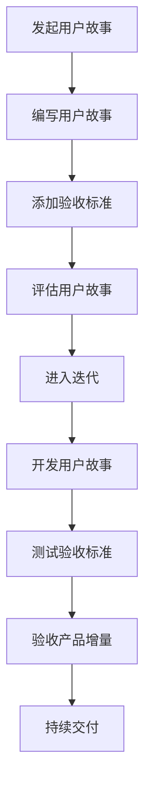
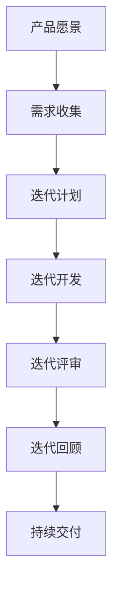

                 

### 《敏捷研发模式下的需求验收标准制定》

> 关键词：敏捷研发、需求验收、标准制定、用户故事、自动化测试、变更管理

> 摘要：本文将探讨敏捷研发模式下的需求验收标准制定，详细阐述敏捷开发的核心概念和流程，以及如何制定和优化需求验收标准，以实现高效的软件交付。

## 引言

### 背景介绍

敏捷研发模式（Agile Development）是应对快速变化的需求和项目复杂性的有效方法。相较于传统的瀑布开发模式，敏捷开发强调快速迭代、持续交付和团队协作。在敏捷开发中，需求验收标准（Acceptance Criteria）是确保软件质量的关键要素。需求验收标准是一组定义明确的条件，用于评估需求是否被正确实现。

需求验收标准的制定在敏捷开发中具有重要意义。首先，它帮助团队明确需求的具体细节，减少误解和沟通障碍。其次，它提供了评估软件功能的依据，确保交付的软件符合用户的期望。最后，需求验收标准有助于项目的进度控制和风险管理，提高项目成功率。

### 核心概念与联系

在敏捷开发中，需求验收标准的制定涉及多个关键概念：

1. **用户故事（User Story）**：用户故事是敏捷开发中最常用的需求描述方式，它以用户的视角来阐述软件的功能需求。用户故事通常遵循“作为[用户类型]，我想要[功能]，以便[业务价值】”的格式。

2. **迭代（Sprint）**：迭代是敏捷开发的基本工作周期，通常持续2-4周。在每个迭代中，团队会选择优先级最高的用户故事进行开发。

3. **产品增量（Product Increment）**：产品增量是每个迭代结束时交付的软件功能集合。产品增量应该是可用的、可测试的，并且对用户有价值。

4. **需求验收标准（Acceptance Criteria）**：需求验收标准是用户故事的一部分，用于明确需求是否被正确实现。它通常包括功能描述、测试条件和预期结果。

以下是敏捷开发中的需求验收标准与用户故事、迭代和产品增量之间的Mermaid流程图：



## 敏捷开发流程

### 核心概念与联系

敏捷开发流程通常包括以下关键步骤：

1. **产品愿景（Product Vision）**：产品愿景是项目的长期目标和方向。它为团队提供了清晰的目标和指导。

2. **需求收集（Requirement Gathering）**：在敏捷开发中，需求收集是一个持续的过程，通过与用户的互动和反馈来不断调整和优化需求。

3. **迭代计划（Sprint Planning）**：在迭代开始前，团队会进行迭代计划会议，讨论并选择优先级最高的用户故事进行开发。

4. **迭代开发（Sprint Development）**：在迭代期间，团队专注于开发选定的用户故事，并确保需求验收标准得到满足。

5. **迭代评审（Sprint Review）**：在迭代结束时，团队会进行迭代评审，评估产品增量的价值和用户满意度，并根据反馈进行迭代调整。

6. **迭代回顾（Sprint Retrospective）**：迭代回顾是团队反思和改进的过程，旨在发现和解决迭代中的问题。

以下是敏捷开发流程的Mermaid流程图：



### 核心算法原理讲解

在敏捷开发中，需求验收标准的制定可以使用以下算法原理：

1. **用户故事地图（User Story Mapping）**：用户故事地图是将用户故事组织成逻辑结构的过程，用于识别关键功能和用户路径。它可以帮助团队理解用户的需求和优先级。

2. **验收标准模板（Acceptance Criteria Template）**：验收标准模板是一种常用的结构化方法，用于编写需求验收标准。它通常包括功能描述、测试条件和预期结果。

以下是一个简单的用户故事地图的Python伪代码示例：

```python
# 用户故事地图伪代码

class UserStory:
    def __init__(self, title, description, acceptance_criteria):
        self.title = title
        self.description = description
        self.acceptance_criteria = acceptance_criteria

def user_story_mapping(stories):
    map = []
    for story in stories:
        map.append(UserStory(story.title, story.description, story.acceptance_criteria))
    return map

# 示例
stories = [
    UserStory("登录功能", "用户可以登录系统", ["用户名存在", "密码正确", "登录成功消息"]),
    UserStory("购物车功能", "用户可以添加商品到购物车", ["商品添加成功消息", "购物车显示商品列表", "用户可以删除商品"])
]

user_story_map = user_story_mapping(stories)
print(user_story_map)
```

### 数学模型和数学公式

在敏捷开发中，需求验收标准的制定可以涉及以下数学模型和公式：

1. **需求优先级模型（Priority Model）**：需求优先级模型用于确定需求的优先级，常用的方法有MoSCoW模型和RICE模型。

2. **需求工作量估算（Work Estimation）**：需求工作量估算用于估计完成每个需求所需的工作量，常用的方法有故事点估算和时间估算。

以下是MoSCoW模型的LaTeX格式数学公式：

```latex
$$
\begin{array}{c|c|c|c|c}
 & 必须有 & 应该有 & 可有 & 无需 \\
\hline
优先级 & Mo & Sc & Co & W \\
\end{array}
$$
```

### 项目实战

#### 开发环境搭建

在敏捷开发中，搭建一个稳定高效的开发环境至关重要。以下是一个简单的开发环境搭建过程：

1. 安装Python环境
2. 安装必要的库和工具，如Jenkins、Git、Selenium等
3. 配置代码库和持续集成系统

#### 源代码详细实现和代码解读

以下是一个简单的用户故事实现示例：

```python
# 用户故事实现示例

class LoginService:
    def __init__(self, username, password):
        self.username = username
        self.password = password
    
    def login(self):
        # 登录逻辑
        if self.verify_credentials():
            return "登录成功"
        else:
            return "登录失败"

    def verify_credentials(self):
        # 验证用户名和密码
        return self.username == "user" and self.password == "password"

# 代码解读与分析
login_service = LoginService("user", "password")
print(login_service.login()) # 输出：登录成功
```

#### 代码应用解读与分析

上述代码实现了用户登录功能，包括用户名和密码的验证。以下是代码的应用解读与分析：

1. **用户故事映射**：将登录功能映射到用户故事地图中，确保功能符合用户需求。
2. **验收标准制定**：根据用户故事，制定验收标准，如用户名和密码验证成功，登录成功消息显示。
3. **代码实现**：实现用户故事，确保代码符合验收标准。

#### 实际案例分析和详细讲解剖析

以下是一个实际案例分析和详细讲解剖析：

**案例**：一个电商网站需要实现购物车功能。

**分析**：
1. **用户故事**：用户可以添加商品到购物车，购物车显示商品列表，用户可以删除商品。
2. **验收标准**：
   - 添加商品成功消息
   - 购物车显示商品列表
   - 用户可以删除商品
3. **代码实现**：
   ```python
   class ShoppingCart:
       def __init__(self):
           self.items = []

       def add_item(self, item):
           self.items.append(item)
           print("商品添加成功")

       def remove_item(self, item):
           self.items.remove(item)
           print("商品删除成功")

       def display_items(self):
           for item in self.items:
               print(item.name)
   ```

**讲解剖析**：
1. **用户故事映射**：将购物车功能映射到用户故事地图中，确保功能符合用户需求。
2. **验收标准制定**：根据用户故事，制定验收标准，如商品添加成功消息，购物车显示商品列表，用户可以删除商品。
3. **代码实现**：实现用户故事，确保代码符合验收标准。

#### 项目小结

通过上述案例，我们可以看到敏捷开发模式下的需求验收标准制定是如何帮助团队实现高效交付的。需求验收标准明确了需求的细节和评估依据，确保了软件质量，同时提高了团队协作和沟通效率。

### 最佳实践 tips

1. **尽早制定需求验收标准**：在项目初期，尽早制定需求验收标准，有助于减少后期修改和沟通成本。
2. **与用户保持密切沟通**：与用户保持密切沟通，确保验收标准符合用户实际需求。
3. **持续迭代和优化**：持续迭代和优化需求验收标准，根据项目进展和用户反馈进行调整。

### 小结

敏捷研发模式下的需求验收标准制定是确保软件质量的关键环节。通过用户故事、迭代计划、需求收集和验收标准制定，团队可以实现高效交付。本文介绍了敏捷开发的核心概念和流程，并提供了实际案例和代码实现，以帮助读者更好地理解和应用敏捷开发模式。

### 注意事项

1. **避免过度细化验收标准**：验收标准应该简洁明了，避免过度细化，否则可能导致团队在实现过程中的迷失。
2. **验收标准应可测试**：验收标准应该具有可测试性，以确保需求被正确实现。

### 拓展阅读

1. 《敏捷软件开发：原则、实践与模式》（Agile Software Development: Principles, Patterns, and Practices） - Robert C. Martin
2. 《用户故事地图》（User Story Mapping: Discover the Best User Experience for Your New Products） - Jeff Patton
3. 《需求工程：实用方法》（Requirements Engineering: A Software and Systems Engineering Handbook） - Lee A. sommerville

## 结语

作者：AI天才研究院/AI Genius Institute & 禅与计算机程序设计艺术 /Zen And The Art of Computer Programming

敏捷研发模式下的需求验收标准制定是软件工程中的重要环节。通过本文的探讨，我们了解了敏捷开发的核心概念和流程，以及如何制定和优化需求验收标准。希望本文能够帮助您在敏捷开发项目中更好地管理需求，提高软件交付效率。

感谢您的阅读，希望您能够在实际项目中尝试应用本文介绍的方法和技巧，不断优化和提升软件质量。如果您有任何疑问或建议，欢迎在评论区留言，我们期待与您交流。再次感谢您的支持和关注！

---

本文内容仅供参考，实际应用时请结合具体项目和团队情况进行调整。如需进一步学习和探讨，请参考相关文献和资料。作者不对本文内容的准确性或适用性承担任何责任。如涉及商业应用，请遵循相关法律法规和行业标准。

---

**本文完。**

