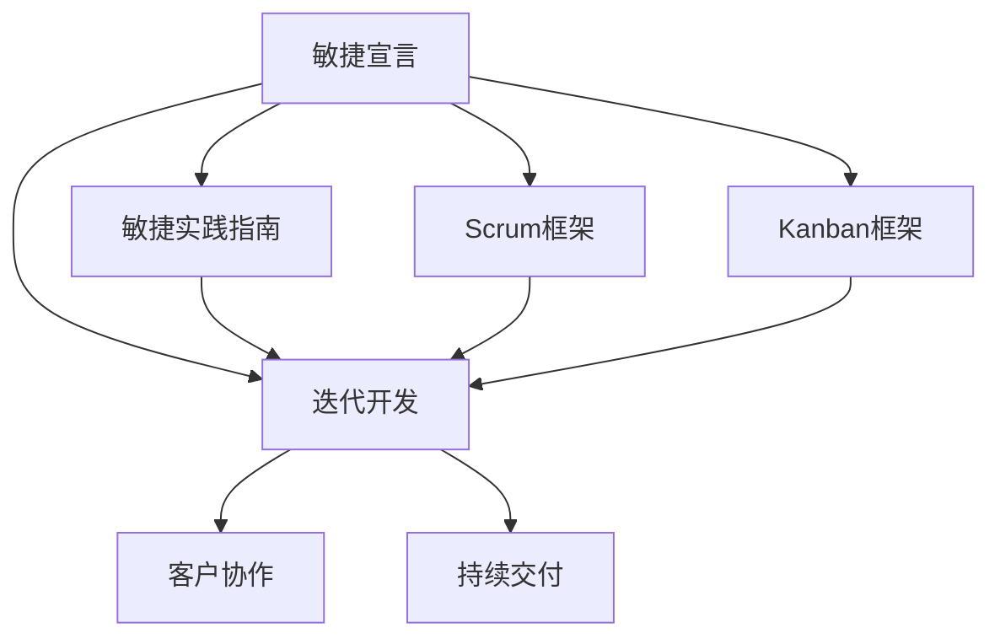

                 

### 敏捷研发模式概述

#### 第1章：敏捷研发模式基础

敏捷研发模式，是一种以人为核心、迭代式、增量的软件开发方法。其核心理念是快速响应变化，通过持续交付有价值的软件来满足客户的需求。本章将详细介绍敏捷研发模式的基本概念、核心原则以及与传统研发模式的对比，帮助读者建立对敏捷研发模式的基础理解。

##### 1.1 敏捷研发模式定义与核心原则

敏捷研发模式起源于20世纪90年代，是一种应对快速变化需求的软件开发能力。它强调团队协作、持续交付和客户满意度。以下是敏捷研发模式的核心原则：

1. **个体和互动重于过程和工具**：敏捷强调人的作用，认为高效沟通和协作比使用特定工具更为重要。
2. **可工作的软件重于详尽的文档**：敏捷认为软件的实际运行效果比文档重要，因此更注重代码的实现。
3. **客户协作重于合同谈判**：敏捷提倡与客户紧密合作，及时获取反馈以调整开发方向。
4. **响应变化重于遵循计划**：敏捷接受变化，并认为灵活应对变化比坚持原计划更为重要。

##### 1.1.1 敏捷研发模式的历史背景

敏捷研发模式的起源可以追溯到1991年，当时17位软件专家在美国犹他州的雪鸟山庄会议上共同起草了《敏捷宣言》。这份宣言阐述了敏捷开发的核心原则，标志着敏捷研发模式的诞生。此后，敏捷研发模式在全球范围内迅速传播，并逐渐形成了各种敏捷实践指南。

##### 1.1.2 敏捷研发模式的核心原则

敏捷研发模式的核心原则包括以下四个方面：

1. **价值驱动**：敏捷开发强调以客户需求为导向，持续交付有价值的软件。
2. **迭代开发**：敏捷开发采用迭代的方式，每次迭代都交付一个可工作的产品版本。
3. **协作沟通**：敏捷团队之间强调高效沟通，以快速响应需求变化。
4. **灵活应对变化**：敏捷开发接受变化，并鼓励团队在开发过程中灵活调整计划和策略。

##### 1.1.3 敏捷与传统的研发模式对比

传统研发模式，如瀑布模型，通常遵循一个线性、顺序的开发过程，从需求分析到设计、开发、测试，直到最终交付。而敏捷研发模式则强调灵活性和迭代性，更加关注团队协作和客户满意度。

**优势对比：**

- **灵活性**：敏捷开发能够更好地应对需求变化，快速调整开发计划。
- **客户满意度**：敏捷开发注重持续交付有价值的软件，能够更快速地满足客户需求。
- **团队协作**：敏捷开发强调团队合作，有助于提高团队整体效率。

**劣势对比：**

- **文档不足**：敏捷开发强调代码而非文档，可能导致文档不足。
- **项目管理挑战**：敏捷开发中的频繁迭代和变化可能增加项目管理的复杂性。

##### 1.2 敏捷研发流程

敏捷研发流程通常包括以下几个阶段：

1. **需求收集**：通过与客户和利益相关者沟通，了解并收集需求。
2. **需求梳理**：对收集到的需求进行整理和分析，确定优先级。
3. **迭代计划**：根据需求优先级，将需求分解为迭代任务。
4. **迭代开发**：在迭代周期内，团队完成选定的任务，并进行测试和验收。
5. **迭代回顾**：对迭代过程进行总结和反思，持续改进开发流程。

##### 1.2.1 敏捷开发的主要阶段

1. **阶段1：需求收集**：与客户和利益相关者沟通，收集需求。
2. **阶段2：需求梳理**：对需求进行优先级排序，形成需求文档。
3. **阶段3：迭代计划**：根据需求文档，制定迭代计划。
4. **阶段4：迭代开发**：在迭代周期内，完成选定的任务。
5. **阶段5：迭代测试与验收**：对迭代成果进行测试和验收。

##### 1.2.2 敏捷团队的角色与职责

敏捷团队通常包括以下角色：

- **产品负责人（Product Owner）**：负责定义产品愿景、设定需求优先级。
- **开发人员（Developer）**：负责实现需求，编写代码。
- **测试人员（Tester）**：负责测试代码，确保产品质量。
- **Scrum Master**：负责指导团队执行敏捷实践，确保团队高效运作。

##### 1.2.3 敏捷实践中的关键活动

1. **每日站会**：团队每天召开短暂的站会，讨论进展和问题。
2. **迭代评审**：在每个迭代结束时，进行评审，展示迭代成果，获取反馈。
3. **迭代回顾**：在每个迭代结束后，进行回顾，总结经验教训，持续改进。

##### 1.3 敏捷开发工具与框架

敏捷开发中常用的工具和框架包括：

- **项目管理工具**：如Jira、Trello等，用于任务管理和进度跟踪。
- **敏捷框架**：如Scrum、Kanban等，用于指导敏捷实践。
- **自动化测试工具**：如Selenium、JMeter等，用于提高测试效率。

##### 1.3.1 敏捷项目管理工具

敏捷项目管理工具如Jira、Trello等，可以帮助团队高效地管理任务、跟踪进度和协作。这些工具提供了可视化的看板、优先级排序、任务分配等功能，使得团队能够更好地协调工作。

##### 1.3.2 敏捷开发框架简介

敏捷开发框架如Scrum、Kanban等，提供了敏捷实践的具体指南。Scrum强调迭代和增量开发，通过每日站会、迭代评审和迭代回顾等活动，确保团队能够高效协作和持续改进。Kanban则注重工作流程的优化，通过限制在流程中的工作项数量，减少等待时间和浪费。

##### 1.3.3 敏捷实践中的常见挑战与解决方案

敏捷实践过程中可能会面临一些挑战，如团队沟通不畅、需求变更频繁、进度控制困难等。针对这些挑战，可以采取以下解决方案：

- **提升团队沟通能力**：定期组织团队沟通会议，确保信息畅通。
- **明确需求优先级**：通过需求优先级排序，确保团队专注于最有价值的任务。
- **灵活调整计划**：接受需求变化，及时调整开发计划，以适应变化。

#### 1.4 敏捷研发模式的优缺点

敏捷研发模式具有以下优点：

- **灵活应对变化**：敏捷开发能够快速适应需求变化，提高项目成功率。
- **提高客户满意度**：通过持续交付有价值的软件，提高客户满意度。
- **增强团队协作**：敏捷开发强调团队合作，提高团队整体效率。

然而，敏捷研发模式也存在一些缺点：

- **文档不足**：敏捷开发强调代码，可能导致文档不足，影响后续维护。
- **管理难度**：敏捷开发中的频繁迭代和变化可能增加项目管理的复杂性。

总之，敏捷研发模式是一种适应快速变化的软件开发方法，具有明显的优势。但团队在实施过程中需要充分考虑其缺点，并采取相应的措施，以确保项目顺利进行。

---

**核心概念与联系**

敏捷研发模式的核心概念包括敏捷宣言、迭代开发、客户协作和持续交付等。这些概念之间存在着紧密的联系，构成了敏捷研发模式的理论基础。以下是这些概念之间的联系架构图：



**核心算法原理讲解**

敏捷研发模式中的迭代开发是一种基于增量交付的开发方法，其核心算法原理是逐步迭代和增量交付。以下是一个简单的Python代码示例，用于模拟迭代开发的算法过程：

```python
def iterative_development(tasks, iterations):
    for iteration in range(iterations):
        for task in tasks:
            # 完成任务
            print(f"完成迭代{iteration+1}中的任务：{task}")
            # 验收任务
            if task_qualified(task):
                print(f"迭代{iteration+1}中的任务{task}已验收")
            else:
                print(f"迭代{iteration+1}中的任务{task}未通过验收，需要重新开发")

def task_qualified(task):
    # 判断任务是否合格的简单逻辑
    return True if "合格" in task else False

# 测试迭代开发算法
tasks = ["任务1", "任务2", "任务3"]
iterative_development(tasks, 2)
```

在上面的代码中，`iterative_development` 函数模拟了迭代开发的过程，每次迭代都会完成并验收任务。`task_qualified` 函数用于判断任务是否合格，这里使用了简单的逻辑来模拟验收过程。

**数学公式**

敏捷研发模式中的核心指标包括迭代周期（Iteration Cycle Time）、任务完成率（Task Completion Rate）和客户满意度（Customer Satisfaction）。以下是这些指标的定义和计算公式：

$$
\text{迭代周期（Iteration Cycle Time）} = \frac{\text{迭代持续时间}}{\text{迭代次数}}
$$

$$
\text{任务完成率（Task Completion Rate）} = \frac{\text{已完成任务数}}{\text{总任务数}}
$$

$$
\text{客户满意度（Customer Satisfaction）} = \frac{\text{满意客户数}}{\text{总客户数}}
$$

**项目实战**

在一个电子商务平台项目中，团队采用了敏捷研发模式，以下是项目实战的具体步骤：

1. **需求收集**：通过与客户沟通，收集用户需求和业务需求。
2. **需求梳理**：对需求进行优先级排序，确定迭代计划。
3. **迭代开发**：在第一个迭代周期内，团队完成了用户注册模块的开发。
4. **迭代测试与验收**：对用户注册模块进行功能测试和验收测试，确保其符合需求。
5. **迭代回顾**：对迭代过程进行总结，讨论改进措施。

**开发环境搭建**

在敏捷研发模式下，团队搭建了以下开发环境：

1. **代码管理工具**：Git，用于版本控制和协同工作。
2. **项目管理工具**：Jira，用于任务管理和进度跟踪。
3. **集成开发环境**：IntelliJ IDEA，提供代码编辑、调试和自动化测试等功能。

**源代码详细实现和代码解读**

以下是用户注册模块的源代码实现：

```python
class UserRegistration:
    def __init__(self, username, password):
        self.username = username
        self.password = password

    def register(self):
        if self.validate():
            print(f"用户{self.username}注册成功")
        else:
            print(f"用户{self.username}注册失败")

    def validate(self):
        # 用户名和密码的验证逻辑
        return True if len(self.username) > 5 and len(self.password) > 8 else False

# 测试用户注册模块
user = UserRegistration("user123", "password123")
user.register()
```

在上面的代码中，`UserRegistration` 类用于表示用户注册模块，其中包括用户名和密码的验证逻辑。`register` 方法用于注册用户，`validate` 方法用于验证用户名和密码是否符合要求。

**代码应用解读与分析**

用户注册模块的代码实现了用户名和密码的验证功能，通过调用 `register` 方法，可以完成用户的注册过程。在实际应用中，用户注册模块还需要与数据库进行交互，以存储用户信息。

**实际案例分析和详细讲解剖析**

在一个电子商务平台项目中，用户注册模块是核心功能之一。团队在第一个迭代周期内完成了用户注册模块的开发，并通过了功能测试和验收测试。以下是具体分析：

- **功能测试**：测试了用户名和密码的验证功能，确保其符合预期。
- **验收测试**：通过与客户沟通，确认用户注册模块的功能和用户体验符合需求。

**项目小结**

通过敏捷研发模式，团队在电子商务平台项目中成功完成了用户注册模块的开发。项目过程中，团队采用了迭代开发和持续交付的方法，确保了项目的顺利进行和高质量交付。

**最佳实践 tips**

1. **定期进行需求收集和梳理**：确保需求始终与业务目标保持一致。
2. **合理规划迭代周期**：避免过长或过短的迭代周期，以提高开发效率。
3. **重视测试和验收**：确保每个迭代周期内的成果符合需求。

**小结**

敏捷研发模式通过迭代开发和持续交付，能够更好地适应需求变化，提高项目成功率和客户满意度。团队在实施敏捷研发模式时，需要充分考虑其优缺点，并采取相应的措施，以确保项目顺利进行。在下一个部分中，我们将进一步探讨需求验收自动化工具的选择与实施策略。

