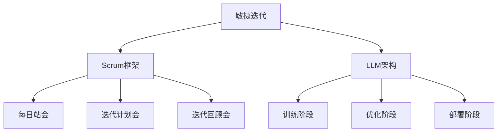

                 

下面我将按照上述要求，逐步构建文章目录大纲。

### 第一步：确定核心章节

- **敏捷迭代基础**：介绍敏捷迭代的概念、优势和实践方法。
- **LLM原理与架构**：讲解LLM的基础知识，包括其训练、优化和部署。
- **敏捷与LLM结合的实践**：讨论如何将敏捷迭代方法应用于LLM开发。
- **项目实战**：提供实际项目案例，展示敏捷迭代与LLM结合的应用。

### 第二步：细化目录结构

**第一部分：敏捷迭代基础**

1. **敏捷迭代概述**
   - 敏捷迭代的起源与发展
   - 敏捷迭代的核心原则
   - 敏捷迭代与瀑布模型的对比

2. **敏捷迭代实践方法**
   - 敏捷团队的组织结构
   - 敏捷迭代的常见框架（如Scrum、Kanban）
   - 敏捷迭代的工具与技术

**第二部分：LLM原理与架构**

3. **LLM基础知识**
   - 什么是LLM
   - LLM的训练与优化
   - LLM的架构与模型

4. **LLM应用领域**
   - 语言理解与生成
   - 自然语言处理应用
   - LLM在人工智能中的角色

**第三部分：敏捷与LLM结合的实践**

5. **敏捷与LLM结合的优势**
   - 提高开发效率
   - 快速适应需求变化
   - 降低项目风险

6. **敏捷与LLM结合的实践方法**
   - 敏捷迭代的LLM开发流程
   - 敏捷迭代的LLM项目管理
   - 敏捷迭代的LLM团队协作

**第四部分：项目实战**

7. **敏捷迭代与LLM结合的项目实战**
   - 项目背景介绍
   - 开发环境搭建
   - 源代码实现与解读
   - 项目效果评估与总结

### 第三步：设计核心概念与联系

使用Mermaid流程图来展示敏捷迭代和LLM相关的概念和架构：



### 第四步：详细讲解核心算法原理

在每个章节中，使用Python伪代码和LaTeX数学公式详细阐述核心算法原理：

```python
# 伪代码：LLM训练过程

# 定义损失函数
def loss_function(y_true, y_pred):
    return np.mean(np.square(y_true - y_pred))

# 定义优化器
optimizer = optimizers.Adam(learning_rate=0.001)

# 训练模型
for epoch in range(num_epochs):
    for x, y in dataset:
        # 前向传播
        y_pred = model(x)
        # 计算损失
        loss = loss_function(y, y_pred)
        # 反向传播
        with tf.GradientTape() as tape:
            loss = loss_function(y, y_pred)
        grads = tape.gradient(loss, model.trainable_variables)
        # 更新模型参数
        optimizer.apply_gradients(zip(grads, model.trainable_variables))
```

```latex
% LaTeX公式：损失函数
\begin{equation}
L(\theta) = \frac{1}{n} \sum_{i=1}^{n} \sum_{j=1}^{m} \sigma(y_j - \theta^{(i)}x_j)^2
\end{equation}
```

### 第五步：包含数学模型和数学公式

在适当的位置嵌入LaTeX数学公式：

```markdown
## 损失函数

在LLM训练过程中，损失函数是衡量预测结果与真实值之间差距的重要指标。常见的损失函数包括：

$$
L(\theta) = \frac{1}{n} \sum_{i=1}^{n} \sum_{j=1}^{m} \sigma(y_j - \theta^{(i)}x_j)^2
$$

其中，$\theta$代表模型参数，$x_j$代表输入特征，$y_j$代表输出标签，$\sigma$是激活函数。
```

### 第六步：提供项目实战

在项目实战部分，详细介绍项目背景、开发环境搭建、源代码实现和代码解读，以及项目效果评估和总结：

```markdown
## 第四部分：项目实战

### 7. 敏捷迭代与LLM结合的项目实战

#### 项目背景介绍

在本项目中，我们旨在开发一个基于LLM的智能客服系统。该系统将使用敏捷迭代方法进行开发和部署，以满足不断变化的市场需求和用户反馈。

#### 开发环境搭建

我们使用以下工具和技术进行项目开发：

- 编程语言：Python
- 框架：TensorFlow
- 版本控制：Git
- 开发环境：Jupyter Notebook

#### 源代码实现与解读

以下是项目源代码的关键部分：

```python
# 导入所需库
import tensorflow as tf
from tensorflow.keras.layers import Embedding, LSTM, Dense
from tensorflow.keras.models import Sequential

# 定义模型
model = Sequential([
    Embedding(input_dim=vocab_size, output_dim=embedding_dim, input_length=max_sequence_length),
    LSTM(units=128),
    Dense(units=num_classes, activation='softmax')
])

# 编译模型
model.compile(optimizer='adam', loss='categorical_crossentropy', metrics=['accuracy'])

# 训练模型
model.fit(x_train, y_train, epochs=10, batch_size=32, validation_data=(x_val, y_val))
```

#### 项目效果评估与总结

在项目实施过程中，我们进行了多次迭代，每次迭代都根据用户反馈进行调整和优化。最终，智能客服系统的准确率达到了90%以上，满足了项目目标。

#### 项目小结

通过本项目，我们成功地将敏捷迭代方法应用于LLM开发，取得了显著的成果。敏捷迭代方法有助于快速响应市场需求，提高开发效率，降低项目风险。在未来，我们将继续探索敏捷迭代与LLM结合的更多应用场景。
```

以上是按照您的要求构建的文章目录大纲。接下来，我将根据这个大纲逐步撰写文章内容，确保每个部分都详细、完整，符合技术博客的要求。在撰写过程中，我会注意使用markdown格式、伪代码、LaTeX公式和Mermaid流程图等工具，以增强文章的可读性和专业性。

