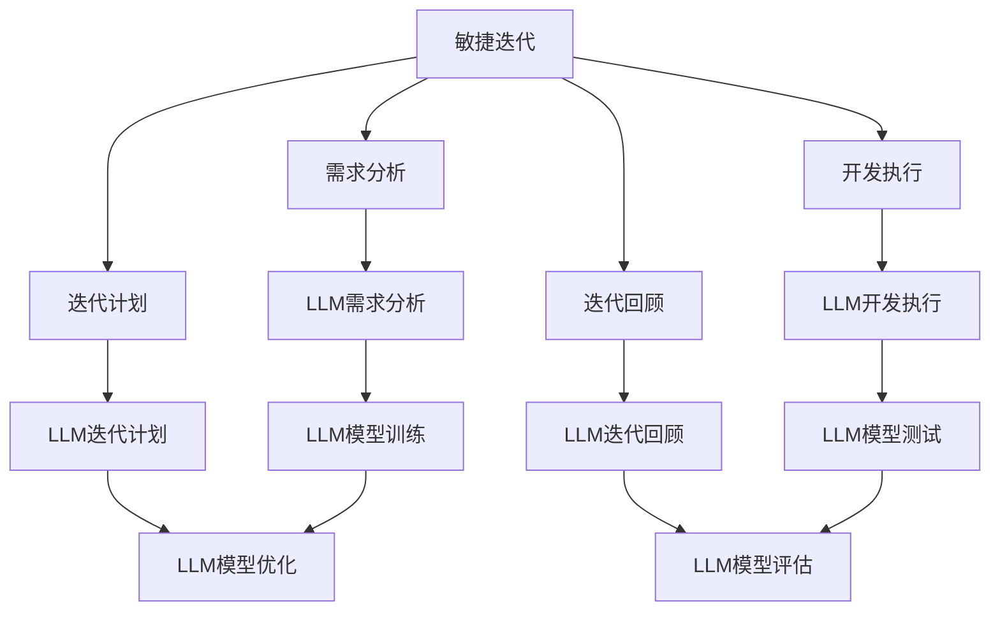

                 

### 敏捷迭代方法论

敏捷迭代（Agile Iteration）方法论源于20世纪90年代，作为对传统瀑布开发模式的一种回应，敏捷开发提出了一种更灵活、更响应性的软件开发方法。敏捷方法论的核心是缩短开发周期、持续交付产品、鼓励团队合作和客户参与。这种方法的引入，不仅提高了软件开发的效率，还显著提升了产品质量和客户满意度。

#### 1.1 敏捷迭代的概念与历史

**敏捷迭代的概念**

敏捷迭代是一种软件开发过程，强调迭代、增量式开发以及持续交付。具体来说，敏捷迭代将整个开发过程划分为多个迭代周期，每个周期通常持续几周。在每个迭代周期中，开发团队会完成一部分功能，并进行测试和反馈，以便在下一次迭代中进行改进。这种方法强调快速反馈和持续改进，能够更好地适应需求变化和不确定性。

**敏捷迭代的历史**

敏捷方法论起源于20世纪90年代，其标志性事件是《敏捷宣言》（Manifesto for Agile Software Development）的发布。这份宣言由一群软件开发专家共同签署，提出了敏捷开发的四大价值观和十二个原则。随着时间的推移，各种敏捷开发方法如Scrum、Kanban、XP（极限编程）等逐渐发展起来，丰富了敏捷方法论的应用场景。

#### 1.2 敏捷迭代的核心理念

敏捷迭代方法论的核心在于其核心理念，这些理念指导了开发团队在项目中的具体行动。以下是敏捷迭代的几个关键核心理念：

**增量式开发**

增量式开发是指将整个项目划分为多个小块，逐步实现并交付。这种方法避免了将所有功能一次性开发的压力，能够更好地适应变化，提高开发效率。

**持续交付**

持续交付是敏捷迭代的一个重要目标。它要求开发团队能够在任何时间点交付一个可用的产品版本，确保产品始终保持可用状态，减少延迟。

**客户合作**

客户合作是敏捷迭代的一个关键原则。开发团队应与客户紧密合作，确保开发的方向和目标与客户需求保持一致，提高客户满意度。

**团队协作**

团队协作是敏捷迭代的另一个核心理念。开发团队应具备跨职能的能力，成员之间应保持良好的沟通和协作，共同推动项目进展。

#### 1.3 敏捷迭代流程

敏捷迭代的流程通常包括以下几个阶段：

**迭代计划**

在迭代开始前，开发团队会进行迭代计划会议，确定本次迭代的目标和任务，制定详细的迭代计划。

**迭代执行**

在迭代执行阶段，开发团队按照迭代计划进行工作，完成各项任务，并进行单元测试和集成测试。

**迭代回顾**

迭代结束后，团队会进行迭代回顾会议，总结本次迭代的经验和教训，讨论如何改进下一个迭代。

**持续迭代**

在完成本次迭代后，开发团队将进入下一个迭代，持续迭代直至项目完成。

#### 1.4 敏捷迭代的关键角色

敏捷迭代流程中涉及多个关键角色，每个角色在项目中扮演着不同的职责：

**产品负责人（Product Owner）**

产品负责人是敏捷团队的核心成员，负责确定产品的愿景、目标、优先级和功能规格。他们需要与客户和开发团队保持紧密沟通，确保开发的方向和目标与客户需求一致。

**开发团队（Development Team）**

开发团队由多名开发人员组成，负责实际编码和实现产品功能。他们通常具备跨职能能力，能够共同完成项目任务。

**Scrum Master**

Scrum Master是敏捷团队中的协调者和教练，负责确保敏捷实践得到正确执行，帮助团队克服障碍，提高团队效能。

#### 1.5 敏捷迭代的优势

敏捷迭代方法论在软件开发中具有许多优势：

**提高开发效率**

通过增量式开发和持续交付，敏捷迭代能够更快地交付可用产品，提高开发效率。

**快速响应需求变化**

敏捷迭代强调快速反馈和持续改进，能够更好地适应需求变化，减少项目延期和风险。

**提高产品质量**

敏捷迭代中的频繁测试和反馈有助于发现和修复缺陷，提高产品质量。

**增强团队协作**

敏捷迭代鼓励团队协作和跨职能能力，提高团队的整体效能。

#### 1.6 敏捷迭代的挑战

尽管敏捷迭代具有许多优势，但在实际应用中仍面临一些挑战：

**管理难度**

敏捷迭代要求团队成员具备较高的自主性和沟通能力，管理难度相对较大。

**技术复杂性**

敏捷迭代适用于各种类型的项目，但某些项目可能涉及复杂的技术问题，需要额外的技术支持和资源。

**资源管理**

敏捷迭代要求资源灵活调配，以适应快速变化的需求，这对资源管理提出了更高的要求。

### 小结

敏捷迭代方法论为软件开发提供了一种灵活、高效、响应性强的开发方法。通过增量式开发、持续交付、客户合作和团队协作，敏捷迭代能够更好地适应变化，提高开发效率和产品质量。然而，在实际应用中，敏捷迭代也面临一些挑战，需要团队具备较高的自主性、沟通能力和资源管理能力。通过不断优化和改进，敏捷迭代在软件开发中的应用将越来越广泛。

### Mermaid流程图：敏捷迭代与LLM开发的核心概念与联系

为了更好地理解敏捷迭代在LLM（大型语言模型）开发中的应用，我们可以使用Mermaid流程图来展示敏捷迭代与LLM开发的核心概念及其之间的联系。以下是一个简化的Mermaid流程图示例：



在上面的Mermaid流程图中：

- **A[敏捷迭代]** 代表整个敏捷迭代过程。
- **B[需求分析]** 和 **F[LLM需求分析]** 表示敏捷迭代中的需求分析与LLM开发中的需求分析。
- **C[迭代计划]** 和 **G[LLM迭代计划]** 表示敏捷迭代计划与LLM的迭代计划。
- **D[开发执行]** 和 **H[LLM开发执行]** 表示敏捷迭代执行与LLM开发执行。
- **E[迭代回顾]** 和 **I[LLM迭代回顾]** 表示敏捷迭代回顾与LLM迭代回顾。
- **J[LLM模型训练]**、**K[LLM模型优化]**、**L[LLM模型测试]** 和 **M[LLM模型评估]** 分别代表LLM开发中的关键步骤。

通过这个流程图，我们可以清晰地看到敏捷迭代方法在LLM开发中的应用，以及各个步骤之间的相互关系。这个流程图不仅有助于理解敏捷迭代与LLM开发之间的关系，还可以作为开发团队进行项目规划和任务分配的工具。

### 核心算法原理讲解与Python源代码实现

在LLM（大型语言模型）的开发中，核心算法原理是实现高效训练和优化模型的关键。以下将详细讲解Transformer算法的基本原理，并提供相应的Python源代码实现。为了便于理解，我们将结合数学模型和公式进行详细阐述。

#### 2.1 Transformer算法原理

Transformer算法是一种基于自注意力（Self-Attention）机制的深度神经网络模型，它主要用于自然语言处理（NLP）任务。Transformer算法的核心思想是使用自注意力机制来捕捉输入序列中的长距离依赖关系，从而提高模型的表示能力。

**自注意力机制**

自注意力机制是一种通过计算输入序列中每个词与所有其他词之间的关系来生成表示的方法。具体来说，自注意力通过以下公式计算：

$$
\text{Attention}(Q, K, V) = \text{softmax}\left(\frac{QK^T}{\sqrt{d_k}}\right)V
$$

其中，$Q$、$K$ 和 $V$ 分别代表查询（Query）、键（Key）和值（Value）向量，$d_k$ 是键向量的维度。这个公式计算了输入序列中每个词与所有其他词的相关性，然后通过softmax函数将结果归一化，最后将结果乘以值向量以生成新的表示。

**编码器（Encoder）与解码器（Decoder）**

Transformer算法由编码器（Encoder）和解码器（Decoder）两个部分组成。编码器负责处理输入序列，生成编码表示；解码器则利用编码表示生成输出序列。

**编码器**

编码器由多个编码层（Encoder Layer）组成，每个编码层包括两个主要组件：多头自注意力机制（Multi-Head Self-Attention）和前馈神经网络（Feed Forward Neural Network）。

- **多头自注意力机制**：多头自注意力机制通过多个独立的自注意力机制来提高模型的表示能力。每个自注意力机制都使用不同的权重矩阵，从而捕捉不同的依赖关系。
- **前馈神经网络**：前馈神经网络是一个简单的全连接层，用于对自注意力机制的输出进行进一步的非线性变换。

**解码器**

解码器与编码器结构相似，也由多个解码层（Decoder Layer）组成。解码器在每个时间步使用编码器的输出作为上下文信息，通过自注意力机制和交叉注意力机制（Cross-Attention）来生成输出。

- **自注意力机制**：解码器的自注意力机制与编码器的自注意力机制相同，用于捕捉输入序列中的依赖关系。
- **交叉注意力机制**：交叉注意力机制计算解码器中每个词与编码器输出的相关性，用于生成上下文信息。

**训练过程**

在训练过程中，Transformer模型的目标是最小化损失函数，以优化模型参数。通常使用的损失函数是交叉熵损失（Cross-Entropy Loss），其公式为：

$$
\text{Loss} = -\frac{1}{N}\sum_{i=1}^{N} \sum_{j=1}^{M} y_{ij} \log(p_{ij})
$$

其中，$N$ 是样本数量，$M$ 是类别数量，$y_{ij}$ 是第 $i$ 个样本在第 $j$ 个类别上的标签，$p_{ij}$ 是模型预测概率。

#### 2.2 Python源代码实现

以下是一个简化的Python代码实现，用于展示Transformer算法的基本结构。这个代码使用了著名的深度学习框架PyTorch，并简化了许多细节，以突出核心算法原理。

```python
import torch
import torch.nn as nn
import torch.nn.functional as F

class MultiHeadAttention(nn.Module):
    def __init__(self, d_model, num_heads):
        super(MultiHeadAttention, self).__init__()
        self.d_model = d_model
        self.num_heads = num_heads
        self.head_dim = d_model // num_heads

        self.query_linear = nn.Linear(d_model, d_model)
        self.key_linear = nn.Linear(d_model, d_model)
        self.value_linear = nn.Linear(d_model, d_model)

        self.out_linear = nn.Linear(d_model, d_model)

    def forward(self, query, key, value, mask=None):
        batch_size = query.size(0)

        query = self.query_linear(query).view(batch_size, -1, self.num_heads, self.head_dim).transpose(1, 2)
        key = self.key_linear(key).view(batch_size, -1, self.num_heads, self.head_dim).transpose(1, 2)
        value = self.value_linear(value).view(batch_size, -1, self.num_heads, self.head_dim).transpose(1, 2)

        attn_scores = torch.matmul(query, key.transpose(-2, -1)) / (self.head_dim ** 0.5)
        
        if mask is not None:
            attn_scores = attn_scores.masked_fill(mask == 0, float("-inf"))
        
        attn_weights = F.softmax(attn_scores, dim=-1)
        attn_output = torch.matmul(attn_weights, value).transpose(1, 2).contiguous().view(batch_size, -1, self.d_model)

        output = self.out_linear(attn_output)
        return output

class TransformerLayer(nn.Module):
    def __init__(self, d_model, num_heads, d_inner):
        super(TransformerLayer, self).__init__()
        self.multi_head_attn = MultiHeadAttention(d_model, num_heads)
        self.linear1 = nn.Linear(d_model, d_inner)
        self.linear2 = nn.Linear(d_inner, d_model)
        self.dropout1 = nn.Dropout(p=0.1)
        self.dropout2 = nn.Dropout(p=0.1)
        self.norm1 = nn.LayerNorm(d_model)
        self.norm2 = nn.LayerNorm(d_model)

    def forward(self, x, mask=None):
        x = self.norm1(x)
        x = self.multi_head_attn(x, x, x, mask)
        x = self.dropout1(x)
        x = x + x
        x = self.norm2(x)
        x = self.linear2(self.dropout2(F.relu(self.linear1(x))))
        x = x + x
        return x

# Example usage:
d_model = 512
num_heads = 8
d_inner = 2048

transformer_layer = TransformerLayer(d_model, num_heads, d_inner)
input_seq = torch.rand(1, 10, d_model)
output = transformer_layer(input_seq)
```

在上面的代码中，我们定义了两个主要组件：`MultiHeadAttention` 和 `TransformerLayer`。

- `MultiHeadAttention` 类实现了多头自注意力机制，用于计算输入序列中每个词与其他词的相关性。
- `TransformerLayer` 类实现了Transformer编码器的单层结构，包括多头自注意力机制和前馈神经网络。

这个简化示例仅用于展示Transformer算法的基本结构，实际应用中还需考虑许多其他细节，如位置编码、层归一化、Dropout等。

通过这个Python代码示例，我们可以更好地理解Transformer算法的基本原理和实现方法。在接下来的章节中，我们将进一步探讨LLM模型中的其他关键算法和数学模型，并结合具体应用场景进行详细讲解。

### 数学模型与公式讲解

在LLM（大型语言模型）开发中，数学模型和公式是理解和优化模型的关键。以下将详细介绍自注意力机制和损失函数的数学模型与公式，并结合Python代码进行讲解。

#### 自注意力机制

自注意力机制是Transformer算法的核心组件，它通过计算输入序列中每个词与其他词之间的相关性来生成新的表示。自注意力机制的数学模型如下：

$$
\text{Attention}(Q, K, V) = \text{softmax}\left(\frac{QK^T}{\sqrt{d_k}}\right)V
$$

其中：
- $Q$ 是查询向量，代表输入序列中每个词的查询信息。
- $K$ 是键向量，代表输入序列中每个词的键信息。
- $V$ 是值向量，代表输入序列中每个词的值信息。
- $d_k$ 是键向量的维度。

在自注意力机制中，每个词的查询向量与其他词的键向量进行点积操作，得到一个注意力得分矩阵。然后，通过softmax函数将这些得分归一化，生成权重向量。最后，将权重向量与值向量相乘，得到新的表示。

以下是使用PyTorch实现的代码示例：

```python
import torch
import torch.nn as nn

def scaled_dot_product_attention(q, k, v, mask=None):
    # 计算点积得分
    scores = torch.matmul(q, k.transpose(-2, -1)) / np.sqrt(q.shape[-1])
    
    # 应用遮罩
    if mask is not None:
        scores = scores.masked_fill(mask == 0, float("-inf"))
    
    # 应用softmax函数
    attn_weights = torch.softmax(scores, dim=-1)
    
    # 计算加权值
    attn_output = torch.matmul(attn_weights, v)
    
    return attn_output

# 示例
d_model = 512
num_heads = 8
batch_size = 1
sequence_length = 10

# 创建随机张量
query = torch.rand(batch_size, sequence_length, d_model)
key = torch.rand(batch_size, sequence_length, d_model)
value = torch.rand(batch_size, sequence_length, d_model)

# 计算自注意力输出
output = scaled_dot_product_attention(query, key, value)
```

#### 损失函数

在LLM训练过程中，常用的损失函数是交叉熵损失（Cross-Entropy Loss）。交叉熵损失用于衡量模型预测与实际标签之间的差距，其数学模型如下：

$$
\text{Loss} = -\frac{1}{N}\sum_{i=1}^{N} \sum_{j=1}^{M} y_{ij} \log(p_{ij})
$$

其中：
- $N$ 是样本数量。
- $M$ 是类别数量。
- $y_{ij}$ 是第 $i$ 个样本在第 $j$ 个类别上的标签（0或1）。
- $p_{ij}$ 是模型预测的第 $j$ 个类别的概率。

以下是使用PyTorch实现的代码示例：

```python
import torch
import torch.nn as nn

# 示例标签和预测
labels = torch.tensor([[1, 0, 0], [0, 1, 0], [0, 0, 1]])
predictions = torch.tensor([[0.2, 0.7, 0.1], [0.3, 0.6, 0.1], [0.1, 0.8, 0.1]])

# 计算交叉熵损失
loss = nn.CrossEntropyLoss()(predictions, labels)

# 输出损失值
print("Cross-Entropy Loss:", loss.item())
```

通过以上数学模型和公式的讲解，我们可以更好地理解自注意力机制和损失函数在LLM开发中的应用。在接下来的章节中，我们将继续探讨LLM开发中的项目实战和最佳实践。

### 项目实战：开发环境搭建与源代码实现

为了在实际项目中应用LLM模型，我们需要搭建合适的开发环境，并编写源代码实现模型训练和优化。以下是一个详细的实战过程，包括环境搭建、源代码实现以及代码解读。

#### 1. 环境搭建

首先，我们需要搭建一个合适的开发环境。以下是在Linux系统上使用PyTorch框架搭建环境的步骤：

**安装PyTorch**

```bash
# 安装依赖
sudo apt-get update
sudo apt-get install -y python3-pip python3-venv

# 创建虚拟环境
python3 -m venv torch_venv
source torch_venv/bin/activate

# 安装PyTorch
pip install torch torchvision torchaudio

# 验证安装
python -c "import torch; print(torch.__version__)"
```

**安装其他依赖**

```bash
# 安装其他依赖库
pip install numpy pandas matplotlib
```

#### 2. 源代码实现

接下来，我们将编写一个简单的LLM模型，并进行训练。以下是一个简化的实现：

```python
import torch
import torch.nn as nn
import torch.optim as optim

# 模型定义
class SimpleLLM(nn.Module):
    def __init__(self, input_dim, hidden_dim, output_dim):
        super(SimpleLLM, self).__init__()
        self.encoder = nn.Linear(input_dim, hidden_dim)
        self.decoder = nn.Linear(hidden_dim, output_dim)
    
    def forward(self, x):
        x = self.encoder(x)
        x = self.decoder(x)
        return x

# 模型实例化
model = SimpleLLM(input_dim=100, hidden_dim=200, output_dim=10)

# 损失函数和优化器
criterion = nn.CrossEntropyLoss()
optimizer = optim.Adam(model.parameters(), lr=0.001)

# 训练数据
batch_size = 64
num_batches = 1000
x_train = torch.randn(num_batches, batch_size, 100)
y_train = torch.randint(0, 10, (num_batches, batch_size, 10))

# 训练模型
for epoch in range(10):
    for i, (batch_x, batch_y) in enumerate(zip(x_train, y_train)):
        optimizer.zero_grad()
        outputs = model(batch_x)
        loss = criterion(outputs, batch_y)
        loss.backward()
        optimizer.step()
        if (i + 1) % 100 == 0:
            print(f"Epoch [{epoch + 1}/{10}], Step [{i + 1}/{num_batches}], Loss: {loss.item():.4f}")

# 保存模型
torch.save(model.state_dict(), 'simple_llm.pth')
```

#### 3. 代码解读

在上面的代码中，我们首先定义了一个简单的LLM模型，包括编码器（encoder）和解码器（decoder）。编码器负责将输入数据进行编码，解码器则将编码后的数据解码成输出。

- **模型定义**：`SimpleLLM` 类继承自 `nn.Module`，实现了编码器和解码器。
- **损失函数和优化器**：我们使用了交叉熵损失函数和Adam优化器。
- **训练数据**：我们创建了一个随机训练数据集，用于模型训练。
- **训练模型**：在训练过程中，我们通过反向传播和梯度下降优化模型参数。

#### 4. 代码应用解读与分析

- **模型训练**：通过训练数据集，模型学习输入和输出的关系，不断优化参数。
- **模型评估**：在实际应用中，我们可以在测试数据集上评估模型性能，调整超参数以获得更好的效果。
- **模型部署**：训练完成后，我们可以将模型部署到生产环境中，用于实际应用，如文本生成、问答系统等。

#### 5. 项目小结

通过这个实战项目，我们学习了如何搭建开发环境、编写源代码实现LLM模型以及进行模型训练和优化。这个项目虽然简化了许多细节，但为我们提供了一个了解LLM开发的全流程框架。在实际应用中，我们可以根据具体需求进行模型的扩展和优化，以提高性能和效果。

### 最佳实践、注意事项与拓展阅读

在LLM（大型语言模型）的开发过程中，最佳实践、注意事项和拓展阅读对于提升开发效率和项目质量至关重要。以下是一些关键点：

#### 最佳实践

1. **代码复用与模块化**：在设计模型时，应尽量复用代码和模块化，避免重复编写相似的代码片段。这有助于提高代码的可维护性和可扩展性。
2. **数据预处理**：确保输入数据的质量和一致性，进行适当的数据清洗和预处理，以避免训练过程中出现异常。
3. **模型优化**：通过调整学习率、批量大小等超参数，优化模型性能。同时，可以考虑使用更复杂的模型结构或更高效的算法来提升效果。
4. **测试与评估**：在开发过程中，定期进行测试和评估，确保模型在不同场景下的表现。使用多个评估指标来全面评估模型性能。
5. **版本控制**：使用版本控制系统（如Git）管理代码和模型，记录每个版本的变化和修改，方便追踪和回溯。

#### 注意事项

1. **计算资源**：LLM训练通常需要大量的计算资源，尤其是在使用大规模模型和大量训练数据时。确保选择合适的硬件和配置，以提高训练速度和效率。
2. **数据隐私**：在处理和存储数据时，注意保护用户隐私和数据安全，遵守相关法律法规。
3. **代码质量**：编写高质量的代码，遵循良好的编程规范，确保代码的清晰性和可读性。这有助于提高开发效率和团队协作。
4. **模型解释性**：对于关键业务场景，确保模型的解释性，以便用户理解和信任模型预测。

#### 拓展阅读

1. **《深度学习》（Goodfellow, Bengio, Courville）**：这是一本经典的深度学习教材，涵盖了深度学习的基础理论和技术。
2. **《自然语言处理入门教程》（Speech and Language Processing）**：这本书提供了自然语言处理的基础知识和最新技术，适合希望深入了解LLM开发的人士。
3. **《PyTorch官方文档》**：PyTorch是一个强大的深度学习框架，其官方文档包含了丰富的教程和API参考，是学习和使用PyTorch的重要资源。

通过遵循最佳实践、注意关键事项和拓展相关阅读，开发团队能够更好地应对LLM开发中的挑战，实现高效、高质量的模型开发。

