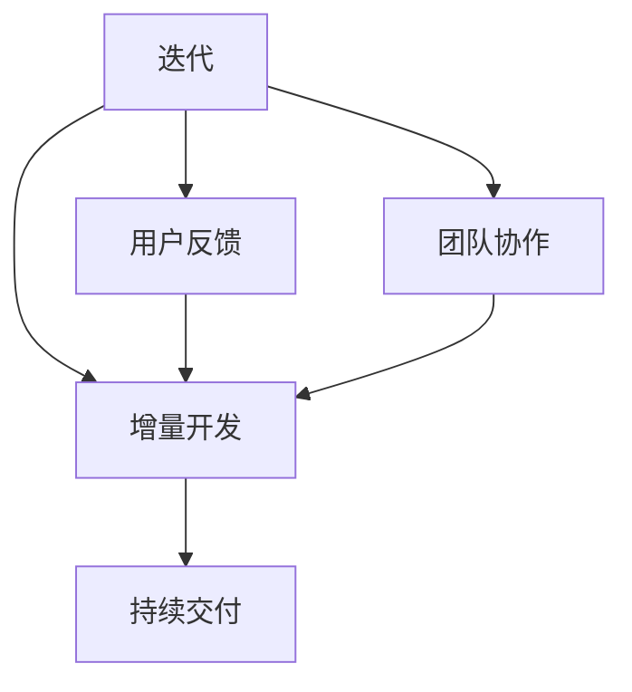

                 

章节标题: **第1章: 敏捷迭代模型核心原理**

**核心概念与联系**：

敏捷迭代模型的核心概念包括迭代、增量开发、持续交付、用户反馈和团队协作。这些概念之间有着紧密的联系，构成了敏捷迭代模型的基础架构。

1. **迭代（Iteration）**：迭代是敏捷迭代模型的基本工作单元。它通常持续2-4周，团队在这个时间段内完成一个可交付的功能模块。迭代过程包括计划、开发、测试和评审。

2. **增量开发（Incremental Development）**：增量开发意味着每次迭代只开发部分功能，但每个部分都是完整的。这种做法可以确保软件在每个迭代中都是可用的，从而降低风险。

3. **持续交付（Continuous Delivery）**：持续交付意味着在每个迭代结束时，团队将新的代码集成到主分支，并确保它可以部署到生产环境。这确保了软件始终处于可部署状态。

4. **用户反馈（User Feedback）**：用户在整个开发过程中持续提供反馈，这有助于团队及时调整开发方向，确保软件满足用户需求。

5. **团队协作（Team Collaboration）**：敏捷迭代模型鼓励团队成员之间的紧密协作。通过日常站会、回顾会和代码审查，团队可以共享知识，提高整体效率。

**Mermaid流程图**：

下面是一个简化的Mermaid流程图，展示了敏捷迭代模型的核心概念和联系：



**核心算法原理讲解**：

敏捷迭代模型的核心算法是迭代规划和迭代评估。以下是使用Python伪代码来详细阐述这两个过程：

```python
# 迭代规划算法
def iterative_planning(stories, sprint_length):
    planned_stories = []
    remaining_stories = stories.copy()
    
    while remaining_stories and sprint_length > 0:
        story = remaining_stories.pop(0)
        if story.estimate <= sprint_length:
            planned_stories.append(story)
            sprint_length -= story.estimate
        else:
            story.estimate -= sprint_length
            remaining_stories.insert(0, story)
    
    return planned_stories

# 迭代评估算法
def iterative_evaluation(stories, completed_stories):
    for story in stories:
        if story in completed_stories:
            story.status = "completed"
        else:
            story.status = "in_progress"

    return stories
```

**数学模型与公式**：

敏捷迭代模型中的关键数学模型是故事点（Story Points）和燃尽图（Burn Down Chart）。故事点用于估算每个用户故事的工作量，燃尽图则用于监控迭代进度。

- **故事点**：

  $$SP = \sum_{i=1}^{n} P_i$$

  其中，$SP$ 是总故事点，$P_i$ 是第 $i$ 个用户故事的工作量估算。

- **燃尽图**：

  $$Burn Down = Initial Estimate - Completed Work$$

  其中，$Initial Estimate$ 是迭代开始时估算的总工作量，$Completed Work$ 是到当前时间点已完成的工作量。

**例子说明**：

假设我们有一个包含5个用户故事的迭代，每个故事的工作量估算如下：

| 用户故事 | 工作量估算 |
| --- | --- |
| Story 1 | 2 |
| Story 2 | 3 |
| Story 3 | 5 |
| Story 4 | 4 |
| Story 5 | 6 |

使用迭代规划算法，我们可以将这5个故事分配到这个迭代中。然后，通过迭代评估算法，我们可以监控迭代进度，确保团队按计划完成工作。

**代码案例**：

```python
class UserStory:
    def __init__(self, name, estimate):
        self.name = name
        self.estimate = estimate
        self.status = "in_progress"

# 创建用户故事实例
stories = [
    UserStory("Story 1", 2),
    UserStory("Story 2", 3),
    UserStory("Story 3", 5),
    UserStory("Story 4", 4),
    UserStory("Story 5", 6)
]

# 迭代规划
planned_stories = iterative_planning(stories, 13)  # 假设迭代长度为13

# 迭代评估
completed_stories = ["Story 1", "Story 2"]
remaining_stories = iterative_evaluation(stories, completed_stories)

# 打印结果
print("Planned Stories:")
for story in planned_stories:
    print(story.name)

print("\nRemaining Stories:")
for story in remaining_stories:
    print(story.name)
```

输出结果将显示规划的用户故事和剩余的用户故事。

**项目实战**：

在项目实战中，我们可以使用敏捷工具（如Jira、Trello等）来跟踪用户故事和迭代进度。以下是一个简单的项目实战步骤：

1. **需求收集**：与客户沟通，收集用户故事和需求。
2. **故事估算**：对每个用户故事进行工作量估算。
3. **迭代规划**：使用迭代规划算法将用户故事分配到迭代中。
4. **开发与测试**：团队按照规划进行开发，并进行单元测试和集成测试。
5. **迭代评估**：在每个迭代结束时，评估已完成的工作量，调整剩余的工作量。
6. **持续交付**：将新的代码集成到主分支，并部署到生产环境。

通过这些步骤，团队可以确保项目按时交付，并满足用户需求。

**小结**：

敏捷迭代模型通过迭代、增量开发、持续交付、用户反馈和团队协作等核心概念，实现了高效、灵活和高质量的软件开发。掌握敏捷迭代模型对于AI应用开发至关重要，它帮助团队快速响应变化，持续改进，并最大化用户价值。在接下来的章节中，我们将进一步探讨敏捷方法和工具，以及AI应用开发中的具体实践。### 第2章：敏捷方法在AI应用开发中的应用

#### 2.1 敏捷方法与AI应用开发的结合

敏捷方法在传统软件开发中的应用已经得到了广泛的认可，其核心在于快速响应变化、持续交付和用户反馈。然而，当我们将敏捷方法应用到AI应用开发中时，我们面临一些独特的挑战和机遇。AI应用开发通常涉及复杂的数据处理、算法优化和模型训练，这使得敏捷方法的应用更加复杂。但是，通过灵活运用敏捷方法，我们可以有效地应对这些挑战，并提升开发效率。

**敏捷方法与AI应用开发的结合点**主要包括：

1. **快速迭代**：AI应用开发往往需要多次迭代来优化模型性能，敏捷迭代模型可以帮助团队在短时间内完成迭代，快速测试和验证模型。

2. **持续交付**：AI模型训练和部署通常需要较长的时间，通过持续交付，团队可以确保模型在每次迭代后都能及时部署，以便进行后续的优化。

3. **用户反馈**：AI应用的成功很大程度上取决于用户需求。通过用户的持续反馈，团队能够及时调整模型，确保应用的实际效果与用户期望相符。

4. **数据管理**：敏捷方法强调数据驱动决策，对于AI应用开发来说，有效的数据管理和治理是关键。敏捷方法可以帮助团队建立数据管理的最佳实践，确保数据质量和完整性。

#### 2.2 AI应用开发中的敏捷实践

在AI应用开发中，敏捷实践需要根据项目的具体情况进行调整。以下是一些常见的敏捷实践：

**1. 短周期迭代**：AI模型开发和优化往往需要大量的时间，因此，短周期迭代（如每周或每两周一次）可以帮助团队更有效地管理时间和资源。

**2. 用户故事地图**：用户故事地图是一种将用户需求分解成可管理任务的方法。在AI应用开发中，用户故事地图可以帮助团队将复杂的需求分解成具体可执行的任务。

**3. 自动化测试**：在AI应用开发中，自动化测试至关重要。通过自动化测试，团队能够确保模型在每次迭代后都能正常运行，减少手动测试的工作量。

**4. 持续集成和部署**：AI模型的训练和部署通常涉及多个步骤，包括数据预处理、模型训练、模型评估和部署。通过持续集成和部署，团队能够确保每个步骤的顺利进行，并快速将新的模型版本推向生产环境。

**5. 数据驱动决策**：敏捷方法强调数据驱动决策。在AI应用开发中，通过分析数据，团队能够识别潜在问题，调整模型，并优化算法。

#### 2.3 敏捷工具在AI应用开发中的应用

敏捷工具可以帮助团队更好地管理项目和流程。以下是一些常用的敏捷工具：

**1. Jira**：Jira是一款功能强大的敏捷项目管理工具，可以用于任务跟踪、敏捷看板和报告生成。

**2. Trello**：Trello是一款简洁的看板工具，可以帮助团队可视化项目进度和任务分配。

**3. GitLab**：GitLab是一款集成代码管理、项目管理、持续集成和持续交付的DevOps平台。

**4. Tableau**：Tableau是一款数据可视化工具，可以帮助团队分析数据，识别趋势和异常。

#### 2.4 AI应用开发中的敏捷最佳实践

**1. 确定可执行的用户故事**：在AI应用开发中，用户故事应该具体、可执行，并明确包括所需的输入和输出。

**2. 持续监控模型性能**：在每次迭代后，团队应该对模型性能进行评估，并根据评估结果进行调整。

**3. 优化数据管理流程**：数据是AI应用的核心，因此，建立高效的数据管理流程至关重要。

**4. 强调团队合作**：在AI应用开发中，团队合作尤为重要。通过定期会议和协作工具，团队可以确保信息共享和沟通畅通。

**5. 持续学习和改进**：敏捷方法强调持续学习和改进。团队应该定期进行回顾，识别改进点，并采取行动。

**小结**：

敏捷方法在AI应用开发中的应用具有重要意义。通过灵活运用敏捷实践和工具，团队能够更好地应对变化，提高开发效率，确保AI应用的商业成功。在接下来的章节中，我们将进一步探讨敏捷工具的具体使用方法和最佳实践，帮助读者在实际项目中应用敏捷方法。### 第3章：敏捷工具的使用

#### 3.1 敏捷工具介绍

敏捷工具是一组帮助团队管理和跟踪项目进度的软件，它们使得敏捷开发实践变得更加具体和可视化。以下是一些常用的敏捷工具：

**1. Jira**：Jira是Atlassian公司的一款旗舰产品，广泛用于敏捷项目管理和任务跟踪。Jira提供了全面的看板功能、敏捷板、任务管理、报告和集成等功能。

**2. Trello**：Trello是一款基于看板（Kanban）方法的任务管理工具，通过可视化的卡片系统帮助团队管理和跟踪项目进度。

**3. GitLab**：GitLab是一个用于代码存储、项目管理、持续集成和持续交付的平台，结合了Git版本控制和敏捷开发方法，提供了一个完整的DevOps解决方案。

**4. Asana**：Asana是一款项目管理工具，旨在帮助团队协作和任务管理。它提供了直观的界面，可以跟踪任务、项目进度和团队成员的工作。

**5. Azure DevOps**：Azure DevOps是微软提供的DevOps服务，包括代码存储、测试、部署和报告等功能，支持多种开发和部署流程。

#### 3.2 敏捷工具的使用场景

**1. 项目规划**：敏捷工具可以帮助团队制定项目计划，包括设置里程碑、任务分解和资源分配。例如，使用Jira或Trello的看板功能，团队可以直观地查看任务的当前状态和进度。

**2. 任务跟踪**：敏捷工具可以用于跟踪任务的进度，包括任务分配、状态更新和依赖关系管理。例如，Trello的卡片系统允许团队成员更新任务状态，标记任务为“进行中”、“待审”或“完成”。

**3. 团队协作**：敏捷工具提供了实时沟通和协作功能，团队成员可以通过工具内部的消息系统或集成聊天工具（如Slack）进行沟通。例如，GitLab的合并请求（Merge Request）功能允许团队在代码提交前进行审查和讨论。

**4. 持续集成和部署**：敏捷工具通常集成了持续集成和持续部署（CI/CD）功能。例如，Azure DevOps提供了自动化构建、测试和部署流程，确保代码的质量和及时交付。

#### 3.3 使用敏捷工具的案例

**案例1：使用Jira进行敏捷项目管理**

- **项目规划**：团队在Jira中创建项目，并设置里程碑和任务列表。每个任务都分配了优先级和负责人。
- **任务跟踪**：使用Jira看板，团队可以实时查看任务状态，并根据进展情况进行调整。
- **用户故事跟踪**：团队将用户故事分解为任务，并在Jira中创建相应的任务卡片，跟踪每个故事的进展。

**案例2：使用Trello进行任务管理**

- **任务分配**：团队将任务创建为Trello的卡片，并分配给相应的团队成员。
- **任务状态更新**：团队成员可以在Trello卡片上更新任务状态，如“待办”、“进行中”和“完成”。
- **任务依赖关系**：团队可以使用Trello的卡片链接功能来表示任务之间的依赖关系，确保任务按顺序执行。

**案例3：使用GitLab进行持续集成和部署**

- **代码存储**：团队在GitLab中存储代码，并进行版本控制。
- **持续集成**：团队设置GitLab CI/CD管道，自动构建和测试代码，确保代码的质量和一致性。
- **持续部署**：团队通过GitLab CI/CD管道将代码部署到测试和生产环境，确保应用的及时交付。

#### 3.4 敏捷工具最佳实践

**1. 明确任务分配**：确保每个任务都有明确的负责人，避免任务无人负责或分工不清。

**2. 保持工具简洁**：避免在工具中添加过多不必要的功能或设置，保持工具的简洁和易于使用。

**3. 定期回顾和调整**：定期回顾工具的使用效果，并根据团队的需求进行调整。

**4. 集成其他工具**：根据团队的需求，整合其他工具（如聊天工具、文档管理工具等）以提高协作效率。

**5. 用户培训**：为团队成员提供敏捷工具的培训，确保他们能够充分利用工具的功能。

**小结**：

敏捷工具在AI应用开发中扮演着至关重要的角色，它们帮助团队更好地管理项目、跟踪任务、协作和持续交付。通过掌握并灵活运用这些工具，团队能够提高开发效率，确保项目按时交付，并最大化用户价值。在接下来的章节中，我们将进一步探讨敏捷工具的具体应用场景和最佳实践，帮助读者在实际项目中更好地运用这些工具。### 第4章：AI应用开发中的敏捷工具与实践

#### 4.1 AI应用开发中敏捷工具的具体应用

在AI应用开发中，敏捷工具的使用不仅可以帮助团队更好地管理项目，还能提高开发效率和代码质量。以下是一些常见的敏捷工具和其在AI应用开发中的具体应用：

**1. Jira**

- **需求管理**：使用Jira的“需求”模块，团队可以创建和管理用户故事，并将需求分解为具体的任务。
- **迭代规划**：通过Jira的“敏捷板”，团队可以规划和跟踪迭代的进度，确保每个迭代都能按时完成。
- **任务跟踪**：使用Jira的任务功能，团队可以跟踪每个任务的进展，并及时发现和解决问题。

**2. Trello**

- **任务分配**：Trello的卡片系统可以帮助团队直观地分配任务，并跟踪任务的状态。
- **看板视图**：Trello的看板视图使团队能够实时查看项目的进展，并根据进度进行调整。
- **任务依赖关系**：Trello的链接功能可以帮助团队表示任务之间的依赖关系，确保任务按顺序执行。

**3. GitLab**

- **代码管理**：GitLab作为代码存储和版本控制工具，可以帮助团队管理和跟踪代码的变更。
- **持续集成**：GitLab的CI/CD功能可以自动化构建、测试和部署代码，确保代码的质量和一致性。
- **代码审查**：GitLab的代码审查功能可以帮助团队在代码提交前进行审查，确保代码的质量。

**4. Azure DevOps**

- **持续集成**：Azure DevOps提供了全面的CI/CD功能，可以自动化代码的构建、测试和部署。
- **测试管理**：Azure DevOps的测试管理功能可以帮助团队创建和管理测试案例，确保应用的稳定性。
- **项目报告**：Azure DevOps提供了丰富的报告功能，可以帮助团队分析项目的进度和性能。

#### 4.2 AI应用开发中的敏捷实践

**1. 用户故事地图**

用户故事地图是将用户需求分解成可管理任务的有效方法。在AI应用开发中，用户故事地图可以帮助团队更好地理解用户需求，并将需求转化为具体可执行的任务。

**2. 快速迭代**

快速迭代是敏捷开发的核心原则之一。在AI应用开发中，快速迭代可以帮助团队快速测试和验证模型，及时调整开发方向，提高开发效率。

**3. 数据管理**

数据是AI应用的核心，因此，建立高效的数据管理流程至关重要。敏捷实践强调数据驱动决策，团队应该确保数据的质量和完整性，以便在每次迭代中进行有效的分析。

**4. 自动化测试**

在AI应用开发中，自动化测试可以显著提高测试效率，减少手动测试的工作量。通过自动化测试，团队能够确保每次迭代后的模型都能正常运行，并及时发现和修复潜在的问题。

**5. 持续集成和部署**

持续集成和部署是确保代码质量和交付效率的关键。在AI应用开发中，通过自动化构建、测试和部署，团队能够确保每个迭代后的模型都能及时部署到生产环境，并快速进行后续的优化。

#### 4.3 敏捷工具在AI应用开发中的最佳实践

**1. 确定可执行的用户故事**

在AI应用开发中，用户故事应该具体、可执行，并明确包括所需的输入和输出。故事点（Story Points）可以帮助团队估算每个用户故事的工作量，确保任务分配合理。

**2. 持续监控模型性能**

在每次迭代后，团队应该对模型性能进行评估，并根据评估结果进行调整。性能指标（如准确率、召回率、F1分数等）可以帮助团队了解模型的实际表现。

**3. 优化数据管理流程**

数据是AI应用的核心，因此，建立高效的数据管理流程至关重要。团队应该确保数据的质量和完整性，以便在每次迭代中进行有效的分析。

**4. 强调团队合作**

在AI应用开发中，团队合作尤为重要。通过定期会议和协作工具，团队可以确保信息共享和沟通畅通，提高整体效率。

**5. 持续学习和改进**

敏捷方法强调持续学习和改进。团队应该定期进行回顾，识别改进点，并采取行动，以提高开发效率和模型质量。

**小结**：

敏捷工具在AI应用开发中发挥着至关重要的作用。通过灵活运用敏捷实践和工具，团队能够更好地管理项目、提高开发效率，并确保AI应用的商业成功。在接下来的章节中，我们将进一步探讨AI应用开发中的敏捷实践和工具的具体使用方法，帮助读者在实际项目中更好地应用这些技术和方法。### 第5章：敏捷方法在AI应用开发中的最佳实践

#### 5.1 敏捷方法在AI应用开发中的关键实践

敏捷方法在AI应用开发中的应用具有独特的优势，尤其是在快速变化和高度不确定性的环境中。以下是一些在AI应用开发中行之有效的敏捷最佳实践：

**1. 短周期迭代**：AI应用开发通常涉及复杂的模型训练和优化过程，短周期迭代（如每周或每两周一次）有助于团队快速反馈和调整。通过短周期迭代，团队能够更灵活地响应需求变化，确保项目始终朝着正确的方向前进。

**2. 用户故事地图**：用户故事地图是一种将用户需求分解为具体任务的方法。在AI应用开发中，用户故事地图有助于团队理解用户的实际需求，并将这些需求转化为具体的开发任务。通过这种方式，团队能够确保开发的每个迭代都满足用户的核心需求。

**3. 数据驱动决策**：数据是AI应用的核心，因此，建立高效的数据管理流程至关重要。敏捷方法强调数据驱动决策，团队应该确保数据的质量和完整性，以便在每次迭代中进行有效的分析。通过持续的数据分析和反馈，团队能够优化模型，提高应用性能。

**4. 自动化测试**：在AI应用开发中，自动化测试可以显著提高测试效率，减少手动测试的工作量。通过自动化测试，团队能够确保每次迭代后的模型都能正常运行，并及时发现和修复潜在的问题。自动化测试还包括对算法和数据处理过程的验证，确保应用的稳定性和可靠性。

**5. 持续集成和部署**：持续集成和部署是确保代码质量和交付效率的关键。在AI应用开发中，通过自动化构建、测试和部署，团队能够确保每个迭代后的模型都能及时部署到生产环境，并快速进行后续的优化。这有助于缩短开发周期，提高项目的交付速度。

**6. 团队协作**：敏捷方法强调团队合作和自组织。在AI应用开发中，团队协作尤为重要。通过定期会议、代码审查和协作工具，团队可以确保信息共享和沟通畅通，提高整体效率。

#### 5.2 案例分析

以下是一个在AI应用开发中成功应用敏捷方法的案例：

**案例背景**：一家初创公司开发一款智能推荐系统，旨在为用户推荐个性化的产品。由于市场需求变化快，项目团队决定采用敏捷方法进行开发。

**案例分析**：

1. **短周期迭代**：团队采用每周迭代的方法，每个迭代持续一周。每个迭代包括需求分析、模型训练、测试和部署等阶段。

2. **用户故事地图**：团队通过与用户的互动，收集用户需求和反馈，并将这些需求转化为用户故事。用户故事地图帮助团队明确每个迭代的目标和任务。

3. **数据驱动决策**：团队建立了完整的数据管理流程，确保数据的质量和完整性。每次迭代后，团队都会分析数据，优化模型，并调整推荐算法。

4. **自动化测试**：团队使用自动化测试框架对模型和数据处理过程进行测试，确保每次迭代后的模型都能正常运行，并及时发现和修复问题。

5. **持续集成和部署**：团队采用CI/CD工具，实现自动化构建、测试和部署。每次迭代完成后，新模型都会自动部署到生产环境，供用户使用。

6. **团队协作**：团队定期举行会议，讨论迭代目标和进度，确保所有成员都对项目的进展和目标有清晰的认识。团队成员之间通过协作工具保持沟通，共享信息和资源。

**项目结果**：通过敏捷方法的实施，项目团队成功按时完成了多个迭代，不断优化推荐系统。用户满意度显著提高，产品在市场上取得了良好的反响。

#### 5.3 小结

敏捷方法在AI应用开发中具有不可替代的价值。通过灵活运用短周期迭代、用户故事地图、数据驱动决策、自动化测试、持续集成和团队协作等最佳实践，团队能够更好地应对需求变化，提高开发效率，确保项目的商业成功。在接下来的章节中，我们将进一步探讨敏捷方法在AI应用开发中的具体应用和实践，帮助读者深入理解和运用这一强大的开发模型。### 第6章：敏捷迭代模型中的项目管理与团队协作

#### 6.1 敏捷项目管理概述

在敏捷迭代模型中，项目管理是一个动态、迭代的过程，它需要团队不断地评估和调整项目目标、资源和进度。敏捷项目管理强调团队的自主管理、协作和快速响应变化，以确保项目能够高效、按时、高质量地完成。以下是敏捷项目管理的一些关键要素：

1. **迭代规划**：每次迭代开始时，团队会进行迭代规划会议，确定本次迭代的目标、任务和资源分配。迭代规划是敏捷项目管理的重要环节，它帮助团队明确每个迭代的具体工作内容。

2. **任务跟踪**：在迭代过程中，团队需要实时跟踪任务的进度，确保所有任务都在计划内进行。任务跟踪可以通过敏捷工具（如Jira、Trello等）来实现，这些工具提供了任务状态更新、任务依赖关系管理等功能。

3. **用户反馈**：用户在整个项目生命周期中持续提供反馈，这对于确保项目方向正确和满足用户需求至关重要。团队应该定期与用户进行沟通，收集反馈，并根据反馈调整项目计划。

4. **团队协作**：敏捷方法强调团队合作和自组织，团队成员需要密切协作，共同完成项目目标。有效的沟通、知识共享和协作工具的使用是确保团队高效协作的关键。

5. **迭代回顾**：在每个迭代结束时，团队会进行回顾会议，总结本次迭代的经验和教训，讨论改进点，并为下一次迭代做好准备。迭代回顾是敏捷项目管理中不可或缺的一部分，它帮助团队不断优化开发过程。

#### 6.2 团队协作的最佳实践

在敏捷迭代模型中，团队协作是项目成功的关键。以下是一些团队协作的最佳实践：

1. **定期会议**：团队应该定期举行会议，如每日站会、迭代规划会议和迭代回顾会议。这些会议有助于团队同步进度、解决问题和分享信息。

2. **透明沟通**：保持沟通的透明度，确保所有团队成员都能及时了解项目进展和问题。透明沟通可以通过敏捷工具（如Jira、Trello等）来实现，这些工具提供了任务状态更新、通知和讨论功能。

3. **知识共享**：鼓励团队成员分享知识，建立知识库，以供团队内部学习和参考。知识共享可以通过团队讨论、文档和培训来实现。

4. **协作工具**：使用协作工具（如Slack、Microsoft Teams等）来加强团队内部和跨团队的沟通与协作。协作工具可以提供实时聊天、视频会议、文件共享等功能。

5. **自组织团队**：鼓励团队自组织，团队成员可以根据项目需求自行分配任务和角色。自组织团队能够提高团队成员的积极性和责任感，从而提高整体效率。

6. **持续反馈**：鼓励团队成员提供持续反馈，包括对项目进度、团队协作和项目管理等方面的反馈。持续反馈可以帮助团队及时发现和解决问题，优化开发过程。

#### 6.3 项目管理工具

在敏捷迭代模型中，使用合适的项目管理工具可以帮助团队更高效地管理项目和任务。以下是一些常用的项目管理工具：

1. **Jira**：Jira是一个功能强大的敏捷项目管理工具，提供了任务管理、敏捷看板、报告生成和集成等功能。

2. **Trello**：Trello是一个基于看板（Kanban）方法的任务管理工具，通过可视化的卡片系统帮助团队管理和跟踪项目进度。

3. **GitLab**：GitLab是一个集成了代码管理、项目管理、持续集成和持续交付的DevOps平台，支持多种开发和部署流程。

4. **Asana**：Asana是一款项目管理工具，旨在帮助团队协作和任务管理，提供了任务跟踪、项目进度和报告功能。

5. **Azure DevOps**：Azure DevOps是一个由微软提供的DevOps服务，包括代码存储、测试、部署和报告等功能，支持多种开发和部署流程。

#### 6.4 小结

敏捷迭代模型在项目管理与团队协作方面具有独特的优势。通过短周期迭代、任务跟踪、用户反馈、团队协作和迭代回顾等关键要素，团队能够更好地应对变化，提高项目效率和团队凝聚力。在敏捷方法的支持下，项目管理工具和最佳实践可以帮助团队实现高效协作和持续改进，从而确保项目按时、高质量地交付。在接下来的章节中，我们将进一步探讨敏捷迭代模型在AI应用开发中的实际应用和案例分析，帮助读者深入理解和应用这一重要的开发模型。### 第7章：AI应用开发中的敏捷迭代模型案例分析

#### 7.1 案例背景

为了更好地理解敏捷迭代模型在AI应用开发中的实际应用，我们来看一个真实的案例。这个案例来自一家大型电子商务公司，该公司希望通过AI技术优化其产品推荐系统，以提升用户体验和增加销售。

**项目目标**：开发一个基于用户行为和兴趣的智能推荐系统，为每位用户提供个性化的产品推荐。

**项目挑战**：
1. 数据量大：电子商务公司积累了大量的用户行为数据和产品信息，如何处理这些数据并从中提取有价值的信息是项目的一大挑战。
2. 算法复杂性：推荐系统的算法需要考虑多种因素，如用户的历史行为、购买偏好、产品特性等，如何设计高效的算法并优化模型性能是项目的关键。
3. 需求变化快：市场需求变化迅速，如何快速响应需求变化，调整推荐策略，确保系统始终符合用户需求。

#### 7.2 敏捷迭代模型的应用

为了应对上述挑战，项目团队决定采用敏捷迭代模型进行开发。以下是团队在项目中采用的具体敏捷实践：

**1. 迭代计划**：

团队将项目划分为多个短周期迭代，每个迭代持续两周。每次迭代的目标是完成一个可部署的推荐系统模块。

**2. 用户故事地图**：

团队通过与用户的互动，收集用户需求和反馈，并将这些需求转化为具体的用户故事。用户故事地图帮助团队明确每个迭代的目标和任务。

**3. 任务分配**：

在每次迭代开始时，团队会进行迭代规划会议，将用户故事分解为具体的任务，并分配给相应的团队成员。任务分配考虑了团队成员的技能和经验，确保任务能够高效完成。

**4. 数据管理**：

团队建立了完整的数据管理流程，包括数据收集、清洗、存储和分析。每次迭代后，团队会分析用户数据，优化数据质量，并调整数据预处理策略。

**5. 自动化测试**：

团队使用自动化测试框架对推荐系统进行测试，包括算法测试、数据处理测试和系统集成测试。自动化测试确保每次迭代后的系统都是稳定的，并能够正常运行。

**6. 持续集成和部署**：

团队采用CI/CD工具，实现自动化构建、测试和部署。每次迭代完成后，新模块会自动部署到测试环境，供团队测试和验证。

**7. 用户反馈**：

团队定期与用户进行沟通，收集用户反馈，并根据反馈调整推荐策略。用户反馈是团队优化系统的重要依据。

#### 7.3 迭代过程

以下是项目团队在每次迭代中执行的具体步骤：

**迭代1：用户行为分析模块**

- **需求分析**：确定用户行为数据的收集和处理方法，设计用户行为分析模块。
- **数据收集**：收集用户行为数据，包括浏览、点击、购买等行为。
- **数据处理**：清洗和预处理用户行为数据，建立数据仓库。
- **算法开发**：设计用户行为分析算法，提取用户兴趣特征。
- **测试和部署**：测试用户行为分析模块，部署到测试环境。

**迭代2：推荐算法优化**

- **需求分析**：根据用户反馈，优化推荐算法，提高推荐准确性。
- **算法开发**：调整推荐算法，增加用户兴趣特征的重要性。
- **测试和部署**：测试优化后的推荐算法，部署到测试环境。

**迭代3：推荐系统集成**

- **需求分析**：整合用户行为分析和推荐算法，实现推荐系统集成。
- **系统测试**：测试推荐系统的整体性能和稳定性。
- **部署**：部署推荐系统到生产环境。

**迭代4：用户反馈与优化**

- **用户反馈**：收集用户对推荐系统的反馈，了解用户的使用体验。
- **算法优化**：根据用户反馈，进一步优化推荐算法，提高用户满意度。
- **测试和部署**：测试优化后的推荐系统，部署到生产环境。

#### 7.4 案例总结

通过敏捷迭代模型的应用，项目团队成功开发并优化了智能推荐系统。以下是项目总结：

- **快速响应变化**：敏捷迭代模型帮助团队快速响应市场需求变化，确保系统始终符合用户需求。
- **持续优化**：通过迭代优化，团队不断改进推荐算法，提高系统性能和用户满意度。
- **高效协作**：团队协作和用户反馈机制确保了项目的高效推进和高质量交付。
- **稳定部署**：持续集成和部署工具确保了系统的稳定性和可靠性。

**小结**：

敏捷迭代模型在AI应用开发中具有显著的优势，它帮助团队快速响应变化、持续优化和高效协作，从而实现项目的成功交付。通过实际案例分析，我们可以看到敏捷迭代模型在AI应用开发中的具体应用和效果。在接下来的章节中，我们将进一步探讨敏捷迭代模型在AI应用开发中的其他实践和方法，帮助读者深入理解和应用这一重要的开发模型。### 总结与展望

敏捷迭代模型在AI应用开发中具有不可替代的价值。通过灵活运用短周期迭代、用户故事地图、数据驱动决策、自动化测试、持续集成和团队协作等最佳实践，团队能够更高效地应对需求变化，优化模型性能，提高用户满意度，确保项目的成功交付。

**核心优势**：
1. **快速响应变化**：敏捷迭代模型通过短周期迭代，使团队能够快速适应需求变化，确保项目始终朝着正确的方向前进。
2. **持续优化**：迭代优化和持续反馈机制帮助团队不断改进算法和模型，提高应用性能。
3. **高效协作**：团队协作和用户反馈机制确保项目的高效推进和高质量交付。
4. **稳定部署**：持续集成和部署工具确保了系统的稳定性和可靠性。

**未来趋势**：
1. **模型自动化**：随着AI技术的发展，自动化模型训练和优化工具将成为趋势，进一步提高开发效率。
2. **混合方法**：未来的AI应用开发可能会结合多种方法，如大数据分析和机器学习，以实现更复杂的模型和应用。
3. **跨领域应用**：敏捷迭代模型将在更多领域（如金融、医疗、教育等）得到应用，推动AI技术的普及和发展。

**最佳实践**：
1. **明确需求**：在项目启动阶段，明确用户需求，确保团队能够准确理解和实现用户需求。
2. **持续学习和改进**：团队应定期进行回顾，识别改进点，并采取行动，以提高开发效率和模型质量。
3. **数据治理**：建立高效的数据管理流程，确保数据的质量和完整性。
4. **灵活应对**：在面对需求变化时，团队能够快速调整计划和策略，确保项目顺利进行。

**结束语**：

敏捷迭代模型为AI应用开发提供了强大的支持，通过灵活运用敏捷实践和工具，团队能够提高开发效率，确保项目的成功交付，实现商业目标。我们鼓励读者在实际项目中积极应用敏捷迭代模型，不断探索和创新，推动AI技术的发展和普及。

作者：AI天才研究院/AI Genius Institute & 禅与计算机程序设计艺术 /Zen And The Art of Computer Programming。这篇文章旨在帮助读者深入理解敏捷迭代模型在AI应用开发中的应用，为项目的成功奠定基础。希望这篇文章能对您的AI应用开发工作提供有价值的参考。如果您有任何疑问或建议，欢迎在评论区留言讨论。感谢您的阅读！

