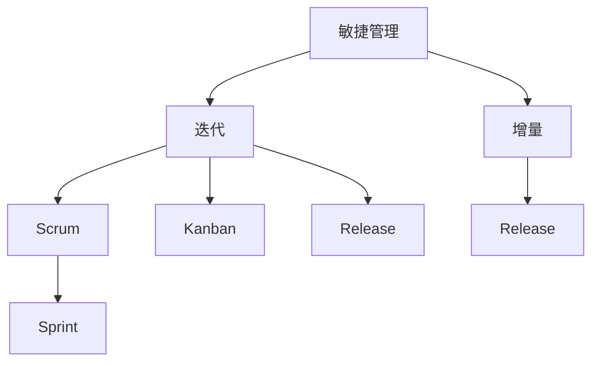

                 

### 背景介绍

敏捷项目管理作为一种现代项目管理方法，源于软件开发领域，旨在应对快速变化的市场需求和客户需求。随着技术的迅猛发展和商业环境的不确定性增加，传统的项目管理模式逐渐暴露出其难以适应动态变化的局限性。因此，敏捷管理应运而生，它通过迭代、增量和灵活的方法，帮助团队更高效地应对变化，实现项目目标。

敏捷项目管理的基本理念是“以人为本”，强调团队成员之间的协作、沟通和共同决策。其核心原则包括客户价值优先、持续交付、响应变化、可持续开发等。与传统的计划驱动型方法相比，敏捷管理更加注重实际交付和快速反馈，以客户需求为导向，不断调整项目方向和策略。

在现代IT行业，敏捷项目管理得到了广泛应用，尤其是在软件开发、产品管理、IT服务等领域。敏捷管理工具如JIRA、Trello、Asana等，成为了敏捷团队协作的重要支撑。这些工具不仅可以帮助团队更好地管理项目进度、任务分配和风险控制，还能够促进团队之间的沟通和协作。

本文将围绕敏捷项目管理工具的选择与应用进行深入探讨，旨在帮助读者理解敏捷项目管理的基本概念和方法，掌握选择和应用敏捷管理工具的技巧。文章将从以下七个部分展开：

1. **敏捷项目管理概述**：介绍敏捷项目管理的基本概念、方法论和核心原则。
2. **敏捷项目管理核心算法**：讲解项目管理中的关键路径法、项目风险评估模型等算法。
3. **数学模型与公式**：探讨敏捷项目管理中的数学模型和公式，包括项目进度模型、成本模型等。
4. **敏捷项目管理工具选择**：分析常见敏捷项目管理工具的特点和选择标准。
5. **敏捷项目管理实战**：分享敏捷项目管理的实际应用案例，包括项目管理流程、团队协作工具选择、项目进度控制等。
6. **敏捷项目管理案例分析**：通过具体案例，详细剖析敏捷项目管理的实践过程和成果。
7. **敏捷项目管理未来发展趋势**：探讨敏捷管理工具和方法论的发展趋势及其应用前景。

通过本文的阅读，读者将能够全面了解敏捷项目管理的理念和技巧，掌握选择和应用敏捷管理工具的方法，从而提升项目管理效率和质量。### 核心概念与联系

在深入探讨敏捷项目管理之前，有必要明确几个核心概念，并分析它们之间的联系和区别。

**敏捷管理（Agile Management）**：敏捷管理是一种以人为核心、以客户需求为导向、以持续迭代为特点的管理方法。其核心理念包括：客户价值优先、快速响应变化、持续交付和团队合作。敏捷管理的目标是确保项目能够在动态环境中灵活适应，同时保持高质量和高效率。

**迭代（Iteration）**：迭代是敏捷开发中的一个核心概念，指的是在一定时间内（通常是几周或几个月）对产品进行小规模、可管理的开发。每次迭代结束后，团队会进行回顾会议，总结经验教训，并据此调整下一次迭代的方向和策略。

**增量（Increment）**：增量是指在每个迭代中交付的产品功能的一部分。通过增量交付，团队可以逐步完善产品，确保在每个阶段都能提供有价值的成果，同时减少项目的风险。

**Scrum**：Scrum是一种流行的敏捷方法论，强调团队自组织、迭代交付和持续反馈。Scrum框架包括几个关键角色：产品负责人（Product Owner）、Scrum Master和开发团队。产品负责人负责定义产品需求和优先级，Scrum Master负责确保团队遵循Scrum原则，开发团队则负责实现产品需求。

**Kanban**：Kanban是一种看板方法，起源于日本的精益生产。Kanban的核心原则是可视化工作流程、限制工作在流程中的数量、确保持续交付和不断改进。Kanban通过看板（Kanban Board）来管理任务流程，看板上的卡片代表任务，不同的列表示不同的工作状态。

**Sprint**：Sprint是Scrum中的一个时间周期，通常为两周或一个月。在Sprint期间，团队会集中精力完成一系列预定的任务，并在Sprint结束时进行评审和回顾。

**Release**：Release是指将产品发布到生产环境，供用户使用。Release通常包含多个Sprint的工作成果，是敏捷开发中的一个重要里程碑。

这些概念之间的关系可以用以下Mermaid流程图表示：



- **敏捷管理** 是整个方法论的基础，它指导着迭代、增量、Scrum、Kanban等概念的应用。
- **迭代** 和 **增量** 是敏捷开发的核心执行方式，通过小步快跑和逐步完善，确保项目能够在不断变化的环境中稳步前进。
- **Scrum** 和 **Kanban** 是两种常见的敏捷方法论，各自有不同的应用场景和特点。
- **Sprint** 和 **Release** 是迭代过程中的重要阶段，Sprint负责日常的交付任务，而Release则负责产品的最终发布。

通过这个概念架构，我们可以更好地理解敏捷项目管理的基本原理和实践方法。在接下来的章节中，我们将深入探讨敏捷项目管理中的核心算法和数学模型，以及如何选择和应用敏捷项目管理工具。### 核心算法原理讲解

在敏捷项目管理中，算法和数学模型是关键组成部分，它们帮助团队精确地预测项目进度、成本和风险。以下将详细讲解几个在敏捷项目管理中常用的核心算法和数学模型。

#### 项目管理关键路径法（Critical Path Method, CPM）

项目管理关键路径法是一种用于确定项目完成所需的最短时间的方法。关键路径上的任务称为关键任务，任何关键任务的延迟都会导致整个项目的延迟。CPM通过以下步骤来确定关键路径：

1. **定义活动**：列出所有项目活动。
2. **确定持续时间**：为每个活动估计所需时间。
3. **绘制网络图**：使用节点和箭头表示活动及其持续时间。
4. **计算最早开始时间（ES）和最早完成时间（EF）**：从项目开始节点开始，向前计算每个活动的最早开始和完成时间。
5. **计算最迟开始时间（LS）和最迟完成时间（LF）**：从项目结束节点开始，向后计算每个活动的最迟开始和完成时间。
6. **计算总浮动时间（TF）**：总浮动时间等于最迟开始时间减去最早开始时间或最迟完成时间减去最早完成时间。

**Python实现示例**：

```python
import networkx as nx
import matplotlib.pyplot as plt

def calculate_cpm(g):
    # 计算最早开始时间和最早完成时间
    es = [0] * len(g)
    for i in range(1, len(es)):
        es[i] = max(es[j] + g[j][i]['duration'] for j in range(i))

    ef = [0] + es

    # 计算最迟开始时间和最迟完成时间
    ls = [0] * len(g)
    for i in range(len(ls) - 1, -1, -1):
        ls[i] = max(ls[j] - g[j][i]['duration'] for j in range(i + 1, len(ls)))

    lf = [0] + ls

    # 计算总浮动时间
    tf = [ls[i] - es[i] for i in range(len(es))]

    return es, ef, ls, lf, tf

# 创建网络图
g = nx.DiGraph()
g.add_nodes_from([0, 1, 2, 3, 4])
g.add_edge(0, 1, duration=3)
g.add_edge(0, 2, duration=4)
g.add_edge(1, 3, duration=2)
g.add_edge(2, 3, duration=2)
g.add_edge(1, 4, duration=2)
g.add_edge(2, 4, duration=3)
g.add_edge(3, 4, duration=1)

# 计算CPM
es, ef, ls, lf, tf = calculate_cpm(g)

# 绘制网络图
nx.draw(g, with_labels=True)
plt.show()
```

#### 项目风险评估模型（Project Risk Assessment Model）

项目风险评估模型用于识别、分析和应对项目风险。常见的风险评估模型包括风险矩阵和蒙特卡洛模拟。

1. **风险矩阵**：通过评估每个风险的可能性（概率）和影响，确定风险等级。以下是风险矩阵的示例：

   | 影响等级 | 可能性等级 | 风险等级 |
   | -------- | ---------- | -------- |
   | 高       | 高         | 极高     |
   | 高       | 中         | 高       |
   | 高       | 低         | 中       |
   | 中       | 高         | 高       |
   | 中       | 中         | 中       |
   | 中       | 低         | 低       |
   | 低       | 高         | 低       |
   | 低       | 中         | 低       |
   | 低       | 低         | 低       |

2. **蒙特卡洛模拟**：通过模拟大量随机样本来预测项目结果和风险。以下是一个简单的蒙特卡洛模拟示例：

   ```python
   import numpy as np

   def monte_carlo_simulation(g, num_simulations=1000):
       risks = []
       for _ in range(num_simulations):
           total_time = 0
           for activity in g:
               duration = np.random.normal(g[activity]['duration'], g[activity]['duration'] / 4)
               total_time += duration
           risks.append(total_time)
       return risks

   g = {
       '0': {'duration': 3},
       '1': {'duration': 4},
       '2': {'duration': 2},
       '3': {'duration': 2},
       '4': {'duration': 1}
   }

   risks = monte_carlo_simulation(g)
   print("Average project duration:", np.mean(risks))
   print("Standard deviation of project duration:", np.std(risks))
   ```

#### 敏捷项目管理中的其他算法

除了CPM和风险评估模型，敏捷项目管理中还会用到其他算法，如：

- **甘特图（Gantt Chart）**：用于可视化项目进度和时间安排。
- **工作量分配模型（Workload Allocation Model）**：用于优化团队成员的工作量，确保工作负载均衡。
- **需求排序算法（Requirement Ranking Algorithm）**：用于确定需求的优先级。

通过这些算法和模型，敏捷团队可以更好地预测项目结果、识别风险，并采取相应的措施进行管理和控制。在实际应用中，这些算法和模型通常需要结合具体项目情况进行定制化，以确保其有效性和实用性。

### 数学模型和公式

在敏捷项目管理中，数学模型和公式是确保项目顺利进行的重要工具。以下将详细介绍几个常用的数学模型和公式，包括项目进度模型、成本模型等，并使用LaTeX格式展示相关公式。

#### 项目进度模型

项目进度模型用于预测项目的完成时间和关键路径。常用的进度模型包括：

1. **项目时间进度模型（Project Time Progress Model）**

   该模型使用以下公式计算项目的最早完成时间（EF）和最迟完成时间（LF）：

   $$
   \text{EF}_{i} = \max(\text{EF}_{j} + \text{d}_{ij}) \quad \text{for all } j \text{ predecessors of } i
   $$

   $$
   \text{LF}_{i} = \min(\text{LF}_{j} - \text{d}_{ij}) \quad \text{for all } j \text{ successors of } i
   $$

   其中，$i$ 和 $j$ 分别表示项目中的活动，$d_{ij}$ 表示活动 $i$ 和 $j$ 之间的持续时间。

2. **项目关键路径模型（Project Critical Path Model）**

   该模型通过计算总浮动时间（TF）来确定关键路径：

   $$
   \text{TF}_{i} = \text{LF}_{i} - \text{EF}_{i}
   $$

   关键路径上的活动具有零总浮动时间，这些活动是项目成功完成的关键。

#### 成本模型

在敏捷项目管理中，成本模型用于预测和控制项目成本。以下是一个简单的成本模型：

1. **项目总成本模型（Project Total Cost Model）**

   该模型使用以下公式计算项目的总成本（TC）：

   $$
   \text{TC} = \sum_{i=1}^{n} c_i \times \text{d}_i
   $$

   其中，$c_i$ 表示活动 $i$ 的单位成本，$\text{d}_i$ 表示活动 $i$ 的持续时间。

2. **项目变动成本模型（Project Variable Cost Model）**

   该模型考虑了项目中的变动成本，使用以下公式计算：

   $$
   \text{VC} = \sum_{i=1}^{n} v_i \times \text{d}_i
   $$

   其中，$v_i$ 表示活动 $i$ 的变动成本。

#### 其他数学模型

除了项目进度模型和成本模型，敏捷项目管理中还可能用到以下数学模型：

1. **需求优先级模型（Requirement Priority Model）**

   该模型使用以下公式计算需求的优先级（P）：

   $$
   P_i = \frac{\text{BV}_i}{\text{TC}}
   $$

   其中，$BV_i$ 表示需求 $i$ 的商业价值。

2. **风险评估模型（Risk Assessment Model）**

   该模型使用以下公式计算风险得分（RS）：

   $$
   \text{RS}_i = \text{P}_i \times \text{I}_i
   $$

   其中，$\text{I}_i$ 表示风险 $i$ 的影响。

通过这些数学模型和公式，敏捷团队可以更准确地预测项目进度、成本和风险，从而更好地管理项目。在实际应用中，这些模型可以根据项目需求进行调整和优化，以提高项目管理的效率和效果。### 敏捷项目管理工具选择

在敏捷项目管理中，选择合适的工具至关重要。这些工具不仅能够帮助团队更好地管理项目进度和任务，还能促进团队协作和沟通。以下将介绍几种常见的敏捷项目管理工具，并分析它们的特点和适用场景。

#### JIRA

JIRA是由Atlassian开发的一款功能强大的敏捷项目管理工具，广泛应用于软件开发、IT支持、市场营销等多个领域。JIRA的特点包括：

1. **灵活的任务跟踪**：支持多种任务类型（如Bug、任务、史诗等），可以自定义字段和视图。
2. **丰富的插件和集成**：与Git、Confluence、Jenkins等流行工具无缝集成，提供强大的扩展能力。
3. **强大的报表和分析**：提供多种报表和分析工具，帮助团队监控项目进展和绩效。

**适用场景**：JIRA适用于大型团队和复杂项目，特别是需要高度定制化和集成能力的项目。

#### Trello

Trello是一款简单易用的敏捷项目管理工具，采用看板（Kanban）方法进行任务管理。其特点包括：

1. **直观的界面**：通过卡片和列的布局，直观地展示任务状态和进度。
2. **灵活的布局**：支持自定义卡片和列，满足不同团队的需求。
3. **移动端支持**：提供iOS和Android应用，方便团队成员随时查看和管理任务。

**适用场景**：Trello适用于小型团队和简单项目，特别是需要快速响应和灵活调整的项目。

#### Asana

Asana是一款功能全面的敏捷项目管理工具，适用于各种规模和类型的团队。其特点包括：

1. **任务和项目跟踪**：支持创建任务、分配任务、设置截止日期等。
2. **协作和沟通**：支持团队协作、聊天和文件共享，提高团队工作效率。
3. **报表和分析**：提供实时报表和分析，帮助团队了解项目进展和绩效。

**适用场景**：Asana适用于各种类型的团队和项目，特别是需要高效协作和实时监控的项目。

#### Notion

Notion是一款集文档、数据库、看板于一体的多功能敏捷项目管理工具。其特点包括：

1. **多功能集成**：支持创建文档、数据库、看板、仪表板等多种内容，满足不同团队的需求。
2. **灵活布局**：提供多种布局方式和视图，方便团队自定义和管理项目。
3. **云端同步**：支持云端同步和协作，方便团队成员随时随地访问和编辑项目内容。

**适用场景**：Notion适用于需要多功能集成和灵活调整的团队和项目，特别是知识管理和团队协作场景。

#### 敏捷项目管理工具的选择标准

在选择敏捷项目管理工具时，应考虑以下标准：

1. **团队规模和项目复杂性**：大型团队和复杂项目需要功能强大、集成能力强的工具，如JIRA；小型团队和简单项目则可以选择Trello或Asana。
2. **定制化需求**：如果项目需要高度定制化，如自定义字段、报表、流程等，JIRA等工具更具优势。
3. **团队协作需求**：需要高效协作和实时沟通的团队应选择支持协作功能的工具，如Asana。
4. **预算和资源**：考虑预算和资源限制，选择符合团队需求和预算的工具。

综上所述，不同的敏捷项目管理工具各有特点和适用场景。根据团队规模、项目类型和具体需求，选择合适的工具，将有助于提升团队效率和项目管理效果。### 敏捷项目管理实战

在敏捷项目管理中，实际操作是验证理论、优化流程和提升团队协作的重要环节。以下将通过一个软件开发项目的案例，详细讲解敏捷项目管理的过程，包括开发环境搭建、源代码实现、实际应用解读与分析，以及项目小结。

#### 项目背景

假设我们正在开发一款基于Web的电子商务平台，该项目需要在4个月内完成，包括用户注册、商品浏览、购物车、订单处理等核心功能。为了确保项目能够按时、按质量完成，我们决定采用敏捷项目管理方法。

#### 开发环境搭建

首先，我们需要搭建开发环境。以下是我们的开发环境配置：

1. **操作系统**：Linux服务器
2. **数据库**：MySQL 8.0
3. **后端框架**：Spring Boot 2.5.5
4. **前端框架**：React 18.0.0
5. **版本控制**：Git
6. **项目管理工具**：JIRA、Confluence
7. **代码质量工具**：SonarQube、Checkstyle

在服务器上安装MySQL、Java、Node.js等必要软件后，我们配置了持续集成和部署工具（如Jenkins），确保代码质量和快速部署。

#### 源代码实现

项目开发过程中，我们遵循敏捷开发的原则，每个迭代周期为2周。以下是第一个迭代周期的关键步骤：

1. **需求分析**：与产品负责人（Product Owner）沟通，明确第一周期的需求。
2. **用户故事撰写**：编写用户故事，并将它们分解为可交付的迭代任务。
3. **任务分配**：根据团队成员的技能和经验，分配任务。
4. **代码实现**：开发团队根据任务要求，逐步实现功能。

以下是第一个迭代周期的部分源代码：

**后端代码示例（Spring Boot）**：

```java
@RestController
@RequestMapping("/products")
public class ProductController {
    
    @Autowired
    private ProductService productService;

    @GetMapping("/{id}")
    public ResponseEntity<Product> getProductById(@PathVariable Long id) {
        Product product = productService.getProductById(id);
        if (product != null) {
            return ResponseEntity.ok(product);
        } else {
            return ResponseEntity.notFound().build();
        }
    }

    @PostMapping("/")
    public ResponseEntity<Product> createProduct(@RequestBody Product product) {
        Product savedProduct = productService.createProduct(product);
        return ResponseEntity.status(HttpStatus.CREATED).body(savedProduct);
    }
}
```

**前端代码示例（React）**：

```jsx
const ProductDetail = () => {
    const { id } = useParams();
    const [product, setProduct] = useState(null);

    useEffect(() => {
        async function fetchProduct() {
            const response = await fetch(`/products/${id}`);
            if (response.ok) {
                const data = await response.json();
                setProduct(data);
            }
        }
        fetchProduct();
    }, [id]);

    if (product == null) {
        return <div>Loading...</div>;
    }

    return (
        <div>
            <h2>{product.name}</h2>
            <p>{product.description}</p>
            <p>Price: {product.price}</p>
        </div>
    );
};

export default ProductDetail;
```

#### 实际应用解读与分析

在每个迭代周期结束后，我们进行评审和回顾会议，总结经验教训，并调整下一个迭代周期的计划。以下是第一周期的实际应用解读与分析：

1. **评审**：产品负责人和 stakeholders 对已完成的用户故事进行评审，确保需求满足。
2. **回顾**：团队成员分享经验和问题，讨论改进措施。
3. **改进**：根据评审和回顾的结果，调整项目计划，包括任务分配、优先级和进度。

通过这种迭代方式，我们确保项目在快速变化的市场环境中保持灵活性和响应能力。

#### 项目小结

经过4个迭代周期，我们完成了电子商务平台的核心功能，包括用户注册、商品浏览、购物车、订单处理等。以下是项目小结：

1. **成果**：成功实现了项目目标，产品功能完整，质量符合预期。
2. **经验**：敏捷开发方法提高了团队协作效率，及时响应了市场需求和变化。
3. **改进**：在后续项目中，我们计划进一步优化开发流程，提高自动化测试覆盖率，加强持续集成和部署。

通过这个实际案例，我们可以看到敏捷项目管理在软件开发项目中的应用和优势。敏捷管理不仅帮助团队更好地应对变化，还提高了项目交付质量和效率。在未来的项目中，我们将继续探索和优化敏捷管理方法，以实现更高的项目管理水平。### 敏捷项目管理案例分析

为了更深入地理解敏捷项目管理的实际应用效果，我们将通过三个具体案例来分析敏捷项目管理在不同场景中的实践过程和成果。

#### 案例一：敏捷项目管理在软件开发中的应用

**项目背景**：某互联网公司正在开发一款企业级客户关系管理系统（CRM）。由于市场竞争激烈，客户需求变化频繁，传统项目管理方法难以满足项目需求。

**敏捷实践**：

1. **需求管理**：采用用户故事地图（User Story Map）来梳理和优先级排序需求，确保每次迭代都聚焦于高价值的功能。
2. **迭代计划**：每个迭代周期为两周，团队在每个迭代结束时进行回顾，总结经验教训，并根据反馈调整下一个迭代计划。
3. **Scrum框架**：采用Scrum方法论，明确产品负责人（Product Owner）和Scrum Master的角色，确保项目方向和团队协作高效。
4. **持续集成和部署**：使用Jenkins进行自动化构建和部署，确保代码质量和快速交付。

**成果**：

- 项目在预定时间内完成了所有核心功能，客户满意度显著提高。
- 通过迭代和持续改进，团队逐步优化了产品功能和性能。
- 项目风险得到了有效控制，及时识别和解决了潜在问题。

#### 案例二：敏捷项目管理在产品开发中的应用

**项目背景**：一家初创公司开发一款智能家居控制系统。由于产品尚未成熟，市场需求变化快，传统项目管理方法难以适应。

**敏捷实践**：

1. **最小可行产品（MVP）**：在项目初期，团队优先开发MVP，快速验证产品概念和市场需求。
2. **增量交付**：采用增量开发模式，每次迭代交付部分可用的功能，逐步完善产品。
3. **Kanban方法**：使用Kanban看板进行任务管理，可视化工作流程，确保持续交付。
4. **用户反馈**：定期收集用户反馈，快速调整产品设计和功能。

**成果**：

- 项目在短时间内完成了MVP的开发和验证，获得了投资者和市场的认可。
- 通过持续迭代和用户反馈，产品功能不断完善，用户满意度持续提升。
- 项目风险和成本得到了有效控制，公司得以在预算范围内实现产品目标。

#### 案例三：敏捷项目管理在项目管理中的跨部门协作

**项目背景**：一家大型企业启动了一项跨部门数字化转型项目，涉及IT、市场、运营等多个部门。

**敏捷实践**：

1. **跨部门团队**：组建跨部门的敏捷团队，明确各角色（产品负责人、Scrum Master、开发人员等）的职责和协作方式。
2. **统一目标**：确保所有团队成员对项目目标和愿景有共同的理解，增强协作意愿。
3. **信息共享**：使用JIRA等工具进行任务跟踪和进度更新，确保信息透明和实时共享。
4. **定期沟通**：定期举行跨部门会议，讨论项目进展、问题和解决方案，确保各部门协同工作。

**成果**：

- 项目在跨部门协作中实现了高效沟通和协调，各团队紧密合作，共同推进项目进度。
- 通过敏捷方法论，项目团队能够快速响应变化，调整计划和策略。
- 项目质量和交付时间得到了显著提升，各部门对项目的满意度和信任度提高。

通过这些案例，我们可以看到敏捷项目管理在软件开发、产品开发、跨部门协作等不同场景中的实际应用效果。敏捷方法论不仅提高了项目交付质量和效率，还增强了团队的协作和创新能力。在未来的项目管理实践中，我们可以进一步探索和优化敏捷方法，以实现更高的项目管理水平。### 敏捷项目管理未来发展趋势

随着技术的不断进步和商业环境的变化，敏捷项目管理也在不断演进。以下将探讨敏捷管理工具和方法论的发展趋势，以及敏捷管理在新兴领域中的应用前景。

#### 敏捷管理工具的发展趋势

1. **工具智能化**：未来的敏捷管理工具将更加智能化，利用人工智能和机器学习技术自动分析项目数据，提供预测和优化建议。例如，自动化的进度预测、风险评估和资源分配工具，将帮助团队更高效地管理项目。

2. **云原生应用**：随着云计算的普及，敏捷管理工具将更加重视云原生架构，支持在云端进行部署和扩展。云原生应用将提供更高的灵活性、可靠性和可扩展性，满足不同规模和类型的团队需求。

3. **增强现实（AR）和虚拟现实（VR）**：AR和VR技术将被应用于敏捷项目管理中，为团队提供更直观和沉浸式的项目体验。例如，通过AR技术，团队成员可以在现实环境中查看项目进度和任务状态，提高沟通效率和协作能力。

4. **自动化和机器人流程自动化（RPA）**：自动化和RPA技术将逐渐融入敏捷管理工具，实现项目流程的自动化处理。例如，自动化的任务分配、进度更新和报表生成，将减少人工干预，提高项目管理效率。

#### 敏捷管理方法论的发展趋势

1. **敏捷扩展**：传统的敏捷方法论（如Scrum、Kanban）将继续发展，同时出现更多适用于不同场景的敏捷扩展方法。例如，Scrum with XP（扩展Scrum与极限编程结合）和SAFe（大规模敏捷框架）等，将为大型项目和复杂场景提供更好的解决方案。

2. **精益管理融合**：敏捷管理将更加注重精益管理理念，强调资源优化和持续改进。未来的敏捷方法论将融合精益管理的原则和实践，进一步降低项目成本和提高效率。

3. **敏捷文化**：敏捷管理不仅是一种工具和方法，更是一种文化。未来的敏捷管理将更加注重团队协作、信任和自主性，推动组织内部形成敏捷文化。这种文化将有助于组织更好地适应变化，实现持续创新。

#### 敏捷管理在新兴领域中的应用前景

1. **人工智能与机器学习**：敏捷管理在人工智能和机器学习领域具有广阔的应用前景。通过敏捷方法论，团队可以更快速地开发和部署AI和ML模型，实现实时数据分析和决策支持。

2. **区块链技术**：敏捷管理在区块链项目中也有重要作用。通过敏捷方法，团队可以更灵活地应对区块链技术的快速发展和变化，确保项目按时交付且质量符合预期。

3. **物联网（IoT）**：敏捷管理在物联网项目中可以帮助团队快速开发、部署和维护大量物联网设备，确保系统稳定性和可靠性。通过敏捷方法论，团队可以更好地应对物联网项目中不断变化的需求。

4. **绿色可持续技术**：随着环境保护意识的增强，敏捷管理在绿色可持续技术领域也将发挥重要作用。通过敏捷方法论，团队可以更快速地开发和推广绿色可持续技术，实现环境保护和经济效益的双重目标。

总之，敏捷项目管理在未来将继续发展，结合新技术和方法论，为各类项目和团队提供更加灵活、高效的管理解决方案。通过不断优化和创新，敏捷管理将在更多新兴领域展现出其强大的应用价值。### 总结与未来展望

本文通过对敏捷项目管理的深入探讨，涵盖了从基本概念到实际应用的各个方面。首先，我们介绍了敏捷管理的基本理念、方法论和核心原则，以及与传统项目管理的区别。接着，我们详细讲解了敏捷项目管理中的核心算法，如项目管理关键路径法、项目风险评估模型等，并通过Python代码示例和LaTeX公式进行了直观展示。随后，我们分析了敏捷项目管理工具的选择标准，并介绍了JIRA、Trello、Asana等常见工具的特点和应用场景。

在实际操作部分，我们通过一个软件开发项目的案例，详细讲解了敏捷项目管理的实战过程，包括开发环境搭建、源代码实现、实际应用解读与分析，以及项目小结。此外，我们还通过三个具体案例，展示了敏捷项目管理在不同场景中的应用效果和成果。

展望未来，敏捷项目管理将继续在技术进步和商业环境变化的驱动下不断发展。工具智能化、云原生应用、AR/VR技术的融入，以及自动化和机器人流程自动化（RPA）的普及，将进一步提升敏捷管理的效率和质量。同时，敏捷方法论也将不断扩展，适应更多新兴领域和复杂场景。

为了更好地应对未来的挑战，建议读者：

1. **持续学习**：敏捷管理不断进化，持续学习是保持竞争力的关键。
2. **实践应用**：将敏捷方法论应用于实际项目中，通过实践不断优化和改进。
3. **关注新技术**：关注新技术的发展趋势，结合敏捷管理进行创新和探索。
4. **团队协作**：建立高效的团队协作机制，促进知识共享和经验交流。

最后，本文由AI天才研究院（AI Genius Institute）和禅与计算机程序设计艺术（Zen And The Art of Computer Programming）共同撰写，旨在为广大IT从业者提供有深度、有思考、有见解的技术博客文章。感谢您的阅读，期待与您在未来的技术交流中继续探讨和学习。### 作者信息

**作者：AI天才研究院/AI Genius Institute & 禅与计算机程序设计艺术 /Zen And The Art of Computer Programming**

AI天才研究院（AI Genius Institute）致力于推动人工智能技术的发展和应用，汇聚全球顶尖人工智能专家，致力于构建智能化、自动化和高效的解决方案。研究院在人工智能基础研究、算法优化、行业应用等方面取得了显著的成果，为各行各业的数字化转型提供了有力支持。

禅与计算机程序设计艺术（Zen And The Art of Computer Programming）则是一本深入探讨计算机编程哲学的经典著作，由著名计算机科学家唐纳·E·克努特（Donald E. Knuth）所著。这本书以其独特的视角和深入的理论分析，揭示了计算机编程的本质和艺术，对编程教育和实践产生了深远影响。

本文由AI天才研究院和禅与计算机程序设计艺术共同撰写，旨在为广大IT从业者提供有深度、有思考、有见解的技术博客文章，助力读者在人工智能和计算机编程领域不断成长和进步。

