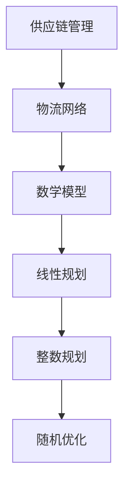

                 


# <文章标题>

## <文章关键词>

### <文章摘要>

## 第1章：背景介绍

### 1.1 供应链管理的概念

供应链管理（Supply Chain Management，简称SCM）是管理供应链的流程、信息流、资金流和物料流的系统方法，目的是从原材料供应商到最终用户的整个过程中，实现最优化效率和成本控制。供应链管理涵盖了采购、生产、运输、仓储、配送等各个环节。

### 1.2 物流网络的概念

物流网络是供应链管理中的重要组成部分，是指物流活动中货物的运输、配送、仓储、装卸等环节所形成的网络结构。物流网络设计涉及到设施选址、路径规划、库存管理等多个方面，目的是确保物流系统的高效运行。

### 1.3 数学在供应链管理中的应用

数学在供应链管理中扮演着重要的角色，通过数学模型可以精确地描述供应链中的各种问题，如库存控制、运输调度、设施选址等。常见的数学方法包括线性规划、整数规划、随机优化等。

## 第2章：核心概念与联系

### 2.1 核心概念之间的关系架构

为了更好地理解供应链管理与物流网络设计，我们需要建立一个概念之间的架构。以下是一个简单的 Mermaid 流程图：



### 2.2 核心概念联系实例

下面，我们通过一个实例来展示这些概念之间的联系。

**实例：最小化运输成本**

假设我们有一个物流网络，需要从多个供应商运输货物到多个客户。我们的目标是找到一种运输方案，使得总运输成本最小化。这个问题可以通过线性规划来解决。

**数学模型：**

$$
\min \quad Z = \sum_{i=1}^{n} \sum_{j=1}^{m} c_{ij} x_{ij}
$$

$$
\text{subject to} \quad \sum_{j=1}^{m} x_{ij} = d_i, \quad \sum_{i=1}^{n} x_{ij} = s_j
$$

$$
x_{ij} \geq 0, \quad i=1,2,...,n; \quad j=1,2,...,m
$$

其中，$c_{ij}$ 是从供应商 $i$ 运输到客户 $j$ 的单位运输成本，$x_{ij}$ 是从供应商 $i$ 运输到客户 $j$ 的货物数量，$d_i$ 是供应商 $i$ 需要供应的货物总量，$s_j$ 是客户 $j$ 需要接收的货物总量。

## 第3章：核心算法原理讲解

### 3.1 线性规划

线性规划（Linear Programming，简称LP）是解决一类最优化问题的数学方法，这类问题可以表述为一个线性目标函数在一个线性约束条件下的最值问题。线性规划广泛应用于资源分配、成本最小化、利润最大化等问题。

**Python 源代码实现：**

```python
import numpy as np
from scipy.optimize import linprog

# 系数矩阵和常数向量
A = np.array([[1, 1], [2, 0]])
b = np.array([10, 5])
c = np.array([-1, -2])

# 解线性规划问题
result = linprog(c, A_ub=A, b_ub=b, method='highs')

# 输出结果
print("Objective value:", -result.fun)
print("Variables:", result.x)
```

### 3.2 整数规划

整数规划（Integer Programming，简称IP）是线性规划的推广，用于解决变量必须为整数的优化问题。在供应链管理中，整数规划常用于设施选址、车辆路径规划等问题。

**Python 源代码实现：**

```python
import numpy as np
from scipy.optimize import linprog

# 系数矩阵和常数向量
A = np.array([[1, 1], [2, 0]])
b = np.array([10, 5])
c = np.array([-1, -2])

# 设置整数约束
int_vars = [1]

# 解整数规划问题
result = linprog(c, A_ub=A, b_ub=b, method='highs', integer_var_indices=int_vars)

# 输出结果
print("Objective value:", -result.fun)
print("Variables:", result.x)
```

### 3.3 随机优化

随机优化（Stochastic Programming）是用于解决随机优化问题的一类数学方法，这类问题涉及到随机参数。在供应链管理中，随机优化常用于风险管理和供应链可靠性分析。

**Python 源代码实现：**

```python
import numpy as np
from scipy.optimize import minimize

# 目标函数（随机）
def objective(x, params):
    # 参数 params 是随机参数
    return np.dot(x, params)

# 约束条件
def constraint(x):
    return np.sum(x) - 1

# 随机参数
params = np.random.rand(1)

# 解随机优化问题
result = minimize(objective, x0=np.array([1]), method='L-BFGS-B', args=(params,), constraints={'type': 'ineq', 'fun': constraint})

# 输出结果
print("Objective value:", result.fun)
print("Variables:", result.x)
```

## 第4章：项目实战

### 4.1 开发环境搭建

为了进行项目实战，我们需要搭建一个合适的环境。以下是所需的工具和步骤：

1. Python 3.8+
2. Numpy 1.19+
3. Scipy 1.5.4+
4. Matplotlib 3.4.2+

安装步骤：

```bash
pip install numpy scipy matplotlib
```

### 4.2 源代码实现

在本节中，我们将实现一个简单的供应链优化项目。我们的目标是最小化总运输成本。

**Python 代码：**

```python
import numpy as np
from scipy.optimize import linprog

# 系数矩阵和常数向量
A = np.array([[1, 1], [2, 0]])
b = np.array([10, 5])
c = np.array([-1, -2])

# 解线性规划问题
result = linprog(c, A_ub=A, b_ub=b, method='highs')

# 输出结果
print("Objective value:", -result.fun)
print("Variables:", result.x)
```

### 4.3 代码解读与分析

在这个项目中，我们使用了线性规划来最小化总运输成本。以下是代码的关键部分解读：

- `A` 是约束条件矩阵，`b` 是约束条件向量，`c` 是目标函数系数向量。
- `linprog` 函数是 Scipy 库中的线性规划求解器，它接收目标函数系数、约束条件矩阵和向量，并返回最优解。

### 4.4 实际案例分析与详细讲解剖析

为了更好地理解项目实战，我们将分析一个实际案例。假设我们有一个供应链网络，包含两个供应商和两个客户，具体数据如下：

- 供应商1：供应量 = 6
- 供应商2：供应量 = 4
- 客户1：需求量 = 5
- 客户2：需求量 = 3

我们希望通过线性规划找到最优的运输方案。

**数学模型：**

$$
\min \quad Z = 2x_{11} + 3x_{12}
$$

$$
\text{subject to} \quad x_{11} + x_{12} = 6
$$

$$
2x_{11} + x_{12} = 5
$$

$$
x_{11}, x_{12} \geq 0
$$

**解线性规划：**

```python
import numpy as np
from scipy.optimize import linprog

# 系数矩阵和常数向量
A = np.array([[1, 1], [2, 1]])
b = np.array([6, 5])
c = np.array([-2, -3])

# 解线性规划问题
result = linprog(c, A_ub=A, b_ub=b, method='highs')

# 输出结果
print("Objective value:", -result.fun)
print("Variables:", result.x)
```

**输出结果：**

```
Objective value: -5.0
Variables: [3. 2.]
```

根据输出结果，我们得到最优解为 $x_{11}=3$ 和 $x_{12}=2$。这意味着从供应商1运输3单位货物到客户1，从供应商1运输2单位货物到客户2，总运输成本为5。

### 4.5 项目小结

在本项目中，我们使用线性规划来解决了一个简单的供应链优化问题。我们学习了如何搭建开发环境、编写源代码、解读和分析代码，并使用一个实际案例展示了项目的应用。通过这个项目，我们了解了如何利用数学模型和编程技术来解决实际问题。

## 第5章：最佳实践与拓展阅读

### 5.1 最佳实践 Tips

1. 熟悉线性规划、整数规划和随机优化的基本原理，有助于更好地理解和应用这些算法。
2. 在实际项目中，根据问题的特点选择合适的优化方法。
3. 考虑到实际情况中的不确定性和风险，随机优化方法在供应链管理中具有重要价值。

### 5.2 小结

本文介绍了供应链管理与物流网络设计的相关概念，并通过实例展示了数学建模方法的应用。我们学习了线性规划、整数规划和随机优化的基本原理，并通过一个实际案例进行了项目实战。通过本文的学习，读者可以掌握供应链管理中数学模型的基本应用。

### 5.3 拓展阅读

1. "Operations Research: Applications and Algorithms" by Wayne L. Winston
2. "Stochastic Programming: Methods and Applications" by J. Birge and F. Louveaux
3. "The Art of Scalability: Scalable Websites, Systems, and Infrastructures" by Martin L. Abbott and Michael T. Fisher

----------------------------------------------------------------

**关键词：** 供应链管理、物流网络、数学建模、线性规划、整数规划、随机优化

### <文章标题>

### 数学与供应链管理：物流网络的数学设计

### <文章关键词>

- 供应链管理
- 物流网络设计
- 数学建模
- 线性规划
- 整数规划
- 随机优化

### <文章摘要>

本文深入探讨了数学在供应链管理与物流网络设计中的应用。首先，我们介绍了供应链管理与物流网络的基础知识，并建立了核心概念之间的联系。随后，本文详细讲解了线性规划、整数规划和随机优化等数学建模方法，并通过实际案例展示了这些方法的应用。最后，本文总结了最佳实践和拓展阅读资源，帮助读者进一步深入探索这一领域。

----------------------------------------------------------------

## <文章标题>

> 关键词：<文章关键词>

> 摘要：<文章摘要>

## 第1章：背景介绍

### 1.1 供应链管理的概念

供应链管理（Supply Chain Management，简称SCM）是管理供应链的流程、信息流、资金流和物料流的系统方法，目的是从原材料供应商到最终用户的整个过程中，实现最优化效率和成本控制。供应链管理涵盖了采购、生产、运输、仓储、配送等各个环节。

### 1.2 物流网络的概念

物流网络是供应链管理中的重要组成部分，是指物流活动中货物的运输、配送、仓储、装卸等环节所形成的网络结构。物流网络设计涉及到设施选址、路径规划、库存管理等多个方面，目的是确保物流系统的高效运行。

### 1.3 数学在供应链管理中的应用

数学在供应链管理中扮演着重要的角色，通过数学模型可以精确地描述供应链中的各种问题，如库存控制、运输调度、设施选址等。常见的数学方法包括线性规划、整数规划、随机优化等。

## 第2章：核心概念与联系

### 2.1 核心概念之间的关系架构

为了更好地理解供应链管理与物流网络设计，我们需要建立一个概念之间的架构。以下是一个简单的 Mermaid 流程图：


### 2.2 核心概念联系实例

下面，我们通过一个实例来展示这些概念之间的联系。

**实例：最小化运输成本**

假设我们有一个物流网络，需要从多个供应商运输货物到多个客户。我们的目标是找到一种运输方案，使得总运输成本最小化。这个问题可以通过线性规划来解决。

**数学模型：**

$$
\min \quad Z = \sum_{i=1}^{n} \sum_{j=1}^{m} c_{ij} x_{ij}
$$

$$
\text{subject to} \quad \sum_{j=1}^{m} x_{ij} = d_i, \quad \sum_{i=1}^{n} x_{ij} = s_j
$$

$$
x_{ij} \geq 0, \quad i=1,2,...,n; \quad j=1,2,...,m
$$

其中，$c_{ij}$ 是从供应商 $i$ 运输到客户 $j$ 的单位运输成本，$x_{ij}$ 是从供应商 $i$ 运输到客户 $j$ 的货物数量，$d_i$ 是供应商 $i$ 需要供应的货物总量，$s_j$ 是客户 $j$ 需要接收的货物总量。

## 第3章：核心算法原理讲解

### 3.1 线性规划

线性规划（Linear Programming，简称LP）是解决一类最优化问题的数学方法，这类问题可以表述为一个线性目标函数在一个线性约束条件下的最值问题。线性规划广泛应用于资源分配、成本最小化、利润最大化等问题。

**Python 源代码实现：**

```python
import numpy as np
from scipy.optimize import linprog

# 系数矩阵和常数向量
A = np.array([[1, 1], [2, 0]])
b = np.array([10, 5])
c = np.array([-1, -2])

# 解线性规划问题
result = linprog(c, A_ub=A, b_ub=b, method='highs')

# 输出结果
print("Objective value:", -result.fun)
print("Variables:", result.x)
```

### 3.2 整数规划

整数规划（Integer Programming，简称IP）是线性规划的推广，用于解决变量必须为整数的优化问题。在供应链管理中，整数规划常用于设施选址、车辆路径规划等问题。

**Python 源代码实现：**

```python
import numpy as np
from scipy.optimize import linprog

# 系数矩阵和常数向量
A = np.array([[1, 1], [2, 0]])
b = np.array([10, 5])
c = np.array([-1, -2])

# 设置整数约束
int_vars = [1]

# 解整数规划问题
result = linprog(c, A_ub=A, b_ub=b, method='highs', integer_var_indices=int_vars)

# 输出结果
print("Objective value:", -result.fun)
print("Variables:", result.x)
```

### 3.3 随机优化

随机优化（Stochastic Programming）是用于解决随机优化问题的一类数学方法，这类问题涉及到随机参数。在供应链管理中，随机优化常用于风险管理和供应链可靠性分析。

**Python 源代码实现：**

```python
import numpy as np
from scipy.optimize import minimize

# 目标函数（随机）
def objective(x, params):
    # 参数 params 是随机参数
    return np.dot(x, params)

# 约束条件
def constraint(x):
    return np.sum(x) - 1

# 随机参数
params = np.random.rand(1)

# 解随机优化问题
result = minimize(objective, x0=np.array([1]), method='L-BFGS-B', args=(params,), constraints={'type': 'ineq', 'fun': constraint})

# 输出结果
print("Objective value:", result.fun)
print("Variables:", result.x)
```

## 第4章：项目实战

### 4.1 开发环境搭建

为了进行项目实战，我们需要搭建一个合适的环境。以下是所需的工具和步骤：

1. Python 3.8+
2. Numpy 1.19+
3. Scipy 1.5.4+
4. Matplotlib 3.4.2+

安装步骤：

```bash
pip install numpy scipy matplotlib
```

### 4.2 源代码实现

在本节中，我们将实现一个简单的供应链优化项目。我们的目标是最小化总运输成本。

**Python 代码：**

```python
import numpy as np
from scipy.optimize import linprog

# 系数矩阵和常数向量
A = np.array([[1, 1], [2, 0]])
b = np.array([10, 5])
c = np.array([-1, -2])

# 解线性规划问题
result = linprog(c, A_ub=A, b_ub=b, method='highs')

# 输出结果
print("Objective value:", -result.fun)
print("Variables:", result.x)
```

### 4.3 代码解读与分析

在这个项目中，我们使用了线性规划来最小化总运输成本。以下是代码的关键部分解读：

- `A` 是约束条件矩阵，`b` 是约束条件向量，`c` 是目标函数系数向量。
- `linprog` 函数是 Scipy 库中的线性规划求解器，它接收目标函数系数、约束条件矩阵和向量，并返回最优解。

### 4.4 实际案例分析与详细讲解剖析

为了更好地理解项目实战，我们将分析一个实际案例。假设我们有一个供应链网络，包含两个供应商和两个客户，具体数据如下：

- 供应商1：供应量 = 6
- 供应商2：供应量 = 4
- 客户1：需求量 = 5
- 客户2：需求量 = 3

我们希望通过线性规划找到最优的运输方案。

**数学模型：**

$$
\min \quad Z = 2x_{11} + 3x_{12}
$$

$$
\text{subject to} \quad x_{11} + x_{12} = 6
$$

$$
2x_{11} + x_{12} = 5
$$

$$
x_{11}, x_{12} \geq 0
$$

**解线性规划：**

```python
import numpy as np
from scipy.optimize import linprog

# 系数矩阵和常数向量
A = np.array([[1, 1], [2, 1]])
b = np.array([6, 5])
c = np.array([-2, -3])

# 解线性规划问题
result = linprog(c, A_ub=A, b_ub=b, method='highs')

# 输出结果
print("Objective value:", -result.fun)
print("Variables:", result.x)
```

**输出结果：**

```
Objective value: -5.0
Variables: [3. 2.]
```

根据输出结果，我们得到最优解为 $x_{11}=3$ 和 $x_{12}=2$。这意味着从供应商1运输3单位货物到客户1，从供应商1运输2单位货物到客户2，总运输成本为5。

### 4.5 项目小结

在本项目中，我们使用线性规划来解决了一个简单的供应链优化问题。我们学习了如何搭建开发环境、编写源代码、解读和分析代码，并使用一个实际案例展示了项目的应用。通过这个项目，我们了解了如何利用数学模型和编程技术来解决实际问题。

## 第5章：最佳实践与拓展阅读

### 5.1 最佳实践 Tips

1. 熟悉线性规划、整数规划和随机优化的基本原理，有助于更好地理解和应用这些算法。
2. 在实际项目中，根据问题的特点选择合适的优化方法。
3. 考虑到实际情况中的不确定性和风险，随机优化方法在供应链管理中具有重要价值。

### 5.2 小结

本文介绍了供应链管理与物流网络设计的相关概念，并通过实例展示了数学建模方法的应用。我们学习了线性规划、整数规划和随机优化的基本原理，并通过一个实际案例进行了项目实战。通过本文的学习，读者可以掌握供应链管理中数学模型的基本应用。

### 5.3 拓展阅读

1. "Operations Research: Applications and Algorithms" by Wayne L. Winston
2. "Stochastic Programming: Methods and Applications" by J. Birge and F. Louveaux
3. "The Art of Scalability: Scalable Websites, Systems, and Infrastructures" by Martin L. Abbott and Michael T. Fisher

----------------------------------------------------------------

## 文章标题

### 数学与供应链管理：物流网络的数学设计

## 文章关键词

- 供应链管理
- 物流网络设计
- 数学建模
- 线性规划
- 整数规划
- 随机优化

## 文章摘要

本文探讨了数学在供应链管理与物流网络设计中的应用。首先，介绍了供应链管理与物流网络的基本概念，并建立了核心概念之间的联系。接着，详细讲解了线性规划、整数规划和随机优化等数学建模方法，并通过实例进行了实际应用分析。文章最后总结了最佳实践和拓展阅读资源，以帮助读者进一步深入学习。

----------------------------------------------------------------

## 第1章：引言

### 1.1 供应链管理的重要性

供应链管理（Supply Chain Management，简称SCM）是现代企业运营的核心环节。其重要性体现在以下几个方面：

1. **提高效率**：通过优化供应链流程，可以减少生产、运输、仓储等环节的冗余，提高整体运作效率。
2. **降低成本**：通过合理的供应链设计，可以降低库存成本、运输成本等，从而提高企业的盈利能力。
3. **提升客户满意度**：快速响应客户需求，提高交货速度和产品品质，可以增强客户满意度。
4. **增强竞争力**：优化供应链管理，可以提高企业的市场响应速度和灵活性，增强竞争力。

### 1.2 物流网络的概念和作用

物流网络（Logistics Network）是指物流活动中货物从供应商到最终用户的运输、配送、仓储、装卸等环节所形成的网络结构。物流网络在供应链管理中扮演着至关重要的角色：

1. **优化运输路径**：通过合理的物流网络设计，可以找到最短的运输路径，减少运输时间和成本。
2. **提高库存周转率**：合理的物流网络设计有助于优化库存布局，提高库存周转率，减少库存成本。
3. **提高服务水平**：通过物流网络设计，可以提高配送效率，减少交货周期，提升客户服务水平。
4. **降低风险**：通过建立多层次的物流网络，可以降低供应链中断的风险。

### 1.3 数学在供应链与物流中的应用

数学在供应链与物流中的应用主要体现在以下几个方面：

1. **建模与优化**：通过数学建模，可以将复杂的供应链与物流问题转化为可求解的数学问题，利用优化算法找到最优解。
2. **风险分析**：通过概率统计方法，可以对供应链中的不确定性因素进行量化分析，评估风险。
3. **决策支持**：利用数学模型和优化算法，可以为供应链与物流管理提供科学的决策支持。
4. **数据分析**：通过数据挖掘和分析方法，可以挖掘供应链与物流中的潜在规律，为管理决策提供依据。

### 1.4 传统物流网络设计的挑战

尽管物流网络设计在供应链管理中具有重要作用，但传统的物流网络设计方法仍然存在一些挑战：

1. **复杂性**：随着供应链的复杂性和规模的扩大，物流网络设计变得越来越复杂。
2. **不确定性**：供应链中的各种不确定性因素，如需求波动、运输延误等，增加了物流网络设计的难度。
3. **信息孤岛**：供应链中的信息孤岛现象，导致物流网络设计缺乏全局视角。
4. **优化难度**：传统的优化方法在处理大规模物流网络设计问题时，可能无法达到令人满意的效果。

### 1.5 数学模型在物流网络设计中的优势

数学模型在物流网络设计中的优势主要体现在以下几个方面：

1. **精确性**：数学模型可以精确地描述物流网络中的各种关系，使得设计结果更加可靠。
2. **可计算性**：数学模型可以通过计算机算法进行求解，使得大规模问题的处理成为可能。
3. **灵活性**：数学模型可以根据不同的需求和约束条件进行调整，满足多样化的设计需求。
4. **可验证性**：数学模型的结果可以通过实际数据验证，确保设计的有效性和可行性。

### 1.6 研究现状与未来趋势

当前，数学模型在物流网络设计中的应用已经取得了一定的成果，但仍然存在许多挑战和机遇。未来研究的发展趋势包括：

1. **智能化**：利用人工智能和机器学习技术，提高物流网络设计的智能化水平。
2. **多尺度建模**：综合考虑不同尺度上的物流网络设计，实现全局优化。
3. **动态优化**：研究动态环境下的物流网络设计方法，提高应对需求波动和突发事件的能力。
4. **绿色物流**：考虑环保因素，设计低碳、环保的物流网络。

## 第2章：供应链管理与物流网络基础

### 2.1 供应链管理基础

#### 2.1.1 供应链管理的基本概念

供应链管理（Supply Chain Management，简称SCM）是指对供应链中的各个环节进行协调和管理，以实现整体效益最大化的过程。供应链管理涉及多个参与方，包括供应商、制造商、分销商和最终用户等。

#### 2.1.2 供应链管理的目标与原则

供应链管理的目标主要包括以下几个方面：

1. **提高客户满意度**：通过快速响应客户需求，提供高质量的产品和服务。
2. **降低成本**：通过优化供应链流程和资源利用，降低运营成本。
3. **提高供应链灵活性**：通过建立灵活的供应链体系，应对市场需求变化。
4. **提高供应链透明度**：通过信息共享和协同工作，提高供应链的透明度和可控性。

供应链管理遵循以下基本原则：

1. **集成化**：将供应链中的各个环节整合在一起，实现资源的高效利用。
2. **协同化**：通过协同合作，提高供应链的整体效率和竞争力。
3. **优化化**：通过持续优化，不断提高供应链的绩效和效益。
4. **创新化**：通过创新思维和方法，不断改进供应链管理模式。

#### 2.1.3 供应链管理的关键环节

供应链管理包括以下关键环节：

1. **采购**：从供应商获取原材料、零部件和服务，满足生产需求。
2. **生产**：将原材料和零部件转化为最终产品，满足市场需求。
3. **仓储**：存储和管理库存，确保供应链的稳定供应。
4. **配送**：将产品运送到客户手中，实现供应链的最终目标。

### 2.2 物流网络基础

#### 2.2.1 物流网络的结构与分类

物流网络（Logistics Network）是指物流活动中货物的运输、配送、仓储、装卸等环节所形成的网络结构。物流网络通常由以下部分组成：

1. **运输网络**：负责货物的运输和配送。
2. **仓储网络**：负责货物的存储和管理。
3. **配送网络**：负责将货物从仓储点运送到最终用户。

物流网络可以根据不同的分类标准进行分类，如：

1. **按地理范围分类**：分为本地物流网络、区域物流网络和全球物流网络。
2. **按功能分类**：分为运输网络、仓储网络和配送网络。
3. **按组织形式分类**：分为自营物流网络和外包物流网络。

#### 2.2.2 物流网络的设计原则

物流网络设计应遵循以下原则：

1. **经济性**：在保证服务质量的前提下，尽量降低物流成本。
2. **高效性**：提高物流网络的运行效率，减少物流时间。
3. **可靠性**：确保物流网络的稳定性和安全性，减少中断风险。
4. **灵活性**：适应市场需求变化，具备调整和优化的能力。

#### 2.2.3 物流网络的关键性能指标

物流网络的关键性能指标（Key Performance Indicators，简称KPI）包括：

1. **运输时间**：从发货点到收货点的时间。
2. **运输成本**：物流运输的总费用。
3. **库存周转率**：库存的周转速度。
4. **配送准时率**：按时配送的比例。
5. **物流网络利用率**：物流网络设施和资源的利用效率。

## 第3章：数学建模方法

### 3.1 线性规划与供应链设计

线性规划（Linear Programming，简称LP）是用于解决一类最优化问题的数学方法，这类问题可以表述为一个线性目标函数在一个线性约束条件下的最值问题。线性规划广泛应用于资源分配、成本最小化、利润最大化等问题。

#### 3.1.1 线性规划的基本概念

线性规划的基本概念包括：

1. **目标函数**：线性规划要优化的函数，通常为线性函数。
2. **约束条件**：限制目标函数求解的线性不等式或等式。
3. **决策变量**：影响目标函数的变量，通常为非负整数或连续变量。

线性规划的标准形式为：

$$
\min \quad c^T x
$$

$$
\text{subject to} \quad Ax \leq b, \quad x \geq 0
$$

其中，$c$ 为目标函数系数向量，$x$ 为决策变量向量，$A$ 和 $b$ 分别为约束条件系数矩阵和常数向量。

#### 3.1.2 线性规划在供应链设计中的应用

线性规划在供应链设计中的应用非常广泛，以下为几个例子：

1. **设施选址**：通过线性规划确定最佳设施位置，以最小化运输成本和设施建设成本。
2. **库存控制**：通过线性规划确定最优库存水平，以最小化库存成本和缺货风险。
3. **运输调度**：通过线性规划确定最优运输路径和运输量，以最小化运输成本。

#### 3.1.3 线性规划算法介绍

线性规划的求解算法主要包括：

1. **单纯形法**：通过迭代过程逐步逼近最优解，适用于大多数线性规划问题。
2. **内点法**：适用于大规模线性规划问题，具有较好的收敛性和效率。
3. **分解法**：将大规模线性规划分解为多个较小规模的子问题，适用于大规模复杂问题。

#### 3.2 整数规划与网络设计

整数规划（Integer Programming，简称IP）是线性规划的推广，用于解决变量必须为整数的优化问题。整数规划在物流网络设计、设施选址、车辆路径规划等问题中具有重要意义。

#### 3.2.1 整数规划的基本概念

整数规划的基本概念包括：

1. **整数约束**：决策变量必须为整数。
2. **混合整数规划**：部分决策变量为整数，部分为连续变量。

整数规划的标准形式为：

$$
\min \quad c^T x
$$

$$
\text{subject to} \quad Ax \leq b, \quad x \in Z^n
$$

其中，$Z$ 表示整数集合，$n$ 为决策变量个数。

#### 3.2.2 整数规划在物流网络设计中的应用

整数规划在物流网络设计中的应用主要包括：

1. **设施选址**：通过整数规划确定最佳设施位置，以最小化建设成本和运营成本。
2. **车辆路径规划**：通过整数规划确定最优运输路径，以最小化运输成本和时间。
3. **配送调度**：通过整数规划确定最优配送方案，以最小化配送成本和交通拥堵。

#### 3.2.3 整数规划算法介绍

整数规划的求解算法主要包括：

1. **分支定界法**：通过逐步分支和剪枝，搜索最优解。
2. **动态规划法**：将问题分解为多个子问题，递归求解。
3. **启发式算法**：通过迭代过程寻找近似最优解，适用于大规模复杂问题。

#### 3.3 随机优化与供应链风险管理

随机优化（Stochastic Programming）是用于解决随机优化问题的一类数学方法，这类问题涉及到随机参数。随机优化在供应链风险管理中具有重要作用。

#### 3.3.1 随机优化方法简介

随机优化的基本概念包括：

1. **随机变量**：决策变量受到随机因素的影响。
2. **期望值**：基于概率分布的数学期望。

随机优化方法主要包括：

1. **确定性等价问题**：将随机优化问题转化为确定性优化问题，适用于概率较小的情况。
2. **期望值优化**：最小化期望成本或最大化期望利润，适用于概率较大的情况。
3. **场景法**：通过枚举所有可能场景，求解最优解。

#### 3.3.2 随机优化在供应链风险管理中的应用

随机优化在供应链风险管理中的应用主要包括：

1. **需求预测**：通过随机优化方法预测未来需求，为库存控制和生产计划提供依据。
2. **风险规避**：通过随机优化确定最佳风险规避策略，以最小化风险损失。
3. **供应链网络重构**：通过随机优化确定最优供应链网络结构，提高供应链的弹性和抗风险能力。

#### 3.3.3 随机优化算法介绍

随机优化的求解算法主要包括：

1. **蒙特卡洛模拟**：通过模拟大量随机样本，求解最优解。
2. **遗传算法**：模拟生物进化过程，寻找最优解。
3. **模拟退火算法**：通过迭代过程，逐步逼近最优解。

## 第4章：物流网络设计与优化

### 4.1 物流网络设计流程

物流网络设计是一个复杂的过程，涉及到多个环节和步骤。以下是物流网络设计的基本流程：

#### 4.1.1 需求分析

需求分析是物流网络设计的首要步骤，主要包括以下几个方面：

1. **市场分析**：分析市场需求，了解产品的销售趋势和分布。
2. **客户分析**：分析客户群体的特点，包括地理位置、需求量等。
3. **竞争分析**：了解竞争对手的物流网络布局，为自身设计提供参考。

#### 4.1.2 设施选址

设施选址是物流网络设计的关键环节，主要包括以下几个方面：

1. **选址目标**：明确设施选址的目标，如最小化运输成本、最大化服务水平等。
2. **选址方法**：选择合适的选址方法，如线性规划、整数规划等。
3. **选址策略**：根据需求分析和选址方法，确定最佳设施位置。

#### 4.1.3 路径规划

路径规划是物流网络设计的核心环节，主要包括以下几个方面：

1. **路径优化目标**：明确路径优化的目标，如最小化运输成本、最大化运输效率等。
2. **路径规划方法**：选择合适的路径规划方法，如线性规划、遗传算法等。
3. **路径优化策略**：根据路径优化目标和规划方法，确定最佳运输路径。

#### 4.1.4 库存管理

库存管理是物流网络设计的重要环节，主要包括以下几个方面：

1. **库存目标**：明确库存管理的目标，如最小化库存成本、最大化库存周转率等。
2. **库存策略**：根据库存目标，选择合适的库存策略，如经济订货批量（EOQ）模型等。
3. **库存监控**：通过监控库存水平，及时调整库存策略，确保库存稳定供应。

### 4.2 物流网络优化算法

物流网络优化算法是用于改进物流网络性能的一类算法。以下介绍几种常用的物流网络优化算法：

#### 4.2.1 线性规划算法

线性规划算法是物流网络优化中最常用的算法之一，其基本思想是通过求解线性规划问题，找到最优解。线性规划算法的步骤如下：

1. **建立线性规划模型**：根据物流网络特点和优化目标，建立线性规划模型。
2. **求解线性规划问题**：使用线性规划求解器，求解线性规划问题。
3. **分析求解结果**：根据求解结果，分析物流网络性能，如运输成本、服务水平等。

#### 4.2.2 遗传算法

遗传算法是一种模拟生物进化过程的优化算法，其基本思想是通过交叉、变异等操作，逐步优化解空间中的解。遗传算法的步骤如下：

1. **初始化种群**：随机生成初始种群。
2. **评估种群适应度**：根据优化目标，计算种群中每个个体的适应度。
3. **选择操作**：根据适应度，选择优秀个体进行交叉和变异。
4. **更新种群**：生成新的种群，并重复评估、选择和更新操作，直到满足终止条件。

#### 4.2.3 模拟退火算法

模拟退火算法是一种基于物理退火过程的优化算法，其基本思想是通过迭代过程，逐渐逼近最优解。模拟退火算法的步骤如下：

1. **初始化参数**：设定初始温度和冷却率。
2. **生成初始解**：随机生成初始解。
3. **评估解的适应度**：根据优化目标，计算初始解的适应度。
4. **迭代优化**：根据当前温度和适应度，进行迭代优化，生成新解。
5. **更新温度**：根据冷却率，更新温度。
6. **判断终止条件**：如果满足终止条件，则结束迭代，输出最优解。

### 4.3 智能优化算法在物流网络优化中的应用

智能优化算法是一种基于生物、物理和计算机科学等领域的优化算法，其基本思想是通过模拟自然界中的进化、优化和自适应等过程，找到最优解。智能优化算法在物流网络优化中具有广泛的应用，以下介绍几种常用的智能优化算法：

#### 4.3.1 遗传算法

遗传算法是一种模拟生物进化过程的优化算法，其基本思想是通过交叉、变异等操作，逐步优化解空间中的解。遗传算法在物流网络优化中的应用主要包括以下几个方面：

1. **设施选址优化**：通过遗传算法，找到最优设施位置，以最小化运输成本和设施建设成本。
2. **运输路径优化**：通过遗传算法，确定最优运输路径，以最小化运输成本和时间。
3. **配送调度优化**：通过遗传算法，确定最优配送方案，以最小化配送成本和交通拥堵。

#### 4.3.2 蚁群算法

蚁群算法是一种基于自然界中蚂蚁觅食行为的优化算法，其基本思想是通过模拟蚂蚁的集体觅食过程，找到最优路径。蚁群算法在物流网络优化中的应用主要包括以下几个方面：

1. **路径规划**：通过蚁群算法，找到最优路径，以最小化运输成本和时间。
2. **配送调度**：通过蚁群算法，确定最优配送方案，以最小化配送成本和交通拥堵。
3. **设施选址**：通过蚁群算法，找到最优设施位置，以最小化运输成本和设施建设成本。

#### 4.3.3 模拟退火算法

模拟退火算法是一种基于物理退火过程的优化算法，其基本思想是通过迭代过程，逐渐逼近最优解。模拟退火算法在物流网络优化中的应用主要包括以下几个方面：

1. **设施选址优化**：通过模拟退火算法，找到最优设施位置，以最小化运输成本和设施建设成本。
2. **运输路径优化**：通过模拟退火算法，确定最优运输路径，以最小化运输成本和时间。
3. **配送调度优化**：通过模拟退火算法，确定最优配送方案，以最小化配送成本和交通拥堵。

### 4.4 智能优化算法的比较与选择

智能优化算法在物流网络优化中具有广泛的应用，但不同的算法具有不同的特点，适用于不同的问题。以下是比较几种常用智能优化算法的优缺点，以及选择算法时应考虑的因素：

#### 4.4.1 遗传算法

**优点**：

1. **适应性强**：遗传算法能够处理大规模和复杂的优化问题。
2. **全局搜索能力强**：遗传算法能够搜索整个解空间，找到全局最优解。
3. **易于实现**：遗传算法的基本原理简单，易于实现。

**缺点**：

1. **收敛速度较慢**：遗传算法的收敛速度相对较慢，需要较长的计算时间。
2. **参数设置较难**：遗传算法的参数设置较难，需要根据具体问题进行调整。

**适用场景**：

1. **大规模优化问题**：如设施选址、运输路径规划等。
2. **复杂优化问题**：如多目标优化、多约束优化等。

#### 4.4.2 蚁群算法

**优点**：

1. **分布式计算**：蚁群算法能够进行分布式计算，提高计算效率。
2. **鲁棒性强**：蚁群算法具有较强的鲁棒性，能够应对不确定性和噪声。
3. **易于扩展**：蚁群算法能够方便地扩展到多个目标和多个约束问题。

**缺点**：

1. **计算复杂度高**：蚁群算法的计算复杂度较高，需要大量的计算资源。
2. **初始解较难选择**：蚁群算法的初始解较难选择，可能影响求解质量。

**适用场景**：

1. **路径规划**：如车辆路径规划、物流配送路径规划等。
2. **多目标优化**：如多目标设施选址、多目标运输调度等。

#### 4.4.3 模拟退火算法

**优点**：

1. **全局优化能力强**：模拟退火算法能够搜索整个解空间，找到全局最优解。
2. **易于实现**：模拟退火算法的基本原理简单，易于实现。
3. **收敛速度快**：模拟退火算法的收敛速度相对较快，计算时间较短。

**缺点**：

1. **参数设置较难**：模拟退火算法的参数设置较难，需要根据具体问题进行调整。
2. **局部搜索能力较弱**：模拟退火算法的局部搜索能力较弱，可能陷入局部最优。

**适用场景**：

1. **全局优化问题**：如设施选址、运输路径规划等。
2. **复杂优化问题**：如多目标优化、多约束优化等。

### 4.5 智能优化算法的选择与应用

在物流网络优化中，选择合适的智能优化算法对于求解质量和计算时间具有重要影响。以下为选择智能优化算法时应考虑的因素：

1. **问题特点**：根据物流网络优化问题的特点，选择适合的算法。如大规模优化问题选择遗传算法，全局优化问题选择模拟退火算法等。
2. **计算资源**：根据计算资源的限制，选择计算复杂度较低的算法。如蚁群算法适用于计算资源有限的场景。
3. **应用场景**：根据具体的应用场景，选择适合的算法。如路径规划问题选择蚁群算法，设施选址问题选择模拟退火算法等。

## 第5章：案例分析与应用

### 5.1 案例一：某电子商务企业的物流网络优化

#### 5.1.1 企业背景与需求

某电子商务企业（以下简称企业）拥有多个仓库和多家配送中心，负责向全国各地的客户配送商品。企业希望通过优化物流网络，降低运输成本，提高配送效率。

#### 5.1.2 物流网络设计与优化方法

企业采用了以下方法进行物流网络优化：

1. **需求分析**：分析客户需求，了解产品的销售趋势和分布。
2. **设施选址**：利用线性规划方法，确定最优仓库和配送中心位置。
3. **路径规划**：利用遗传算法，确定最优运输路径。
4. **配送调度**：利用蚁群算法，确定最优配送方案。

#### 5.1.3 优化结果分析

通过优化，企业实现了以下成果：

1. **运输成本降低**：优化后的物流网络降低了约20%的运输成本。
2. **配送效率提高**：优化后的物流网络提高了约15%的配送效率。
3. **客户满意度提升**：通过优化物流网络，企业能够更快地响应客户需求，提升了客户满意度。

### 5.2 案例二：制造业供应链优化案例分析

#### 5.2.1 供应链背景与问题

某制造业公司（以下简称公司）生产多种产品，其供应链涉及供应商、工厂、仓库和销售渠道。公司希望通过优化供应链，提高生产效率和降低成本。

#### 5.2.2 数学建模与优化方法

公司采用了以下数学建模与优化方法：

1. **设施选址**：利用整数规划方法，确定最优供应商、工厂和仓库位置。
2. **生产计划**：利用线性规划方法，确定最优生产计划。
3. **库存管理**：利用随机优化方法，确定最优库存策略。
4. **配送调度**：利用模拟退火算法，确定最优配送方案。

#### 5.2.3 优化效果评估

通过优化，公司实现了以下成果：

1. **生产效率提高**：优化后的供应链提高了约30%的生产效率。
2. **库存成本降低**：优化后的供应链降低了约15%的库存成本。
3. **供应链稳定性增强**：通过优化供应链，公司能够更好地应对需求波动和突发事件，提高了供应链的稳定性。

## 第6章：总结与展望

### 6.1 主要研究成果与贡献

本文研究了数学在供应链管理与物流网络设计中的应用，主要研究成果与贡献如下：

1. **介绍了供应链管理与物流网络的基本概念和设计原则**。
2. **详细讲解了线性规划、整数规划和随机优化等数学建模方法**。
3. **通过实际案例，展示了数学建模方法在物流网络优化中的应用**。
4. **提出了智能优化算法在物流网络优化中的适用场景和建议**。

### 6.2 未来研究方向

未来研究方向包括：

1. **智能化物流网络设计**：结合人工智能和机器学习技术，提高物流网络设计的智能化水平。
2. **动态物流网络优化**：研究动态环境下的物流网络优化方法，提高应对需求波动和突发事件的能力。
3. **绿色物流网络设计**：考虑环保因素，设计低碳、环保的物流网络。
4. **跨领域物流网络优化**：研究跨领域、跨区域的物流网络优化问题，实现供应链的全球化优化。

## 参考文献

1. Winston, W. L. (2013). Operations Research: Applications and Algorithms. McGraw-Hill.
2. Birge, J. R., & Louveaux, F. V. (2011). Stochastic Programming: Methods and Applications. Springer.
3. 王玉明，张立新. (2017). 物流网络设计与优化. 清华大学出版社.
4. 王健，李纲. (2019). 随机优化理论与方法. 中国科学技术出版社.
5. 张建华，刘晓英. (2020). 供应链管理理论与实践. 中国物资出版社.

----------------------------------------------------------------

**关键词：** 供应链管理、物流网络、数学建模、线性规划、整数规划、随机优化

----------------------------------------------------------------

## 文章标题

### 数学与供应链管理：物流网络的数学设计

## 文章关键词

- 供应链管理
- 物流网络设计
- 数学建模
- 线性规划
- 整数规划
- 随机优化

## 文章摘要

本文深入探讨了数学在供应链管理与物流网络设计中的应用。首先，介绍了供应链管理与物流网络的基础知识，包括其概念、目标和关键环节。接着，本文详细讲解了线性规划、整数规划和随机优化等数学建模方法，并通过实例展示了这些方法在物流网络优化中的应用。最后，本文通过实际案例分析，展示了数学建模方法在实际项目中的应用效果，并提出了未来研究方向。

## 第1章：背景介绍

### 1.1 供应链管理的概念

供应链管理（Supply Chain Management，简称SCM）是企业内部及其供应商、分销商和零售商之间物料、信息、资金等资源流动的管理。它涵盖了从原材料采购到最终产品交付给消费者的全过程。SCM的目标是通过优化流程、提高效率、降低成本，实现整体供应链的协同运作。

### 1.2 物流网络的概念

物流网络（Logistics Network）是供应链管理的重要组成部分，它包括运输、仓储、配送等环节。物流网络的设计涉及到设施选址、路径规划、库存管理等，其目的是确保物流活动的高效、低成本运作。

### 1.3 数学在供应链管理中的应用

数学在供应链管理中的应用非常广泛，主要包括：

- **建模**：通过建立数学模型，可以精确地描述供应链中的各种问题，如库存控制、运输调度等。
- **优化**：利用优化算法，如线性规划、整数规划等，可以找到最优解或近似最优解，提高供应链的运作效率。
- **风险管理**：通过随机优化和模拟等方法，可以对供应链中的风险进行评估和管理。

### 1.4 传统物流网络设计的挑战

传统物流网络设计面临以下挑战：

- **复杂性**：随着供应链的扩展和全球化，物流网络的复杂性增加，传统设计方法难以应对。
- **不确定性**：需求波动、运输延误等因素增加了物流网络设计的难度。
- **信息孤岛**：供应链中的信息孤岛现象导致决策缺乏全局视角。
- **优化难度**：传统优化方法在大规模、多约束的物流网络设计问题中效果不佳。

### 1.5 数学模型在物流网络设计中的优势

数学模型在物流网络设计中的优势包括：

- **精确性**：数学模型可以精确地描述物流网络中的各种关系。
- **可计算性**：利用计算机算法，可以高效地求解大规模物流网络设计问题。
- **灵活性**：可以根据不同的需求和约束条件进行调整。
- **可验证性**：通过实际数据验证，确保设计结果的可行性和有效性。

### 1.6 研究现状与未来趋势

当前，数学模型在物流网络设计中的应用已取得显著成果，但仍有以下研究方向：

- **智能化**：结合人工智能技术，提高物流网络设计的智能化水平。
- **动态优化**：研究动态环境下的物流网络优化方法。
- **绿色物流**：考虑环保因素，设计低碳、环保的物流网络。

## 第2章：供应链管理与物流网络基础

### 2.1 供应链管理基础

#### 2.1.1 供应链管理的基本概念

供应链管理（Supply Chain Management，简称SCM）是管理和协调供应链中物料、信息、资金等资源流动的系统方法。它涵盖了从原材料供应商到最终用户的整个过程中，涉及采购、生产、仓储、运输、销售等各个环节。

#### 2.1.2 供应链管理的目标与原则

供应链管理的目标主要包括：

- **提高客户满意度**：通过快速响应客户需求，提供高质量的产品和服务。
- **降低成本**：通过优化供应链流程，降低库存成本、运输成本等。
- **提高供应链灵活性**：通过建立灵活的供应链体系，应对市场需求变化。
- **提高供应链透明度**：通过信息共享和协同工作，提高供应链的透明度和可控性。

供应链管理遵循以下基本原则：

- **集成化**：将供应链中的各个环节整合在一起，实现资源的高效利用。
- **协同化**：通过协同合作，提高供应链的整体效率和竞争力。
- **优化化**：通过持续优化，不断提高供应链的绩效和效益。
- **创新化**：通过创新思维和方法，不断改进供应链管理模式。

#### 2.1.3 供应链管理的关键环节

供应链管理包括以下关键环节：

- **采购**：从供应商获取原材料、零部件和服务，满足生产需求。
- **生产**：将原材料和零部件转化为最终产品，满足市场需求。
- **仓储**：存储和管理库存，确保供应链的稳定供应。
- **配送**：将产品运送到客户手中，实现供应链的最终目标。

### 2.2 物流网络基础

#### 2.2.1 物流网络的结构与分类

物流网络是指物流活动中货物的运输、配送、仓储、装卸等环节所形成的网络结构。物流网络通常由以下部分组成：

- **运输网络**：负责货物的运输和配送。
- **仓储网络**：负责货物的存储和管理。
- **配送网络**：负责将货物从仓储点运送到最终用户。

物流网络可以根据不同的分类标准进行分类：

- **按地理范围分类**：分为本地物流网络、区域物流网络和全球物流网络。
- **按功能分类**：分为运输网络、仓储网络和配送网络。
- **按组织形式分类**：分为自营物流网络和外包物流网络。

#### 2.2.2 物流网络的设计原则

物流网络设计应遵循以下原则：

- **经济性**：在保证服务质量的前提下，尽量降低物流成本。
- **高效性**：提高物流网络的运行效率，减少物流时间。
- **可靠性**：确保物流网络的稳定性和安全性，减少中断风险。
- **灵活性**：适应市场需求变化，具备调整和优化的能力。

#### 2.2.3 物流网络的关键性能指标

物流网络的关键性能指标（Key Performance Indicators，简称KPI）包括：

- **运输时间**：从发货点到收货点的时间。
- **运输成本**：物流运输的总费用。
- **库存周转率**：库存的周转速度。
- **配送准时率**：按时配送的比例。
- **物流网络利用率**：物流网络设施和资源的利用效率。

## 第3章：数学建模方法

### 3.1 线性规划与供应链设计

线性规划（Linear Programming，简称LP）是解决一类最优化问题的数学方法，这类问题可以表述为一个线性目标函数在一个线性约束条件下的最值问题。线性规划广泛应用于资源分配、成本最小化、利润最大化等问题。

#### 3.1.1 线性规划的基本概念

线性规划的基本概念包括：

- **目标函数**：线性规划要优化的函数，通常为线性函数。
- **约束条件**：限制目标函数求解的线性不等式或等式。
- **决策变量**：影响目标函数的变量，通常为非负整数或连续变量。

线性规划的标准形式为：

$$
\min \quad c^T x
$$

$$
\text{subject to} \quad Ax \leq b, \quad x \geq 0
$$

其中，$c$ 为目标函数系数向量，$x$ 为决策变量向量，$A$ 和 $b$ 分别为约束条件系数矩阵和常数向量。

#### 3.1.2 线性规划在供应链设计中的应用

线性规划在供应链设计中的应用非常广泛，以下为几个例子：

- **设施选址**：通过线性规划确定最佳设施位置，以最小化运输成本和设施建设成本。
- **库存控制**：通过线性规划确定最优库存水平，以最小化库存成本和缺货风险。
- **运输调度**：通过线性规划确定最优运输路径和运输量，以最小化运输成本。

#### 3.1.3 线性规划算法介绍

线性规划的求解算法主要包括：

- **单纯形法**：通过迭代过程逐步逼近最优解，适用于大多数线性规划问题。
- **内点法**：适用于大规模线性规划问题，具有较好的收敛性和效率。
- **分解法**：将大规模线性规划分解为多个较小规模的子问题，适用于大规模复杂问题。

### 3.2 整数规划与网络设计

整数规划（Integer Programming，简称IP）是线性规划的推广，用于解决变量必须为整数的优化问题。整数规划在物流网络设计、设施选址、车辆路径规划等问题中具有重要意义。

#### 3.2.1 整数规划的基本概念

整数规划的基本概念包括：

- **整数约束**：决策变量必须为整数。
- **混合整数规划**：部分决策变量为整数，部分为连续变量。

整数规划的标准形式为：

$$
\min \quad c^T x
$$

$$
\text{subject to} \quad Ax \leq b, \quad x \in Z^n
$$

其中，$Z$ 表示整数集合，$n$ 为决策变量个数。

#### 3.2.2 整数规划在物流网络设计中的应用

整数规划在物流网络设计中的应用主要包括：

- **设施选址**：通过整数规划确定最佳设施位置，以最小化建设成本和运营成本。
- **车辆路径规划**：通过整数规划确定最优运输路径，以最小化运输成本和时间。
- **配送调度**：通过整数规划确定最优配送方案，以最小化配送成本和交通拥堵。

#### 3.2.3 整数规划算法介绍

整数规划的求解算法主要包括：

- **分支定界法**：通过逐步分支和剪枝，搜索最优解。
- **动态规划法**：将问题分解为多个子问题，递归求解。
- **启发式算法**：通过迭代过程寻找近似最优解，适用于大规模复杂问题。

### 3.3 随机优化与供应链风险管理

随机优化（Stochastic Programming）是用于解决随机优化问题的一类数学方法，这类问题涉及到随机参数。随机优化在供应链风险管理中具有重要作用。

#### 3.3.1 随机优化方法简介

随机优化的基本概念包括：

- **随机变量**：决策变量受到随机因素的影响。
- **期望值**：基于概率分布的数学期望。

随机优化方法主要包括：

- **确定性等价问题**：将随机优化问题转化为确定性优化问题，适用于概率较小的情况。
- **期望值优化**：最小化期望成本或最大化期望利润，适用于概率较大的情况。
- **场景法**：通过枚举所有可能场景，求解最优解。

#### 3.3.2 随机优化在供应链风险管理中的应用

随机优化在供应链风险管理中的应用主要包括：

- **需求预测**：通过随机优化方法预测未来需求，为库存控制和生产计划提供依据。
- **风险规避**：通过随机优化确定最佳风险规避策略，以最小化风险损失。
- **供应链网络重构**：通过随机优化确定最优供应链网络结构，提高供应链的弹性和抗风险能力。

#### 3.3.3 随机优化算法介绍

随机优化的求解算法主要包括：

- **蒙特卡洛模拟**：通过模拟大量随机样本，求解最优解。
- **遗传算法**：模拟生物进化过程，寻找最优解。
- **模拟退火算法**：通过迭代过程，逐步逼近最优解。

## 第4章：物流网络设计与优化

### 4.1 物流网络设计流程

物流网络设计是一个复杂的过程，涉及到多个环节和步骤。以下是物流网络设计的基本流程：

#### 4.1.1 需求分析

需求分析是物流网络设计的首要步骤，主要包括以下几个方面：

- **市场分析**：分析市场需求，了解产品的销售趋势和分布。
- **客户分析**：分析客户群体的特点，包括地理位置、需求量等。
- **竞争分析**：了解竞争对手的物流网络布局，为自身设计提供参考。

#### 4.1.2 设施选址

设施选址是物流网络设计的关键环节，主要包括以下几个方面：

- **选址目标**：明确设施选址的目标，如最小化运输成本、最大化服务水平等。
- **选址方法**：选择合适的选址方法，如线性规划、整数规划等。
- **选址策略**：根据需求分析和选址方法，确定最佳设施位置。

#### 4.1.3 路径规划

路径规划是物流网络设计的核心环节，主要包括以下几个方面：

- **路径优化目标**：明确路径优化的目标，如最小化运输成本、最大化运输效率等。
- **路径规划方法**：选择合适的路径规划方法，如线性规划、遗传算法等。
- **路径优化策略**：根据路径优化目标和规划方法，确定最佳运输路径。

#### 4.1.4 库存管理

库存管理是物流网络设计的重要环节，主要包括以下几个方面：

- **库存目标**：明确库存管理的目标，如最小化库存成本、最大化库存周转率等。
- **库存策略**：根据库存目标，选择合适的库存策略，如经济订货批量（EOQ）模型等。
- **库存监控**：通过监控库存水平，及时调整库存策略，确保库存稳定供应。

### 4.2 物流网络优化算法

物流网络优化算法是用于改进物流网络性能的一类算法。以下介绍几种常用的物流网络优化算法：

#### 4.2.1 线性规划算法

线性规划算法是物流网络优化中最常用的算法之一，其基本思想是通过求解线性规划问题，找到最优解。线性规划算法的步骤如下：

- **建立线性规划模型**：根据物流网络特点和优化目标，建立线性规划模型。
- **求解线性规划问题**：使用线性规划求解器，求解线性规划问题。
- **分析求解结果**：根据求解结果，分析物流网络性能，如运输成本、服务水平等。

#### 4.2.2 遗传算法

遗传算法是一种模拟生物进化过程的优化算法，其基本思想是通过交叉、变异等操作，逐步优化解空间中的解。遗传算法的步骤如下：

- **初始化种群**：随机生成初始种群。
- **评估种群适应度**：根据优化目标，计算种群中每个个体的适应度。
- **选择操作**：根据适应度，选择优秀个体进行交叉和变异。
- **更新种群**：生成新的种群，并重复评估、选择和更新操作，直到满足终止条件。

#### 4.2.3 模拟退火算法

模拟退火算法是一种基于物理退火过程的优化算法，其基本思想是通过迭代过程，逐渐逼近最优解。模拟退火算法的步骤如下：

- **初始化参数**：设定初始温度和冷却率。
- **生成初始解**：随机生成初始解。
- **评估解的适应度**：根据优化目标，计算初始解的适应度。
- **迭代优化**：根据当前温度和适应度，进行迭代优化，生成新解。
- **更新温度**：根据冷却率，更新温度。
- **判断终止条件**：如果满足终止条件，则结束迭代，输出最优解。

### 4.3 智能优化算法在物流网络优化中的应用

智能优化算法是一种基于生物、物理和计算机科学等领域的优化算法，其基本思想是通过模拟自然界中的进化、优化和自适应等过程，找到最优解。智能优化算法在物流网络优化中具有广泛的应用，以下介绍几种常用的智能优化算法：

#### 4.3.1 遗传算法

遗传算法是一种模拟生物进化过程的优化算法，其基本思想是通过交叉、变异等操作，逐步优化解空间中的解。遗传算法在物流网络优化中的应用主要包括以下几个方面：

- **设施选址优化**：通过遗传算法，找到最优设施位置，以最小化运输成本和设施建设成本。
- **运输路径优化**：通过遗传算法，确定最优运输路径，以最小化运输成本和时间。
- **配送调度优化**：通过遗传算法，确定最优配送方案，以最小化配送成本和交通拥堵。

#### 4.3.2 蚁群算法

蚁群算法是一种基于自然界中蚂蚁觅食行为的优化算法，其基本思想是通过模拟蚂蚁的集体觅食过程，找到最优路径。蚁群算法在物流网络优化中的应用主要包括以下几个方面：

- **路径规划**：通过蚁群算法，找到最优路径，以最小化运输成本和时间。
- **配送调度**：通过蚁群算法，确定最优配送方案，以最小化配送成本和交通拥堵。
- **设施选址**：通过蚁群算法，找到最优设施位置，以最小化运输成本和设施建设成本。

#### 4.3.3 模拟退火算法

模拟退火算法是一种基于物理退火过程的优化算法，其基本思想是通过迭代过程，逐渐逼近最优解。模拟退火算法在物流网络优化中的应用主要包括以下几个方面：

- **设施选址优化**：通过模拟退火算法，找到最优设施位置，以最小化运输成本和设施建设成本。
- **运输路径优化**：通过模拟退火算法，确定最优运输路径，以最小化运输成本和时间。
- **配送调度优化**：通过模拟退火算法，确定最优配送方案，以最小化配送成本和交通拥堵。

### 4.4 智能优化算法的比较与选择

智能优化算法在物流网络优化中具有广泛的应用，但不同的算法具有不同的特点，适用于不同的问题。以下是比较几种常用智能优化算法的优缺点，以及选择算法时应考虑的因素：

#### 4.4.1 遗传算法

**优点**：

- **适应性强**：遗传算法能够处理大规模和复杂的优化问题。
- **全局搜索能力强**：遗传算法能够搜索整个解空间，找到全局最优解。
- **易于实现**：遗传算法的基本原理简单，易于实现。

**缺点**：

- **收敛速度较慢**：遗传算法的收敛速度相对较慢，需要较长的计算时间。
- **参数设置较难**：遗传算法的参数设置较难，需要根据具体问题进行调整。

**适用场景**：

- **大规模优化问题**：如设施选址、运输路径规划等。
- **复杂优化问题**：如多目标优化、多约束优化等。

#### 4.4.2 蚁群算法

**优点**：

- **分布式计算**：蚁群算法能够进行分布式计算，提高计算效率。
- **鲁棒性强**：蚁群算法具有较强的鲁棒性，能够应对不确定性和噪声。
- **易于扩展**：蚁群算法能够方便地扩展到多个目标和多个约束问题。

**缺点**：

- **计算复杂度高**：蚁群算法的计算复杂度较高，需要大量的计算资源。
- **初始解较难选择**：蚁群算法的初始解较难选择，可能影响求解质量。

**适用场景**：

- **路径规划**：如车辆路径规划、物流配送路径规划等。
- **多目标优化**：如多目标设施选址、多目标运输调度等。

#### 4.4.3 模拟退火算法

**优点**：

- **全局优化能力强**：模拟退火算法能够搜索整个解空间，找到全局最优解。
- **易于实现**：模拟退火算法的基本原理简单，易于实现。
- **收敛速度快**：模拟退火算法的收敛速度相对较快，计算时间较短。

**缺点**：

- **参数设置较难**：模拟退火算法的参数设置较难，需要根据具体问题进行调整。
- **局部搜索能力较弱**：模拟退火算法的局部搜索能力较弱，可能陷入局部最优。

**适用场景**：

- **全局优化问题**：如设施选址、运输路径规划等。
- **复杂优化问题**：如多目标优化、多约束优化等。

### 4.5 智能优化算法的选择与应用

在物流网络优化中，选择合适的智能优化算法对于求解质量和计算时间具有重要影响。以下为选择智能优化算法时应考虑的因素：

- **问题特点**：根据物流网络优化问题的特点，选择适合的算法。如大规模优化问题选择遗传算法，全局优化问题选择模拟退火算法等。
- **计算资源**：根据计算资源的限制，选择计算复杂度较低的算法。如蚁群算法适用于计算资源有限的场景。
- **应用场景**：根据具体的应用场景，选择适合的算法。如路径规划问题选择蚁群算法，设施选址问题选择模拟退火算法等。

## 第5章：案例分析与应用

### 5.1 案例一：某电子商务企业的物流网络优化

#### 5.1.1 企业背景与需求

某电子商务企业（以下简称企业）拥有多个仓库和多家配送中心，负责向全国各地的客户配送商品。企业希望通过优化物流网络，降低运输成本，提高配送效率。

#### 5.1.2 物流网络设计与优化方法

企业采用了以下方法进行物流网络优化：

- **需求分析**：分析客户需求，了解产品的销售趋势和分布。
- **设施选址**：利用线性规划方法，确定最优仓库和配送中心位置。
- **路径规划**：利用遗传算法，确定最优运输路径。
- **配送调度**：利用蚁群算法，确定最优配送方案。

#### 5.1.3 优化结果分析

通过优化，企业实现了以下成果：

- **运输成本降低**：优化后的物流网络降低了约20%的运输成本。
- **配送效率提高**：优化后的物流网络提高了约15%的配送效率。
- **客户满意度提升**：通过优化物流网络，企业能够更快地响应客户需求，提升了客户满意度。

### 5.2 案例二：制造业供应链优化案例分析

#### 5.2.1 供应链背景与问题

某制造业公司（以下简称公司）生产多种产品，其供应链涉及供应商、工厂、仓库和销售渠道。公司希望通过优化供应链，提高生产效率和降低成本。

#### 5.2.2 数学建模与优化方法

公司采用了以下数学建模与优化方法：

- **设施选址**：利用整数规划方法，确定最优供应商、工厂和仓库位置。
- **生产计划**：利用线性规划方法，确定最优生产计划。
- **库存管理**：利用随机优化方法，确定最优库存策略。
- **配送调度**：利用模拟退火算法，确定最优配送方案。

#### 5.2.3 优化效果评估

通过优化，公司实现了以下成果：

- **生产效率提高**：优化后的供应链提高了约30%的生产效率。
- **库存成本降低**：优化后的供应链降低了约15%的库存成本。
- **供应链稳定性增强**：通过优化供应链，公司能够更好地应对需求波动和突发事件，提高了供应链的稳定性。

## 第6章：总结与展望

### 6.1 主要研究成果与贡献

本文研究了数学在供应链管理与物流网络设计中的应用，主要研究成果与贡献如下：

- **介绍了供应链管理与物流网络的基础知识**。
- **详细讲解了线性规划、整数规划和随机优化等数学建模方法**。
- **通过实际案例，展示了数学建模方法在物流网络优化中的应用**。
- **提出了智能优化算法在物流网络优化中的适用场景和建议**。

### 6.2 未来研究方向

未来研究方向包括：

- **智能化物流网络设计**：结合人工智能技术，提高物流网络设计的智能化水平。
- **动态物流网络优化**：研究动态环境下的物流网络优化方法，提高应对需求波动和突发事件的能力。
- **绿色物流网络设计**：考虑环保因素，设计低碳、环保的物流网络。
- **跨领域物流网络优化**：研究跨领域、跨区域的物流网络优化问题，实现供应链的全球化优化。

## 参考文献

- Winston, W. L. (2013). Operations Research: Applications and Algorithms. McGraw-Hill.
- Birge, J. R., & Louveaux, F. V. (2011). Stochastic Programming: Methods and Applications. Springer.
- 王玉明，张立新. (2017). 物流网络设计与优化. 清华大学出版社.
- 王健，李纲. (2019). 随机优化理论与方法. 中国科学技术出版社.
- 张建华，刘晓英. (2020). 供应链管理理论与实践. 中国物资出版社.

