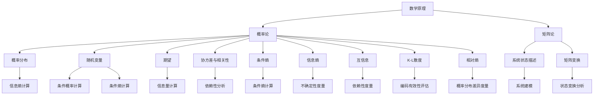

                 

## 引言

### 1.1 研究背景与意义

数学与信息论的交叉研究是一个极具前景且具有重要意义的领域。随着信息时代的到来，信息科学的发展对数学提出了新的挑战，而数学的进步也为信息科学提供了强有力的工具。因此，探讨数学与信息论之间的交叉研究，不仅有助于深化对信息科学本质的理解，也为解决现实世界中的诸多问题提供了新的思路。

#### 1.1.1 数学与信息论的起源与发展

数学作为一门古老的科学，其起源可以追溯到古代文明，如古埃及和古希腊。数学的发展经历了几个重要的阶段，包括几何学、代数学、微积分等。而信息论则是由香农（Claude Shannon）在20世纪40年代提出的，它为信息科学奠定了理论基础，标志着信息论作为一门独立学科的诞生。

在数学与信息论的交叉研究方面，经典的“数学与逻辑基础”以及“信息与编码理论”是两个重要的分支。这些研究不仅推动了信息论的发展，也推动了数学的进步。

#### 1.1.2 数学与信息论的交叉研究现状与挑战

当前，数学与信息论的交叉研究已经取得了显著的成果。例如，在数据压缩、错误纠正、通信理论、密码学等领域，数学模型和信息论方法得到了广泛应用。然而，这一领域仍然面临着一些挑战：

1. **复杂性挑战**：信息论中的许多问题涉及到复杂的数学结构，如何简化这些结构，使其更容易理解和应用，是一个重要的研究方向。

2. **交叉学科融合**：如何更好地将数学理论与信息科学实际应用相结合，解决现实世界中的问题，是一个重要的挑战。

3. **新型算法的探索**：随着信息科学的发展，需要不断地探索新的数学和信息论算法，以应对日益复杂的计算需求。

### 1.2 核心概念与联系

要深入探讨数学与信息论的交叉研究，首先需要明确这两个领域中的核心概念，并理解它们之间的联系。以下是对《数学与信息论的交叉研究》一书中的核心概念的简要介绍及其相互关系。

#### 1.2.1 数学在信息论中的应用

**概率论**：概率论是数学中研究随机现象规律性的学科，在信息论中，概率论用于描述信息的随机性和不确定性。

**概率分布**：概率分布是描述随机变量取值概率的函数。在信息论中，概率分布用于计算信息熵和条件熵。

**随机变量**：随机变量是概率论中的核心概念，用于描述随机事件的结果。在信息论中，随机变量用于表示信息的传输和处理。

**期望**：期望是概率论中的一个重要概念，用于描述随机变量的平均取值。在信息论中，期望用于计算信息量。

**协方差与相关性**：协方差和相关系数用于衡量两个随机变量之间的线性关系。在信息论中，这些概念用于分析信息的依赖性和相关性。

**矩阵论**：矩阵论是数学中研究矩阵的学科，在信息论中，矩阵论用于描述复杂系统的状态和变换。

#### 1.2.2 信息论对数学的启示

**信息熵**：信息熵是香农提出的一个核心概念，用于衡量信息的混乱程度或不确定性。信息熵的计算涉及到概率论和微积分。

**条件熵**：条件熵是描述在已知某些信息后，剩余信息不确定性的概念。条件熵的计算依赖于概率论中的条件概率。

**互信息**：互信息是描述两个随机变量之间相互依赖程度的度量。互信息的计算涉及到条件熵和熵的计算。

**K-L散度**：K-L散度是一种衡量概率分布差异的度量，它用于评估信息编码的有效性。

**相对熵**：相对熵是衡量两个概率分布之间差异的一种度量，它也是信息论中一个重要的概念。

通过上述核心概念的介绍，我们可以构建一个Mermaid流程图来展示这些概念及其相互关系：

通过这个流程图，我们可以清晰地看到数学原理如何被应用于信息论中，以及这些数学工具如何帮助我们理解和解决信息科学中的问题。

### 1.3 目标与结构

本文旨在探讨数学与信息论交叉研究中的核心概念、算法原理及其在实际中的应用。文章的结构如下：

- **第一部分**：引论，介绍研究背景与意义，以及核心概念与联系。
- **第二部分**：数学基础，详细讲解数学在信息论中的应用。
- **第三部分**：信息论应用，探讨信息论在通信系统、数据压缩等领域的应用。
- **第四部分**：交叉研究领域，介绍数学与信息论在密码学、网络安全等领域的应用。
- **第五部分**：项目实战，通过实际案例展示数学与信息论的实际应用。

通过本文的逐步分析，读者将能够深入理解数学与信息论交叉研究的本质，并掌握相关算法和应用。

---

**摘要**：

本文围绕《数学与信息论的交叉研究》这一主题，系统地介绍了数学与信息论的基本概念及其相互关系。文章首先回顾了数学与信息论的起源和发展，随后详细讲解了数学在信息论中的应用，包括概率论、矩阵论等基础理论。接着，文章介绍了信息论中的核心概念，如信息熵、条件熵、互信息等，并通过具体的数学公式和算法进行了详细解释。文章还探讨了数学与信息论在通信系统、数据压缩、密码学、网络安全等领域的应用，并通过实际案例展示了这些理论在实际项目中的实现。最后，文章总结了数学与信息论交叉研究的现状与挑战，提出了未来研究的方向。

关键词：数学，信息论，交叉研究，信息熵，条件熵，互信息，通信系统，数据压缩，密码学，网络安全。

---

接下来，我们将深入探讨数学在信息论中的应用，包括概率论和信息论的基本原理，以及这些原理在信息科学中的具体应用。

## 第二部分：数学基础

### 2.1 数学与信息论的基本原理

在信息论中，数学作为基础工具，提供了描述、分析和解决问题的语言和框架。特别是概率论和信息论，这两个数学分支在信息科学中扮演了核心角色。以下将详细讲解这些基本原理。

#### 2.1.1 数学中的概率论基础

**概率分布**：概率分布用于描述随机变量的取值及其对应的概率。常见的概率分布包括离散概率分布和连续概率分布。离散概率分布通常用概率质量函数（PMF）来描述，而连续概率分布通常用概率密度函数（PDF）来描述。

**随机变量**：随机变量是概率论中的核心概念，用于表示随机事件的结果。随机变量可以是离散的，也可以是连续的。离散随机变量通常用概率分布函数（PDF）来描述，而连续随机变量通常用概率密度函数（PDF）来描述。

**期望**：期望是概率论中的一个重要概念，用于描述随机变量的平均取值。对于离散随机变量，期望可以通过概率分布计算得到；对于连续随机变量，期望可以通过概率密度函数计算得到。

**协方差与相关性**：协方差用于描述两个随机变量之间的线性关系，而相关性用于衡量两个随机变量之间关系的强度。相关系数是协方差的标准化形式，它提供了一个介于-1和1之间的一致性度量，其中-1表示完全负相关，1表示完全正相关，0表示无相关性。

#### 2.1.2 信息论中的基本概念

**信息熵**：信息熵是信息论中的核心概念，用于衡量信息的混乱程度或不确定性。香农熵是一个广泛使用的度量，它基于概率分布计算。香农熵的公式如下：

$$H(X) = -\sum_{i} p(x_i) \log_2 p(x_i)$$

其中，$X$ 是随机变量，$p(x_i)$ 是 $x_i$ 取值的概率。

**条件熵**：条件熵是描述在已知某些信息后，剩余信息不确定性的概念。条件熵的公式如下：

$$H(X|Y) = H(X,Y) - H(Y)$$

其中，$H(X,Y)$ 是联合熵，$H(Y)$ 是边际熵。

**互信息**：互信息是描述两个随机变量之间相互依赖程度的度量。互信息的公式如下：

$$I(X;Y) = H(X) - H(X|Y)$$

其中，$I(X;Y)$ 表示 $X$ 和 $Y$ 之间的互信息。

**K-L散度**：K-L散度是一种衡量两个概率分布差异的度量，它用于评估信息编码的有效性。K-L散度的公式如下：

$$D(P||Q) = \sum_{i} p(x_i) \log_2 \frac{p(x_i)}{q(x_i)}$$

其中，$P$ 和 $Q$ 是两个概率分布。

**相对熵**：相对熵是衡量两个概率分布之间差异的一种度量，它是K-L散度的推广。相对熵的公式如下：

$$\mathcal{D}(P||Q) = \int p(x) \log_2 \frac{p(x)}{q(x)} dx$$

#### 2.1.3 概率论与信息论的融合

概率论和信息论在信息科学中有着紧密的联系。概率论提供了描述不确定性和随机性的工具，而信息论则利用这些工具来分析、设计和优化信息处理系统。

例如，在数据压缩中，概率论用于计算符号出现的概率，从而设计出更有效的编码方案。信息熵则用于衡量数据的冗余度，指导编码算法的优化。在通信系统中，概率论用于分析信号噪声的干扰，而信息论则提供了信道容量理论，指导通信系统的设计。

### 2.2 数学在信息论中的具体应用

在信息论中，数学的应用体现在多个方面，以下是一些典型的应用场景：

#### 2.2.1 源编码与熵率

源编码的目的是将数据压缩到最小的表示长度，同时保持数据的可恢复性。信息熵提供了一个度量，用于评估数据的压缩潜力。熵率是源编码的核心概念，它表示在平均每个符号上需要多少位来表示数据。

熵率的公式如下：

$$R = \frac{H(X)}{L}$$

其中，$H(X)$ 是信息熵，$L$ 是符号的长度。

通过优化编码算法，可以最大限度地降低熵率，从而实现高效的数据压缩。

#### 2.2.2 信道编码与容量分析

在通信系统中，信道编码的目的是在传输过程中抵抗噪声和干扰，保证信息的可靠传输。信道容量是通信系统设计的核心指标，它表示在特定信道上可以传输的最大信息速率。

香农信道容量公式如下：

$$C = B \log_2(1 + S/N)$$

其中，$C$ 是信道容量，$B$ 是信道的带宽，$S/N$ 是信噪比。

通过设计合适的编码方案，可以提高信道的容量，实现更高效的通信。

#### 2.2.3 数据压缩算法比较

在数据压缩中，常用的算法包括无损压缩和有损压缩。无损压缩算法旨在完全恢复原始数据，而

