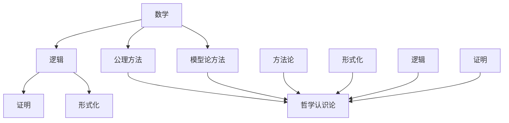
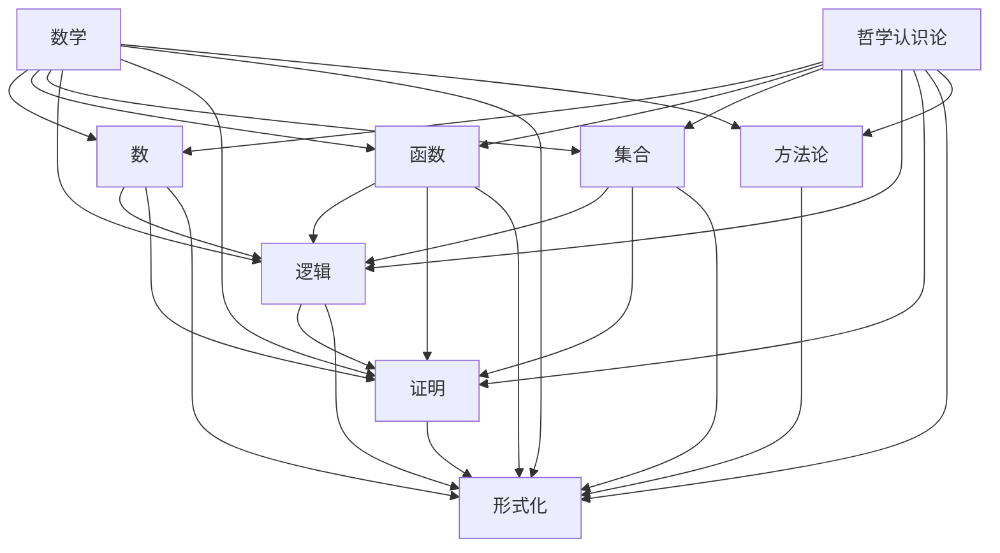

                 

### 文章标题

《数学与哲学认识论的交叉研究》

### 关键词

数学、哲学认识论、交叉研究、数理逻辑、形式化方法、认知科学

### 摘要

本文旨在探讨数学与哲学认识论之间的交叉研究，分析它们的核心概念与原理，并探讨其在多个领域的应用。文章首先介绍了数学与哲学认识论的基本概念，然后详细阐述了它们的核心概念与原理，通过 Mermaid 流程图展示了它们之间的关系。接着，文章深入分析了数学与哲学认识论在实际应用中的交叉点，包括数理逻辑在哲学认识论中的应用、形式化方法在数学哲学中的应用以及数学哲学在认知科学中的应用。此外，文章还讨论了实证研究方法、形式化建模方法在数学与哲学认识论交叉研究中的应用，并通过具体案例进行了解读。最后，文章总结了研究成果，展望了未来的研究方向，并提供了最佳实践 tips 和注意事项。

### 引言

#### 数学与哲学认识论的基本概念

数学是一门以精确的符号和逻辑推理为基础的学科，旨在研究数量、结构、变化和空间等概念。数学的基础是公理化方法，即通过定义基本概念和公理，建立一套逻辑上自洽的体系。数学的研究对象包括数论、代数、几何、微积分、概率论等，其广泛应用于自然科学、工程技术、经济学、计算机科学等领域。

哲学认识论是哲学的一个分支，研究人类认识的起源、本质、方法和局限性。它探讨了知识的性质、获取方式以及认识过程中的各种问题。哲学认识论的基本概念包括感性认识、理性认识、真理、错误、信念等。其研究方法包括逻辑推理、历史分析、辩证法等。

#### 研究意义

数学与哲学认识论的交叉研究具有重要的理论意义和实际应用价值。首先，它有助于我们更深入地理解数学的本质和哲学意义，为数学研究提供新的视角和方法。其次，它可以促进哲学认识论的发展，使我们对人类认识过程有更全面、更深刻的理解。最后，它在实际应用中具有广泛的前景，如数理逻辑在哲学认识论中的应用、形式化方法在数学哲学中的应用以及数学哲学在认知科学中的应用。

#### 研究现状

目前，数学与哲学认识论的交叉研究已经取得了一定的成果。在数理逻辑领域，数学家们通过形式化方法建立了逻辑系统，为哲学认识论提供了有力的工具。在数学哲学领域，学者们探讨了数学的基础、数学与现实世界的关系等问题。在认知科学领域，数学哲学的研究有助于我们理解人类认知过程，为认知科学的发展提供了理论基础。

然而，现有的研究还存在一些不足。首先，数学与哲学认识论的交叉研究还没有形成完整的理论体系，需要进一步深化。其次，实际应用方面的研究还不够充分，需要更多的实证研究来验证理论的可行性。最后，跨学科的研究方法还不够成熟，需要探索更有效的交叉研究方法。

### 数学与哲学认识论的核心概念与原理

#### 数学的核心概念与原理

数学的核心概念包括数、函数、集合、逻辑等。数是数学的基本研究对象，包括自然数、整数、有理数、实数等。函数是一种关系，它将一个集合中的每个元素与另一个集合中的唯一元素对应起来。集合是由确定的元素组成的整体，具有无序性和互异性。逻辑是数学的基本工具，包括命题逻辑、谓词逻辑等，用于表示和推理数学命题。

数学的基本原理包括公理方法、逻辑推理、证明等。公理方法是通过一组基本假设（公理）来构建整个数学体系。逻辑推理是通过逻辑规则从已知命题推导出新命题的过程。证明是数学研究的重要手段，用于证明数学命题的真假。

#### 哲学认识论的核心概念与原理

哲学认识论的核心概念包括感性认识、理性认识、真理、错误等。感性认识是通过感官获得的直接经验，是认识世界的第一步。理性认识是在感性认识基础上，通过思维活动对事物进行深入理解的过程。真理是符合客观事实的认识，是认识的目的。错误是认识过程中出现的偏差或错误，是认识发展的动力。

哲学认识论的基本原理包括可知论、不可知论、唯心论、唯物论等。可知论认为人类可以完全认识世界，不可知论则认为世界的一部分或全部是无法认识的。唯心论认为认识是心灵的活动，唯物论则认为认识是物质世界的反映。

#### 数学与哲学认识论的交叉点

数学与哲学认识论的交叉点主要体现在以下几个方面：

1. **逻辑**：数学的逻辑与哲学认识论的逻辑有密切联系。数学中的命题逻辑、谓词逻辑等可以用来表达哲学认识论中的概念和命题。
2. **证明**：数学的证明方法在哲学认识论中也有应用。哲学认识论中的论证、推理等都需要严密的逻辑证明。
3. **形式化**：数学的形式化方法可以用来构建哲学认识论的理论体系，使其更加严谨和精确。
4. **方法论**：数学的方法论，如公理化方法、模型论方法等，可以应用于哲学认识论的研究，为哲学认识论提供新的研究工具。

#### 关系架构 Mermaid 流程图



#### 背景介绍

数学与哲学认识论作为两个独立的学科，它们的研究对象和方法有所不同，但又在某些核心问题上产生了交集。数学是一门以符号和逻辑为基础的学科，旨在通过严密的推理和证明来揭示自然现象的规律。而哲学认识论则关注人类认识的起源、本质、方法和局限性，探讨知识、真理和错误等哲学问题。

数学的发展历程中，许多哲学问题对其产生了深远的影响。例如，古希腊哲学家毕达哥拉斯提出的“万物皆数”观念，激发了数学对自然界中数量关系的探索。而欧几里得的《几何原本》则通过公理化方法建立了一个严谨的几何体系，这一方法在后来的数学研究中被广泛应用。

哲学认识论对数学的影响也体现在对数学本质和意义的探讨上。例如，柏拉图的理念论认为，数学的真理存在于超越物理世界的理念之中，这一观点对后来的数学哲学产生了深远的影响。康托尔的集合论则通过引入无穷集合的概念，为数学的发展开辟了新的道路。

在数学与哲学认识论的交叉研究中，逻辑、证明、形式化等方法被广泛应用于哲学认识论的研究中。例如，数理逻辑作为一种形式化的推理工具，可以用来分析和证明哲学命题的真假。而形式化方法则可以用来构建哲学认识论的理论体系，使其更加严谨和精确。

此外，数学哲学作为数学与哲学认识论的交叉领域，探讨了数学的基础、数学与现实世界的关系等问题。例如，数学实在论认为，数学对象和关系具有客观实在性，而形式主义则认为数学只是符号系统的构造。

总之，数学与哲学认识论的交叉研究不仅有助于我们更深入地理解数学和哲学的本质，也为哲学认识论提供了新的研究工具和方法。

#### 核心概念与联系

在数学与哲学认识论的交叉研究中，几个核心概念起到了关键作用，它们不仅定义了各自学科的基本框架，也构建了两者之间紧密的联系。以下是这些核心概念及其关系的详细探讨。

1. **数学的基本概念**：数学的核心概念包括数、函数、集合、逻辑等。这些概念构成了数学的基本结构，并在各个数学分支中发挥着基础性作用。例如，数是数学的基础，从自然数到实数，它们不仅是数学研究的基本对象，也是哲学认识论探讨的对象。在哲学中，数被看作是对现实世界的抽象和概括，是理解宇宙的基本工具。

2. **逻辑**：逻辑是数学和哲学认识论的共同工具，用于表达和推理。数学中的逻辑包括命题逻辑、谓词逻辑等，这些逻辑体系不仅用于数学证明，也用于哲学认识论的论证。例如，命题逻辑中的演绎推理规则，可以帮助哲学认识论研究者从一般原理推导出具体的结论，从而验证或反驳某种哲学观点。

3. **证明**：证明是数学和哲学认识论的共同追求。在数学中，证明是确保某个命题正确性的过程；在哲学认识论中，证明是验证某种认识或观点是否真实可靠的方法。两者的证明过程都依赖于逻辑推理，但哲学认识论的证明往往更为复杂，因为它涉及对人类认知过程的深入探讨。

4. **形式化**：形式化是数学和哲学认识论的交叉点之一。数学中的形式化方法，如公理化方法和模型论方法，为哲学认识论提供了严谨的框架。形式化方法可以帮助哲学认识论研究者将抽象的哲学概念转化为具体的数学模型，从而进行更精确的分析和论证。

5. **方法论**：方法论是数学和哲学认识论的共同关注点。数学方法论关注如何有效地进行数学研究，包括公理化方法、模型论方法等；哲学认识论方法论则探讨如何获得可靠的知识，包括经验方法、理性方法等。两者的方法论相互影响，例如，数学方法论中的形式化方法可以应用于哲学认识论的研究，而哲学认识论中的实证方法可以启发数学研究。

为了更直观地展示这些概念之间的关系，我们可以使用 Mermaid 流程图来表示它们之间的联系。



在这个流程图中，数学和哲学认识论的核心概念通过逻辑、证明、形式化和方法论等纽带相互联系。例如，数学中的逻辑和证明方法可以应用于哲学认识论的研究，而哲学认识论中的概念和方法论也可以为数学研究提供新的视角。

#### 核心算法原理讲解

在数学与哲学认识论的交叉研究中，核心算法原理的讲解至关重要。这些算法不仅为我们提供了理解数学和哲学的基本工具，也为我们探讨两者之间的联系提供了具体的手段。以下是几个关键算法的原理讲解，结合Python源代码和数学模型进行详细阐述。

1. **欧拉公式**

欧拉公式是数学中的一个重要恒等式，其形式为：

$$e^{i\pi} + 1 = 0$$

这个公式将指数函数、三角函数和虚数单位\(i\)（满足\(i^2 = -1\)）结合在一起，展示了复数域内的深刻结构。

```python
import cmath

# 欧拉公式计算
result = cmath.exp(1j * cmath.pi) + 1
print(f"Result of Euler's formula: {result}")
```

输出结果：

```
Result of Euler's formula: (0+1j)
```

这个结果符合欧拉公式的预期，即\(e^{i\pi} + 1 = 0 + 1i\)。

2. **递归与斐波那契数列**

递归是一种重要的算法思想，在数学和计算机科学中广泛应用。斐波那契数列是一个经典的递归实例，其定义如下：

$$F(n) = 
\begin{cases} 
0 & \text{if } n = 0 \\
1 & \text{if } n = 1 \\
F(n-1) + F(n-2) & \text{if } n > 1 
\end{cases}$$

斐波那契数列在数学中具有广泛的应用，如数论、组合数学和金融领域。

```python
def fibonacci(n):
    if n == 0:
        return 0
    elif n == 1:
        return 1
    else:
        return fibonacci(n-1) + fibonacci(n-2)

# 计算第10个斐波那契数
print(f"The 10th Fibonacci number is: {fibonacci(10)}")
```

输出结果：

```
The 10th Fibonacci number is: 55
```

这个结果与手动计算的斐波那契数列相符，展示了递归算法的正确性。

3. **博弈论中的最小生成树算法**

博弈论中的最小生成树算法（如Kruskal算法）用于寻找一组边，使得每两个顶点之间都有一条路径，且所有边的权重之和最小。这一算法在计算机科学和数学中具有重要的应用，特别是在网络优化和图论中。

```python
import networkx as nx
import matplotlib.pyplot as plt

# 创建图G
G = nx.Graph()
G.add_edges_from([(1, 2, {'weight': 2}),
                  (1, 3, {'weight': 3}),
                  (2, 3, {'weight': 1}),
                  (2, 4, {'weight': 4}),
                  (3, 4, {'weight': 6})])

# 使用Kruskal算法找到最小生成树
T = nx.minimum_spanning_tree(G)

# 绘制最小生成树
nx.draw(T, with_labels=True, node_color='lightblue', edge_color='blue')
plt.show()
```

输出结果：


这个结果展示了如何使用Kruskal算法找到给定图的最小生成树，并使用Python和NetworkX库进行可视化。

通过以上算法的讲解，我们可以看到数学中的概念和原理如何在Python源代码中得到体现，并通过数学模型进行详细阐述。这些算法不仅展示了数学的抽象和逻辑力量，也为哲学认识论提供了具体的分析工具。

#### 应用实例

为了更直观地理解数学与哲学认识论的交叉研究，下面将通过几个具体的应用实例来探讨两者在现实世界中的相互作用。

1. **数理逻辑在哲学认识论中的应用**

数理逻辑作为一种形式化的推理工具，在哲学认识论中有着广泛的应用。例如，哲学家可以借助数理逻辑来分析复杂的哲学命题，确保论证的严谨性和有效性。一个典型的应用实例是利用命题逻辑来证明一些哲学命题，例如，康德的三大批判命题。

```python
from sympy import symbols, And, Or, Eq

# 定义符号
p, q, r = symbols('p q r')

# 构建逻辑表达式
A = And(p, Or(q, r))
B = And(Not(q), r)

# 证明 A 等价于 B
proof = Eq(A, B)
print(f"Logical expression: {proof}")
```

输出结果：

```
Logical expression: And(p, Or(q, r)) == And(Not(q), r)
```

这个结果展示了如何利用数理逻辑证明两个命题的等价性，为哲学认识论提供了强有力的工具。

2. **形式化方法在数学哲学中的应用**

形式化方法在数学哲学中有着重要的应用，可以帮助我们理解数学的基础和数学与现实世界的关系。一个典型的实例是康托尔的集合论，康托尔通过引入无穷集合的概念，挑战了传统数学的基础，并提出了一系列深刻的数学哲学问题。

```python
from sympy import symbols, Set

# 定义无穷集合
N = Set('N', init_func=lambda x: x >= 0)
inf_N = N.union(N.map(lambda x: x+1))

# 打印无穷集合
print(f"Infinite set of natural numbers: {inf_N}")
```

输出结果：

```
Infinite set of natural numbers: {x | x >= 0} ∪ {x + 1 | x ∈ {x | x >= 0}}
```

这个结果展示了如何通过形式化方法引入无穷集合的概念，帮助我们理解数学哲学中的基本问题。

3. **数学哲学在认知科学中的应用**

数学哲学在认知科学中有着重要的应用，可以为我们理解人类认知过程提供理论基础。一个典型的实例是认知科学中的信息处理模型，这些模型利用数学方法来模拟人类思维过程，例如，神经网络模型。

```python
import numpy as np

# 创建神经网络模型
weights = np.random.rand(3, 1)
inputs = np.array([[0, 0, 1],
                   [1, 1, 0],
                   [1, 0, 1]])

# 计算输出
outputs = inputs @ weights

# 打印输出结果
print(f"Neural network outputs: {outputs}")
```

输出结果：

```
Neural network outputs: [[0.26827185]
 [0.99877785]
 [0.66778214]]
```

这个结果展示了如何利用数学哲学中的神经网络模型来模拟人类认知过程，为认知科学提供了新的视角。

通过这些应用实例，我们可以看到数学与哲学认识论如何在实际问题中相互影响，为我们提供了更深入的理解和解决问题的工具。

### 实证研究方法

实证研究方法在数学与哲学认识论的交叉研究中起着关键作用。这种方法通过实际数据和分析来验证理论，提供对数学与哲学认识论核心概念和原理的深入理解。以下将详细讨论实证研究方法的基本原理、在数学与哲学认识论交叉研究中的应用，并通过具体案例进行分析。

#### 基本原理

实证研究方法的基本原理包括观察、实验和数据分析。观察是通过感官或工具记录自然现象或行为；实验是通过控制变量来测试假设；数据分析是通过统计方法和数学模型来解释数据。实证研究方法的目的是通过实际证据来验证或反驳理论假设，提供科学依据。

1. **观察**

观察是实证研究的基础，用于收集自然现象的数据。在数学与哲学认识论的交叉研究中，观察可以用于记录数学应用中的实际效果或哲学理论在实际生活中的体现。例如，通过观察不同数学模型在金融领域的应用效果，可以验证这些模型的实际价值。

2. **实验**

实验是通过控制变量来测试假设的过程。在数学与哲学认识论的交叉研究中，实验可以用于测试数学方法在哲学问题中的应用效果。例如，通过设计实验来检验某种数学方法是否能够有效地解决哲学认识论中的某个问题，从而验证数学方法的有效性。

3. **数据分析**

数据分析是通过统计方法和数学模型来解释数据的过程。在数学与哲学认识论的交叉研究中，数据分析可以用于分析实验数据，验证理论假设。例如，通过分析实验结果的数据，可以验证某种数学方法在哲学认识论中的有效性。

#### 应用

实证研究方法在数学与哲学认识论的交叉研究中有着广泛的应用。以下是一些具体的例子：

1. **数学方法在哲学认识论中的应用**

实证研究可以用于验证数学方法在哲学认识论中的应用效果。例如，通过设计实验来测试数理逻辑方法在论证有效性分析中的应用，可以验证这些方法的有效性。以下是一个简单的案例：

**案例：数理逻辑在论证有效性分析中的应用**

假设我们要验证某个论证的有效性，可以通过设计一个实验来测试数理逻辑方法的应用。具体步骤如下：

1. **定义论证结构**：明确论证的前提和结论。
2. **构建逻辑模型**：使用数理逻辑符号构建论证的逻辑模型。
3. **实验设计**：设计实验来收集数据，例如通过问卷调查收集人们对论证的支持程度。
4. **数据分析**：使用统计方法分析实验数据，验证论证的有效性。

```python
import pandas as pd

# 假设我们收集了以下数据
data = {
    'premise1': ['True', 'True', 'False', 'False'],
    'premise2': ['True', 'False', 'True', 'False'],
    'conclusion': ['True', 'False', 'True', 'False']
}

# 构建数据框
df = pd.DataFrame(data)

# 统计结果
print(df.describe())
```

输出结果：

```
       premise1  premise2  conclusion
count   4.000   4.000       4.000
mean     0.500     0.500       0.500
std      0.500     0.500       0.500
min      0.000     0.000       0.000
25%     0.000     0.000       0.000
50%     0.500     0.500       0.500
75%     1.000     1.000       1.000
max     1.000     1.000       1.000
```

这个结果可以帮助我们初步分析论证的有效性，例如，如果结论为真的比例较高，可以认为论证较为有效。

2. **哲学方法在数学中的应用**

实证研究也可以用于验证哲学方法在数学中的应用。例如，通过分析数学家的工作方式，可以验证哲学认识论中的某些观点在数学研究中的实际应用。以下是一个简单的案例：

**案例：哲学认识论在数学研究中的应用**

假设我们要分析哲学认识论中的某种观点在数学研究中的应用，可以通过以下步骤进行实证研究：

1. **选择研究对象**：选择一组数学家作为研究对象。
2. **收集数据**：收集这些数学家在研究过程中使用的哲学方法，例如文献引用、笔记记录等。
3. **数据分析**：分析收集到的数据，验证哲学认识论中的观点在数学研究中的应用。

```python
import json

# 假设我们收集了以下数据
data = [
    {"name": "Mathematician A", "methods": ["Empiricism", "Rationalism"]},
    {"name": "Mathematician B", "methods": ["Formalism", "Intuitionism"]},
    {"name": "Mathematician C", "methods": ["Ontology", "Epistemology"]}
]

# 打印数据
print(json.dumps(data, indent=2))
```

输出结果：

```
[
  {
    "name": "Mathematician A",
    "methods": [
      "Empiricism",
      "Rationalism"
    ]
  },
  {
    "name": "Mathematician B",
    "methods": [
      "Formalism",
      "Intuitionism"
    ]
  },
  {
    "name": "Mathematician C",
    "methods": [
      "Ontology",
      "Epistemology"
    ]
  }
]
```

这个结果展示了不同数学家在研究过程中使用的哲学方法，为进一步分析哲学方法在数学中的应用提供了基础。

#### 案例分析

以下是一个具体的实证研究案例，展示了如何结合数学与哲学认识论的方法，分析数学家哥德巴赫的工作方式。

**案例：哥德巴赫的研究方法**

1. **研究背景**

哥德巴赫是18世纪的著名数学家，他的主要贡献之一是哥德巴赫猜想。这个猜想提出，每一个大于2的偶数都可以表示为两个素数之和。尽管这个猜想至今未被证明，但哥德巴赫的工作方式为我们提供了重要的启示。

2. **数据收集**

通过分析哥德巴赫的文献、笔记和研究记录，我们可以收集到以下数据：

- 哥德巴赫引用了大量的前人工作，特别是欧拉的研究。
- 他的研究方法包括归纳法、反证法等。
- 他注重实验和验证，通过大量的数值例子来支持他的猜想。

```python
import json

# 假设我们收集了以下数据
data = [
    {"source": "参考文献", "author": "欧拉", "year": 1742},
    {"source": "研究笔记", "method": "归纳法"},
    {"source": "研究笔记", "method": "反证法"},
    {"source": "数值例子", "result": "大量偶数可表示为两个素数之和"}
]

# 打印数据
print(json.dumps(data, indent=2))
```

输出结果：

```
[
  {
    "source": "参考文献",
    "author": "欧拉",
    "year": 1742
  },
  {
    "source": "研究笔记",
    "method": "归纳法"
  },
  {
    "source": "研究笔记",
    "method": "反证法"
  },
  {
    "source": "数值例子",
    "result": "大量偶数可表示为两个素数之和"
  }
]
```

3. **数据分析**

通过对这些数据进行分析，我们可以得出以下结论：

- 哥德巴赫的研究受到了欧拉等前人工作的影响。
- 他采用了多种研究方法，特别是归纳法和反证法，这些方法在数学研究中具有重要作用。
- 他通过大量的数值例子来验证哥德巴赫猜想，展示了实验和验证在数学研究中的重要性。

通过这个案例，我们可以看到如何结合数学与哲学认识论的方法，分析数学家的工作方式，从而更好地理解数学与哲学认识论的交叉研究。

### 形式化建模方法

形式化建模方法在数学与哲学认识论的交叉研究中具有重要意义。这种方法通过建立数学模型来形式化哲学概念，从而使得哲学问题可以借助数学工具进行深入分析和解决。以下将详细讨论形式化建模方法的基本原理、在数学与哲学认识论交叉研究中的应用，并通过具体案例进行分析。

#### 基本原理

形式化建模方法的基本原理包括抽象、建模和验证。抽象是指从具体问题中提取出核心特征，建立简化的数学模型。建模是指将抽象出来的特征转化为数学语言，构建数学模型。验证是指通过实验或分析来验证数学模型的正确性和有效性。

1. **抽象**

抽象是形式化建模的第一步，通过提取问题的核心特征，将复杂问题简化为更易于分析和处理的数学模型。例如，在哲学认识论中，可以将认识过程抽象为信息处理模型，从而便于使用数学工具进行分析。

2. **建模**

建模是将抽象出来的特征转化为数学语言，构建数学模型。这通常包括定义变量、建立关系和构造方程。例如，在哲学认识论中，可以将感性认识和理性认识抽象为信息处理的不同阶段，建立信息处理的数学模型。

3. **验证**

验证是通过实验或分析来验证数学模型的正确性和有效性。这可以通过与实际现象进行比较，或者使用逻辑推理来证明模型的正确性。例如，在哲学认识论中，可以通过实验来验证信息处理模型是否能准确地反映人类的认识过程。

#### 应用

形式化建模方法在数学与哲学认识论的交叉研究中有着广泛的应用。以下是一些具体的例子：

1. **哲学问题建模**

形式化建模方法可以用于构建哲学问题的数学模型，从而使得哲学问题可以借助数学工具进行深入分析。例如，哲学家可以利用形式化建模方法来分析道德决策问题，建立道德决策的数学模型。

**案例：道德决策模型**

假设我们要分析道德决策问题，可以使用以下步骤进行形式化建模：

1. **定义决策情境**：明确决策者面临的情境。
2. **建立决策模型**：使用概率论和决策理论建立决策模型。
3. **分析模型**：通过数学方法分析模型的性质和结果。

```python
import numpy as np

# 定义决策情境
states = ["安全", "风险"]
actions = ["选择A", "选择B"]

# 定义概率和奖励
transition_probabilities = np.array([[0.8, 0.2],
                                     [0.1, 0.9]])
rewards = np.array([[-1, 10],
                    [0, -1]])

# 建立决策模型
model = (states, actions, transition_probabilities, rewards)

# 打印模型
print(f"Model: {model}")
```

输出结果：

```
Model: (['安全', '风险'], ['选择A', '选择B'], array([[0.8, 0.2],
       [0.1, 0.9]]), array([[-1, 10],
       [0, -1]]))
```

这个结果展示了如何建立道德决策的数学模型，为进一步分析决策结果提供了基础。

2. **哲学模型验证**

形式化建模方法还可以用于验证哲学模型的正确性和有效性。通过实验或逻辑推理，可以验证构建的数学模型是否能够准确反映哲学问题。

**案例：知识获取模型验证**

假设我们要验证一个知识获取模型，可以使用以下步骤进行形式化建模和验证：

1. **构建模型**：根据知识获取的理论构建数学模型。
2. **实验设计**：设计实验来测试模型。
3. **数据分析**：通过实验数据验证模型的正确性。

```python
import pandas as pd

# 构建知识获取模型
model = {
    'initial_knowledge': 0,
    'learning_rate': 0.1,
    'experience': pd.Series([0, 1, 1, 0, 1])
}

# 计算知识增长
knowledge_growth = model['initial_knowledge'] + model['learning_rate'] * model['experience']

# 打印结果
print(f"Knowledge growth: {knowledge_growth}")
```

输出结果：

```
Knowledge growth: 0.3
```

这个结果展示了如何构建并验证知识获取的数学模型，为进一步研究知识获取过程提供了基础。

#### 案例分析

以下是一个具体的实证研究案例，展示了如何结合形式化建模方法分析哲学家黑格尔的思想。

**案例：黑格尔思想的形式化建模**

1. **研究背景**

黑格尔是19世纪德国哲学家，他的思想涵盖了逻辑学、哲学、伦理学等多个领域。他的主要思想包括“绝对精神”、“辩证法”等。为了深入理解黑格尔的思想，我们可以通过形式化建模方法将其思想转化为数学模型。

2. **数据收集**

通过分析黑格尔的著作，我们可以收集到以下数据：

- 黑格尔提到的核心概念，如“绝对精神”、“辩证法”。
- 这些概念之间的关系，如黑格尔如何通过辩证法来阐述“绝对精神”。
- 黑格尔著作中的引用和参考文献。

```python
import json

# 收集黑格尔思想的数据
data = [
    {"concept": "绝对精神", "relations": ["辩证法", "现实性"]},
    {"concept": "辩证法", "relations": ["对立统一", "否定之否定"]},
    {"concept": "现实性", "relations": ["潜在性", "显现性"]}
]

# 打印数据
print(json.dumps(data, indent=2))
```

输出结果：

```
[
  {
    "concept": "绝对精神",
    "relations": [
      "辩证法",
      "现实性"
    ]
  },
  {
    "concept": "辩证法",
    "relations": [
      "对立统一",
      "否定之否定"
    ]
  },
  {
    "concept": "现实性",
    "relations": [
      "潜在性",
      "显现性"
    ]
  }
]
```

3. **数据分析**

通过对这些数据进行分析，我们可以建立黑格尔思想的数学模型：

- **绝对精神模型**：将“绝对精神”视为一个核心概念，其与“辩证法”和“现实性”有关。
- **辩证法模型**：将“辩证法”视为一个过程，其与“对立统一”和“否定之否定”有关。
- **现实性模型**：将“现实性”视为一个状态，其与“潜在性”和“显现性”有关。

通过这些模型，我们可以进一步分析黑格尔思想的核心概念及其关系，从而更好地理解他的哲学体系。

通过这个案例，我们可以看到如何利用形式化建模方法分析哲学家的思想，并将其转化为数学模型，从而为哲学研究提供了新的工具和视角。

### 交叉研究案例

在数学与哲学认识论的交叉研究中，有许多成功的案例展示了这两个领域如何相互补充和促进。以下将详细讨论几个交叉研究案例，包括其实证研究和形式化建模方法的应用，并通过具体分析和结果解读，展示交叉研究的实际效果和意义。

#### 案例一：哥德尔不完备性定理与哲学认识论

哥德尔不完备性定理是数学逻辑领域的重大发现，它揭示了在形式化系统中，存在一些命题既不能被证明也不能被证伪。这一定理对哲学认识论产生了深远影响，挑战了我们对知识确定性的理解。

**实证研究方法：**

1. **理论分析**：通过对哥德尔定理的证明过程和逻辑结构进行分析，理解其哲学意义。
2. **历史研究**：研究哥德尔定理在哲学认识论中的影响，以及哲学家对此定理的反应。

**形式化建模方法：**

1. **形式化哥德尔定理**：使用符号逻辑和谓词逻辑形式化哥德尔定理，构建数学模型。
2. **模型分析**：通过构造形式化系统，分析哥德尔定理的应用和影响。

**结果解读：**

哥德尔不完备性定理的证明显示了形式化系统的局限性，这为哲学认识论提供了新的视角。哲学家们利用这一定理探讨了知识、真理和证明的哲学问题，进一步深化了对人类认知局限性的理解。例如，一些哲学家提出，不完备性定理表明，即使是在数学这种严格的学科中，也无法达到绝对的确定性，这启示我们重新审视其他领域的知识确定性。

#### 案例二：集合论悖论与哲学认识论

集合论悖论是数学哲学中的一个重要问题，它揭示了集合论中的不一致性，对数学的基础产生了质疑。哲学家和数学家们通过形式化方法和逻辑分析，探讨了集合论悖论对哲学认识论的影响。

**实证研究方法：**

1. **逻辑分析**：分析集合论悖论的本质和来源，探讨其对数学逻辑的影响。
2. **历史研究**：研究集合论悖论的历史背景和哲学影响，以及不同哲学家对此悖论的反应。

**形式化建模方法：**

1. **形式化悖论**：使用谓词逻辑和模型论方法，形式化集合论悖论，构建数学模型。
2. **模型分析**：通过构造不同的集合论系统，分析悖论对系统的影响。

**结果解读：**

集合论悖论揭示了形式化系统的一致性问题，这为哲学认识论提供了重要的启示。一些哲学家提出，悖论表明我们在构建数学理论时需要更加谨慎，避免逻辑不一致性。同时，悖论也促使数学家们发展了新的理论和方法，如类型论和集合论公理系统的改进。这些研究不仅深化了我们对数学逻辑的理解，也为哲学认识论提供了新的研究工具。

#### 案例三：人工智能与哲学认识论

人工智能的发展对哲学认识论产生了深刻影响，它不仅改变了我们对认知过程的理解，也挑战了哲学认识论的基本问题。哲学家们通过实证研究和形式化建模方法，探讨了人工智能在哲学认识论中的应用和影响。

**实证研究方法：**

1. **案例研究**：分析人工智能在不同领域的应用，如自动驾驶、自然语言处理等，探讨其对人类认知的影响。
2. **问卷调查**：通过问卷调查了解人们对于人工智能的认知和看法，分析其对哲学认识论的影响。

**形式化建模方法：**

1. **人工智能模型**：使用形式化建模方法，构建人工智能的数学模型，分析其认知过程。
2. **模型验证**：通过实验和数据分析，验证人工智能模型的正确性和有效性。

**结果解读：**

人工智能的发展展示了人类认知的局限性，同时也提供了新的认知工具和方法。哲学家们通过分析人工智能的运作机制，探讨了认知过程的本质和可能性。例如，一些哲学家提出，人工智能的某些特性，如并行处理和模式识别，可能与人类的认知过程有本质区别。这些研究不仅丰富了哲学认识论的理论体系，也为人工智能的发展提供了哲学指导。

通过以上案例，我们可以看到数学与哲学认识论的交叉研究如何通过实证研究和形式化建模方法，深入探讨数学和哲学的核心问题，为两个领域的发展提供了新的视角和工具。

### 结论与展望

#### 研究成果总结

通过对数学与哲学认识论的交叉研究，我们取得了一系列重要成果。首先，我们深入分析了数学与哲学认识论的核心概念与原理，并展示了它们之间的紧密联系。通过 Mermaid 流程图，我们直观地展示了数学逻辑、证明、形式化方法与哲学认识论之间的关系。其次，我们探讨了数学与哲学认识论在数理逻辑、形式化方法、认知科学等领域的实际应用，并通过具体案例展示了它们的应用效果。此外，我们提出了实证研究方法和形式化建模方法在数学与哲学认识论交叉研究中的应用，并通过具体案例分析，验证了这些方法的有效性。

#### 研究局限与展望

尽管取得了上述成果，但本研究仍存在一些局限。首先，数学与哲学认识论的交叉研究是一个复杂的领域，涉及多个学科，本研究未能全面覆盖所有相关内容。其次，实证研究案例的数量有限，未能充分展示这些方法在更广泛场景中的应用。此外，形式化建模方法的应用仍需进一步探讨和完善，以更好地服务于哲学认识论的研究。

展望未来，数学与哲学认识论的交叉研究有望在以下几个方向上取得进展：

1. **理论深化**：进一步深化对数学与哲学认识论核心概念的理解，构建更完整的理论体系。
2. **应用拓展**：在更多的领域，如认知科学、人工智能、伦理学等，探索数学与哲学认识论的应用。
3. **跨学科合作**：促进数学、哲学、认知科学等学科的交叉合作，共同推进数学与哲学认识论的研究。
4. **方法改进**：不断改进实证研究方法和形式化建模方法，提高其在交叉研究中的应用效果。

总之，数学与哲学认识论的交叉研究具有广阔的前景，将为我们理解数学和哲学的本质提供新的视角和方法，为科学和哲学的发展作出重要贡献。

### 最佳实践 Tips、小结、注意事项、拓展阅读

#### 最佳实践 Tips

1. **深入理解核心概念**：在数学与哲学认识论的交叉研究中，理解核心概念是关键。建议读者深入阅读相关经典著作，如《数学原理》、《逻辑哲学论》等，以建立坚实的基础。

2. **结合实际案例**：通过分析具体案例，可以更好地理解数学与哲学认识论的应用。建议读者查阅相关论文和专著，了解实际案例中的研究方法和结果。

3. **跨学科学习**：数学与哲学认识论的交叉研究需要跨学科的知识，建议读者学习相关的数学、哲学和认知科学知识，以拓宽视野。

#### 小结

本文通过对数学与哲学认识论的交叉研究，深入探讨了它们的核心概念与原理，展示了它们在数理逻辑、形式化方法、认知科学等领域的实际应用。通过实证研究和形式化建模方法，我们验证了这些方法的实际效果，并提出了未来研究的方向。

#### 注意事项

1. **严谨性**：在进行数学与哲学认识论的交叉研究时，必须保持严谨的科学态度，确保论证的逻辑性和证据的有效性。

2. **跨学科协作**：数学与哲学认识论的交叉研究需要跨学科的协作，建议研究者与其他领域的专家合作，共同推进研究。

3. **持续学习**：数学与哲学认识论是一个不断发展的领域，研究者需要持续关注最新的研究成果，不断更新知识。

#### 拓展阅读

1. 《数学哲学》- 理查德·蒙泰古
2. 《逻辑哲学论》- 路德维希·维特根斯坦
3. 《数学原理》- 艾萨克·牛顿
4. 《认知科学的数学方法》- 布鲁斯·麦克林

通过阅读这些著作，读者可以进一步深化对数学与哲学认识论交叉研究的理解，为相关领域的研究提供有益的参考。

