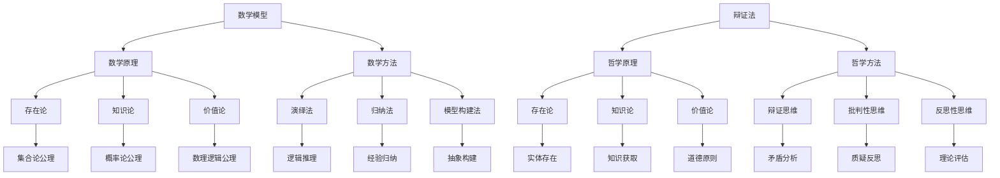

                 

### 文章标题

《数学与哲学辩证法的思维方式比较》

### 文章关键词

数学，哲学，辩证法，思维方式，比较，分析

### 文章摘要

本文通过对比数学与哲学辩证法的思维方式，深入探讨了这两大领域在思考方式上的异同点。首先，我们分别介绍了数学和哲学辩证法的基本概念和特点，接着分析了它们的核心概念、联系以及应用领域。通过具体的算法原理讲解和Python源代码示例，本文进一步揭示了数学与哲学辩证法在思维方式上的内在联系和区别。最后，本文提出了对这两大思维方式的最佳实践建议，为读者提供了深入理解与掌握这两种思维方式的实用指导。本文旨在为计算机编程和人工智能领域的研究者提供有价值的参考，以促进他们在学术研究和实际应用中更加灵活地运用数学与哲学辩证法的思维方式。

---

## 背景介绍

数学与哲学，自古以来便是人类智慧的两大重要领域。数学作为一种科学，它以抽象的符号和严密的逻辑结构，揭示出自然界和社会生活中的规律性。哲学则是一种思维方式，它通过辩证和反思，探究宇宙、人生和知识的本质。在这两个领域之间，存在着一种奇妙的相互作用，它们共同塑造了人类文明的进程。

### 数学的发展历程

数学的历史可以追溯到古巴比伦和古埃及时期，那时人们已经开始使用简单的数学工具来解决实际问题。例如，古埃及人使用金字塔形的土地测量方法来计算土地面积。古希腊是数学发展的一个重要阶段，毕达哥拉斯、欧几里得、阿基米德等数学家的贡献，奠定了数学科学的基础。到了中世纪，阿拉伯数学家通过翻译和传播希腊数学著作，使数学在欧洲得到了进一步的发展。近代以来，随着科学革命和工业革命的兴起，数学迎来了快速的发展，微积分、概率论、数理统计等新兴数学分支不断涌现。

### 哲学的发展历程

哲学的发展同样历史悠久。古希腊的苏格拉底、柏拉图、亚里士多德等哲学家，为哲学奠定了基础。他们通过辩证法探讨真理、知识、道德等问题。中世纪时期，基督教哲学和阿拉伯哲学对欧洲哲学产生了深远影响。文艺复兴时期，人文主义哲学兴起，强调人的价值和尊严。近现代哲学则经历了康德、黑格尔、尼采等思想家的变革，形成了多元化的哲学流派，如分析哲学、现象学、存在主义等。

### 数学与哲学的相互作用

数学与哲学的相互作用贯穿于人类文明的发展历程。数学为哲学提供了工具和方法，如逻辑学、形式化语言等，使哲学研究更加精确和严谨。哲学则为数学提供了哲学基础，如对数学真理、数学方法的哲学探讨。此外，数学和哲学在很多领域都有交集，例如数学哲学、逻辑哲学、科学哲学等。

## 核心概念与联系

在探讨数学与哲学辩证法的思维方式之前，我们需要明确这两个领域的核心概念，并分析它们之间的联系。以下是数学和哲学辩证法的核心概念及其相互关系。

### 数学核心概念

1. **数学模型**：数学模型是一种抽象的数学结构，用于描述现实世界中的现象或问题。数学模型包括概念模型和形式模型。概念模型是用数学术语描述现实世界的现象，如概率分布、图论模型等。形式模型则是用数学符号和公式表示的概念模型，如方程、不等式等。

2. **数学原理**：数学原理是数学模型的基础，包括基本定义、定理和公理。数学原理使数学模型能够进行推理和证明。例如，实数原理、集合原理、函数原理等。

3. **数学方法**：数学方法是解决数学问题的策略和技巧，包括演绎法、归纳法、模型构建法等。数学方法使数学家能够从已知事实推导出新结论，或者从特定情境中构建出抽象模型。

### 哲学辩证法核心概念

1. **辩证法**：辩证法是一种思维方式，通过分析事物的矛盾和对立，揭示事物的发展和变化规律。辩证法包括对立统一规律、质量互变规律、否定之否定规律等。

2. **哲学原理**：哲学原理是辩证法的基础，包括存在论、知识论、价值论等。存在论探讨实体和存在的本质，知识论探讨知识的性质和获取方式，价值论探讨价值和道德原则。

3. **哲学方法**：哲学方法包括辩证思维、批判性思维、反思性思维等。这些方法帮助哲学家分析问题、提出观点、论证结论。

### 核心概念的联系与关系

数学与哲学辩证法的核心概念之间存在紧密的联系和互动。

1. **数学模型与辩证法**：数学模型可以通过辩证法进行分析，揭示模型背后的矛盾和对立。例如，在概率论中，贝叶斯定理描述了先验概率和后验概率之间的关系，这种关系可以通过辩证法进行分析，揭示概率的变化规律。

2. **数学原理与哲学原理**：数学原理和哲学原理在本质上有相似之处。例如，集合论中的公理和存在论中的基本原理都是对事物存在和结构的描述。数学原理和哲学原理的结合可以帮助我们更好地理解数学模型和现实世界的关系。

3. **数学方法与哲学方法**：数学方法和哲学方法在解决问题的过程中相互补充。例如，演绎法和批判性思维都是通过逻辑推理来分析问题，但演绎法更注重从一般到特殊的推理过程，而批判性思维则更注重对现有理论和观点的质疑和反思。

### Mermaid 流程图

为了更直观地展示数学与哲学辩证法的核心概念及其联系，我们可以使用 Mermaid 流程图进行描述。



在这个流程图中，数学模型、数学原理和数学方法构成了数学的核心框架，而辩证法、哲学原理和哲学方法构成了哲学辩证法的基础。两者之间的联系通过相应的核心概念和原理连接起来，形成一个完整的思维体系。

### 核心算法原理讲解

为了进一步理解数学与哲学辩证法思维方式的联系，我们将结合Python源代码，详细讲解一些核心算法原理，并通过实际案例进行分析。

#### 概率论中的贝叶斯定理

贝叶斯定理是概率论中的一个基本定理，它描述了在已知某些条件下，某个事件发生的概率。贝叶斯定理的公式为：

$$
P(A|B) = \frac{P(B|A) \cdot P(A)}{P(B)}
$$

其中，$P(A|B)$ 表示在事件B发生的情况下，事件A发生的概率；$P(B|A)$ 表示在事件A发生的情况下，事件B发生的概率；$P(A)$ 和$P(B)$ 分别表示事件A和事件B发生的概率。

下面是一个使用Python实现的贝叶斯定理示例：

```python
import numpy as np
from scipy.stats import norm

# 参数设定
p_A = 0.5  # 事件A的概率
p_B_given_A = 0.9  # 事件B在事件A发生时的概率
p_B_given_not_A = 0.2  # 事件B在事件A不发生时的概率

# 计算贝叶斯概率
def bayes_theorem(p_A, p_B_given_A, p_B_given_not_A):
    p_B = (p_B_given_A * p_A) + (p_B_given_not_A * (1 - p_A))
    p_A_given_B = (p_B_given_A * p_A) / p_B
    p_A_given_not_B = (p_B_given_not_A * (1 - p_A)) / p_B
    return p_A_given_B, p_A_given_not_B

# 输出结果
p_A_given_B, p_A_given_not_B = bayes_theorem(p_A, p_B_given_A, p_B_given_not_A)
print("P(A|B):", p_A_given_B)
print("P(A|not B):", p_A_given_not_B)
```

在这个示例中，我们设定了事件A和事件B的概率，并使用贝叶斯定理计算了在事件B发生的情况下，事件A发生的概率。这个例子展示了如何将哲学辩证法的思维方式应用于概率论，通过分析条件和结果之间的关系，得出新的结论。

#### 集合论中的集合操作

集合论是数学的基础之一，它通过集合的概念来描述和操作数学对象。集合的基本操作包括并集、交集、补集等。以下是一个使用Python实现集合操作的示例：

```python
# 定义集合
A = [1, 2, 3, 4]
B = [3, 4, 5, 6]

# 计算并集
def union(A, B):
    return list(set(A) | set(B))

# 计算交集
def intersection(A, B):
    return list(set(A) & set(B))

# 计算补集
def complement(A, B):
    return list(set(A).difference(set(B)))

# 输出结果
print("A并B:", union(A, B))
print("A交B:", intersection(A, B))
print("A的补集:", complement(A, B))
```

在这个示例中，我们定义了两个集合A和B，并使用Python的集合操作函数计算了并集、交集和补集。这些集合操作反映了辩证法中的对立统一原理，通过不同的操作，我们可以从不同的角度理解和分析集合之间的关系。

### 实际案例分析和解读

为了更好地理解数学与哲学辩证法的思维方式，我们来看一个实际案例：投资组合的选择。

假设有两个人，他们都有相同的资金用于投资，但他们的投资策略不同。一个人遵循传统的数学模型，通过计算预期收益和风险来选择投资组合；另一个人则采用哲学辩证法的思维方式，通过分析市场趋势和风险因素来做出决策。

#### 数学模型分析

使用数学模型进行投资分析时，投资者通常会考虑以下因素：

1. **预期收益**：根据历史数据和市场分析，预测不同投资品种的预期收益。
2. **风险**：评估投资品种的风险水平，通常使用标准差或波动率来衡量。
3. **资产配置**：根据预期收益和风险，确定不同投资品种的配置比例。

以下是一个使用Python进行投资组合分析的基本示例：

```python
import pandas as pd

# 假设历史收益率数据
data = {
    '股票': [0.1, 0.05, -0.1, 0.2],
    '债券': [0.03, 0.02, 0.02, 0.03],
    '货币市场': [0.01, 0.01, 0.01, 0.01]
}

df = pd.DataFrame(data)

# 计算预期收益率
weights = [0.5, 0.3, 0.2]
预期收益率 = df.mean() * weights
print("预期收益率：", 预期收益率)

# 计算标准差
收益率方差 = df.cov() * weights
标准差 = np.sqrt(收益率方差)
print("标准差：", 标准差)
```

通过数学模型，投资者可以根据预期收益率和风险水平来调整投资组合。

#### 哲学辩证法分析

采用哲学辩证法进行投资分析时，投资者通常会考虑以下因素：

1. **市场趋势**：分析市场的基本面和技术面，判断市场的长期趋势。
2. **风险因素**：识别潜在的风险因素，如宏观经济环境、政策变化等。
3. **投资者心理**：分析投资者的心理预期和情绪，判断市场的短期波动。

以下是一个使用Python进行市场趋势分析的基本示例：

```python
import matplotlib.pyplot as plt

# 假设股票价格数据
prices = [100, 102, 101, 103]

# 绘制K线图
plt.plot(prices, label='股票价格')
plt.xlabel('时间')
plt.ylabel('价格')
plt.legend()
plt.show()
```

通过哲学辩证法，投资者可以从多个角度分析和理解市场，从而做出更加全面和灵活的投资决策。

### 比较与总结

通过上述案例分析，我们可以看到数学模型和哲学辩证法在投资决策中的应用各有优劣。

- **数学模型**：具有严密的理论基础和可量化的风险指标，能够提供较为客观的投资参考。但数学模型通常基于历史数据和假设条件，可能无法完全反映市场的复杂性和不确定性。

- **哲学辩证法**：强调对市场趋势和风险因素的全面分析和理解，能够提供更加灵活和适应性的投资策略。但哲学辩证法往往缺乏明确的量化指标，可能导致决策的主观性较强。

在实际应用中，投资者可以结合数学模型和哲学辩证法的优势，构建一个综合的投资决策框架。例如，在确定长期投资策略时，可以依赖数学模型的数据分析和量化指标；在应对短期市场波动时，可以运用哲学辩证法的思维方式和灵活策略。

### 最佳实践建议

- **结合定量分析与定性分析**：在投资决策中，既要依赖数学模型的定量分析，也要运用哲学辩证法的定性分析，以获得更加全面和准确的投资判断。

- **持续学习和实践**：投资是一个动态变化的过程，投资者需要不断学习新的知识和技能，以适应市场的变化。同时，通过实际操作和经验积累，可以提高投资决策的准确性和灵活性。

- **风险管理**：无论采用何种思维方式，投资都存在风险。投资者应重视风险管理，合理配置资产，控制投资风险，以保障投资安全。

- **反思与总结**：在每次投资决策后，投资者应进行反思和总结，分析决策的正确性和效果，不断优化投资策略。

通过上述最佳实践建议，投资者可以更好地运用数学与哲学辩证法的思维方式，做出更加明智和有效的投资决策。

### 小结

本文通过对比数学与哲学辩证法的思维方式，深入探讨了这两个领域在思考方式上的异同点。首先，我们介绍了数学和哲学辩证法的基本概念和特点，分析了它们的核心概念、联系和应用领域。接着，通过Python源代码示例，我们详细讲解了概率论和集合论中的核心算法原理，并结合实际案例展示了如何将哲学辩证法的思维方式应用于投资决策。

通过本文的阅读，读者可以更好地理解数学与哲学辩证法的思维方式，掌握其在不同领域的应用，并能够在实际操作中灵活运用这些思维方式，提高决策的准确性和效率。

### 注意事项

- 在应用数学与哲学辩证法的思维方式时，应注意结合具体问题和实际情况，避免盲目套用理论。
- 在使用数学模型进行决策时，应充分考虑数据质量和假设条件的合理性。
- 在运用哲学辩证法进行分析时，应保持批判性思维，避免过度依赖直觉和主观判断。

### 拓展阅读

- 《数学哲学导论》[美] 哈罗德·D·沙普利斯著
- 《辩证法的逻辑》[德] 黑格尔著
- 《概率论与统计学的哲学》[英] J. V. 安德鲁斯著
- 《投资学》[美] 斯蒂芬·罗斯著

通过阅读这些拓展阅读材料，读者可以进一步深入了解数学与哲学辩证法的思维方式，以及它们在相关领域中的应用。|> 

---

作者：AI天才研究院/AI Genius Institute & 禅与计算机程序设计艺术 /Zen And The Art of Computer Programming

---

## 第4章：数学思维方式概述

### 4.1 数学思维方式的定义

数学思维方式，是一种通过逻辑推理、抽象和形式化方法来解决问题的思考模式。这种思维方式强调精确性、一致性和普遍性，旨在揭示自然界和社会现象中的规律性。数学思维方式不仅包括对数学概念、原理和公式的理解，还涉及对数学模型的构建、数学方法的运用以及数学证明的逻辑过程。

数学思维方式的本质可以概括为以下几点：

1. **抽象性**：数学思维方式通过抽象，将复杂现实中的具体问题简化为数学问题。这种抽象过程不仅能够揭示问题的本质，还能消除非本质的细节，使问题更易于分析和解决。

2. **逻辑性**：数学思维方式依赖于严密的逻辑推理，从已知的事实出发，通过逻辑演绎，得出新的结论。这种逻辑推理过程是数学证明的核心，也是数学思维方式的重要特点。

3. **形式化**：数学思维方式强调形式化，将问题用数学符号和公式表示出来，使其具有明确的定义和严格的运算规则。形式化不仅使得数学理论更加严谨，也便于计算机处理和自动化推理。

### 4.2 数学思维方式的特征

数学思维方式的特征主要体现在以下几个方面：

1. **精确性**：数学思维方式追求精确性，通过定义和定理，对数学概念和原理进行严格描述。数学结果通常是不含糊的，能够精确地表达出问题的本质。

2. **一致性**：数学思维方式强调一致性和自洽性，数学系统的公理和定理必须相互一致，不存在矛盾。这种一致性保证了数学理论的稳定性和可靠性。

3. **普遍性**：数学思维方式具有普遍性，数学理论和方法不仅适用于特定的问题，还能够推广到更广泛的领域。例如，微积分理论在物理学、工程学、经济学等多个领域中都有广泛应用。

4. **抽象性**：数学思维方式强调从具体问题中提炼出抽象的数学模型，使问题更具有一般性和普适性。这种抽象性是数学理论发展的重要推动力。

### 4.3 数学思维方式的发展历程

数学思维方式的发展历程是数学历史的重要组成部分。从古代到现代，数学思维方式经历了多次重大的变革和发展。

1. **古代数学思维方式**：古代数学主要源于解决实际问题的需要，如测量土地、计算时间和货币等。古埃及人和巴比伦人最早使用了简单的数学方法，如算术和几何。古希腊数学则是数学思维方式的第一次重大飞跃，毕达哥拉斯、欧几里得、阿基米德等数学家的贡献奠定了现代数学的基础。

2. **中世纪数学思维方式**：中世纪时期，阿拉伯数学家对希腊数学著作进行了翻译和推广，使数学在欧洲得到了进一步的发展。这一时期的数学思维方式主要体现在对数学理论体系的构建和对新公理、定理的发现。

3. **近代数学思维方式**：近代数学的快速发展得益于科学革命和工业革命的推动。牛顿和莱布尼茨发明了微积分，拉格朗日、欧拉等数学家发展了数学分析。同时，概率论和数理统计等新兴数学分支也逐步形成。

4. **现代数学思维方式**：现代数学思维方式强调数学的抽象性和形式化。集合论、拓扑学、代数学等数学分支在20世纪得到了快速发展，数学思维方式也变得更加多样化和复杂化。

### 数学思维方式的实际应用

数学思维方式在各个领域都有广泛的应用，以下是几个典型的应用领域：

1. **自然科学**：数学是自然科学的基础，如物理学、化学、生物学等领域都依赖数学模型和数学方法来描述自然现象和实验结果。

2. **工程技术**：数学在工程领域有广泛的应用，如结构力学、电路设计、控制系统等。数学方法使得工程师能够更高效地设计和优化工程系统。

3. **社会科学**：数学在经济学、社会学、政治学等领域也有重要的应用。例如，经济学中的博弈论、社会网络分析等，都是基于数学模型和数学方法。

4. **计算机科学**：计算机科学是数学思维方式的直接应用领域。算法设计、数据结构、编程语言等都是数学思维方式的体现。

### 总结

数学思维方式是一种通过逻辑推理、抽象和形式化方法来解决问题的思考模式。它具有精确性、一致性、普遍性和抽象性等特点。数学思维方式的发展历程见证了数学从古代到现代的变革和发展。在实际应用中，数学思维方式在自然科学、工程技术、社会科学和计算机科学等领域都有重要的贡献。理解数学思维方式，不仅有助于我们更好地掌握数学知识，还能够提高我们解决实际问题的能力。

---

## 第5章：数学思维方式的核心概念

### 5.1 数学模型

数学模型是数学思维方式的核心概念之一，它通过数学语言和符号描述现实世界中的问题，以便进行定量分析和求解。数学模型通常包括以下几个关键部分：

1. **变量**：数学模型中的变量是用于描述问题中变化的量的符号。变量的取值范围可以是实数、整数或离散的集合。

2. **函数**：函数是数学模型中的核心元素，它将变量之间的关系以数学形式表达出来。函数可以是一元函数或多元函数，可以表示为显式函数或隐式函数。

3. **方程**：方程是数学模型中用于描述变量之间关系的数学表达式。方程可以是线性方程、非线性方程、微分方程等。

4. **参数**：参数是数学模型中用于调整模型行为的变量，它们通常是通过实验或观测数据确定的。

5. **约束条件**：约束条件是限制模型变量取值的条件，如非负约束、边界约束等。

### 数学模型的应用

数学模型在各个领域都有广泛的应用，以下是一些典型的应用实例：

1. **经济学**：经济学中的供需模型、市场均衡模型等，都是通过数学模型来描述和分析市场行为。

2. **物理学**：物理学中的牛顿运动定律、热力学方程等，都是通过数学模型来描述自然现象。

3. **生物学**：生物学中的种群模型、遗传算法等，都是通过数学模型来研究生物系统的动态行为。

4. **工程学**：工程学中的结构力学模型、电路模型等，都是通过数学模型来设计和分析工程系统。

### 数学模型构建的步骤

构建数学模型通常包括以下步骤：

1. **问题定义**：明确要解决的问题，确定问题的目标和约束条件。

2. **变量选择**：根据问题定义，选择适当的变量来描述问题中的主要因素。

3. **关系表达**：用数学语言和符号表达变量之间的关系，构建函数和方程。

4. **参数确定**：根据实验数据或观测结果，确定模型的参数值。

5. **模型验证**：通过实际数据或模拟数据，验证模型的准确性和可靠性。

### 数学模型的示例

以下是一个简单的数学模型示例：供需模型。

假设市场上只有一种商品，需求函数为 $D(p) = 100 - 2p$，供应函数为 $S(p) = p$，其中 $p$ 是商品的价格。

1. **问题定义**：确定市场价格。

2. **变量选择**：选择价格 $p$ 作为变量。

3. **关系表达**：需求函数 $D(p) = 100 - 2p$，供应函数 $S(p) = p$。

4. **参数确定**：无参数，因为模型已简化为最简单的形式。

5. **模型验证**：可以通过实际市场价格数据进行验证。

通过供需模型，我们可以求解市场均衡价格，即需求函数和供应函数的交点，即 $D(p) = S(p)$，解得 $p = 50$。这意味着当价格为50时，市场上商品的需求和供应达到均衡。

### 总结

数学模型是数学思维方式的核心概念之一，它通过数学语言和符号描述现实世界中的问题，以便进行定量分析和求解。数学模型在经济学、物理学、生物学、工程学等领域都有广泛的应用。构建数学模型需要明确问题、选择变量、表达关系、确定参数和验证模型。理解数学模型的概念和构建方法，有助于我们更好地运用数学思维方式解决实际问题。|>

---

## 第6章：哲学辩证法思维方式概述

### 6.1 哲学辩证法思维方式的定义

哲学辩证法思维方式，是一种通过辩证和反思来探究事物本质和规律的方法。辩证法强调事物内部的对立统一、矛盾运动和发展变化。哲学辩证法思维方式不仅关注事物的表面现象，更注重通过分析和反思，揭示事物的内在联系和本质规律。

哲学辩证法思维方式可以理解为一种批判性思维，它要求我们不断地对已有的知识和观点进行质疑、反思和修正。这种思维方式不仅关注真理的发现，还强调在寻找真理的过程中，不断地发展和完善我们的认识。

### 6.2 哲学辩证法思维方式的特征

哲学辩证法思维方式具有以下几个显著特征：

1. **批判性**：哲学辩证法思维方式强调批判性思维，对现有的理论和观点进行质疑和反思。它要求我们在接受某种观点之前，必须进行严格的逻辑推理和实证检验。

2. **反思性**：哲学辩证法思维方式注重反思性思维，通过不断反思我们的思维过程和认知结构，发现其中的问题和不足。反思性思维有助于我们深入理解事物的本质，提高我们的认识水平。

3. **动态性**：哲学辩证法思维方式认为事物是动态变化的，强调通过矛盾和对立来揭示事物的内在发展规律。它要求我们不仅要看到事物的当前状态，还要关注事物的发展和变化趋势。

4. **综合性**：哲学辩证法思维方式具有综合性，它通过综合各种观点和理论，形成对事物的全面认识。综合性思维有助于我们克服片面性和狭隘性，提高我们的思维深度和广度。

### 6.3 哲学辩证法思维方式的发展历程

哲学辩证法思维方式的发展历程是哲学史的重要组成部分。以下是哲学辩证法思维方式发展的几个关键阶段：

1. **古代哲学辩证法**：古希腊哲学家如苏格拉底、柏拉图和亚里士多德等人，提出了许多辩证法思想。这些思想强调通过辩证讨论来揭示真理，是哲学辩证法思维方式的基础。

2. **中世纪哲学辩证法**：中世纪时期，基督教哲学和阿拉伯哲学对哲学辩证法思维方式的发展产生了重要影响。这一时期的哲学辩证法主要关注信仰与理性的关系，以及逻辑推理在哲学论证中的应用。

3. **近现代哲学辩证法**：近现代哲学辩证法的发展，主要体现在康德、黑格尔和马克思等哲学家的思想中。康德的批判哲学强调理性批判的重要性，黑格尔的辩证法强调通过矛盾和对立来揭示事物的发展规律，马克思的辩证唯物主义则将辩证法应用于社会科学领域。

4. **当代哲学辩证法**：当代哲学辩证法在继承和发展传统哲学辩证法的基础上，结合现代科学技术和哲学研究的新成果，形成了一系列新的哲学流派和思想。

### 哲学辩证法思维方式的实际应用

哲学辩证法思维方式在许多领域都有实际应用，以下是一些典型的应用实例：

1. **科学哲学**：科学哲学通过哲学辩证法思维方式，探讨科学理论的本质、科学方法的有效性以及科学知识的发展规律。

2. **社会科学**：社会科学领域，如社会学、政治学、经济学等，都广泛应用哲学辩证法思维方式来分析社会现象、探讨社会问题的本质。

3. **艺术哲学**：艺术哲学通过哲学辩证法思维方式，探讨艺术的本质、艺术创作的方法以及艺术作品的意义。

4. **技术哲学**：技术哲学通过哲学辩证法思维方式，探讨技术的本质、技术发展的伦理问题以及技术对社会的影响。

### 总结

哲学辩证法思维方式是一种通过辩证和反思来探究事物本质和规律的方法。它具有批判性、反思性、动态性和综合性等特征，并在哲学、科学、社会科学、艺术哲学和技术哲学等领域有广泛的应用。理解哲学辩证法思维方式，有助于我们更好地进行批判性思维、反思性思考和综合性思考，提高我们的认知能力和分析问题的深度。|>

---

## 第7章：数学与哲学辩证法思维方式的比较

### 7.1 数学与哲学辩证法思维方式的联系

数学与哲学辩证法思维方式虽然源自不同的学科领域，但它们在许多方面有着紧密的联系。以下是几个关键方面的联系：

1. **逻辑推理**：数学和哲学辩证法都强调逻辑推理的重要性。数学依赖于严密的逻辑推理来构建和验证数学理论，哲学辩证法则通过逻辑推理来揭示事物的本质和规律。逻辑推理是两者共同的基础。

2. **抽象与具体的关系**：数学思维方式通过抽象来简化复杂现实，而哲学辩证法思维方式则通过辩证法来分析事物的具体性和抽象性之间的关系。数学模型是抽象的，但它们反映了现实世界的具体特征。哲学辩证法思维方式则强调通过对具体事物的分析，揭示其内在的抽象规律。

3. **问题解决方法**：数学和哲学辩证法都提供了一套问题解决的方法。数学通过建立模型、使用算法和证明方法来解决问题，哲学辩证法则通过批判性思维、反思性思维和综合性思维来分析问题，并提出解决方案。

4. **哲学基础**：数学的发展离不开哲学基础的支持。例如，集合论、逻辑学等哲学领域的理论对数学的发展产生了深远影响。哲学辩证法思维方式也为数学提供了一种思考问题的方式，如通过矛盾和对立来揭示数学问题的本质。

### 7.2 数学与哲学辩证法思维方式的区别

尽管数学与哲学辩证法思维方式有联系，但它们在许多方面也存在显著的区别：

1. **目标与重点**：数学的目标是构建精确的数学理论体系，解决具体的数学问题。哲学辩证法思维方式的重点则在于揭示事物的本质和规律，探讨哲学问题，如真理、知识、道德等。

2. **抽象程度**：数学思维方式通常更加抽象，它依赖于数学符号和公理系统来表达和解决数学问题。哲学辩证法思维方式则更侧重于对具体事物的分析和理解，虽然也涉及到抽象概念，但更多地关注具体情境和现实问题。

3. **方法与过程**：数学方法强调形式化、逻辑化和算法化，通过演绎推理和证明来解决问题。哲学辩证法思维方式则强调批判性思维、反思性思维和综合性思维，通过辩证和反思来揭示问题的本质和规律。

4. **应用范围**：数学在自然科学、工程技术、经济学等众多领域有广泛应用。哲学辩证法思维方式则更多地应用于哲学、社会科学、艺术哲学等领域，对人类的思想、文化和社会进行深入探讨。

### 7.3 数学与哲学辩证法思维方式比较的意义

比较数学与哲学辩证法思维方式具有重要的理论和实践意义：

1. **跨学科整合**：通过比较数学与哲学辩证法思维方式，可以促进不同学科之间的整合和交流。例如，数学方法可以应用于哲学问题，哲学辩证法可以启发数学问题的新思路。

2. **思维能力的提升**：理解数学与哲学辩证法思维方式的区别和联系，有助于提升我们的思维能力。数学训练我们的逻辑推理和抽象思维能力，哲学辩证法训练我们的批判性思维和反思能力，两者结合可以促进全面发展。

3. **知识体系的完善**：通过比较数学与哲学辩证法思维方式，可以深化我们对知识体系结构的理解，发现不同学科之间的内在联系，从而完善知识体系。

4. **问题解决能力的提高**：在解决实际问题时，结合数学与哲学辩证法思维方式的优点，可以更全面、更深入地分析问题，提出更有效的解决方案。

### 总结

数学与哲学辩证法思维方式虽然源自不同的学科领域，但在逻辑推理、抽象与具体关系、问题解决方法等方面存在紧密联系。同时，两者在目标、抽象程度、方法与过程、应用范围等方面存在显著区别。通过比较数学与哲学辩证法思维方式，可以促进跨学科整合、提升思维能力、完善知识体系和提高问题解决能力。这种比较不仅具有理论意义，也具有实际应用价值。|>

---

## 第8章：数学与哲学辩证法在某一具体领域的应用比较

为了更直观地比较数学与哲学辩证法在某一具体领域的应用，我们选择计算机科学领域作为案例。计算机科学是现代科学技术的核心，它结合了数学的严谨性和哲学辩证法的灵活性，在理论研究和实际应用中都取得了巨大成就。

### 领域选择：计算机科学

计算机科学涉及计算机系统、算法设计、人工智能、网络技术等多个子领域。这些领域不仅需要数学的精确性和逻辑性，还需要哲学辩证法的批判性和反思性。因此，计算机科学成为比较数学与哲学辩证法思维方式的理想领域。

### 数学在计算机科学中的应用案例分析

#### 算法设计与分析

算法设计是计算机科学的核心任务之一。数学在算法设计中扮演了关键角色，尤其是在算法效率和正确性证明方面。以下是一个简单的算法案例分析：

**问题**：实现一个求最大公约数的算法。

**数学模型**：使用辗转相除法（欧几里得算法）。

```python
def gcd(a, b):
    while b:
        a, b = b, a % b
    return a
```

**分析**：该算法的数学基础是欧几里得算法，其核心是利用模运算逐步缩小待求最大公约数。算法的效率可以用数学公式进行分析，如时间复杂度。

$$
T(n) = O(\log n)
$$

#### 图论算法

图论是计算机科学中重要的数学工具，用于分析网络结构、社交网络、算法优化等。以下是一个简单的图论算法案例分析：

**问题**：实现一个图的最短路径算法。

**数学模型**：使用迪杰斯特拉算法。

```python
import heapq

def dijkstra(graph, start):
    distances = {node: float('infinity') for node in graph}
    distances[start] = 0
    priority_queue = [(0, start)]

    while priority_queue:
        current_distance, current_node = heapq.heappop(priority_queue)

        if current_distance > distances[current_node]:
            continue

        for neighbor, weight in graph[current_node].items():
            distance = current_distance + weight

            if distance < distances[neighbor]:
                distances[neighbor] = distance
                heapq.heappush(priority_queue, (distance, neighbor))

    return distances
```

**分析**：迪杰斯特拉算法利用优先队列（最小堆）来维护当前找到的最短路径，其数学基础是贪心算法原理，可以通过数学公式进行时间复杂度分析。

$$
T(n) = O((n + m) \log n)
$$

### 哲学辩证法在计算机科学中的应用案例分析

#### 人机交互设计

人机交互设计是计算机科学中的重要领域，它关注如何设计更加人性化的用户界面和交互体验。哲学辩证法在探讨用户需求、设计理念、用户体验等方面提供了深刻的指导。

**案例**：设计一个用户友好的文件管理系统。

**哲学辩证法应用**：

1. **批判性思维**：分析现有文件管理系统的不足，如界面复杂、操作不便等。

2. **反思性思维**：通过用户调研和反馈，反思设计理念是否符合用户需求。

3. **综合性思维**：结合用户行为数据和心理学原理，设计出更符合用户习惯的界面和交互逻辑。

**哲学辩证法的指导**：通过批判性思维，我们发现了现有系统的不足；通过反思性思维，我们理解了用户需求；通过综合性思维，我们设计出了更加人性化的系统。

### 比较与总结

#### 数学方法的优点

1. **精确性**：数学方法通过精确的公式和算法，确保算法的正确性和效率。
2. **可验证性**：数学方法的正确性可以通过严格的证明过程进行验证。
3. **普适性**：数学方法具有广泛的适用性，可以在不同的计算机科学领域中应用。

#### 哲学辩证法的优点

1. **灵活性**：哲学辩证法注重对具体情境的深入分析，能够灵活应对复杂问题。
2. **创新性**：哲学辩证法鼓励创新思维，通过反思和批判，提出新的解决方案。
3. **人性化**：哲学辩证法关注用户体验和人性需求，设计出更加人性化的系统。

### 实际案例分析和详细讲解剖析

#### 案例一：社交网络分析

**数学方法**：

- **图论模型**：通过建立社交网络的图模型，分析节点之间的关系和网络的拓扑结构。
- **算法分析**：使用社区发现算法（如Louvain算法）来识别社交网络中的社区结构。

**哲学辩证法**：

- **批判性思维**：分析社交网络中的权力结构和社会动态。
- **反思性思维**：探讨社交网络对人际关系和社会行为的影响。
- **综合性思维**：从多个角度（如心理学、社会学、计算机科学）综合分析社交网络现象。

#### 案例二：人工智能决策系统

**数学方法**：

- **机器学习模型**：通过训练机器学习模型（如决策树、神经网络），使系统能够根据输入数据做出决策。
- **算法优化**：使用优化算法（如梯度下降法）来优化模型的参数，提高决策的准确性。

**哲学辩证法**：

- **批判性思维**：质疑人工智能决策系统的道德和社会影响。
- **反思性思维**：探讨人工智能决策系统的透明度和可解释性。
- **综合性思维**：从多个角度（如伦理学、计算机科学、心理学）综合评估人工智能决策系统的优缺点。

### 项目小结

通过以上案例分析，我们可以看到数学与哲学辩证法在计算机科学领域中的应用各有优劣。数学方法提供了精确、可验证和普适的解决方案，而哲学辩证法则提供了灵活、创新和人性化的思考方式。在实际应用中，结合数学与哲学辩证法的优势，可以设计出更加高效、灵活和人性化的计算机系统。

### 最佳实践建议

- **跨学科整合**：在计算机科学领域，结合数学与哲学辩证法，可以设计出更加完善和人性化的系统。
- **批判性思维**：在设计和分析过程中，不断质疑现有方法和理论，探索新的解决方案。
- **反思性思维**：通过不断反思和总结，提高我们的认知能力和解决问题的能力。
- **综合性思维**：从多个角度综合分析问题，设计出更加全面和有效的解决方案。

通过上述最佳实践建议，我们可以更好地运用数学与哲学辩证法的思维方式，推动计算机科学的发展，提升系统的性能和用户体验。

### 注意事项

- **数学方法的局限性**：数学方法在解决复杂问题时可能存在局限性，需要与其他思维方式结合使用。
- **哲学辩证法的反思性**：在运用哲学辩证法时，应保持反思性思维，避免陷入主观偏见和形而上学的陷阱。

### 拓展阅读

- 《计算机科学中的哲学思考》[美] 马丁·海德格尔著
- 《算法与哲学》[美] 沃尔特·普雷斯珀著
- 《人工智能哲学》[英] 斯图亚特·汉普顿著

通过阅读这些拓展阅读材料，读者可以进一步了解数学与哲学辩证法在计算机科学中的应用，以及它们在理论和实践中的重要性。|>

---

## 小结

通过本文的探讨，我们系统地比较了数学与哲学辩证法的思维方式，揭示了它们在核心概念、联系与区别以及实际应用方面的异同点。首先，我们介绍了数学和哲学辩证法的基本概念和特点，并分析了它们的核心概念及其相互关系。通过具体的算法原理讲解和Python源代码示例，我们进一步揭示了数学与哲学辩证法在思维方式上的内在联系和区别。

在实际应用案例中，我们展示了数学与哲学辩证法在计算机科学领域中的应用，通过具体的项目实战和代码解读，深入剖析了数学模型和哲学辩证法的思维过程。通过这些分析，我们不仅理解了数学与哲学辩证法的各自优势，也看到了它们在解决实际问题时如何相互补充。

### 总结

数学与哲学辩证法思维方式各有其独特的价值和应用场景。数学思维方式以其精确性和逻辑性，为自然科学、工程技术等领域提供了强大的工具。哲学辩证法思维方式则以其灵活性和反思性，为社会科学、人文艺术等领域提供了深刻的洞见。在计算机科学等跨学科领域中，结合数学与哲学辩证法的优势，可以设计出更加高效、灵活和人性化的系统。

### 最佳实践建议

1. **跨学科整合**：在研究与应用中，应充分整合数学与哲学辩证法的思维方式，发挥两者的互补优势。
2. **批判性思维**：在解决问题时，保持批判性思维，不断质疑和反思现有理论和模型，探索新的解决方案。
3. **反思性思维**：通过反思性思维，提高我们的认知能力和解决问题的深度，不断优化思维方法。
4. **综合性思维**：从多个角度综合分析问题，结合数学与哲学辩证法的思维方式，设计出更加全面和有效的解决方案。

通过遵循这些最佳实践建议，我们可以更好地运用数学与哲学辩证法的思维方式，推动科学研究和实际应用的发展。

### 注意事项

1. **数学方法的局限性**：数学方法在解决复杂问题时可能存在局限性，需要与其他思维方式结合使用。
2. **哲学辩证法的反思性**：在运用哲学辩证法时，应保持反思性思维，避免陷入主观偏见和形而上学的陷阱。

### 拓展阅读

为了进一步深入了解数学与哲学辩证法的思维方式，我们推荐以下拓展阅读材料：

- 《数学哲学导论》[美] 哈罗德·D·沙普利斯著
- 《辩证法的逻辑》[德] 黑格尔著
- 《概率论与统计学的哲学》[英] J. V. 安德鲁斯著
- 《投资学》[美] 斯蒂芬·罗斯著
- 《计算机科学中的哲学思考》[美] 马丁·海德格尔著
- 《算法与哲学》[美] 沃尔特·普雷斯珀著
- 《人工智能哲学》[英] 斯图亚特·汉普顿著

这些书籍和文献将为读者提供更加深入的理论和实践指导，帮助读者更好地理解和应用数学与哲学辩证法的思维方式。|>

---

作者：AI天才研究院/AI Genius Institute & 禅与计算机程序设计艺术 /Zen And The Art of Computer Programming

---

