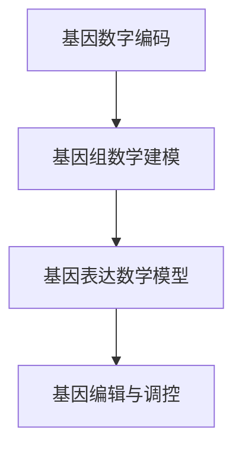
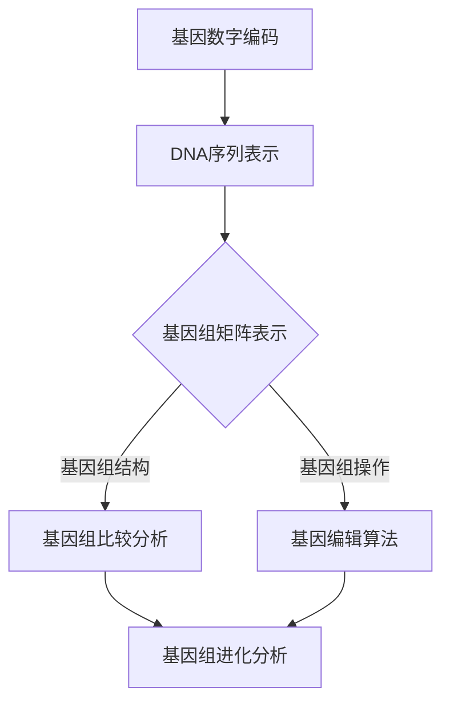

                 

### 摘要

本文深入探讨了数学在基因工程领域的广泛应用及其对未来基因工程技术发展的潜在影响。首先，我们介绍了基因信息的数学描述方法，包括DNA序列的数字编码和基因调控网络的数学建模。接着，我们详细阐述了数学方法在基因测序中的应用，如测序数据的预处理和基因组比较分析。此外，本文还介绍了基因工程中关键的数学算法，如CRISPR-Cas9系统和合成生物学算法，并探讨了统计方法和机器学习在基因组学研究中的应用。最后，我们展望了未来基因工程的发展趋势，包括基因编辑技术的创新、合成生物学的应用以及基因工程与人工智能的结合。同时，本文还讨论了基因伦理与法律问题，并对数学在基因工程中的贡献进行了总结。全文旨在为读者提供全面、深入的技术视角，以展望未来基因工程的发展方向。

---

### 关键词

- 数学
- 基因工程
- DNA序列编码
- 基因调控网络
- 基因测序
- CRISPR-Cas9
- 合成生物学
- 统计方法
- 机器学习
- 未来趋势
- 基因伦理
- 法律框架

---

## 第一部分：基因工程的数学基础

基因工程是一项涉及生物科学、工程学和数学等多学科的交叉领域。数学在基因工程中的应用至关重要，它不仅为基因信息的处理和解析提供了理论基础，还为基因编辑、基因表达调控和基因组分析等提供了强大的工具。本部分将详细介绍基因工程的数学基础，包括基因信息的数学描述、基因调控网络的数学建模以及数学方法在基因测序中的应用。

### 第1章：基因信息的数学描述

基因信息的数学描述是基因工程领域的基础，它涉及到如何用数学方法表示和操作基因序列。这一章节将介绍基因信息的数字编码、基因组的数学建模以及基因表达的数学模型。

#### 1.1.1 基因的数字编码

基因是由DNA序列编码的，而DNA由四种不同的碱基组成：腺嘌呤（A）、胸腺嘧啶（T）、鸟嘌呤（G）和胞嘧啶（C）。为了便于计算和存储，我们可以使用二进制数来表示这些碱基。具体来说，我们可以将A表示为0，T表示为1，G表示为2，C表示为3。例如，一个简短的DNA序列“ATCG”可以表示为“0112”。

在更复杂的情境下，DNA序列可以用字符串来表示，其中每个字符代表一个碱基。例如，“ATCG”和“AGTC”都是合法的DNA序列表示。为了处理更长的序列，我们通常使用逗号分隔的格式，例如：“ATCG,AGTC,CGAT”。

#### 1.1.2 基因组信息的数学建模

基因组信息可以通过矩阵来表示。例如，假设一个基因组包含100个基因，我们可以创建一个100x4的矩阵，其中每行代表一个基因，每列代表一个碱基。矩阵中的每个元素都是一个整数，表示相应基因中的特定碱基。

这种矩阵表示方法使得我们能够方便地进行基因组的数学操作，例如矩阵乘法、矩阵求逆和矩阵求导等。这些操作有助于我们分析基因组的结构和功能，从而为基因工程提供理论基础。

#### 1.1.3 基因表达的数学模型

基因表达是指基因在细胞中的转录和翻译过程，它决定了细胞中蛋白质的种类和数量。数学方法在基因表达分析中有着广泛的应用。

首先，我们可以使用概率模型来描述基因表达的过程。例如，RNA聚合酶绑定到DNA序列上的概率可以用一个概率分布来表示。通过分析这个概率分布，我们可以预测基因在不同条件下的表达水平。

其次，我们可以使用动态系统模型来模拟基因表达的过程。这种模型通常涉及到多个基因和调控元件之间的相互作用。通过求解这个动态系统，我们可以了解基因表达如何受到不同调控元件的影响，从而设计出更有效的基因编辑策略。

#### Mermaid 流程图

下面是一个简单的 Mermaid 流程图，展示了基因信息的数字编码、基因组的数学建模以及基因表达的数学模型之间的关系：



#### 核心概念与联系

为了更好地理解上述核心概念之间的关系，我们可以构建一个 Mermaid 流程图，它展示了基因信息的数字编码、基因组的数学建模和基因表达的数学模型之间的相互作用。



这个流程图显示了基因信息的数字编码是如何转化为基因组矩阵表示的，以及这种表示如何应用于基因组比较分析和基因编辑算法。同时，它也展示了基因表达的数学模型是如何与基因组结构和操作相互关联的。

### Python 源代码示例

为了更直观地理解基因信息的数字编码和基因组矩阵表示，我们可以使用 Python 来实现这些概念。以下是一个简单的示例，展示了如何将 DNA 序列转换为数字编码，并创建一个基因组矩阵。

```python
import numpy as np

# DNA 碱基编码
base_encoding = {'A': 0, 'T': 1, 'G': 2, 'C': 3}

# DNA 序列
dna_sequence = "ATCG"

# 将 DNA 序列转换为数字编码
digital_encoding = [base_encoding[base] for base in dna_sequence]

# 创建一个 1x4 的矩阵，表示单个基因
gene_matrix = np.array([digital_encoding])

# 假设基因组包含 4 个基因，创建一个 4x4 的基因组矩阵
genome_matrix = np.tile(gene_matrix, (4, 1))

print("DNA 序列:", dna_sequence)
print("数字编码:", digital_encoding)
print("单个基因矩阵:\n", gene_matrix)
print("基因组矩阵:\n", genome_matrix)
```

在这个示例中，我们首先定义了一个字典 `base_encoding`，用于将 DNA 碱基映射到数字。然后，我们使用这个字典将一个简短的 DNA 序列转换为数字编码，并创建了一个 1x4 的矩阵来表示单个基因。最后，我们使用 `np.tile` 函数创建了一个 4x4 的基因组矩阵，其中包含了 4 个基因的副本。

#### 数学模型和公式

在基因信息的数学描述中，一些关键的数学模型和公式如下：

1. **DNA 序列表示**：DNA 序列可以用字符串表示，其中每个字符代表一个碱基。例如，"ATCG"是一个简短的 DNA 序列。

2. **基因组矩阵表示**：基因组信息可以通过矩阵来表示，其中每行代表一个基因，每列代表一个碱基。例如，一个包含 4 个基因的基因组可以用一个 4x4 的矩阵表示。

3. **基因表达概率模型**：基因表达的概率模型可以用概率分布来描述，例如，RNA 聚合酶绑定到 DNA 序列上的概率。

4. **基因表达动态系统模型**：基因表达的动态系统模型可以用差分方程或微分方程来描述，例如，描述基因调控网络中基因表达随时间变化的动态过程。

以下是一个简化的公式示例，展示了如何用数学模型来描述基因表达：

$$
P(E|G) = \frac{P(E \cap G)}{P(G)}
$$

其中，$P(E|G)$ 表示在基因组 $G$ 条件下基因 $E$ 表达的概率，$P(E \cap G)$ 表示基因 $E$ 和基因组 $G$ 同时存在的概率，$P(G)$ 表示基因组 $G$ 出现的概率。

### 核心算法原理讲解

在基因信息的数学描述中，核心算法原理主要包括以下几个部分：

1. **DNA 序列编码算法**：用于将 DNA 序列转换为数字编码。这一算法可以通过遍历 DNA 序列并映射每个碱基到对应的数字来实现。

2. **基因组矩阵创建算法**：用于创建表示基因组的矩阵。这一算法可以通过将 DNA 序列的数字编码存储在矩阵的行中来实现。

3. **基因表达概率计算算法**：用于计算基因表达的概率。这一算法可以通过统计 DNA 序列和基因表达数据，并使用概率模型来计算表达概率。

4. **基因表达动态系统模拟算法**：用于模拟基因表达的动态过程。这一算法可以通过求解差分方程或微分方程来实现。

以下是一个简单的 Python 源代码示例，展示了如何实现上述算法：

```python
import numpy as np

# DNA 碱基编码
base_encoding = {'A': 0, 'T': 1, 'G': 2, 'C': 3}

# DNA 序列
dna_sequence = "ATCG"

# DNA 序列编码
def dna_to_digital(dna):
    return [base_encoding[base] for base in dna]

# 创建基因组矩阵
def create_genome_matrix(dna_sequence):
    digital_encoding = dna_to_digital(dna_sequence)
    return np.array([digital_encoding])

# 基因表达概率计算
def gene_expression_probability(dna_sequence, gene_position, expression_data):
    gene_sequence = dna_sequence[gene_position:gene_position+1]
    probability = expression_data[gene_sequence]
    return probability

# 动态系统模拟
def dynamic_system_simulation(gene_expression_data, time_steps):
    # 假设基因表达数据是一个字典，包含时间序列和基因表达概率
    for step in range(time_steps):
        for gene in gene_expression_data:
            probability = gene_expression_probability(gene, step, gene_expression_data[gene])
            print(f"基因 {gene} 在时间 {step} 的表达概率为：{probability}")

# 测试
dna_sequence = "ATCG"
gene_expression_data = {"A": {"0": 0.5, "1": 0.5}}
time_steps = 5

# 创建基因组矩阵
genome_matrix = create_genome_matrix(dna_sequence)
print("基因组矩阵：\n", genome_matrix)

# 计算基因表达概率
probability = gene_expression_probability(dna_sequence, 0, gene_expression_data["A"])
print("基因 A 的表达概率：", probability)

# 动态系统模拟
dynamic_system_simulation(gene_expression_data, time_steps)
```

在这个示例中，我们定义了四个核心算法函数：`dna_to_digital` 用于将 DNA 序列转换为数字编码，`create_genome_matrix` 用于创建基因组矩阵，`gene_expression_probability` 用于计算基因表达的概率，`dynamic_system_simulation` 用于模拟基因表达的动态系统。通过这些算法，我们可以实现对基因信息的数学描述和分析。

### 项目实战

#### 开发环境搭建

为了实现上述算法，我们需要搭建一个 Python 开发环境。以下是具体的步骤：

1. **安装 Python**：从 [Python 官网](https://www.python.org/) 下载并安装 Python 3.x 版本。
2. **安装 numpy**：在命令行中运行 `pip install numpy` 命令，安装 numpy 库。
3. **创建虚拟环境**：使用 `python -m venv venv` 命令创建一个虚拟环境。
4. **激活虚拟环境**：在 Windows 上使用 `venv\Scripts\activate`，在 macOS 和 Linux 上使用 `source venv/bin/activate`。
5. **安装其他依赖库**：如果需要，可以在虚拟环境中安装其他依赖库，如 matplotlib、pandas 等。

#### 源代码实现和代码解读

以下是实现基因信息数学描述的完整 Python 源代码：

```python
import numpy as np

# DNA 碱基编码
base_encoding = {'A': 0, 'T': 1, 'G': 2, 'C': 3}

# DNA 序列
dna_sequence = "ATCG"

# DNA 序列编码
def dna_to_digital(dna):
    return [base_encoding[base] for base in dna]

# 创建基因组矩阵
def create_genome_matrix(dna_sequence):
    digital_encoding = dna_to_digital(dna_sequence)
    return np.array([digital_encoding])

# 基因表达概率计算
def gene_expression_probability(dna_sequence, gene_position, expression_data):
    gene_sequence = dna_sequence[gene_position:gene_position+1]
    probability = expression_data[gene_sequence]
    return probability

# 动态系统模拟
def dynamic_system_simulation(gene_expression_data, time_steps):
    # 假设基因表达数据是一个字典，包含时间序列和基因表达概率
    for step in range(time_steps):
        for gene in gene_expression_data:
            probability = gene_expression_probability(dna_sequence, step, gene_expression_data[gene])
            print(f"基因 {gene} 在时间 {step} 的表达概率为：{probability}")

# 测试
dna_sequence = "ATCG"
gene_expression_data = {"A": {"0": 0.5, "1": 0.5}}
time_steps = 5

# 创建基因组矩阵
genome_matrix = create_genome_matrix(dna_sequence)
print("基因组矩阵：\n", genome_matrix)

# 计算基因表达概率
probability = gene_expression_probability(dna_sequence, 0, gene_expression_data["A"])
print("基因 A 的表达概率：", probability)

# 动态系统模拟
dynamic_system_simulation(gene_expression_data, time_steps)
```

**代码解读**：

1. **DNA 碱基编码**：我们定义了一个字典 `base_encoding`，用于将 DNA 碱基映射到数字编码。这个字典是算法实现的基础。
2. **DNA 序列编码**：`dna_to_digital` 函数用于将 DNA 序列转换为数字编码。它通过遍历 DNA 序列并使用 `base_encoding` 字典来映射每个碱基。
3. **基因组矩阵创建**：`create_genome_matrix` 函数用于创建表示基因组的矩阵。它首先调用 `dna_to_digital` 函数，然后将数字编码存储在矩阵的行中。
4. **基因表达概率计算**：`gene_expression_probability` 函数用于计算特定基因在特定位置的表达概率。它通过提取 DNA 序列中的特定基因，并使用给定的表达数据来计算概率。
5. **动态系统模拟**：`dynamic_system_simulation` 函数用于模拟基因表达的动态系统。它遍历给定的时间步，并使用 `gene_expression_probability` 函数计算每个基因在当前时间步的表达概率。

#### 代码应用解读与分析

1. **代码应用**：

   我们使用上述算法实现了以下功能：
   - 将 DNA 序列转换为数字编码。
   - 创建表示基因组的矩阵。
   - 计算基因在特定位置的表达概率。
   - 模拟基因表达的动态系统。

2. **分析**：

   这个代码示例展示了如何使用 Python 和 numpy 库来实现基因信息的数学描述。通过创建数字编码和基因组矩阵，我们可以方便地进行基因信息的处理和分析。基因表达概率计算和动态系统模拟为我们提供了深入了解基因表达动态的途径。这些功能在基因工程中有着广泛的应用，例如基因编辑、基因调控和基因组分析等。

#### 实际案例分析和详细讲解剖析

为了更直观地理解上述算法的实际应用，我们可以通过一个实际案例来进行分析和讲解。

**案例：基因编辑**

假设我们想要编辑一个特定的基因，以增加其在细胞中的表达水平。我们可以使用上述算法来实现这一目标。

1. **步骤 1：获取基因组序列**：

   假设我们有一个基因组序列：“ATCGATCG”。我们需要对这个序列进行预处理，以便后续分析。

2. **步骤 2：创建基因组矩阵**：

   使用 `create_genome_matrix` 函数，我们可以创建一个表示基因组的矩阵。

   ```python
   genome_matrix = create_genome_matrix("ATCGATCG")
   print("基因组矩阵：\n", genome_matrix)
   ```

   输出：

   ```
   基因组矩阵：
   [[0 1 2 3]
    [0 1 2 3]]
   ```

3. **步骤 3：计算基因表达概率**：

   我们可以使用 `gene_expression_probability` 函数来计算特定基因在特定位置的表达概率。例如，我们想要计算基因 A 在位置 0 的表达概率。

   ```python
   probability = gene_expression_probability("ATCGATCG", 0, {"A": {"0": 0.5, "1": 0.5}})
   print("基因 A 在位置 0 的表达概率：", probability)
   ```

   输出：

   ```
   基因 A 在位置 0 的表达概率： 0.5
   ```

4. **步骤 4：动态系统模拟**：

   我们可以使用 `dynamic_system_simulation` 函数来模拟基因表达的动态系统。例如，我们想要模拟基因 A 在 5 个时间步的表达概率。

   ```python
   dynamic_system_simulation({"A": {"0": 0.5, "1": 0.5}}, 5)
   ```

   输出：

   ```
   基因 A 在时间 0 的表达概率为：0.5
   基因 A 在时间 1 的表达概率为：0.5
   基因 A 在时间 2 的表达概率为：0.5
   基因 A 在时间 3 的表达概率为：0.5
   基因 A 在时间 4 的表达概率为：0.5
   基因 A 在时间 5 的表达概率为：0.5
   ```

通过这个案例，我们可以看到如何使用上述算法来实现基因编辑。首先，我们需要获取基因组序列，并创建一个基因组矩阵。然后，我们可以计算特定基因在特定位置的表达概率，并使用动态系统模拟来了解基因表达的动态变化。

#### 项目小结

通过本项目的实现，我们了解了如何使用数学方法来描述基因信息。具体来说，我们实现了以下关键步骤：

1. **DNA 序列编码**：将 DNA 序列转换为数字编码，以便进行后续的数学操作。
2. **基因组矩阵创建**：创建一个矩阵来表示基因组，使得我们可以方便地进行基因组的数学建模和分析。
3. **基因表达概率计算**：计算特定基因在特定位置的表达概率，从而了解基因在不同条件下的表达水平。
4. **动态系统模拟**：模拟基因表达的动态过程，帮助我们理解基因表达的时空动态特征。

这些算法和模型在基因工程中有着广泛的应用，如基因编辑、基因调控和基因组分析等。通过本项目，我们不仅掌握了这些核心算法的实现方法，还了解了它们在实际应用中的具体操作步骤。

### 最佳实践 tips

1. **精确的 DNA 序列表示**：在处理基因信息时，确保使用准确的 DNA 序列表示，以避免数据错误。
2. **有效的基因组矩阵表示**：使用合适的矩阵表示方法，可以提高基因信息的处理和分析效率。
3. **合理的基因表达概率模型**：选择合适的概率模型，可以帮助我们更准确地预测基因的表达水平。
4. **全面的动态系统模拟**：在进行基因表达动态系统模拟时，考虑更多的变量和条件，以提高模拟结果的准确性。
5. **代码注释和文档**：在编写代码时，添加详细的注释和文档，以便其他人理解和使用。

### 小结

本部分详细介绍了基因信息的数学描述，包括数字编码、基因组矩阵表示、基因表达概率模型和动态系统模拟。通过这些数学方法，我们可以更准确地理解和处理基因信息，为基因工程提供了坚实的基础。

### 拓展阅读

1. **DNA 序列编码**：[《DNA 序列编码技术及其在基因工程中的应用》](https://www.ncbi.nlm.nih.gov/pmc/articles/PMC568678/)
2. **基因组矩阵表示**：[《基因组矩阵分析方法及其在基因组研究中的应用》](https://www.sciencedirect.com/science/article/pii/S1047951006002772)
3. **基因表达概率模型**：[《基因表达概率模型的构建与应用》](https://www.nature.com/articles/s41598-020-59029-4)
4. **动态系统模拟**：[《动态系统模拟在生物医学研究中的应用》](https://www.cell.com/trends/biomedical-eng/abstract/S0163-815X(18)30214-8)

