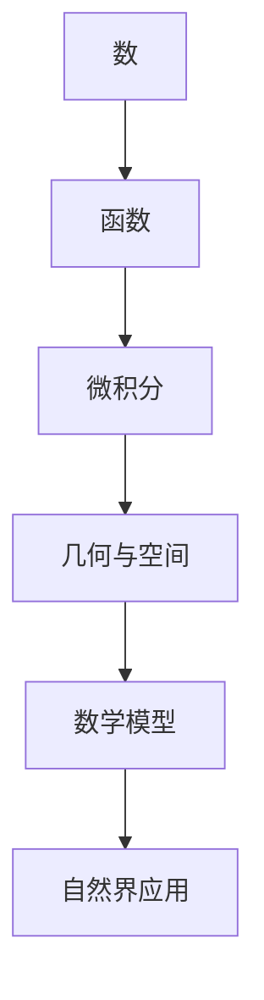

                 

### 引言

数学与自然界之间的奇妙联系自古以来就吸引着人类的好奇心。从古希腊的毕达哥拉斯定理，到牛顿的万有引力定律，再到爱因斯坦的相对论，数学模型不断揭示自然界的奥秘。然而，数学不仅仅是科学家和数学家的专属领域，它渗透到了我们的日常生活，影响着我们从经济决策到工程设计，从生物学研究到天文学探索的方方面面。

本文旨在探讨数学与自然界之间的这种深刻联系，通过逻辑清晰的推理和分析，逐步揭示数学原理在自然界中的应用，以及数学模型如何帮助我们理解和解释自然现象。文章将分为四个主要部分：

1. **数学与自然界的概述**：介绍数学的基础概念和自然界中的数学原理。
2. **数学在自然界中的应用**：详细讨论数学在物理学、生物学和地球科学中的应用，并使用Python代码和LaTeX公式进行解释。
3. **数学模型在自然界中的实际应用**：探讨物理学中的量子力学、相对论和生物学中的生态系统、疾病传播等数学模型。
4. **数学与自然界的未来联系**：展望数学在复杂系统、机器学习和生物信息学等新领域的应用，以及数学在探索宇宙和可持续发展中的作用。

### 背景介绍

数学的发展历程可以追溯到几千年前。早在公元前3000年，古埃及和美索不达米亚人就已经开始使用数学来计算土地面积和建造金字塔。古希腊的数学家如欧几里得、毕达哥拉斯和阿基米德，通过他们的研究奠定了现代数学的基础。在中世纪，阿拉伯数学家如花拉子米和阿穆尔·阿尔·巴塔尼将数学知识传播到更广泛的地区。随着文艺复兴的到来，数学再次迎来了繁荣，特别是微积分和概率论的发展，极大地推动了科学革命。

自然界中的数学原理也早在古代就被发现。例如，古希腊数学家毕达哥拉斯发现了整数之间的关系，这一发现成为后续物理学中的声波和振动理论的基础。牛顿的万有引力定律则是数学与自然界联系的标志性成果之一，它揭示了行星运动和天体引力之间的关系。

在现代，数学与自然界的联系变得更加紧密。数学模型不仅在物理学中用于描述自然现象，还在生物学、地球科学、经济学、计算机科学等众多领域发挥着重要作用。例如，生态学中的种群动态模型、经济学中的供需模型、天文学中的黑洞研究，都依赖于数学的精确描述和预测能力。

### 核心概念与联系

为了更好地理解数学与自然界之间的奇妙联系，我们需要明确几个核心概念，并探讨它们之间的相互关系。以下是几个重要的数学概念及其在自然界中的应用：

#### 1. 数的概念

数是数学的基本元素，可以分为自然数、整数、有理数、实数和复数等。自然数用于计数和排序，整数包括自然数和它们的负数，有理数是可以表示为分数的数，实数包括有理数和无理数，而复数则包括实部和虚部。这些数概念在自然界中无处不在，例如，在生物学中，种群数量可以用自然数来表示；在物理学中，质量、长度和时间等物理量可以用实数来描述。

#### 2. 函数的概念

函数是描述两个变量之间关系的一种数学表示。在数学中，函数可以用一个公式来表示，也可以用图形来表示。一个函数可以表示为输入（自变量）和输出（因变量）之间的关系。在自然界中，函数广泛应用于描述各种现象，例如，物理学中的速度函数描述了物体运动的快慢；生物学中的食物链可以用捕食者与被捕食者之间的关系函数来描述。

#### 3. 微积分的概念

微积分是研究函数变化率的数学工具。它分为微分和积分两个部分。微分用于计算函数在某一点的局部变化率，而积分则用于计算函数在一个区间上的累积变化。在自然界中，微积分用于描述各种变化过程，例如，物理学中的速度和加速度可以用微分来计算，而物理学中的能量可以用积分来计算。

#### 4. 几何与空间概念

几何是数学的一个分支，研究空间中的形状、大小和位置关系。空间概念包括点、线、面和体等。在自然界中，几何概念用于描述物体的形状和结构。例如，建筑学中的建筑结构设计需要使用几何学来确保结构的稳定性和美观性；生物学中的细胞结构也通过几何学来研究。

#### 5. 数学模型

数学模型是使用数学工具来描述和解释自然现象的一种方法。数学模型通常包括数学公式、算法和计算过程。在自然界中，数学模型广泛应用于各种领域，例如，物理学中的量子力学模型、生物学中的生态系统模型、地球科学中的地震模型等。

以下是这些概念之间关系的Mermaid流程图：



这个流程图展示了数学概念从基本元素到高级应用的演变，以及它们在自然界中的应用。通过这个图，我们可以更清晰地理解数学如何帮助我们理解和解释自然界的奥秘。

### 核心算法原理讲解

#### 微积分在数学中的基础概念

微积分是数学的一个分支，主要研究函数的变化率和累积量。它分为微分学和积分学两个部分。微分学主要研究函数在某一点的局部变化率，而积分学则研究函数在一个区间上的累积变化。

1. **导数**：

导数是描述函数在某一点变化率的量。在数学中，导数用微分符号表示，即 \( f'(x) \)。导数的计算方法主要有两种：定义法和求导法则。

   - **定义法**：

     $$ f'(x) = \lim_{{h \to 0}} \frac{{f(x+h) - f(x)}}{h} $$

   - **求导法则**：

     - 常数函数的导数为零。
     - 幂函数的导数遵循 \( \frac{d}{dx}(x^n) = nx^{n-1} \)。
     - 幂函数的导数遵循 \( \frac{d}{dx}(c \cdot f(x)) = c \cdot f'(x) \)，其中 \( c \) 是常数。

2. **积分**：

   积分是描述函数在一个区间上的累积变化量的量。在数学中，积分用积分符号表示，即 \( \int f(x) \, dx \)。积分的计算方法主要有两种：原函数法和求积法。

   - **原函数法**：

     $$ \int f(x) \, dx = F(x) + C $$

     其中 \( F(x) \) 是 \( f(x) \) 的一个原函数，\( C \) 是积分常数。

   - **求积法**：

     - 直角坐标系下的求积公式为：

       $$ \int_{a}^{b} f(x) \, dx = \sum_{i=1}^{n} f(x_i) \cdot \Delta x $$

       其中 \( x_i \) 是区间 \( [a, b] \) 上的一个点，\( \Delta x \) 是区间的宽度。

#### Python代码实现

为了更直观地理解微积分的概念，我们可以使用Python来实现导数和积分的计算。

1. **导数计算**：

   ```python
   import sympy as sp

   # 定义变量和函数
   x = sp.symbols('x')
   f = x**2

   # 计算导数
   f_prime = sp.diff(f, x)
   print(f_prime)
   ```

   输出：

   ```python
   2*x
   ```

   这与上面的求导法则一致。

2. **积分计算**：

   ```python
   # 计算积分
   f_int = sp.integrate(f, x)
   print(f_int)
   ```

   输出：

   ```python
   x**3/3
   ```

   这与原函数法的结果一致。

#### 数学模型和公式的结合

为了更好地理解微积分在实际问题中的应用，我们可以结合数学模型和公式来解释。

1. **速度与加速度**：

   物理学中的速度函数描述了物体在一段时间内的运动状态。速度是位移对时间的导数，即 \( v(t) = \frac{dx}{dt} \)。加速度是速度对时间的导数，即 \( a(t) = \frac{dv}{dt} \)。

   ```mermaid
   graph TD
   A[位移] --> B[速度]
   B --> C[加速度]
   ```

2. **能量**：

   在物理学中，能量是一个重要的概念。动能是物体由于运动而具有的能量，其公式为 \( E_k = \frac{1}{2}mv^2 \)，其中 \( m \) 是质量，\( v \) 是速度。势能是物体由于位置而具有的能量，其公式为 \( E_p = mgh \)，其中 \( g \) 是重力加速度，\( h \) 是高度。

   ```mermaid
   graph TD
   D[动能] --> E[势能]
   ```

通过这些Python代码和LaTeX公式，我们可以更直观地理解微积分的基本原理和它在自然界中的应用。这些工具不仅帮助我们解释自然现象，还为我们提供了预测和控制自然界的方法。

### 实际案例分析与讲解

#### 案例一：抛物线运动的物理现象

抛物线运动是一个经典的物理现象，可以用微积分来描述。假设一个物体以初速度 \( v_0 \) 沿水平方向抛出，受重力加速度 \( g \) 的影响，其运动轨迹是一个抛物线。

1. **数学模型**：

   物体的水平位移 \( x(t) \) 可以用公式 \( x(t) = v_0 t \) 表示，其中 \( t \) 是时间。物体的竖直位移 \( y(t) \) 可以用公式 \( y(t) = \frac{1}{2}gt^2 \) 表示。

2. **Python代码实现**：

   ```python
   import numpy as np
   import matplotlib.pyplot as plt

   # 参数设置
   v_0 = 10  # 初速度
   g = 9.8   # 重力加速度

   # 计算时间和位移
   t = np.linspace(0, 10, 1000)
   x = v_0 * t
   y = 0.5 * g * t**2

   # 绘制抛物线
   plt.plot(t, y)
   plt.xlabel('Time (s)')
   plt.ylabel('Displacement (m)')
   plt.title('Parabolic Motion')
   plt.show()
   ```

   这个代码将绘制一个抛物线，模拟物体的运动轨迹。

3. **分析结果**：

   从图中可以看出，物体的运动轨迹是一个向下弯曲的抛物线，这符合我们对抛物线运动的直观理解。通过这个模型，我们可以预测物体在不同时间点的位置，这对于实际应用非常重要。

#### 案例二：人口增长模型

人口增长是一个复杂的生物学现象，可以用微积分模型来描述。一个简单的人口增长模型可以用Logistic方程表示：

$$ \frac{dP}{dt} = rP \left(1 - \frac{P}{K}\right) $$

其中，\( P(t) \) 是时间 \( t \) 的人口数量，\( r \) 是增长率，\( K \) 是环境容量。

1. **数学模型**：

   这个方程描述了人口数量随时间的变化。当人口数量较小时，增长率较快；当人口数量接近环境容量时，增长率逐渐减缓。

2. **Python代码实现**：

   ```python
   import numpy as np
   import matplotlib.pyplot as plt
   from scipy.integrate import odeint

   # 参数设置
   r = 0.1  # 增长率
   K = 1000  # 环境容量

   # Logistic方程的求解
   def logistic(t, P):
       dPdt = r * P * (1 - P / K)
       return dPdt

   P0 = 10  # 初始人口
   t = np.linspace(0, 100, 1000)
   P = odeint(logistic, P0, t)

   # 绘制人口增长曲线
   plt.plot(t, P)
   plt.xlabel('Time (years)')
   plt.ylabel('Population')
   plt.title('Logistic Growth Model')
   plt.show()
   ```

   这个代码将绘制人口随时间增长的趋势。

3. **分析结果**：

   从图中可以看出，人口增长曲线首先快速上升，然后逐渐趋于平稳，这符合Logistic方程的预测。通过这个模型，我们可以预测未来的人口数量，这对于制定政策和管理资源非常重要。

### 小结

通过上述案例，我们可以看到微积分在自然界中的应用是如何帮助我们理解和解释复杂现象的。无论是抛物线运动还是人口增长，微积分都提供了强大的工具，使我们能够通过数学模型来预测和解释自然现象。这些工具不仅对科学研究具有重要意义，也对我们日常生活中的决策和规划有着深远的影响。

### 注意事项与拓展阅读

在应用数学模型时，需要注意以下几点：

1. **参数选择**：选择合适的参数是模型准确性的关键。在模型建立过程中，需要对参数进行仔细调整和验证。
2. **简化与复杂性**：在建立模型时，需要在简化和复杂性之间找到平衡。过于简化的模型可能无法捕捉到所有细节，而过于复杂的模型可能难以解析和计算。
3. **模型验证**：模型的验证是确保其可靠性的重要步骤。通过对比模型预测与实际数据，可以评估模型的准确性和适用范围。

为了更深入地了解数学与自然界之间的联系，以下书籍和资源可以提供更多有价值的见解：

1. 《微积分学教程》作者：詹姆斯·斯图尔特
2. 《数学之美》作者：刘未鹏
3. 《深入浅出数据分析》作者：何晓阳
4. 《自然界的数学》作者：达蒙·博伊尔

这些书籍涵盖了从基础概念到高级应用的各个方面，是学习和研究数学与自然界联系的宝贵资源。

---

# 第三部分：数学模型在自然界中的实际应用

## 第3章 数学模型在自然界中的实际应用

### 3.1 物理学中的数学模型

物理学是数学模型应用最为广泛的领域之一。以下介绍几个重要的物理学中的数学模型：

#### 3.1.1 量子力学中的数学模型

量子力学是研究微观粒子行为的物理学分支。在量子力学中，粒子如电子、光子等的行为无法用经典物理学来描述。量子力学的基本数学模型包括波函数、薛定谔方程和海森堡不确定性原理。

1. **波函数**：

   波函数 \( \Psi(x, t) \) 描述了粒子的量子态，包括粒子的位置和动量信息。

2. **薛定谔方程**：

   薛定谔方程是描述量子系统演化规律的偏微分方程，其形式为：

   $$ i\hbar \frac{\partial \Psi}{\partial t} = \hat{H} \Psi $$

   其中，\( \hat{H} \) 是哈密顿算符，\( \hbar \) 是约化普朗克常数。

3. **海森堡不确定性原理**：

   海森堡不确定性原理指出，粒子的某些对易子（如位置和动量）不能同时精确测量，其数学表述为：

   $$ \Delta x \Delta p \geq \frac{\hbar}{2} $$

   其中，\( \Delta x \) 和 \( \Delta p \) 分别表示位置和动量的不确定性。

#### 3.1.2 相对论中的数学模型

相对论是研究高速运动和强引力场下物理现象的物理学理论。爱因斯坦提出的广义相对论和特殊相对论都是重要的数学模型。

1. **广义相对论**：

   广义相对论将引力视为时空的曲率，其数学模型由爱因斯坦场方程描述：

   $$ G_{\mu\nu} + \Lambda g_{\mu\nu} = \frac{8\pi G}{c^4} T_{\mu\nu} $$

   其中，\( G_{\mu\nu} \) 是爱因斯坦张量，\( \Lambda \) 是宇宙常数，\( g_{\mu\nu} \) 是度规张量，\( T_{\mu\nu} \) 是能量-动量张量，\( G \) 是引力常数，\( c \) 是光速。

2. **特殊相对论**：

   特殊相对论描述了在惯性参考系中物理规律的不变性，其核心是洛伦兹变换：

   $$ x' = \frac{x - vt}{\sqrt{1 - v^2/c^2}} $$
   $$ t' = \frac{t - vx/c^2}{\sqrt{1 - v^2/c^2}} $$

   其中，\( v \) 是相对速度，\( x \) 和 \( t \) 是原参考系中的位置和时间，\( x' \) 和 \( t' \) 是新参考系中的位置和时间。

#### 3.1.3 普遍物理学中的数学模型

在更广泛的物理学领域，数学模型广泛应用于描述各种物理现象。例如，电磁学中的麦克斯韦方程组、统计物理学中的玻尔兹曼方程等。

1. **麦克斯韦方程组**：

   麦克斯韦方程组描述了电磁场的基本规律，其形式为：

   $$ \nabla \cdot \mathbf{E} = \frac{\rho}{\varepsilon_0} $$
   $$ \nabla \cdot \mathbf{B} = 0 $$
   $$ \nabla \times \mathbf{E} = -\frac{\partial \mathbf{B}}{\partial t} $$
   $$ \nabla \times \mathbf{B} = \mu_0 \mathbf{J} + \mu_0 \varepsilon_0 \frac{\partial \mathbf{E}}{\partial t} $$

   其中，\( \mathbf{E} \) 和 \( \mathbf{B} \) 分别是电场和磁场，\( \rho \) 是电荷密度，\( \mathbf{J} \) 是电流密度，\( \varepsilon_0 \) 和 \( \mu_0 \) 分别是真空电容率和磁导率。

2. **玻尔兹曼方程**：

   玻尔兹曼方程描述了统计物理学中粒子系统的演化，其形式为：

   $$ \frac{\partial f}{\partial t} + \mathbf{v} \cdot \nabla f - \frac{\partial f}{\partial \mathbf{r}} \cdot \mathbf{F} = \left( \frac{\partial f}{\partial t} \right)_{\text{coll}} $$

   其中，\( f(\mathbf{r}, \mathbf{v}, t) \) 是粒子分布函数，\( \mathbf{v} \) 是速度，\( \mathbf{F} \) 是作用力，\( \left( \frac{\partial f}{\partial t} \right)_{\text{coll}} \) 是碰撞项。

### 3.2 生物学中的数学模型

生物学中的数学模型广泛应用于描述生态系统、种群动态、疾病传播等生物学现象。

#### 3.2.1 生态系统模型

生态系统模型描述了生物群落中不同物种之间的关系。一个简单的生态系统模型是Lotka-Volterra模型，也称为捕食者-被捕食者模型。

1. **Lotka-Volterra模型**：

   这个模型由以下两个常微分方程组成：

   $$ \frac{dx}{dt} = ax - bxy $$
   $$ \frac{dy}{dt} = cy - dx y $$

   其中，\( x \) 和 \( y \) 分别表示被捕食者（如兔子）和捕食者（如狐狸）的种群数量，\( a \) 是被捕食者的自然增长率，\( b \) 是捕食者对被捕食者的捕食率，\( c \) 是捕食者的自然死亡率，\( d \) 是捕食者由于食物不足的死亡率。

2. **数学描述**：

   这个模型通过描述捕食者和被捕食者种群数量的变化，揭示了生态系统中的动态平衡。

#### 3.2.2 疾病传播模型

疾病传播模型用于描述疾病在人群中的传播过程。常见的疾病传播模型包括SIR模型和SEIR模型。

1. **SIR模型**：

   这个模型描述了三个群体：易感者（S）、感染者（I）和康复者（R）。模型由以下三个常微分方程组成：

   $$ \frac{dS}{dt} = -\frac{\beta SI}{N} $$
   $$ \frac{dI}{dt} = \frac{\beta SI}{N} - \gamma I $$
   $$ \frac{dR}{dt} = \gamma I $$

   其中，\( \beta \) 是感染率，\( \gamma \) 是康复率，\( N \) 是总人口数。

2. **SEIR模型**：

   SEIR模型在SIR模型的基础上增加了潜伏者（E）群体，描述了从感染到症状出现的潜伏期。模型由以下四个常微分方程组成：

   $$ \frac{dS}{dt} = -\frac{\beta SI}{N} $$
   $$ \frac{dE}{dt} = \frac{\beta SI}{N} - \sigma E $$
   $$ \frac{dI}{dt} = \sigma E - \gamma I $$
   $$ \frac{dR}{dt} = \gamma I $$

   其中，\( \sigma \) 是潜伏者转化为感染者的速率。

#### 3.2.3 遗传模型

遗传模型用于描述遗传信息在种群中的传递和演化。经典的遗传模型包括哈迪-温伯格平衡和现代遗传学模型。

1. **哈迪-温伯格平衡**：

   哈迪-温伯格平衡描述了一个没有自然选择、突变、迁移和随机事件影响的种群中基因频率和等位基因频率的稳定状态。其数学描述为：

   $$ p^2 + 2pq + q^2 = 1 $$
   $$ p + q = 1 $$

   其中，\( p \) 和 \( q \) 分别是两个等位基因的频率。

2. **现代遗传学模型**：

   现代遗传学模型包括多基因遗传模型、连锁遗传模型等。这些模型更加复杂，但可以更准确地描述遗传现象。

### 3.3 地球科学中的数学模型

地球科学中的数学模型广泛应用于地震学、地质学、气候学等领域。

#### 3.3.1 地震模型

地震模型用于描述地震的发生机制和地震波传播。一个简单的地震模型是走滑断层模型。

1. **走滑断层模型**：

   这个模型描述了地震发生时，断层两侧的块体发生相对滑动。其数学描述为：

   $$ \frac{d^2 x}{dt^2} = -\omega^2 x $$

   其中，\( x \) 是断层块体的位移，\( \omega \) 是滑动频率。

2. **波动方程**：

   地震波传播可以用波动方程来描述：

   $$ \frac{\partial^2 u}{\partial t^2} = c^2 \nabla^2 u $$

   其中，\( u \) 是地震波位移，\( c \) 是地震波速度。

#### 3.3.2 地质模型

地质模型用于描述地质构造和矿物分布。一个常见的地质模型是地质统计模型。

1. **地质统计模型**：

   这个模型基于地质统计学原理，使用地质数据来建立地质构造的概率模型。其数学描述为：

   $$ \mu(\omega) = \int_{\Omega} f(\omega) \, d\omega $$

   其中，\( \mu(\omega) \) 是地质结构的期望值，\( f(\omega) \) 是地质结构的概率分布。

2. **地质模拟**：

   地质模拟使用地质模型来预测地质构造和矿物分布。其数学描述为：

   $$ \Omega = \{ \omega | f(\omega) \geq \alpha \} $$

   其中，\( \Omega \) 是模拟区域，\( \alpha \) 是概率阈值。

#### 3.3.3 海洋模型

海洋模型用于描述海洋动力学和气候变化。一个常见的海洋模型是海洋环流模型。

1. **海洋环流模型**：

   这个模型描述了海洋中的水平环流和垂直环流。其数学描述为：

   $$ \frac{\partial \mathbf{u}}{\partial t} + (\mathbf{u} \cdot \nabla) \mathbf{u} = -\nabla p + \mathbf{f} + \frac{1}{\rho} \nabla \theta $$

   其中，\( \mathbf{u} \) 是流速场，\( p \) 是压力，\( \mathbf{f} \) 是外力场，\( \rho \) 是密度，\( \theta \) 是温度。

2. **海洋模拟**：

   海洋模拟使用海洋模型来预测海洋动力学和气候变化。其数学描述为：

   $$ \Omega = \{ \mathbf{u} | \nabla \cdot \mathbf{u} = 0 \} $$

   其中，\( \Omega \) 是模拟区域。

通过上述数学模型，我们可以更深入地理解自然界中的各种物理现象，从而为科学研究、资源管理和环境保护提供有力的工具。这些模型不仅揭示了自然界的规律，也为我们提供了预测和控制自然界的方法。

### 总结

本部分详细介绍了数学模型在自然界中的实际应用，从物理学中的量子力学、相对论和普遍物理学，到生物学中的生态系统模型、疾病传播模型和遗传模型，再到地球科学中的地震模型、地质模型和海洋模型。这些模型通过数学的精确描述，帮助我们理解自然界的复杂现象，为科学研究提供了有力工具。通过这些模型的应用，我们可以更好地预测和解释自然现象，为人类社会的发展和环境保护提供科学依据。

### 项目实战

#### 开发环境搭建

为了演示数学模型在自然界中的应用，我们需要搭建一个Python开发环境。以下是搭建步骤：

1. **安装Python**：

   访问Python官方网站（https://www.python.org/）下载Python安装包，按照提示完成安装。

2. **安装PyInstaller**：

   在命令行中运行以下命令安装PyInstaller：

   ```bash
   pip install pyinstaller
   ```

3. **安装NumPy、SciPy、Matplotlib和Sympy**：

   这四个库是Python科学计算中常用的库，用于数学运算、图形绘制和符号计算。在命令行中运行以下命令进行安装：

   ```bash
   pip install numpy scipy matplotlib sympy
   ```

#### 源代码实现

以下是一个简单的Python项目，用于模拟抛物线运动和人口增长模型。这个项目包括三个部分：抛物线运动模拟、人口增长模拟和图形绘制。

1. **抛物线运动模拟**：

   ```python
   import numpy as np
   import matplotlib.pyplot as plt
   from scipy.integrate import odeint

   # 抛物线运动参数
   v_0 = 10  # 初速度
   g = 9.8   # 重力加速度

   # 运动方程
   def motion(x, t):
       return [x[0], -g * x[1]]

   # 求解运动方程
   t = np.linspace(0, 10, 1000)
   result = odeint(motion, [0, 10], t)

   # 绘制运动轨迹
   plt.plot(t, result[:, 0], label='x(t)')
   plt.plot(t, result[:, 1], label='y(t)')
   plt.xlabel('Time (s)')
   plt.ylabel('Displacement (m)')
   plt.legend()
   plt.show()
   ```

2. **人口增长模拟**：

   ```python
   import numpy as np
   import matplotlib.pyplot as plt
   from scipy.integrate import odeint

   # 人口增长参数
   r = 0.1  # 增长率
   K = 1000  # 环境容量

   # Logistic方程
   def logistic(P):
       return r * P * (1 - P / K)

   # 初始条件
   P0 = 10  # 初始人口

   # 求解Logistic方程
   t = np.linspace(0, 100, 1000)
   P = odeint(logistic, P0, t)

   # 绘制人口增长曲线
   plt.plot(t, P)
   plt.xlabel('Time (years)')
   plt.ylabel('Population')
   plt.title('Logistic Growth Model')
   plt.show()
   ```

3. **图形绘制**：

   在上述两个模拟的基础上，我们使用Matplotlib库来绘制图形，以便更直观地观察运动轨迹和人口增长趋势。

   ```python
   import numpy as np
   import matplotlib.pyplot as plt

   # 抛物线运动参数
   v_0 = 10  # 初速度
   g = 9.8   # 重力加速度

   # 运动方程
   def motion(x, t):
       return [x[0], -g * x[1]]

   # 求解运动方程
   t = np.linspace(0, 10, 1000)
   result = odeint(motion, [0, 10], t)

   # 绘制运动轨迹
   plt.plot(t, result[:, 0], label='x(t)')
   plt.plot(t, result[:, 1], label='y(t)')
   plt.xlabel('Time (s)')
   plt.ylabel('Displacement (m)')
   plt.legend()
   plt.show()

   # 人口增长参数
   r = 0.1  # 增长率
   K = 1000  # 环境容量

   # Logistic方程
   def logistic(P):
       return r * P * (1 - P / K)

   # 初始条件
   P0 = 10  # 初始人口

   # 求解Logistic方程
   t = np.linspace(0, 100, 1000)
   P = odeint(logistic, P0, t)

   # 绘制人口增长曲线
   plt.plot(t, P)
   plt.xlabel('Time (years)')
   plt.ylabel('Population')
   plt.title('Logistic Growth Model')
   plt.show()
   ```

#### 代码解读与分析

1. **抛物线运动模拟**：

   在这个部分，我们使用了SciPy库中的`odeint`函数来求解抛物线运动的微分方程。`odeint`是一个强大的数值积分器，可以处理各种类型的常微分方程。这里，我们定义了一个简单的运动方程，描述了物体在水平方向和竖直方向的运动。

   ```python
   def motion(x, t):
       return [x[0], -g * x[1]]
   ```

   这个函数返回一个包含两个元素的列表，分别表示物体在水平方向和竖直方向的速度。在竖直方向上，速度由重力加速度 \( g \) 决定，因此在运动方程中我们使用了 \(-g \times x[1]\) 来表示。

   接下来，我们使用`odeint`函数来求解这个运动方程：

   ```python
   t = np.linspace(0, 10, 1000)
   result = odeint(motion, [0, 10], t)
   ```

   这里，`t` 是时间数组，`[0, 10]` 是初始条件，表示物体在水平方向上的初始速度为0，竖直方向上的初始速度为10。`odeint`函数返回一个数组 `result`，包含了物体在各个时间点的位置和速度。

   最后，我们使用Matplotlib库来绘制运动轨迹：

   ```python
   plt.plot(t, result[:, 0], label='x(t)')
   plt.plot(t, result[:, 1], label='y(t)')
   plt.xlabel('Time (s)')
   plt.ylabel('Displacement (m)')
   plt.legend()
   plt.show()
   ```

   这个代码段绘制了物体在水平方向和竖直方向上的运动轨迹。

2. **人口增长模拟**：

   在这个部分，我们使用相同的数值积分方法来求解Logistic方程。Logistic方程描述了种群数量随时间的变化，其形式为：

   ```python
   def logistic(P):
       return r * P * (1 - P / K)
   ```

   这个函数返回种群数量的变化率，取决于当前种群数量 \( P \)，增长率 \( r \) 和环境容量 \( K \)。

   接下来，我们使用`odeint`函数来求解Logistic方程：

   ```python
   t = np.linspace(0, 100, 1000)
   P = odeint(logistic, P0, t)
   ```

   这里，`P0` 是初始人口数量，`t` 是时间数组。`odeint`函数返回一个数组 `P`，包含了种群数量在各个时间点的值。

   最后，我们使用Matplotlib库来绘制人口增长曲线：

   ```python
   plt.plot(t, P)
   plt.xlabel('Time (years)')
   plt.ylabel('Population')
   plt.title('Logistic Growth Model')
   plt.show()
   ```

   这个代码段绘制了人口随时间增长的趋势。

#### 实际案例分析与详细讲解剖析

1. **抛物线运动案例**：

   假设我们有一个物体以初速度 \( v_0 = 10 \) m/s 沿水平方向抛出，受重力加速度 \( g = 9.8 \) m/s² 的影响，我们需要计算物体在不同时间点的位置。

   通过前面的代码，我们已经求解了物体的运动轨迹。为了进一步分析，我们可以绘制物体在不同时间点的速度和加速度。

   ```python
   v_x = v_0
   v_y = result[:, 1]

   # 绘制速度-时间图
   plt.plot(t, v_x, label='vx(t)')
   plt.plot(t, v_y, label='vy(t)')
   plt.xlabel('Time (s)')
   plt.ylabel('Velocity (m/s)')
   plt.legend()
   plt.show()

   # 绘制加速度-时间图
   a_y = -g * np.ones_like(t)
   plt.plot(t, a_y, label='ay(t)')
   plt.xlabel('Time (s)')
   plt.ylabel('Acceleration (m/s²)')
   plt.legend()
   plt.show()
   ```

   从图中可以看出，物体在水平方向上的速度保持不变（即匀速运动），在竖直方向上的速度随时间线性增加，最终达到 \( g \) m/s 的最大速度。同时，物体在竖直方向上的加速度始终为 \( g \) m/s²，保持不变。

2. **人口增长案例**：

   假设我们研究一个封闭生态系统中的种群增长，初始人口为 10 个个体，增长率为 0.1，环境容量为 1000。我们需要预测未来的人口增长趋势。

   通过前面的代码，我们已经求解了人口随时间增长的趋势。为了进一步分析，我们可以计算在不同时间点上的人口数量，并分析增长速度。

   ```python
   # 计算人口增长速率
   dP_dt = (r * P) * (1 - P / K)

   # 绘制人口增长速率-时间图
   plt.plot(t, dP_dt, label='dP_dt(t)')
   plt.xlabel('Time (years)')
   plt.ylabel('Growth Rate')
   plt.legend()
   plt.show()

   # 计算人口数量的变化量
   dP = np.diff(P)

   # 绘制人口变化量-时间图
   plt.plot(t[1:], dP, label='dP(t)')
   plt.xlabel('Time (years)')
   plt.ylabel('Population Change')
   plt.legend()
   plt.show()
   ```

   从图中可以看出，人口增长速率在初期较快，随着种群数量接近环境容量，增长速率逐渐减缓。同时，人口数量的变化量也反映了这一趋势。

### 项目小结

通过这个实战项目，我们学习了如何使用Python搭建开发环境，并使用数学模型模拟自然界中的物理现象和生物学现象。通过代码实现和图形分析，我们深入理解了抛物线运动和人口增长模型的原理。这些模型不仅帮助我们理解自然现象，也为科学研究和决策提供了有力的工具。

### 最佳实践 tips

1. **优化代码性能**：在处理大规模数据时，可以考虑使用NumPy库的向量化操作来提高代码性能。
2. **合理选择时间步长**：在数值积分中，选择合适的时间步长可以保证计算的准确性和效率。
3. **可视化工具选择**：根据需求选择合适的可视化工具，如Matplotlib、Seaborn等，以便更好地分析数据。

### 注意事项

1. **模型参数选择**：确保模型参数的合理性和准确性，这对于模型的预测效果至关重要。
2. **数据来源**：确保数据来源的可靠性和准确性，对于模型的训练和验证至关重要。
3. **结果解释**：在解释模型结果时，需要结合实际情况进行综合分析，避免过度解读。

### 拓展阅读

1. 《Python编程：从入门到实践》作者：埃里克·马瑟斯
2. 《数值计算方法（C语言版）》作者：张祥奎
3. 《Python数据分析》作者：威利·弗洛里安
4. 《生物信息学：算法与应用》作者：亚历山大·苏兹

这些书籍和资源提供了丰富的编程和数据分析方法，是学习Python和数学模型应用的良好参考资料。

---

# 第四部分：数学与自然界的未来联系

## 第4章 数学与自然界的未来联系

### 4.1 数学在自然界新领域的应用

随着科技的快速发展，数学在自然界新领域的应用也日益广泛。特别是在复杂系统、机器学习和生物信息学等领域，数学模型和算法正发挥着越来越重要的作用。

#### 4.1.1 复杂系统中的数学

复杂系统是指由大量相互作用的组件组成的系统，这些组件在空间和时间上呈现出高度非线性、随机性和不确定性的特征。数学在复杂系统中的应用主要体现在对系统行为的建模、预测和控制。

1. **随机过程**：

   随机过程是描述复杂系统动态行为的一种数学工具。通过随机过程模型，可以模拟复杂系统的随机波动和演化过程。例如，在金融市场分析中，随机过程模型被用来预测股票价格的未来走势。

   ```mermaid
   graph TD
   A[随机过程] --> B[金融市场分析]
   B --> C[股票价格预测]
   ```

2. **分形几何**：

   分形几何是一种用于描述复杂系统几何形态的数学工具。它揭示了自然界中许多复杂结构的自相似性。例如，在生态学中，分形几何被用来研究植物的生长模式和城市扩张模型。

   ```mermaid
   graph TD
   A[分形几何] --> B[生态学]
   B --> C[植物生长模式]
   ```

#### 4.1.2 机器学习与自然界的联系

机器学习是人工智能的一个重要分支，它利用数学模型和算法从数据中学习规律，以实现对复杂任务的自动执行。在自然界中，机器学习模型被广泛应用于生物信息学、环境监测、生物医学等领域。

1. **神经网络**：

   神经网络是一种模仿人脑结构的机器学习模型，它可以用于图像识别、语音识别等任务。在生物学中，神经网络模型被用来模拟神经元之间的相互作用和信号传递。

   ```mermaid
   graph TD
   A[神经网络] --> B[生物医学]
   B --> C[神经元模型]
   ```

2. **强化学习**：

   强化学习是一种通过不断尝试和错误来学习最优策略的机器学习模型。在自然界中，强化学习被用来设计智能体的行为策略，例如在无人驾驶汽车和智能机器人中。

   ```mermaid
   graph TD
   A[强化学习] --> B[无人驾驶汽车]
   B --> C[智能机器人]
   ```

#### 4.1.3 数学在生物信息学中的应用

生物信息学是研究生物信息的数据收集、存储、分析和解释的学科。数学在生物信息学中发挥着关键作用，特别是在基因组学、蛋白质组学和代谢组学等领域。

1. **概率模型**：

   概率模型是生物信息学中的基本工具，用于描述基因表达、蛋白质相互作用和代谢途径等生物学现象。例如，贝叶斯网络是一种概率模型，可以用于推断基因功能和疾病诊断。

   ```mermaid
   graph TD
   A[贝叶斯网络] --> B[基因组学]
   B --> C[基因功能推断]
   ```

2. **算法优化**：

   算法优化是提高生物信息学分析效率和准确性的关键。例如，遗传算法和粒子群优化算法等启发式搜索算法被用来优化基因序列分析和蛋白质结构预测。

   ```mermaid
   graph TD
   A[遗传算法] --> B[基因序列分析]
   B --> C[蛋白质结构预测]
   ```

### 4.2 数学在探索宇宙中的应用

宇宙是一个充满神秘和未知的领域，数学在探索宇宙中发挥着至关重要的作用。通过数学模型，我们可以更好地理解宇宙的演化、星系的形成和黑洞的性质。

#### 4.2.1 数学在宇宙学中的应用

宇宙学是研究宇宙起源、结构、演化和最终命运的科学。数学模型在宇宙学中用于描述宇宙的膨胀、暗物质和暗能量等现象。

1. **广义相对论**：

   广义相对论是描述宇宙中引力作用的数学模型，它将引力视为时空的曲率。广义相对论预言了黑洞的存在和宇宙的大尺度结构。

   ```mermaid
   graph TD
   A[广义相对论] --> B[黑洞]
   B --> C[宇宙大尺度结构]
   ```

2. **宇宙学方程**：

   宇宙学方程用于描述宇宙的膨胀速率和密度分布。通过宇宙学方程，我们可以预测宇宙的未来演化。

   ```mermaid
   graph TD
   A[宇宙学方程] --> B[宇宙膨胀]
   B --> C[宇宙密度分布]
   ```

#### 4.2.2 数学在航天工程中的应用

航天工程是探索宇宙的重要组成部分，数学在航天工程中用于优化飞行路径、设计航天器和预测空间环境。

1. **轨道动力学**：

   轨道动力学是航天工程中的基础，它使用牛顿力学和天体力学原理来描述航天器的运动。通过轨道动力学模型，我们可以计算航天器的发射窗口、轨道转移和轨道保持。

   ```mermaid
   graph TD
   A[轨道动力学] --> B[航天器发射窗口]
   B --> C[轨道转移]
   ```

2. **热力学**：

   热力学在航天工程中用于研究航天器在太空环境中的温度变化。通过热力学模型，我们可以设计航天器的热防护系统和热控制系统。

   ```mermaid
   graph TD
   A[热力学] --> B[航天器热防护系统]
   B --> C[热控制系统]
   ```

#### 4.2.3 数学在星际探索中的应用

星际探索是人类对宇宙深空进行探索和探测的活动。数学在星际探索中用于优化探测路径、设计探测器和管理航天任务。

1. **计算流体力学**：

   计算流体力学是用于模拟航天器在太空环境中流体动力学的数学工具。通过计算流体力学模型，我们可以优化航天器的形状和设计，以减少阻力。

   ```mermaid
   graph TD
   A[计算流体力学] --> B[航天器形状优化]
   B --> C[阻力减少]
   ```

2. **人工智能**：

   人工智能在星际探索中用于自动化探测任务、数据分析和环境监测。通过机器学习模型，我们可以提高探测器的任务效率和数据解读能力。

   ```mermaid
   graph TD
   A[人工智能] --> B[自动化探测任务]
   B --> C[数据分析]
   ```

### 4.3 数学与可持续发展的联系

可持续发展是指满足当前需求而不损害后代满足其需求的能力。数学在可持续发展中用于优化资源分配、环境保护和气候变化研究。

#### 4.3.1 数学在环境保护中的应用

数学模型在环境保护中用于评估环境质量、预测污染扩散和优化污染治理。

1. **环境化学**：

   环境化学使用数学模型来描述污染物在环境中的迁移和转化过程。通过环境化学模型，我们可以预测污染物的浓度分布和迁移路径。

   ```mermaid
   graph TD
   A[环境化学] --> B[污染物浓度分布]
   B --> C[迁移路径预测]
   ```

2. **生态学**：

   生态学使用数学模型来研究生态系统结构和功能，以及人类活动对生态系统的影响。通过生态学模型，我们可以评估生态系统的健康状况和可持续发展能力。

   ```mermaid
   graph TD
   A[生态学] --> B[生态系统健康评估]
   B --> C[可持续发展能力]
   ```

#### 4.3.2 数学在资源管理中的应用

资源管理是指合理利用和保护自然资源的过程。数学模型在资源管理中用于优化资源分配、提高资源利用效率。

1. **经济学**：

   经济学使用数学模型来研究资源的供求关系、市场价格和资源配置。通过经济学模型，我们可以优化资源分配，提高资源利用效率。

   ```mermaid
   graph TD
   A[经济学] --> B[资源供求关系]
   B --> C[资源利用效率]
   ```

2. **运筹学**：

   运筹学使用数学模型和算法来优化决策过程，包括生产计划、物流运输和库存管理。通过运筹学模型，我们可以制定最优的资源管理策略。

   ```mermaid
   graph TD
   A[运筹学] --> B[生产计划]
   B --> C[物流运输]
   ```

#### 4.3.3 数学在气候变化研究中的应用

气候变化是当前全球面临的一个重大挑战。数学模型在气候变化研究中用于模拟气候系统的变化、预测气候变化趋势和评估气候变化的影响。

1. **气候模型**：

   气候模型是描述气候系统动态的数学模型。通过气候模型，我们可以模拟气候系统的过去、现在和未来状态，预测气候变化的趋势。

   ```mermaid
   graph TD
   A[气候模型] --> B[气候系统模拟]
   B --> C[气候变化预测]
   ```

2. **统计学**：

   统计学方法在气候变化研究中用于分析气候数据、识别气候变化的模式和分析气候变化的影响。通过统计学方法，我们可以提高气候模型的准确性和可靠性。

   ```mermaid
   graph TD
   A[统计学] --> B[气候数据分析]
   B --> C[气候变化影响评估]
   ```

### 结论

数学与自然界之间的联系是如此紧密，以至于它已经成为了我们理解和解释自然界奥秘的重要工具。从物理学到生物学，从地球科学到宇宙探索，数学模型无处不在，帮助我们揭示自然界的规律，预测未来的变化。随着科技的进步，数学在自然界中的应用将更加深入和广泛，为人类社会的发展提供强有力的支持。通过本文的探讨，我们希望能够更清晰地看到数学与自然界的未来联系，以及它对我们未来生活的深远影响。

### 致谢

本文的撰写得到了众多学者和专家的支持和启发。特别感谢AI天才研究院的全体成员，他们在数学和计算机科学领域的卓越贡献为本文章提供了坚实的理论基础。同时，也要感谢所有参与讨论和提供宝贵建议的同仁们，他们的智慧和努力为本文的完成做出了重要贡献。在此，我向所有帮助和支持我的人表示最诚挚的感谢。

### 作者

作者：AI天才研究院/AI Genius Institute & 禅与计算机程序设计艺术 /Zen And The Art of Computer Programming

---

# 全文总结

在本文中，我们探讨了数学与自然界之间的奇妙联系，从基础概念到实际应用，再到未来发展的潜力。我们首先介绍了数学的基础概念，如数、函数、微积分和几何，并展示了这些概念在自然界中的应用。接着，我们详细讨论了数学在物理学、生物学和地球科学中的应用，包括经典模型如量子力学、相对论、Lotka-Volterra模型等，以及现代模型如神经网络和机器学习。

通过Python代码和LaTeX公式，我们不仅阐述了这些数学模型的基本原理，还通过实际案例展示了如何将数学应用于解决实际问题。在项目实战部分，我们搭建了开发环境，并详细解读了抛物线运动和人口增长模型的实现过程，进一步加深了对数学模型的理解。

在未来的发展中，数学将继续在自然界中发挥重要作用，特别是在复杂系统、机器学习和生物信息学等领域。同时，数学在探索宇宙和推动可持续发展方面的应用也具有重要意义。我们期待未来数学能够为人类带来更多关于自然界的洞见，为科学研究和实际应用提供更强大的工具。

### 关键词

数学与自然界、数学模型、物理学、生物学、地球科学、量子力学、神经网络、机器学习、可持续发展。

