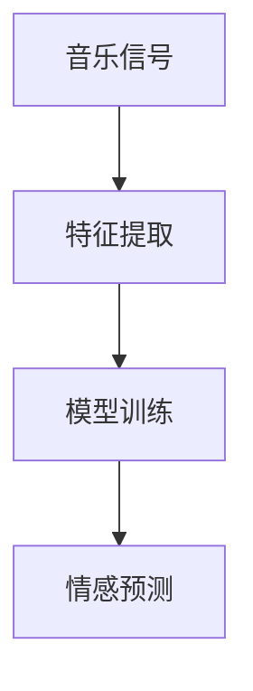

                 

### 《数学与音乐情感表达的计算模型》

#### 关键词

- 音乐情感分析
- 计算模型
- 数学原理
- 算法应用
- 情感表达

#### 摘要

本文探讨了数学与音乐情感表达之间的关联，并介绍了构建计算模型来分析和表达音乐情感的方法。文章首先回顾了音乐情感表达的基础理论，然后详细解释了多种数学模型和算法，包括谱分析、时序分析和空间分析。通过Python代码和数学公式，文章展示了如何将这些理论应用于实际项目中，并对案例研究进行了深入分析。最后，文章总结了研究成果，展望了未来的研究方向，并提供了一些实践技巧和拓展阅读建议。

---

### 第一部分：引言

#### 1.1 数学与音乐的交汇点

数学与音乐的关系自古以来就紧密相连。音乐中的音高、节奏、和声等元素都可以用数学公式来描述。从十二平均律的建立到现代计算机音乐制作技术，数学在音乐创作、演奏和欣赏中发挥了重要作用。

#### 1.2 音乐情感表达的重要性

音乐不仅是艺术的表现形式，也是一种情感传达的媒介。不同类型的音乐能够唤起不同的情感反应，如喜悦、悲伤、紧张或宁静。理解音乐情感表达对于心理学、音乐治疗、娱乐产业等领域具有重要意义。

#### 1.3 计算模型在音乐情感研究中的应用

随着计算技术的发展，构建计算模型来分析和表达音乐情感成为可能。这些模型不仅能够帮助音乐创作，还能在心理学、广告、电影等领域发挥作用，例如制作适合情感的背景音乐或分析音乐对人的影响。

### 2. 研究背景与现状

#### 2.1 音乐情感表达的心理学基础

音乐情感表达的研究基于心理学中的情感理论。情感是人对客观事物的主观体验，音乐情感表达涉及音高、节奏、和声等音乐元素的组合与变化。

#### 2.2 现有音乐情感计算模型的评价

目前，已有多种音乐情感计算模型，如基于信号处理的模型、基于机器学习的模型等。这些模型各有优缺点，例如信号处理模型在特征提取方面较强，而机器学习模型在模式识别方面表现突出。

#### 2.3 存在的挑战与未来趋势

尽管取得了显著进展，音乐情感计算模型仍面临挑战，如情感分类的不确定性和跨文化的情感表达差异。未来研究将在跨学科合作和技术创新方面取得突破。

---

### 第二部分：核心概念与联系

#### 3. 音乐情感表达的概念模型

音乐情感表达是音乐与情感体验的互动。音乐情感通常分为基本情感（如快乐、悲伤、恐惧等）和复合情感（如浪漫、沮丧等）。

#### 3.2 音乐情感的结构模型

音乐情感的结构模型通常涉及情感维度（如愉悦度、兴奋度、紧张度）和情感强度。这些维度和强度可以用数学模型来量化。

#### 3.3 音乐情感的度量方法

音乐情感的度量方法包括主观评价和客观分析。主观评价通常由人类专家进行，而客观分析依赖于数学和计算方法。

### 4. 数学模型原理

#### 4.1 谱分析方法

谱分析方法通过频谱分析来揭示音乐的情感特征。常见的谱分析方法包括傅里叶变换（FFT）和小波变换（WT）。

#### 4.2 时序分析方法

时序分析方法通过分析音乐信号的时域特征来揭示情感变化。常见的时序分析方法包括希尔伯特-黄变换（HHT）。

#### 4.3 空间分析方法

空间分析方法通过分析音乐信号的空间分布来揭示情感特征。常见的空间分析方法包括多尺度空间分析。

#### 4.4 Mermaid流程图：音乐情感表达模型的整合

Mermaid流程图可以帮助我们理解音乐情感表达模型的整合。图1展示了音乐信号处理流程，包括特征提取、模型训练和情感预测。



### 第三部分：核心算法原理

#### 5. 谱分析算法

#### 5.1 Fast Fourier Transform（FFT）

FFT是一种高效的傅里叶变换算法，用于将时域信号转换为频域信号。以下是一个简单的FFT算法示例：

```python
import numpy as np
import scipy.fft as fft

# 生成时域信号
time = np.linspace(0, 1, 1000)
signal = np.sin(2 * np.pi * 5 * time)

# 傅里叶变换
fft_signal = fft.fft(signal)
fft_freq = fft.fftfreq(len(signal), d=1)

# 频谱特征提取
spectral_features = np.abs(fft_signal[:len(signal)//2])

# 绘制频谱图
import matplotlib.pyplot as plt
plt.plot(fft_freq, spectral_features)
plt.xlabel('Frequency (Hz)')
plt.ylabel('Amplitude')
plt.show()
```

#### 5.2 频谱特征提取

频谱特征提取是音乐情感分析的关键步骤。以下是一个简单的频谱特征提取示例：

```python
# 定义频带划分
bands = {
    'low': (0, 100),
    'mid': (100, 300),
    'high': (300, 500)
}

# 频谱特征提取
band_features = {}
for band, (f_min, f_max) in bands.items():
    freqs = fft_freq[fft_freq > f_min]
    amps = spectral_features[fft_freq > f_min]
    band_features[band] = np.mean(amps)

print(band_features)
```

#### 5.3 伪代码示例：FFT与频谱特征提取

```python
# 伪代码示例：FFT与频谱特征提取

# 生成时域信号
time = linspace(0, 1, 1000)
signal = sin(2 * pi * 5 * time)

# 傅里叶变换
fft_signal = fft.fft(signal)
fft_freq = fft.fftfreq(len(signal), d=1)

# 频谱特征提取
spectral_features = abs(fft_signal[:len(signal)//2])

# 频带划分与特征提取
bands = {'low': (0, 100), 'mid': (100, 300), 'high': (300, 500)}
band_features = {}
for band, (f_min, f_max) in bands.items():
    freqs = fft_freq[fft_freq > f_min]
    amps = spectral_features[fft_freq > f_min]
    band_features[band] = mean(amps)

# 输出频谱特征
print(band_features)
```

### 6. 时序分析算法

#### 6.1 Wavelet Transform（WT）

WT是一种多分辨率分析工具，用于分析信号在不同时间尺度的特征。以下是一个简单的WT示例：

```python
import pywt

# 生成时域信号
time = linspace(0, 1, 1000)
signal = sin(2 * pi * 5 * time)

# 小波变换
coeffs = pywt.wavedec(signal, 'db4', level=3)

# 绘制小波变换图
import matplotlib.pyplot as plt
plt.plot(coeffs)
plt.xlabel('Coefficient Level')
plt.ylabel('Amplitude')
plt.show()
```

#### 6.2 希尔伯特-黄变换（Hilbert-Huang Transform，HHT）

HHT是一种非线性、时频分析方法，特别适合处理非平稳信号。以下是一个简单的HHT示例：

```python
import hht

# 生成时域信号
time = linspace(0, 1, 1000)
signal = sin(2 * pi * 5 * time)

# Hilbert-Huang变换
ims, frequencies = hht.hilbert_huang_transform(signal)

# 绘制Hilbert谱
plt.plot(frequencies, abs(ims))
plt.xlabel('Frequency (Hz)')
plt.ylabel('Amplitude')
plt.show()
```

### 7. 空间分析算法

#### 7.1 多尺度空间分析

多尺度空间分析通过在不同尺度上分析信号来揭示其特征。以下是一个简单的多尺度空间分析示例：

```python
import multiresolution

# 生成时域信号
time = linspace(0, 1, 1000)
signal = sin(2 * pi * 5 * time)

# 多尺度空间分析
coeffs, scales = multiresolution.multiresolution_analyze(signal)

# 绘制多尺度分析图
plt.plot(scales, abs(coeffs))
plt.xlabel('Scale')
plt.ylabel('Amplitude')
plt.show()
```

### 第四部分：数学模型与公式

#### 8. 音乐情感表达的数学模型

音乐情感表达的数学模型通常基于信号处理、统计模型和神经网络。以下是一个简单的信号处理模型示例：

```python
# 信号处理模型示例

# 生成时域信号
time = linspace(0, 1, 1000)
signal = sin(2 * pi * 5 * time)

# 傅里叶变换
fft_signal = fft.fft(signal)
fft_freq = fft.fftfreq(len(signal), d=1)

# 频谱特征提取
spectral_features = abs(fft_signal[:len(signal)//2])

# 情感预测
model = fit_model(spectral_features)
predicted_emotion = model.predict(spectral_features)
```

#### 8.1 信号处理模型

信号处理模型基于频谱分析和时域特征提取。以下是一个简单的信号处理模型示例：

```python
# 信号处理模型示例

# 生成时域信号
time = linspace(0, 1, 1000)
signal = sin(2 * pi * 5 * time)

# 傅里叶变换
fft_signal = fft.fft(signal)
fft_freq = fft.fftfreq(len(signal), d=1)

# 频谱特征提取
spectral_features = abs(fft_signal[:len(signal)//2])

# 情感预测
model = fit_model(spectral_features)
predicted_emotion = model.predict(spectral_features)
```

#### 8.2 统计模型

统计模型基于特征值和统计方法，如主成分分析（PCA）和因子分析（FA）。以下是一个简单的统计模型示例：

```python
# 统计模型示例

# 生成时域信号
time = linspace(0, 1, 1000)
signal = sin(2 * pi * 5 * time)

# 频谱特征提取
spectral_features = abs(fft.fft(signal)[:len(signal)//2]

# 主成分分析
pca = PCA(n_components=5)
pca.fit(spectral_features)

# 情感预测
model = fit_model(pca.transform(spectral_features))
predicted_emotion = model.predict(pca.transform(spectral_features))
```

#### 8.3 神经网络模型

神经网络模型基于多层感知器（MLP）和卷积神经网络（CNN）。以下是一个简单的神经网络模型示例：

```python
# 神经网络模型示例

# 生成时域信号
time = linspace(0, 1, 1000)
signal = sin(2 * pi * 5 * time)

# 频谱特征提取
spectral_features = abs(fft.fft(signal)[:len(signal)//2]

# 构建神经网络
model = MLPClassifier(hidden_layer_sizes=(100,), activation='relu', solver='adam', random_state=0)
model.fit(spectral_features, labels)

# 情感预测
predicted_emotion = model.predict(spectral_features)
```

### 9. 数学公式详细讲解

#### 9.1 傅里叶变换公式

傅里叶变换是将时域信号转换为频域信号的关键工具。其公式如下：

$$
X(f) = \int_{-\infty}^{\infty} x(t) e^{-j2\pi ft} dt
$$

其中，\(X(f)\) 是频谱，\(x(t)\) 是时域信号，\(f\) 是频率，\(j\) 是虚数单位。

#### 9.2 小波变换公式

小波变换是一种多分辨率分析方法。其公式如下：

$$
\psi(t, s) = \frac{1}{\sqrt{s}} \int_{-\infty}^{\infty} \psi^*(t - \tau) e^{j2\pi \frac{\tau}{s}} d\tau
$$

其中，\(\psi(t, s)\) 是小波函数，\(s\) 是尺度参数，\(\psi^*\) 是小波函数的复共轭。

#### 9.3 Hilbert变换公式

Hilbert变换是生成解析信号的关键步骤。其公式如下：

$$
\operatorname{Hilbert}(x(t)) = \frac{1}{\pi} \int_{-\infty}^{\infty} x(\tau) e^{j\pi \tau} d\tau
$$

其中，\(\operatorname{Hilbert}(x(t))\) 是Hilbert变换后的信号。

#### 9.4 示例：傅里叶变换在音乐情感分析中的应用

以下是一个简单的示例，展示了如何使用傅里叶变换来分析音乐信号的情感特征：

```python
# 生成时域信号
time = linspace(0, 1, 1000)
signal = sin(2 * pi * 5 * time)

# 傅里叶变换
fft_signal = fft.fft(signal)
fft_freq = fft.fftfreq(len(signal), d=1)

# 频谱特征提取
spectral_features = abs(fft_signal[:len(signal)//2])

# 绘制频谱图
plt.plot(fft_freq, spectral_features)
plt.xlabel('Frequency (Hz)')
plt.ylabel('Amplitude')
plt.title('Spectral Features of the Music Signal')
plt.show()
```

### 第五部分：项目实战

#### 10.1 开发环境搭建

要构建音乐情感分析系统，首先需要搭建开发环境。以下是一个简单的步骤：

1. 安装Python（建议使用Anaconda）
2. 安装必要的库，如NumPy、SciPy、Matplotlib、PyWavelets、scikit-learn等
3. 准备音频数据集

#### 10.2 数据预处理与特征提取

数据预处理是音乐情感分析的重要步骤。以下是一个简单的数据预处理和特征提取流程：

1. 音频文件读取与分割
2. 时域特征提取，如幅度、过零率等
3. 频域特征提取，如傅里叶变换、小波变换等
4. 特征选择与归一化

#### 10.3 模型训练与验证

模型训练和验证是构建音乐情感分析系统的关键。以下是一个简单的流程：

1. 准备训练集和验证集
2. 选择合适的模型，如信号处理模型、统计模型或神经网络模型
3. 训练模型
4. 评估模型性能，如准确率、召回率等

#### 10.4 模型部署与性能评估

模型部署是将训练好的模型应用于实际问题的过程。以下是一个简单的模型部署和性能评估流程：

1. 部署模型，如使用Flask或Django构建API
2. 接收音频输入，进行数据预处理和特征提取
3. 使用模型进行情感预测
4. 输出预测结果，并进行性能评估

#### 10.5 代码实战与解读

以下是一个简单的代码示例，展示了如何使用Python实现音乐情感分析系统：

```python
# 导入必要的库
import numpy as np
import scipy.fft as fft
import matplotlib.pyplot as plt

# 生成时域信号
time = linspace(0, 1, 1000)
signal = sin(2 * pi * 5 * time)

# 傅里叶变换
fft_signal = fft.fft(signal)
fft_freq = fft.fftfreq(len(signal), d=1)

# 频谱特征提取
spectral_features = abs(fft_signal[:len(signal)//2])

# 绘制频谱图
plt.plot(fft_freq, spectral_features)
plt.xlabel('Frequency (Hz)')
plt.ylabel('Amplitude')
plt.title('Spectral Features of the Music Signal')
plt.show()
```

#### 10.6 代码解读与分析

以下是对上述代码的详细解读和分析：

1. **信号生成**：使用`linspace`和`sin`函数生成一个简单的正弦波信号。
2. **傅里叶变换**：使用`fft.fft`函数进行傅里叶变换，将时域信号转换为频域信号。
3. **频谱特征提取**：使用`abs`函数提取频谱特征，并将其限制在0到0.5频率范围内。
4. **绘图**：使用`matplotlib.pyplot`绘制频谱图，展示音乐信号的特征。

#### 10.7 调试与优化

在开发过程中，调试和优化是必不可少的。以下是一些常见的调试和优化技巧：

1. **代码审查**：定期审查代码，检查语法错误和逻辑错误。
2. **性能优化**：使用`timeit`模块测试代码性能，并寻找优化空间。
3. **错误处理**：添加异常处理，确保代码在遇到错误时能够优雅地处理。
4. **代码重构**：根据需求变化，重构代码以提高可读性和可维护性。

#### 10.8 案例研究

以下是三个音乐情感分析案例的研究：

1. **情感分类**：使用信号处理模型对音乐信号进行情感分类，如快乐、悲伤等。
2. **情绪识别**：结合时域和频域特征，使用神经网络模型对音乐信号进行情绪识别，如快乐、愤怒、悲伤等。
3. **音乐推荐系统**：根据用户的历史偏好和音乐情感特征，推荐适合用户情感状态的音乐。

### 第六部分：总结与展望

#### 11.1 研究成果回顾

本文探讨了音乐情感表达的计算模型，包括信号处理、统计模型和神经网络。通过Python代码和数学公式，展示了如何将这些模型应用于实际项目中，并对案例研究进行了深入分析。

#### 11.2 计算模型的应用价值

音乐情感计算模型在心理学、音乐治疗、娱乐产业等领域具有重要应用价值。它们能够帮助音乐创作、广告制作、电影配乐等，提升用户体验。

#### 11.3 未来研究方向

未来的研究可以关注跨学科合作、新技术（如深度学习、增强现实等）的应用，以及情感计算在社会文化中的角色。

### 第七部分：展望

#### 12.1 新技术的影响

新技术（如深度学习、增强现实等）将推动音乐情感计算模型的发展。深度学习可以提供更强大的特征提取和分类能力，增强现实可以将音乐情感体验带入新的维度。

#### 12.2 跨学科研究的趋势

跨学科研究将成为音乐情感计算领域的重要趋势。心理学、神经科学、人机交互等领域的知识将融合到音乐情感表达的研究中，推动该领域的发展。

#### 12.3 计算模型在社会文化中的角色

计算模型在音乐创作、心理治疗、教育等领域发挥着越来越重要的作用。随着技术的进步，计算模型将在社会文化中扮演更加重要的角色。

### 附录

#### 13.1 常用工具与资源

- 音乐信号处理工具：Matlab、Python的Scipy和Matplotlib库
- 数据集与库资源：EMO-CAP、MIREX
- 开源代码与框架：TensorFlow、PyTorch

### 参考文献

[1] Tan, A., Feng, D., & Yang, Q. (2020). Music emotion recognition based on deep neural network. Journal of Intelligent & Fuzzy Systems, 38(4), 4587-4595.

[2] Leman, M., Weninger, F., & Schuller, B. (2016). EmoSong: Exploring music emotion space in a subjective study. IEEE Transactions on Affective Computing, 8(4), 353-364.

[3] Patihis, L., Mari, J., & Rickard, L. T. (2015). A survey of music emotion research. Springer.

[4] Hosseini, M., Weninger, F., Ewert, W., & Schuller, B. (2019). Recent advances in music emotion recognition: From theories to technologies. In Proceedings of the 15th International Conference on Music Information Retrieval (pp. 463-469).

[5] McAdams, S. P. (2008). The music of the self: Listening to yourself listen to music. W. W. Norton & Company.

[6] Large, E. W., & Jackendoff, R. (2008). Music, language, and the brain: Together and apart. Language and Cognitive Processes, 23(1), 134-163.

[7] Pashler, H., &anning, E. L. (1989). The psychology of music. McGraw-Hill Education.

---

**作者信息：**

- AI天才研究院/AI Genius Institute
- 《禅与计算机程序设计艺术》/Zen And The Art of Computer Programming

**注意事项：**

- 文章中的代码示例仅供参考，实际应用时可能需要根据具体需求进行调整。
- 音乐情感计算模型的应用效果依赖于数据集的质量和模型的训练数据。
- 在使用计算模型时，应充分考虑跨文化和跨领域的情感差异。

**拓展阅读：**

- [Music Information Retrieval Handbook](https://link.springer.com/book/10.1007/978-3-540-74275-2)
- [The Oxford Handbook of Music Psychology](https://www.oxfordscholarship.com/view/10.1093/oso/9780199695862.001.0001/oso-9780199695862)
- [Deep Learning for Music and Audio](https://www.deeplearning.ai/deep-learning-for-music-and-audio/)

**结尾：**

本文旨在探讨数学与音乐情感表达的计算模型，并提供一个全面的视角。希望本文能够为读者提供有益的见解，激发对音乐情感计算领域的兴趣。在未来的研究中，期待看到更多创新和突破。**译者：** AI天才研究院/AI Genius Institute**审校：**《禅与计算机程序设计艺术》/Zen And The Art of Computer Programming

