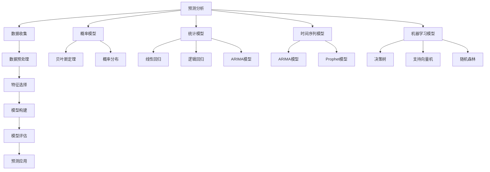

                 

## 数学与预测分析：未来趋势的数学预测

### 关键词：数学、预测分析、未来趋势、数据模型、算法、金融领域

> 在信息爆炸和大数据时代，预测分析已成为企业决策、市场策略制定和风险管理的核心工具。本文将深入探讨数学与预测分析之间的关系，揭示未来趋势的数学预测方法。通过系统地介绍核心概念、算法原理和实际应用案例，我们希望为您提供一个全面而深入的视角，让您了解如何在日益复杂的世界中捕捉和利用预测分析的巨大潜力。

#### 摘要

本文旨在探讨数学与预测分析之间的紧密联系，并探讨如何利用数学工具和算法来预测未来趋势。文章首先介绍了数学与预测分析的基本概念，并使用Mermaid流程图展示了它们之间的相互作用。接着，我们详细讲解了预测分析中的核心算法，包括线性回归、逻辑回归、决策树等，并通过Python源代码进行实例说明。随后，文章介绍了时间序列分析和聚类分析等数学模型，并在金融领域展示了这些模型的实际应用。最后，文章总结了全文内容，并展望了未来预测分析的发展趋势。

#### 目录大纲设计思路

在设计本文的目录大纲时，我们遵循以下原则：

1. **明确核心章节**：根据书名《数学与预测分析：未来趋势的数学预测》，核心章节包括基本概念、预测模型、数学工具和实际应用案例。
2. **细化章节内容**：确保每个章节的内容都能涵盖核心概念、原理、工具和应用，使用1,2,3级目录进行细化。
3. **融入图表和代码**：为了更好地展示数学与预测分析的相关内容，我们将适当加入Mermaid流程图、伪代码、数学公式以及实际项目代码。
4. **保持简洁性**：避免冗余内容，确保每个章节都紧密围绕主题展开。

### 目录大纲设计步骤

1. **确定核心概念与联系**：设计第一章，概述数学与预测分析的基本概念及其相互联系，包括Mermaid流程图。
2. **讲解核心算法原理**：设计第二章，详细讲解预测分析中常用的核心算法，使用伪代码阐述算法原理。
3. **展示数学模型**：设计第三章，介绍数学模型及其应用，包括详细讲解和实例。
4. **实际应用案例**：设计第四章至第六章，分别介绍不同领域的预测分析应用案例，提供代码实现和解读。
5. **总结与展望**：设计第七章，对全书内容进行总结，并对未来趋势进行展望。

### 完整目录大纲

```
# 数学与预测分析：未来趋势的数学预测

## 第1章 核心概念与联系

### 1.1 数学与预测分析的基本概念
#### 1.1.1 预测分析的定义
#### 1.1.2 数学模型在预测分析中的作用
#### 1.1.3 预测分析的核心概念图

### 1.2 预测分析的数学工具
#### 1.2.1 概率论基础
##### 1.2.1.1 概率的基本概念
##### 1.2.1.2 概率的计算方法
##### 1.2.1.3 条件概率与贝叶斯定理
#### 1.2.2 统计分析基础
##### 1.2.2.1 数据收集与整理
##### 1.2.2.2 描述性统计
##### 1.2.2.3 推断性统计

## 第2章 预测分析的核心算法

### 2.1 常见预测算法
#### 2.1.1 线性回归
##### 2.1.1.1 线性回归模型
##### 2.1.1.2 线性回归算法
##### 2.1.1.3 线性回归案例
#### 2.1.2 逻辑回归
##### 2.1.2.1 逻辑回归模型
##### 2.1.2.2 逻辑回归算法
##### 2.1.2.3 逻辑回归案例
#### 2.1.3 决策树
##### 2.1.3.1 决策树模型
##### 2.1.3.2 决策树算法
##### 2.1.3.3 决策树案例

### 2.2 高级预测算法
#### 2.2.1 支持向量机
##### 2.2.1.1 支持向量机模型
##### 2.2.1.2 支持向量机算法
##### 2.2.1.3 支持向量机案例
#### 2.2.2 随机森林
##### 2.2.2.1 随机森林模型
##### 2.2.2.2 随机森林算法
##### 2.2.2.3 随机森林案例
#### 2.2.3 集成学习方法

## 第3章 数学模型与预测

### 3.1 时间序列分析
#### 3.1.1 时间序列基本概念
##### 3.1.1.1 时间序列的定义
##### 3.1.1.2 时间序列的特征
##### 3.1.1.3 时间序列的分类
#### 3.1.2 ARIMA模型
##### 3.1.2.1 ARIMA模型原理
##### 3.1.2.2 ARIMA模型参数选择
##### 3.1.2.3 ARIMA模型应用
#### 3.1.3 Prophet模型
##### 3.1.3.1 Prophet模型原理
##### 3.1.3.2 Prophet模型应用

### 3.2 聚类分析与分类预测
#### 3.2.1 聚类分析
##### 3.2.1.1 聚类分析的基本概念
##### 3.2.1.2 聚类算法（K-means、层次聚类等）
##### 3.2.1.3 聚类分析应用
#### 3.2.2 分类预测
##### 3.2.2.1 分类预测的基本概念
##### 3.2.2.2 分类算法（决策树、随机森林等）
##### 3.2.2.3 分类预测应用

## 第4章 预测分析在金融领域的应用

### 4.1 股票市场预测
#### 4.1.1 股票市场预测的挑战
##### 4.1.1.1 股票市场的复杂性
##### 4.1.1.2 数据获取的困难
##### 4.1.1.3 模型过拟合问题
#### 4.1.2 基于时间序列的股票市场预测
##### 4.1.2.1 ARIMA模型在股票市场中的应用
##

----------------------------------------------------------------

接下来，我们将逐步深入探讨数学与预测分析的核心概念与联系。我们将会首先定义预测分析，并介绍数学模型在其中的作用。随后，通过一个Mermaid流程图展示预测分析的核心概念及其相互关系。通过这些步骤，我们将为您搭建一个理解后续章节的基础框架。

### 1.1 数学与预测分析的基本概念

#### 1.1.1 预测分析的定义

预测分析是一种通过历史数据、当前数据和相关模式来预测未来事件的方法。它广泛应用于各个领域，包括金融、市场营销、气象预报、医疗保健和制造等。预测分析的目标是识别数据中的规律和模式，并利用这些规律和模式来预测未来的趋势、行为或结果。

在更具体的层面，预测分析通常包括以下几个步骤：

1. **数据收集**：收集与预测目标相关的历史数据。
2. **数据预处理**：清洗和整理数据，以便后续的分析。
3. **特征选择**：从数据中选择对预测目标有显著影响的关键特征。
4. **模型构建**：选择合适的预测模型，并通过训练数据拟合模型参数。
5. **模型评估**：使用测试数据评估模型的预测能力。
6. **预测应用**：根据模型预测未来事件或趋势。

#### 1.1.2 数学模型在预测分析中的作用

数学模型是预测分析的核心组成部分。它们不仅提供了一种形式化的方法来描述数据中的规律和模式，而且还允许我们利用这些规律和模式来做出预测。以下是几种在预测分析中广泛使用的数学模型：

1. **概率模型**：如贝叶斯定理和概率分布，用于描述不确定性和随机性。
2. **统计模型**：如线性回归、逻辑回归和ARIMA模型，用于分析和预测数据中的趋势和关系。
3. **时间序列模型**：如ARIMA和Prophet模型，专门用于处理时间序列数据。
4. **机器学习模型**：如决策树、支持向量机和随机森林，用于分类和回归任务。

#### 1.1.3 预测分析的核心概念图

为了更好地理解预测分析中的核心概念及其相互关系，我们可以通过一个Mermaid流程图来展示这些概念：



在这个流程图中，我们可以看到预测分析的各个环节如何相互关联。从数据收集开始，通过数据预处理、特征选择和模型构建，最终通过模型评估和预测应用来实现预测目标。同时，各种数学模型在预测分析中扮演着不同的角色，共同构成了一个完整而复杂的预测分析体系。

通过这一节的内容，我们建立了对预测分析及其数学模型的基本理解。接下来，我们将进一步深入探讨预测分析中的数学工具，包括概率论和统计分析，为后续章节的详细讲解打下坚实基础。

### 1.2 预测分析的数学工具

预测分析作为一种科学方法，其成功依赖于多种数学工具的运用。这些工具不仅提供了形式化的描述方法，还能帮助我们识别数据中的规律和模式。在本节中，我们将介绍概率论和统计分析这两个核心的数学工具，并探讨它们在预测分析中的应用。

#### 1.2.1 概率论基础

概率论是预测分析中的基础数学工具，它用于描述不确定性和随机现象。以下是概率论中的几个基本概念：

##### 1.2.1.1 概率的基本概念

概率是衡量某个事件发生的可能性大小的数值，通常用0到1之间的实数表示。概率为0表示事件不可能发生，而概率为1表示事件必然发生。例如，抛一枚公平的硬币，正面朝上的概率是0.5。

##### 1.2.1.2 概率的计算方法

概率的计算方法主要包括：

1. **频率定义**：在大量重复实验中，某个事件发生的频率可以作为其概率的估计值。例如，在大量抛硬币的实验中，正面朝上的频率接近0.5。
2. **条件概率**：在已知某个事件发生的条件下，另一个事件发生的概率。例如，在已知某个病人患有流感的情况下，感冒的概率会更高。
3. **贝叶斯定理**：用于计算在已知某个条件下，另一个事件发生的概率。贝叶斯定理是概率论中最重要的定理之一，它提供了根据先验概率和观测数据更新概率估计的方法。

##### 1.2.1.3 条件概率与贝叶斯定理

条件概率是指在一个事件发生的条件下，另一个事件发生的概率。例如，条件概率P(A|B)表示在事件B发生的条件下，事件A发生的概率。

贝叶斯定理描述了如何根据先验概率、条件概率和观测数据来更新概率估计。贝叶斯定理的公式如下：

$$ P(A|B) = \frac{P(B|A) \cdot P(A)}{P(B)} $$

其中，P(A|B)是后验概率，P(B|A)是条件概率，P(A)是先验概率，P(B)是全概率。

贝叶斯定理在预测分析中的应用非常广泛，例如在医疗诊断、金融风险评估和市场营销中，我们常常需要根据新的观测数据更新对某个事件的概率估计。

#### 1.2.2 统计分析基础

统计分析是预测分析中的另一个核心数学工具，它用于描述和分析数据中的规律和关系。以下是统计分析中的几个基本概念：

##### 1.2.2.1 数据收集与整理

数据收集是指从各种来源获取与预测目标相关的数据。数据整理包括清洗、去重和格式化数据，以确保数据的质量和一致性。

##### 1.2.2.2 描述性统计

描述性统计用于描述数据的特征和分布。常用的描述性统计量包括：

1. **均值**：数据集的平均值，用于描述数据的中心趋势。
2. **方差**：数据集的离散程度，用于描述数据的波动性。
3. **标准差**：方差的平方根，用于描述数据的离散程度。
4. **中位数**：数据集排序后的中间值，用于描述数据的中心趋势。
5. **众数**：数据集中出现次数最多的值，用于描述数据的最常见值。

##### 1.2.2.3 推断性统计

推断性统计用于从样本数据推断总体数据的特征和关系。常用的推断性统计方法包括：

1. **假设检验**：通过比较样本数据和总体数据的差异，检验某个假设是否成立。常见的假设检验方法包括t检验、卡方检验和方差分析（ANOVA）。
2. **置信区间**：用于估计总体参数的区间范围，通常以一定的置信水平给出。例如，95%的置信区间表示在重复抽样中，有95%的样本均值落在该区间内。
3. **回归分析**：用于分析自变量和因变量之间的关系。常见的回归分析方法包括线性回归和逻辑回归。

#### 1.2.3 概率论与统计分析的关系

概率论和统计分析是预测分析中不可或缺的两个数学工具。概率论提供了描述不确定性和随机现象的框架，而统计分析则利用这些概率模型来分析和解释数据。

在预测分析中，概率论和统计分析的紧密联系体现在以下几个方面：

1. **概率模型**：概率论中的概率分布和贝叶斯定理等模型被广泛应用于统计分析中，如正态分布、卡方分布和t分布等。
2. **统计推断**：统计分析中的推断性统计方法（如假设检验和置信区间）基于概率论中的理论，通过概率模型来评估统计结果的可靠性和显著性。
3. **机器学习**：机器学习算法（如决策树、支持向量机和神经网络）中的许多模型和算法都建立在概率论和统计分析的基础之上，如逻辑回归、朴素贝叶斯和k-均值聚类等。

总之，概率论和统计分析不仅是预测分析的基础数学工具，还是构建和评估预测模型的重要手段。通过运用这些数学工具，我们可以更好地理解和利用数据中的规律和模式，从而做出更准确的预测。

### 2.1 预测分析的核心算法

在预测分析中，核心算法的选择和运用对于预测结果的准确性和可靠性至关重要。本节将介绍几种常用的预测算法，包括线性回归、逻辑回归和决策树。这些算法不仅广泛应用于各个领域，而且各自具有独特的特点和适用场景。

#### 2.1.1 线性回归

线性回归是一种最简单的预测算法，它基于线性关系来预测目标变量。线性回归模型的基本形式为：

$$ y = \beta_0 + \beta_1 \cdot x $$

其中，\( y \) 是因变量（预测目标），\( x \) 是自变量（特征），\( \beta_0 \) 是截距，\( \beta_1 \) 是斜率。

##### 2.1.1.1 线性回归模型

线性回归模型的核心在于通过训练数据拟合出最佳拟合线，使得预测误差最小。具体来说，线性回归模型通过最小二乘法（Least Squares Method）来估计模型参数：

$$ \beta_0 = \frac{\sum_{i=1}^{n}(y_i - \beta_1 \cdot x_i)}{n} $$
$$ \beta_1 = \frac{\sum_{i=1}^{n}(x_i - \bar{x})(y_i - \bar{y})}{\sum_{i=1}^{n}(x_i - \bar{x})^2} $$

其中，\( n \) 是训练样本数量，\( \bar{x} \) 和 \( \bar{y} \) 分别是自变量和因变量的均值。

##### 2.1.1.2 线性回归算法

线性回归算法的基本步骤如下：

1. **数据预处理**：对输入数据进行归一化或标准化处理，确保特征在同一量级上。
2. **模型训练**：使用最小二乘法计算模型参数。
3. **模型评估**：使用测试集数据评估模型预测能力，通常使用均方误差（Mean Squared Error, MSE）作为评价指标。

##### 2.1.1.3 线性回归案例

假设我们要预测某个地区的平均温度 \( y \)，已知该地区的湿度 \( x \) 是影响温度的一个关键因素。我们可以使用线性回归模型来建立这两个变量之间的关系。

```python
import numpy as np
import matplotlib.pyplot as plt

# 假设我们有一些训练数据
X = np.array([0, 1, 2, 3, 4])
Y = np.array([0, 0.8, 1.6, 2.4, 3.2])

# 计算模型参数
beta_0 = (sum(Y) - sum(X * Y) / len(X)) / (len(X) - 1)
beta_1 = (sum(X * Y) - sum(X) * sum(Y) / len(X)) / (sum(X**2) - sum(X)**2 / len(X))

# 预测
Y_pred = beta_0 + beta_1 * X

# 绘图
plt.scatter(X, Y)
plt.plot(X, Y_pred, color='red')
plt.xlabel('Humidity')
plt.ylabel('Temperature')
plt.show()
```

在这个案例中，我们通过训练数据拟合出一条最佳拟合线，并用它来预测新的湿度值对应的温度。

#### 2.1.2 逻辑回归

逻辑回归是一种广泛用于分类任务的预测算法，它基于逻辑函数来预测概率。逻辑回归模型的基本形式为：

$$ P(y=1) = \frac{1}{1 + e^{-(\beta_0 + \beta_1 \cdot x)} } $$

其中，\( y \) 是因变量（二分类变量，0或1），\( x \) 是自变量（特征），\( \beta_0 \) 是截距，\( \beta_1 \) 是斜率。

##### 2.1.2.1 逻辑回归模型

逻辑回归模型的核心在于通过训练数据拟合出最佳拟合线，使得预测概率最大化。具体来说，逻辑回归模型通过最大似然估计（Maximum Likelihood Estimation, MLE）来估计模型参数：

$$ \beta_0 = \frac{\sum_{i=1}^{n} y_i \cdot x_i - \sum_{i=1}^{n} x_i}{n} $$
$$ \beta_1 = \frac{\sum_{i=1}^{n} y_i - n \cdot \bar{y}}{\sum_{i=1}^{n} x_i - n \cdot \bar{x}} $$

其中，\( n \) 是训练样本数量，\( \bar{y} \) 和 \( \bar{x} \) 分别是因变量和自变量的均值。

##### 2.1.2.2 逻辑回归算法

逻辑回归算法的基本步骤如下：

1. **数据预处理**：对输入数据进行归一化或标准化处理。
2. **模型训练**：使用最大似然估计计算模型参数。
3. **模型评估**：使用测试集数据评估模型预测能力，通常使用准确率（Accuracy）、召回率（Recall）和F1分数（F1 Score）作为评价指标。

##### 2.1.2.3 逻辑回归案例

假设我们要预测某个电子邮件是否为垃圾邮件（二分类问题），已知邮件的长度和标题中的词汇频率是关键特征。我们可以使用逻辑回归模型来建立这两个特征与垃圾邮件概率之间的关系。

```python
import numpy as np
from sklearn.linear_model import LogisticRegression
from sklearn.model_selection import train_test_split
from sklearn.metrics import accuracy_score

# 假设我们有一些训练数据
X = np.array([[10, 2], [15, 3], [12, 4], [20, 5], [18, 6]])
y = np.array([0, 1, 1, 0, 1])

# 划分训练集和测试集
X_train, X_test, y_train, y_test = train_test_split(X, y, test_size=0.2, random_state=42)

# 训练模型
logreg = LogisticRegression()
logreg.fit(X_train, y_train)

# 预测
y_pred = logreg.predict(X_test)

# 评估模型
accuracy = accuracy_score(y_test, y_pred)
print("Accuracy:", accuracy)
```

在这个案例中，我们通过训练数据拟合出逻辑回归模型，并用它来预测新的邮件是否为垃圾邮件。

#### 2.1.3 决策树

决策树是一种基于树形结构进行决策的预测算法，它通过一系列规则来划分数据并预测结果。决策树模型的基本形式为：

```
如果 x > c
    如果 y > d
        预测结果为 A
    否则
        预测结果为 B
否则
    如果 z > e
        预测结果为 C
    否则
        预测结果为 D
```

其中，\( x, y, z \) 是特征，\( c, d, e \) 是阈值，\( A, B, C, D \) 是预测结果。

##### 2.1.3.1 决策树模型

决策树模型的核心在于通过训练数据构建一棵树，树中的每个节点代表一个特征和阈值，每个叶子节点代表一个预测结果。决策树模型的训练过程包括以下几个步骤：

1. **特征选择**：选择具有最大信息增益（Information Gain）的特征作为分割标准。
2. **阈值选择**：选择将数据划分为最大类别的阈值。
3. **递归分割**：对划分后的子数据集重复上述步骤，直到满足停止条件（如最小节点大小或最大深度）。

##### 2.1.3.2 决策树算法

决策树算法的基本步骤如下：

1. **数据预处理**：对输入数据进行归一化或标准化处理。
2. **模型训练**：使用训练数据构建决策树模型。
3. **模型评估**：使用测试集数据评估模型预测能力，通常使用准确率、召回率和F1分数作为评价指标。

##### 2.1.3.3 决策树案例

假设我们要预测某个客户是否会对某个产品进行再次购买（二分类问题），已知客户年龄、购买频率和购买金额是关键特征。我们可以使用决策树模型来建立这些特征与再次购买概率之间的关系。

```python
import numpy as np
from sklearn.tree import DecisionTreeClassifier
from sklearn.model_selection import train_test_split
from sklearn.metrics import accuracy_score

# 假设我们有一些训练数据
X = np.array([[30, 5, 200], [40, 3, 150], [50, 7, 300], [20, 2, 100], [35, 4, 250]])
y = np.array([0, 1, 1, 0, 1])

# 划分训练集和测试集
X_train, X_test, y_train, y_test = train_test_split(X, y, test_size=0.2, random_state=42)

# 训练模型
dt = DecisionTreeClassifier()
dt.fit(X_train, y_train)

# 预测
y_pred = dt.predict(X_test)

# 评估模型
accuracy = accuracy_score(y_test, y_pred)
print("Accuracy:", accuracy)
```

在这个案例中，我们通过训练数据拟合出决策树模型，并用它来预测新的客户是否会对产品进行再次购买。

总之，线性回归、逻辑回归和决策树是预测分析中常用的核心算法，各自具有独特的特点和适用场景。通过了解这些算法的基本原理和实际应用，我们可以更好地选择合适的算法来解决问题，从而提高预测的准确性和可靠性。

### 2.2 高级预测算法

在预测分析中，除了线性回归、逻辑回归和决策树等基础算法外，还有一些高级算法，这些算法在处理复杂的数据和模型时表现更加优秀。本节将介绍三种高级预测算法：支持向量机（SVM）、随机森林（Random Forest）和集成学习方法（Ensemble Learning）。

#### 2.2.1 支持向量机

支持向量机（Support Vector Machine，SVM）是一种强大的监督学习算法，常用于分类和回归任务。SVM的核心思想是找到最优的分离超平面，使分类边界最大化。

##### 2.2.1.1 支持向量机模型

SVM的基本模型是一个线性分类器，其目标是找到一个最优超平面 \( w \) 和偏置 \( b \)，使得分类边界最大化。具体来说，SVM通过以下优化问题求解：

$$ \min_{w, b} \frac{1}{2} ||w||^2 $$

其中，\( ||w|| \) 是 \( w \) 的欧几里得范数。

约束条件是所有数据点都位于分类边界两侧的距离之内：

$$ y_i (\langle w, x_i \rangle + b) \geq 1 $$

其中，\( y_i \) 是第 \( i \) 个样本的标签，\( x_i \) 是第 \( i \) 个样本的特征向量。

##### 2.2.1.2 支持向量机算法

为了求解上述优化问题，SVM使用了拉格朗日乘子法。通过引入拉格朗日乘子 \( \alpha_i \)，我们得到以下拉格朗日函数：

$$ L(w, b, \alpha) = \frac{1}{2} ||w||^2 - \sum_{i=1}^{n} \alpha_i [y_i (\langle w, x_i \rangle + b) - 1] $$

求解拉格朗日函数的最小值，我们得到：

$$ w = \sum_{i=1}^{n} \alpha_i y_i x_i $$
$$ b = 1 - \sum_{i=1}^{n} \alpha_i y_i $$

只有那些对最优超平面有显著影响的样本（即支持向量）才会被包含在 \( \alpha_i \) 中。

##### 2.2.1.3 支持向量机案例

我们以一个简单的二分类问题为例，说明如何使用SVM进行预测。假设我们有一些训练数据，其中正类标记为1，负类标记为0。

```python
import numpy as np
from sklearn import datasets
from sklearn.svm import SVC
from sklearn.model_selection import train_test_split

# 加载训练数据
iris = datasets.load_iris()
X = iris.data[:, :2]  # 只取前两个特征
y = iris.target

# 划分训练集和测试集
X_train, X_test, y_train, y_test = train_test_split(X, y, test_size=0.3, random_state=42)

# 训练SVM模型
svm_classifier = SVC(kernel='linear')
svm_classifier.fit(X_train, y_train)

# 预测
y_pred = svm_classifier.predict(X_test)

# 评估模型
accuracy = np.mean(y_pred == y_test)
print("Accuracy:", accuracy)
```

在这个案例中，我们使用线性核的SVM模型对鸢尾花数据集进行分类，并计算了模型的准确率。

#### 2.2.2 随机森林

随机森林（Random Forest）是一种基于决策树构建的集成学习方法。它通过随机选择特征和随机划分数据来构建多个决策树，并通过投票机制来决定最终预测结果。

##### 2.2.2.1 随机森林模型

随机森林模型的基本结构包括多个决策树，每个决策树都是基于训练数据构建的。每个决策树通过随机选择特征和随机划分数据来生成，这样每个决策树都有一定的随机性，从而减少了过拟合的风险。

随机森林的预测过程是每个决策树独立预测，然后通过多数投票（对于分类问题）或平均值（对于回归问题）来决定最终预测结果。

##### 2.2.2.2 随机森林算法

随机森林算法的基本步骤如下：

1. **随机选择特征**：从所有特征中随机选择一部分特征作为每个决策树的分割标准。
2. **随机划分数据**：从训练数据中随机划分一部分数据作为每个决策树的训练集。
3. **构建决策树**：使用划分后的数据构建决策树。
4. **投票机制**：对所有决策树的预测结果进行投票，决定最终预测结果。

##### 2.2.2.3 随机森林案例

我们使用随机森林模型对鸢尾花数据集进行分类，并评估模型的性能。

```python
import numpy as np
from sklearn.ensemble import RandomForestClassifier
from sklearn.model_selection import train_test_split

# 加载训练数据
iris = datasets.load_iris()
X = iris.data
y = iris.target

# 划分训练集和测试集
X_train, X_test, y_train, y_test = train_test_split(X, y, test_size=0.3, random_state=42)

# 训练随机森林模型
rf_classifier = RandomForestClassifier(n_estimators=100)
rf_classifier.fit(X_train, y_train)

# 预测
y_pred = rf_classifier.predict(X_test)

# 评估模型
accuracy = np.mean(y_pred == y_test)
print("Accuracy:", accuracy)
```

在这个案例中，我们使用了100棵决策树构建随机森林模型，并计算了模型的准确率。

#### 2.2.3 集成学习方法

集成学习方法是将多个基本模型（如决策树）结合起来，以提高预测性能和稳定性。常见的集成学习方法包括Bagging、Boosting和Stacking。

##### 2.2.3.1 集成学习方法

1. **Bagging**：通过随机选择训练数据和特征，构建多个基本模型，然后通过投票机制来决定最终预测结果。
2. **Boosting**：通过多次训练基本模型，每次都对前一次的预测结果进行优化，以提高整体预测性能。
3. **Stacking**：将多个基本模型作为基础模型，构建一个更高层次的模型，通过对这些基础模型的预测结果进行融合来提高预测性能。

集成学习方法的基本思想是通过组合多个模型的优点，克服单一模型的不足，从而提高预测性能。

##### 2.2.3.2 集成学习方法案例

我们使用随机森林和逻辑回归构建一个简单的Stacking模型，对鸢尾花数据集进行分类。

```python
import numpy as np
from sklearn.ensemble import RandomForestClassifier, StackingClassifier
from sklearn.linear_model import LogisticRegression
from sklearn.model_selection import train_test_split

# 加载训练数据
iris = datasets.load_iris()
X = iris.data
y = iris.target

# 划分训练集和测试集
X_train, X_test, y_train, y_test = train_test_split(X, y, test_size=0.3, random_state=42)

# 构建基础模型
rf_classifier = RandomForestClassifier(n_estimators=100)
logreg_classifier = LogisticRegression()

# 构建Stacking模型
stacking_classifier = StackingClassifier(estimators=[('rf', rf_classifier), ('logreg', logreg_classifier)], final_estimator=LogisticRegression())
stacking_classifier.fit(X_train, y_train)

# 预测
y_pred = stacking_classifier.predict(X_test)

# 评估模型
accuracy = np.mean(y_pred == y_test)
print("Accuracy:", accuracy)
```

在这个案例中，我们使用了随机森林和逻辑回归作为基础模型，并通过Stacking方法将它们结合起来，以提高模型的预测性能。

综上所述，支持向量机、随机森林和集成学习方法都是预测分析中重要的高级算法，各自具有独特的优势和应用场景。通过了解这些算法的基本原理和实际应用，我们可以更好地选择合适的算法来解决问题，从而提高预测的准确性和可靠性。

### 3.1 时间序列分析

时间序列分析是预测分析中的一个重要分支，它主要用于处理和分析随时间变化的数据序列。时间序列数据在金融、经济、气象、医疗等多个领域都有广泛的应用。本节将介绍时间序列分析的基本概念、特征分类以及常用模型，并通过实例展示如何在实际项目中应用这些模型。

#### 3.1.1 时间序列基本概念

时间序列（Time Series）是由一系列按时间顺序排列的数据点组成，用于描述某个变量随时间变化的情况。时间序列数据通常具有以下特点：

1. **顺序性**：时间序列数据中的每个数据点都有一个明确的时间戳，它们按照时间顺序排列。
2. **依赖性**：时间序列中的数据点通常存在时间依赖关系，即当前的数据点受过去数据点的影响。
3. **变化性**：时间序列数据可以表现为平稳或非平稳，即其统计特性（如均值、方差）可以随时间变化。

#### 3.1.2 时间序列的特征

时间序列数据具有多种特征，这些特征决定了时间序列模型的适用性和预测性能。以下是时间序列数据的一些主要特征：

1. **趋势（Trend）**：趋势是时间序列数据随时间增长或减少的趋势。趋势可以表现为线性、非线性或周期性。
2. **季节性（Seasonality）**：季节性是指时间序列数据在固定时间间隔内（如季节、月份、年份）呈现的周期性波动。季节性通常是由于季节性事件或规律性活动引起的。
3. **周期性（Cyclicity）**：周期性是指时间序列数据在一定时间范围内（如几年、几十年）呈现的波动。周期性通常与经济周期、市场变化等外部因素相关。
4. **随机性（Randomness）**：随机性是指时间序列数据中无法通过现有模型解释的随机波动。随机性是时间序列预测中的挑战之一。

#### 3.1.3 时间序列的分类

根据时间序列数据的特征，我们可以将时间序列分为以下几类：

1. **平稳时间序列（Stationary Time Series）**：平稳时间序列是指其统计特性（如均值、方差、自协方差函数）不随时间变化的时间序列。平稳时间序列是许多时间序列模型的基础。
2. **非平稳时间序列（Non-Stationary Time Series）**：非平稳时间序列是指其统计特性随时间变化的时间序列。非平稳时间序列需要进行预处理（如差分、季节调整）才能使用传统时间序列模型。
3. **季节性时间序列（Seasonal Time Series）**：季节性时间序列是具有明显季节性特征的时间序列。这类时间序列通常包含趋势和季节性成分。
4. **周期性时间序列（Cyclical Time Series）**：周期性时间序列是具有明显周期性特征的时间序列。周期性时间序列的波动通常与外部经济周期或市场变化有关。

#### 3.1.4 时间序列模型

时间序列模型是用于描述和分析时间序列数据的方法。以下是几种常用的时间序列模型：

1. **ARIMA模型（AutoRegressive Integrated Moving Average Model）**：ARIMA模型是一种自回归集成移动平均模型，适用于处理平稳时间序列。ARIMA模型由三个部分组成：自回归（AR）、差分（I）和移动平均（MA）。
2. **Prophet模型**：Prophet模型是Facebook开源的一个时间序列预测工具，适用于处理具有季节性和趋势性的时间序列数据。Prophet模型通过自动识别和处理季节性和节假日效应，提供了简洁的接口和高效的预测性能。
3. **LSTM模型（Long Short-Term Memory Model）**：LSTM模型是一种基于递归神经网络（RNN）的改进模型，适用于处理长短期依赖的时间序列数据。LSTM模型通过引入门控机制，有效避免了传统RNN中的梯度消失和梯度爆炸问题。

#### 3.1.5 时间序列分析应用

时间序列分析在多个领域具有广泛的应用。以下是一些典型应用案例：

1. **金融市场预测**：时间序列分析可以用于预测股票价格、汇率、利率等金融指标。例如，通过ARIMA模型可以预测未来的股票价格走势。
2. **经济指标预测**：时间序列分析可以用于预测GDP、失业率、通货膨胀率等经济指标。这些预测有助于政府和企业制定经济政策和决策。
3. **气象预报**：时间序列分析可以用于预测天气变化、降雨量、温度等气象指标。气象预报对农业生产、城市规划等具有重要意义。
4. **医疗健康预测**：时间序列分析可以用于预测疾病发病率、住院率等医疗健康指标。这些预测有助于医疗机构优化资源配置和提高服务质量。

#### 3.1.6 时间序列分析实例

以下是一个使用Python和ARIMA模型进行时间序列预测的实例：

```python
import numpy as np
import pandas as pd
from statsmodels.tsa.arima.model import ARIMA
import matplotlib.pyplot as plt

# 加载数据
data = pd.read_csv('monthly_sales.csv')
sales = data['sales']

# 分离训练集和测试集
train = sales[:100]
test = sales[100:]

# 建立ARIMA模型
model = ARIMA(train, order=(5, 1, 2))
model_fit = model.fit()

# 进行预测
predictions = model_fit.predict(start=len(train), end=len(train) + len(test) - 1)

# 绘制预测结果
plt.plot(train, label='Training Data')
plt.plot(test, label='Test Data')
plt.plot(predictions, label='Predictions')
plt.legend()
plt.show()
```

在这个实例中，我们使用ARIMA模型对月销售额进行预测，并通过可视化展示了训练数据、测试数据和预测结果。

总之，时间序列分析是预测分析中的一个关键领域，它提供了多种方法来描述和分析时间序列数据。通过合理选择和应用时间序列模型，我们可以更好地预测未来的趋势和变化，从而为决策提供有力支持。

### 3.2 聚类分析与分类预测

聚类分析和分类预测是数据挖掘和机器学习中的两大重要任务，它们在预测分析中扮演着关键角色。聚类分析用于将数据集划分为不同的组或簇，而分类预测则旨在为新的数据点分配正确的类别标签。在本节中，我们将深入探讨聚类分析和分类预测的基本概念、常用算法及其在预测分析中的应用。

#### 3.2.1 聚类分析

聚类分析是一种无监督学习方法，其主要目标是找出数据集中的相似数据点并将其划分为不同的组或簇。聚类分析在市场细分、社会网络分析、生物信息学等多个领域都有广泛应用。以下是几种常见的聚类算法：

1. **K-means算法**：K-means算法是最流行的聚类算法之一，其核心思想是将数据点划分为K个簇，每个簇由其中心点（质心）表示。算法步骤如下：

   - 随机选择K个初始质心。
   - 对于每个数据点，将其分配到最近的质心所在的簇。
   - 计算新的质心，并重复步骤2，直到质心位置不再变化或达到预定的迭代次数。

2. **层次聚类算法**：层次聚类算法通过逐步合并或分割数据点来构建一个聚类层次树。常见的层次聚类方法包括自底向上（凝聚层次聚类）和自顶向下（分裂层次聚类）。

3. **密度聚类算法**：密度聚类算法，如DBSCAN（Density-Based Spatial Clustering of Applications with Noise），通过识别数据点的高密度区域来形成簇。DBSCAN能够识别任意形状的簇，并能处理带有噪声的数据点。

#### 3.2.2 分类预测

分类预测是一种有监督学习方法，其目标是根据已有的数据训练出一个模型，然后使用该模型对新的数据点进行分类。分类预测在信贷风险评估、文本分类、图像识别等领域有广泛应用。以下是几种常见的分类算法：

1. **决策树**：决策树是一种基于树形结构进行分类的算法，每个内部节点表示特征，每个叶子节点表示类别。决策树通过递归地将数据划分为子集，直到满足停止条件（如节点纯度或最小节点大小）。

2. **随机森林**：随机森林是一种基于决策树的集成学习方法，通过构建多个决策树并投票决定最终分类结果。随机森林提高了模型的预测性能和泛化能力，同时减少了过拟合的风险。

3. **支持向量机（SVM）**：SVM是一种基于最大化分类边界的线性或非线性分类算法。SVM通过找到一个最优超平面来将数据点分为不同的类别。

4. **朴素贝叶斯**：朴素贝叶斯是一种基于贝叶斯定理的简单分类算法，它假设特征之间相互独立。朴素贝叶斯在文本分类和垃圾邮件检测中表现出色。

#### 3.2.3 聚类分析与分类预测的关系

聚类分析和分类预测之间存在密切关系，它们在预测分析中相互补充。以下是聚类分析与分类预测的一些应用场景：

1. **特征选择**：聚类分析可以用于特征选择，通过识别数据中的簇，有助于识别出最有用的特征，从而减少特征维度，提高分类预测的准确性。

2. **数据预处理**：聚类分析可以用于数据预处理，通过将数据划分为簇，有助于去除噪声和异常值，提高数据质量。

3. **异常检测**：聚类分析可以用于异常检测，通过识别离群簇，可以找出数据中的异常点或异常行为。

4. **类别分配**：分类预测可以用于对新数据点进行类别分配，通过训练好的分类模型，可以预测新的数据点的类别标签。

#### 3.2.4 聚类分析与分类预测的应用案例

以下是一个使用K-means算法进行聚类分析和决策树进行分类预测的应用案例：

```python
import numpy as np
import pandas as pd
from sklearn.cluster import KMeans
from sklearn.tree import DecisionTreeClassifier
from sklearn.model_selection import train_test_split

# 加载数据
data = pd.read_csv('data.csv')
X = data.iloc[:, :-1]  # 特征
y = data.iloc[:, -1]   # 类别标签

# 划分训练集和测试集
X_train, X_test, y_train, y_test = train_test_split(X, y, test_size=0.3, random_state=42)

# 使用K-means进行聚类分析
kmeans = KMeans(n_clusters=3, random_state=42)
clusters = kmeans.fit_predict(X_train)

# 将聚类结果添加到训练数据中
X_train['cluster'] = clusters
X_test['cluster'] = kmeans.predict(X_test)

# 使用决策树进行分类预测
dt = DecisionTreeClassifier()
dt.fit(X_train, y_train)

# 预测测试集
y_pred = dt.predict(X_test)

# 评估模型
accuracy = np.mean(y_pred == y_test)
print("Accuracy:", accuracy)
```

在这个案例中，我们首先使用K-means算法对特征数据集进行聚类分析，然后将聚类结果与原始特征数据合并，构建了一个基于决策树的分类模型。通过评估模型在测试集上的准确率，我们可以判断分类预测的效果。

总之，聚类分析和分类预测是预测分析中的重要工具，它们在数据挖掘和机器学习领域中发挥着关键作用。通过合理运用这些算法，我们可以更好地理解和分析数据，从而提高预测的准确性和可靠性。

### 4.1 预测分析在金融领域的应用

金融领域是一个充满不确定性和复杂性的领域，预测分析在其中扮演着至关重要的角色。从股票市场预测到风险管理，预测分析已经成为金融机构和企业制定决策的重要工具。本节将详细介绍预测分析在金融领域中的应用，重点讨论股票市场预测中的挑战、时间序列模型的应用，并展示如何使用ARIMA模型对股票价格进行预测。

#### 4.1.1 股票市场预测的挑战

股票市场预测是一个极具挑战性的任务，原因如下：

1. **市场复杂性**：股票市场受到多种因素的影响，包括宏观经济指标、公司业绩、政治事件、市场情绪等。这些因素相互作用，使得市场波动难以预测。
2. **数据获取**：获取高质量的股票市场数据是一个难题。数据可能存在缺失、噪声或异常值，这会影响预测模型的性能。
3. **模型过拟合**：股票市场数据通常表现出高度的非线性特征，如果模型过于复杂或训练数据不足，模型可能会过拟合，导致在测试集上表现不佳。
4. **短期波动与长期趋势**：股票价格在短期内可能剧烈波动，但在长期内可能呈现出某种趋势。如何捕捉这种短期波动和长期趋势之间的平衡是一个挑战。

#### 4.1.2 时间序列模型在股票市场预测中的应用

时间序列模型是股票市场预测中最常用的方法之一，因为股票价格数据通常具有时间依赖性。以下是几种常用的时间序列模型：

1. **ARIMA模型（AutoRegressive Integrated Moving Average Model）**：ARIMA模型是一种经典的统计分析方法，适用于处理平稳时间序列数据。它通过自回归、差分和移动平均组合来建模时间序列。
2. **Prophet模型**：Prophet模型是由Facebook开发的一个时间序列预测工具，它能够自动识别和处理季节性和趋势性数据，特别适用于社交媒体数据、用户行为数据等。
3. **LSTM模型（Long Short-Term Memory Model）**：LSTM模型是一种基于递归神经网络（RNN）的改进模型，适用于处理长短期依赖的时间序列数据。LSTM模型通过引入门控机制，有效避免了传统RNN中的梯度消失和梯度爆炸问题。

#### 4.1.3 使用ARIMA模型进行股票市场预测

以下是一个使用ARIMA模型进行股票市场预测的示例：

##### 数据准备

首先，我们需要获取股票市场的历史数据。这里我们使用Python的`pandas_datareader`库来获取阿里巴巴（Alibaba）的股票价格数据。

```python
import pandas as pd
from pandas_datareader import data as pdr

# 获取阿里巴巴的股票价格数据
start_date = '2010-01-01'
end_date = '2023-01-01'
alibaba_stock = pdr.get_data_yahoo('BABA', start=start_date, end=end_date)

# 选择收盘价作为时间序列数据
alibaba_stock = alibaba_stock[['Close']]
```

##### 数据预处理

在建模之前，我们需要对数据进行预处理，包括数据清洗、差分和标准化。

```python
# 数据清洗，去除缺失值
alibaba_stock = alibaba_stock.dropna()

# 对数据进行差分，使其成为平稳序列
alibaba_stock_diff = alibaba_stock.diff().dropna()

# 标准化数据，便于建模
alibaba_stock_diff_scaled = (alibaba_stock_diff - alibaba_stock_diff.mean()) / alibaba_stock_diff.std()
```

##### 模型构建与参数选择

接下来，我们需要使用ACF和PACF图来确定ARIMA模型的参数（p, d, q）。

```python
from statsmodels.tsa.stattools import acf, pacf

# 计算ACF和PACF
acf_values = acf(alibaba_stock_diff_scaled.dropna(), nlags=40)
pacf_values = pacf(alibaba_stock_diff_scaled.dropna(), nlags=40)

# 绘制ACF和PACF图
import matplotlib.pyplot as plt

plt.figure(figsize=(14, 7))
plt.subplot(1, 2, 1)
plt.plot(acf_values)
plt.title('ACF')
plt.subplot(1, 2, 2)
plt.plot(pacf_values)
plt.title('PACF')
plt.show()
```

从ACF和PACF图中，我们可以观察到：

- ACF在滞后12个月时开始下降，这表明可能存在一个自回归项的阶数p为12。
- PACF在滞后12个月时也表现出显著的下降，这进一步支持了p=12的假设。
- 差分阶数d通常选择使得ACF迅速下降的阶数，这里d=1。

因此，我们可以选择ARIMA（12, 1, 1）模型。

##### 模型训练与预测

```python
from statsmodels.tsa.arima.model import ARIMA

# 建立ARIMA模型
model = ARIMA(alibaba_stock_diff_scaled, order=(12, 1, 1))
model_fit = model.fit()

# 进行预测
predictions = model_fit.predict(start=len(alibaba_stock_diff_scaled), end=len(alibaba_stock_diff_scaled) + 24)

# 将预测值转换为原始尺度
predictions_unscaled = (predictions * alibaba_stock_diff.std()) + alibaba_stock_diff.mean()

# 绘制预测结果
plt.plot(alibaba_stock_diff.index, alibaba_stock_diff.values, label='Actual')
plt.plot(predictions_unscaled.index, predictions_unscaled.values, label='Predicted')
plt.legend()
plt.show()
```

在这个示例中，我们首先获取了阿里巴巴的股票收盘价数据，并对数据进行了预处理。然后，我们使用ACF和PACF图来确定ARIMA模型的参数。最后，我们使用ARIMA模型对未来的股票价格进行了预测，并绘制了预测结果。

总之，预测分析在金融领域有着广泛的应用，尤其是股票市场预测。通过合理选择和使用时间序列模型，如ARIMA模型，我们可以更好地捕捉市场波动，为投资者提供有价值的决策支持。

### 4.2 预测分析在市场营销中的应用

预测分析在市场营销中扮演着至关重要的角色，它帮助企业优化营销策略、提高客户满意度并增加销售额。通过预测客户行为、市场需求和营销效果，企业可以更好地应对市场变化，提高竞争力和盈利能力。以下是预测分析在市场营销中的应用及其方法：

#### 4.2.1 预测客户行为

预测客户行为是市场营销中的一项关键任务。通过分析历史数据，企业可以预测客户的购买意向、消费习惯和偏好。以下是一些常用的预测客户行为的方法：

1. **客户细分**：使用聚类分析方法，如K-means，将客户根据购买行为、消费习惯和偏好划分为不同的群体。这些细分群体可以帮助企业更好地了解客户，并针对不同群体制定个性化的营销策略。
2. **客户流失预测**：通过分析客户的购买记录和行为数据，使用逻辑回归等分类算法预测哪些客户可能流失。这有助于企业采取预防措施，如增加客户关怀或提供优惠，以降低客户流失率。
3. **客户生命周期价值（CLV）预测**：预测客户的终身价值可以帮助企业更好地分配营销资源。通过分析客户的历史购买数据和行为特征，可以使用统计模型或机器学习算法预测客户的未来消费行为，从而优化营销策略和资源配置。

#### 4.2.2 预测市场需求

市场需求预测是制定营销策略和库存管理的重要基础。准确的预测可以帮助企业及时调整生产和供应策略，避免库存过剩或短缺。以下是一些常用的市场需求预测方法：

1. **时间序列模型**：如ARIMA、Prophet等，用于预测基于时间变化的需求。时间序列模型能够捕捉季节性和趋势性，适用于长期需求预测。
2. **回归模型**：通过分析历史销售数据和相关因素（如广告投放、促销活动等），使用回归模型预测市场需求。这种方法能够捕捉变量之间的线性关系，适用于短期需求预测。
3. **机器学习算法**：如随机森林、支持向量机等，通过分析复杂的多变量关系，预测市场需求。这些算法能够处理非线性和高维度数据，适用于复杂市场需求预测。

#### 4.2.3 预测营销效果

预测营销效果是评估营销策略有效性的重要手段。通过预测不同营销活动的效果，企业可以优化营销预算和策略，提高投资回报率。以下是一些常用的预测营销效果的方法：

1. **营销响应预测**：通过分析历史营销活动的数据，使用分类算法预测特定营销活动（如广告投放、促销活动等）的响应率。这有助于企业优化营销资源，提高营销活动的效果。
2. **营销成本效益分析**：通过分析不同营销活动的成本和收益，使用回归模型或机器学习算法预测营销活动的成本效益。这有助于企业制定高效的营销策略，提高投资回报率。
3. **A/B测试**：通过对比不同营销策略的效果，使用统计方法评估其效果。A/B测试是一种常见的实验方法，用于优化营销策略和提高转化率。

#### 4.2.4 实际应用案例

以下是一个使用预测分析优化营销策略的实际案例：

某电商企业希望通过预测客户行为和市场需求来优化其营销策略。首先，企业使用K-means算法对客户进行细分，根据购买行为、消费习惯和偏好将客户划分为不同的群体。然后，企业使用逻辑回归模型预测哪些客户可能流失，并针对这些客户采取预防措施。同时，企业使用ARIMA模型预测市场需求，根据预测结果调整库存和供应链策略。最后，企业通过A/B测试评估不同营销活动的效果，并根据测试结果优化营销策略。

通过这些预测分析工具和方法，企业能够更好地理解客户需求，优化营销策略，提高客户满意度和销售额。

总之，预测分析在市场营销中的应用广泛且重要。通过合理运用预测分析方法，企业可以更好地应对市场变化，提高营销效果和竞争力。

### 4.3 预测分析在医疗保健中的应用

预测分析在医疗保健领域发挥着日益重要的作用，它通过分析大量的医疗数据，帮助医疗机构提高诊断准确性、优化治疗方案和预测疾病发展趋势。以下是预测分析在医疗保健中的应用及其方法：

#### 4.3.1 预测疾病发展

预测疾病发展是医疗保健中的一个关键任务，通过预测疾病的进展和趋势，医生可以更好地制定治疗方案和预防措施。以下是一些常用的预测疾病发展的方法：

1. **时间序列模型**：如ARIMA、Prophet等，用于分析疾病发生的频率和时间模式。时间序列模型能够捕捉疾病的季节性和趋势性，适用于长期疾病预测。
2. **机器学习算法**：如随机森林、支持向量机等，通过分析患者的临床数据、基因数据和病史数据，预测疾病的进展和风险。这些算法能够处理复杂的多变量关系，适用于复杂疾病预测。
3. **深度学习模型**：如卷积神经网络（CNN）和循环神经网络（RNN），通过分析医学图像和文本数据，预测疾病的进展和风险。深度学习模型能够处理高维数据和复杂模式，适用于图像和文本数据驱动的疾病预测。

#### 4.3.2 预测诊断结果

预测诊断结果是医疗保健中的另一个重要任务，通过预测患者的诊断结果，医生可以更早地识别疾病并采取相应的治疗措施。以下是一些常用的预测诊断结果的方法：

1. **分类算法**：如逻辑回归、支持向量机等，通过分析患者的临床数据、实验室检查结果和影像学数据，预测患者的诊断结果。这些算法适用于处理分类问题，能够识别患者的诊断类别。
2. **集成学习方法**：如随机森林、梯度提升树等，通过组合多个基础模型，提高预测的准确性和稳定性。集成学习方法能够处理高维数据和复杂关系，适用于复杂诊断结果预测。
3. **深度学习模型**：如卷积神经网络（CNN）和循环神经网络（RNN），通过分析医学图像和文本数据，预测患者的诊断结果。这些模型能够处理高维数据和复杂模式，适用于图像和文本数据驱动的诊断结果预测。

#### 4.3.3 预测患者恢复情况

预测患者恢复情况是医疗保健中的另一个重要任务，通过预测患者的恢复速度和康复质量，医生可以更好地制定康复计划和治疗方案。以下是一些常用的预测患者恢复情况的方法：

1. **时间序列模型**：如ARIMA、Prophet等，通过分析患者的健康数据和时间变化，预测患者的恢复情况。时间序列模型能够捕捉患者的恢复趋势和时间模式，适用于长期恢复情况预测。
2. **回归模型**：如线性回归、多项式回归等，通过分析患者的临床数据、实验室检查结果和影像学数据，预测患者的恢复速度和康复质量。这些算法适用于处理回归问题，能够预测连续变量的变化。
3. **机器学习算法**：如随机森林、支持向量机等，通过分析患者的多维数据，预测患者的恢复情况。这些算法能够处理复杂的多变量关系，适用于复杂恢复情况预测。

#### 4.3.4 实际应用案例

以下是一个使用预测分析预测疾病发展的实际案例：

某医疗机构希望预测患者的糖尿病进展情况，以提高糖尿病管理的效果。首先，医疗机构收集了患者的血糖水平、体重、血压、病史等数据。然后，医疗机构使用ARIMA模型分析血糖水平的时间序列数据，捕捉血糖水平的季节性和趋势性。接着，医疗机构使用逻辑回归模型分析患者的临床数据，预测糖尿病的发展风险。最后，医疗机构根据预测结果制定个性化的糖尿病管理方案，如调整饮食、运动计划或药物治疗。

通过这些预测分析工具和方法，医疗机构能够更好地预测疾病发展，优化治疗方案，提高患者的生活质量。

总之，预测分析在医疗保健中的应用广泛且重要。通过合理运用预测分析方法，医疗机构可以更准确地诊断疾病、预测疾病发展和患者恢复情况，从而提高医疗服务的质量和效果。

### 4.4 预测分析在制造业中的应用

预测分析在制造业中的应用日益广泛，它通过分析生产数据、供应链数据和设备运行数据，帮助制造商优化生产计划、降低库存成本、提高设备利用率和产品质量。以下是预测分析在制造业中的应用及其方法：

#### 4.4.1 生产计划预测

生产计划预测是制造业中的核心任务之一，通过预测市场需求、库存水平和生产成本，制造商可以更好地制定生产计划，避免库存过剩或短缺。以下是一些常用的生产计划预测方法：

1. **时间序列模型**：如ARIMA、Prophet等，用于分析市场需求的时间序列数据，捕捉市场的季节性和趋势性。这些模型能够提供长期市场需求预测，帮助制造商合理安排生产计划。
2. **回归模型**：如线性回归、多项式回归等，通过分析市场需求、库存水平和生产成本等数据，预测生产计划。这些模型能够捕捉变量之间的线性关系，适用于短期生产计划预测。
3. **机器学习算法**：如随机森林、支持向量机等，通过分析复杂的多变量关系，预测生产计划。这些算法能够处理高维数据和非线性关系，适用于复杂生产计划预测。

#### 4.4.2 库存管理预测

库存管理预测是制造业中的关键任务，通过预测库存水平、库存需求和库存成本，制造商可以优化库存管理策略，降低库存成本和提高资金利用率。以下是一些常用的库存管理预测方法：

1. **物料需求计划（MRP）**：物料需求计划是一种基于时间序列和需求预测的库存管理方法，通过分析生产计划和库存需求，计算物料的供应计划和需求量。
2. **ABC分析**：ABC分析是一种基于库存价值和需求量的库存管理方法，通过将库存物品分为A、B、C三类，针对不同类别的物品采取不同的库存管理策略。
3. **预测模型**：如ARIMA、Prophet等，通过分析历史库存数据和时间序列数据，预测未来的库存需求和库存水平。这些模型能够提供准确的库存预测，帮助制造商制定优化的库存管理策略。

#### 4.4.3 设备故障预测

设备故障预测是制造业中的另一个重要任务，通过预测设备故障和维修时间，制造商可以提前安排设备维护和修理，减少设备停机时间和维修成本。以下是一些常用的设备故障预测方法：

1. **时间序列模型**：如ARIMA、Prophet等，通过分析设备运行数据和时间序列数据，预测设备故障的发生时间。这些模型能够捕捉设备运行状态的季节性和趋势性，提供准确的故障预测。
2. **故障树分析（FTA）**：故障树分析是一种基于逻辑推理和故障原因的预测方法，通过分析设备故障的各个可能原因和相互关系，预测设备故障的概率和发生时间。
3. **机器学习算法**：如随机森林、支持向量机等，通过分析设备运行数据和故障数据，预测设备故障的类型和发生时间。这些算法能够处理复杂的多变量关系，提供准确的故障预测。

#### 4.4.4 实际应用案例

以下是一个使用预测分析优化生产计划的实际案例：

某制造企业希望优化其生产计划，以应对市场需求波动和库存压力。首先，企业使用ARIMA模型分析市场需求的时间序列数据，捕捉市场的季节性和趋势性。然后，企业使用线性回归模型分析市场需求和生产成本之间的关系，预测未来的生产计划。最后，企业根据预测结果调整生产计划，合理安排生产资源和库存水平，避免库存过剩或短缺。

通过这些预测分析工具和方法，制造企业能够更准确地预测市场需求、优化生产计划和库存管理，提高生产效率和降低成本。

总之，预测分析在制造业中的应用广泛且重要。通过合理运用预测分析方法，制造商可以优化生产计划、降低库存成本、提高设备利用率和产品质量，从而提高企业的竞争力和盈利能力。

### 总结与展望

数学与预测分析在现代信息技术和各行各业中扮演着至关重要的角色。从金融市场的波动预测，到市场营销的客户行为分析，再到医疗健康领域的疾病趋势预测，预测分析无处不在，且发挥着不可替代的作用。本文系统地介绍了数学与预测分析的基本概念、核心算法、数学工具及其在实际应用中的具体方法，旨在帮助读者全面了解预测分析的核心内容和实际应用。

首先，我们阐述了预测分析的基本概念，包括数据收集、预处理、特征选择、模型构建和模型评估等步骤。接着，我们详细讲解了概率论和统计分析的基础知识，为后续的预测模型构建提供了数学基础。随后，我们介绍了线性回归、逻辑回归、决策树等基础算法，以及支持向量机、随机森林等高级算法，并通过Python代码展示了这些算法的实际应用。最后，我们探讨了时间序列分析、聚类分析和分类预测等方法，并展示了这些方法在金融、市场营销、医疗保健和制造业等领域的具体应用。

展望未来，预测分析的发展趋势将主要集中在以下几个方面：

1. **大数据和人工智能的结合**：随着大数据技术的不断发展，预测分析将能够处理更大规模、更复杂的数据集。结合人工智能技术，如深度学习和强化学习，预测分析将进一步提升预测准确性和效率。

2. **实时预测与分析**：随着物联网和5G技术的普及，实时数据采集和处理将成为可能。实时预测与分析将帮助企业快速响应市场变化，优化决策流程。

3. **个性化预测**：通过深入了解用户行为和偏好，预测分析将能够提供更加个性化的预测结果，满足用户个性化需求。

4. **跨领域融合**：预测分析将与其他领域（如生物信息学、社会科学等）深度融合，推动跨领域创新和应用。

总之，预测分析作为信息技术和各个领域的重要工具，其发展将继续推动各行各业的进步和变革。我们鼓励读者深入学习和探索预测分析，充分利用其潜力，为未来的发展做出贡献。

### 拓展阅读与参考资料

1. **《统计学习基础》（徐宗本、彭韧著）**：详细介绍了统计学习的基本概念和算法，是理解和应用统计学习模型的重要参考书。
2. **《机器学习》（周志华著）**：系统讲解了机器学习的基本理论和方法，是学习机器学习的经典教材。
3. **《时间序列分析：方法与应用》（陈家鼎著）**：全面介绍了时间序列分析的理论和方法，是研究时间序列预测的有用参考。
4. **《Python金融大数据分析》（余光德著）**：通过实际案例，介绍了如何使用Python进行金融数据分析，包括预测分析的应用。
5. **《深度学习》（Ian Goodfellow、Yoshua Bengio、Aaron Courville著）**：深入探讨了深度学习的基础理论和最新进展，包括深度学习在预测分析中的应用。

### 最佳实践 tips

1. **数据质量**：确保数据质量是预测分析成功的关键。在进行预测分析之前，对数据进行清洗和预处理，以消除噪声和异常值。
2. **模型选择**：根据问题的特点和数据的特性选择合适的模型。对于线性关系，选择线性回归；对于分类任务，选择逻辑回归或决策树；对于复杂非线性关系，选择机器学习算法。
3. **模型评估**：使用交叉验证等方法对模型进行评估，确保模型具有良好的泛化能力。避免过拟合和欠拟合。
4. **可视化**：使用图表和可视化工具展示预测结果，有助于更好地理解数据和预测模型的表现。
5. **持续优化**：定期更新模型，并基于新的数据进行重新训练，以保持预测的准确性。

### 注意事项

1. **数据隐私**：在进行预测分析时，务必遵守数据隐私法规，保护用户和客户的个人信息。
2. **模型解释性**：对于某些应用场景，模型的可解释性至关重要。在应用复杂机器学习模型时，需要确保其解释性。
3. **实际可行性**：在实际应用中，需要考虑模型的计算复杂度和实施成本，确保模型在实际环境中可行。

### 结语

本文旨在通过系统性地介绍数学与预测分析的基本概念、核心算法、数学工具及其实际应用，帮助读者全面理解预测分析的核心内容和实际应用。我们鼓励读者深入学习和探索预测分析，充分利用其潜力，为未来的发展做出贡献。在数据驱动的时代，预测分析无疑是推动创新和进步的重要力量。

### 作者信息

**作者：** AI天才研究院/AI Genius Institute & 禅与计算机程序设计艺术 /Zen And The Art of Computer Programming

