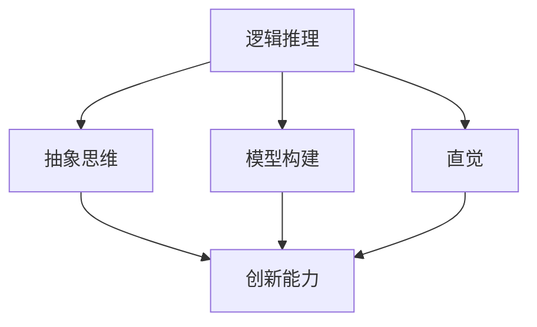

                 

### 引言

数学家的思维特征与创新能力是数学领域研究的重要课题。数学家不仅是数学理论的建构者，也是解决复杂问题的专家，他们的思维方式与创新能力的独特性对数学的发展有着深远的影响。

#### **背景介绍**

数学作为一门基础科学，其重要性不言而喻。它不仅为自然科学、工程学和社会科学提供理论支持，也在信息时代的数据科学和人工智能领域发挥着核心作用。数学家在面对复杂问题时，往往展现出独特的思维方式和创新能力，这些能力不仅有助于数学自身的发展，也推动了其他学科的创新。

#### **核心概念与联系**

数学家的思维方式与创新能力的核心概念包括逻辑推理、抽象思维、模型构建和直觉。这些概念之间有着紧密的联系。例如，逻辑推理是数学思维的基础，而抽象思维则使数学家能够从具体的实例中提炼出普遍的规律。模型构建能力使数学家能够将现实问题抽象为数学问题，而直觉则帮助他们在探索未知领域时找到可能的解决方案。

**Mermaid 流程图：**

#### **创新能力的重要性**

创新能力在数学家的职业生涯中至关重要。它不仅是推动数学前进的动力，也是数学家在学术竞争中脱颖而出的关键。创新能力的培养需要长期的积累和实践，包括对数学理论的深入理解、对数学方法的熟练掌握以及对未知领域的敏锐洞察。

#### **本书目标**

本书旨在深入分析数学家的思维特征与创新能力的本质，通过历史案例研究、理论阐述和实践分析，帮助读者理解数学家的思维方式，并启发他们在数学探索中的创新能力。本书将涵盖数学思维的逻辑性、抽象性和创造性，以及数学家的认知模式和创新能力的构成，旨在为数学领域的教育与研究提供有价值的参考。

### **总结**

在引言部分，我们介绍了数学家的思维特征与创新能力的重要性，并简要阐述了核心概念之间的关系。接下来，本书将详细探讨数学家的思维方式、认知模式以及创新能力的构成，旨在为读者提供一个全面的视角，理解数学家的思维特征与创新能力的本质。

### **作者信息**

作者：AI天才研究院/AI Genius Institute & 禅与计算机程序设计艺术 /Zen And The Art of Computer Programming

---

在接下来的章节中，我们将深入探讨数学家的思维特征，分析其逻辑性、抽象性和创造性，并探讨这些特征如何塑造数学家的认知模式和创新能力。通过详细的理论阐述和实践分析，我们将揭示数学家思维特征与创新能力的奥秘，为读者在数学探索中提供启示和帮助。

