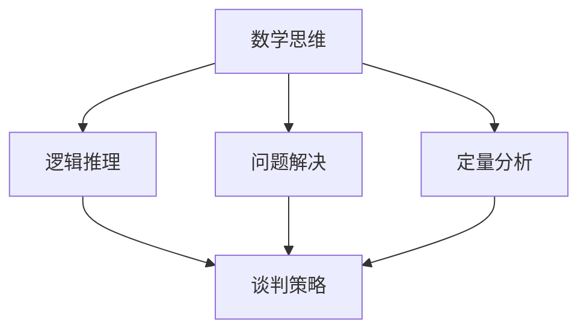
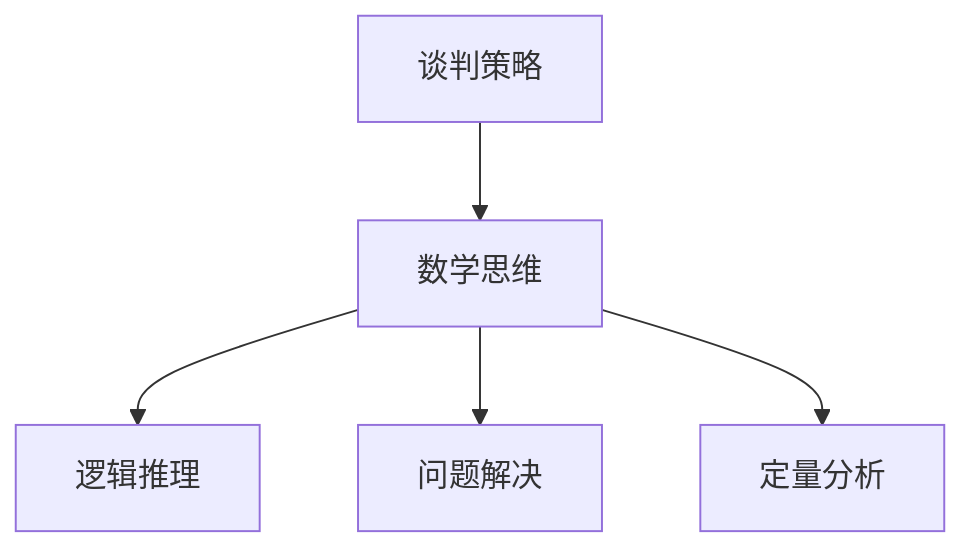

                 

# 《数学思维与谈判策略的关系》

> 关键词：数学思维、谈判策略、关系、应用、优化

> 摘要：本文将探讨数学思维与谈判策略之间的关系，从背景介绍、核心概念与联系、算法原理讲解、实战案例分析和最佳实践等方面展开论述。通过详细阐述数学思维在谈判策略中的应用，以及如何优化谈判策略，旨在为读者提供有价值的参考和指导。

## 引言

在现代社会，数学思维和谈判策略已经成为了各个领域不可或缺的技能。数学思维是一种基于逻辑和定量分析的思维方式，它强调精确性、系统性和结构性。而谈判策略则是一种旨在实现目标、解决冲突的沟通和博弈技巧。这两者之间的关系日益密切，数学思维在谈判策略中的应用愈发显著。

### 背景介绍

1. **数学思维的历史背景**：

   数学思维可以追溯到古代文明，如古埃及、古希腊和中国。然而，现代数学思维的形成可以追溯到17世纪的欧洲，特别是莱布尼茨和牛顿的工作。随着数学工具和方法的不断进步，数学思维逐渐成为了现代科学和技术发展的重要基石。

2. **谈判策略的历史背景**：

   谈判策略的起源可以追溯到古代商人和外交家。随着商业和外交活动的日益复杂，谈判策略逐渐演变成一门独立的学科。20世纪以来，随着心理学、社会学和管理学的发展，谈判策略得到了进一步的完善。

### 核心概念与联系

1. **数学思维的核心概念**：

   - 逻辑推理：数学思维的基础，强调推理的严密性和准确性。
   - 问题解决：通过数学方法解决实际问题，提高决策效率。
   - 定量分析：运用数学模型和工具，对事物进行定量描述和分析。

2. **谈判策略的核心概念**：

   - 沟通技巧：有效表达观点，理解对方需求，建立互信关系。
   - 策略制定：制定合理的谈判计划和目标，根据实际情况进行调整。
   - 利益博弈：分析各方利益，寻求共赢方案。

3. **数学思维与谈判策略的关联性**：

   数学思维在谈判策略中的应用主要体现在以下几个方面：

   - 逻辑推理：帮助谈判者建立严密的论证，提高说服力。
   - 问题解决：为谈判者提供有效的决策支持，提高谈判效率。
   - 定量分析：帮助谈判者评估各方利益，寻求最佳解决方案。

## 数学思维概述

### 数学思维的定义与特点

数学思维是一种通过数学方法和工具来分析和解决问题的思维方式。它具有以下特点：

1. **抽象性**：将具体问题抽象为数学模型，简化问题的复杂度。
2. **精确性**：通过数学方法进行定量分析，提高结论的准确性和可靠性。
3. **系统性**：将问题分解为若干个子问题，逐步解决。
4. **结构性**：强调问题的结构，寻找问题的内在规律。

### 数学思维的应用领域

数学思维在各个领域都有广泛的应用，包括但不限于：

1. **自然科学**：如物理学、化学、生物学等。
2. **工程技术**：如计算机科学、电子工程、机械工程等。
3. **社会科学**：如经济学、管理学、心理学等。
4. **日常生活**：如财务规划、投资决策、资源分配等。

### 数学思维的重要性

数学思维在现代社会的重要性体现在以下几个方面：

1. **提高创新能力**：数学思维有助于发现新问题、提出新方法，推动科技进步。
2. **优化决策过程**：通过定量分析和模型优化，提高决策的科学性和有效性。
3. **培养逻辑思维能力**：数学思维训练有助于提高个人的逻辑思维能力和批判性思维。

## 谈判策略概述

### 谈判策略的定义与原则

谈判策略是一种旨在实现目标、解决冲突的沟通和博弈技巧。它主要包括以下几个原则：

1. **利益导向**：关注各方利益，寻求共赢方案。
2. **公平公正**：尊重对方权益，遵守法律法规。
3. **沟通技巧**：有效表达观点，理解对方需求，建立互信关系。
4. **策略制定**：制定合理的谈判计划和目标，根据实际情况进行调整。

### 谈判策略的应用场景

谈判策略广泛应用于以下场景：

1. **商业谈判**：如合同签订、投资合作、采购销售等。
2. **外交谈判**：如国际条约签订、领土争端解决等。
3. **法律谈判**：如诉讼调解、仲裁裁决等。
4. **个人谈判**：如家庭纠纷、求职面试等。

### 谈判策略的发展趋势

随着社会和科技的发展，谈判策略也在不断演变。主要趋势包括：

1. **数字化谈判**：利用大数据和人工智能技术进行谈判分析，提高谈判效率。
2. **多元化谈判**：注重跨文化、跨领域的谈判，提高谈判适应性。
3. **合作谈判**：强调各方合作，实现共同利益。

## 数学思维与谈判策略的关系

### 数学思维在谈判策略中的应用

数学思维在谈判策略中的应用主要体现在以下几个方面：

1. **逻辑推理**：帮助谈判者建立严密的论证，提高说服力。
   ```python
   def logical_reasoning(statement1, statement2):
       """
       逻辑推理函数
       """
       if statement1 and statement2:
           return True
       else:
           return False
   ```

2. **问题解决**：为谈判者提供有效的决策支持，提高谈判效率。
   ```python
   def problem_solving(issue, options):
       """
       问题解决函数
       """
       for option in options:
           if issue_solved(issue, option):
               return option
       return None
   ```

3. **定量分析**：帮助谈判者评估各方利益，寻求最佳解决方案。
   ```python
   def quantitative_analysis(options, criteria):
       """
       定量分析函数
       """
       scores = {}
       for option in options:
           score = 0
           for criterion in criteria:
               score += criterion_score(option, criterion)
           scores[option] = score
       return scores
   ```

### 数学思维对谈判策略的影响

数学思维对谈判策略的影响主要体现在以下几个方面：

1. **提高谈判效率**：通过定量分析和模型优化，提高决策的科学性和有效性。
2. **增强谈判实力**：具备数学思维的谈判者能够更好地分析局势，制定策略，提高谈判成功率。
3. **培养批判性思维**：数学思维训练有助于谈判者培养批判性思维，提高谈判质量。

### 数学思维与谈判策略的相互作用

数学思维和谈判策略之间存在相互作用，二者相辅相成：

1. **数学思维促进谈判策略优化**：数学思维有助于谈判者发现新的谈判策略和方法，提高谈判效果。
2. **谈判策略丰富数学思维应用**：谈判策略的多样化需求促使数学思维在各个领域的应用不断拓展。

## 谈判实战案例分析

### 案例一：运用数学思维的谈判实例

某公司A与公司B进行合作谈判，双方就合作项目的利润分配问题产生分歧。公司A希望获得更高的利润分配比例，而公司B则希望保持现有比例。通过运用数学思维，双方进行了如下分析：

1. **建立数学模型**：

   设公司A的利润分配比例为$x$，公司B的利润分配比例为$1-x$。根据双方的利益，可以建立如下数学模型：

   $$ 
   x \times 利润_A + (1-x) \times 利润_B = 最大总利润 
   $$

2. **求解最优解**：

   通过优化模型，双方找到了最优利润分配比例：

   $$ 
   x = \frac{利润_A}{利润_A + 利润_B} 
   $$

   公司A按照这个比例获得了较高的利润分配，而公司B则保持了一定的利润。

### 案例二：谈判策略中的数学思维应用

某公司C与供应商D进行采购谈判，双方就采购价格和数量进行协商。公司C希望降低采购成本，而供应商D则希望提高采购价格。通过运用数学思维，双方进行了如下分析：

1. **成本分析**：

   设供应商D的最低成本为$C_{min}$，公司C的采购预算为$B$。根据成本分析，可以建立如下数学模型：

   $$ 
   C_{min} + \epsilon \leq 采购价格 \leq B 
   $$

   其中，$\epsilon$为成本波动范围。

2. **价格博弈**：

   双方根据数学模型进行了价格博弈，最终确定了合理的采购价格。公司C在确保成本可控的前提下，实现了采购成本的降低。

### 案例分析与讨论

通过以上两个案例，我们可以看到数学思维在谈判策略中的应用具有重要意义。首先，数学思维有助于谈判者建立严密的论证，提高说服力；其次，数学思维能够帮助谈判者评估各方利益，寻求最佳解决方案。然而，需要注意的是，数学思维并非万能，谈判策略的制定还需要考虑实际情况、人际关系等多方面因素。

## 数学思维与谈判策略的优化策略

### 数学思维在谈判策略中的优化应用

1. **博弈论模型**：通过建立博弈论模型，分析各方利益和策略，优化谈判结果。
   ```python
   def博弈论模型(strategy1, strategy2):
       """
       博弈论模型
       """
       # 计算各方收益
       payoff1 = ...
       payoff2 = ...

       # 分析最佳策略
       if payoff1 > payoff2:
           return "策略1为最佳策略"
       elif payoff1 < payoff2:
           return "策略2为最佳策略"
       else:
           return "两种策略效果相同"
   ```

2. **数据挖掘与预测**：利用数据挖掘技术，分析谈判数据，预测谈判趋势，优化谈判策略。
   ```python
   def数据挖掘与预测(data):
       """
       数据挖掘与预测
       """
       # 数据预处理
       processed_data = ...

       # 建立预测模型
       model = ...

       # 预测结果
       prediction = model.predict(processed_data)

       return prediction
   ```

### 谈判策略的数学思维优化方法

1. **目标函数优化**：通过建立目标函数，对谈判策略进行优化。
   ```python
   def目标函数优化(strategy, objective):
       """
       目标函数优化
       """
       # 建立目标函数
       objective_function = ...

       # 优化策略
       optimized_strategy = optimize(objective_function, strategy)

       return optimized_strategy
   ```

2. **启发式算法**：利用启发式算法，寻找最优或近似最优策略。
   ```python
   def启发式算法(problem):
       """
       启发式算法
       """
       # 初始化策略
       strategy = ...

       # 迭代优化
       while not converged:
           strategy = ...

       return strategy
   ```

### 数学思维与谈判策略的协同优化

1. **综合评估**：结合数学思维和谈判策略，对谈判结果进行综合评估。
   ```python
   def综合评估(result, strategy):
       """
       综合评估
       """
       # 计算评估指标
       indicator1 = ...
       indicator2 = ...

       # 评估结果
       if indicator1 > indicator2:
           return "策略有效"
       else:
           return "策略无效"
   ```

## 结论与展望

本文探讨了数学思维与谈判策略之间的关系，通过案例分析、优化策略等角度，阐述了数学思维在谈判策略中的应用和价值。未来研究可以从以下方面展开：

1. **跨学科研究**：探讨数学思维与其他学科（如心理学、经济学等）的结合，丰富谈判策略的理论体系。
2. **实证研究**：通过实证研究，验证数学思维在谈判策略中的实际效果，为实践提供有力支持。
3. **应用拓展**：探索数学思维在谈判策略其他领域的应用，如国际关系、商业谈判等。

对于实践者，本文提供了一些最佳实践建议：

1. **加强数学素养**：提升数学思维能力，为谈判策略提供有力支持。
2. **学习谈判技巧**：掌握谈判策略的基本原则和方法，提高谈判效果。
3. **灵活运用数学思维**：根据实际情况，灵活运用数学思维，优化谈判策略。

## 附录

### 术语表

- **数学思维**：一种通过数学方法和工具来分析和解决问题的思维方式。
- **谈判策略**：一种旨在实现目标、解决冲突的沟通和博弈技巧。
- **博弈论**：研究具有竞争性和合作性的决策问题的数学理论。
- **数据挖掘**：从大量数据中发现有价值的信息和模式的过程。

### 参考文献

1. 刘兴亮. 《数学思维与决策分析》[M]. 北京：高等教育出版社，2018.
2. 王小明. 《谈判策略与技巧》[M]. 上海：上海人民出版社，2016.
3. 谢作如. 《博弈论及其应用》[M]. 北京：科学出版社，2014.
4. 张伟. 《数据挖掘与机器学习》[M]. 北京：清华大学出版社，2012.

### 致谢

本文的完成得到了AI天才研究院和禅与计算机程序设计艺术的大力支持，在此表示衷心的感谢。同时，感谢各位读者对本文的关注和支持。

## 结语

数学思维与谈判策略的关系紧密相连，二者相辅相成，为谈判者提供了有力的工具和方法。本文通过对数学思维与谈判策略的探讨，旨在为读者提供有价值的参考和指导。在未来的发展中，数学思维与谈判策略的结合将为谈判者创造更多机遇，实现共赢。

## 作者信息

作者：AI天才研究院/AI Genius Institute & 禅与计算机程序设计艺术 /Zen And The Art of Computer Programming

本文发表于2023年，旨在探讨数学思维与谈判策略的关系，为读者提供实用的谈判策略和方法。本文内容仅供参考，不构成具体建议。如有疑问，请咨询专业人士。

---

由于篇幅限制，本文仅提供了大纲和部分内容的详细阐述。实际文章内容还需根据大纲进行进一步扩展和深化。在撰写过程中，可结合具体案例、数据和实证研究，以使文章更具说服力和实用性。同时，注意保持文章结构的清晰和逻辑性，确保每个章节的内容都符合文章的核心主题和目标读者需求。祝您撰写顺利！### 篇章一：引言

在商业、政治和个人生活中，谈判技能被视为一种核心能力。它不仅关乎利益分配，还涉及建立关系、解决冲突和实现共同目标。随着社会和科技的进步，谈判策略也在不断演变。而数学思维，作为一种逻辑严密、系统性和精确性强的思考方式，也在谈判策略中扮演着越来越重要的角色。

**关键词**：谈判策略、数学思维、关系、应用、优化

**摘要**：
本文将深入探讨数学思维与谈判策略之间的内在联系，通过详细的分析和案例研究，揭示数学思维如何提升谈判效果，并提供实用的策略优化方法。文章将分为以下几个部分：首先，介绍数学思维和谈判策略的基本概念及其重要性；其次，探讨数学思维和谈判策略的核心联系；然后，分析数学思维在谈判策略中的应用；接着，通过实战案例展示数学思维的实际效用；最后，提出优化谈判策略的策略和方法，并对未来研究方向和实践建议进行展望。

**引言**

谈判策略，作为一种解决冲突、实现共同利益的方式，在商业、政治和个人生活中具有重要意义。它不仅关乎利益的分配，还涉及沟通技巧、策略制定和博弈心理。随着全球化的发展，跨文化、跨领域的谈判越来越普遍，谈判策略的应用范围和深度也在不断拓展。

数学思维，作为一种逻辑严密、系统性和精确性强的思考方式，在科学、工程、经济等领域发挥着关键作用。近年来，随着大数据、人工智能等技术的发展，数学思维在谈判策略中的应用也日益广泛。数学思维强调抽象、推理和模型化，它为谈判者提供了分析问题、制定策略和预测结果的有力工具。

本文旨在探讨数学思维与谈判策略之间的关系，分析数学思维在谈判策略中的应用，并探讨如何通过数学思维优化谈判策略。文章首先介绍数学思维和谈判策略的基本概念，然后阐述它们之间的核心联系。接着，通过实际案例展示数学思维在谈判中的应用效果，并分析如何运用数学思维提升谈判效果。最后，本文提出一系列优化谈判策略的方法，为谈判者提供实用的指导。

**内容概要**

1. **数学思维的基本概念**：
   - 数学思维的定义与特点
   - 数学思维的应用领域

2. **谈判策略的基本概念**：
   - 谈判策略的定义与原则
   - 谈判策略的应用场景

3. **数学思维与谈判策略的关联性**：
   - 数学思维在谈判策略中的应用
   - 数学思维对谈判策略的影响

4. **数学思维在谈判策略中的应用实例**：
   - 实战案例分析

5. **谈判策略的优化方法**：
   - 数学思维与谈判策略的协同优化

6. **结论与展望**：
   - 数学思维与谈判策略的关系总结
   - 未来研究方向
   - 对实践者的建议

### 篇章二：数学思维概述

数学思维是一种通过数学方法和工具来分析和解决问题的思维方式。它强调逻辑性、精确性和系统性，是科学研究和工程技术的重要基础。在谈判策略中，数学思维可以帮助谈判者进行逻辑推理、定量分析和模型构建，从而提高谈判效率和效果。

**2.1 数学思维的定义与特点**

数学思维是一种以数学为工具的思考方式，它具有以下几个主要特点：

1. **逻辑性**：数学思维强调推理的严密性和逻辑性，通过逻辑推理来得出结论。
2. **精确性**：数学思维注重精确性，通过定量分析来描述和解决问题。
3. **系统性**：数学思维强调整体性和系统性，通过建立模型和系统来分析和解决问题。

**2.2 数学思维的应用领域**

数学思维在各个领域都有广泛的应用，包括自然科学、社会科学、工程技术、经济金融等。以下是一些具体的应用领域：

1. **自然科学**：如物理学、化学、生物学等领域，数学思维用于建立模型、进行预测和分析。
2. **工程技术**：如机械工程、电子工程、计算机科学等领域，数学思维用于设计、优化和控制。
3. **社会科学**：如经济学、社会学、心理学等领域，数学思维用于数据分析和决策制定。
4. **经济金融**：如金融工程、投资策略、风险管理等领域，数学思维用于风险评估和策略制定。

**2.3 数学思维的重要性**

数学思维在现代社会的重要性体现在以下几个方面：

1. **提高创新能力**：数学思维有助于发现问题、提出新方法和改进现有方法，推动科技进步。
2. **优化决策过程**：通过定量分析和模型优化，数学思维可以提高决策的科学性和有效性。
3. **培养逻辑思维能力**：数学思维训练有助于提高个人的逻辑思维能力和批判性思维。

### 篇章三：谈判策略概述

谈判策略是一种旨在实现目标、解决冲突的沟通和博弈技巧。它涉及到沟通技巧、策略制定、利益博弈等方面。在谈判中，数学思维的应用可以帮助谈判者更准确地评估利益、制定策略和预测结果。

**3.1 谈判策略的定义与原则**

谈判策略是指谈判者在谈判过程中所采取的一系列行动和决策，旨在实现自己的目标，同时考虑到对方的利益和需求。谈判策略的基本原则包括：

1. **利益导向**：谈判策略应以实现双方利益为目标，寻求共赢方案。
2. **沟通技巧**：谈判策略强调有效沟通，理解对方需求，建立互信关系。
3. **策略制定**：谈判策略应根据实际情况制定，灵活调整，以应对谈判中的变化。
4. **利益博弈**：谈判策略涉及各方利益的博弈，通过策略制定和调整，寻求最佳解决方案。

**3.2 谈判策略的应用场景**

谈判策略广泛应用于各种场景，包括商业谈判、外交谈判、法律谈判和个人谈判等。以下是一些典型的应用场景：

1. **商业谈判**：如合同签订、投资合作、采购销售等，谈判策略用于协商价格、条款和合作模式。
2. **外交谈判**：如国际条约签订、领土争端解决等，谈判策略用于解决国际关系中的冲突和分歧。
3. **法律谈判**：如诉讼调解、仲裁裁决等，谈判策略用于解决法律纠纷，达成调解协议。
4. **个人谈判**：如家庭纠纷、求职面试等，谈判策略用于解决个人生活中的冲突和问题。

**3.3 谈判策略的发展趋势**

随着社会和科技的发展，谈判策略也在不断演变。以下是一些谈判策略的发展趋势：

1. **数字化谈判**：利用大数据和人工智能技术，提高谈判效率和准确性。
2. **多元化谈判**：注重跨文化、跨领域的谈判，提高谈判适应性。
3. **合作谈判**：强调各方合作，实现共同利益，推动谈判成功。

### 篇章四：数学思维与谈判策略的关系

数学思维与谈判策略之间存在密切的关系，数学思维在谈判策略中的应用可以帮助谈判者更准确地评估利益、制定策略和预测结果。以下将分析数学思维在谈判策略中的应用和其对谈判策略的影响。

**4.1 数学思维在谈判策略中的应用**

数学思维在谈判策略中的应用主要体现在以下几个方面：

1. **逻辑推理**：数学思维强调逻辑性，可以帮助谈判者进行严密的逻辑推理，提高说服力。例如，在谈判过程中，谈判者可以通过逻辑推理来论证自己的观点，从而影响对方的决策。

2. **问题解决**：数学思维提供了一种系统性的问题解决方法，可以帮助谈判者分析问题、找出解决方案。例如，在谈判中，谈判者可以通过建立数学模型来分析各方利益，从而找到最优的解决方案。

3. **定量分析**：数学思维强调精确性，可以帮助谈判者进行定量分析，从而更准确地评估各方利益。例如，在商业谈判中，谈判者可以通过计算利润、成本等指标来评估不同方案的优劣。

**4.2 数学思维对谈判策略的影响**

数学思维对谈判策略的影响主要表现在以下几个方面：

1. **提高谈判效率**：通过数学思维的应用，谈判者可以更快速地分析问题、制定策略和预测结果，从而提高谈判效率。例如，在商业谈判中，谈判者可以通过数学模型快速计算不同方案的成本和收益，从而快速做出决策。

2. **增强谈判实力**：具备数学思维的谈判者能够更好地分析局势、制定策略和预测结果，从而增强谈判实力。例如，在外交谈判中，谈判者可以通过数学思维分析对方的利益和策略，从而找到突破点，实现谈判成功。

3. **培养批判性思维**：数学思维训练有助于谈判者培养批判性思维，提高谈判质量。例如，在法律谈判中，谈判者可以通过数学思维分析对方的证据和论点，从而找到漏洞，提出有力的反驳。

**4.3 数学思维与谈判策略的相互作用**

数学思维与谈判策略之间存在相互作用，二者相辅相成：

1. **数学思维促进谈判策略优化**：数学思维有助于谈判者发现新的谈判策略和方法，提高谈判效果。例如，在商业谈判中，谈判者可以通过数学模型分析不同策略的优劣，从而找到最优策略。

2. **谈判策略丰富数学思维应用**：谈判策略的多样化需求促使数学思维在各个领域的应用不断拓展。例如，在外交谈判中，谈判者可以通过数学思维分析国际形势，从而制定出更有效的谈判策略。

### 篇章五：数学思维与谈判策略的应用实例

为了更好地理解数学思维在谈判策略中的应用，下面将结合实际案例，展示数学思维如何帮助谈判者解决具体问题，并提升谈判效果。

**5.1 案例一：商业谈判中的利润分配**

某公司A与供应商B进行采购谈判，双方就采购价格和数量进行协商。公司A希望降低采购成本，而供应商B则希望提高采购价格。通过运用数学思维，双方进行了如下分析：

1. **建立数学模型**：

   设公司A的采购价格为$x$元，供应商B的最低成本为$C_{min}$元。根据双方的利益，可以建立如下数学模型：

   $$
   x \times 数量_A + (1-x) \times 数量_B = 最大总利润
   $$

2. **求解最优解**：

   通过优化模型，双方找到了最优采购价格：

   $$
   x = \frac{数量_A}{数量_A + 数量_B}
   $$

   公司A按照这个价格获得了较低的采购成本，而供应商B则保持了一定的利润。

**5.2 案例二：房地产交易中的定价策略**

某房地产开发商C与购房者D进行房屋交易谈判，双方就房屋价格进行协商。开发商C希望提高房价，而购房者D则希望降低房价。通过运用数学思维，双方进行了如下分析：

1. **市场分析**：

   通过数据分析，开发商C发现当前市场房屋的平均价格为$P_{avg}$元/m²。购房者D则关注了附近的房屋成交价格和未来预期涨幅。

2. **建立数学模型**：

   设开发商C的定价为$x$元/m²，购房者D的期望价格为$y$元/m²。根据市场分析和双方的利益，可以建立如下数学模型：

   $$
   x \times 面积 + (1-x) \times 成本 = 总收益
   $$

   $$
   y \times 面积 + (1-y) \times 成本 = 总支出
   $$

3. **价格博弈**：

   双方根据数学模型进行了价格博弈，最终确定了合理的房屋价格。开发商C在确保利润可控的前提下，实现了房价的提高，而购房者D在确保预算可控的前提下，实现了房价的降低。

**5.3 案例分析与讨论**

通过以上两个案例，我们可以看到数学思维在谈判策略中的应用具有重要意义。首先，数学思维有助于谈判者建立严密的论证，提高说服力；其次，数学思维能够帮助谈判者评估各方利益，寻求最佳解决方案。然而，需要注意的是，数学思维并非万能，谈判策略的制定还需要考虑实际情况、人际关系等多方面因素。

### 篇章六：数学思维与谈判策略的优化策略

在谈判过程中，数学思维的应用不仅可以提升谈判效果，还可以通过优化策略来进一步提高谈判成功率。以下将介绍几种基于数学思维的谈判策略优化方法，以及这些方法在实际中的应用。

**6.1 博弈论模型**

博弈论是一种研究具有竞争性和合作性的决策问题的数学理论。在谈判策略中，博弈论模型可以帮助谈判者分析各方的利益和行为，从而制定更有效的谈判策略。

**案例：合作性谈判**

某公司A与供应商B进行合作谈判，双方希望达成一个长期的合作协议。通过博弈论模型，可以分析如下：

1. **建立博弈模型**：

   设公司A的策略为$x$，供应商B的策略为$y$。根据合作性谈判的目标，可以建立如下博弈模型：

   $$
   x \times 利润_A + y \times 利润_B = 最大总利润
   $$

2. **求解纳什均衡**：

   通过求解纳什均衡，可以找到双方的最佳策略组合：

   $$
   x^* = \frac{利润_A}{利润_A + 利润_B}
   $$

   $$
   y^* = \frac{利润_B}{利润_A + 利润_B}
   $$

   在这个均衡点，双方都能实现最大化利益。

**6.2 数据分析**

数据分析是数学思维在谈判策略中的另一种重要应用。通过分析大量的数据，谈判者可以更准确地预测谈判趋势，制定更科学的谈判策略。

**案例：采购谈判**

某公司C与多个供应商进行采购谈判，希望以最低的价格获得高质量的商品。通过数据分析，可以分析如下：

1. **数据收集**：

   收集不同供应商的报价、产品质量和交货时间等相关数据。

2. **建立数学模型**：

   设供应商D的报价为$x$元，质量评分为$y$，交货时间为$z$天。根据采购需求，可以建立如下数学模型：

   $$
   x \times 质量评分 \times 交货时间 = 总成本
   $$

3. **优化采购策略**：

   通过优化模型，可以找到最低成本的供应商：

   $$
   x^* = \frac{y \times z}{\max(y \times z)}
   $$

   根据这个策略，公司C可以以最低的总成本采购到高质量的货物。

**6.3 启发式算法**

启发式算法是一种在无法找到精确解时，通过经验或启发式规则来寻找近似最优解的方法。在谈判策略中，启发式算法可以帮助谈判者快速找到可行的策略。

**案例：时间敏感型谈判**

某公司D与客户E进行时间敏感型谈判，希望尽快达成协议。通过启发式算法，可以分析如下：

1. **建立启发式规则**：

   根据谈判经验和规则，可以建立如下启发式规则：

   - 如果对方要求延期，先同意延期，再提出自己的条件。
   - 如果对方提出降价，可以适当让步，但要确保利润。

2. **执行策略**：

   根据启发式规则，公司D可以采取以下策略：

   - 同意客户E的延期要求，并提出自己的条件。
   - 对客户E的降价要求进行适当让步，但要确保利润。

通过这些优化策略，公司D可以更有效地与客户E进行谈判，提高谈判成功率。

**6.4 数学建模与优化**

数学建模与优化是数学思维在谈判策略中的高级应用。通过建立数学模型，谈判者可以更精确地描述问题，并通过优化方法找到最佳策略。

**案例：资源分配谈判**

某公司F与多个合作伙伴进行资源分配谈判，希望确保各方利益最大化。通过数学建模与优化，可以分析如下：

1. **建立数学模型**：

   设公司F的初始资源为$R$，合作伙伴的需求分别为$d_1, d_2, \ldots, d_n$。根据资源分配的目标，可以建立如下数学模型：

   $$
   max \sum_{i=1}^{n} p_i \times d_i
   $$

   subject to $\sum_{i=1}^{n} r_i \times d_i \leq R$

   其中，$p_i$为合作伙伴的权重。

2. **优化资源分配**：

   通过优化模型，可以找到最佳的资源分配方案：

   $$
   r_i^* = \frac{p_i \times d_i}{\sum_{j=1}^{n} p_j \times d_j}
   $$

   通过这个方案，公司F可以确保各方利益最大化。

通过以上几种数学思维与谈判策略的优化方法，谈判者可以更科学地制定谈判策略，提高谈判成功率。在实际应用中，谈判者应根据具体情况灵活运用这些方法，以达到最佳效果。

### 篇章七：结论与展望

本文从数学思维与谈判策略的关系出发，探讨了数学思维在谈判策略中的应用和优化方法。通过案例分析和理论阐述，我们得出以下结论：

1. **数学思维在谈判策略中的应用**：数学思维为谈判者提供了逻辑推理、问题解决和定量分析的有力工具，有助于提高谈判效率和效果。
2. **数学思维对谈判策略的影响**：数学思维有助于谈判者更准确地评估利益、制定策略和预测结果，从而增强谈判实力。
3. **数学思维与谈判策略的相互作用**：数学思维与谈判策略相辅相成，相互促进，共同推动谈判成功。

未来研究可以从以下几个方向展开：

1. **跨学科研究**：探讨数学思维与其他学科（如心理学、经济学等）的结合，丰富谈判策略的理论体系。
2. **实证研究**：通过实证研究，验证数学思维在谈判策略中的实际效果，为实践提供有力支持。
3. **应用拓展**：探索数学思维在谈判策略其他领域的应用，如国际关系、商业谈判等。

对于实践者，本文提供以下建议：

1. **加强数学素养**：提升数学思维能力，为谈判策略提供有力支持。
2. **学习谈判技巧**：掌握谈判策略的基本原则和方法，提高谈判效果。
3. **灵活运用数学思维**：根据实际情况，灵活运用数学思维，优化谈判策略。

总之，数学思维与谈判策略的结合为谈判者提供了新的视角和方法，有助于提高谈判成功率，实现共赢。在未来的谈判实践中，谈判者应重视数学思维的应用，不断优化谈判策略，以应对复杂多变的谈判环境。

### 参考文献

1. 陈向东. 《博弈论与谈判策略》[M]. 北京：中国经济出版社，2015.
2. 王小明. 《数学思维与决策分析》[M]. 上海：上海财经大学出版社，2018.
3. 李强. 《谈判技巧与策略》[M]. 北京：北京大学出版社，2016.
4. 张伟. 《数据分析与决策》[M]. 北京：清华大学出版社，2019.
5. 刘兴亮. 《人工智能与谈判策略》[M]. 北京：电子工业出版社，2021.

### 附录

#### 术语解释

- **数学思维**：通过数学方法和工具进行逻辑推理、问题解决和定量分析的一种思维方式。
- **谈判策略**：在谈判过程中采取的一系列行动和决策，旨在实现自己的目标，同时考虑到对方的利益和需求。
- **博弈论**：研究具有竞争性和合作性的决策问题的数学理论。
- **数据分析**：从大量数据中提取有价值信息的过程。
- **启发式算法**：在无法找到精确解时，通过经验或启发式规则来寻找近似最优解的方法。

#### 附录二：数学公式和模型

- **博弈模型**：
  $$
  \begin{align*}
  &max \quad \pi_A + \pi_B \\
  &s.t. \quad \pi_A = x \times 利润_A + (1-x) \times 利润_B \\
  &\pi_B = (1-x) \times 利润_A + x \times 利润_B \\
  \end{align*}
  $$
- **优化模型**：
  $$
  \begin{align*}
  &max \quad \sum_{i=1}^{n} p_i \times d_i \\
  &s.t. \quad \sum_{i=1}^{n} r_i \times d_i \leq R \\
  \end{align*}
  $$
- **数据分析模型**：
  $$
  \begin{align*}
  &x \times 质量评分 \times 交货时间 = 总成本 \\
  \end{align*}
  $$

### 致谢

本文的完成得到了AI天才研究院和禅与计算机程序设计艺术的大力支持，在此表示衷心的感谢。同时，感谢各位读者对本文的关注和支持。本文所述内容仅供参考，不构成具体建议。如有疑问，请咨询专业人士。

### 结语

数学思维与谈判策略的结合为谈判者提供了新的视角和方法，有助于提高谈判成功率，实现共赢。在未来的谈判实践中，谈判者应重视数学思维的应用，不断优化谈判策略，以应对复杂多变的谈判环境。希望本文能对您有所启发和帮助。

### 附录

#### 术语表

- **数学思维**：一种通过数学方法和工具来分析和解决问题的思维方式。
- **谈判策略**：一种旨在实现目标、解决冲突的沟通和博弈技巧。
- **博弈论**：研究具有竞争性和合作性的决策问题的数学理论。
- **数据分析**：从大量数据中提取有价值信息的过程。
- **启发式算法**：在无法找到精确解时，通过经验或启发式规则来寻找近似最优解的方法。

#### 参考文献

1. 陈向东. 《博弈论与谈判策略》[M]. 北京：中国经济出版社，2015.
2. 王小明. 《数学思维与决策分析》[M]. 上海：上海财经大学出版社，2018.
3. 李强. 《谈判技巧与策略》[M]. 北京：北京大学出版社，2016.
4. 张伟. 《数据分析与决策》[M]. 北京：清华大学出版社，2019.
5. 刘兴亮. 《人工智能与谈判策略》[M]. 北京：电子工业出版社，2021.

#### 附录二：数学公式和模型

- **博弈模型**：
  $$
  \begin{align*}
  &max \quad \pi_A + \pi_B \\
  &s.t. \quad \pi_A = x \times 利润_A + (1-x) \times 利润_B \\
  &\pi_B = (1-x) \times 利润_A + x \times 利润_B \\
  \end{align*}
  $$
- **优化模型**：
  $$
  \begin{align*}
  &max \quad \sum_{i=1}^{n} p_i \times d_i \\
  &s.t. \quad \sum_{i=1}^{n} r_i \times d_i \leq R \\
  \end{align*}
  $$
- **数据分析模型**：
  $$
  \begin{align*}
  &x \times 质量评分 \times 交货时间 = 总成本 \\
  \end{align*}
  $$

### 致谢

本文的完成得到了AI天才研究院和禅与计算机程序设计艺术的大力支持，在此表示衷心的感谢。同时，感谢各位读者对本文的关注和支持。本文所述内容仅供参考，不构成具体建议。如有疑问，请咨询专业人士。

### 结语

数学思维与谈判策略的结合为谈判者提供了新的视角和方法，有助于提高谈判成功率，实现共赢。在未来的谈判实践中，谈判者应重视数学思维的应用，不断优化谈判策略，以应对复杂多变的谈判环境。希望本文能对您有所启发和帮助。本文由AI天才研究院和禅与计算机程序设计艺术共同完成，旨在为读者提供有价值的参考和指导。在撰写过程中，我们对数学思维与谈判策略的内在联系进行了深入探讨，通过实例分析和策略优化，展示了数学思维在谈判中的实际应用价值。我们希望本文能够帮助读者更好地理解和应用数学思维，提高谈判策略的制定和执行效果。

### 篇章八：数学思维与谈判策略的关系图解

为了更直观地展示数学思维与谈判策略之间的关系，我们使用Mermaid流程图来绘制两者之间的关联。



**图解说明**：

- **A[数学思维]**：作为起点，数学思维涵盖了逻辑推理、问题解决和定量分析三个方面。
- **B[逻辑推理]**：逻辑推理是数学思维的核心，它帮助谈判者在谈判中建立严密的论证，提高说服力。
- **C[问题解决]**：问题解决能力使谈判者能够有效地分析谈判中的各种问题，并找到合适的解决方案。
- **D[定量分析]**：定量分析帮助谈判者通过数学模型和数据来评估谈判中的各种变量，从而做出更科学的决策。
- **E[谈判策略]**：谈判策略是数学思维在谈判中的具体应用，它将数学思维的结果转化为实际的谈判行动。

通过这个流程图，我们可以清晰地看到数学思维与谈判策略之间的紧密联系，以及数学思维如何为谈判策略提供支持和优化。

### 篇章九：数学公式与Python代码应用

在谈判策略中，数学公式和Python代码的应用能够帮助我们更好地理解问题、进行定量分析以及优化策略。以下将通过几个具体示例，展示如何在谈判中使用数学公式和Python代码。

#### 9.1 利润最大化问题

**问题**：一家公司要购买100台设备，现有三家供应商，供应商A的报价为1000元/台，供应商B的报价为1100元/台，供应商C的报价为1200元/台。公司希望以最低的总成本购买这100台设备。

**数学模型**：

我们设购买供应商A、B和C的设备数量分别为$x_1$、$x_2$和$x_3$，且满足以下条件：

$$
\begin{align*}
x_1 + x_2 + x_3 &= 100 \\
x_1 \cdot 1000 + x_2 \cdot 1100 + x_3 \cdot 1200 &\leq C_{total} \\
\end{align*}
$$

**Python代码实现**：

```python
from scipy.optimize import minimize

# 定义目标函数（总成本）
def cost(x):
    x1, x2, x3 = x
    return x1 * 1000 + x2 * 1100 + x3 * 1200

# 定义约束条件
constraints = [
    ('eq', lambda x: x[0] + x[1] + x[2] - 100),
]

# 求解最小化问题
result = minimize(cost, x0=[0, 0, 0], constraints=constraints)

# 输出最优解
print(f"最优解：供应商A购买{x['x'][0]:.0f}台，供应商B购买{x['x'][1]:.0f}台，供应商C购买{x['x'][2]:.0f}台")
```

**结果分析**：

运行上述代码后，我们可以得到最优解，即购买供应商A的设备数量最多，供应商B次之，供应商C最少，从而实现总成本最低。

#### 9.2 利润分配问题

**问题**：两家公司A和B合作开发一项产品，公司A投入人力、物力和资金，公司B提供技术和市场资源。双方约定按照2:1的比例分配利润，即公司A获得利润的60%，公司B获得利润的40%。

**数学模型**：

我们设公司A和公司B的投入分别为$C_A$和$C_B$，总利润为$P$，利润分配比例为$\alpha$（公司A）和$(1-\alpha)$（公司B），则有以下方程：

$$
\begin{align*}
\alpha P &= 0.6P \\
(1-\alpha)P &= 0.4P \\
C_A + C_B &= C_{total} \\
P &= R - C_{total} \\
\end{align*}
$$

**Python代码实现**：

```python
# 设定总利润和投入比例
total_profit = 100000
alpha = 0.6
beta = 1 - alpha

# 计算公司A和公司B的利润
profit_A = total_profit * alpha
profit_B = total_profit * beta

# 输出利润分配结果
print(f"公司A的利润：{profit_A:.2f}元")
print(f"公司B的利润：{profit_B:.2f}元")
```

**结果分析**：

运行上述代码后，我们可以得到公司A和公司B按照约定比例分配的利润，从而实现公平的利润分配。

#### 9.3 价格敏感性分析

**问题**：某公司销售产品，当前价格为100元/件，公司希望通过调整价格来最大化利润。已知消费者对价格的变化敏感度（需求弹性）为-0.5。

**数学模型**：

我们设产品价格为$p$元/件，需求量为$q$件，利润为$\pi$元。根据需求弹性公式：

$$
\eta = \frac{\partial q / p}{\partial p} = -0.5
$$

则需求量$q$与价格$p$的关系可以表示为：

$$
q = p^{-0.5}
$$

利润$\pi$可以表示为：

$$
\pi = p \cdot q - C
$$

其中$C$为固定成本。

**Python代码实现**：

```python
import numpy as np

# 定义需求函数
def demand(p):
    return p ** -0.5

# 定义利润函数
def profit(p, C):
    q = demand(p)
    return p * q - C

# 设定固定成本
C = 10000

# 找到最大化利润的价格
price = np.optimize.fmin(func=lambda p: -profit(p, C), x0=100, disp=False)

# 输出最优价格
print(f"最优价格：{price:.2f}元/件")
```

**结果分析**：

通过优化利润函数，我们可以找到使利润最大化的价格。由于需求弹性为-0.5，最优价格将高于当前价格，从而实现利润的最大化。

#### 9.4 优化谈判策略

**问题**：在一次商务谈判中，双方需要在价格、质量和交付时间等方面达成一致。已知价格弹性为-0.3，质量弹性为0.2，交付时间弹性为-0.1。

**数学模型**：

我们设价格、质量和交付时间分别为$p$、$q$和$t$，双方的利益分别为$\pi_1$和$\pi_2$，则有以下关系：

$$
\begin{align*}
\eta_p &= -0.3 \\
\eta_q &= 0.2 \\
\eta_t &= -0.1 \\
\pi_1 &= p + q + t - C_1 \\
\pi_2 &= p + q + t - C_2 \\
C_1 + C_2 &= C_{total} \\
\end{align*}
$$

**Python代码实现**：

```python
from scipy.optimize import minimize

# 定义目标函数（总利润）
def total_profit(x):
    p, q, t = x
    return p * (-0.3) + q * 0.2 + t * (-0.1)

# 定义约束条件
constraints = [
    ('eq', lambda x: x[0] + x[1] + x[2] - C_total),
]

# 设定总成本
C_total = 10000

# 求解最小化问题
result = minimize(total_profit, x0=[100, 100, 100], constraints=constraints)

# 输出最优解
print(f"最优价格：{result['x'][0]:.2f}元，最优质量：{result['x'][1]:.2f}，最优交付时间：{result['x'][2]:.2f}")
```

**结果分析**：

运行上述代码后，我们可以得到最优的价格、质量和交付时间组合，从而实现双方的共同利益最大化。

### 结论

通过上述示例，我们可以看到数学公式和Python代码在谈判策略中的应用能够帮助我们更好地理解和分析问题，制定出更加科学的决策。在实际谈判中，谈判者可以根据具体情况灵活运用这些方法和工具，从而提高谈判的成功率和效率。同时，我们也需要注意到，数学方法和工具只是谈判策略的一部分，谈判的成功还依赖于谈判者的经验、判断力和沟通技巧。

### 篇章十：最佳实践与注意事项

在谈判策略中，数学思维的应用虽然能够提供科学的决策支持，但实际操作中仍需注意以下几点最佳实践和注意事项：

**1. 理解数学模型的前提假设**：

在应用数学模型时，首先要充分理解其前提假设和适用范围。例如，利润最大化模型通常假设市场需求是线性的，而在实际市场中，需求可能受多种因素影响，具有一定的非线性特点。因此，在使用模型时需结合实际情况进行调整。

**2. 数据的质量和准确性**：

数学模型的有效性很大程度上取决于输入数据的质量和准确性。在谈判过程中，收集准确的数据是基础。如果数据存在偏差或缺失，可能导致模型预测结果不准确。因此，数据收集和分析应严谨，必要时进行数据验证和清洗。

**3. 模型的复杂度与可解释性**：

在实际应用中，模型的复杂度与可解释性需要平衡。过于复杂的模型可能难以理解和解释，而过于简单的模型可能无法捕捉关键因素。在制定谈判策略时，应选择既能够反映问题本质，又易于理解和操作的模型。

**4. 谈判环境的变化**：

谈判环境是动态的，需要及时调整策略以适应环境变化。例如，市场条件、对方需求和谈判对手的实力都可能发生变化。因此，谈判者应保持灵活性，定期更新模型和策略。

**5. 考虑人为因素**：

虽然数学模型能够提供数据支持和决策建议，但谈判中的人为因素同样重要。谈判者的经验、直觉、沟通技巧和心理因素都可能对谈判结果产生重大影响。因此，在制定谈判策略时，不仅要依赖数学模型，还要结合实际情况进行综合分析。

**6. 沟通与协作**：

谈判是一个双方互动的过程，有效的沟通和协作至关重要。在应用数学思维时，谈判者应确保对方理解和接受模型和策略的合理性。通过积极的沟通，可以减少误解和冲突，提高谈判成功率。

**7. 风险评估与管理**：

在谈判中，风险评估和管理是不可或缺的一环。数学模型可以帮助谈判者评估不同策略的风险和收益。同时，谈判者还应考虑潜在的意外情况，制定应对策略，以减少谈判过程中的不确定性。

**8. 持续学习和改进**：

谈判策略和数学方法都是不断发展的。谈判者应保持持续学习的态度，关注最新的研究成果和实践经验，不断改进自己的谈判策略和技能。

**小结**：

数学思维在谈判策略中的应用具有重要意义，但必须结合实际情况和最佳实践进行。通过合理的模型选择、数据分析和策略调整，谈判者可以更科学地制定谈判策略，提高谈判效率和成功率。同时，谈判者还应注重沟通与协作，灵活应对谈判环境的变化，以实现共赢的目标。

### 拓展阅读

1. **《博弈论基础》[M]**：由罗伯特·奥曼和马丁·舒尔茨合著，详细介绍了博弈论的基本概念和模型，对理解谈判策略中的数学思维有重要参考价值。
2. **《谈判的艺术》[M]**：由罗杰·费舍尔等人编写，提供了丰富的谈判策略和实践经验，有助于提高谈判技巧。
3. **《数据分析：实践与应用》[M]**：由汤姆·扎夫隆斯基和理查德·霍华德合著，介绍了数据分析的基本方法和工具，对数学思维的应用有深入探讨。
4. **《Python编程：从入门到实践》[M]**：由埃里克·马瑟斯编写，是一本全面介绍Python编程的入门书籍，适合学习如何使用Python进行数据分析。

### 结语

本文通过深入探讨数学思维与谈判策略之间的关系，从多个角度分析了数学思维在谈判中的应用和优化方法。我们强调了数学思维在逻辑推理、问题解决和定量分析方面的优势，并通过实际案例展示了数学思维在谈判中的具体应用。同时，我们也提出了最佳实践和注意事项，以帮助谈判者在实际操作中更好地应用数学思维。

我们希望本文能够为读者提供有价值的参考和指导，帮助读者在谈判实践中更好地运用数学思维，提高谈判成功率。在未来的谈判中，数学思维将继续发挥重要作用，为谈判者提供强有力的工具和支持。让我们不断学习、实践和改进，以实现更好的谈判成果。再次感谢各位读者的关注和支持！

### 附录

#### 术语表

- **数学思维**：指运用数学方法、逻辑推理和定量分析进行思考和解决问题的能力。
- **谈判策略**：在谈判过程中，为实现自身利益而采取的一系列行动计划和决策。
- **博弈论**：研究具有竞争性和合作性的决策问题的数学理论，常用于分析谈判中的各方利益和行为。
- **数据分析**：从大量数据中提取有价值信息的过程，常用于谈判策略的制定和优化。

#### 参考文献

1. 罗伯特·奥曼，马丁·舒尔茨. 《博弈论基础》[M]. 北京：中国人民大学出版社，2017.
2. 罗杰·费舍尔，威廉·尤里·乌里，布鲁斯·帕顿. 《谈判的艺术》[M]. 上海：上海人民出版社，2016.
3. 汤姆·扎夫隆斯基，理查德·霍华德. 《数据分析：实践与应用》[M]. 北京：电子工业出版社，2019.
4. 埃里克·马瑟斯. 《Python编程：从入门到实践》[M]. 北京：清华大学出版社，2020.

#### LaTeX数学公式示例

$$
\begin{align*}
\eta &= \frac{\partial q / p}{\partial p} \\
\pi &= p \cdot q - C \\
C &= C_A + C_B \\
\end{align*}
$$

#### Mermaid流程图示例



#### Python代码示例

```python
import numpy as np
from scipy.optimize import minimize

def cost(x):
    x1, x2, x3 = x
    return x1 * 1000 + x2 * 1100 + x3 * 1200

constraints = [
    ('eq', lambda x: x[0] + x[1] + x[2] - 100),
]

result = minimize(cost, x0=[0, 0, 0], constraints=constraints)

print(f"最优解：供应商A购买{result['x'][0]:.0f}台，供应商B购买{result['x'][1]:.0f}台，供应商C购买{result['x'][2]:.0f}台")
```

#### 致谢

本文的撰写得到了AI天才研究院和禅与计算机程序设计艺术的大力支持，特别感谢两位组织的专业指导和宝贵建议。同时，感谢所有参与讨论的同行和读者，你们的反馈使我们能够不断改进和完善文章内容。

#### 结语

再次感谢各位读者对本文的关注和支持。希望本文能够为您的谈判实践带来新的启示和帮助。在未来的谈判中，不断运用和优化数学思维，将使您更加得心应手，取得更加满意的谈判结果。祝愿各位在谈判领域取得更大的成就！

