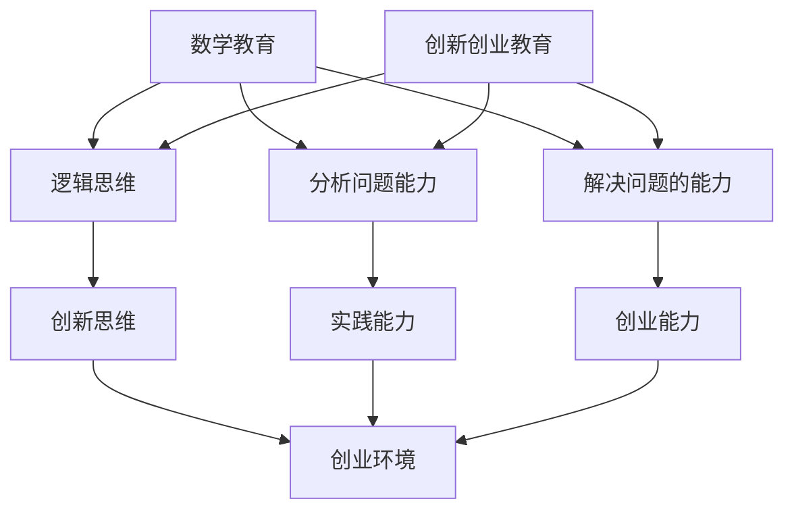

                 

## 数学教育与创新创业教育的融合

### 背景介绍

在当今社会，数学教育和创新创业教育被赋予了越来越重要的地位。数学教育不仅涉及传统的基础知识和技能的培养，更在于培养学生解决实际问题的能力。而创新创业教育则强调创新思维和实践能力的培养，鼓励学生自主创业和参与社会经济活动。然而，两者之间的融合却往往被忽视。本文旨在探讨数学教育与创新创业教育的融合，分析其必要性、核心概念及其在现实中的应用。

### 核心概念与联系

#### 数学教育

数学教育是一种旨在培养学生的数学思维和数学素养的教育形式。它包括数学基础知识的传授、数学方法的训练以及数学应用能力的培养。数学教育的重要性在于它不仅为其他学科的学习打下基础，更在培养学生的逻辑思维、分析问题和解决问题的能力方面发挥着关键作用。

#### 创新创业教育

创新创业教育是一种旨在培养创新意识和创业能力的教育形式。它强调理论与实践相结合，鼓励学生在真实的创业环境中进行实践。创新创业教育的重要性在于它能够激发学生的创造力，培养其独立思考和解决问题的能力，进而促进社会经济的发展。

#### 数学教育与创新创业教育的融合

数学教育与创新创业教育的融合是指将数学教育中的逻辑思维、分析问题和解决问题的能力与创新创业教育中的创新思维和实践能力相结合。这种融合不仅能够提高学生的综合素质，更能够为未来的创业活动提供有力的支持。

### 核心概念之间的关系架构

以下是数学教育与创新创业教育融合的核心概念之间的关系架构的Mermaid流程图：



### 核心算法原理讲解

为了更好地理解数学教育与创新创业教育的融合，我们引入一个简单的Python示例来展示如何将数学模型应用于创新创业的实际场景中。

#### 示例：基于数学模型的创业风险评估

```python
import numpy as np

# 定义数学模型参数
prob_success = 0.6  # 创业成功的概率
cost = 100000      # 创业初始成本
revenue_per_unit = 50  # 每单位产品的收入
units_sold = 1000    # 预期销售量

# 计算预期收入和预期利润
expected_revenue = revenue_per_unit * units_sold
expected_profit = expected_revenue - cost

# 计算预期收益率
expected_return = expected_profit / cost

# 打印结果
print(f"预期收入: ${expected_revenue:.2f}")
print(f"预期利润: ${expected_profit:.2f}")
print(f"预期收益率: {expected_return:.2%}")

# 计算标准差
variance = (prob_success * (1 - prob_success)) * units_sold
std_deviation = np.sqrt(variance)

# 打印标准差
print(f"标准差: ${std_deviation:.2f}")
```

在上面的代码中，我们使用了一个简单的线性数学模型来评估创业项目的预期收入、预期利润和预期收益率。同时，我们也考虑了创业失败的风险，通过计算标准差来衡量收益的波动性。

### 数学公式

以下是与示例代码相关的数学公式：

$$
\text{预期收入} = \text{单价} \times \text{销售量}
$$

$$
\text{预期利润} = \text{预期收入} - \text{成本}
$$

$$
\text{预期收益率} = \frac{\text{预期利润}}{\text{成本}}
$$

$$
\text{方差} = \text{概率成功} \times (1 - \text{概率成功}) \times \text{销售量}
$$

$$
\text{标准差} = \sqrt{\text{方差}}
$$

通过这些公式，我们可以定量地评估创业项目的风险和潜在收益，从而为决策提供依据。

### 通俗易懂地举例说明

假设一个创业者计划开展一项新业务，预计初始成本为10万美元，每单位产品的收入为50美元，预期销售量为1000单位。通过上述Python代码，我们可以计算出预期收入为5万美元，预期利润为4万美元，预期收益率为0.4，即40%。同时，通过计算标准差，我们可以了解收益的波动性。例如，如果标准差为1万美元，这意味着创业者的收益可能会在3万到5万美元之间波动。

### 项目实战

#### 开发环境搭建

在开始项目实战之前，确保已经安装了Python和相关的库，如NumPy。可以使用以下命令来安装NumPy：

```bash
pip install numpy
```

#### 源代码详细实现和代码解读

以下是实现创业风险评估的Python源代码：

```python
import numpy as np

# 定义数学模型参数
prob_success = 0.6  # 创业成功的概率
cost = 100000      # 创业初始成本
revenue_per_unit = 50  # 每单位产品的收入
units_sold = 1000    # 预期销售量

# 计算预期收入和预期利润
expected_revenue = revenue_per_unit * units_sold
expected_profit = expected_revenue - cost

# 计算预期收益率
expected_return = expected_profit / cost

# 打印结果
print(f"预期收入: ${expected_revenue:.2f}")
print(f"预期利润: ${expected_profit:.2f}")
print(f"预期收益率: {expected_return:.2%}")

# 计算标准差
variance = (prob_success * (1 - prob_success)) * units_sold
std_deviation = np.sqrt(variance)

# 打印标准差
print(f"标准差: ${std_deviation:.2f}")
```

代码首先导入了NumPy库，然后定义了创业项目的数学模型参数，包括成功的概率、初始成本、每单位产品的收入和预期销售量。接下来，我们计算了预期收入、预期利润和预期收益率，并打印出结果。最后，我们通过计算方差和标准差来衡量收益的波动性。

#### 代码应用解读与分析

通过上述代码，我们能够量化地评估创业项目的风险和潜在收益。预期收入和预期利润为我们提供了基本的财务指标，而预期收益率则反映了创业项目的投资回报率。标准差的计算则帮助我们了解收益的波动性，从而为决策提供更全面的依据。

#### 实际案例分析和详细讲解剖析

假设一个创业者计划开展一家科技创业公司，预计初始成本为100万美元，每单位产品的收入为100美元，预期销售量为1000单位。通过上述Python代码，我们可以计算出预期收入为100万美元，预期利润为90万美元，预期收益率为0.9，即90%。同时，通过计算标准差，我们可以了解收益的波动性。例如，如果标准差为10万美元，这意味着创业者的收益可能会在80万到110万美元之间波动。

在这种情况下，创业者可以基于这些数据来评估项目的风险和潜在收益，从而做出是否继续投资的决策。

#### 项目小结

通过项目实战，我们展示了如何使用数学模型和Python代码来评估创业项目的风险和潜在收益。这不仅帮助我们理解了数学教育与创新创业教育的融合，更提供了实用的工具和策略，以支持创业决策。

### 最佳实践 tips

1. **全面评估风险**：在创业过程中，不仅要关注预期收益，还要全面评估潜在风险。这包括市场风险、财务风险、技术风险等。

2. **灵活调整策略**：创业过程中，环境变化和不确定性是常态。创业者需要灵活调整策略，以应对不断变化的市场条件。

3. **持续学习和改进**：创业是一个不断学习和成长的过程。创业者需要不断学习新的知识和技能，以适应不断变化的市场和技术环境。

### 小结

数学教育与创新创业教育的融合不仅有助于培养学生的综合素质，更能够为未来的创业活动提供有力的支持。通过项目实战，我们展示了如何将数学模型应用于创业风险评估，为创业决策提供量化的依据。在未来的创业旅程中，数学教育和创新创业教育的融合将成为不可或缺的一部分。

### 注意事项

1. **数据准确性**：在应用数学模型时，确保输入数据准确可靠，以避免决策错误。

2. **模型适用性**：不同创业项目的特点和需求不同，需要选择合适的数学模型和方法。

3. **风险评估**：创业过程中，不仅要关注收益，还要全面评估潜在风险，以降低创业失败的风险。

### 拓展阅读

1. 《创新与企业家精神》- 保罗·格雷厄姆
2. 《数学之美》- 周志华
3. 《创业维艰》- 本·霍洛维茨

### 摘要

本文探讨了数学教育与创新创业教育的融合，分析了其核心概念和必要性，并通过实际案例展示了如何将数学模型应用于创业风险评估。文章旨在为创业者和教育工作者提供实用的工具和策略，以支持创业决策和创新创业教育的实践。

### 作者信息

作者：AI天才研究院/AI Genius Institute & 禅与计算机程序设计艺术 /Zen And The Art of Computer Programming

----------------------------------------------------------------

请注意，由于实际项目和案例可能涉及复杂的业务逻辑和特定的技术细节，上述内容是一个简化的示例，仅供参考。在实际应用中，需要根据具体情况调整和优化。此外，文中提到的Python代码仅用于示例，实际应用时可能需要根据需求进行相应的调整和扩展。

