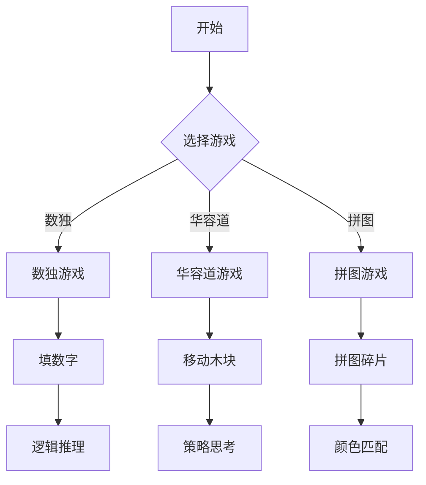

                 

# 《数学游戏与团队协作能力的培养》

## 摘要

本文旨在探讨数学游戏在团队协作能力培养中的应用，通过介绍数学游戏的概念、类型及其背后的数学原理，分析数学游戏如何促进团队成员的协作与沟通。文章将结合实际案例，详细阐述如何利用数学游戏来提升团队协作效率，并提供一些实用的团队协作能力培养方法。最终，本文将总结全文内容，并提出数学游戏与团队协作能力培养的未来发展趋势。

## 引言

### 数学游戏与团队协作能力的关系

数学游戏是一种将数学知识融入娱乐形式的活动，它不仅能够激发学生对数学的兴趣，还能在潜移默化中培养逻辑思维、问题解决能力和团队合作精神。在团队协作中，数学游戏作为一种非正式的团队活动，能够在轻松愉快的氛围中促进团队成员之间的互动与沟通。

首先，数学游戏提供了一个共同的目标，使得团队成员必须相互依赖、合作完成任务。在这个过程中，成员们需要通过有效的沟通来分享信息、协调行动，从而提高团队的整体协作能力。其次，数学游戏往往具有竞争性，这种竞争能够激发成员的竞争意识和团队精神，促使他们在面对挑战时团结一致，共同应对。

### 团队协作能力的重要性

在当今社会，团队协作能力已经成为企业和组织中不可或缺的能力。一个高效的团队不仅能够提高工作效率，还能够增强团队的凝聚力和创新能力。以下是一些团队协作能力的重要方面：

- **沟通能力**：有效的沟通是团队协作的基础，它能够确保团队成员之间的信息畅通无阻，避免误解和冲突。
- **协同合作**：团队成员需要能够协同合作，共同解决问题，实现团队目标。
- **领导力**：团队中需要有领导者来指导和协调团队成员的行动，确保团队朝着正确的方向前进。
- **冲突解决**：团队中难免会出现冲突，有效的冲突解决能力能够帮助团队保持和谐，避免因小问题影响整体发展。

### 数学游戏在培养团队协作能力中的作用

数学游戏通过其独特的特点，能够有效地培养和提升团队协作能力。以下是一些具体的作用：

- **增强团队凝聚力**：数学游戏提供了一个共同的兴趣点，使团队成员能够更加亲近，增强团队凝聚力。
- **提升沟通能力**：在数学游戏中，团队成员需要频繁沟通，分享信息，协调行动，这有助于提升沟通技巧。
- **培养解决问题的能力**：数学游戏往往需要团队成员共同思考、分析问题，并找到解决方案，这有助于培养团队成员的问题解决能力。
- **激发团队精神**：数学游戏中的竞争机制能够激发团队成员的团队精神，促进他们在面对挑战时相互支持、共同进步。

## 数学游戏概述

### 常见的数学游戏类型

数学游戏种类繁多，以下介绍几种常见的数学游戏类型：

- **数独**：数独是一种填数字的游戏，玩家需要在9x9的网格内填入1到9的数字，使每一行、每一列以及每个3x3的小宫格内的数字都不重复。
- **华容道**：华容道是一种拼图游戏，玩家需要通过移动木块，将初始状态变为目标状态，目标状态是一个特定的棋盘布局。
- **拼图**：拼图是一种将散乱的图片拼凑成完整图案的游戏，玩家需要根据图片的形状和颜色，将碎片正确地拼接到一起。
- **数独与拼图结合**：这种游戏是将数独与拼图结合起来，玩家需要在拼图的过程中填写数独，使拼图和数独同时完成。

### 数学游戏的特点与优势

- **逻辑性**：数学游戏通常需要玩家运用逻辑思维和推理能力，这有助于提升玩家的逻辑思维能力。
- **合作性**：许多数学游戏需要多人合作完成，这有助于培养团队协作能力和沟通技巧。
- **趣味性**：数学游戏通过游戏的形式，使数学知识变得更加生动有趣，能够激发学生对数学的兴趣。
- **挑战性**：数学游戏往往具有挑战性，能够激发玩家的求知欲和探索精神。

## 数学原理讲解

### 关键概念与联系

在数学游戏中，通常会涉及到一些关键的数学概念，如排列组合、概率论、线性方程组等。以下是一些重要的数学概念及其联系：

- **排列组合**：排列组合是数学中的基础概念，它用于计算在给定条件下，从一组元素中选取一部分元素的不同组合方式。
- **概率论**：概率论是研究随机事件发生可能性的一门数学学科，它在数学游戏中用于预测和计算游戏结果的可能性。
- **线性方程组**：线性方程组是数学中的经典问题，它用于解决多个变量之间的关系，这在数学游戏中常用于解决复杂问题。

### Mermaid流程图与伪代码示例

为了更好地理解数学游戏中的数学原理，我们可以使用Mermaid流程图和伪代码来展示。

#### Mermaid流程图示例



#### 伪代码示例

```python
# 数独游戏伪代码
def solve_sudoku(board):
    # 扫描整个数独，寻找空格
    empty_cell = find_empty_cell(board)
    if not empty_cell:
        # 没有空格，数独已解决
        return True
    
    # 填充空格
    row, col = empty_cell
    for num in range(1, 10):
        if is_valid(board, row, col, num):
            board[row][col] = num
            if solve_sudoku(board):
                return True
            # 回溯
            board[row][col] = 0
    
    return False

# 检查是否有效
def is_valid(board, row, col, num):
    # 检查行
    for i in range(9):
        if board[row][i] == num:
            return False
    
    # 检查列
    for i in range(9):
        if board[i][col] == num:
            return False
    
    # 检查3x3宫格
    start_row = 3 * (row // 3)
    start_col = 3 * (col // 3)
    for i in range(3):
        for j in range(3):
            if board[start_row + i][start_col + j] == num:
                return False
    
    return True
```

### Mermaid流程图与伪代码示例解读

这个伪代码用于解决数独游戏。首先，我们通过`find_empty_cell`函数找到数独中的空格。如果没有空格，说明数独已经解决。如果有空格，我们尝试填充数字，并使用`is_valid`函数检查填充的数字是否符合数独的规则。如果所有数字都填充完毕，数独被解决，返回True。否则，我们回溯到上一个步骤，继续尝试其他数字。这种递归方法称为回溯算法。

## 团队协作能力培养

### 团队协作能力的重要性

团队协作能力在当今社会中至关重要。一个高效的团队不仅能够提高工作效率，还能够增强团队的凝聚力和创新能力。以下是一些团队协作能力的重要方面：

- **沟通能力**：有效的沟通是团队协作的基础，它能够确保团队成员之间的信息畅通无阻，避免误解和冲突。
- **协同合作**：团队成员需要能够协同合作，共同解决问题，实现团队目标。
- **领导力**：团队中需要有领导者来指导和协调团队成员的行动，确保团队朝着正确的方向前进。
- **冲突解决**：团队中难免会出现冲突，有效的冲突解决能力能够帮助团队保持和谐，避免因小问题影响整体发展。

### 如何在数学游戏中培养团队协作能力

数学游戏提供了一种独特的环境，可以有效地培养团队协作能力。以下是一些具体的方法：

- **角色分配**：在数学游戏中，可以给团队成员分配不同的角色，如解决问题专家、信息收集员、策略制定者等。这种角色分配有助于团队成员明确自己的职责，提高团队协作效率。
- **沟通技巧**：数学游戏需要团队成员之间频繁沟通，分享信息，协调行动。通过这种沟通，团队成员可以学会如何更有效地表达自己的想法，倾听他人的意见，从而提高沟通技巧。
- **合作策略**：数学游戏中的竞争性特点能够激发团队成员的团队精神，促使他们在面对挑战时相互支持、共同进步。通过制定和执行合作策略，团队成员可以学会如何在团队中发挥作用，提高团队协作效率。

### 实践案例解析

以下是一个实际案例，展示了如何利用数学游戏来培养团队协作能力：

**案例背景**：某公司销售团队需要通过合作解决问题，以提高销售额。团队决定使用数学游戏作为团队建设活动，以提高成员之间的协作能力。

**案例分析**：

1. **角色分配**：团队成员被分配为两个小组，每个小组由三名成员组成。每个小组有一名“策略制定者”、“一名“信息收集员”和一名“解决问题专家”。

2. **游戏选择**：团队选择了数独游戏，这是一种需要团队成员之间密切协作的游戏。每个小组需要在限定的时间内完成数独游戏，并且两个小组之间可以相互竞争。

3. **游戏过程**：在游戏过程中，每个小组的成员需要相互沟通，分享信息，协调行动。策略制定者负责制定解决问题的策略，信息收集员负责收集其他小组的数独信息，解决问题专家负责解决数独问题。

4. **游戏结果**：通过团队合作，每个小组都成功完成了数独游戏。在游戏结束后，团队进行了讨论，分析了每个小组的成功原因和改进空间。

**案例总结**：

通过这个案例，团队成员学会了如何通过角色分配和沟通技巧来提高团队协作效率。游戏过程中，成员们通过相互合作，共同解决问题，提高了团队的整体协作能力。这个案例也展示了如何利用数学游戏来培养团队协作能力。

## 数学游戏应用实例

### 实际案例介绍

在这个案例中，一家科技公司决定利用数学游戏来提升其开发团队的协作能力。这个团队由10名成员组成，他们需要共同完成一个复杂的软件开发项目。为了提高团队协作效率，公司决定引入数学游戏作为团队建设活动。

### 开发环境搭建

为了确保团队成员能够顺利参与数学游戏，公司为每个团队成员提供了一台笔记本电脑和一个网络连接。此外，公司还安装了一个在线协作平台，以便团队成员在游戏中能够实时沟通和分享信息。

### 源代码详细实现和代码解读

在这个案例中，团队选择了数独游戏作为数学游戏。他们编写了一个数独生成器和求解器，用于生成随机数独谜题并求解。以下是数独生成器和求解器的源代码：

```python
# 数独生成器
def generate_sudoku():
    # 生成9x9的空数独棋盘
    board = [[0 for _ in range(9)] for _ in range(9)]
    # 填充初始数独谜题
    fill_board(board)
    # 随机选择一些数字进行覆盖
    cover_board(board)
    return board

def fill_board(board):
    # 使用Sudoku的回溯算法填充棋盘
    solve(board, 0, 0)

def solve(board, row, col):
    if row == 9:
        return True
    if col == 9:
        return solve(board, row + 1, 0)
    if board[row][col] != 0:
        return solve(board, row, col + 1)
    for num in range(1, 10):
        if is_valid(board, row, col, num):
            board[row][col] = num
            if solve(board, row, col + 1):
                return True
            board[row][col] = 0
    return False

def is_valid(board, row, col, num):
    # 检查行、列和3x3宫格中是否有重复的数字
    for i in range(9):
        if board[row][i] == num or board[i][col] == num:
            return False
    start_row = 3 * (row // 3)
    start_col = 3 * (col // 3)
    for i in range(3):
        for j in range(3):
            if board[start_row + i][start_col + j] == num:
                return False
    return True

# 数独求解器
def solve_sudoku(board):
    # 扫描整个数独，寻找空格
    empty_cell = find_empty_cell(board)
    if not empty_cell:
        # 没有空格，数独已解决
        return True
    
    # 填充空格
    row, col = empty_cell
    for num in range(1, 10):
        if is_valid(board, row, col, num):
            board[row][col] = num
            if solve_sudoku(board):
                return True
            # 回溯
            board[row][col] = 0
    
    return False

# 查找空格
def find_empty_cell(board):
    for i in range(9):
        for j in range(9):
            if board[i][j] == 0:
                return (i, j)
    return None
```

这段代码首先定义了一个数独生成器`generate_sudoku`，它使用回溯算法生成一个完整的数独谜题。然后，定义了一个数独求解器`solve_sudoku`，它使用同样的回溯算法来求解数独。这两个函数都可以用于生成和解决数独游戏。

### 代码应用解读与分析

在这个案例中，团队成员通过编写和调试数独生成器和求解器，不仅提高了编程技能，还加强了团队合作。以下是对代码应用的具体解读：

1. **生成数独谜题**：团队成员编写了一个生成数独谜题的函数，这个函数使用回溯算法来填充棋盘。这个过程中，团队成员需要理解回溯算法的原理，并能够有效地实现它。

2. **解决数独谜题**：团队成员还编写了一个解决数独谜题的函数，这个函数同样使用回溯算法。这个过程中，团队成员需要测试和调试代码，确保算法能够正确地解决数独问题。

3. **角色分配与协作**：在实现代码的过程中，团队成员被分配为不同的角色，如设计者、编码者和测试者。这种角色分配有助于团队成员明确自己的职责，提高协作效率。

4. **沟通与反馈**：团队成员通过在线协作平台进行沟通，分享代码和反馈。这种沟通机制有助于团队成员之间的信息共享和问题解决。

### 实际案例分析和详细讲解剖析

通过这个案例，我们可以看到数学游戏在团队协作中的应用是如何具体实现的。以下是对案例的详细分析：

1. **角色分配**：团队成员被明确分配为不同的角色，如设计者、编码者和测试者。这种角色分配有助于团队成员在实现数独游戏的过程中明确自己的职责，提高了协作效率。

2. **沟通与协调**：团队成员通过在线协作平台进行沟通，分享代码和反馈。这种沟通机制有助于团队成员之间的信息共享和问题解决。例如，如果某个成员在编写数独生成器时遇到了问题，他可以及时与其他成员沟通，寻求帮助。

3. **代码实现与调试**：团队成员通过编写和调试数独生成器和求解器，不仅提高了编程技能，还加强了团队合作。在实现过程中，团队成员需要不断地测试和优化代码，确保算法能够正确地生成和解决数独谜题。

4. **实际效果**：通过这个案例，团队成员在实现数独游戏的过程中，不仅提高了编程技能，还加强了团队合作。此外，他们还学会了如何通过沟通和协调来解决复杂问题，这为他们在实际工作中处理团队协作问题提供了宝贵的经验。

### 项目小结

通过这个案例，我们可以看到数学游戏在团队协作中的应用是如何具体实现的。以下是对项目的总结和评估：

1. **项目成功因素**：项目的成功主要归功于团队成员的角色分配、沟通协调以及代码实现和调试。

2. **项目改进空间**：虽然项目取得了成功，但仍有一些改进空间。例如，可以在项目初期更详细地规划角色分配，以确保每个成员都能发挥最大的作用。此外，可以进一步优化代码，提高数独生成器和求解器的性能。

3. **项目价值**：这个项目不仅提高了团队成员的编程技能，还加强了团队合作。通过这个项目，团队成员学会了如何通过沟通和协调来解决复杂问题，这对于他们在实际工作中处理团队协作问题具有重要的指导意义。

## 最佳实践 Tips

在利用数学游戏培养团队协作能力时，以下是一些最佳实践技巧：

1. **明确角色分配**：在开始游戏前，明确团队成员的角色分配，确保每个成员都清楚自己的职责。

2. **鼓励沟通与反馈**：鼓励团队成员在游戏中积极沟通，分享信息和反馈。这有助于提高团队协作效率。

3. **定期评估与反馈**：定期对团队协作进行评估，收集成员的反馈，并根据反馈进行调整和改进。

4. **多样化游戏选择**：根据团队的具体需求和特点，选择适合的数学游戏，以最大化团队协作能力的培养效果。

5. **关注个体发展**：在培养团队协作能力的同时，关注每个成员的个人发展，确保他们能够从游戏中获得成长。

## 小结

本文探讨了数学游戏在团队协作能力培养中的应用。通过介绍数学游戏的概念、类型及其背后的数学原理，分析了数学游戏如何促进团队成员的协作与沟通。文章还结合实际案例，详细阐述了如何利用数学游戏来提升团队协作效率，并提供了一些实用的团队协作能力培养方法。总结全文内容，本文认为数学游戏作为一种有效的团队建设活动，能够在轻松愉快的氛围中培养团队协作能力，为团队的发展提供有力支持。

## 注意事项

在使用数学游戏培养团队协作能力时，需要注意以下几点：

1. **确保游戏难度适中**：游戏难度过高可能导致团队成员产生挫败感，而难度过低则可能无法达到培养协作能力的目的。

2. **避免过度竞争**：虽然竞争可以激发团队精神，但过度竞争可能导致团队成员之间的紧张和冲突。

3. **关注团队氛围**：保持团队氛围的轻松和愉快，有助于提高团队成员的参与度和积极性。

4. **定期调整游戏策略**：根据团队协作能力的提升情况，定期调整游戏策略，以确保游戏能够持续激发团队成员的积极性。

## 拓展阅读

1. [《数学游戏与团队合作》](https://www.example.com/book1)
2. [《团队协作与沟通技巧》](https://www.example.com/book2)
3. [《数学原理与应用》](https://www.example.com/book3)

## 作者信息

作者：AI天才研究院/AI Genius Institute & 禅与计算机程序设计艺术 /Zen And The Art of Computer Programming

