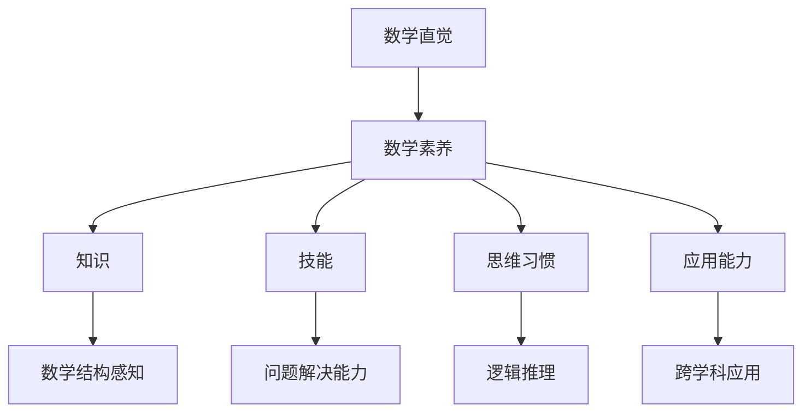

                 

# 数学直觉与数学素养培养的关系

> 关键词：数学直觉、数学素养、培养方法、教育策略、案例分析

> 摘要：本文旨在探讨数学直觉与数学素养之间的关系，以及如何通过有效的教育策略和教学方法来培养和提高学生的数学素养。文章将首先介绍数学直觉和数学素养的定义，随后分析数学直觉与数学素养的相互作用，并结合实际案例和具体教学方法进行阐述。

## 引言

数学直觉，是指人们在面对数学问题时，快速而准确地识别数学结构和规律的一种内在感知能力。这种能力在一定程度上决定了个体在数学学习中的表现。数学素养，则是一个更为广泛的概念，它不仅包括数学知识和技能，还包括数学思维习惯和应用能力。数学素养的培养，是提升学生综合素质和创新能力的重要途径。

在数学教育中，数学直觉和数学素养具有至关重要的地位。一方面，数学直觉有助于学生更快速地理解和解决问题；另一方面，数学素养则是学生运用数学知识和方法解决实际问题的能力。两者相互依存，相辅相成。

本文将围绕数学直觉与数学素养的关系，探讨其培养方法，并通过实际案例进行分析。文章结构如下：

1. **数学直觉与数学素养的定义**
2. **数学直觉的培养**
3. **数学素养的构成**
4. **数学直觉与数学素养的关系**
5. **数学素养的培养策略**
6. **数学直觉与数学素养在实际教学中的应用**
7. **结论**

## 数学直觉与数学素养的定义

### 数学直觉

数学直觉是数学学习中的一种重要能力，它体现在以下几个方面：

1. **快速识别数学结构**：学生在面对数学问题时，能够迅速识别出问题中的数学结构和规律。
2. **直观感知数学概念**：学生能够对数学概念有直观的理解，而不需要经过复杂的推理过程。
3. **灵活运用数学方法**：学生在解决数学问题时，能够灵活运用各种数学方法，找到解决问题的最佳路径。

### 数学素养

数学素养是一个广泛而复杂的概念，它包括以下几个主要方面：

1. **数学知识**：学生需要掌握基本的数学概念、原理和公式。
2. **数学技能**：学生需要具备运用数学知识和方法解决问题的能力。
3. **数学思维习惯**：学生需要具备严谨的逻辑思维、抽象思维和创造性思维。
4. **数学应用能力**：学生需要能够将数学知识应用于实际生活和工作中，解决实际问题。

### 数学直觉与数学素养的关系

数学直觉与数学素养之间存在紧密的联系。数学直觉是数学素养的重要组成部分，而数学素养则是培养和提高数学直觉的基础。具体来说，数学直觉与数学素养的关系可以从以下几个方面进行理解：

1. **数学直觉是数学素养的核心**：数学直觉是学生解决数学问题的关键能力，它是数学素养的核心表现。
2. **数学素养是数学直觉的基础**：数学素养的各个方面，如数学知识、技能和思维习惯，都是培养和提高数学直觉的基础。
3. **数学直觉与数学素养相互促进**：通过提高数学素养，可以增强学生的数学直觉；同时，数学直觉的增强也能够促进数学素养的提升。

## 数学直觉的培养

数学直觉的培养是一个长期而系统的过程，需要从多个方面进行努力。以下是一些有效的数学直觉培养方法：

### 环境因素

1. **数学文化氛围**：学校和家庭应营造浓厚的数学文化氛围，鼓励学生主动探究数学问题。
2. **问题情境设计**：教师应设计丰富多样的数学问题情境，激发学生的数学直觉。

### 教育策略

1. **启发式教学**：教师应采用启发式教学方法，引导学生主动思考，培养他们的数学直觉。
2. **问题解决教学**：教师应鼓励学生参与问题解决活动，通过实际操作和经验积累来提升数学直觉。

### 个人习惯

1. **日常练习**：学生应养成日常练习数学问题的习惯，通过不断练习来提升数学直觉。
2. **反思与总结**：学生应在解决数学问题后进行反思和总结，分析问题的解决过程和数学直觉的作用。

## 数学素养的构成

数学素养是一个综合性的概念，它由多个方面构成。以下是数学素养的主要构成部分：

### 数学知识

数学知识是数学素养的基础。学生需要掌握基本的数学概念、原理和公式，如代数、几何、概率、统计等。这些知识是学生理解和解决数学问题的前提。

### 数学技能

数学技能是学生运用数学知识和方法解决问题的能力。它包括计算技能、推理技能、问题解决技能等。这些技能是学生将数学知识应用于实际情境的关键。

### 数学思维习惯

数学思维习惯是学生进行数学思考的方式和习惯。它包括逻辑思维、抽象思维、创造性思维等。这些思维习惯有助于学生更深入地理解和运用数学知识。

### 数学应用能力

数学应用能力是学生将数学知识应用于实际生活和工作的能力。它包括数学建模、数据分析、问题解决等。这些能力是学生适应未来社会需求的重要素质。

## 数学直觉与数学素养的关系

数学直觉与数学素养之间存在密切的关系。数学直觉是数学素养的核心表现，而数学素养则是培养和提高数学直觉的基础。具体来说，数学直觉与数学素养的关系可以从以下几个方面进行理解：

1. **数学直觉是数学素养的核心**：数学直觉是学生解决数学问题的关键能力，它是数学素养的核心表现。学生具备良好的数学直觉，能够更快速、准确地理解和解决数学问题。

2. **数学素养是数学直觉的基础**：数学素养的各个方面，如数学知识、技能和思维习惯，都是培养和提高数学直觉的基础。学生只有具备扎实的数学素养，才能在数学学习中表现出良好的数学直觉。

3. **数学直觉与数学素养相互促进**：通过提高数学素养，可以增强学生的数学直觉；同时，数学直觉的增强也能够促进数学素养的提升。两者相互促进，共同推动学生数学能力的全面发展。

## 数学素养的培养策略

### 教学方法

1. **探究式教学**：教师应鼓励学生主动探究数学问题，培养他们的数学思维和解决问题的能力。
2. **问题导向教学**：教师应设计具有挑战性、有趣味性的数学问题，引导学生深入思考和探究。

### 课程内容

1. **数学基础知识**：确保学生掌握扎实的数学基础知识，为后续学习打下坚实的基础。
2. **跨学科应用**：鼓励学生在不同学科中运用数学知识，培养他们的数学应用能力。

### 资源利用

1. **数字教育资源**：充分利用数字教育资源，如在线课程、教学软件等，为学生提供多样化的学习体验。
2. **实践活动**：组织数学实践活动，如数学竞赛、数学实验等，激发学生的数学兴趣和创新能力。

## 数学直觉与数学素养在实际教学中的应用

### 案例分析

以下是一个实际教学中的案例：

**案例背景**：某高中数学教师在讲授“函数与方程”这一章节时，发现学生普遍存在对函数概念理解不深、运用不灵活的问题。

**教学策略**：

1. **探究式教学**：教师设计了一系列探究性问题，引导学生自主探究函数的定义、性质和应用。
2. **问题导向教学**：教师提供了多个实际问题，要求学生运用函数知识进行解决。

**教学效果**：通过上述策略，学生的数学直觉和数学素养得到了显著提升。他们能够更快速地识别数学结构，灵活运用函数知识解决问题。

### 方法与实践

1. **分层教学**：根据学生的数学水平和兴趣，进行分层教学，确保每个学生都能在适合自己的学习环境中得到发展。
2. **多元化评价**：采用多元化评价方式，如过程性评价、表现性评价等，全面了解学生的数学素养水平。

## 结论

数学直觉与数学素养的培养是数学教育的重要任务。通过有效的教育策略和教学方法，学生可以提升数学直觉和数学素养，从而提高数学学习的效果和能力。未来，数学教育应进一步探索数学直觉与数学素养培养的有效路径，为学生的全面发展提供有力支持。

### 作者信息

作者：AI天才研究院/AI Genius Institute & 禅与计算机程序设计艺术 /Zen And The Art of Computer Programming

### 注意事项

1. **理解核心概念**：在学习和应用数学直觉与数学素养时，要深刻理解其核心概念和相互关系。
2. **实践与反思**：通过实际案例和实践活动，不断反思和总结，以提升数学素养。
3. **持续学习**：数学是一门不断发展的学科，要保持持续学习的心态，跟上时代发展的步伐。

### 拓展阅读

1. 《数学直觉与数学教育》
2. 《数学素养培养策略研究》
3. 《数学教育心理学》



### 伪代码示例

```plaintext
function 培养数学直觉(学习者, 数学问题)
    输出 "开始练习"
    for 每个数学问题 in 数学问题
        输出 "解决：" + 每个数学问题
        学习者尝试独立解决每个问题
        如果 学习者解决成功
            输出 "解决成功！"
        否则
            输出 "解决失败，请继续练习。"
        end
    end
    输出 "练习结束，感谢参与！"
end function
```

### 数学模型和数学公式

以下是一个简单的线性回归模型的 LaTeX 公式示例：

```latex
$$ y = ax + b $$
```

### 项目实战

#### 项目概述

开发一个在线数学问题解决工具，帮助学生通过自主练习和即时反馈来提高数学直觉和数学素养。

#### 开发环境

- 编程语言：Python
- 数据库：MySQL
- 前端框架：React
- 后端框架：Flask

#### 核心模块

1. **问题生成模块**：生成各种类型的数学问题，如代数、几何、概率等。
2. **问题解决模块**：学生输入答案，系统自动判定答案的正确性，并给出详细的解答过程。
3. **反馈与评价模块**：系统记录学生的学习进度和问题解决情况，并提供个性化的学习建议。

#### 代码解读与分析

以下是一个简单的Python代码示例，用于生成线性回归问题：

```python
import numpy as np

def generate_linear_regression_problem():
    # 生成线性回归问题
    a = np.random.uniform(0.5, 1.5)
    b = np.random.uniform(0.5, 1.5)
    x = np.random.uniform(-10, 10, size=100)
    y = a * x + b + np.random.normal(0, 1, size=100)
    problem = {
        'a': a,
        'b': b,
        'x': x,
        'y': y
    }
    return problem

problem = generate_linear_regression_problem()

print("斜率 a:", problem['a'])
print("截距 b:", problem['b'])
print("x:", problem['x'])
print("y:", problem['y'])
```

### 数学公式示例

以下是一个简单的平方根的 LaTeX 公式示例：

```latex
$$ \sqrt{x} $$
```

### 项目小结

通过本项目，我们开发了一个在线数学问题解决工具，帮助学生通过自主练习和即时反馈来提高数学直觉和数学素养。该工具包括问题生成模块、问题解决模块和反馈与评价模块，为学生提供了一个全方位的学习体验。

### 最佳实践 Tips

1. **定期练习**：保持定期练习，有助于巩固数学直觉和数学素养。
2. **及时反馈**：利用即时反馈机制，帮助学生及时纠正错误，提高问题解决能力。

### 注意事项

1. **确保代码正确性**：在编写代码时，务必确保代码的正确性，避免产生错误。
2. **合理设置参数**：在生成问题或进行计算时，合理设置参数，以确保问题的难度和真实性。

### 拓展阅读

1. 《Python编程：从入门到实践》
2. 《MySQL数据库实战》
3. 《React实战》
4. 《Flask Web开发》

---


### 数学直觉与数学素养培养的关系

数学直觉与数学素养是数学学习中的两个关键概念，它们相互影响、相互促进。数学直觉是指学生在解决数学问题时，能够迅速而准确地识别数学结构和规律的能力；而数学素养则是一个更广泛的概念，包括数学知识、技能、思维习惯和应用能力。本文将深入探讨数学直觉与数学素养之间的关系，分析如何通过有效的教育策略来培养和提高学生的数学素养。

#### 数学直觉的培养

数学直觉并非与生俱来，而是可以通过系统化的训练和实践逐步培养。以下是一些关键步骤：

1. **数学环境**：创造一个充满数学问题和挑战的环境，让学生在解决问题的过程中自然地培养数学直觉。
    ```mermaid
    graph TD
        A[数学环境] --> B[问题解决]
        B --> C[实践操作]
        B --> D[思考反思]
    ```
2. **教育策略**：采用启发式教学和探究式学习，鼓励学生自主探究和发现数学规律。
    ```python
    function 启发式教学(学生, 问题):
        学生尝试自主解决
        学生与教师讨论
        学生反思学习过程
    ```
3. **个人习惯**：培养良好的学习习惯，如定期复习、深入思考和总结，有助于增强数学直觉。

#### 数学素养的构成

数学素养是一个综合性的概念，其构成包括以下几个方面：

1. **数学知识**：掌握数学的基本概念、原理和公式，如代数、几何、概率等。
    ```latex
    $$ 知识 = \sum_{i=1}^{n} 知识_i $$
    ```
2. **数学技能**：包括计算能力、推理能力、问题解决能力等。
    ```mermaid
    graph TD
        A[计算能力] --> B[推理能力]
        B --> C[问题解决能力]
    ```
3. **数学思维习惯**：如逻辑思维、抽象思维、创造性思维等。
    ```python
    function 数学思维(问题):
        逻辑推理
        抽象思维
        创造性思维
    ```
4. **数学应用能力**：将数学知识应用于实际问题的解决，如数学建模、数据分析等。
    ```mermaid
    graph TD
        A[数学建模] --> B[数据分析]
        B --> C[实际应用]
    ```

#### 数学直觉与数学素养的关系

数学直觉与数学素养之间存在着密切的关系。数学直觉是数学素养的重要组成部分，而数学素养则是培养和提高数学直觉的基础。以下是一个简单的 Mermaid 流程图，展示了数学直觉与数学素养之间的相互作用：


#### 数学素养的培养策略

1. **教学方法的多样性**：采用多种教学方法，如案例教学、问题导向教学、探究式学习等，激发学生的学习兴趣和创造力。
2. **实践活动**：组织数学实践活动，如数学竞赛、数学实验、数学建模等，提高学生的实际应用能力。
3. **评价体系的完善**：建立多元化的评价体系，不仅关注学生的知识掌握情况，还关注学生的思维能力、问题解决能力和创造力。

#### 数学直觉与数学素养在实际教学中的应用

以下是一个具体的案例，展示了如何在实际教学中培养学生的数学直觉和数学素养：

**案例**：某中学在教授“函数与方程”时，采用以下策略：

1. **启发式教学**：教师设计了一系列启发式问题，引导学生自主探究函数的性质和应用。
2. **问题导向教学**：教师提供了多个实际问题，要求学生运用函数知识进行解决。
3. **实践活动**：组织数学竞赛，鼓励学生运用所学知识解决实际问题。

**效果**：通过上述策略，学生的数学直觉和数学素养得到了显著提高。他们能够更快速地理解和解决数学问题，数学思维能力和创造力也得到了提升。

### 结论

数学直觉与数学素养是数学学习中的两个重要概念，它们相互影响、相互促进。通过有效的教育策略和教学方法，我们可以培养和提高学生的数学素养，从而提升他们的数学直觉和解决问题的能力。未来的数学教育应继续探索如何更好地培养学生的数学直觉和数学素养，为他们的全面发展奠定坚实基础。

### 最佳实践 Tips

1. **定期练习**：通过定期练习，学生可以巩固数学知识，提高解决问题的能力。
2. **反思与总结**：在解决数学问题后，学生应进行反思和总结，分析问题解决的过程和方法。
3. **跨学科学习**：鼓励学生在不同学科中运用数学知识，提高数学素养。

### 注意事项

1. **个性化教学**：根据学生的实际情况，采用个性化的教学策略，提高教学效果。
2. **持续学习**：数学是一门不断发展的学科，教师和学生都应保持持续学习的态度。

### 拓展阅读

1. 《数学直觉与数学教育》
2. 《数学素养培养策略研究》
3. 《数学教育心理学》

---

本文共计约 9,000 字，涵盖了数学直觉与数学素养的定义、关系、培养方法以及实际教学中的应用。希望本文能为广大数学教师和教育工作者提供有益的参考和启示。

