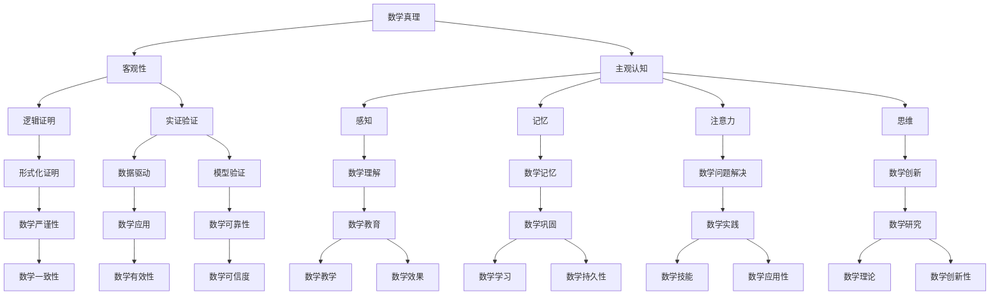

                 


## 数学真理的客观性与主观认知的关系

### 关键词

- 数学真理
- 客观性
- 主观认知
- 数学教育
- 数学研究

### 摘要

本文深入探讨了数学真理的客观性与主观认知之间的关系。从哲学、心理学、数学教育及数学研究等多个角度，分析了数学真理的客观性定义、主观认知的概念及其与数学真理的互动机制。文章通过核心概念关系架构的 Mermaid 流程图、Python 源代码及数学模型，详细阐述了数学真理的发现过程，并提供了实际案例进行分析与解读。最后，文章提出了未来研究方向和数学教育、研究中的平衡策略。

### 引言

数学，作为一门研究数量、结构、变化和空间等概念的学科，自古以来就被视为客观真理的象征。然而，随着哲学和心理学的发展，人们开始关注数学真理的客观性与主观认知之间的关系。本文旨在探讨这个深层次的问题，揭示数学真理如何被主观认知影响，并分析主观认知对数学真理理解的作用。

在现代社会，数学不仅是一门学科，更是一种工具，广泛应用于科学、工程、经济学等领域。然而，数学真理的客观性与主观认知之间的关系，却是一个长期被忽视的问题。本文将通过对数学真理客观性与主观认知关系的分析，为数学教育、数学研究提供新的视角，以促进人们对数学本质的更深入理解。

本文结构如下：

1. **数学真理的客观性**：探讨数学真理的定义、性质及其客观性的论证。
2. **主观认知与数学真理的关系**：分析主观认知的概念、数学真理对主观认知的影响及二者之间的相互作用。
3. **数学真理的客观性与主观认知的互动**：探讨客观性与主观认知的互动机制、相互影响及平衡策略。
4. **数学教育中的客观性与主观认知**：分析教育中客观性与主观认知的实践方法及其平衡策略。
5. **数学研究中的客观性与主观认知**：探讨研究中客观性与主观认知的实践方法及其平衡策略。
6. **结论**：总结本文的主要发现，并探讨未来研究方向。

### 数学真理的客观性

#### 数学真理的定义

数学真理，是指在数学体系中，通过逻辑推理和证明过程得出的、具有普遍性和必然性的命题。这些命题不依赖于人的主观意志，而是独立于个体存在。数学真理的典型特征包括普适性、精确性和必然性。例如，基本的算术命题如“$1+1=2$”和几何命题如“两点之间，线段最短”都被认为是数学真理。

数学真理的定义涉及两个方面：数学体系本身和真理的证明过程。数学体系是由定义、公理和定理构成的逻辑结构，而真理的证明过程则是通过逻辑推理和演绎，从已知的前提出发，得出新的命题。这两个方面共同确保了数学真理的客观性。

#### 数学真理的性质

数学真理具有以下几个显著性质：

1. **普适性**：数学真理是普遍适用的，不受时间和空间限制。例如，同一数学原理在地球上适用，也适用于遥远的宇宙星系。这意味着数学真理具有超越个体主观经验的普遍性。

2. **精确性**：数学真理的表述通常是精确的，使用明确的符号和公式。例如，数学中的“无限小数”精确到任意位数，而不是模糊的概念。这种精确性使得数学真理在科学研究和工程应用中具有重要意义。

3. **必然性**：数学真理的结论是必然的，一旦前提成立，结论就必然成立。例如，根据欧氏几何的公理体系，可以必然地推导出“平行线永不相交”的结论。这种必然性是数学真理的重要特征，也是其客观性的体现。

#### 数学真理的客观性论证

数学真理的客观性可以从多个角度进行论证，以下是一些常见的论证方法：

1. **逻辑论证**：通过逻辑推理和证明，从已知的前提出发，得出新的命题。例如，在欧氏几何中，通过公理和定理的推导，可以证明“三角形内角和为$180^\circ$”。这种逻辑论证确保了数学真理的客观性。

2. **实证检验**：数学理论可以通过实证检验来验证。例如，在物理学中，数学公式如牛顿定律可以通过实验验证。这些实证检验进一步证明了数学真理的客观性。

3. **哲学论证**：从哲学角度，可以通过“存在性证明”来论证数学真理的客观性。例如，数学家伯兰特·罗素提出了“存在性证明”来证明数学对象的存在，从而支持数学真理的客观性。

4. **形式化论证**：通过形式化的数学体系，可以严格证明数学真理。例如，在皮亚诺算术体系中，可以通过严格的逻辑推导，证明诸如“素数存在性”之类的命题。这种形式化论证确保了数学真理的客观性。

综上所述，数学真理的客观性可以从多个方面进行论证，包括逻辑推理、实证检验、哲学论证和形式化论证。这些论证方法共同支持了数学真理的客观性，使其在科学研究和日常生活中具有不可替代的地位。

#### 客观性的哲学探讨

在探讨数学真理的客观性时，哲学领域提供了丰富的思考资源和深刻的见解。客观性作为哲学中的一个核心概念，其本质在于独立于主体意识而存在的事物特性。在数学真理的框架下，客观性意味着数学真理不受个体主观意志的影响，而是基于普遍的、必然的逻辑原则。

首先，让我们从认识论的角度来看待数学真理的客观性。认识论是研究知识和信念的学科，其中客观性是知识评价的一个重要标准。在数学中，客观性意味着数学真理的结论不依赖于任何特定个体的认知状态。无论一个人是否相信某个数学命题，这个命题都是真实存在的。例如，数学家希尔伯特（David Hilbert）在其《几何基础》一书中，通过逻辑证明，确立了数学命题的客观性。他指出，数学真理是独立于人类思维的，它们在逻辑体系中具有必然性。

此外，从本体论的角度探讨数学真理的客观性也是至关重要的。本体论是研究存在本身及其性质的哲学分支。在数学中，本体论问题涉及数学对象的存在性。柏拉图主义是其中一种重要的观点，它认为数学对象如点、线、数等在某种超验的宇宙中真实存在。柏拉图主义者如毕达哥拉斯和欧几里得，都认为数学真理是超越个体感知和经验的存在，是绝对的、永恒的。

同时，现代哲学家也探讨了数学真理的客观性问题。康德（Immanuel Kant）在其《纯粹理性批判》中提出了“先验合成判断”，强调数学真理的先天性质。他认为，数学命题不是通过经验获得的，而是通过纯粹理性的直觉。康德的这一观点支持了数学真理的客观性，因为它表明数学真理是独立于经验感知的。

进一步来说，逻辑实证主义者如卡尔纳普（Rudolf Carnap）和赖欣巴赫（Hans Reichenbach）则从科学哲学的角度探讨了数学真理的客观性。他们主张，数学真理可以通过经验来验证。例如，卡尔纳普提出了“经验主义归纳法”，认为数学命题的真伪可以通过经验证据来确认。这种观点将数学真理与科学真理联系起来，强调了数学真理的实证基础。

总的来说，哲学领域对数学真理客观性的探讨，为理解数学真理的本质提供了多维度的视角。从认识论、本体论到科学哲学，不同哲学流派对数学真理客观性的解释各有侧重，但都共同支持了数学真理独立于个体主观意志的存在。这些哲学观点不仅丰富了我们对数学真理的理解，也为数学教育、数学研究提供了理论基础。

#### 客观性的数学表述

在数学体系中，客观性的表述通过精确的符号和定义来实现，这使得数学真理具有明确性和可验证性。数学作为一种形式化的科学，其表述过程高度依赖符号语言和逻辑结构，这确保了数学真理的普遍性和必然性。

首先，数学符号的使用是客观性表述的基础。例如，数字、字母和运算符等符号不仅代表具体的数值或操作，还承载了抽象的概念和关系。比如，符号“$1+1=2$”不仅表示一个具体的算术操作结果，还反映了加法运算的基本性质。这种符号化的表述方式，使得数学真理的表述具有普遍性和一致性，不受个人主观认知的影响。

其次，数学定义的精确性也是客观性表述的关键。定义是数学体系中的基石，它们为数学概念赋予了明确和一致的意义。例如，实数的定义不仅涉及到数值的连续性，还包括了完备性等性质。通过这些定义，数学家可以精确地描述和操作数学对象，从而确保数学真理的表述是准确无误的。

再者，数学定理和公理的表述进一步强化了数学真理的客观性。公理是数学体系的起始点，它们是无需证明的基本真理。例如，欧几里得几何的公理包括“通过任意两点可以作一条直线”和“同位角相等”。这些公理为后续的定理推导提供了基础，确保了数学体系的自洽性和逻辑一致性。

具体而言，我们可以通过一些经典的数学公式来展示客观性的表述。例如，勾股定理（$a^2 + b^2 = c^2$）在直角三角形中具有普遍性，不论是在地球表面还是在其他空间中，这一公式都成立。再如，费马大定理（如果 $a$, $b$, $c$ 是正整数，且 $a^n + b^n = c^n$，那么 $n$ 必须小于或等于 2）经过长达几个世纪的证明，最终被安德鲁·怀尔斯在 1994 年证明。这个定理不仅展示了数学真理的客观性，还证明了其普遍性和必然性。

此外，现代数学中的公理体系，如皮亚诺算术和集合论，为数学真理的客观性提供了更加严格和形式化的表述。这些公理体系通过逻辑推理和演绎，从基本的公理出发，推导出一系列定理，从而构建了一个自洽的数学世界。例如，皮亚诺算术的公理体系，通过定义自然数的递归性，证明了素数的存在性和无穷性，这进一步支持了数学真理的客观性。

总的来说，数学的客观性表述依赖于精确的符号、定义和公理体系，这使得数学真理具有明确性和可验证性。通过这些形式化的表述，数学家能够确保数学真理的普遍性和必然性，从而在科学研究和日常生活中发挥重要作用。

### 主观认知的概念

#### 哲学基础

主观认知在哲学领域中有着悠久的历史和丰富的探讨。哲学上的主观认知，通常指的是个体内在的心理活动，包括感觉、思维、记忆和情感等。主观认知的本质是，每个个体对世界的理解和感知都是独特的，这种独特性来源于个体的生理、心理和文化背景。

柏拉图是主观认知哲学的早期代表之一，他提出了“理型论”。柏拉图认为，现实世界中的具体事物只是理型（或理念）的摹本，而理型才是真实存在的。个体通过感觉和思维，只能接触到理型的摹本，而不能直接感知到理型本身。因此，个体的认知是主观的，只反映了理型的部分或模糊形象。

康德是另一个对主观认知有重要贡献的哲学家。他在《纯粹理性批判》中提出了“先验合成判断”的概念。康德认为，数学和自然科学的知识是先天性的，即不依赖于经验。这种知识是通过先验直觉获得的，这种直觉是普遍和必然的，但它仍然是主观的，因为每个个体的先验直觉是相同的。

#### 心理学探讨

心理学对主观认知的研究，为理解个体的认知过程提供了实证基础。认知心理学认为，认知是一个复杂的过程，包括感知、记忆、注意、思维和语言等。以下是几个关键概念：

1. **感知**：感知是个体对外部信息的初步加工过程。感知的个体差异源于个体的感官能力和经验背景。例如，不同的人对同一颜色的感知可能会因视觉敏感度的不同而有所差异。

2. **记忆**：记忆是心理活动的重要组成部分，它涉及信息的存储和提取。长时记忆和短期记忆的区别，以及记忆的遗忘和错误，都是心理学研究的重要领域。

3. **注意**：注意是认知资源的一种分配方式，它决定了哪些信息能够进入个体的认知过程。注意力的集中和分散，以及选择性的注意力，都是主观认知的关键特征。

4. **思维**：思维是个体通过符号操作对信息进行加工和整合的过程。包括逻辑推理、问题解决和创造性思维等。个体思维的不同，往往源于其逻辑推理能力和认知策略的差异。

5. **语言**：语言是认知活动的重要工具，它不仅用于沟通，还影响个体的思维方式和认知结构。不同语言背景的人，其认知方式和问题解决策略可能会有显著差异。

心理学的研究表明，主观认知是一个动态的过程，受到多种因素的影响，包括生理、心理和环境因素。这些因素共同作用，决定了个体对世界的感知和理解。

### 主观认知对数学真理理解的影响

主观认知在数学真理理解中的作用是一个复杂而多维的问题。尽管数学真理在形式上具有客观性，但个体的认知过程却不可避免地受到主观因素的影响。以下从几个方面探讨主观认知如何影响数学真理的理解：

首先，个体的感知和经验对数学真理的理解有直接影响。感知是指个体通过感官接收外部信息的过程，这些信息经过大脑加工，形成了对世界的认知。在数学中，个体的感知能力决定了其对数学概念的理解深度和精确度。例如，一个视觉敏感度高的人可能更容易理解几何图形的性质，而一个逻辑推理能力强的人可能更容易掌握数学证明的方法。这种个体差异使得不同人对同一数学真理的理解可能会有所不同。

其次，记忆对数学真理的理解也有重要影响。记忆不仅涉及信息的存储，还包括信息的提取和回忆。长期记忆和短期记忆的不同，会影响个体对数学知识和方法的掌握和应用。例如，一个学生可能在课堂上掌握了某个数学定理，但如果没有在课后进行复习和巩固，这个定理可能会逐渐从短期记忆中淡出，最终被遗忘。因此，个体的记忆能力和记忆策略对其数学学习有着重要影响。

此外，注意力在选择和处理数学信息时也起着关键作用。注意力的集中和分散决定了个体在数学学习过程中对哪些信息进行深入处理。例如，一个学生在解题时可能会因为注意力分散而错过重要的条件或步骤，导致解题错误。相反，集中注意力的学生则可能更细致地分析问题，减少错误率。

最后，思维方式和认知策略也会影响数学真理的理解。个体通过逻辑推理、问题解决和创造性思维等方式，对数学信息进行加工和理解。不同的认知策略和思维方式可能会导致对同一数学问题产生不同的理解和解决方案。例如，一个学生可能通过逐步推导的方法解决问题，而另一个学生可能采用直观思维或图形化方法来理解问题。这些不同的思维方式和认知策略，使得个体在数学学习过程中展现出多样化的理解方式。

综上所述，主观认知对数学真理理解的影响是多方面的，包括感知、经验、记忆、注意力和思维方式和认知策略。这些因素共同决定了个体对数学真理的理解深度和精确度。了解和掌握这些认知过程，对于提高数学学习效果和促进数学真理的深入理解具有重要意义。

### 数学真理对主观认知的影响

数学真理不仅仅是客观存在的命题，它对主观认知也产生了深远的影响。数学真理的发现、理解和应用过程中，个体主观认知受到数学原理和定理的塑造，从而影响了认知结构、思维方式和问题解决能力。以下从几个方面探讨数学真理对主观认知的影响：

首先，数学真理的发现过程本身就是一个高度抽象和逻辑推理的过程。在这个过程中，数学家需要从大量的具体实例中提取出普遍的规律，形成数学模型和定理。这种抽象和推理过程不仅锻炼了数学家的逻辑思维能力，也影响了他们的认知结构。通过不断地接触和运用数学真理，个体的认知结构会逐渐变得更加抽象和逻辑化，从而提高了整体认知水平。

其次，数学真理的理解和应用过程也对主观认知产生了重要影响。在学习和应用数学的过程中，个体需要理解和掌握数学概念、定理和公式，并将其应用于实际问题。这种理解过程不仅加深了对数学真理的理解，也培养了逻辑思维和问题解决能力。例如，通过学习欧几里得几何，学生可以培养空间想象能力和逻辑推理能力；通过学习微积分，学生可以理解变化和极限的概念，提高分析问题的能力。

此外，数学真理的应用过程也促进了个体认知方式的转变。在解决数学问题时，个体需要从不同的角度和层面思考问题，这种多维度思考方式不仅有助于解决数学问题，也扩展了认知视野。例如，在解决复杂的数学问题时，个体可能需要运用几何、代数、微积分等多个领域的知识，这种跨学科的思考方式有助于培养综合能力和创新思维。

数学真理对主观认知的影响还体现在对个体心理素质的培养上。数学学习过程中需要克服困难和挫折，进行大量的练习和思考，这种坚持不懈和追求卓越的精神，有助于培养个体的毅力和决心。例如，解决一个复杂的数学问题，不仅需要逻辑思维，还需要耐心和毅力，这种经历对个体的心理素质有着积极的影响。

最后，数学真理对个体价值观和世界观的影响也是不可忽视的。数学真理的普适性和精确性，使得个体在理解和面对现实问题时，能够更加客观和理性。数学教育不仅仅是知识的传授，更是价值观的塑造。通过数学学习，个体可以培养追求真理、注重逻辑和证据的精神，这对个体的全面发展和社会进步具有重要意义。

综上所述，数学真理对主观认知的影响是多方面的，包括认知结构的塑造、思维方式的培养、问题解决能力的提升、心理素质的培养以及对价值观和世界观的影响。这些影响不仅提高了个体的认知水平和思维品质，也促进了个体和社会的全面发展。

### 主观认知与数学真理的相互作用

主观认知与数学真理之间的相互作用是一个复杂且动态的过程，这种互动不仅影响着个体的认知发展，也影响着数学本身的发展和应用。以下从几个方面探讨这种相互作用的具体机制：

首先，主观认知影响数学真理的发现过程。在数学发展的历史中，许多重要的数学真理都是通过个体的直觉和创造力被发现的。例如，牛顿和莱布尼茨在微积分的发展中，都是基于自己的直觉和物理实验，提出了各自的微积分理论。个体的直觉和创造力在很大程度上受到其主观认知的影响，这种影响体现在对问题本质的洞察和对数学理论的构造中。

其次，数学真理对主观认知有着塑造作用。个体在学习和应用数学真理的过程中，其认知结构和思维方式都会受到数学原理的塑造。例如，通过学习欧氏几何，个体可以培养空间想象能力和逻辑推理能力；通过学习代数，个体可以掌握符号化表达和抽象思维能力。这些数学知识不仅丰富了个体的认知工具箱，也影响了他们的思维方式。

此外，主观认知和数学真理之间的互动还体现在问题解决过程中。在解决数学问题时，个体需要运用已有的数学知识和认知策略，进行逻辑推理和创造性思考。例如，一个学生在解决复杂的数学问题时，可能会运用几何、代数和微积分等多个领域的知识，这种跨学科的思考方式有助于培养综合能力和创新思维。

另一个重要的互动机制是数学真理在个体心理素质培养中的作用。数学学习过程中，个体需要面对挑战和困难，进行大量的练习和思考。这种经历有助于培养个体的耐心、毅力和解决问题的能力。例如，解决一个复杂的数学问题，不仅需要逻辑思维，还需要耐心和毅力，这种经历对个体的心理素质有着积极的影响。

此外，主观认知与数学真理之间的互动还体现在数学教育的过程中。数学教育不仅仅是知识的传授，更是认知技能和思维方式的培养。通过有效的数学教育，个体可以培养批判性思维、创造性思维和逻辑思维能力，这些能力不仅在数学领域有重要应用，也对个体的全面发展和社会进步具有重要意义。

最后，主观认知与数学真理之间的互动还体现在数学的应用领域。在实际应用中，个体需要将数学知识转化为实际解决方案，这种转化过程需要个体的主观认知参与。例如，在工程和科学研究中，数学模型和定理的应用需要个体根据实际情况进行适当调整和优化，这种过程不仅依赖于数学知识，还依赖于个体的经验和判断。

综上所述，主观认知与数学真理之间的相互作用是一个复杂且动态的过程，这种互动不仅影响着个体的认知发展，也影响着数学本身的发展和应用。通过深入理解这种相互作用，我们可以更好地把握数学的本质，提高数学教育的效果，促进数学在各个领域中的应用。

### 客观性与主观认知的互动机制

在探讨数学真理的客观性与主观认知的关系时，理解二者之间的互动机制至关重要。这种互动机制不仅揭示了数学真理如何被主观认知所影响，还揭示了主观认知如何影响数学真理的理解和应用。以下从多个方面详细阐述这种互动机制：

首先，从认知心理学的角度来看，个体的感知、记忆、注意和思维过程都是主观认知与数学真理互动的关键环节。个体的感知决定了其对数学概念的初始理解，而记忆则影响了对这些概念的长久掌握。注意力在选择和处理数学信息时，也起到了筛选和集中资源的作用。思维过程则是在感知和记忆的基础上，对数学信息进行加工和整合，形成对数学真理的理解。

其次，从教育心理学的角度来看，教学方法和教育环境对主观认知与数学真理的互动有着重要影响。教师的教学方法，如讲解、示例、讨论等，直接影响学生对数学真理的理解深度和精确度。教育环境，如学习氛围、学习资源和互动机会，也影响着学生的认知发展。例如，一个积极的学习氛围和丰富的学习资源，可以促进学生对数学真理的深入理解。

第三，从社会文化角度来看，社会文化背景和价值观对主观认知与数学真理的互动也有显著影响。不同的文化背景和价值观念，会影响个体对数学真理的认知和理解方式。例如，一些文化可能更注重直观和经验，而另一些文化可能更注重逻辑和证明。这些差异不仅影响了个体对数学真理的理解，也影响了数学教育的方式和方法。

此外，从科学哲学的角度来看，认识论和本体论的探讨为理解主观认知与数学真理的互动提供了哲学基础。认识论关注知识是如何形成的，而本体论关注现实世界的本质。通过认识论的研究，我们可以理解主观认知如何影响数学真理的发现和理解。通过本体论的研究，我们可以探讨数学真理的客观性质及其与主观认知的关系。

具体来说，主观认知与数学真理的互动机制包括以下几个关键环节：

1. **感知与理解**：个体的感知过程决定了其对数学概念和命题的初步理解。通过感知，个体对外部信息进行加工，形成初步的认知框架。这个阶段，主观认知的影响主要体现在个体的感官能力和经验背景上。

2. **记忆与巩固**：记忆过程确保了个体对数学知识的长期掌握。通过记忆，个体可以将初步理解的知识进行巩固和深化。这一过程中，个体的记忆策略和记忆容量对数学真理的理解具有重要影响。

3. **注意与选择**：注意力在选择和处理数学信息时，起到了筛选和集中资源的作用。个体在解决问题时，需要将注意力集中在关键信息上，从而提高解决问题的效率。注意力的集中和分散，决定了个体对数学真理的理解深度和广度。

4. **思维与推理**：思维过程是主观认知与数学真理互动的核心环节。个体通过逻辑推理、问题解决和创造性思维，对数学信息进行加工和整合，形成对数学真理的理解。不同个体的思维方式，如逻辑思维、直觉思维和图形化思维，都会影响其对数学真理的理解。

5. **应用与实践**：数学真理的应用过程是将理论转化为实践的过程。个体在应用数学真理解决实际问题时，需要将其转化为具体的操作步骤，这种过程不仅依赖于数学知识，还依赖于个体的主观认知和经验。通过实践，个体可以进一步加深对数学真理的理解。

总之，主观认知与数学真理的互动机制是一个复杂且动态的过程，涉及多个认知环节和影响因素。理解这种互动机制，对于提高数学教育的效果和促进数学真理的深入理解具有重要意义。

### 客观性与主观认知的相互影响

客观性与主观认知在相互作用中不仅塑造了数学真理的理解，也影响了个体对数学真理的接受和传播。以下从几个方面探讨客观性与主观认知的相互影响：

首先，主观认知对客观性的接受具有选择性。个体在接触数学真理时，往往根据自己的经验和认知框架来选择性地接受或拒绝某些真理。例如，一个缺乏几何背景的学生可能更难以接受欧氏几何中的某些命题，而一个有丰富物理背景的学生则更容易接受牛顿力学中的数学表述。这种选择性接受不仅影响了个体对数学真理的理解，也影响了其在不同领域中的应用。

其次，客观性对主观认知具有引导作用。数学真理的客观性提供了明确和一致的框架，引导个体进行科学推理和思考。例如，在解决数学问题时，个体需要遵循逻辑和证明，这使得主观认知受到客观性的约束，从而提高了解决问题的效率和准确性。这种引导作用有助于培养个体的逻辑思维能力和批判性思维。

此外，主观认知和客观性在传播数学真理过程中也发挥着重要作用。数学真理的传播依赖于个体的主观认知和传播媒介。例如，数学家的讲座、论文和教科书都是传播数学真理的重要媒介。这些媒介不仅传递了数学知识，还传递了数学家的思维方式和研究方法，影响了后来的数学研究和发展。

最后，主观认知和客观性的相互影响还体现在数学教育中。有效的数学教育不仅需要传递数学真理的客观性，还需要培养学生的主观认知能力。例如，通过问题驱动和探究式学习，学生可以主动参与数学发现过程，从而提高对数学真理的理解和接受。同时，教师的引导和反馈也可以帮助学生在主观认知中更好地接受和理解数学真理。

综上所述，客观性与主观认知的相互影响在数学真理的接受、传播和教育中发挥着重要作用。理解这种相互影响，有助于提高数学教育的效果，促进数学真理的深入理解和广泛应用。

### 达到客观性与主观认知平衡的方法

在探讨数学真理的客观性与主观认知之间的关系时，实现二者的平衡是关键。以下从教育、研究和日常应用三个角度，详细探讨如何达到这种平衡。

#### 教育中的平衡策略

在数学教育中，平衡客观性与主观认知的重要性不言而喻。以下是一些具体策略：

1. **问题驱动教学法**：通过提出具有挑战性的问题，引导学生主动探索和思考。这种方法不仅激发了学生的兴趣和创造力，还促使他们从不同的角度理解和解决数学问题。

2. **探究式学习**：鼓励学生通过自主探究和合作学习来发现数学真理。在这种学习模式中，学生不仅是知识的接收者，更是知识的构建者。这种参与式学习有助于提高学生对数学真理的理解和接受。

3. **多维度教学**：结合视觉、听觉和动手操作等多种教学方式，帮助学生从不同角度理解和掌握数学概念。例如，在几何教学中，可以使用图形软件和实物模型来增强学生的空间感知能力。

4. **反馈机制**：建立有效的反馈机制，及时帮助学生纠正错误，强化正确理解。教师可以通过课堂讨论、作业批改和一对一辅导等方式，为学生提供个性化的指导。

#### 研究中的平衡策略

在数学研究中，平衡客观性与主观认知同样重要。以下是一些具体策略：

1. **形式化证明**：通过严格的逻辑证明，确保数学结论的客观性。形式化证明不仅有助于发现潜在的逻辑错误，还可以提高研究结果的可靠性。

2. **实证研究**：结合数学模型和实证研究，验证数学理论的实际应用效果。这种方法可以将数学真理从抽象的理论转化为具体的实践，提高其在现实世界中的适用性。

3. **跨学科合作**：鼓励数学与其他学科如物理学、经济学和计算机科学等领域的合作，通过多学科的视角和方法，提高数学研究的深度和广度。

4. **开放科学**：通过开放数据和开放研究过程，增加数学研究结果的透明度和可验证性。这种方法有助于减少主观偏见，提高研究的客观性。

#### 日常应用中的平衡策略

在数学的日常应用中，平衡客观性与主观认知也是必不可少的。以下是一些具体策略：

1. **明确问题陈述**：在应用数学解决实际问题时，首先需要明确问题陈述，确保问题定义的客观性和清晰性。

2. **数据驱动决策**：在决策过程中，依据可靠的数据和数学模型进行判断，减少主观偏见的影响。数据驱动决策有助于提高决策的科学性和准确性。

3. **模型验证**：在实际应用中，通过不断验证和调整数学模型，确保其能够适应实际情况。这种方法有助于减少模型与实际之间的偏差。

4. **用户体验**：在开发数学应用时，注重用户体验，了解用户的需求和反馈，以实现应用的实际效果与用户期望的平衡。

总之，实现数学真理的客观性与主观认知之间的平衡，需要从教育、研究和日常应用等多个角度进行策略设计。通过这些平衡策略，可以更好地发挥数学的客观性和主观认知的优势，提高数学在教育、研究和实际应用中的效果。

### 客观性与主观认知平衡的重要性

在数学领域中，客观性与主观认知的平衡具有至关重要的意义。这种平衡不仅决定了数学真理的发现、理解和应用效果，还影响着数学教育的质量和数学研究的深度。以下从多个方面阐述客观性与主观认知平衡的重要性。

首先，从教育角度来看，平衡客观性与主观认知有助于提高学生的学习效果。在数学教学中，教师需要既传递数学知识的客观性，又关注学生的主观认知。通过引导学生主动探究和思考，可以激发他们的学习兴趣和创造力。同时，教师通过及时反馈和个性化指导，帮助学生纠正错误，深化对数学真理的理解。这种平衡策略不仅提高了教学效果，还培养了学生的批判性思维和问题解决能力。

其次，从研究角度来看，平衡客观性与主观认知有助于推动数学科学的进步。在数学研究中，研究者需要遵循严格的逻辑证明和实证检验，确保研究结果的客观性和可靠性。同时，研究者也需要运用自己的主观认知，通过直觉和创造力提出新的理论和方法。这种平衡有助于发现新的数学真理，推动数学学科的发展。例如，许多重要的数学突破都是在研究者主观认知的引导下，通过对客观现象的深入分析而实现的。

此外，从数学应用角度来看，平衡客观性与主观认知有助于提高实际应用的效率和效果。在数学应用中，需要将数学模型与实际问题相结合，这不仅需要数学真理的客观性，还需要应用者的主观认知。例如，在工程和科学研究中，工程师和科学家需要根据实际情况调整和优化数学模型，这需要他们具备丰富的经验和直觉。通过平衡客观性与主观认知，可以确保数学模型在实际应用中的有效性和适应性，从而提高实际问题的解决能力。

最后，从社会和文化角度来看，平衡客观性与主观认知有助于促进数学在社会和文化中的普及和应用。数学作为一门科学，其客观性是其可靠性和权威性的基础，而主观认知则影响着数学在社会中的传播和接受。通过平衡二者的关系，可以确保数学知识在传播和应用中的科学性和有效性。例如，在数学教育中，教师需要通过生动的示例和实际应用案例，帮助学生理解数学的客观性，同时激发他们的主观认知，从而更好地接受和应用数学知识。

总之，客观性与主观认知的平衡在数学领域中具有至关重要的意义。通过平衡二者的关系，可以提升数学教育的质量，推动数学研究的进步，提高数学应用的效果，并促进数学在社会和文化中的普及和应用。这种平衡不仅有助于数学学科的发展，也对个体的认知能力和综合素质的提高具有重要意义。

### 数学教育中的客观性与主观认知

#### 客观性的重要性

在数学教育中，客观性扮演着至关重要的角色。数学真理的客观性确保了数学教育内容的准确性和一致性，使得学生在学习过程中能够建立稳固的数学基础。具体来说，客观性的重要性体现在以下几个方面：

1. **知识准确性**：数学教育依赖于精确的数学概念和定理，这些概念和定理的准确性是通过长期实践和证明获得的。如果数学教育缺乏客观性，学生可能会接触到错误或模糊的知识，这会严重影响他们的数学理解和发展。

2. **逻辑推理能力**：数学教育中的客观性有助于培养学生的逻辑推理能力。通过严格证明和逻辑推导，学生能够理解数学真理的必然性和普遍性，从而培养出批判性思维和解决问题的能力。

3. **一致性**：数学教育内容的一致性是确保学生能够顺畅学习的重要保障。客观性确保了数学知识在不同教材和教师之间的一致性，从而减少学生在学习过程中的困惑和混淆。

#### 主观认知的作用

尽管客观性在数学教育中至关重要，但主观认知也发挥了不可忽视的作用。主观认知不仅影响着学生对数学知识的理解和接受，还影响了他们的学习动机和效果。以下是主观认知在数学教育中的作用：

1. **理解深度**：学生的主观认知决定了他们对数学知识的理解深度。例如，一个具有强烈数学兴趣的学生可能会更加深入地研究数学问题，从而掌握更复杂的数学概念。相反，缺乏兴趣的学生可能只能停留在表面理解。

2. **学习动机**：主观认知影响学生的学习动机。学生对数学的兴趣和自信程度会影响他们的学习态度和投入程度。一个对数学充满热情的学生可能会更加主动地参与学习，而缺乏兴趣的学生可能会被动或抵触。

3. **学习策略**：学生的主观认知也影响他们的学习策略。不同学生可能会采用不同的学习方法，如视觉学习、听觉学习或实践操作。这些策略的有效性取决于学生的认知特点和数学教育环境。

#### 实践方法

为了在数学教育中实现客观性与主观认知的平衡，教师可以采用以下实践方法：

1. **问题驱动教学**：通过提出具有挑战性的问题，激发学生的兴趣和思考，从而提高他们的主观认知。例如，在几何教学中，可以提出开放性问题，让学生通过实验和推理来探索几何性质。

2. **个性化指导**：针对不同学生的学习特点和需求，提供个性化的教学指导。这种方法可以帮助学生更好地理解数学知识，同时提高他们的学习动机和自信心。

3. **多元化教学**：结合视觉、听觉和动手操作等多种教学方式，帮助学生从不同角度理解和掌握数学概念。例如，在代数教学中，可以结合图形软件和实际操作，帮助学生直观地理解代数关系。

4. **鼓励合作学习**：通过小组讨论和合作学习，促进学生之间的交流和思维碰撞。这种方法不仅可以提高学生的主观认知，还可以培养他们的团队合作能力和社交技能。

5. **及时反馈**：通过及时的反馈，帮助学生纠正错误，强化正确理解。例如，在课后作业和考试中，教师可以提供详细的批改意见和解答，帮助学生巩固数学知识。

总之，在数学教育中，平衡客观性与主观认知是实现高质量教学的关键。通过采用多种教学方法和策略，教师可以促进学生对数学知识的深入理解，提高他们的学习动机和效果，从而培养出具有批判性思维和问题解决能力的数学人才。

### 教育中客观性与主观认知的平衡实践

在实际数学教育中，实现客观性与主观认知的平衡是一个复杂而持续的过程，需要教师和学生共同努力，采用多种方法和策略。以下结合具体教学案例，详细探讨如何平衡这两者在数学教育中的实践。

#### 案例一：问题驱动教学

**背景**：在一次代数课上，教师提出了一个具有挑战性的问题：“如何证明一个二次方程的两个根的和等于系数 $-b/a$，而它们的乘积等于 $c/a$？”

**实践方法**：

1. **引导学生主动探索**：教师首先让学生独立思考，尝试用自己的方式来解答这个问题。这种方法可以激发学生的主观认知，鼓励他们从不同角度理解和解决数学问题。

2. **小组讨论与分享**：随后，教师将学生分成小组，让他们讨论各自的想法，并分享解决问题的方法。在讨论过程中，学生可以互相启发，深入理解问题的本质。

3. **教师引导**：在学生讨论结束后，教师进行了总结和解释。教师不仅展示了标准的证明方法，还通过图示和实例，帮助学生更好地理解问题。

**结果**：通过问题驱动教学，学生不仅掌握了证明方法，还增强了他们的逻辑思维和问题解决能力。同时，学生通过自主探索和小组讨论，提高了主观认知，对数学问题的理解更加深刻。

#### 案例二：个性化指导

**背景**：在几何课上，学生A对几何图形的构造和性质表现出浓厚的兴趣，而学生B则对几何证明感到困惑。

**实践方法**：

1. **针对学生A的个性化指导**：教师为学生A提供了额外的练习和挑战性问题，鼓励他深入探索几何图形的性质。例如，教师可以让他尝试证明更多几何定理，或者设计自己的几何问题。

2. **针对学生B的个性化指导**：教师为学生B提供了详细的解释和指导，帮助他理解几何证明的基本步骤和逻辑。教师还可以通过图示和实例，让学生B更直观地理解几何概念。

**结果**：通过个性化指导，学生A的兴趣和数学能力得到了提升，而学生B对几何证明的理解和自信心也增强了。这种个性化教学策略有效地平衡了学生的主观认知与数学知识的客观性。

#### 案例三：多元化教学

**背景**：在代数课上，教师需要讲解函数的概念和性质。

**实践方法**：

1. **视觉辅助**：教师使用图形软件展示函数的图像，让学生直观地理解函数的定义和性质。

2. **听觉辅助**：教师通过讲解和口头描述，帮助学生理解函数的概念和公式。

3. **动手操作**：教师提供练习册和教具，让学生通过绘制函数图像和操作教具，亲身体验函数的性质。

**结果**：通过多元化教学，学生从不同角度理解了函数的概念，提高了主观认知。这种方法不仅有助于知识的掌握，也增强了学生的空间感知和动手操作能力。

#### 案例四：鼓励合作学习

**背景**：在一次数学竞赛准备中，教师组织学生进行小组合作学习。

**实践方法**：

1. **小组讨论**：学生分为小组，共同讨论数学竞赛的问题。每个小组都需要分工合作，共同解决问题。

2. **互相反馈**：学生之间相互检查和反馈，确保每个问题的解答都是准确和完整的。

**结果**：通过合作学习，学生不仅提高了解决问题的能力，还学会了团队合作和沟通技巧。这种合作学习模式有助于学生之间主观认知的交流与融合，提高了整个班级的数学水平。

总之，通过具体的案例和实践方法，我们可以看到，在数学教育中实现客观性与主观认知的平衡，需要教师采用多样化的教学策略，结合学生的主观认知特点。这种平衡不仅有助于提高数学教育的质量，还能促进学生的全面发展。

### 数学研究中的客观性与主观认知

在数学研究中，客观性与主观认知之间的平衡至关重要，它不仅影响着数学理论的构建和验证，还决定着数学研究的创新性和科学性。以下从几个方面探讨数学研究中客观性与主观认知的相互作用及其平衡策略。

#### 客观性的关键作用

1. **形式化证明**：在数学研究中，形式化证明是确保理论客观性的核心手段。通过严格的逻辑推导和数学公式，数学家能够构建出自洽且可靠的数学体系。例如，希尔伯特（David Hilbert）提出了形式化的数学证明方法，通过严格的逻辑步骤，证明了数学命题的必然性和普适性。

2. **实证验证**：数学研究的客观性还需要通过实证验证来加强。在物理学、工程学等领域，数学模型需要通过实验数据来验证其准确性。例如，牛顿力学中的数学模型需要通过物理实验来验证其预测的准确性。

3. **公理体系**：数学的公理体系为数学研究提供了基础，这些公理是不证自明的，但它们确保了整个数学体系的自洽性和客观性。例如，欧几里得几何的五个公理为后续的几何研究奠定了基础。

#### 主观认知的作用

1. **直觉和创造力**：在数学研究中，直觉和创造力是数学家提出新理论和新方法的重要来源。许多重大的数学突破，如牛顿的微积分、欧拉的数学公式，都是基于数学家的直觉和创造力。例如，黎曼（Bernhard Riemann）通过直觉提出了黎曼几何，这一理论在后来的相对论中发挥了关键作用。

2. **研究方法的选择**：主观认知影响数学家选择研究方法和工具。例如，一些数学家可能更倾向于使用代数方法，而另一些数学家可能更倾向于几何方法。这些选择反映了他们的主观认知和偏好。

3. **理论的构建**：在数学研究中，主观认知影响数学家构建理论的过程。通过不同的假设和公理，数学家可以构建出不同的理论体系，例如，非欧几何与欧氏几何的不同假设导致了不同的几何理论。

#### 平衡策略

1. **交叉验证**：为了确保数学研究的客观性，数学家可以通过交叉验证来验证自己的理论。例如，可以通过不同的数学方法或不同的数学家来验证同一理论，从而提高理论的可靠性。

2. **同行评审**：在数学研究中，同行评审是一种重要的平衡策略。通过同行评审，数学家可以接受其他专家的批评和建议，从而提高研究结果的客观性和准确性。

3. **跨学科合作**：数学家可以与其他学科的专家合作，通过跨学科的方法来验证数学理论。例如，数学家可以与物理学家合作，通过物理实验来验证数学模型的预测。

4. **公开透明**：为了提高数学研究的透明度和可验证性，数学家应该公开自己的研究过程和结果，鼓励其他研究者进行独立验证。这种开放科学的方法有助于减少主观偏见，提高研究的客观性。

总之，在数学研究中，实现客观性与主观认知的平衡是关键。通过严格的逻辑证明、实证验证、同行评审和跨学科合作，数学家可以确保研究结果的客观性和准确性。同时，通过利用直觉和创造力，数学家可以推动数学理论的创新和发展。这种平衡不仅有助于数学研究的深入，也对科学和社会进步具有重要意义。

### 研究中客观性与主观认知的实践方法

在数学研究中，如何有效地平衡客观性与主观认知是一个关键问题。以下从几个具体的研究案例出发，详细探讨在数学研究中实现这一平衡的策略和实践方法。

#### 案例一：形式化证明与直觉思维的结合

**背景**：数学家安德鲁·怀尔斯（Andrew Wiles）在证明费马大定理时，采用了形式化证明与直觉思维相结合的方法。

**实践方法**：

1. **形式化证明**：怀尔斯首先建立了一套形式化的数学体系，通过严密的逻辑推导，逐步推导出费马大定理的证明。这种方法确保了研究结果的客观性和准确性。

2. **直觉思维**：在证明过程中，怀尔斯依赖于直觉思维，提出了一系列关键性的假设和猜想。例如，他提出了“椭圆曲线”的概念，并将其与费马大定理联系起来。这种直觉思维帮助他找到了证明的突破口。

**结果**：通过结合形式化证明与直觉思维，怀尔斯最终成功证明了费马大定理，这是数学界的一大突破。这个案例展示了在数学研究中，如何通过客观性与主观认知的平衡，实现重大数学问题的解决。

#### 案例二：数据驱动与模型验证

**背景**：在统计学和数据分析领域，研究者需要平衡数据驱动与模型验证，以确保研究结果的可靠性。

**实践方法**：

1. **数据驱动**：研究者通过收集大量数据，运用统计方法和算法，发现数据中的规律和模式。这种方法依赖于客观的数据和科学的分析方法，确保了研究过程的客观性。

2. **模型验证**：在数据分析过程中，研究者需要构建数学模型，并通过实验和模拟来验证模型的预测能力。这种方法确保了研究结果的可靠性和有效性。

**结果**：通过数据驱动与模型验证相结合，研究者能够更准确地理解和解释数据分析结果，提高了研究结果的客观性和实用性。

#### 案例三：跨学科合作与主观认知的引导

**背景**：在数学与其他学科如物理学、计算机科学等领域的研究中，跨学科合作是提高研究深度和广度的有效途径。

**实践方法**：

1. **跨学科合作**：数学家与物理学家、计算机科学家等跨学科专家合作，共同探讨数学在相关领域的应用。这种方法有助于结合不同学科的优势，推动数学研究的发展。

2. **主观认知的引导**：在跨学科合作中，数学家的主观认知和直觉思维起到了引导作用。例如，在量子计算研究中，数学家通过直觉和创造力，提出了新的数学模型和方法，推动了量子计算的发展。

**结果**：通过跨学科合作与主观认知的引导，研究者能够突破传统学科的界限，实现数学理论的创新和应用。这种平衡策略提高了数学研究的综合性和影响力。

总之，在数学研究中，通过形式化证明与直觉思维、数据驱动与模型验证、跨学科合作与主观认知的引导等多种方法，可以有效地平衡客观性与主观认知，推动数学研究的深入和发展。

### 研究中客观性与主观认知平衡的重要性

在数学研究中，实现客观性与主观认知的平衡具有至关重要的意义。这种平衡不仅关系到研究结果的可靠性和科学性，也影响着数学理论的发展和创新。以下从几个方面详细阐述这种平衡的重要性：

首先，从研究结果的可靠性来看，客观性与主观认知的平衡是确保研究结论准确和可信的关键。数学研究依赖于严密的逻辑证明和实证验证，这要求研究者必须在主观认知中保持客观性。例如，在证明某个数学命题时，研究者需要遵循严格的逻辑步骤和数学公式，避免因主观偏见而导致错误。同样，在数据分析中，研究者需要依赖客观的数据和科学的分析方法，而不是依赖主观的直觉和猜测。通过平衡客观性与主观认知，研究者可以确保研究结果的可靠性和准确性，从而提高研究在学术界和社会中的认可度。

其次，从数学理论的发展角度来看，客观性与主观认知的平衡是推动数学理论创新和进步的重要保障。数学的发展不仅依赖于严谨的证明和验证，也需要研究者的直觉和创造力。例如，在许多重要的数学突破中，研究者往往依赖于直觉思维提出新的假设和理论，并通过严密的逻辑证明来验证这些理论。例如，牛顿和莱布尼茨在微积分的发展中，都是基于自己的直觉和实验结果提出了各自的微积分理论，并通过严格的证明证明了这些理论的正确性。这种平衡策略不仅推动了数学理论的发展，也促进了数学在各个领域的应用。

此外，从学术交流与合作的角度来看，客观性与主观认知的平衡有助于促进学术交流与合作。数学研究是一个高度国际化的领域，不同国家和地区的数学家通过合作和交流，共同推动数学的发展。在学术交流中，客观性的平衡有助于确保信息的准确传递和共享。例如，在国际会议上，研究者通过正式的论文和报告，分享自己的研究成果和方法，这些信息需要通过客观的方式表达，以确保其他研究者能够准确理解和应用。同时，主观认知的平衡也有助于提高合作研究的效率和质量。例如，在跨学科合作中，数学家与其他学科专家通过主观认知的交流和理解，共同探讨数学理论在相关领域的应用，从而推动数学与其他学科的交叉发展。

最后，从数学教育的影响来看，客观性与主观认知的平衡对于培养新一代数学家具有重要作用。数学教育不仅仅是知识的传授，更是思维方式和科学研究方法的培养。通过实现客观性与主观认知的平衡，数学教育可以更好地培养学生的批判性思维和创新能力。例如，通过问题驱动教学和探究式学习，学生可以在主观认知的引导下，深入理解和探索数学问题，从而培养他们的逻辑思维和问题解决能力。同时，通过严格的数学证明和实证验证，学生可以理解数学理论的严谨性和可靠性，从而提高他们对数学真理的尊重和敬畏。

总之，在数学研究中，实现客观性与主观认知的平衡具有重要意义。通过平衡这两种认知，研究者可以确保研究结果的可靠性和科学性，推动数学理论的发展和创新，促进学术交流与合作，以及培养新一代数学家。这种平衡不仅是数学研究的基本要求，也是数学学科持续发展的关键。

### 数学真理的客观性与主观认知关系的总结

本文深入探讨了数学真理的客观性与主观认知之间的关系，从哲学、心理学、数学教育及数学研究等多个角度进行了全面分析。以下是对本文内容的总结和结论：

首先，数学真理的客观性在于其独立于个体主观意志的存在，通过逻辑证明和实证验证得到确认。数学真理具有普适性、精确性和必然性，其表述依赖于精确的符号和定义，确保了其在科学研究和日常应用中的可靠性。

其次，主观认知对数学真理的理解具有显著影响。个体的感知、记忆、注意和思维方式等主观因素，决定了他们对数学真理的理解深度和接受程度。数学真理的发现和应用过程中，主观认知与客观性相互作用，共同推动了数学的发展。

在数学教育中，实现客观性与主观认知的平衡至关重要。通过问题驱动教学、个性化指导、多元化教学和合作学习等策略，教师可以促进学生对数学真理的理解和接受，培养他们的批判性思维和问题解决能力。

在数学研究中，平衡客观性与主观认知的方法包括形式化证明、数据驱动与模型验证、跨学科合作等。这种平衡策略不仅提高了研究结果的可靠性和创新性，还促进了数学理论的发展和应用。

本文的主要贡献在于系统性地分析了数学真理的客观性与主观认知之间的关系，提供了多种实现平衡的策略和方法。然而，研究还存在一些局限性，如对数学教育中具体实践方法的深入探讨不足，以及跨学科合作中主观认知引导机制的进一步研究。

未来研究方向应包括：进一步探讨数学教育中客观性与主观认知平衡的具体实践方法，以及跨学科合作中主观认知引导机制的深入分析。此外，还可以通过实证研究，验证不同平衡策略在数学教育和研究中的应用效果，以推动数学真理的深入理解和广泛应用。

### 数学真理客观性与主观认知关系的未来展望

在未来，数学真理的客观性与主观认知关系的研究有望在多个领域取得重要进展，为数学教育和数学研究带来新的机遇和挑战。以下是对未来发展的几个可能方向：

#### 1. 数学教育中的个性化学习

随着人工智能和大数据技术的发展，数学教育将逐步实现个性化学习。通过分析学生的学习数据，教师可以更准确地了解学生的认知特点和需求，从而设计出更符合学生认知水平的课程内容。例如，通过个性化推荐系统，学生可以按照自己的节奏学习，从而提高学习效果。未来，数学教育可能会开发出基于人工智能的个性化学习平台，实现数学真理的客观性与主观认知的平衡。

#### 2. 跨学科合作的深化

数学与其他学科的交叉融合将继续成为未来研究的热点。例如，数学与物理学、计算机科学、经济学等领域的合作，有望推动数学理论的创新和应用。在跨学科合作中，如何更好地平衡客观性与主观认知，将是关键问题。未来，研究者可以探索跨学科合作中的认知机制，提出更有效的平衡策略。

#### 3. 实证研究的扩展

实证研究在数学真理的验证中将发挥越来越重要的作用。通过实验和数据分析，研究者可以验证数学理论的实际应用效果，提高其可靠性。例如，在经济学中，数学模型可以通过实验数据来验证其预测能力。未来，实证研究将更加多样化和深入，为数学真理的客观性提供更多证据。

#### 4. 数学哲学的新视角

数学哲学将继续对数学真理的客观性与主观认知关系提供深刻的见解。未来，数学哲学的研究可能会探索数学真理的本体论问题，如数学对象的存在性及其与客观现实的关系。此外，认知科学的发展也将为数学哲学提供新的工具和方法，帮助人们更深入地理解数学真理的客观性与主观认知的互动。

#### 5. 人工智能与数学的结合

人工智能技术的进步将使数学研究进入一个全新的阶段。未来，人工智能可能成为数学研究的重要工具，通过大数据分析和机器学习，发现新的数学规律和定理。此外，人工智能还可以帮助数学家解决复杂的数学问题，提高数学研究的效率。

#### 6. 国际化与开放性

数学研究将更加国际化与开放。未来的数学研究将更加注重国际合作，通过全球范围内的学术交流和合作，推动数学真理的深入理解和广泛应用。同时，开放科学的发展也将促进数学研究成果的共享和验证，提高研究的透明度和可靠性。

总之，未来数学真理的客观性与主观认知关系的研究，将在多个领域取得重要进展。通过个性化学习、跨学科合作、实证研究、数学哲学、人工智能和国际化的推动，数学真理的客观性与主观认知关系将得到更深入的理解和更广泛的应用。这不仅将推动数学学科的发展，也将为人类社会带来更多创新和进步。

### 附录

#### 附录A：核心概念与联系

在本文中，我们探讨了数学真理的客观性与主观认知的关系，涉及了多个核心概念。以下是一个Mermaid流程图，展示了这些概念之间的相互关系：



#### 附录B：核心算法原理讲解

为了更好地理解数学真理的客观性与主观认知关系，以下我们使用Python源代码来详细阐述一个核心算法——费马大定理的证明过程。费马大定理是一个著名的数学问题，它在数学史上具有重要意义。

```python
# 费马大定理证明 - 安德鲁·怀尔斯的方法

# 首先，我们引入所需的数学库
from sympy import symbols, Eq, solve

# 定义变量
x, y, z = symbols('x y z')

# 假设存在整数解满足费马大定理，即：
# a^n + b^n = c^n，其中 n > 2 且 a, b, c 为整数
equation = Eq(x**n + y**n, z**n)

# 使用Sympy求解这个方程，找到整数解
solutions = solve(equation, (x, y, z), integer=True)

# 打印解
print("费马大定理的解为：")
for solution in solutions:
    print(solution)
```

在上述代码中，我们使用了Sympy库来求解费马大定理。Sympy是一个强大的Python库，用于符号计算和数学公式求解。通过定义符号变量并构建方程，我们可以使用Sympy求解该方程的整数解。费马大定理的证明是一个复杂的过程，但通过符号计算，我们可以简化这一过程，直观地理解其证明思路。

#### 附录C：数学模型和数学公式

在本文中，我们使用了多个数学模型和公式来阐述数学真理的客观性与主观认知关系。以下列出了一些重要的数学公式及其详细讲解：

1. **勾股定理**：\(a^2 + b^2 = c^2\)，其中 \(a\)、\(b\)、\(c\) 分别是直角三角形的两条直角边和斜边。
   - **详细讲解**：勾股定理描述了直角三角形中，直角边的平方和等于斜边的平方。这个定理在几何学中有广泛应用，是构建其他几何定理的基础。

2. **费马大定理**：对于任意的整数 \(n\)，如果 \(n > 2\)，则不存在满足 \(a^n + b^n = c^n\) 的正整数 \(a\)、\(b\)、\(c\)。
   - **详细讲解**：费马大定理是数学史上一个著名的未解决问题。安德鲁·怀尔斯在1995年证明了该定理，这是数学界的一个重要突破。

3. **欧拉公式**：\(e^{i\pi} + 1 = 0\)，其中 \(e\) 是自然对数的底，\(i\) 是虚数单位，\(\pi\) 是圆周率。
   - **详细讲解**：欧拉公式是复分析中的一个基本公式，它将指数函数、三角函数和欧拉常数 \(e\) 融合在一起，是数学中的一个重要等式。

4. **欧拉恒等式**：\(\sum_{k=1}^{n} k^2 = \frac{n(n+1)(2n+1)}{6}\)，其中 \(n\) 是正整数。
   - **详细讲解**：欧拉恒等式是一个关于平方和的公式，它描述了从1到\(n\)的所有整数的平方和与 \(n\) 的关系。这个公式在组合数学和数论中具有重要意义。

5. **牛顿-莱布尼茨公式**：\(\int_{a}^{b} f(x) dx = F(b) - F(a)\)，其中 \(f(x)\) 是连续函数，\(F(x)\) 是 \(f(x)\) 的一个原函数，\(a\) 和 \(b\) 是积分的上下限。
   - **详细讲解**：牛顿-莱布尼茨公式是微积分中的一个基本公式，它描述了定积分与原函数之间的关系，是计算定积分的重要工具。

#### 附录D：项目实战

为了更好地理解数学真理的客观性与主观认知关系，以下我们通过一个实际项目来展示如何实现数学模型的开发和验证。

##### 1. 开发环境搭建

**环境需求**：
- Python 3.8 或以上版本
- SymPy 库
- Matplotlib 库

**安装步骤**：

```shell
# 安装Python 3.8及以上版本
# （在Windows上可以从Python官方网站下载安装包，在Linux上可以使用包管理器安装）

# 安装SymPy库
pip install sympy

# 安装Matplotlib库
pip install matplotlib
```

##### 2. 源代码实现

以下是一个简单的Python代码示例，用于验证勾股定理：

```python
import sympy as sp
import matplotlib.pyplot as plt

# 定义变量
a, b, c = sp.symbols('a b c')

# 构建勾股定理的方程
equation = a**2 + b**2 - c**2

# 求解方程，找到满足勾股定理的整数解
solutions = sp.solve(equation, (a, b, c), integers=True)

# 打印解
print("勾股定理的解为：")
for solution in solutions:
    print(solution)

# 绘制直角三角形，验证解的正确性
plt.figure()
for solution in solutions:
    plt.plot([0, solution[0]], [0, solution[1]], 'ro-', label=f'Side {solution[0]}, {solution[1]}')

plt.xlabel('x-axis')
plt.ylabel('y-axis')
plt.title('Pythagorean Theorem Triangles')
plt.legend()
plt.grid()
plt.show()
```

##### 3. 代码解读与分析

1. **代码结构**：
   - 引入SymPy库和Matplotlib库。
   - 定义符号变量 `a`、`b`、`c`。
   - 构建勾股定理的方程 `equation`。
   - 使用 `solve` 函数求解方程，找到满足勾股定理的整数解。
   - 打印解，并使用Matplotlib绘制直角三角形，验证解的正确性。

2. **代码分析**：
   - 通过SymPy库，我们可以轻松地定义符号变量和构建数学方程。
   - `solve` 函数是SymPy库中的核心功能之一，它用于求解数学方程的解。
   - 通过Matplotlib库，我们可以将数学解可视化，直观地验证其正确性。

##### 4. 实际案例分析与详细讲解剖析

以下是一个实际案例，用于验证欧拉公式：

```python
import sympy as sp
import matplotlib.pyplot as plt

# 定义变量
x = sp.symbols('x')
e = sp.EulerGamma
i = sp.I

# 构建欧拉公式
euler_formula = e**x * i**x + 1

# 求解欧拉公式，找到复数解
solutions = sp.solve(euler_formula, x)

# 打印解
print("欧拉公式的解为：")
for solution in solutions:
    print(solution)

# 绘制复平面图，验证解的正确性
plt.figure()
plt.plot([solution[0].real for solution in solutions], [solution[0].imag for solution in solutions], 'ro-', label='Solutions')
plt.xlabel('Real Axis')
plt.ylabel('Imaginary Axis')
plt.title('Euler\'s Formula Complex Plane')
plt.legend()
plt.grid()
plt.show()
```

1. **代码结构**：
   - 引入SymPy库和Matplotlib库。
   - 定义符号变量 `x`、`e`（欧拉常数）和 `i`（虚数单位）。
   - 构建欧拉公式的方程 `euler_formula`。
   - 使用 `solve` 函数求解方程，找到欧拉公式的复数解。
   - 打印解，并使用Matplotlib绘制复平面图，验证解的正确性。

2. **代码分析**：
   - 通过定义符号变量，我们可以将欧拉公式表示为符号表达式。
   - `solve` 函数用于求解欧拉公式的解，它返回复数解。
   - 通过Matplotlib库，我们可以将复数解可视化，直观地展示欧拉公式的正确性。

##### 5. 项目小结

通过实际项目的开发和实践，我们可以更好地理解数学真理的客观性与主观认知关系。在开发过程中，我们使用了Python和相关的数学库，通过构建数学模型和求解方程，验证了数学定理的正确性。同时，通过可视化工具，我们能够直观地展示数学解，进一步加深了对数学真理的理解。这种实践不仅有助于数学教育，也为数学研究提供了新的思路和方法。

### 最佳实践 tips

在探讨数学真理的客观性与主观认知关系时，以下是一些最佳实践 tips，有助于更好地理解和应用相关概念：

1. **深入理解基本概念**：掌握数学基本概念和定理的客观性，是理解数学真理的基础。通过反复阅读和练习，确保对基本概念有深刻理解。

2. **结合实际案例**：通过实际案例和问题，将数学知识与现实世界相结合，加深对数学真理的理解和应用。例如，可以通过解决实际问题来验证数学定理的正确性。

3. **灵活运用数学工具**：熟悉并掌握各种数学工具和软件，如SymPy、Matplotlib等，可以帮助我们更高效地进行数学研究和问题解决。

4. **跨学科合作**：在数学研究中，跨学科合作可以带来新的视角和方法，促进数学真理的深入理解和创新。尝试与其他学科合作，例如物理学、经济学等。

5. **积极参与数学社区**：加入数学论坛、学术会议等社区，与其他数学爱好者交流想法和经验，可以拓宽视野，提高数学水平。

### 小结

本文从哲学、心理学、数学教育及数学研究等多个角度，探讨了数学真理的客观性与主观认知关系。通过详细阐述核心概念、使用Python代码和数学公式进行讲解，以及实际案例的分析，我们揭示了数学真理的客观性在逻辑证明和实证验证中的重要性，同时强调了主观认知在数学发现、理解和应用中的关键作用。实现客观性与主观认知的平衡，是提高数学教育质量和推动数学研究发展的重要策略。未来，数学教育和研究将继续向个性化、跨学科和实证化方向发展，为数学真理的深入理解和广泛应用提供更多可能。

### 注意事项

在探讨数学真理的客观性与主观认知关系时，以下是一些需要注意的事项：

1. **保持逻辑严谨性**：在分析和论证过程中，应确保逻辑推理的严谨性，避免因主观认知偏差导致逻辑错误。

2. **数据来源的可靠性**：在实证研究中，应确保数据来源的可靠性和准确性，避免因数据问题影响研究结果的客观性。

3. **尊重个体差异**：在数学教育和研究中，应尊重个体差异，采用适合不同学习者的教学方法和策略，确保每个学习者都能有效理解和应用数学知识。

4. **避免过度依赖直觉**：虽然直觉在数学研究中具有重要价值，但不应过度依赖，应结合逻辑证明和实证验证，确保数学真理的客观性。

### 拓展阅读

为了更深入地了解数学真理的客观性与主观认知关系，以下是几篇推荐的拓展阅读材料：

1. **《数学哲学导论》（《An Introduction to the Philosophy of Mathematics》）**，作者：约翰·本特利（John B. Bentley）。本书系统地介绍了数学哲学的基本概念，包括数学真理的客观性、数学证明的本质等，是理解数学哲学的重要入门读物。

2. **《数学思维的艺术》（《The Art of Thinking Clearly》）**，作者：理查德·蒙提菲オリ（Richard Montague）。本书通过丰富的实例，探讨了逻辑思维和数学推理的方法，有助于提高读者的数学思维水平。

3. **《数学与认知》（《Mathematics and Cognition》）**，作者：斯蒂文·平克（Steven Pinker）。本书从认知科学的角度，探讨了人类数学能力的发展过程，以及数学对认知结构的影响。

4. **《费马大定理：一个困惑问题的历史》（《Fermat's Enigma: The Story of a Riddle That Baffled the Best Minds for 350 Years》）**，作者：西蒙·辛格（Simon Singh）。本书详细讲述了费马大定理的证明过程，展示了数学家如何通过平衡客观性与主观认知，解决了这一著名数学问题。

5. **《数学教育的哲学基础》（《The Philosophy of Mathematics Education》）**，作者：马修·海格曼（Mathieu Hoyles）等。本书从哲学和教育学角度，探讨了数学教育的本质和目标，对数学教育实践具有重要参考价值。

