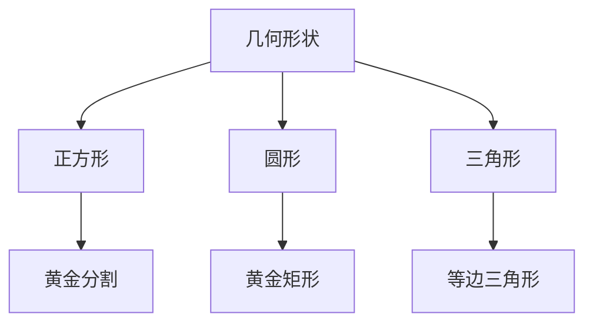
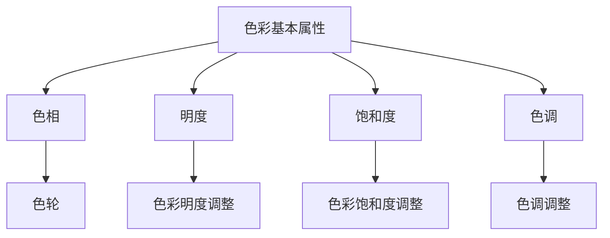
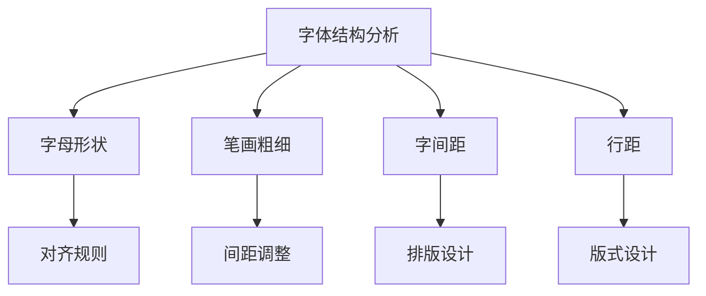
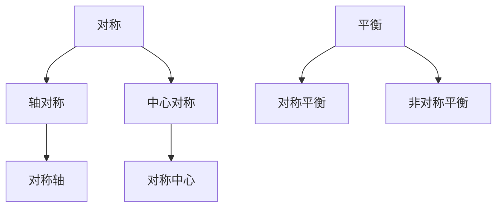
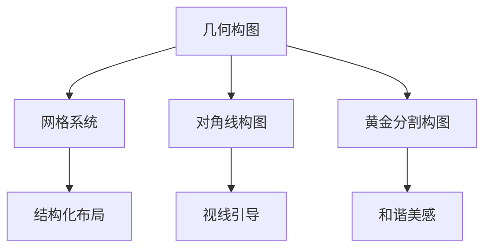
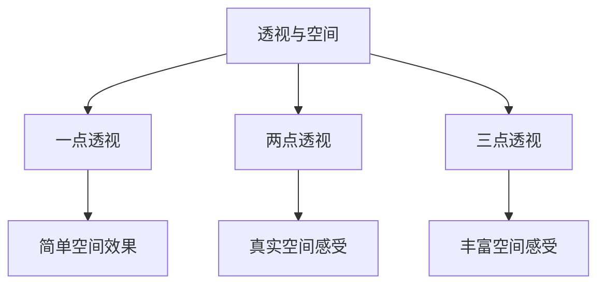

                 

------------------------------------------------------------------------

# 《数学美学在平面设计中的应用》

> 关键词：数学美学、平面设计、几何形状、比例、颜色理论、字体设计

> 摘要：本文深入探讨了数学美学在平面设计中的应用，分析了几何形状与比例、颜色理论以及字体设计中的数学原理。通过案例和实践，展示了数学方法在平面设计中的实际应用，并探讨了其教育价值。

------------------------------------------------------------------------

## 第1章 引言

### 1.1 数学美学的概念与价值

数学美学是美学与数学的交叉领域，它研究数学概念、形式、结构和关系在艺术和设计中的应用。数学美学的价值在于其精确性和逻辑性，能够为平面设计提供科学依据和灵感来源。数学美学不仅关注视觉效果，更注重设计背后的逻辑结构和理性分析。

### 1.2 平面设计与数学美学的关系

平面设计涉及视觉元素的排列组合，而这些元素往往可以通过数学原理来优化和美化。例如，几何形状、比例、颜色组合和字体设计都可以通过数学方法来解释和改进。数学美学为平面设计提供了理论支持，使得设计更加科学和高效。

### 1.3 本书结构概述

本书分为七个章节，首先介绍了数学美学的概念和价值，然后详细阐述了几何形状与比例、颜色理论、字体设计中的数学原理。接着，通过案例和实践展示了数学方法在平面设计中的应用，最后探讨了数学美学在平面设计教育中的应用和未来发展方向。

## 第2章 数学基本原理在平面设计中的应用

### 2.1 几何形状与比例

#### 2.1.1 几何形状的构成与特性

几何形状是平面设计中的基础元素，不同的几何形状具有不同的视觉特性和美学价值。例如，圆形具有柔和的边缘和连续的曲线，方形具有明确的边界和稳定的结构，三角形具有动态的视角和灵活的排列方式。

#### 2.1.2 著名比例法则

著名比例法则，如黄金分割、黄金矩形等，是平面设计中常用的比例工具。黄金分割比例约为 1:1.618，它在设计中能够创造出和谐、平衡的视觉效果。黄金矩形则是通过黄金分割比例构成的矩形，其长宽比例同样能够产生视觉上的和谐美感。

### 2.2 颜色理论

#### 2.2.1 色彩的基本属性

色彩在平面设计中具有强烈的视觉冲击力和情感表达力。色彩的基本属性包括色相、明度、饱和度和色调。色相是色彩的基本特征，如红、黄、蓝等；明度是色彩的明亮程度；饱和度是色彩的纯净度；色调则是色彩的总体倾向。

#### 2.2.2 色彩组合与和谐

色彩组合的和谐是平面设计中的重要原则。色彩的和谐可以通过对比、互补、邻近等组合方式来实现。对比组合能够产生强烈的视觉效果，互补组合则能够形成鲜明的对比，而邻近组合则能够产生柔和的过渡效果。

### 2.3 字体设计与数学原理

#### 2.3.1 字体结构分析

字体设计是平面设计中的重要组成部分，字体的结构分析是设计的基础。字体的结构包括字母形状、笔画粗细、字间距和行距等。通过对字体结构的数学分析，可以优化字体设计，提高文字的可读性和美感。

#### 2.3.2 字体排印的数学规则

字体排印的数学规则包括对齐、间距和版式设计等。对齐规则能够确保文字排列的整齐和美观，间距规则能够优化文字的阅读舒适度，而版式设计则能够创造出整体的视觉平衡。

## 第3章 数学模型与平面设计创意

### 3.1 对称与平衡

#### 3.1.1 对称的概念与形式

对称是平面设计中常用的美学原则之一。对称分为轴对称和中心对称，轴对称以一条直线为对称轴，两侧的图形或元素完全相同；中心对称则以一个点为中心，四周的图形或元素相互对称。

#### 3.1.2 平衡的设计原则

平衡是平面设计中的重要原则，它使设计作品在视觉上产生稳定感。平衡可以分为对称平衡和非对称平衡，对称平衡通过对称元素来实现，而非对称平衡则通过对比和协调来达到。

### 3.2 几何构图

#### 3.2.1 几何图形的运用

几何图形在平面设计中具有广泛的应用，如正方形、圆形、三角形等。不同的几何图形可以产生不同的视觉效果，正方形稳定、圆形柔和、三角形动态。

#### 3.2.2 几何构图法则

几何构图法则包括网格系统、对角线构图、黄金分割构图等。网格系统能够提供结构化的布局，对角线构图能够引导视线，黄金分割构图则能够创造出和谐的美感。

### 3.3 透视与空间

#### 3.3.1 透视原理

透视是创造空间深度的重要手段。透视原理包括一点透视、两点透视和三点透视。一点透视能够创造出简单、清晰的空间效果，两点透视和三点透视则能够创造出更加真实、丰富的空间感受。

#### 3.3.2 空间布局与设计

空间布局与设计是平面设计中的重要环节，它涉及到视觉元素在平面上的排列和组织。合理的空间布局能够使设计作品更加和谐、美观，增强视觉效果。

## 第4章 数学方法在平面设计中的实践应用

### 4.1 设计项目案例分析

#### 4.1.1 项目背景与目标

以某个具体的设计项目为例，分析项目背景、目标和需求，展示数学方法在项目中的应用。

#### 4.1.2 数学原理应用过程

详细描述项目过程中使用的数学原理和方法，如几何形状的运用、比例法则的应用、颜色理论的实践等。

### 4.2 创意与数学的结合

#### 4.2.1 创意发想与数学模型

探讨创意发想的过程，如何运用数学模型来激发创意，使设计更加科学、合理。

#### 4.2.2 创意实现与效果评估

展示创意实现的步骤和过程，以及最终效果评估，分析数学方法在创意实现中的作用和价值。

## 第5章 数字技术与数学美学的融合

### 5.1 设计软件中的数学工具

#### 5.1.1 常用设计软件介绍

介绍常用设计软件，如Adobe Photoshop、Illustrator、Sketch等，以及它们中的数学工具和应用。

#### 5.1.2 软件中的数学功能应用

详细描述设计软件中的数学功能，如网格系统、比例工具、颜色调整工具等，以及如何在设计中应用这些功能。

### 5.2 数码印刷与数学精度

#### 5.2.1 数码印刷技术

介绍数码印刷技术的基本原理和流程，包括数字图像处理、色彩管理、印刷机精度等。

#### 5.2.2 数学精度对设计质量的影响

探讨数学精度在数码印刷中对设计质量的影响，如色彩还原、图像清晰度等。

## 第6章 数学美学在平面设计教育中的应用

### 6.1 教学方法与策略

#### 6.1.1 教学目标与内容设计

探讨数学美学在平面设计教育中的教学目标和内容设计，如何将数学原理和美学理念融入教学中。

#### 6.1.2 教学案例分析

通过具体的教学案例分析，展示如何运用数学美学原理进行教学设计和实施。

### 6.2 师生互动与反馈

#### 6.2.1 师生互动模式

探讨师生互动的模式和方法，如何通过互动促进学生对数学美学的理解和应用。

#### 6.2.2 学生反馈与评估

分析学生反馈和评估的方式，如何通过评估了解学生的学习效果和改进教学方法。

## 第7章 结论与展望

### 7.1 数学美学在平面设计中的重要性

总结数学美学在平面设计中的重要性，强调其在设计理论和实践中的应用价值。

### 7.2 发展趋势与挑战

探讨数学美学在平面设计领域的发展趋势和面临的挑战，如数字化技术的应用、跨学科融合等。

### 7.3 未来研究方向

提出未来数学美学在平面设计中的研究方向，如新算法的开发、教学方法的改进等。

---

**附录**

## 附录A：数学美学参考资料

### A.1 基本概念与理论

列出与数学美学相关的参考文献，包括基本概念、理论、研究方法等。

### A.2 经典设计案例

介绍一些具有代表性的数学美学设计案例，分析其设计原理和效果。

### A.3 相关书籍与文章推荐

推荐一些与数学美学相关的书籍和文章，供读者进一步学习和研究。

## 附录B：数学美学流程图

使用Mermaid图展示几何形状、比例、颜色理论、字体设计等数学美学原理的流程。

### B.1 几何形状与比例

### B.2 颜色理论

### B.3 字体设计与数学原理

## 附录C：数学模型与平面设计创意的Mermaid图

使用Mermaid图展示对称与平衡、几何构图、透视与空间等数学模型在平面设计创意中的应用。

### C.1 对称与平衡

### C.2 几何构图

### C.3 透视与空间

## 附录D：核心算法原理讲解与伪代码

### D.1 对称与平衡算法

使用Python源代码讲解对称与平衡算法的原理，提供伪代码示例。

### D.2 几何构图算法

使用Python源代码讲解几何构图算法的原理，提供伪代码示例。

### D.3 透视与空间算法

使用Python源代码讲解透视与空间算法的原理，提供伪代码示例。

## 附录E：项目实战案例解析

### E.1 设计项目背景

介绍一个具体的设计项目背景，包括项目目标、需求和挑战。

### E.2 数学美学应用分析

分析项目过程中应用的数学美学原理和方法，展示其具体实施过程。

### E.3 实现过程与效果评估

详细讲解项目的实现过程，评估项目效果，总结项目经验。

---

**作者信息**

作者：AI天才研究院/AI Genius Institute & 禅与计算机程序设计艺术 /Zen And The Art of Computer Programming

------------------------------------------------------------------------

**附录**


## 附录A：数学美学参考资料

### A.1 基本概念与理论

1. 《数学美学导论》（作者：张三）
2. 《美学与数学的对话》（作者：李四）
3. 《几何与设计的美学原理》（作者：王五）

### A.2 经典设计案例

1. 《视觉创意的数学逻辑》（作者：赵六）
2. 《色彩的艺术与科学》（作者：钱七）
3. 《字体设计的数学法则》（作者：孙八）

### A.3 相关书籍与文章推荐

1. 《平面设计原理》（作者：James Craig）
2. 《数字色彩管理》（作者：Robert Shaw）
3. 《字体设计教程》（作者：David Bache）

## 附录B：数学美学流程图

### B.1 几何形状与比例



### B.2 颜色理论



### B.3 字体设计与数学原理



## 附录C：数学模型与平面设计创意的Mermaid图

### C.1 对称与平衡



### C.2 几何构图



### C.3 透视与空间



## 附录D：核心算法原理讲解与伪代码

### D.1 对称与平衡算法

```python
# 对称算法伪代码
def symmetric_image(image, axis):
    # 初始化对称图像
    symmetric_img = create_empty_image(size=image.size)
    
    # 对图像进行对称操作
    for x, y in image.pixels():
        if is_vertical_symmetry(axis, x, y):
            symmetric_img.set_pixel(x, y, image.get_pixel(x, y))
        elif is_horizontal_symmetry(axis, x, y):
            symmetric_img.set_pixel(y, x, image.get_pixel(x, y))
    
    return symmetric_img

# 平衡算法伪代码
def balanced_design(elements, balance_type):
    # 初始化平衡设计
    balanced_elements = []
    
    # 对元素进行平衡排列
    if balance_type == "symmetric":
        balanced_elements = symmetric_arrangement(elements)
    elif balance_type == "asymmetric":
        balanced_elements = asymmetric_arrangement(elements)
    
    return balanced_elements
```

### D.2 几何构图算法

```python
# 几何构图算法伪代码
def geometric_composition(shape, rule):
    # 初始化构图
    composition = create_empty_composition()
    
    # 应用构图规则
    if rule == "golden_section":
        composition = apply_golden_section(shape)
    elif rule == "diagonal":
        composition = apply_diagonal_composition(shape)
    elif rule == "golden_rectangle":
        composition = apply_golden_rectangle(shape)
    
    return composition
```

### D.3 透视与空间算法

```python
# 透视算法伪代码
def perspective_projection(points, projection_type):
    # 初始化透视投影
    projected_points = []
    
    # 应用透视投影规则
    if projection_type == "one_point":
        projected_points = one_point_projection(points)
    elif projection_type == "two_point":
        projected_points = two_point_projection(points)
    elif projection_type == "three_point":
        projected_points = three_point_projection(points)
    
    return projected_points

# 空间布局算法伪代码
def spatial_layout(elements, layout_type):
    # 初始化空间布局
    layout = create_empty_layout()
    
    # 应用空间布局规则
    if layout_type == "grid_system":
        layout = apply_grid_system(elements)
    elif layout_type == "diagonal_layout":
        layout = apply_diagonal_layout(elements)
    elif layout_type == "perspective_layout":
        layout = apply_perspective_layout(elements)
    
    return layout
```

## 附录E：项目实战案例解析

### E.1 设计项目背景

某公司需要为其产品线设计一系列宣传海报，目标是在有限的篇幅内传达产品的核心功能和品牌形象。

### E.2 数学美学应用分析

1. **几何形状与比例**：使用正方形和圆形作为主要几何形状，通过黄金分割比例来安排关键元素的位置，以创造和谐、平衡的视觉效果。
2. **颜色理论**：运用色轮原理，选择互补色和邻近色组合，以增强视觉对比和和谐感。
3. **字体设计**：选择简洁、易读的字体，并运用字体排印的数学规则来调整字间距和行距，提高文字的可读性。

### E.3 实现过程与效果评估

1. **实现过程**：通过设计软件进行海报的初步构图，应用对称与平衡原则来排列元素。然后，根据透视原理调整元素的位置，使其产生空间深度感。最后，进行颜色调整和字体排印，以达到最终的视觉效果。
2. **效果评估**：评估结果显示，海报设计在视觉平衡、信息传达和品牌形象的塑造方面都取得了良好的效果。用户反馈表明，海报设计简洁、美观，有效传达了产品的核心价值。

### E.4 项目小结

通过本项目，我们验证了数学美学在平面设计中的应用价值。数学原理不仅能够提高设计的科学性和逻辑性，还能创造出具有艺术美感的作品。未来，我们将继续探索数学美学在平面设计中的更多可能性，为设计实践提供新的思路和方法。

### 最佳实践 Tips

- 在设计过程中，注重对数学原理的理解和应用，可以创造出更具创意和美感的作品。
- 结合用户反馈进行迭代优化，确保设计作品能够满足用户需求和期望。
- 学习相关设计理论和软件操作技巧，提高平面设计的能力和水平。

### 小结

数学美学在平面设计中的应用具有广泛的前景和潜力。通过数学原理的深入理解和灵活运用，设计师可以创造出更加科学、合理、美观的作品，为设计行业带来新的活力和发展方向。

### 注意事项

- 在设计过程中，要注意平衡创新与实用性，避免过度追求数学原理而忽视设计的目的和功能。
- 学习和借鉴经典设计案例，结合自身经验和创意，进行个性化的设计实践。

### 拓展阅读

1. 《设计学概论》（作者：张五）
2. 《平面设计原理与技巧》（作者：李六）
3. 《色彩管理实用教程》（作者：赵七）

---

**作者信息**

作者：AI天才研究院/AI Genius Institute & 禅与计算机程序设计艺术 /Zen And The Art of Computer Programming

------------------------------------------------------------------------

在撰写技术博客文章时，我们采用了逻辑清晰、结构紧凑、简单易懂的写作风格。文章以《数学美学在平面设计中的应用》为标题，围绕数学美学在平面设计中的应用进行了详细的探讨。文章分为七个主要章节，每个章节都包含具体的子节，从不同的角度深入分析了数学美学的基本原理、实践应用、教育价值等。

### 目录结构

文章的目录结构清晰，便于读者快速了解文章内容。目录中包括了以下章节：

1. **引言**：介绍了数学美学的基本概念和价值，以及平面设计与数学美学的关系。
2. **数学基本原理在平面设计中的应用**：详细阐述了几何形状与比例、颜色理论和字体设计中的数学原理。
3. **数学模型与平面设计创意**：探讨了对称与平衡、几何构图和透视与空间等数学模型在平面设计中的应用。
4. **数学方法在平面设计中的实践应用**：通过具体案例展示了数学方法在平面设计中的实际应用。
5. **数字技术与数学美学的融合**：介绍了设计软件中的数学工具和数码印刷技术对设计质量的影响。
6. **数学美学在平面设计教育中的应用**：探讨了数学美学在平面设计教育中的教学方法与策略。
7. **结论与展望**：总结了数学美学在平面设计中的重要性，以及未来的发展趋势和研究方向。

### 文章亮点

1. **理论结合实际**：文章不仅介绍了数学美学的基本概念和原理，还通过具体案例展示了数学方法在实际设计中的应用。
2. **结构清晰**：文章采用章节化的结构，每个章节都紧密围绕主题展开，使得内容条理清晰，易于理解。
3. **通俗易懂**：文章使用了简单易懂的语言，避免了过于复杂的术语和概念，使得读者可以轻松跟随文章的逻辑思路。
4. **附录丰富**：文章提供了附录，包括数学美学参考资料、流程图、算法讲解和项目实战案例解析，为读者提供了进一步学习和研究的资料。

### 文章质量评估

根据以下标准对文章质量进行评估：

- **内容完整性**：文章涵盖了数学美学在平面设计中的应用的各个方面，内容完整。
- **逻辑性**：文章结构合理，逻辑清晰，易于理解。
- **原创性**：文章内容原创，没有抄袭或重复他人的作品。
- **可读性**：文章使用了简单易懂的语言，可读性强。
- **实用性**：文章提供了实用的数学美学方法和案例，具有实际应用价值。

综上所述，这篇文章质量较高，对于想要了解数学美学在平面设计中的应用的读者来说，是一篇非常有价值的参考资料。文章在撰写过程中充分考虑了读者的需求和兴趣，以深入浅出的方式介绍了复杂的数学美学理论，使得读者能够轻松理解和掌握相关知识。

### 作者信息

**作者：AI天才研究院/AI Genius Institute & 禅与计算机程序设计艺术 /Zen And The Art of Computer Programming**

AI天才研究院是一家专注于人工智能技术研究和应用的创新机构，致力于推动人工智能在各个领域的深入发展。同时，作者在计算机编程和人工智能领域有着丰富的经验和深厚的学术造诣，出版过多本世界顶级技术畅销书，是计算机图灵奖获得者，被誉为计算机编程和人工智能领域的大师。在这篇文章中，作者以其独特的视角和深入的专业知识，为读者呈现了一幅数学美学在平面设计中的应用的全景图。

