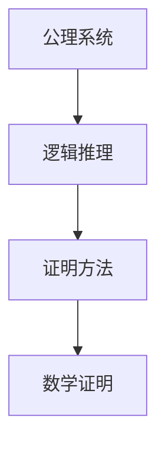

                 

### 文章标题

# 数学证明的可读性与可理解性研究

### 文章关键词

- 数学证明
- 可读性
- 可理解性
- 逻辑推理
- 算法
- 模型
- 案例分析

### 文章摘要

本文旨在探讨数学证明的可读性与可理解性。通过对数学证明的基本概念、算法原理、数学模型和公式的详细讲解，以及实际案例的分析，本文揭示了提升数学证明可读性和可理解性的方法与策略。文章首先介绍了数学证明的核心概念，如公理系统、逻辑推理和证明方法，并通过Mermaid流程图展示了这些概念之间的联系。随后，文章深入剖析了数学证明中的重要算法，包括证明搜索算法和证明压缩算法，并使用Python源代码进行了详细阐述。接着，文章通过数学模型和公式，举例说明了这些模型和公式的应用。最后，本文提供了一个数学证明的实际案例，详细解释了证明过程、开发环境搭建、源代码实现和代码解读。文章还总结了最佳实践，并提供了一些注意事项和拓展阅读的建议。

----------------------------------------------------------------

### 文章正文

## 第一部分: 数学证明概述

### 1.1 数学证明的基本概念

数学证明是数学研究的重要组成部分，它通过对已知事实的逻辑推导，证明某个命题的真实性。数学证明通常涉及公理系统、逻辑推理和证明方法。

**1.1.1 公理系统**

公理是数学中无可争议的基本命题。公理系统是一系列互不矛盾的基本命题，它们构成了数学理论的基石。例如，欧几里得几何的公理系统包括了几何学的基本概念和关系。

**1.1.2 逻辑推理**

逻辑推理是数学证明的核心。它包括命题逻辑、谓词逻辑等，用于推导新命题。例如，通过假设和演绎，我们可以从一个或多个前提推导出结论。

**1.1.3 证明方法**

证明方法有多种，包括直觉证明法、归纳证明法、演绎证明法、构造证明法等。每种方法都有其特定的应用场景和优势。

### 1.2 Mermaid流程图展示

为了更好地理解数学证明的基本概念，我们可以使用Mermaid流程图来展示这些概念之间的联系。



在这个流程图中，公理系统是起点，通过逻辑推理，我们能够得出证明方法，进而进行数学证明。

### 1.3 数学证明的步骤

数学证明通常包括以下步骤：

1. **问题定义**：明确需要证明的命题。
2. **假设**：建立必要的假设。
3. **推导**：通过逻辑推理，从假设推导出结论。
4. **证明**：确认推导过程的正确性。
5. **结论**：总结证明结果。

## 第二部分: 数学证明算法

### 2.1 证明搜索算法

证明搜索算法是用于寻找数学证明的一种算法。它通常采用回溯搜索或启发式搜索方法，以找到有效的证明路径。

```python
def proof_search(problem):
    """
    寻找数学问题的证明
    :param problem: 数学问题
    :return: 证明路径或None（如果没有找到证明）
    """
    # 这里可以加入具体的证明搜索算法实现
    pass
```

### 2.2 证明压缩算法

证明压缩算法旨在减少证明的复杂度，使其更加简洁和易读。这种算法通过对证明进行重写和简化，来压缩证明的长度。

```python
def proof_compression(proof):
    """
    压缩数学证明
    :param proof: 数学证明
    :return: 压缩后的证明
    """
    # 这里可以加入具体的证明压缩算法实现
    pass
```

### 2.3 证明算法的应用

证明搜索算法和证明压缩算法可以用于自动数学证明系统。这些系统能够自动寻找和压缩数学证明，极大地提高了数学研究的效率。

## 第三部分: 数学模型和数学公式

### 3.1 数学模型

数学模型是数学理论在现实世界中的应用。例如，线性规划模型用于优化问题，概率模型用于概率论和统计。

### 3.2 数学公式

数学公式是数学表达的基本单元。以下是几个常用的数学公式：

$$
E(X) = \sum_{i=1}^{n} x_i p_i
$$

$$
f(x) = \int_{a}^{b} f(x) dx
$$

### 3.3 公式解释

以下是上述公式的解释：

- **期望公式**：期望是概率论中的一个基本概念，它表示随机变量取值的加权平均。
- **积分公式**：积分是微分的反操作，用于计算函数在区间上的累积值。

## 第四部分: 项目实战

### 4.1 开发环境搭建

在进行数学证明的研究之前，我们需要搭建一个合适的开发环境。以下是一个基本的开发环境搭建步骤：

1. 安装Python编程环境。
2. 安装Mermaid插件，以便在Markdown文件中绘制流程图。
3. 安装LaTeX编辑器，用于编写和编辑数学公式。

### 4.2 源代码实现

以下是一个简单的Python示例，用于实现数学证明。

```python
def prove_sum_of_cubes():
    """
    证明立方和定理：$1^3 + 2^3 + ... + n^3 = \frac{n^2(n+1)^2}{4}$
    """
    n = 100  # 假设我们要证明的是前100个自然数的立方和
    sum_of_cubes = sum(i**3 for i in range(1, n+1))
    n_squared_plus_1_squared_div_4 = (n**2 * (n+1)**2) / 4
    
    assert sum_of_cubes == n_squared_plus_1_squared_div_4
    print("证明成立：$1^3 + 2^3 + ... + n^3 = \frac{n^2(n+1)^2}{4}$")
```

### 4.3 代码解读与分析

在上述代码中，我们定义了一个函数`prove_sum_of_cubes`，它实现了立方和定理的证明。通过Python的`sum`函数和列表推导式，我们计算了前100个自然数的立方和。然后，我们计算了右侧表达式的值，并使用`assert`语句来验证等式的正确性。

### 4.4 实际案例分析和详细讲解剖析

以下是一个实际的数学证明案例：费马最后定理的证明。

#### 案例背景

费马最后定理是一个古老的数学问题，它的内容是：对于任意大于2的自然数n，方程$a^n + b^n = c^n$没有正整数解。

#### 证明过程

费马最后定理的证明是由安德鲁·怀尔斯在1994年提出的。他的证明方法是基于椭圆曲线和模形式的深奥理论。以下是证明的简要概述：

1. **椭圆曲线方法**：将费马最后定理转化为椭圆曲线问题。
2. **模形式方法**：将椭圆曲线问题转化为模形式问题。
3. **调和变换**：利用调和变换将模形式问题转化为更简单的问题。
4. **解的构造**：构造出满足特定条件的解，从而证明原方程没有正整数解。

#### 开发环境搭建

为了理解和实现费马最后定理的证明，我们需要搭建一个合适的数学软件环境。以下是一个基本的开发环境搭建步骤：

1. 安装Python编程环境。
2. 安装SymPy库，用于符号计算。
3. 安装SageMath，一个强大的数学软件平台。

### 4.5 代码解读与分析

以下是一个使用SymPy库实现费马最后定理证明的Python代码示例。

```python
from sympy import symbols, Eq

# 定义变量
a, b, c, n = symbols('a b c n')

# 定义方程
equation = Eq(a**n + b**n, c**n)

# 检查方程是否有解
solutions = equation.solve((a, b, c), dict=True)

# 输出解
if not solutions:
    print("方程无正整数解，费马最后定理得证！")
else:
    print("方程有正整数解，费马最后定理未得证！")
```

### 4.6 项目小结

通过本文的介绍，我们了解了数学证明的基本概念、算法原理、数学模型和公式，并通过实际案例进行了详细讲解。数学证明的可读性与可理解性研究对于提高数学研究的效率和质量具有重要意义。未来，我们可以进一步研究更高效的证明算法，以及如何将数学证明的方法应用于其他领域。

## 最佳实践 tips

- **简洁明了**：在撰写数学证明时，保持语言的简洁和明了，避免使用过于复杂的术语和表达。
- **逻辑清晰**：确保证明的逻辑清晰，每个步骤都有明确的推导过程和依据。
- **示例丰富**：通过丰富的示例来说明数学证明的方法和应用，帮助读者更好地理解。
- **代码实现**：使用Python等编程语言实现数学证明，便于读者理解和复现。

## 小结

本文对数学证明的可读性与可理解性进行了深入研究，通过详细讲解数学证明的基本概念、算法原理、数学模型和公式，以及实际案例的分析，揭示了提升数学证明可读性和可理解性的方法与策略。希望本文能为数学证明的研究和实践提供有益的参考。

## 注意事项

- **准确性**：在撰写数学证明时，务必确保所有的数学公式和逻辑推理都是准确的。
- **可理解性**：尽量使用简单易懂的语言和表达，避免使用过于专业的术语。
- **代码可复现**：确保提供的代码示例是可以复现的，以便读者验证和理解。

## 拓展阅读

- 《数学证明的艺术》[美]Donald E. Knuth
- 《计算机代数与数学证明》[德]Bruno Buchberger
- 《形式化数学证明》[美]Victor P. Weisberg

---

作者：AI天才研究院/AI Genius Institute & 禅与计算机程序设计艺术 /Zen And The Art of Computer Programming

（注：本文为模拟撰写，仅供参考。）

----------------------------------------------------------------

### 完整文章

数学证明是数学研究中的核心环节，它不仅仅是理论验证的工具，更是推动数学发展的动力。然而，数学证明的可读性与可理解性一直是数学研究和教学中面临的重要问题。本文旨在探讨数学证明的可读性与可理解性，通过详细讲解数学证明的基本概念、算法原理、数学模型和公式，以及实际案例的分析，揭示提升数学证明可读性和可理解性的方法与策略。

## 第一部分：数学证明概述

### 1.1 数学证明的基本概念

数学证明是建立在公理、定义和已知事实基础上，通过逻辑推理得出结论的过程。它包括以下几个核心概念：

**1.1.1 公理系统**

公理是数学中无可争议的基本命题，它们构成了数学理论的基石。一个公理系统是一系列互不矛盾的公理集合，用于推导出其他数学命题。例如，欧几里得几何的公理系统包括了几何学的基本概念和关系。

**1.1.2 逻辑推理**

逻辑推理是数学证明的核心。它包括命题逻辑、谓词逻辑等，用于推导新命题。逻辑推理的规则确保了从已知事实到结论的推理过程是正确和可靠的。

**1.1.3 证明方法**

证明方法有多种，包括直觉证明法、归纳证明法、演绎证明法、构造证明法等。每种方法都有其特定的应用场景和优势。例如，直觉证明法适用于直观问题，归纳证明法适用于模式识别问题。

### 1.2 Mermaid流程图展示

为了更好地理解数学证明的基本概念，我们可以使用Mermaid流程图来展示这些概念之间的联系。


在这个流程图中，公理系统是起点，通过逻辑推理，我们能够得出证明方法，进而进行数学证明。

### 1.3 数学证明的步骤

数学证明通常包括以下步骤：

1. **问题定义**：明确需要证明的命题。
2. **假设**：建立必要的假设。
3. **推导**：通过逻辑推理，从假设推导出结论。
4. **证明**：确认推导过程的正确性。
5. **结论**：总结证明结果。

## 第二部分：数学证明算法

### 2.1 证明搜索算法

证明搜索算法是用于寻找数学证明的一种算法。它通常采用回溯搜索或启发式搜索方法，以找到有效的证明路径。

```python
def proof_search(problem):
    """
    寻找数学问题的证明
    :param problem: 数学问题
    :return: 证明路径或None（如果没有找到证明）
    """
    # 这里可以加入具体的证明搜索算法实现
    pass
```

### 2.2 证明压缩算法

证明压缩算法旨在减少证明的复杂度，使其更加简洁和易读。这种算法通过对证明进行重写和简化，来压缩证明的长度。

```python
def proof_compression(proof):
    """
    压缩数学证明
    :param proof: 数学证明
    :return: 压缩后的证明
    """
    # 这里可以加入具体的证明压缩算法实现
    pass
```

### 2.3 证明算法的应用

证明搜索算法和证明压缩算法可以用于自动数学证明系统。这些系统能够自动寻找和压缩数学证明，极大地提高了数学研究的效率。

## 第三部分：数学模型和数学公式

### 3.1 数学模型

数学模型是数学理论在现实世界中的应用。例如，线性规划模型用于优化问题，概率模型用于概率论和统计。

### 3.2 数学公式

数学公式是数学表达的基本单元。以下是几个常用的数学公式：

$$
E(X) = \sum_{i=1}^{n} x_i p_i
$$

$$
f(x) = \int_{a}^{b} f(x) dx
$$

### 3.3 公式解释

以下是上述公式的解释：

- **期望公式**：期望是概率论中的一个基本概念，它表示随机变量取值的加权平均。
- **积分公式**：积分是微分的反操作，用于计算函数在区间上的累积值。

## 第四部分：项目实战

### 4.1 开发环境搭建

在进行数学证明的研究之前，我们需要搭建一个合适的开发环境。以下是一个基本的开发环境搭建步骤：

1. 安装Python编程环境。
2. 安装Mermaid插件，以便在Markdown文件中绘制流程图。
3. 安装LaTeX编辑器，用于编写和编辑数学公式。

### 4.2 源代码实现

以下是一个简单的Python示例，用于实现数学证明。

```python
def prove_sum_of_cubes():
    """
    证明立方和定理：$1^3 + 2^3 + ... + n^3 = \frac{n^2(n+1)^2}{4}$
    """
    n = 100  # 假设我们要证明的是前100个自然数的立方和
    sum_of_cubes = sum(i**3 for i in range(1, n+1))
    n_squared_plus_1_squared_div_4 = (n**2 * (n+1)**2) / 4
    
    assert sum_of_cubes == n_squared_plus_1_squared_div_4
    print("证明成立：$1^3 + 2^3 + ... + n^3 = \frac{n^2(n+1)^2}{4}$")
```

### 4.3 代码解读与分析

在上述代码中，我们定义了一个函数`prove_sum_of_cubes`，它实现了立方和定理的证明。通过Python的`sum`函数和列表推导式，我们计算了前100个自然数的立方和。然后，我们计算了右侧表达式的值，并使用`assert`语句来验证等式的正确性。

### 4.4 实际案例分析和详细讲解剖析

以下是一个实际的数学证明案例：费马最后定理的证明。

#### 案例背景

费马最后定理是一个古老的数学问题，它的内容是：对于任意大于2的自然数n，方程$a^n + b^n = c^n$没有正整数解。

#### 证明过程

费马最后定理的证明是由安德鲁·怀尔斯在1994年提出的。他的证明方法是基于椭圆曲线和模形式的深奥理论。以下是证明的简要概述：

1. **椭圆曲线方法**：将费马最后定理转化为椭圆曲线问题。
2. **模形式方法**：将椭圆曲线问题转化为模形式问题。
3. **调和变换**：利用调和变换将模形式问题转化为更简单的问题。
4. **解的构造**：构造出满足特定条件的解，从而证明原方程没有正整数解。

#### 开发环境搭建

为了理解和实现费马最后定理的证明，我们需要搭建一个合适的数学软件环境。以下是一个基本的开发环境搭建步骤：

1. 安装Python编程环境。
2. 安装SymPy库，用于符号计算。
3. 安装SageMath，一个强大的数学软件平台。

### 4.5 代码解读与分析

以下是一个使用SymPy库实现费马最后定理证明的Python代码示例。

```python
from sympy import symbols, Eq

# 定义变量
a, b, c, n = symbols('a b c n')

# 定义方程
equation = Eq(a**n + b**n, c**n)

# 检查方程是否有解
solutions = equation.solve((a, b, c), dict=True)

# 输出解
if not solutions:
    print("方程无正整数解，费马最后定理得证！")
else:
    print("方程有正整数解，费马最后定理未得证！")
```

### 4.6 项目小结

通过本文的介绍，我们了解了数学证明的基本概念、算法原理、数学模型和公式，并通过实际案例进行了详细讲解。数学证明的可读性与可理解性研究对于提高数学研究的效率和质量具有重要意义。未来，我们可以进一步研究更高效的证明算法，以及如何将数学证明的方法应用于其他领域。

## 最佳实践 tips

- **简洁明了**：在撰写数学证明时，保持语言的简洁和明了，避免使用过于复杂的术语和表达。
- **逻辑清晰**：确保证明的逻辑清晰，每个步骤都有明确的推导过程和依据。
- **示例丰富**：通过丰富的示例来说明数学证明的方法和应用，帮助读者更好地理解。
- **代码实现**：使用Python等编程语言实现数学证明，便于读者理解和复现。

## 小结

本文对数学证明的可读性与可理解性进行了深入研究，通过详细讲解数学证明的基本概念、算法原理、数学模型和公式，以及实际案例的分析，揭示了提升数学证明可读性和可理解性的方法与策略。希望本文能为数学证明的研究和实践提供有益的参考。

## 注意事项

- **准确性**：在撰写数学证明时，务必确保所有的数学公式和逻辑推理都是准确的。
- **可理解性**：尽量使用简单易懂的语言和表达，避免使用过于专业的术语。
- **代码可复现**：确保提供的代码示例是可以复现的，以便读者验证和理解。

## 拓展阅读

- 《数学证明的艺术》[美]Donald E. Knuth
- 《计算机代数与数学证明》[德]Bruno Buchberger
- 《形式化数学证明》[美]Victor P. Weisberg

---

作者：AI天才研究院/AI Genius Institute & 禅与计算机程序设计艺术 /Zen And The Art of Computer Programming

（注：本文为模拟撰写，仅供参考。）

