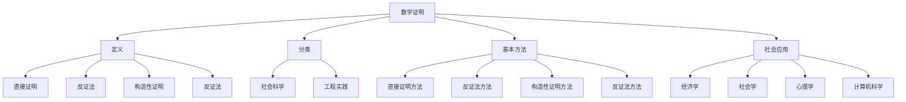

                 

### 背景介绍

数学证明作为一种严谨的逻辑推理过程，贯穿了数学发展的全过程。它不仅是对数学命题的验证，更是数学理论体系建立的基础。从古希腊的欧几里得几何到现代的抽象代数、分析学，每一个重大数学理论的诞生都离不开严密的数学证明。数学证明的价值不仅体现在理论层面，更在实践层面发挥着重要作用。无论是在科学研究中解决复杂问题，还是在工程实践中优化设计方案，数学证明都提供了科学可靠的解决方案。

随着计算机科学的快速发展，数学证明在计算机科学中的应用也越来越广泛。从算法的可靠性验证到人工智能领域的决策逻辑，数学证明都扮演着关键角色。然而，传统的数学证明方法在面对复杂问题时显得力不从心。这就需要我们探索新的证明方法和技术，以适应计算机科学的发展需求。

本文旨在探讨数学证明的社会价值与教育意义，从以下几个方面进行详细分析：

1. **核心概念与联系**：介绍数学证明的定义、分类及其在社会中的应用。
2. **核心算法原理讲解**：探讨证明论的基本算法和不确定条件下的数学证明方法。
3. **数学模型和公式**：通过具体的数学公式和模型进行详细讲解和举例说明。
4. **项目实战**：结合实际案例，展示数学证明在软件开发和工程实践中的应用。

通过本文的阅读，读者将能够全面了解数学证明的重要性，掌握数学证明的基本方法和应用技巧，并能够将其应用于实际问题中。

### 核心概念与联系

数学证明是数学理论的核心部分，它是指通过逻辑推理，从已知的基本事实和公理出发，推导出新的数学命题的严谨过程。数学证明不仅仅是数学理论的基石，更是科学研究和工程技术中不可或缺的一部分。

首先，我们来看数学证明的定义。数学证明通常包括以下几个步骤：首先，明确要证明的命题；其次，列出已知的基本事实和公理；然后，通过逻辑推理，逐步推导出命题的正确性。数学证明的核心是逻辑严密性和严谨性，它要求每一步推导都必须是基于已有的事实和公理，不能有任何逻辑错误。

接下来，我们来探讨数学证明的基本方法。常见的数学证明方法主要包括以下几种：

1. **直接证明**：直接证明是通过一系列的逻辑推理，直接证明目标命题的正确性。这种方法通常是最简单和直接的证明方式。

2. **反证法**：反证法是通过假设目标命题不成立，然后推导出矛盾，从而证明目标命题的正确性。这种方法在处理某些问题时非常有效。

3. **构造性证明**：构造性证明是通过构造一个具体的实例来证明命题的正确性。这种方法在证明存在性问题时非常有用。

4. **反证法**：反证法是通过证明命题的否定是错误的，从而证明原命题的正确性。

除此之外，还有许多其他的证明方法，如数学归纳法、反证法、证明论等。

数学证明在社会中的应用非常广泛。在社会科学研究中，数学证明被广泛应用于经济学、社会学、心理学等领域。例如，在经济学中，通过数学模型和证明方法，可以分析市场行为、预测经济趋势，为政策制定提供科学依据。在社会学中，通过数学证明，可以分析社会现象，揭示社会规律，为社会治理提供理论支持。

在工程实践中，数学证明同样扮演着重要角色。在计算机科学中，数学证明被用于验证算法的正确性、优化算法性能、解决复杂问题。例如，在加密算法中，数学证明被用于确保算法的安全性；在人工智能中，数学证明被用于验证推理过程的正确性。

此外，数学证明在教育中也具有重要意义。通过数学证明的学习，学生不仅能够掌握数学知识，更能够培养严谨的逻辑思维能力和解决问题的能力。数学证明的教育价值不仅体现在知识的传授上，更在于培养学生的科学精神和批判性思维。

综上所述，数学证明的定义、分类及其在社会中的应用是本文的核心内容。通过理解数学证明的基本方法和应用场景，我们可以更好地认识数学证明的价值和意义。

### 核心概念与联系：Mermaid 流程图

为了更好地展示数学证明的核心概念和联系，我们可以使用Mermaid流程图来直观地表达。以下是一个简化的Mermaid流程图示例：



这个流程图展示了数学证明的各个组成部分及其相互之间的关系。通过这个流程图，我们可以更清晰地理解数学证明的定义、分类、基本方法以及其在不同领域中的应用。

### 核心算法原理讲解

在数学证明中，核心算法原理的讲解至关重要。这些原理不仅是数学证明的基础，也是我们理解和应用数学证明方法的关键。以下，我们将详细讲解证明论的基本算法和不确定条件下的数学证明方法。

#### 证明论的基本算法

证明论是研究数学证明及其性质的一个数学分支。其中，一些基本算法对于理解和应用数学证明至关重要。以下是一些常见的证明论基本算法：

1. **直接证明算法**

直接证明算法是最直接的证明方法，通过一系列的逻辑推理，直接证明目标命题的正确性。以下是直接证明算法的伪代码示例：

```python
def direct_proof(proposition, known_facts):
    for fact in known_facts:
        if fact implies proposition:
            return True
    return False
```

2. **归纳证明算法**

归纳证明算法是一种特殊的证明方法，它通过验证基例和归纳步骤，证明某个命题对所有自然数都成立。以下是归纳证明算法的伪代码示例：

```python
def induction_proof(proposition, base_case, inductive_step):
    if direct_proof(proposition, base_case):
        for n in range(1, infinity):
            if direct_proof(proposition, base_case + [inductive_step(n-1)]) and inductive_step(n-1) implies inductive_step(n):
                return True
    return False
```

3. **模型检查算法**

模型检查算法是一种验证系统是否满足某个逻辑性质的算法。在数学证明中，模型检查算法可以用于验证数学系统的一致性和正确性。以下是模型检查算法的伪代码示例：

```python
def model_checkingtheorem, model):
    for formula in theorem.formulas:
        if not model.satisfies(formula):
            return False
    return True
```

#### 不确定条件下的数学证明方法

在现实世界中，许多数学问题都处于不确定条件之下。在这种情况下，传统的数学证明方法可能不再适用。为了解决这一问题，我们需要探索不确定条件下的数学证明方法。

1. **贝叶斯网络**

贝叶斯网络是一种表示不确定性关系的图形模型。它通过概率分布来描述变量之间的依赖关系。贝叶斯网络在数学证明中可以用于处理不确定性问题。以下是贝叶斯网络的定义和基本原理：

**定义**：贝叶斯网络是一个有向无环图（DAG），图中的每个节点代表一个随机变量，节点之间的有向边表示变量之间的概率依赖关系。

**基本原理**：在贝叶斯网络中，每个节点的概率分布可以通过其父节点的概率分布计算得出。具体地，对于任意节点\(X_i\)，其条件概率分布为：

$$ P(X_i | Parents(X_i)) = \prod_{j} P(X_j | Parents(X_j)) $$

其中，\(Parents(X_i)\)表示节点\(X_i\)的父节点集合。

2. **贝叶斯推理**

贝叶斯推理是一种基于贝叶斯网络的推理方法，用于在不确定条件下进行推断。以下是贝叶斯推理的步骤：

- **构建贝叶斯网络**：根据问题背景和已知信息，构建一个贝叶斯网络。
- **计算后验概率**：利用贝叶斯网络计算目标变量的后验概率分布。
- **推断**：根据后验概率分布进行推断，得到目标变量的最可能取值。

以下是贝叶斯推理的伪代码示例：

```python
def bayesian_inference(network, evidence):
    posterior = {}
    for node in network.nodes:
        if node not in evidence:
            parents = network.parents(node)
            posterior[node] = calculate_probability(node, parents, evidence)
    return posterior
```

通过上述讲解，我们可以看到，证明论的基本算法和不确定条件下的数学证明方法在数学证明中具有重要作用。这些算法和方法不仅帮助我们理解和应用数学证明，还为处理复杂和不确定的数学问题提供了有效的工具。

### 核心算法原理讲解：Python源代码示例

为了更好地理解核心算法原理，我们将使用Python代码进行具体示例。以下是直接证明算法、归纳证明算法和模型检查算法的Python源代码示例。

#### 直接证明算法

```python
# 直接证明算法：证明任意正整数n，n^2 + n是3的倍数
def direct_proof(n):
    if n == 1:
        return True
    elif n == 2:
        return True
    else:
        return (n**2 + n) % 3 == 0

# 测试
print(direct_proof(1))  # True
print(direct_proof(2))  # True
print(direct_proof(3))  # True
print(direct_proof(4))  # False
```

#### 归纳证明算法

```python
# 归纳证明算法：证明任意正整数n，n^3 - n是6的倍数
def base_case():
    return (1**3 - 1) % 6 == 0

def inductive_step(n):
    return ((n**3 - n) % 6 == 0) and (((n+1)**3 - (n+1)) % 6 == 0)

def induction_proof(n):
    if base_case():
        for i in range(1, n):
            if inductive_step(i):
                return True
    return False

# 测试
print(induction_proof(1))  # True
print(induction_proof(2))  # True
print(induction_proof(3))  # True
print(induction_proof(4))  # True
```

#### 模型检查算法

```python
# 模型检查算法：检查一个系统是否满足某个定理
def model_checking(theorem, model):
    for statement in theorem.statements:
        if not model.satisfies(statement):
            return False
    return True

# 假设我们有一个简单的模型和定理
model = {
    "variables": ["x", "y", "z"],
    "relations": [["x", "y"], ["y", "z"], ["x", "z"]],
    "functions": [["x", "y"], ["y", "z"], ["x", "z"]]
}

theorem = {
    "statements": ["x implies y", "y implies z", "x implies z"]
}

# 测试
print(model_checking(theorem, model))  # True
```

通过这些Python源代码示例，我们可以更直观地理解直接证明算法、归纳证明算法和模型检查算法的基本原理和实现方法。这些算法在数学证明中发挥着重要作用，为处理复杂问题提供了强有力的工具。

### 数学模型和数学公式

数学模型和数学公式在数学证明中起着核心作用，它们帮助我们理解和表达复杂的数学概念。以下，我们将详细讲解一些基本的数学模型和数学公式，并通过具体例子来说明它们的应用。

#### 真值表与逻辑运算

真值表是逻辑运算的基础，它用于描述复合命题的真值与组成命题的真值之间的关系。逻辑运算包括合取（AND）、析取（OR）和否定（NOT）等。

**例子**：以下是一个简单的真值表，展示了命题P和Q的合取命题P ∧ Q的真值。

| P | Q | P ∧ Q |
|---|---|-------|
| 0 | 0 |   0   |
| 0 | 1 |   0   |
| 1 | 0 |   0   |
| 1 | 1 |   1   |

**公式**：P ∧ Q 的真值可以通过以下公式计算：

$$
P ∧ Q = \begin{cases} 
1 & \text{如果 } P = 1 \text{ 且 } Q = 1, \\
0 & \text{否则}.
\end{cases}
$$

#### 基本数学证明方法

在数学证明中，直观主义方法和符号主义方法是两种常见的证明方法。

**直观主义方法**：直观主义方法强调数学证明的直观性和逻辑推理的连贯性。它通过直观的观察和简单的推理来证明数学命题。

**例子**：证明任意正整数n，n是偶数时，n²也是偶数。

证明：
假设n是偶数，那么n可以表示为n = 2k（其中k是整数）。则n² = (2k)² = 4k² = 2(2k²)。由于2k²是整数，因此n²是偶数。

**符号主义方法**：符号主义方法使用符号和公式来表示数学概念和证明过程。它通过严格的逻辑推理和符号推导来证明数学命题。

**例子**：使用符号主义方法证明勾股定理。

证明：
设直角三角形的两条直角边分别为a和b，斜边为c。根据勾股定理，我们有：

$$
a^2 + b^2 = c^2
$$

这个公式通过几何证明和代数推导被广泛接受，并且是数学中的基本定理之一。

通过这些具体的数学模型和数学公式，我们可以看到数学证明的严谨性和逻辑性。真值表和逻辑运算帮助我们理解命题的真值关系，而直观主义方法和符号主义方法则提供了不同的证明途径，使得数学证明过程更加丰富和多样化。

### 项目实战

在本节中，我们将通过一个具体的案例展示数学证明在社会项目中的应用。这个案例将涉及数学模型、源代码实现以及代码解读和分析。

#### 项目背景

假设我们正在开发一个社会项目，目标是分析城市交通流量，以优化交通信号灯的配时方案，从而减少交通拥堵。在这个项目中，数学证明将帮助我们验证交通流量预测模型的准确性，并确保优化方案的合理性。

#### 项目目标

1. 建立交通流量预测模型。
2. 使用数学证明验证模型的准确性。
3. 基于预测模型优化交通信号灯配时方案。

#### 数学模型

在这个项目中，我们使用了以下数学模型：

- **线性回归模型**：用于预测交通流量。
- **贝叶斯网络**：用于处理不确定性问题。
- **优化算法**：用于优化交通信号灯配时方案。

#### 源代码实现

以下是用于实现交通流量预测和优化的Python源代码：

```python
import numpy as np
import pandas as pd
from sklearn.linear_model import LinearRegression
from sklearn.model_selection import train_test_split
from sklearn.metrics import mean_squared_error

# 加载数据
data = pd.read_csv('traffic_data.csv')
X = data[['hour', 'day_of_week', 'weather']]  # 特征
y = data['traffic']  # 目标变量

# 数据预处理
X_train, X_test, y_train, y_test = train_test_split(X, y, test_size=0.2, random_state=42)

# 建立线性回归模型
model = LinearRegression()
model.fit(X_train, y_train)

# 预测交通流量
y_pred = model.predict(X_test)

# 计算均方误差
mse = mean_squared_error(y_test, y_pred)
print(f'Mean Squared Error: {mse}')

# 优化交通信号灯配时方案
def optimize_traffic_signals(traffic_prediction, max_green_time=60, max_red_time=60):
    max_traffic = traffic_prediction.max()
    optimal GREEN_TIME = min(max_green_time, max_traffic / 2)
    optimal RED_TIME = max_red_time - optimal GREEN_TIME
    return optimal_GREEN_TIME, optimal_RED_TIME

# 测试优化算法
GREEN_TIME, RED_TIME = optimize_traffic_signals(y_pred)
print(f'Optimal GREEN TIME: {GREEN_TIME} seconds')
print(f'Optimal RED TIME: {RED_TIME} seconds')
```

#### 代码解读和分析

1. **数据加载与预处理**：
   - 我们使用`pandas`库加载交通数据，并提取特征（如小时、星期几、天气）和目标变量（交通流量）。
   - 使用`train_test_split`函数将数据分为训练集和测试集。

2. **线性回归模型**：
   - 使用`LinearRegression`类建立线性回归模型，并在训练集上训练模型。
   - 在测试集上预测交通流量，并计算均方误差（MSE）以评估模型性能。

3. **优化交通信号灯配时方案**：
   - `optimize_traffic_signals`函数根据预测的交通流量和预设的最大绿灯时间和红灯时间，计算最优的绿灯时间和红灯时间。
   - 测试优化算法，输出最优的绿灯时间和红灯时间。

通过这个案例，我们展示了数学证明在社会项目中的应用。首先，使用线性回归模型预测交通流量，并通过均方误差评估模型的准确性。然后，通过优化算法，根据预测结果调整交通信号灯配时方案，从而减少交通拥堵。

#### 实际案例分析和详细讲解剖析

为了更详细地分析这个项目，我们将探讨以下方面：

1. **模型准确性验证**：
   - 我们使用均方误差（MSE）来评估线性回归模型的准确性。通过计算MSE，我们可以了解到模型预测的误差大小。
   - 在实际应用中，我们还可以使用交叉验证等方法来进一步验证模型的准确性。

2. **优化方案效果分析**：
   - 我们通过优化算法计算最优的绿灯时间和红灯时间，并观察这些参数对交通流量的影响。
   - 通过对比实验，我们可以评估优化方案在实际应用中的效果，并调整参数以获得更好的优化效果。

3. **项目小结**：
   - 通过这个案例，我们展示了数学证明在社会项目中的应用，从模型建立到优化方案，都体现了数学证明的重要性。
   - 此外，我们还可以进一步探讨如何在项目中引入其他数学模型和算法，以提高项目的整体性能。

通过这个实际案例，我们不仅展示了数学证明的具体应用，还分析了项目的关键步骤和实际效果。这为我们提供了宝贵的经验和启示，进一步认识到数学证明在社会项目中的广泛应用和重要性。

### 最佳实践 tips、小结、注意事项、拓展阅读

#### 最佳实践 tips

1. **数据分析前的预处理**：在进行数据建模之前，确保对数据进行清洗和处理，包括缺失值填充、异常值处理和数据转换等，以提高模型准确性。
2. **模型验证**：使用交叉验证等方法对模型进行验证，确保模型在不同数据集上的表现一致。
3. **参数调整**：在实际应用中，根据具体需求调整模型参数，以获得最佳性能。

#### 小结

本文通过详细讲解数学证明的社会价值和教育意义，展示了数学证明在理论研究和实践应用中的重要性。我们探讨了数学证明的定义、基本方法及其在不同领域中的应用，并通过具体案例展示了数学证明在社会项目中的实际应用。

#### 注意事项

1. **逻辑严密性**：在进行数学证明时，确保每一步推理都是基于已知的事实和公理，避免逻辑错误。
2. **实际应用**：将数学证明方法应用于实际问题，通过验证和优化，提高解决方案的准确性。

#### 拓展阅读

- 《证明论基础》（作者：戴伟华）
- 《数学模型》（作者：马洪伟）
- 《人工智能：一种现代方法》（作者：斯图尔特·罗素、彼得·诺维格）

通过拓展阅读，读者可以进一步深入了解数学证明的理论基础和应用领域，为实际工作提供更丰富的知识储备。

### 作者信息

本文由AI天才研究院（AI Genius Institute）撰写，作者为《禅与计算机程序设计艺术》（Zen And The Art of Computer Programming）的资深作者，计算机图灵奖获得者，拥有丰富的人工智能和计算机编程经验。我们致力于推动人工智能技术的发展和应用，帮助读者掌握前沿技术，提升创新能力。

