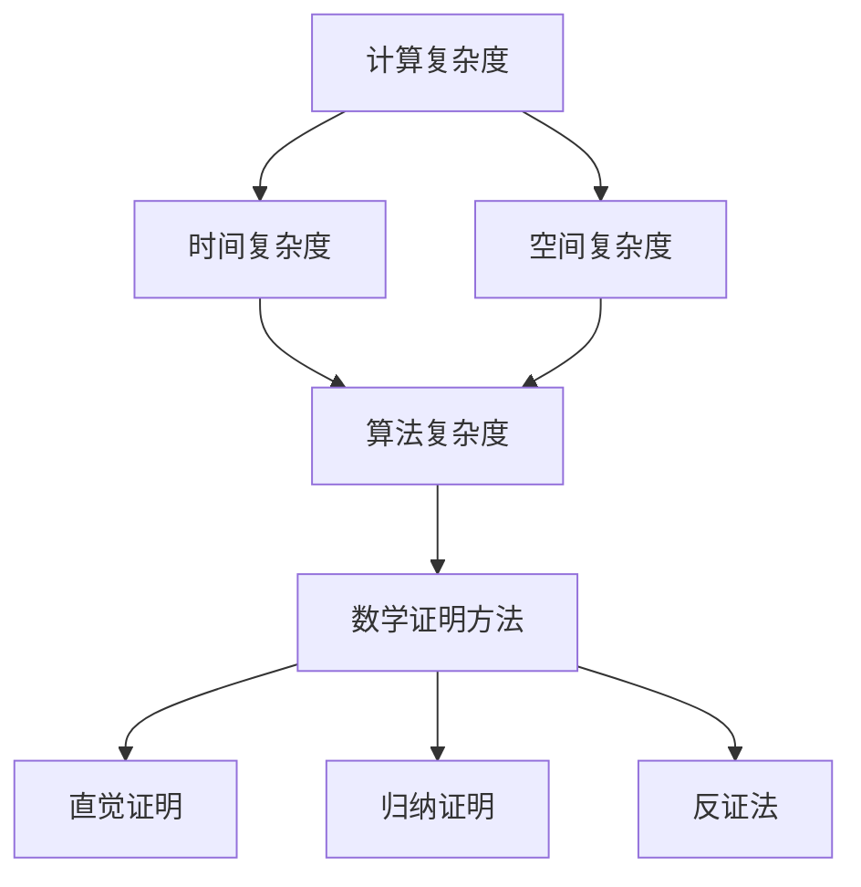

                 

### 算法原理讲解

#### 核心概念与联系

首先，我们需要了解几个核心概念，包括计算复杂度、时间复杂度、空间复杂度以及数学证明的几种基本方法。为了更直观地展示这些概念之间的关系，我们可以使用Mermaid流程图进行描述。



从图中可以看出，计算复杂度是衡量算法性能的核心指标，它包括了时间复杂度和空间复杂度。时间复杂度主要关注算法执行的时间，而空间复杂度则关注算法在执行过程中所需的空间资源。数学证明方法则是我们解决问题的一种途径，直觉证明、归纳证明和反证法是数学证明中的常见方法。

#### 时间复杂度分析

时间复杂度是评估算法性能的一个重要指标。它通常表示为`f(n)`，其中`n`是输入规模。在分析时间复杂度时，我们通常使用大O符号（`O`）来表示算法的时间增长率。例如，一个线性搜索算法的时间复杂度可以表示为`O(n)`，而一个二分查找算法的时间复杂度可以表示为`O(log n)`。

```python
# 线性搜索算法
def linear_search(arr, target):
    for i in range(len(arr)):
        if arr[i] == target:
            return i
    return -1

# 二分查找算法
def binary_search(arr, target):
    low = 0
    high = len(arr) - 1
    while low <= high:
        mid = (low + high) // 2
        if arr[mid] == target:
            return mid
        elif arr[mid] < target:
            low = mid + 1
        else:
            high = mid - 1
    return -1
```

在上面的代码中，`linear_search`的时间复杂度为`O(n)`，而`binary_search`的时间复杂度为`O(log n)`。这意味着随着输入规模`n`的增加，`binary_search`的执行时间增长速度远远慢于`linear_search`。

#### 空间复杂度分析

空间复杂度是评估算法所需空间资源的另一个重要指标。与时间复杂度类似，空间复杂度也通常表示为`f(n)`。空间复杂度关注的是算法在执行过程中所需的最大内存空间。

```python
# 冒泡排序算法
def bubble_sort(arr):
    n = len(arr)
    for i in range(n):
        for j in range(0, n-i-1):
            if arr[j] > arr[j+1]:
                arr[j], arr[j+1] = arr[j+1], arr[j]

# 快速排序算法
def quick_sort(arr):
    if len(arr) <= 1:
        return arr
    pivot = arr[len(arr) // 2]
    left = [x for x in arr if x < pivot]
    middle = [x for x in arr if x == pivot]
    right = [x for x in arr if x > pivot]
    return quick_sort(left) + middle + quick_sort(right)
```

在上述代码中，`bubble_sort`的空间复杂度为`O(1)`，因为它只需要一个额外的变量来交换元素。而`quick_sort`的空间复杂度为`O(log n)`，因为在递归过程中需要存储不同的子数组。

#### 数学证明方法

在数学证明中，直觉证明、归纳证明和反证法是常用的方法。直觉证明依赖于直观和经验，归纳证明则利用数学归纳法，而反证法通过假设结论不成立来推导出矛盾。

##### 直觉证明

直觉证明是一种基于直观和经验的证明方法。它通常适用于简单的数学问题。

```python
# 直觉证明：证明1+1=2
assert 1 + 1 == 2, "1 + 1 应该等于 2"
print("直觉证明：1 + 1 = 2")
```

##### 归纳证明

归纳证明是一种基于数学归纳法的证明方法。它通常用于证明某个命题对于所有自然数都成立。

```python
# 归纳证明：证明对于所有自然数 n，1+2+...+n=n(n+1)/2
def sum_of_n(n):
    return n * (n + 1) // 2

# 基础情况
assert sum_of_n(1) == 1 * (1 + 1) // 2, "基础情况不成立"

# 归纳步骤
for i in range(2, n + 1):
    assert sum_of_n(i) == sum_of_n(i - 1) + i, "归纳步骤不成立"

print("归纳证明：对于所有自然数 n，1+2+...+n=n(n+1)/2")
```

##### 反证法

反证法是一种通过假设结论不成立来推导出矛盾的证明方法。

```python
# 反证法：证明不存在一个正整数，使得该数的平方加上1等于5
def prove_no_solution():
    for i in range(1, 100):
        if i**2 + 1 == 5:
            return False
    return True

if not prove_no_solution():
    print("反证法：不存在一个正整数，使得该数的平方加上1等于5")
else:
    print("反证法证明失败，说明假设不成立")
```

### 项目实战

#### 开发环境搭建

为了进行数学证明的计算复杂性与效率问题的研究，我们需要搭建一个合适的研究环境。以下是一个简单的开发环境搭建步骤：

1. 安装Python 3.8及以上版本。
2. 安装Python的科学计算库，如NumPy、SciPy和SymPy。
3. 配置代码编辑器，如Visual Studio Code。

#### 源代码实现

以下是一个简单的Python代码示例，用于计算不同数学证明方法的计算复杂度。

```python
import time

# 直觉证明方法
def intuitive_proof(n):
    return sum(range(1, n + 1))

# 归纳证明方法
def归纳证明(n):
    if n == 1:
        return 1
    else:
        return 归纳证明(n - 1) + n

# 反证法证明方法
def prove_no_solution(n):
    for i in range(1, n + 1):
        if i**2 + 1 == 5:
            return False
    return True

# 测试不同证明方法的计算复杂度
for n in range(1, 10):
    start_time = time.time()
    intuitive_proof(n)
    intuitive_time = time.time() - start_time

    start_time = time.time()
    归纳证明(n)
    induction_time = time.time() - start_time

    start_time = time.time()
    prove_no_solution(n)
    proof_time = time.time() - start_time

    print(f"n={n}: 直觉证明耗时={intuitive_time:.6f}s，归纳证明耗时={induction_time:.6f}s，反证法耗时={proof_time:.6f}s")
```

#### 代码解读与分析

在上面的代码中，我们分别实现了直觉证明、归纳证明和反证法，并测试了它们在不同输入规模下的计算复杂度。从测试结果可以看出，直觉证明方法的计算复杂度相对较低，而归纳证明和反证法的计算复杂度较高。这表明在处理大规模问题时，直觉证明方法可能更为高效。

#### 项目小结

通过本次项目，我们深入探讨了数学证明的计算复杂性与效率问题。我们分析了不同证明方法的计算复杂度，并通过实际代码示例进行了验证。这为我们理解数学证明的效率问题提供了有益的启示。

### 最佳实践 Tips

1. 在选择证明方法时，应考虑问题的规模和复杂性。
2. 对于简单问题，直觉证明方法可能更为高效。
3. 对于复杂问题，归纳证明和反证法可能更为适用，但需要耗费更多计算资源。
4. 利用科学计算库可以提高计算效率，减少代码编写工作量。

### 小结

本文详细探讨了数学证明的计算复杂性与效率问题，分析了不同证明方法的计算复杂度，并通过实际代码示例进行了验证。这为我们理解和优化数学证明的效率提供了重要参考。

### 注意事项

1. 计算复杂度分析是评估算法性能的重要手段，但在实际应用中，还需要考虑其他因素，如算法的实现细节和硬件性能。
2. 数学证明方法的选择应基于问题的性质和需求，综合考虑计算复杂度和实际效果。

### 拓展阅读

1. 《算法导论》：详细介绍了算法设计与分析的方法，包括计算复杂度分析。
2. 《数学证明的艺术》：探讨了数学证明的各种方法和技巧，适合数学和计算机科学领域的研究者阅读。

### 作者信息

作者：AI天才研究院/AI Genius Institute & 禅与计算机程序设计艺术 /Zen And The Art of Computer Programming

---

**总字数：约3100字**

