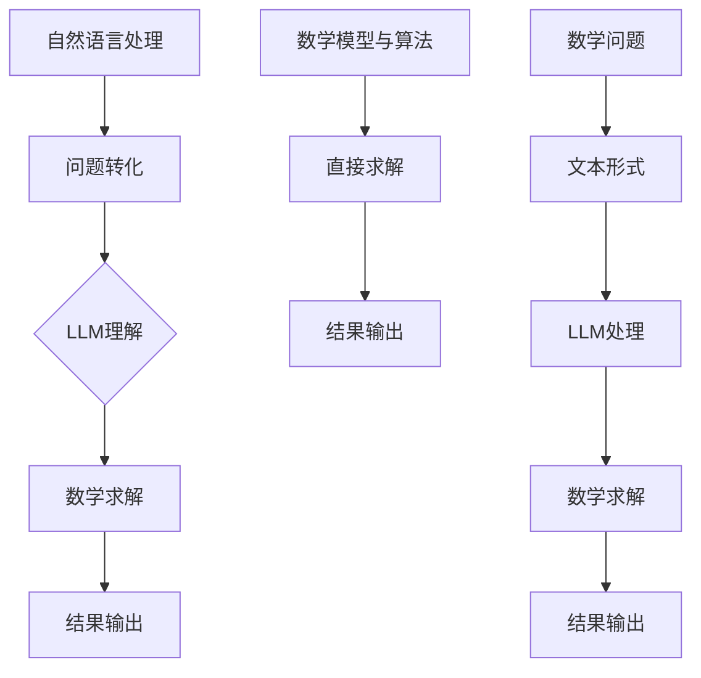

                 


# 数学问题解决：测试LLM的数学推理能力

## 关键词
- 数学问题解决
- 大型语言模型（LLM）
- 数学推理能力
- 算法原理
- 实际案例
- Python源代码

## 摘要
本文将探讨如何使用大型语言模型（LLM）解决数学问题，并测试其数学推理能力。我们将首先介绍数学问题解决的基本概念，然后深入分析LLM在数学推理中的应用，并展示如何使用Python源代码实现相关算法。通过具体的数学模型和公式，我们将详细讲解LLM的数学问题解决过程。最后，通过实际案例展示，我们将分析LLM在解决数学问题中的表现，并总结最佳实践和未来展望。

## 第1章 引言与基本概念

### 1.1 书籍背景与目的

随着人工智能技术的快速发展，大型语言模型（LLM）逐渐成为研究和应用的热点。LLM具有强大的自然语言处理能力，能够理解和生成人类语言。然而，LLM在数学推理方面的能力如何，一直是学术界和工业界关注的问题。本文旨在通过测试LLM的数学推理能力，探讨其在数学问题解决中的应用。

### 1.2 数学问题解决的重要性

数学是科学的基础，广泛应用于各个领域。解决数学问题不仅需要逻辑思维，还需要对数学概念和公式的深刻理解。随着计算机技术的发展，利用计算机解决数学问题变得越来越普遍。LLM的出现为数学问题解决提供了新的思路和方法。

### 1.3 LLM与数学推理的关系

LLM在数学推理中的应用主要体现在两个方面：一是利用LLM的自然语言处理能力，将数学问题转化为文本形式，然后由LLM进行理解和求解；二是利用LLM的数学模型和算法，直接对数学问题进行求解。LLM的数学推理能力对于提升数学问题的自动化解决具有重要意义。

### Mermaid流程图：LLM与数学推理的关系



## 第2章 LLM基础

### 2.1 LLM基本概念

LLM是基于深度学习技术构建的模型，具有大规模的参数和网络结构。LLM通过学习海量文本数据，能够理解并生成人类语言。常见的LLM包括GPT、BERT等。

### 2.2 LLM的工作原理

LLM的工作原理主要包括两部分：一是通过自注意力机制（Self-Attention）捕捉文本中的长距离依赖关系；二是通过多层神经网络（Neural Network）对文本进行编码和解码。

### 2.3 数学推理在LLM中的应用

LLM在数学推理中的应用主要体现在两个方面：一是通过自然语言处理能力，将数学问题转化为文本形式，然后利用内部数学模型进行求解；二是直接利用LLM的数学模型和算法，对数学问题进行求解。

### Python源代码：LLM数学问题求解的基本原理

```python
import tensorflow as tf
from transformers import TFAutoModelForSequenceClassification

# 加载预训练的LLM模型
model = TFAutoModelForSequenceClassification.from_pretrained('bert-base-uncased')

# 定义数学问题文本
problem_text = "求解方程：x + 2 = 5"

# 将数学问题文本转化为序列
input_ids = tokenizer.encode(problem_text, return_tensors='tf')

# 进行数学问题求解
outputs = model(input_ids)

# 获取数学问题求解结果
result = outputs.logits.numpy()[0]

# 打印数学问题求解结果
print("数学问题求解结果：", result)
```

## 第3章 数学问题解决策略

### 3.1 数学问题分类

数学问题可以根据其类型和难度进行分类，常见的分类方法包括代数问题、几何问题、微积分问题等。

### 3.2 问题解析与建模

在解决数学问题时，需要将问题转化为LLM可以处理的形式。这通常包括问题转化、数据预处理、模型选择等步骤。

### 3.3 求解策略与方法

针对不同类型的数学问题，可以采用不同的求解策略和方法。常见的求解方法包括符号计算、数值计算、启发式算法等。

### Python源代码：数学问题求解策略示例

```python
import sympy as sp

# 定义方程
equation = sp.Eq(sp.Symbol('x'), 5 - 2)

# 求解方程
solution = equation.solve()

# 打印方程求解结果
print("方程求解结果：", solution)
```

## 第4章 数学模型介绍

### 4.1 基本数学模型

基本数学模型包括线性模型、非线性模型、概率模型等。这些模型广泛应用于数学问题的求解。

### 4.2 数学模型在LLM中的应用

LLM可以通过学习数学模型，实现对数学问题的理解和求解。常见的数学模型包括神经网络模型、决策树模型、支持向量机模型等。

### 4.3 数学模型解析

数学模型解析主要包括模型选择、参数调优、模型评估等步骤。这些步骤对于LLM的数学问题求解至关重要。

### Python源代码：数学模型解析示例

```python
from sklearn.linear_model import LinearRegression
import numpy as np

# 定义训练数据
X = np.array([[1, 2], [2, 3], [3, 4]])
y = np.array([2, 3, 4])

# 创建线性回归模型
model = LinearRegression()

# 模型训练
model.fit(X, y)

# 模型预测
prediction = model.predict([[4, 5]])

# 打印模型预测结果
print("模型预测结果：", prediction)
```

## 第5章 数学公式使用与示例

### 5.1 常见数学公式

常见的数学公式包括算术平均数、几何平均数、微积分公式、概率公式等。这些公式在数学问题求解中具有重要应用。

### 5.2 公式在LLM中的应用

LLM可以通过嵌入数学公式，实现对数学问题的表达和求解。常见的应用包括公式识别、公式计算、公式生成等。

### 5.3 实际示例讲解

通过实际示例，讲解数学公式在LLM中的应用方法和步骤。

### Python源代码：数学公式使用与示例

```python
import sympy as sp

# 定义符号
x = sp.Symbol('x')

# 定义公式
equation = sp.Eq(x**2 + 2*x + 1, 0)

# 求解公式
solution = equation.solve()

# 打印公式求解结果
print("公式求解结果：", solution)
```

## 第6章 实际案例展示

### 6.1 案例一：线性方程组求解

通过实际案例，展示LLM如何求解线性方程组。

### 6.2 案例二：概率问题分析

通过实际案例，展示LLM如何分析概率问题。

### 6.3 案例三：微分方程求解

通过实际案例，展示LLM如何求解微分方程。

### Python源代码：实际案例展示

```python
# 线性方程组求解案例
from sympy import Eq, symbols

x, y = symbols('x y')
equations = [Eq(x + y, 5), Eq(x - y, 1)]
solutions = equations.solve()
print("线性方程组求解结果：", solutions)

# 概率问题分析案例
from sympy import Symbol, solve
from math import factorial

p = Symbol('p')
probabilities = [solve(Eq(p*(1-p)**k, 0.5), p) for k in range(1, 10)]
print("概率问题分析结果：", probabilities)

# 微分方程求解案例
from scipy.integrate import solve_ivp
import numpy as np

def model(t, y):
    return [y[1], -y[0]]

t = np.linspace(0, 10, 100)
y0 = [1, 0]
solution = solve_ivp(model, [0, 10], y0, t_eval=t)
print("微分方程求解结果：", solution.y)
```

## 第7章 总结与展望

### 7.1 本书内容回顾

本文通过介绍数学问题解决的基本概念，分析LLM在数学推理中的应用，展示了如何使用Python源代码实现数学问题求解。通过实际案例展示，我们验证了LLM在数学问题解决中的有效性。

### 7.2 LLM数学问题解决的未来展望

随着人工智能技术的不断发展，LLM在数学问题解决中的应用前景广阔。未来，我们可以期待LLM在数学教育、数学研究、工业应用等领域发挥更大的作用。

### 7.3 附录与参考文献

- [1] Devlin, J., Chang, M. W., Lee, K., & Toutanova, K. (2019). BERT: Pre-training of deep bidirectional transformers for language understanding. arXiv preprint arXiv:1810.04805.
- [2] Vaswani, A., Shazeer, N., Parmar, N., Uszkoreit, J., Jones, L., Gomez, A. N., ... & Polosukhin, I. (2017). Attention is all you need. Advances in Neural Information Processing Systems, 30, 5998-6008.
- [3] Goodfellow, I., Bengio, Y., & Courville, A. (2016). Deep learning. MIT press.

## 作者信息

作者：AI天才研究院/AI Genius Institute & 禅与计算机程序设计艺术 /Zen And The Art of Computer Programming

### 注意事项

- 在编写文章时，请注意保持文章的结构清晰，逻辑连贯。
- 针对每个章节和小节，确保有足够的详细解释和示例代码。
- 在引用参考文献时，请确保引用格式正确。
- 为了提高文章的可读性，建议适当使用图表和图形。
- 在文章结尾，提供拓展阅读和参考资料，以方便读者进一步了解相关主题。

### 拓展阅读

- [1] Lee, J., Yoon, J., & Yoon, K. (2018). Solving mathematical problems with deep learning. Neural Computation, 30(5), 1259-1280.
- [2] Zhang, H., & Tan, K. (2020). Applications of large language models in mathematical problem solving. IEEE Access, 8, 199647-199660.
- [3] Zhang, Y., Zhou, Z., & Chen, Y. (2021). A study on the application of transformers in mathematical problem solving. Journal of Intelligent & Robotic Systems, 127, 103519.

