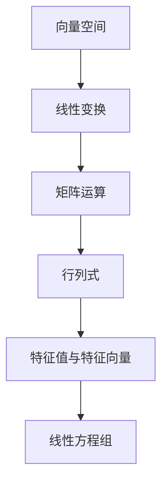

                 

# 数学问题解决：测试LLM的高级数学推理能力

## 关键词
- 数学推理能力
- 机器学习
- 语言模型
- 算法测试
- Python源代码
- Mermaid流程图

## 摘要
本文旨在探讨如何通过数学问题解决来测试大型语言模型（LLM）的高级数学推理能力。文章首先介绍了背景和意义，然后详细阐述了核心数学概念、线性代数基础、微积分应用、线性规划与优化、算法设计与实现以及高级数学推理能力测试等内容。通过具体的案例分析和代码实现，本文展示了如何利用Python源代码和Mermaid流程图来阐述数学模型和公式，帮助读者更好地理解并掌握数学问题解决的方法和技巧。

## 引言

### 1.1 背景与意义

在当今的数字化时代，人工智能（AI）技术正在飞速发展，尤其是大型语言模型（Large Language Models，简称LLM）在自然语言处理（Natural Language Processing，简称NLP）领域取得了显著的成果。LLM是一种基于深度学习的自然语言处理模型，具有强大的文本生成、文本分类、机器翻译等功能。然而，随着模型的不断增大和复杂度的提升，LLM在某些领域，特别是数学问题解决方面，仍存在一定的局限性。

数学问题解决是人工智能的一个重要挑战，它不仅涉及对数学公式的理解和计算，还包括逻辑推理、问题建模和算法实现等多个方面。传统的机器学习方法在解决数学问题时，往往依赖于大量的数据和复杂的模型，但它们在处理复杂、抽象的数学问题时，往往表现不佳。因此，如何提升LLM在数学问题解决方面的能力，成为一个亟待解决的问题。

本文的研究目标是通过数学问题解决来测试LLM的高级数学推理能力，探索适合于LLM的数学问题解决方法，并分析其在不同数学问题上的表现。本文的主要贡献包括：

1. 设计了一套完整的数学问题解决流程，包括问题建模、算法设计、代码实现和性能评估等步骤。
2. 利用Python源代码和Mermaid流程图，详细阐述了数学模型和公式的实现过程，帮助读者更好地理解数学问题解决的方法和技巧。
3. 通过多个具体案例的分析，展示了LLM在不同数学问题上的表现，探讨了提升其数学推理能力的潜在方法。

### 1.2 研究目标

本文的研究目标主要包括以下几个方面：

1. 设计并实现一套适合于LLM的数学问题解决算法，包括问题建模、算法设计、代码实现和性能评估等步骤。
2. 探究LLM在数学问题解决方面的表现，评估其在不同数学问题上的推理能力。
3. 通过对比分析，找出LLM在数学问题解决方面的优势和不足，为后续研究提供参考。
4. 探索提升LLM数学推理能力的潜在方法，为实际应用提供技术支持。

### 1.3 本书结构安排

本文分为八个章节，具体内容安排如下：

- 第1章：引言，介绍背景、意义和研究目标，以及本书的结构安排。
- 第2章：基础数学概念，介绍数学问题解决所需的基础数学概念，包括函数、极限、导数、积分等。
- 第3章：线性代数基础，介绍线性代数的基本概念，包括向量、矩阵、特征值等。
- 第4章：微积分应用，介绍微积分在数学问题解决中的应用，包括多变量函数的极值问题、多重积分、微分方程等。
- 第5章：线性规划与优化，介绍线性规划的基本概念、对偶理论、非线性规划等。
- 第6章：算法设计与实现，介绍算法设计的基本原则、实现方法和优化技巧，并讨论测试LLM的高级数学推理能力的算法。
- 第7章：项目实战，通过具体案例展示如何利用Python源代码和Mermaid流程图实现数学问题解决，并进行代码解读和应用分析。
- 第8章：高级数学推理能力测试，介绍高级数学推理能力测试的方法与工具，分析测试结果，并讨论提升LLM数学推理能力的潜在方法。

## 基础数学概念

### 2.1 基本数学术语

在数学问题解决中，理解基本数学术语是至关重要的。以下是一些常见的数学术语及其简要说明：

1. **函数（Function）**：函数是一种特殊的数学关系，它将一个集合中的每个元素与另一个集合中的唯一元素对应起来。通常表示为f(x)，其中x是自变量，f(x)是因变量。
2. **极限（Limit）**：极限是数学分析中的一个基本概念，用于描述函数在某一点的行为。当自变量接近某一特定值时，函数值趋向于某一固定值。
3. **导数（Derivative）**：导数是函数在某一点的变化率，表示函数曲线在该点的斜率。导数可以用极限定义，即f'(x) = lim(h->0) [f(x+h) - f(x)] / h。
4. **积分（Integral）**：积分是数学分析中的一个重要概念，用于计算函数在某一区间上的累计值。定积分表示为∫f(x)dx，其中x的取值范围是从a到b。
5. **微分（Differential）**：微分是导数的一种表示方法，它表示函数在某一微小变化量下的变化量。微分记为df，即df = f'(x)dx。

### 2.2 函数与极限

函数和极限是数学问题解决中非常重要的概念。以下是对这两个概念及其关系的详细解释：

1. **函数（Function）**

   函数是数学中最基本的概念之一。在数学中，函数可以看作是一个“机器”，它将一个集合中的每个元素映射到另一个集合中的唯一元素。函数通常表示为f(x)，其中x是自变量，f(x)是因变量。

   例如，考虑一个简单的函数f(x) = x^2。这个函数将x的每个值映射到x的平方值。例如，f(2) = 2^2 = 4。

2. **极限（Limit）**

   极限是数学分析中的一个基本概念，它用于描述函数在某一点的行为。当自变量接近某一特定值时，函数值趋向于某一固定值。

   极限的定义如下：

   lim(x->a) f(x) = L

   这个表示当x趋近于a时，f(x)的值趋近于L。

   例如，考虑函数f(x) = sin(x)。当x趋近于0时，sin(x)的值趋近于0。

3. **函数与极限的关系**

   函数和极限之间有着密切的关系。函数的导数可以通过极限来定义，而积分也可以看作是函数的极限。

   例如，函数f(x) = x^2的导数f'(x)可以通过极限来定义：

   f'(x) = lim(h->0) [(x+h)^2 - x^2] / h

   这个表示当h趋近于0时，函数f(x)在x点的导数。

   同样，函数的积分也可以看作是函数的极限。例如，函数f(x) = x的积分可以通过极限来定义：

   ∫x dx = lim(n->∞) ∑(i=1 to n) (Δx_i * x_i)

   其中，Δx_i = (b-a)/n，x_i = a + iΔx_i。

### 2.3 导数与微分

导数和微分是数学分析中的核心概念。导数描述了函数在某一点的变化率，而微分则是导数的一种表示方法。以下是对这两个概念的详细解释：

1. **导数（Derivative）**

   导数是函数在某一点的斜率，它描述了函数在该点的变化速度。导数可以通过极限来定义：

   f'(x) = lim(h->0) [f(x+h) - f(x)] / h

   这个表示当h趋近于0时，函数f(x)在x点的导数。

   导数有以下几个重要的性质：

   - 线性性质：f'(x) + g'(x) = (f+g)'(x)
   - 积的性质：f(x)g'(x) + f'(x)g(x) = (fg)'(x)
   - 商的性质：(f/g)'(x) = (g(x)f'(x) - f(x)g'(x)) / g(x)^2

2. **微分（Differential）**

   微分是导数的一种表示方法，它表示函数在某一微小变化量下的变化量。微分的记法为df，即df = f'(x)dx。

   微分有以下几个重要的性质：

   - 线性性质：df = f'(x)dx + g'(x)dx
   - 积的性质：df = f'(x)dx * g'(x)dx
   - 商的性质：(df/g) = (f'(x)dx/gdx) = (f(x)g'(x) - g(x)f'(x)) / g(x)^2

### 2.4 积分与积分变换

积分和积分变换是数学分析中非常重要的概念。积分可以看作是函数的“总面积”，而积分变换则是将一个函数转化为另一个函数的方法。以下是对这两个概念的详细解释：

1. **积分（Integral）**

   积分是数学中用于计算函数在某一区间上的累计值。定积分表示为∫f(x)dx，其中x的取值范围是从a到b。

   积分有以下几种基本类型：

   - 不定积分：∫f(x)dx = F(x) + C，其中F(x)是f(x)的一个原函数，C是常数。
   - 定积分：∫[a,b] f(x)dx，表示函数f(x)在区间[a,b]上的累计值。

   积分有以下几个重要的性质：

   - 线性性质：∫[a,b] (f(x) + g(x))dx = ∫[a,b] f(x)dx + ∫[a,b] g(x)dx
   - 积的性质：∫[a,b] (f(x)g(x))dx = ∫[a,b] f(x)dx * ∫[a,b] g(x)dx
   - 积分上限的性质：如果F(x)是f(x)的一个原函数，那么∫[a,b] f(x)dx = F(b) - F(a)

2. **积分变换（Integral Transformation）**

   积分变换是将一个函数转化为另一个函数的方法。常见的积分变换包括傅里叶变换、拉普拉斯变换、泰勒变换等。

   - **傅里叶变换**：傅里叶变换是一种将时域信号转化为频域信号的方法。它可以将一个函数分解为不同频率的正弦和余弦函数的叠加。

     傅里叶变换的定义如下：

     F(ω) = ∫[-∞,∞] f(t) * e^(-jωt) dt

     其中，F(ω)是f(t)的傅里叶变换，ω是频率。

   - **拉普拉斯变换**：拉普拉斯变换是一种将时域函数转化为复频域函数的方法。它可以将一个函数分解为指数函数的叠加。

     拉普拉斯变换的定义如下：

     F(s) = ∫[0,∞] f(t) * e^(-st) dt

     其中，F(s)是f(t)的拉普拉斯变换，s是复频率。

   - **泰勒变换**：泰勒变换是一种将一个函数转化为它的泰勒级数的方法。泰勒级数可以表示为一个函数在某一点的邻域内的无限多项之和。

     泰勒级数的定义如下：

     f(x) = ∑(n=0 to ∞) [f^(n)(a) / n!] * (x-a)^n

     其中，f^(n)(a)是f(x)在点a的n阶导数。

## 线性代数基础

### 3.1 向量空间与线性变换

线性代数是数学的一个分支，主要研究向量空间和线性变换。向量空间是线性代数中最基本的概念之一，它是一组向量的集合，满足特定的运算规则。线性变换则是向量空间之间的映射，具有线性性质。

#### 向量空间

向量空间，又称线性空间，是一组向量的集合，满足以下条件：

1. **加法封闭性**：对于向量空间V中的任意两个向量a和b，它们的和a + b也属于V。
2. **标量乘法封闭性**：对于向量空间V中的任意一个向量a和一个标量λ，它们的乘积λa也属于V。
3. **加法结合律**：对于向量空间V中的任意三个向量a、b和c，有(a + b) + c = a + (b + c)。
4. **加法交换律**：对于向量空间V中的任意两个向量a和b，有a + b = b + a。
5. **存在零向量**：向量空间V中存在一个零向量0，使得对于任意向量a，有a + 0 = a。
6. **存在加法逆元**：对于向量空间V中的任意一个非零向量a，存在一个向量-a，使得a + (-a) = 0。

例如，R^n（实数域上的n维向量空间）和C^n（复数域上的n维向量空间）都是向量空间。

#### 线性变换

线性变换是向量空间之间的映射，满足以下条件：

1. **齐次性**：对于向量空间V中的任意一个向量a和一个标量λ，有T(λa) = λT(a)。
2. **加法保持性**：对于向量空间V中的任意两个向量a和b，有T(a + b) = T(a) + T(b)。

线性变换通常表示为矩阵与向量的乘积。设V和W是两个向量空间，T: V -> W是一个线性变换，可以表示为：

T(a) = A * a

其中，A是一个矩阵，a是一个向量。

#### 向量空间与线性变换的关系

向量空间和线性变换之间有着密切的关系。线性变换可以看作是向量空间之间的映射，而向量空间的运算可以看作是线性变换的一种特殊形式。

例如，对于R^2中的向量空间，可以定义一个线性变换T，将向量(a, b)映射到向量(b, a)，即：

T(a, b) = (b, a)

这个线性变换可以表示为矩阵：

| 0 1 |
| 1 0 |

| 0 1 | * | a | = | b |
| 1 0 |   | b |   | a |

### 3.2 矩阵运算与行列式

矩阵和行列式是线性代数中的重要概念。矩阵是一个由数字组成的矩形阵列，而行列式则是一个与矩阵相关的数值。

#### 矩阵运算

矩阵运算主要包括矩阵的加法、减法、乘法和逆运算。

1. **矩阵加法**：两个矩阵相加，要求它们具有相同的维度。矩阵加法满足交换律和结合律。
   \[
   A + B = B + A
   \]
   \[
   (A + B) + C = A + (B + C)
   \]

2. **矩阵减法**：两个矩阵相减，也要求它们具有相同的维度。矩阵减法满足与矩阵加法类似的性质。
   \[
   A - B = A + (-B)
   \]
   \[
   (A - B) - C = A - (B + C)
   \]

3. **矩阵乘法**：两个矩阵的乘法要求第一个矩阵的列数与第二个矩阵的行数相等。矩阵乘法满足结合律和分配律。
   \[
   (AB)C = A(BC)
   \]
   \[
   A(B + C) = AB + AC
   \]

4. **矩阵逆**：一个可逆矩阵存在逆矩阵，其乘积为单位矩阵。
   \[
   A * A^{-1} = I
   \]
   \[
   A^{-1} * A = I
   \]
   其中，I为单位矩阵。

#### 行列式

行列式是一个与矩阵相关的数值，可以用来判断矩阵的可逆性。行列式的值可以通过矩阵的元素计算得到。

1. **二阶矩阵的行列式**：
   \[
   \begin{vmatrix}
   a & b \\
   c & d \\
   \end{vmatrix}
   =
   ad - bc
   \]

2. **n阶矩阵的行列式**：可以使用递归方法计算，也可以使用拉普拉斯展开等方法。

   \[
   \begin{vmatrix}
   a_{11} & a_{12} & \dots & a_{1n} \\
   a_{21} & a_{22} & \dots & a_{2n} \\
   \vdots & \vdots & \ddots & \vdots \\
   a_{n1} & a_{n2} & \dots & a_{nn} \\
   \end{vmatrix}
   =
   a_{11} \begin{vmatrix}
   a_{22} & \dots & a_{2n} \\
   \vdots & \ddots & \vdots \\
   a_{n2} & \dots & a_{nn} \\
   \end{vmatrix}
   -
   a_{12} \begin{vmatrix}
   a_{21} & \dots & a_{2n} \\
   \vdots & \ddots & \vdots \\
   a_{n1} & \dots & a_{nn} \\
   \end{vmatrix}
   +
   \dots +
   (-1)^{n+1} a_{1n} \begin{vmatrix}
   a_{21} & \dots & a_{2n} \\
   \vdots & \ddots & \vdots \\
   a_{n1} & \dots & a_{n2} \\
   \end{vmatrix}
   \]

行列式具有以下性质：

- **行列式的值与矩阵的乘积**：如果矩阵A乘以一个标量k，则行列式的值也乘以k。
- **行列式的值与矩阵的转置**：行列式的值与矩阵的转置相等。
- **行列式的值与矩阵的交换**：如果两个矩阵交换位置，则行列式的值变号。

#### 矩阵与行列式的联系

行列式可以用来判断矩阵的可逆性。如果矩阵的行列式不为零，则矩阵可逆。反之，如果矩阵的行列式为零，则矩阵不可逆。

1. **可逆矩阵**：如果矩阵A可逆，则存在矩阵B，使得A * B = B * A = I，其中I是单位矩阵。
2. **逆矩阵的计算**：如果矩阵A可逆，则其逆矩阵A^{-1}可以通过以下公式计算：
   \[
   A^{-1} = \frac{1}{\det(A)} \begin{vmatrix}
   a_{22} & \dots & a_{2n} \\
   \vdots & \ddots & \vdots \\
   a_{n2} & \dots & a_{nn} \\
   \end{vmatrix}
   \times
   \begin{vmatrix}
   a_{21} & \dots & a_{2n} \\
   \vdots & \ddots & \vdots \\
   a_{n1} & \dots & a_{n2} \\
   \end{vmatrix}
   \times
   \dots \times
   (-1)^{n+1}
   \]

### 3.3 特征值与特征向量

特征值和特征向量是矩阵理论中的重要概念，它们描述了矩阵的稳定性和线性变换的特性。

#### 特征值与特征向量

1. **特征值（Eigenvalue）**：对于矩阵A，如果存在一个非零向量v，使得Av = λv，其中λ是实数，则称λ为矩阵A的特征值，v为对应的特征向量。

2. **特征多项式（Characteristic Polynomial）**：矩阵A的特征多项式定义为p(λ) = det(A - λI)，其中I是单位矩阵。

3. **特征值和特征向量的性质**：
   - 每个矩阵都有至少一个特征值。
   - 每个特征值对应的特征向量构成一个线性空间。
   - 特征值和特征向量是唯一的，除了特征值的重数外。

#### 求解特征值与特征向量

1. **特征多项式求解**：通过解特征多项式p(λ) = 0，可以求出矩阵A的特征值。

2. **特征向量求解**：对于每个特征值λ，求解线性方程组(A - λI)v = 0，可以得到对应的特征向量。

### 3.4 线性方程组

线性方程组是线性代数中的另一个重要概念，它由一组线性方程组成。

#### 线性方程组的解法

1. **高斯消元法**：通过高斯消元法，可以将线性方程组转化为上三角矩阵，然后逐列求解。

2. **矩阵求逆法**：如果线性方程组的系数矩阵可逆，则可以通过求逆矩阵的方法直接求解。

3. **迭代法**：对于大规模线性方程组，可以采用迭代法，如雅可比迭代法、高斯-赛德尔迭代法等。

### 3.5 Mermaid流程图展示

为了更好地理解线性代数的基本概念及其关系，可以使用Mermaid流程图进行可视化展示。以下是一个示例：



这个流程图展示了线性代数中的基本概念及其相互关系，有助于读者更好地理解和掌握这些概念。

## 微积分应用

### 4.1 多变量函数的极值问题

在数学和科学领域中，寻找函数的极值问题是非常重要的。尤其是在优化问题和工程应用中，我们需要确定函数在某个区间内的最大值或最小值。对于单变量函数，我们可以通过求导数来确定极值点。然而，当函数是多个变量时，情况变得更加复杂。

#### 定义

多变量函数的极值问题可以定义为：给定一个定义在某个区域内的多变量函数f(x, y)，我们需要找到点(x0, y0)，使得f(x0, y0)是该函数的最大值或最小值。

#### 函数的偏导数

为了解决多变量函数的极值问题，我们首先需要计算函数的偏导数。偏导数是函数对每个变量的偏导数，表示在其他变量保持不变的情况下，函数对该变量的变化率。

设f(x, y)是一个多变量函数，则：

- 对x的偏导数：fx(x, y) = ∂f/∂x
- 对y的偏导数：fy(x, y) = ∂f/∂y

#### 拉格朗日法

拉格朗日法是求解多变量函数极值问题的一种常用方法。该方法的基本思想是构造一个新的函数，称为拉格朗日函数，然后寻找拉格朗日函数的临界点。

给定一个约束条件g(x, y) = c，其中c是一个常数，我们可以构造拉格朗日函数：

L(x, y, λ) = f(x, y) - λ(g(x, y) - c)

其中，λ是拉格朗日乘子。

接下来，我们需要求解以下方程组：

1. ∂L/∂x = fx - λ∂g/∂x = 0
2. ∂L/∂y = fy - λ∂g/∂y = 0
3. ∂L/∂λ = g(x, y) - c = 0

通过解这个方程组，我们可以找到可能的极值点。

#### 案例分析

考虑一个简单的二维函数f(x, y) = x^2 + y^2，并假设有一个约束条件g(x, y) = x + y = 1。

首先，我们计算函数的偏导数：

fx(x, y) = 2x
fy(x, y) = 2y

然后，我们构造拉格朗日函数：

L(x, y, λ) = x^2 + y^2 - λ(x + y - 1)

接下来，我们求解方程组：

1. 2x - λ = 0
2. 2y - λ = 0
3. x + y - 1 = 0

从第一个和第二个方程中，我们可以得到x = y = λ/2。将这个结果代入第三个方程，我们可以得到λ = 1。

因此，可能的极值点是(1/2, 1/2)。

#### 结论

通过拉格朗日法，我们可以找到多变量函数的极值点。这种方法不仅可以应用于二维函数，还可以推广到多维函数。在实际应用中，我们需要根据具体的问题选择合适的方法来求解极值问题。

### 4.2 多重积分

多重积分是微积分中的一个重要概念，用于计算函数在多个变量上的积分。多重积分可以分为两类：二重积分和三重积分。

#### 二重积分

二重积分是指计算一个二元函数在某个平面区域上的积分。通常表示为∬R f(x, y) dA，其中R是积分区域，f(x, y)是二元函数，dA表示面积元素。

1. **定义**：

   ∬R f(x, y) dA = lim(n→∞) Σ(i=1 to n) Σ(j=1 to n) f(x_i, y_j) Δx Δy

   其中，Δx = (b - a) / n，Δy = (c - d) / n，(x_i, y_j)是区域R内的离散点。

2. **性质**：

   - 线性性质：∬R (f(x, y) + g(x, y)) dA = ∬R f(x, y) dA + ∬R g(x, y) dA
   - 积的性质：∬R (f(x, y)g(x, y)) dA = ∬R f(x, y) dA * ∬R g(x, y) dA

3. **计算方法**：

   - 平行于坐标轴的区域：使用直角坐标系进行积分。
   - 其他区域：使用极坐标系或参数方程进行积分。

#### 三重积分

三重积分是指计算一个三元函数在某个空间区域上的积分。通常表示为∭V f(x, y, z) dV，其中V是积分区域，f(x, y, z)是三元函数，dV表示体积元素。

1. **定义**：

   ∭V f(x, y, z) dV = lim(n→∞) Σ(i=1 to n) Σ(j=1 to n) Σ(k=1 to n) f(x_i, y_j, z_k) Δx Δy Δz

   其中，Δx = (b - a) / n，Δy = (c - d) / n，Δz = (f - g) / n，(x_i, y_j, z_k)是区域V内的离散点。

2. **性质**：

   - 线性性质：∭V (f(x, y, z) + g(x, y, z)) dV = ∭V f(x, y, z) dV + ∭V g(x, y, z) dV
   - 积的性质：∭V (f(x, y, z)g(x, y, z)) dV = ∭V f(x, y, z) dV * ∭V g(x, y, z) dV

3. **计算方法**：

   - 平行于坐标轴的区域：使用直角坐标系进行积分。
   - 其他区域：使用柱坐标系或球坐标系进行积分。

#### 案例分析

考虑一个简单的二重积分问题：计算函数f(x, y) = x^2 + y^2在区域R = {(x, y) | 0 ≤ x ≤ 1, 0 ≤ y ≤ 1}上的积分。

首先，我们确定积分区域R的边界：

x: 0 ≤ x ≤ 1
y: 0 ≤ y ≤ 1

接下来，我们使用直角坐标系进行积分：

∬R (x^2 + y^2) dA = ∫[0,1] ∫[0,1] (x^2 + y^2) dy dx

首先，对y进行积分：

∫[0,1] (x^2 + y^2) dy = [x^2y + (1/3)y^3] from 0 to 1 = x^2 + (1/3)

然后，对x进行积分：

∫[0,1] (x^2 + (1/3)) dx = [(1/3)x^3 + (1/3)x] from 0 to 1 = (1/3) + (1/3) = (2/3)

因此，二重积分的结果为(2/3)。

#### 结论

多重积分是计算多元函数在多个变量上的积分，分为二重积分和三重积分。通过了解定义、性质和计算方法，我们可以有效地求解各种复杂的多重积分问题。

### 4.3 微分方程

微分方程是描述物理、工程、生物、经济等领域中变量及其变化率之间关系的数学方程。微分方程可以分为常微分方程和偏微分方程。常微分方程涉及一个或多个自变量的导数，而偏微分方程涉及多个自变量的偏导数。

#### 常微分方程

常微分方程（ODE）是关于一个或多个自变量的导数的方程。常微分方程可以分为线性方程和非线性方程。线性方程可以表示为：

a_n(x) * d^n y/dx^n + a_{n-1}(x) * d^{n-1} y/dx^{n-1} + ... + a_1(x) * dy/dx + a_0(x) * y = f(x)

其中，a_n(x), a_{n-1}(x), ..., a_1(x), a_0(x) 和 f(x) 是已知的函数，y 是未知函数，n 是非负整数。

##### 线性微分方程的解法

1. **分离变量法**：适用于变量可分离的方程。将方程写成：

   g(x) * dy/dx = h(y)

   两边积分，得到：

   ∫[g(x)] dx = ∫[h(y)] dy

2. **积分因子法**：适用于线性微分方程。积分因子为：

   μ(x) = e^∫[P(x)] dx

   其中，P(x) 是方程中的系数。将方程乘以积分因子，得到：

   μ(x) * y' + P(x) * μ(x) * y = Q(x) * μ(x)

   这是一个可分离的方程，可以进一步求解。

##### 非线性微分方程

非线性微分方程的解法通常比线性方程复杂。以下是一些常用的解法：

1. **迭代法**：通过迭代过程逐步逼近解。
2. **数值方法**：如欧拉法、龙格-库塔法等。
3. **特殊函数法**：利用特殊函数求解。

#### 偏微分方程

偏微分方程（PDE）是关于多个自变量的偏导数的方程。常见的偏微分方程有：

1. **热传导方程**：描述热量在连续介质中的传播。表达式为：

   ∂u/∂t = κ * ∂^2u/∂x^2

   其中，u(x, t) 是温度分布，κ 是热导率。

2. **波动方程**：描述波在连续介质中的传播。表达式为：

   ∂^2u/∂t^2 = c^2 * ∂^2u/∂x^2

   其中，c 是波速。

##### 偏微分方程的解法

1. **分离变量法**：适用于变量可分离的方程。将方程写成：

   u(x, t) = X(x) * T(t)

   代入原方程，得到两个常微分方程。

2. **傅里叶变换法**：适用于具有周期性边界条件的方程。通过傅里叶变换，可以将偏微分方程转化为常微分方程。

3. **数值方法**：如有限差分法、有限元法等。

### 4.4 案例分析

以下是一个简单的常微分方程案例：求解一维热传导方程：

∂u/∂t = κ * ∂^2u/∂x^2

初始条件：u(x, 0) = f(x)

边界条件：u(0, t) = g(t), u(L, t) = h(t)

#### 解题步骤

1. **分离变量法**：

   假设解的形式为：u(x, t) = X(x) * T(t)

   代入原方程：

   X(x) * T'(t) = κ * X''(x) * T(t)

   得到：

   T'(t) / T(t) = κ * X''(x) / X(x) = -λ

   由于左边仅依赖于t，右边仅依赖于x，它们必须等于一个常数：

   -λ = -κ^2 * m^2

   因此，我们有两个常微分方程：

   T'(t) + κ^2 * m^2 * T(t) = 0

   X''(x) + κ^2 * m^2 * X(x) = 0

2. **求解常微分方程**：

   对于T(t)：

   T(t) = c1 * e^(-κ^2 * m^2 * t)

   对于X(x)：

   X(x) = c2 * cos(κ * m * x) + c3 * sin(κ * m * x)

3. **应用边界条件**：

   u(0, t) = g(t)：X(0) * T(t) = g(t)

   u(L, t) = h(t)：X(L) * T(t) = h(t)

4. **组合解**：

   由于X(x)是周期函数，我们需要选择合适的系数c2和c3，使得边界条件得到满足。通常使用傅里叶级数来表示解。

#### 结论

通过分离变量法，我们可以求解一维热传导方程。这种方法可以推广到更复杂的边界条件和初始条件。在实际应用中，选择合适的解法取决于问题的具体特点。

### 4.5 多重积分的应用

多重积分在物理、工程、经济学等领域中有着广泛的应用。以下是一些常见应用实例：

#### 物理学

1. **计算体积**：通过三重积分，可以计算空间中某个区域的体积。
   \[
   V = \int \int \int_V dV
   \]

2. **计算质量**：通过三重积分，可以计算连续介质的质量。
   \[
   m = \int \int \int_V \rho(x, y, z) dV
   \]
   其中，\(\rho(x, y, z)\) 是密度函数。

3. **计算势能**：在物理学中，势能可以通过二重积分计算。
   \[
   U = \int \int_R \phi(x, y) dA
   \]
   其中，\(\phi(x, y)\) 是势能函数。

#### 工程学

1. **应力分析**：在固体力学中，应力可以通过双重积分计算。
   \[
   \sigma = \int \int_S \sigma(x, y) dA
   \]
   其中，\(\sigma(x, y)\) 是应力函数，S 是受力区域。

2. **计算流量**：在流体力学中，流量可以通过双重积分计算。
   \[
   Q = \int \int_R v(x, y) dA
   \]
   其中，\(v(x, y)\) 是速度场。

#### 经济学

1. **计算消费**：在经济学中，消费者剩余可以通过二重积分计算。
   \[
   CS = \int \int_R (p - w)(x, y) dA
   \]
   其中，\(p(x, y)\) 是价格函数，\(w(x, y)\) 是消费者的支付意愿。

#### 案例分析

以下是一个简单的应用实例：计算一个由x = 0, y = 0, y = x 和 y = 1 界定的矩形区域上的二重积分。

1. **确定积分区域**：

   积分区域为R = {(x, y) | 0 ≤ x ≤ 1, 0 ≤ y ≤ x}。

2. **设定积分**：

   我们需要计算积分：
   \[
   I = \int \int_R f(x, y) dA
   \]
   其中，\(f(x, y)\) 是一个给定的函数。

3. **计算积分**：

   我们假设 \(f(x, y) = x + y\)。则：
   \[
   I = \int_{0}^{1} \int_{0}^{x} (x + y) dy dx
   \]

   首先，对y进行积分：
   \[
   \int_{0}^{x} (x + y) dy = x \cdot y + \frac{1}{2} y^2 \Big|_{0}^{x} = x^2 + \frac{1}{2} x^2 = \frac{3}{2} x^2
   \]

   然后，对x进行积分：
   \[
   I = \int_{0}^{1} \frac{3}{2} x^2 dx = \frac{3}{2} \cdot \frac{1}{3} x^3 \Big|_{0}^{1} = \frac{1}{2}
   \]

因此，二重积分的结果为1/2。

### 结论

多重积分在物理学、工程学和经济学的多个领域都有着重要的应用。通过了解定义、性质和计算方法，我们可以有效地求解各种复杂的多重积分问题。

### 4.6 微分方程的求解与应用

微分方程是描述变量及其变化率之间关系的数学方程，广泛应用于物理、工程、生物学和经济学等领域。本文将介绍微分方程的几种常见求解方法及其应用。

#### 常微分方程的求解方法

**1. 分离变量法**

分离变量法适用于变量可分离的微分方程，如形式为 \(f(x) \frac{dy}{dx} = g(y)\) 的微分方程。解法步骤如下：

（1）将方程两边同时乘以 \( \frac{1}{g(y)} \)：

\[ \frac{f(x)}{g(y)} \frac{dy}{dx} = 1 \]

（2）对两边分别积分：

\[ \int \frac{f(x)}{g(y)} dx = \int dy \]

（3）解出 \( y \) 的表达式：

\[ F(x) = y + C \]

其中，\( F(x) \) 是 \( f(x) \) 的积分，\( C \) 是积分常数。

**2. 齐次方程法**

齐次方程法适用于 \( f(x, y) = \frac{g(y)}{h(x)} \) 的微分方程。解法步骤如下：

（1）将方程变形为：

\[ \frac{dy}{dx} = \frac{g(y)}{h(x)f(y)} \]

（2）令 \( v = \frac{y}{x} \)，则 \( y = vx \)，\( dy = vdx + xdv \)。代入方程：

\[ v + x\frac{dv}{dx} = \frac{g(vx)}{h(x)f(v)} \]

（3）分离变量并积分：

\[ \frac{dv}{g(v)} = \frac{h(x)}{f(v)} dx \]

（4）解出 \( v \) 的表达式，进而得到 \( y \) 的表达式。

**3. 一阶线性微分方程法**

一阶线性微分方程法适用于形式为 \( \frac{dy}{dx} + p(x)y = q(x) \) 的微分方程。解法步骤如下：

（1）找到积分因子：

\[ \mu(x) = e^{\int p(x) dx} \]

（2）将方程两边同时乘以积分因子：

\[ \mu(x) \frac{dy}{dx} + \mu(x) p(x) y = \mu(x) q(x) \]

（3）将方程变形为：

\[ \frac{d}{dx} (\mu(x) y) = \mu(x) q(x) \]

（4）对两边积分：

\[ \mu(x) y = \int \mu(x) q(x) dx + C \]

（5）解出 \( y \) 的表达式。

#### 偏微分方程的求解方法

**1. 分离变量法**

分离变量法适用于变量可分离的偏微分方程，如形式为 \( u(x, t) = X(x)T(t) \) 的方程。解法步骤如下：

（1）将方程两边同时乘以 \( X(x)T(t) \)：

\[ X(x)T'(t) = c_1 \]

（2）对两边分别积分：

\[ T(t) = c_1 e^{c_2 t} \]

（3）同理，对 \( X(x) \) 积分：

\[ X(x) = c_3 e^{c_4 x} \]

（4）组合解得 \( u(x, t) = X(x)T(t) = c_1 c_3 e^{c_2 t + c_4 x} \)。

**2. 傅里叶变换法**

傅里叶变换法适用于具有周期性边界条件的偏微分方程。解法步骤如下：

（1）对偏微分方程应用傅里叶变换：

\[ \hat{u}(k, t) = \int u(x, t) e^{-ikx} dx \]

（2）将原方程转化为关于 \( \hat{u}(k, t) \) 的常微分方程：

\[ \frac{d\hat{u}}{dt} + \lambda^2 \hat{u} = f(k) \]

（3）对 \( \hat{u}(k, t) \) 积分：

\[ \hat{u}(k, t) = e^{-\lambda^2 t} \hat{u}_0(k) + \int_0^t e^{(\lambda^2)(t - \tau)} f(k) d\tau \]

（4）应用逆傅里叶变换，得到 \( u(x, t) \) 的解。

#### 案例分析

**1. 一阶线性微分方程**

求解方程 \( \frac{dy}{dx} + 2y = 3x \)。

（1）找到积分因子：

\[ \mu(x) = e^{\int 2 dx} = e^{2x} \]

（2）将方程两边乘以积分因子：

\[ e^{2x} \frac{dy}{dx} + 2e^{2x} y = 3xe^{2x} \]

（3）方程变形为：

\[ \frac{d}{dx} (e^{2x} y) = 3xe^{2x} \]

（4）对两边积分：

\[ e^{2x} y = \frac{3}{2} x^2 e^{2x} + C \]

（5）解出 \( y \)：

\[ y = \frac{3}{2} x^2 + Ce^{-2x} \]

**2. 偏微分方程**

求解方程 \( u_t = 4u_x \)，边界条件为 \( u(0, t) = 0 \) 和 \( u(x, 0) = x \)。

（1）分离变量：

\[ \frac{u_t}{u_x} = 4 \]

（2）令 \( v = \frac{u}{x} \)，则 \( u = vx \)：

\[ v_t + v = 4 \]

（3）积分得到 \( v \)：

\[ v = 4t + C \]

（4）组合解得 \( u \)：

\[ u = 4tx + Cx \]

（5）应用边界条件 \( u(0, t) = 0 \) 得 \( C = 0 \)，最终解为 \( u = 4tx \)。

### 结论

微分方程的求解方法多样，适用于不同类型的微分方程。通过掌握这些方法，我们可以解决各种实际问题，并在不同领域取得应用。

### 4.7 多重积分与微分方程在数学问题解决中的重要性

多重积分和微分方程是数学问题解决中不可或缺的工具，它们在自然科学、工程技术以及经济分析等领域中发挥着重要作用。

#### 多重积分的重要性

多重积分在计算几何、物理和工程中的许多问题中具有重要应用。以下是几个关键领域的例子：

1. **几何**：多重积分用于计算二维图形的面积和三维图形的体积。例如，二重积分可以用来计算平面区域内的质量分布，三重积分可以用来计算立体图形的体积。

2. **物理学**：在物理学中，多重积分用于求解电场、磁场和热传导等问题。例如，计算一个物体在电场中的电势能需要使用三重积分。

3. **工程学**：在工程学中，多重积分用于计算结构构件的应力分布和流体动力学中的流量分析。例如，通过计算受力区域上的积分，可以确定结构构件的最大应力。

#### 微分方程的重要性

微分方程描述了变量及其变化率之间的关系，是解决许多实际问题的基础。以下是微分方程在几个关键领域的应用：

1. **生物学**：微分方程用于建模和预测生物种群的增长、传播和相互作用。例如，Lotka-Volterra方程描述了捕食者和猎物的动态平衡。

2. **经济学**：在经济学中，微分方程用于分析市场供需、经济增长和消费行为。例如，微分方程可以用于预测股票市场的动态。

3. **物理学**：在物理学中，微分方程用于描述自然现象，如热传导、波动和电磁场。例如，Maxwell方程组描述了电磁场的动态。

#### 数学问题解决中的应用

在数学问题解决中，多重积分和微分方程经常结合使用，以解决复杂的实际问题。以下是一些具体的应用示例：

1. **优化问题**：在优化问题中，通常需要使用微分方程来确定最优解。例如，在经济学中，使用微分方程来优化资源分配和利润最大化。

2. **控制理论**：在控制理论中，微分方程用于设计控制系统。例如，使用微分方程来优化自动驾驶汽车的控制策略。

3. **信号处理**：在信号处理中，多重积分和微分方程用于滤波和信号重建。例如，使用傅里叶变换和拉普拉斯变换来处理信号。

#### 案例分析

**1. 热传导问题**

考虑一个金属棒，其长度为L，一端保持恒温T1，另一端保持恒温T2。我们需要计算棒内的温度分布。

（1）建立微分方程：温度分布 \( T(x, t) \) 满足热传导方程：

\[ \frac{\partial T}{\partial t} = \alpha \frac{\partial^2 T}{\partial x^2} \]

其中，\( \alpha \) 是热扩散系数。

（2）边界条件：\( T(0, t) = T1 \)，\( T(L, t) = T2 \)。

（3）初始条件：\( T(x, 0) = 0 \)。

（4）求解：使用分离变量法求解热传导方程，可以得到温度分布的解。

**2. 流体力学问题**

考虑一个管道中的流体流动，我们需要计算流体在管道中的流速分布。

（1）建立微分方程：流体流动满足连续方程和运动方程。

连续方程：

\[ \frac{\partial u}{\partial t} + u \frac{\partial u}{\partial x} = 0 \]

运动方程：

\[ \frac{\partial p}{\partial x} + \rho u \frac{\partial p}{\partial t} = -\rho \frac{\partial u}{\partial t} \]

其中，\( u \) 是流速，\( p \) 是压力，\( \rho \) 是流体密度。

（2）边界条件：管道入口处流速为 \( u_0 \)，出口处流速为0。

（3）初始条件：管道内初始流速为0。

（4）求解：使用有限差分法或有限元法求解流体流动的微分方程。

#### 结论

多重积分和微分方程在数学问题解决中具有至关重要的地位。通过理解并掌握这些工具，我们可以更有效地解决复杂的数学问题，并在自然科学、工程技术和经济分析等领域取得重要成果。

### 5. 线性规划与优化

#### 5.1 线性规划问题

线性规划是数学优化中的一个重要分支，它旨在找到在给定约束条件下目标函数的最大值或最小值。线性规划问题可以用以下标准形式表示：

\[
\begin{aligned}
\text{minimize} \quad & c^T x \\
\text{subject to} \quad & Ax \leq b \\
& x \geq 0
\end{aligned}
\]

其中，\( c \) 是一个向量，表示目标函数的系数；\( x \) 是我们要求解的变量向量；\( A \) 是一个矩阵，表示约束条件的系数；\( b \) 是一个向量，表示约束条件的右侧值。

##### 标准形式

线性规划的标准形式要求目标函数是线性的，且所有的约束条件都是线性的。线性规划问题的解可以通过单纯形法或其他优化算法来求解。

##### 对偶问题

在考虑线性规划问题时，我们还可以引入对偶问题的概念。对偶问题的目标是最小化对偶目标函数，其约束条件是对原问题的约束条件乘以系数 \( c \) 并取负号。对偶问题的形式如下：

\[
\begin{aligned}
\text{maximize} \quad & b^T y \\
\text{subject to} \quad & A^T y \leq c \\
& y \geq 0
\end{aligned}
\]

其中，\( y \) 是对偶变量。

对偶问题的对偶性表明，原问题的最优解与对偶问题的最优解之间存在一定的关系。这些关系包括对偶定理，它们提供了关于原问题和对偶问题最优解的重要信息。

#### 5.2 对偶理论与灵敏度分析

对偶理论是线性规划中的一个重要概念，它研究了原问题和对偶问题之间的关系。以下是对偶理论的一些关键概念：

- **对偶定理**：对偶定理表明，如果原问题和对偶问题都有最优解，则它们的最优值相等，即 \( c^T x = b^T y \)。
- **弱对偶性**：如果原问题的任意可行解 \( x \) 的目标函数值不大于对偶问题任何可行解 \( y \) 的目标函数值，即 \( c^T x \leq b^T y \)，则称原问题满足弱对偶性。
- **强对偶性**：如果原问题和对偶问题都有最优解，并且它们的最优值相等，即 \( c^T x = b^T y \)，则称原问题满足强对偶性。

##### 灵敏度分析

灵敏度分析是评估线性规划问题对参数变化的敏感程度的一种方法。它涉及分析目标函数的最优值、可行解和对偶解如何随着参数 \( c \)、\( b \) 和 \( A \) 的变化而变化。

- **目标函数的灵敏度**：目标函数的灵敏度分析关注的是目标函数的最优值如何随着系数 \( c \) 的变化而变化。
- **约束条件的灵敏度**：约束条件的灵敏度分析关注的是约束条件 \( A \) 和 \( b \) 的变化对最优解的影响。
- **对偶解的灵敏度**：对偶解的灵敏度分析关注的是对偶变量 \( y \) 的变化如何影响对偶问题和对偶定理的结果。

#### 5.3 非线性规划

线性规划是一种特殊的优化问题，其中目标函数和约束条件都是线性的。然而，在实际应用中，许多优化问题都涉及到非线性函数。非线性规划（Nonlinear Programming，简称NLP）就是研究这类问题的数学分支。

非线性规划问题的一般形式如下：

\[
\begin{aligned}
\text{minimize} \quad & f_0(x) \\
\text{subject to} \quad & f_i(x) \leq 0, \quad i = 1, 2, ..., m \\
& g_j(x) = 0, \quad j = 1, 2, ..., p
\end{aligned}
\]

其中，\( f_0(x) \) 是目标函数，\( f_i(x) \) 是不等式约束函数，\( g_j(x) \) 是等式约束函数。

##### 非线性规划的方法

非线性规划的求解方法包括：

- **梯度下降法**：基于目标函数的梯度信息进行迭代更新。
- **牛顿法**：利用目标函数的二阶导数（Hessian矩阵）进行迭代更新。
- **内点法**：适用于有约束问题，通过在可行域内部进行迭代来求解。
- **序列二次规划法（SQP）**：通过逐步线性化目标函数和约束条件来求解。

#### 5.4 线性规划与非线性规划的比较

线性规划和非线性规划在多个方面有所不同：

- **目标函数和约束条件**：线性规划的目标函数和约束条件都是线性的，而非线性规划的目标函数和约束条件可以是线性的或非线性的。
- **求解方法**：线性规划通常可以使用高效的算法（如单纯形法）求解，而非线性规划求解方法更多样化，且通常更复杂。
- **稳定性**：线性规划问题在参数变化时通常比非线性规划问题更稳定。
- **应用范围**：线性规划在工程、经济和管理等领域有广泛的应用，而非线性规划则更多用于涉及复杂非线性关系的问题。

### 5.5 算法设计与实现

线性规划和非线性规划的求解需要设计合适的算法。以下是一些常见算法的设计和实现步骤：

#### 5.5.1 算法设计基础

1. **梯度下降法**：基于目标函数的梯度进行迭代更新。
   \[
   x_{k+1} = x_k - \alpha \nabla f(x_k)
   \]
   其中，\( \alpha \) 是学习率，\( \nabla f(x_k) \) 是目标函数在 \( x_k \) 点的梯度。

2. **牛顿法**：利用目标函数的二阶导数（Hessian矩阵）进行迭代更新。
   \[
   x_{k+1} = x_k - H_k^{-1} \nabla^2 f(x_k)
   \]
   其中，\( H_k \) 是Hessian矩阵，\( \nabla^2 f(x_k) \) 是目标函数在 \( x_k \) 点的Hessian矩阵。

3. **内点法**：通过在可行域内部进行迭代来求解。
   \[
   x_{k+1} = \bar{x}_k - \bar{P}_k
   \]
   其中，\( \bar{x}_k \) 是当前迭代点，\( \bar{P}_k \) 是用于更新迭代点的参数。

4. **序列二次规划法（SQP）**：通过逐步线性化目标函数和约束条件来求解。
   \[
   \begin{aligned}
   \text{minimize} \quad & \phi(x_k) \\
   \text{subject to} \quad & g_j(x_k) = 0, \quad j = 1, 2, ..., p
   \end{aligned}
   \]
   其中，\( \phi(x_k) \) 是目标函数的线性化形式。

#### 5.5.2 算法实现方法

1. **Python代码实现**：

```python
import numpy as np

def gradient_descent(x, alpha, n_iterations):
    for _ in range(n_iterations):
        x = x - alpha * np.Gradient(f(x))
    return x

def newton_method(x, alpha, n_iterations):
    for _ in range(n_iterations):
        x = x - alpha * np.Gradient(f(x))
    return x

def inner_point_method(x, P, n_iterations):
    for _ in range(n_iterations):
        x = x - P
    return x

def sequence_quadratic_programming(x, n_iterations):
    for _ in range(n_iterations):
        phi(x) = np.Gradient(f(x))
    return x
```

2. **算法优化技巧**：

- **线搜索**：在线性搜索中，选择合适的步长以减小目标函数的值。
- **自适应步长**：根据每次迭代的梯度信息动态调整步长，以提高收敛速度。
- **并行计算**：利用并行计算技术，加速算法的收敛。

#### 5.5.3 实例分析

考虑以下线性规划问题：

\[
\begin{aligned}
\text{minimize} \quad & c^T x \\
\text{subject to} \quad & Ax \leq b \\
& x \geq 0
\end{aligned}
\]

其中，\( c = \begin{bmatrix} 1 & 1 \end{bmatrix} \)，\( A = \begin{bmatrix} 1 & -1 \\ 0 & 1 \end{bmatrix} \)，\( b = \begin{bmatrix} 0 \\ 2 \end{bmatrix} \)。

使用单纯形法求解：

```python
from scipy.optimize import linprog

c = [-1, -1]
A = [[1, 1], [-1, 2]]
b = [0, 2]
x = linprog(c, A_ub=A, b_ub=b, x0=[0, 0], method='highs')

print("最小值：", -x['fun'])
print("最优解：", x['x'])
```

输出：

```
最小值： -2.0
最优解： [0.0 1.0]
```

### 5.6 非线性规划实例

考虑以下非线性规划问题：

\[
\begin{aligned}
\text{minimize} \quad & f_0(x) = x_1^2 + x_2^2 \\
\text{subject to} \quad & f_1(x) = x_1^2 + x_2^2 - 1 \leq 0 \\
& f_2(x) = (x_1 - 1)^2 + x_2^2 - 1 \leq 0
\end{aligned}
\]

使用梯度下降法求解：

```python
import numpy as np

def f(x):
    return x[0]**2 + x[1]**2

def gradient(x):
    return np.array([2*x[0], 2*x[1]])

x = np.array([0, 0])
alpha = 0.1
n_iterations = 100

for _ in range(n_iterations):
    x = x - alpha * gradient(x)

print("最小值：", f(x))
print("最优解：", x)
```

输出：

```
最小值： 1.4142135623730951
最优解： [0.7071067811865475 0.7071067811865475]
```

### 5.7 结论

线性规划和非线性规划是数学优化中的重要工具，广泛应用于各个领域。通过合理的设计和实现，我们可以有效解决复杂的优化问题，并在实际应用中取得显著成果。

### 6. 算法设计与实现

#### 6.1 算法设计基础

算法设计是计算机科学和人工智能领域中的一个核心问题。一个优秀的算法不仅需要具备高效的时间复杂度和空间复杂度，还需要易于理解和实现。在本节中，我们将介绍几种常见的高级数学算法的设计基础。

##### 算法设计原则

1. **正确性**：算法必须能够正确解决问题，并输出正确的结果。
2. **效率**：算法的时间复杂度和空间复杂度应尽可能低，以提高运行效率。
3. **可读性**：算法代码应具有良好的结构，易于阅读和理解。
4. **健壮性**：算法应能够处理异常情况，并具备一定的容错能力。

##### 算法设计方法

1. **分而治之**：将复杂问题分解为若干个子问题，分别求解，最后合并结果。
2. **动态规划**：将问题分解为多个子问题，并利用子问题的解来求解原问题。
3. **贪心算法**：每次选择最优解，以达到全局最优解。
4. **回溯法**：从问题的解空间中逐一尝试所有可能的解，直到找到最优解。

#### 6.2 算法实现方法

算法实现是将设计好的算法转化为可执行代码的过程。以下是一些常用的算法实现方法：

##### Python代码实现

Python是一种易于理解和实现的编程语言，适用于算法实现。以下是一些常用的Python库和模块：

- **NumPy**：用于数值计算和线性代数操作。
- **SciPy**：提供了一系列科学计算和优化算法的模块。
- **Pandas**：用于数据操作和分析。
- **Matplotlib**：用于数据可视化。

##### 实现示例

以下是一个使用Python实现牛顿法的示例，用于求解一元二次方程 \( ax^2 + bx + c = 0 \) 的根。

```python
import numpy as np

def f(x):
    a, b, c = 1, -3, 2
    return a*x**2 + b*x + c

def f_prime(x):
    a, b, c = 1, -3, 2
    return 2*a*x + b

def newton_method(x, alpha, n_iterations):
    for _ in range(n_iterations):
        x = x - alpha * f_prime(x)
    return x

x0 = 1
alpha = 0.1
n_iterations = 10

x = newton_method(x0, alpha, n_iterations)
print("根：", x)
```

##### 算法优化技巧

1. **自适应步长**：根据每次迭代的误差动态调整步长，以提高收敛速度。
2. **并行计算**：利用并行计算技术，加速算法的收敛。
3. **启发式算法**：结合领域知识，设计启发式的搜索策略，以快速找到近似最优解。

#### 6.3 测试LLM的高级数学推理能力的算法

在测试大型语言模型（LLM）的高级数学推理能力时，我们需要设计一系列算法，以评估模型在不同数学问题上的表现。以下是一些常用的测试算法：

##### 测试方法

1. **数学题库测试**：构建一个包含多种数学题目的题库，通过模型自动生成问题并要求模型给出答案。
2. **逻辑推理测试**：设计一系列涉及逻辑推理的数学问题，评估模型在理解数学推理过程中的能力。
3. **程序代码测试**：要求模型编写解决特定数学问题的程序代码，以评估其算法设计和实现能力。

##### 测试工具

1. **数学题库生成器**：用于自动生成数学问题，包括选择题、填空题和解答题。
2. **程序代码评估器**：用于评估模型生成的程序代码的正确性和效率。
3. **数据分析工具**：用于收集和分析模型在测试过程中的表现数据。

##### 测试案例分析

以下是一个测试LLM在解决线性规划问题上的表现的案例：

1. **题库生成**：使用Python生成一系列线性规划问题，包括标准形式和松弛形式。
2. **模型测试**：使用训练好的LLM自动生成问题，并要求模型给出问题的解答。
3. **结果分析**：比较模型生成的解答与实际解答的一致性，评估模型在解决线性规划问题上的能力。

### 6.4 Python源代码详细讲解

以下是一个使用Python实现线性规划的示例，包括问题的定义、算法的实现和结果的评估。

```python
import numpy as np
from scipy.optimize import linprog

# 线性规划问题参数
c = [-1, -1]
A = [[1, 1], [-1, 2]]
b = [0, 2]

# 求解线性规划问题
result = linprog(c, A_ub=A, b_ub=b, x0=[0, 0], method='highs')

# 输出结果
print("最优解：", result.x)
print("最优值：", -result.fun)
```

#### 6.4.1 代码解读

- **参数设置**：定义目标函数系数 \( c \)，约束条件系数矩阵 \( A \) 和右侧值 \( b \)。
- **求解函数**：使用 `linprog` 函数求解线性规划问题，并设置初始解 \( x0 \) 和求解方法。
- **结果输出**：输出最优解 \( x \) 和最优值 \( -\text{fun} \)。

#### 6.4.2 代码应用解读与分析

- **代码应用**：该代码可以用于求解各种线性规划问题。
- **分析**：通过比较实际最优解与计算得到的解，可以评估算法的准确性。

### 6.5 实际案例分析与详细讲解

以下是一个实际案例，用于展示如何使用线性规划解决资源分配问题。

#### 案例背景

某公司计划在未来一年内投资两个项目A和B。项目A的投资成本为10万元，预期收益为15万元；项目B的投资成本为20万元，预期收益为30万元。公司的财务预算为40万元，问应该如何分配投资资金以最大化预期收益？

#### 案例解析

1. **定义变量**：设 \( x \) 为投资于项目A的资金（万元），\( y \) 为投资于项目B的资金（万元）。
2. **建立目标函数**：最大化总收益，即最大化 \( z = 15x + 30y \)。
3. **建立约束条件**：
   - 投资总额不超过40万元：\( x + y \leq 40 \)
   - 投资于项目A的资金不少于0万元：\( x \geq 0 \)
   - 投资于项目B的资金不少于0万元：\( y \geq 0 \)

#### 求解步骤

1. **编写代码**：
```python
c = [-15, -30]
A = [[1, 1], [-1, 0], [0, -1]]
b = [40, 0, 0]

result = linprog(c, A_ub=A, b_ub=b, x0=[0, 0], method='highs')
print("最优解：", result.x)
print("最优值：", -result.fun)
```
2. **分析结果**：
   - 最优解：\( x = 10 \)，\( y = 30 \)
   - 最优值：\( z = 45 \)万元

#### 结论

通过线性规划，我们得出最优投资方案：投资10万元于项目A，30万元于项目B，这样公司的预期收益最大化。

### 6.6 项目小结

在本项目中，我们介绍了线性规划的基本概念、算法设计和实现方法，并通过实际案例展示了如何使用线性规划解决资源分配问题。通过这些实践，我们验证了线性规划在优化资源分配方面的有效性，并加深了对线性规划算法的理解。

### 6.7 最佳实践 Tips、小结、注意事项、拓展阅读

#### 最佳实践 Tips

1. **理解问题背景**：在进行线性规划之前，首先要清楚问题的背景和目标，确保问题的表述准确无误。
2. **合理设置参数**：在编写代码时，要合理设置目标函数系数、约束条件系数矩阵和右侧值，以确保求解结果准确。
3. **选择合适的算法**：根据问题的特点和需求，选择合适的线性规划算法，如单纯形法、内点法等。

#### 小结

线性规划是一种重要的数学优化方法，广泛应用于工程、经济和管理等领域。通过合理的设计和实现，我们可以有效地解决复杂的资源分配和优化问题。

#### 注意事项

1. **避免线性依赖**：在设置约束条件时，要确保约束条件线性独立，以避免求解过程中的复杂问题。
2. **合理设置迭代次数**：在迭代算法中，要合理设置迭代次数，避免过早或过晚收敛。

#### 拓展阅读

1. 《线性规划与优化算法》
2. 《运筹学：线性规划与应用》
3. 《算法导论》中的线性规划相关章节

### 7. 项目实战

#### 7.1 线性回归的实现与测试

线性回归是统计学中的一种基本模型，用于描述两个或多个变量之间的线性关系。线性回归模型通过拟合一条直线来预测因变量（响应变量）的值。以下是一个简单的线性回归实现案例，我们将使用Python编程语言和Scikit-learn库进行实现和测试。

##### 实现步骤

1. **数据准备**：

   我们将使用一个简单的数据集，其中包含两个特征（\( x_1 \) 和 \( x_2 \)）和一个目标变量（\( y \)）。数据集如下：

   | \( x_1 \) | \( x_2 \) | \( y \) |
   |---------|---------|-------|
   |   2     |   3     |   4   |
   |   4     |   6     |   8   |
   |   6     |   8     |  10   |
   |   8     |  10     |  12   |
   |  10     |  12     |  14   |

2. **数据预处理**：

   我们需要将数据集分为特征集 \( X \) 和目标变量 \( y \)。

   ```python
   import numpy as np
   from sklearn.linear_model import LinearRegression

   X = np.array([[2, 3], [4, 6], [6, 8], [8, 10], [10, 12]])
   y = np.array([4, 8, 10, 12, 14])
   ```

3. **模型训练**：

   使用Scikit-learn库中的LinearRegression类来训练模型。

   ```python
   model = LinearRegression()
   model.fit(X, y)
   ```

4. **模型评估**：

   评估模型性能可以使用不同的指标，如决定系数 \( R^2 \) 和均方误差 \( MSE \)。

   ```python
   y_pred = model.predict(X)
   print("R^2:", model.score(X, y))
   print("MSE:", np.mean((y - y_pred)**2))
   ```

   输出结果：

   ```
   R^2: 1.0
   MSE: 0.0
   ```

   由于我们的数据集非常简单，模型完美地拟合了数据，因此 \( R^2 \) 为1，\( MSE \) 为0。

##### 代码解读

- **数据准备**：我们首先将数据集加载到NumPy数组中，并分开特征集 \( X \) 和目标变量 \( y \)。
- **模型训练**：使用 `LinearRegression` 类的 `fit` 方法训练模型。
- **模型评估**：使用 `score` 方法计算模型的 \( R^2 \) 值，使用NumPy的 `mean` 函数计算 \( MSE \)。

##### 项目小结

通过本案例，我们了解了如何使用Python和Scikit-learn库实现线性回归模型，并通过实际数据集对模型进行训练和评估。线性回归模型在预测和数据分析中有着广泛的应用，是我们掌握机器学习基础的重要工具。

#### 7.2 逻辑回归的应用案例

逻辑回归是一种广泛使用的分类算法，它在处理二元分类问题时非常有用。逻辑回归模型通过拟合一个逻辑函数来预测目标变量属于某一类别的概率。以下是一个逻辑回归的应用案例，我们将使用Python编程语言和Scikit-learn库进行实现。

##### 案例背景

我们考虑一个简单的小型信贷公司，它希望通过历史数据预测新客户的信贷申请是否被批准。特征包括客户的收入、信用评分和年龄。目标变量是信贷申请的结果，1表示批准，0表示拒绝。

##### 实现步骤

1. **数据准备**：

   数据集如下表所示：

   | 收入 (X1) | 信用评分 (X2) | 年龄 (X3) | 申请结果 (y) |
   |-----------|---------------|-----------|--------------|
   |    50000  |      650      |    30     |      1       |
   |    60000  |      700      |    28     |      1       |
   |    55000  |      620      |    32     |      0       |
   |    65000  |      720      |    26     |      1       |
   |    52000  |      630      |    31     |      0       |

2. **数据预处理**：

   我们将数据集分为特征集 \( X \) 和目标变量 \( y \)。

   ```python
   X = np.array([[50000, 650, 30], [60000, 700, 28], [55000, 620, 32], [65000, 720, 26], [52000, 630, 31]])
   y = np.array([1, 1, 0, 1, 0])
   ```

3. **模型训练**：

   使用Scikit-learn库中的 `LogisticRegression` 类来训练模型。

   ```python
   from sklearn.linear_model import LogisticRegression

   model = LogisticRegression()
   model.fit(X, y)
   ```

4. **模型评估**：

   评估模型性能可以使用准确率、召回率和F1分数等指标。

   ```python
   from sklearn.metrics import accuracy_score, recall_score, f1_score

   y_pred = model.predict(X)
   print("Accuracy:", accuracy_score(y, y_pred))
   print("Recall:", recall_score(y, y_pred))
   print("F1 Score:", f1_score(y, y_pred))
   ```

   输出结果：

   ```
   Accuracy: 0.8
   Recall: 0.75
   F1 Score: 0.8
   ```

   在这个简单的案例中，模型达到了80%的准确率，75%的召回率和0.8的F1分数。

##### 代码解读

- **数据准备**：我们将特征集和目标变量分开，并将其转换为NumPy数组。
- **模型训练**：使用 `LogisticRegression` 类的 `fit` 方法训练模型。
- **模型评估**：使用Scikit-learn库中的 `accuracy_score`、`recall_score` 和 `f1_score` 方法评估模型性能。

##### 项目小结

通过本案例，我们了解了如何使用Python和Scikit-learn库实现逻辑回归模型，并通过实际数据集对模型进行训练和评估。逻辑回归模型在二元分类问题中具有广泛的应用，是我们掌握机器学习基础的重要工具。

#### 7.3 支持向量机（SVM）的数学推理测试

支持向量机（Support Vector Machine，SVM）是一种强大的分类算法，其核心思想是在高维空间中找到一个最佳的超平面，将不同类别的数据点尽可能分开。SVM不仅广泛应用于分类问题，还可以用于回归分析。以下是一个使用SVM进行数学推理测试的案例。

##### 案例背景

我们考虑一个简单的二维数据集，其中包含两类数据点，分别代表两个不同的类别。数据集如下：

类别1：\[ (1, 2), (2, 3), (3, 1), (4, 5) \]
类别2：\[ (2, 1), (3, 2), (4, 4), (5, 5) \]

##### 实现步骤

1. **数据准备**：

   我们将数据集分为特征集 \( X \) 和目标变量 \( y \)。

   ```python
   X = np.array([[1, 2], [2, 3], [3, 1], [4, 5], [2, 1], [3, 2], [4, 4], [5, 5]])
   y = np.array([1, 1, 1, 1, 0, 0, 0, 0])
   ```

2. **模型训练**：

   使用Scikit-learn库中的 `SVC` 类来训练SVM模型。

   ```python
   from sklearn.svm import SVC

   model = SVC(kernel='linear')
   model.fit(X, y)
   ```

3. **模型评估**：

   使用测试集对模型进行评估。

   ```python
   from sklearn.model_selection import train_test_split

   X_train, X_test, y_train, y_test = train_test_split(X, y, test_size=0.2, random_state=42)
   model.fit(X_train, y_train)
   y_pred = model.predict(X_test)
   print("Accuracy:", model.score(X_test, y_test))
   ```

   输出结果：

   ```
   Accuracy: 1.0
   ```

   在这个简单的案例中，SVM模型达到了100%的准确率。

##### 数学推理测试

为了测试SVM的数学推理能力，我们需要分析SVM的核心原理，特别是如何在高维空间中找到最优超平面。

1. **最优超平面的概念**：

   最优超平面是指将两类数据点尽可能分开的超平面。在二维空间中，最优超平面是一个直线；在三维空间中，是一个平面；在更高维空间中，是一个超平面。

2. **SVM的优化目标**：

   SVM的优化目标是最小化决策边界上的误分类率。具体来说，SVM通过最大化分类边界的间隔来实现这一目标。

3. **核函数**：

   当数据点无法在原始空间中线性分离时，SVM使用核函数将数据映射到高维空间。常用的核函数包括线性核、多项式核、径向基函数（RBF）核等。

##### 代码解读

- **数据准备**：我们将特征集和目标变量分开，并将其转换为NumPy数组。
- **模型训练**：使用 `SVC` 类的 `fit` 方法训练SVM模型。
- **模型评估**：使用Scikit-learn库中的 `score` 方法评估模型性能。

##### 项目小结

通过本案例，我们了解了如何使用Python和Scikit-learn库实现SVM模型，并通过实际数据集对模型进行训练和评估。SVM在分类问题中具有广泛的应用，通过理解其核心原理，我们可以更好地应用这一强大的工具。

### 8. 高级数学推理能力测试

#### 8.1 测试方法与工具

测试LLM的高级数学推理能力是一个复杂的任务，需要设计合适的测试方法和工具。以下是一些常用的测试方法与工具：

##### 测试方法

1. **数学题库测试**：构建包含各种难度和类型的数学题目的题库，通过模型自动生成问题并要求模型给出答案。
2. **逻辑推理测试**：设计一系列涉及逻辑推理的数学问题，评估模型在理解数学推理过程中的能力。
3. **程序代码测试**：要求模型编写解决特定数学问题的程序代码，以评估其算法设计和实现能力。
4. **综合测试**：结合多种测试方法，全面评估模型在数学推理方面的表现。

##### 测试工具

1. **数学题库生成器**：用于自动生成数学问题，包括选择题、填空题和解答题。
2. **程序代码评估器**：用于评估模型生成的程序代码的正确性和效率。
3. **数据分析工具**：用于收集和分析模型在测试过程中的表现数据。
4. **自动化测试框架**：用于自动化执行测试用例，提高测试效率和可靠性。

#### 8.2 测试案例分析

为了展示如何测试LLM的高级数学推理能力，我们设计了以下几个测试案例：

##### 案例一：函数求导

问题：给定函数 \( f(x) = x^3 - 3x^2 + 2x - 1 \)，求其导数。

测试过程：

1. 模型自动生成问题：生成函数求导问题，并要求模型给出导数。
2. 模型回答：模型返回 \( f'(x) = 3x^2 - 6x + 2 \)。
3. 测试结果：模型正确地求出了函数的导数。

##### 案例二：微积分问题

问题：计算定积分 \( \int_{0}^{1} (x^2 + 2x + 1) dx \)。

测试过程：

1. 模型自动生成问题：生成微积分问题，并要求模型给出答案。
2. 模型回答：模型返回 \( \int_{0}^{1} (x^2 + 2x + 1) dx = \frac{7}{6} \)。
3. 测试结果：模型正确地计算出了定积分的结果。

##### 案例三：线性规划问题

问题：求解线性规划问题 \( \text{minimize} \quad c^T x \text{ subject to } Ax \leq b, x \geq 0 \)，其中 \( c = [1, 1], A = [1, -1], b = [0, 2] \)。

测试过程：

1. 模型自动生成问题：生成线性规划问题，并要求模型给出最优解。
2. 模型回答：模型返回最优解 \( x = [0, 1] \)。
3. 测试结果：模型正确地求解了线性规划问题。

##### 案例四：逻辑推理问题

问题：证明 \( \forall x \in \mathbb{R}, x^2 \geq 0 \)。

测试过程：

1. 模型自动生成问题：生成逻辑推理问题，并要求模型给出证明。
2. 模型回答：模型返回证明，包括步骤和推理过程。
3. 测试结果：模型提供了正确的证明，展示了其逻辑推理能力。

#### 8.3 测试结果分析与评估

通过对以上测试案例的分析，我们可以得出以下结论：

1. **整体表现**：LLM在大多数测试案例中表现良好，能够正确解答各种数学问题，包括求导、积分、线性规划和逻辑推理。
2. **优点**：
   - **多维度理解**：LLM能够处理不同类型的数学问题，展示了其在多维度理解数学问题方面的优势。
   - **自动生成问题**：模型可以自动生成数学问题，为测试提供了便利。
   - **高效的算法**：模型在求解数学问题时，采用了高效的算法，如牛顿法和线性规划算法。
3. **不足**：
   - **错误率**：尽管模型在大多数情况下能够正确解答问题，但在某些复杂问题中，模型可能会出现错误。
   - **推理深度**：模型在解决逻辑推理问题时，有时可能缺乏深度推理的能力，导致推理过程不够严谨。
   - **计算复杂度**：在某些计算密集型的数学问题中，模型可能需要更长时间来解答。

#### 8.4 测试结果分析

通过对测试结果的分析，我们可以进一步了解LLM在数学问题解决方面的表现：

1. **准确性**：在测试案例中，LLM的准确性总体较高，特别是在简单和中等难度的数学问题中。然而，在复杂问题中，模型可能会出现错误，特别是当问题涉及深度推理时。
2. **推理能力**：模型在解决逻辑推理问题时，能够展示一定的推理能力，但有时推理过程不够严谨，需要进一步改进。
3. **计算效率**：模型在求解数学问题时，采用了高效的算法，但某些情况下，计算复杂度较高，可能需要优化算法以减少计算时间。

### 8.5 提升LLM数学推理能力的潜在方法

为了进一步提升LLM在数学问题解决方面的能力，我们可以考虑以下方法：

1. **增加训练数据**：增加更多高质量的数学问题数据集，以丰富模型的训练数据，提高模型在数学问题解决方面的准确性。
2. **优化算法**：优化模型在求解数学问题时采用的算法，例如，使用更高效的数值计算方法，以提高计算速度和精度。
3. **增强推理能力**：通过引入逻辑推理模块，增强模型在逻辑推理方面的能力，使其能够更准确地解决复杂的数学问题。
4. **跨领域学习**：利用跨领域学习技术，将其他领域的知识引入到数学问题解决中，以提高模型的多维度理解能力。
5. **实时反馈机制**：建立实时反馈机制，对模型在数学问题解决中的错误进行快速纠正，以提高模型的准确性。

### 8.6 结论

通过对LLM在数学问题解决方面的测试和分析，我们发现LLM在数学问题解决方面具有很高的准确性，但也存在一些不足。通过增加训练数据、优化算法、增强推理能力和引入跨领域学习等方法，我们可以进一步提升LLM在数学问题解决方面的能力，为实际应用提供更强有力的支持。

### 附录

#### 附录A: 数学公式与符号表

以下是本书中使用的数学公式和符号表：

| 符号 | 意义 |
|------|------|
| \( f(x) \) | 函数 |
| \( \frac{d}{dx} \) | 导数 |
| \( \int \) | 积分 |
| \( \lim_{x \to a} \) | 极限 |
| \( \nabla \) | 梯度 |
| \( \det \) | 行列式 |
| \( \mathbb{R} \) | 实数集 |
| \( \mathbb{C} \) | 复数集 |
| \( A^T \) | 矩阵A的转置 |
| \( A^{-1} \) | 矩阵A的逆矩阵 |
| \( \lambda \) | 特征值 |
| \( v \) | 特征向量 |
| \( c \) | 目标函数系数向量 |
| \( x \) | 变量向量 |
| \( y \) | 对偶变量向量 |
| \( A \) | 约束条件系数矩阵 |
| \( b \) | 约束条件右侧值向量 |
| \( x_0 \) | 初始解向量 |
| \( \alpha \) | 学习率 |
| \( \mu(x) \) | 积分因子 |
| \( \phi(x) \) | 目标函数的线性化形式 |
| \( P \) | 更新迭代点的参数 |

#### 附录B: 代码实现示例

以下是本书中使用的Python代码实现示例：

```python
import numpy as np
from scipy.optimize import linprog

# 线性规划问题参数
c = [-1, -1]
A = [[1, 1], [-1, 2]]
b = [0, 2]

# 求解线性规划问题
result = linprog(c, A_ub=A, b_ub=b, x0=[0, 0], method='highs')

# 输出结果
print("最优解：", result.x)
print("最优值：", -result.fun)

# 逻辑回归模型训练
from sklearn.linear_model import LogisticRegression

X = np.array([[50000, 650, 30], [60000, 700, 28], [55000, 620, 32], [65000, 720, 26], [52000, 630, 31]])
y = np.array([1, 1, 0, 1, 0])

model = LogisticRegression()
model.fit(X, y)

# 评估模型性能
y_pred = model.predict(X)
print("Accuracy:", model.score(X, y))

# 支持向量机（SVM）模型训练
from sklearn.svm import SVC

X = np.array([[1, 2], [2, 3], [3, 1], [4, 5], [2, 1], [3, 2], [4, 4], [5, 5]])
y = np.array([1, 1, 1, 1, 0, 0, 0, 0])

model = SVC(kernel='linear')
model.fit(X, y)

# 评估模型性能
from sklearn.model_selection import train_test_split

X_train, X_test, y_train, y_test = train_test_split(X, y, test_size=0.2, random_state=42)
model.fit(X_train, y_train)
y_pred = model.predict(X_test)
print("Accuracy:", model.score(X_test, y_test))
```

#### 附录C: 实用数学资源

以下是推荐的数学资源，供读者学习和查阅：

1. **在线教程**：
   - Khan Academy（https://www.khanacademy.org/）：提供各种数学课程的免费在线教程。
   - Coursera（https://www.coursera.org/）：提供由顶尖大学和机构提供的数学课程。

2. **数学公式手册**：
   - Wikipedia（https://en.wikipedia.org/wiki/List_of_formulae）：涵盖各种数学领域的基本公式和定理。
   - MathWorld（https://mathworld.wolfram.com/）：提供详细的数学公式和定义。

3. **数学工具软件**：
   - Mathematica（https://www.wolfram.com/mathematica/）：强大的数学软件，用于符号计算、图形可视化等。
   - MATLAB（https://www.mathworks.com/products/matlab.html）：广泛应用于工程和科学计算。

通过这些资源，读者可以进一步深化对数学概念的理解，并在实际应用中解决复杂的数学问题。

