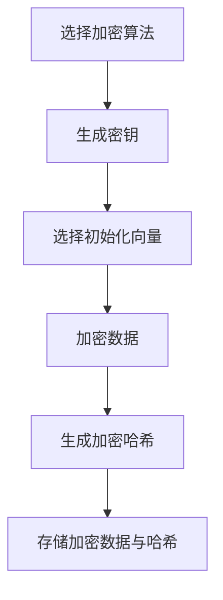
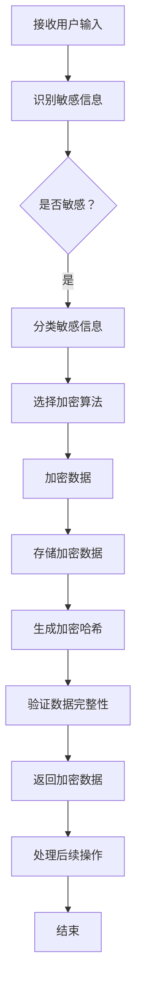

                 

# 《数据加密策略保护LLM应用敏感信息》

## 关键词
- 数据加密
- LLM应用
- 敏感信息保护
- 加密算法
- 安全性分析
- 性能优化

## 摘要
本文将深入探讨数据加密策略在保护LLM（大型语言模型）应用中敏感信息的重要性。首先，我们将介绍数据加密的基本原理，然后详细解释LLM与数据加密策略的关系。接着，我们将介绍几种常见的加密算法，并讨论它们在LLM应用中的适用性。文章还将分析数据加密策略的安全性，并提供性能优化方法。最后，我们将展望数据加密策略的未来挑战和机遇。

## 引言
随着人工智能技术的快速发展，LLM（大型语言模型）已经成为许多行业的关键工具。这些模型在自然语言处理、文本生成、机器翻译等领域表现出了卓越的能力。然而，LLM应用的数据通常包含敏感信息，如个人身份信息、财务数据等。这些信息的安全保护至关重要，因为一旦泄露，可能会带来严重的后果。因此，设计一个有效的数据加密策略来保护LLM应用中的敏感信息变得至关重要。

## 数据加密的基本原理
数据加密是一种将数据转换为无法被未经授权的第三方读取的形式的过程。其基本原理包括以下几个步骤：

1. **加密算法**：加密算法是加密过程的核心。它使用一个密钥来转换原始数据（明文）为一个加密后的数据（密文）。加密算法可以分为对称加密和非对称加密。

2. **密钥管理**：密钥是加密和解密数据的关键。密钥管理包括密钥的生成、存储、分发和销毁。良好的密钥管理策略可以确保加密系统的安全性。

3. **加密流程**：加密流程通常包括初始化向量（IV）的选择、加密算法的应用和加密数据的存储。

4. **加密哈希**：加密哈希是一种将数据转换为固定长度字符串的过程，用于验证数据的完整性和真实性。

### Mermaid流程图：数据加密流程


## LLM与数据加密策略的关系
LLM的应用涉及大量敏感信息的处理，如用户输入、对话历史和生成文本等。因此，设计一个有效的数据加密策略来保护这些敏感信息至关重要。

1. **敏感信息识别与分类**：首先，我们需要识别和分类LLM应用中的敏感信息。这可以通过构建一个敏感信息库来实现，该库包含常见的敏感信息类型和相应的分类规则。

2. **加密策略设计原则**：在LLM应用中设计加密策略时，需要考虑以下原则：
   - **最小权限原则**：只加密真正需要保护的敏感信息。
   - **透明性原则**：加密过程应该对应用开发者透明，以便他们能够轻松地实现和保护敏感信息。
   - **灵活性原则**：加密策略应该能够适应不同类型和规模的数据。

3. **加密算法选择**：在LLM应用中，通常需要使用对称加密算法和非对称加密算法的组合。对称加密算法（如AES）适用于加密大量数据，而非对称加密算法（如RSA）适用于加密密钥和数字签名。

### Mermaid流程图：LLM数据加密流程


## 常见加密算法介绍
在LLM应用中，常用的加密算法包括对称加密算法、非对称加密算法和哈希算法。下面将分别介绍这些算法。

### 对称加密算法
对称加密算法使用相同的密钥来加密和解密数据。常见的对称加密算法包括AES、DES和RSA。

#### Python源代码：AES加密算法实现
```python
from Crypto.Cipher import AES
from Crypto.Util.Padding import pad
from Crypto.Random import get_random_bytes

key = get_random_bytes(16)  # AES-128 bit key
cipher = AES.new(key, AES.MODE_CBC)
ct_bytes = cipher.encrypt(pad(b"Sensitive information", AES.block_size))
iv = cipher.iv
```

### 非对称加密算法
非对称加密算法使用一对密钥来加密和解密数据。常见的非对称加密算法包括RSA、ECC和Diffie-Hellman。

#### Python源代码：RSA加密算法实现
```python
from Crypto.PublicKey import RSA
from Crypto.Cipher import PKCS1_OAEP

key = RSA.generate(2048)
private_key = key.export_key()
public_key = key.publickey().export_key()

cipher = PKCS1_OAEP.new(RSA.import_key(public_key))
ct_bytes = cipher.encrypt(b"Sensitive information")
```

### 哈希算法
哈希算法用于生成数据的唯一摘要，以确保数据的完整性和真实性。常见的哈希算法包括MD5、SHA-1和SHA-256。

#### Python源代码：SHA-256哈希算法实现
```python
import hashlib

hash_object = hashlib.sha256()
hash_object.update(b"Sensitive information")
hex_dig = hash_object.hexdigest()
```

## 数据加密策略在LLM中的应用
在LLM应用中，数据加密策略的设计需要考虑以下方面：

1. **加密范围**：确定需要加密的数据范围，包括用户输入、对话历史、生成文本等。

2. **加密方式**：选择合适的加密算法，结合对称加密和非对称加密的优势，为不同类型的数据提供安全性。

3. **密钥管理**：建立安全的密钥管理系统，确保密钥的安全生成、存储和分发。

4. **加密流程**：设计简洁明了的加密流程，确保数据在传输和存储过程中得到有效保护。

### 数学模型：数据加密策略设计模型
$$
安全性 = f(加密算法, 密钥管理, 加密流程)
$$

## 安全性分析
数据加密策略的安全性是保护敏感信息的关键。以下是对数据加密策略的安全性进行分析的关键因素：

1. **加密算法安全性**：选择经过验证的加密算法，并确保其实现是正确的。

2. **密钥安全性**：密钥是加密系统的核心，必须确保密钥的安全生成、存储和分发。

3. **加密流程安全性**：设计简洁、安全的加密流程，避免中间人攻击、重放攻击等安全威胁。

### 数学模型：加密算法安全性评估模型
$$
安全性 = f(加密算法强度, 密钥强度, 加密流程完整性)
$$

## 性能优化策略
数据加密会对LLM应用的性能产生影响。以下是一些性能优化策略：

1. **并行处理**：使用并行处理技术，加速加密和解密过程。

2. **缓存机制**：使用缓存机制，减少重复加密和解密的开销。

3. **硬件加速**：利用GPU等硬件加速加密过程。

4. **加密算法优化**：选择适合应用场景的加密算法，并优化其实现。

### 数学模型：数据加密性能影响模型
$$
性能 = f(加密算法效率, 加密流程复杂度, 硬件加速)
$$

## 未来展望与挑战
数据加密策略在LLM应用中面临以下挑战：

1. **计算能力提升**：随着计算能力的提升，加密攻击方法也在不断进步，需要不断更新加密算法和密钥管理策略。

2. **量子计算威胁**：量子计算的发展可能会对现有的加密算法构成威胁，需要研究抗量子计算的加密算法。

3. **数据隐私保护**：在保护敏感信息的同时，还需要考虑数据的隐私保护，避免过度加密导致的数据不可用性问题。

## 结论
数据加密策略是保护LLM应用中敏感信息的关键。本文介绍了数据加密的基本原理、LLM与数据加密策略的关系、常见加密算法、安全性分析和性能优化策略。未来，随着技术的不断发展，数据加密策略需要不断适应新的挑战和需求。

## 附录

### A. 工具与资源
- **A.1 常用加密算法工具**：[CryptoLib](https://www.cryptolib.com/)
- **A.2 LLM数据加密工具**：[Hugging Face Transformers](https://huggingface.co/transformers/model_doc/bert.html)

## 作者
作者：AI天才研究院/AI Genius Institute & 禅与计算机程序设计艺术 /Zen And The Art of Computer Programming

