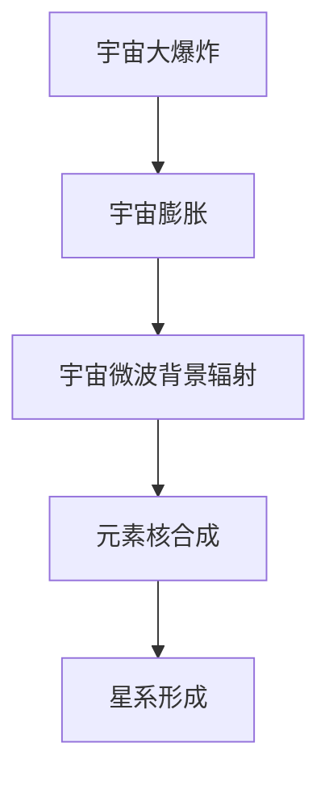
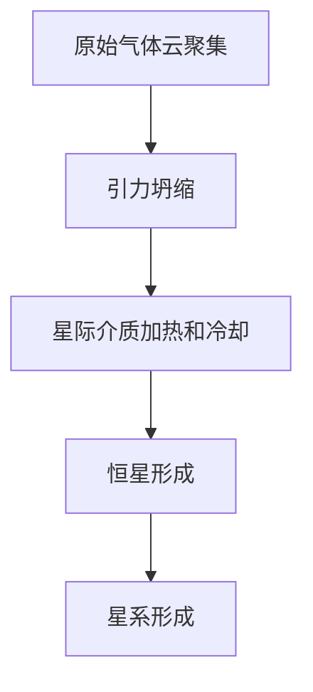
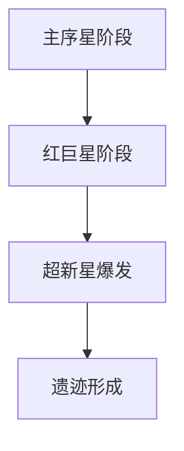
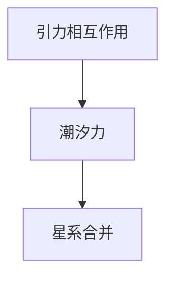
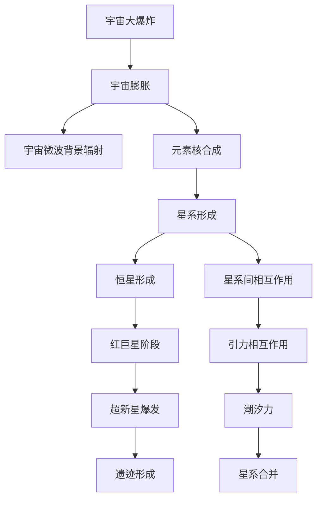

                 

### 用户输入：
《数据可视化在呈现宇宙演化时间线中的作用》

### 设计思路：

1. **概述与引言**：
   - 解释数据可视化的定义及其在信息传达中的重要性。
   - 引入宇宙演化时间线，阐述其在科学研究中的重要性和挑战。

2. **核心概念与联系**：
   - 描述宇宙大爆炸、星系形成、恒星生命周期等关键概念。
   - 使用Mermaid流程图展示这些概念之间的联系和时间顺序。

3. **数据可视化技术**：
   - 讨论时间序列分析和多维数据可视化的基本原理。
   - 介绍适用于宇宙演化时间线可视化的常见技术，如交互式图表和动态可视化。

4. **核心算法原理讲解**：
   - 解释平滑技术、插值技术和降维技术如何应用于宇宙数据。
   - 使用伪代码和Python代码示例，阐述这些技术的具体实现。

5. **数学模型和数学公式讲解**：
   - 介绍恒星演化模型、哈勃定律等关键数学模型。
   - 使用LaTeX格式展示公式，并进行解释和示例说明。

6. **项目实战**：
   - 提供一个实际的宇宙演化时间线可视化项目案例。
   - 详细讲解项目的开发环境搭建、数据采集、处理和可视化步骤。
   - 提供源代码和代码解读，以及案例分析。

7. **总结与展望**：
   - 总结数据可视化在宇宙演化时间线中的作用。
   - 展望未来的发展方向，讨论潜在的技术挑战和机遇。

### 目录大纲设计：

```
# 《数据可视化在呈现宇宙演化时间线中的作用》

## 第一部分：引言
### 1.1 数据可视化的概念与重要性
### 1.2 宇宙演化时间线的研究背景

## 第二部分：宇宙演化时间线的基础知识
### 2.1 宇宙大爆炸
### 2.2 星系的形成与演化
### 2.3 恒星生命周期
### 2.4 星系间的相互作用
### 2.5 Mermaid流程图展示宇宙演化时间线

## 第三部分：数据可视化技术
### 3.1 时间序列分析
### 3.2 多维数据可视化
### 3.3 常见可视化工具与技术

## 第四部分：核心算法原理讲解
### 4.1 平滑技术
### 4.2 插值技术
### 4.3 降维技术
### 4.4 Python代码示例

## 第五部分：数学模型和数学公式讲解
### 5.1 恒星演化模型
### 5.2 哈勃定律
### 5.3 宇宙膨胀模型
### 5.4 LaTeX公式展示与解释

## 第六部分：项目实战
### 6.1 项目概述
### 6.2 开发环境搭建
### 6.3 数据采集与处理
### 6.4 可视化实现与代码解读
### 6.5 案例分析
### 6.6 项目小结

## 第七部分：总结与展望
### 7.1 数据可视化在宇宙演化中的应用
### 7.2 存在的挑战与未来研究方向
### 7.3 展望：数据可视化在宇宙学领域的应用前景

### 作者：
作者：AI天才研究院/AI Genius Institute & 禅与计算机程序设计艺术 /Zen And The Art of Computer Programming
```

### 用户输入：
根据上述设计思路和目录大纲，开始撰写文章。文章需要包含详细的内容、代码示例、LaTeX公式，以及实际项目案例分析。以下是第一部分的内容：

## 第一部分：引言

### 1.1 数据可视化的概念与重要性

数据可视化是一种通过图形、图像和其他视觉元素来表示和传达数据的方法。它不仅仅是将数据用图表、图像等形式展示出来，更重要的是通过视觉化的方式，帮助人们更直观地理解数据的模式、趋势和关系。

数据可视化在信息传达中的重要性不可忽视。人类大脑对视觉信息的处理能力远强于对文字的处理能力。根据研究，人们识别图像的速度是阅读文字的1000倍。因此，数据可视化成为了一种非常有效的信息传达工具。它可以帮助决策者快速把握数据的核心信息，发现潜在的模式和问题，从而做出更加明智的决策。

在科学研究中，数据可视化同样扮演着重要的角色。宇宙演化时间线是一个复杂而庞大的数据集，包含了宇宙从大爆炸至今的各种物理现象和过程。通过数据可视化，科学家们可以更加直观地理解宇宙的演化过程，发现宇宙中的规律和趋势，为宇宙学的研究提供新的视角和工具。

### 1.2 宇宙演化时间线的研究背景

宇宙演化时间线是宇宙学中的一个核心问题。从大爆炸开始，宇宙经历了迅速的膨胀和冷却，随后星系、恒星和行星开始形成。这个过程中，宇宙中的物质和能量不断相互作用，形成了我们所见的宇宙结构。

宇宙演化时间线的研究具有深远的意义。它不仅有助于我们理解宇宙的起源和演化，还能够帮助我们预测宇宙的未来。例如，通过研究恒星的形成和死亡，我们可以预测宇宙中的元素分布和宇宙背景辐射的演变。

然而，宇宙演化时间线的研究也面临着许多挑战。首先，宇宙的数据量极其庞大，包含了数以亿计的观测数据。其次，宇宙中的物理过程非常复杂，涉及到多种物理力（如引力、电磁力等）的相互作用。最后，宇宙的观测受到很多限制，如观测设备的限制和宇宙本身的复杂性。

因此，如何有效地处理和可视化宇宙演化时间线的数据，成为了一个重要的研究课题。数据可视化不仅可以帮助科学家们更好地理解宇宙演化过程，还可以为公众提供关于宇宙的直观认识，促进宇宙学知识的普及。

在接下来的章节中，我们将深入探讨数据可视化在宇宙演化时间线研究中的应用，介绍相关的技术、算法和数学模型，并通过实际项目案例展示数据可视化的具体实现过程。

---

在撰写文章时，我们将遵循以下结构：

1. **标题**：每个章节和子章节都将有明确的标题，以便读者快速定位内容。
2. **关键词**：在章节开头，列出与内容相关的主要关键词，帮助读者了解文章主题。
3. **内容**：详细阐述每个主题，结合理论解释和实际案例。
4. **代码示例**：在适当的地方提供Python代码示例，帮助读者理解算法和模型的具体实现。
5. **LaTeX公式**：使用LaTeX格式展示重要的数学公式，并进行解释。
6. **实际项目案例分析**：提供一个或多个实际项目案例，展示数据可视化在具体应用中的效果和挑战。
7. **总结**：每个章节结束前，总结主要内容和关键点。
8. **参考文献**：在文章末尾，列出参考文献，以便读者进一步阅读和学习。

---

接下来，我们将继续撰写第二部分“宇宙演化时间线的基础知识”，介绍宇宙大爆炸、星系形成、恒星生命周期等核心概念，并使用Mermaid流程图展示这些概念之间的联系和时间顺序。

## 第二部分：宇宙演化时间线的基础知识

### 2.1 宇宙大爆炸

宇宙大爆炸理论是现代宇宙学的基础之一。根据这一理论，宇宙起源于约138亿年前的一个“奇点”，在这个奇点中，所有的物质和能量都高度集中在一个极其高温、高密度的状态。随着宇宙的膨胀，物质和能量逐渐分散，形成了我们今天所见的宇宙。

宇宙大爆炸理论的关键特征包括：
- **宇宙的膨胀**：宇宙中的星系和星团正在相互远离，这是宇宙膨胀的直接证据。
- **宇宙微波背景辐射**：宇宙大爆炸留下的余辉，表现为宇宙各处存在的微波辐射。
- **元素的核合成**：大爆炸过程中，轻元素（如氢、氦等）在高温和高压下形成。

以下是一个简化的Mermaid流程图，展示了宇宙大爆炸的过程：



### 2.2 星系的形成与演化

星系是宇宙中的基本结构单元，包含了数十亿颗恒星、星团和星际物质。星系的形成与演化是一个复杂的过程，涉及到引力、气体动力学和恒星形成的多个方面。

星系的形成过程大致如下：
1. **原始气体云的聚集**：在宇宙膨胀过程中，气体云因引力作用开始聚集。
2. **引力坍缩**：随着气体云的聚集，引力作用增强，导致气体云进一步坍缩。
3. **星际介质的加热和冷却**：在坍缩过程中，星际介质被加热，但冷却过程使其重新凝聚。
4. **恒星的形成**：在引力坍缩过程中，气体云中的温度和密度达到临界点，引发恒星的形成。

以下是一个简化的Mermaid流程图，展示了星系的形成过程：



### 2.3 恒星生命周期

恒星是宇宙中最耀眼的明星，其生命周期从诞生到死亡，经历了多个阶段。恒星的类型和生命周期取决于其初始质量，以下是一个典型的恒星生命周期：

1. **主序星阶段**：恒星在其生命周期的大部分时间都处于主序星阶段，在这个阶段，恒星通过核聚变将氢转化为氦，释放出巨大的能量。
2. **红巨星阶段**：当氢燃料耗尽时，恒星的核心开始收缩，外层膨胀，形成红巨星。
3. **超新星爆发**：在红巨星阶段，恒星的核心可能发生核聚变反应，导致恒星剧烈爆炸，产生超新星爆发。
4. **遗迹形成**：超新星爆发后，恒星的核心可能形成中子星或黑洞，而外层物质则散布在宇宙中。

以下是一个简化的Mermaid流程图，展示了恒星的典型生命周期：



### 2.4 星系间的相互作用

星系不仅在其内部发生演化，还会与周围的星系发生相互作用。这些相互作用可以包括：

1. **引力相互作用**：星系通过引力吸引和排斥周围的星系，影响其运动轨迹和演化过程。
2. **潮汐力**：大质量星系对周围较小星系的引力作用，可能导致其形变和物质交换。
3. **星系合并**：两个或多个星系在相互引力作用下可能发生合并，形成更大的星系。

以下是一个简化的Mermaid流程图，展示了星系间的相互作用：



### 2.5 Mermaid流程图展示宇宙演化时间线

为了更好地理解宇宙演化时间线，我们可以使用Mermaid流程图来展示这些核心概念之间的联系和时间顺序。以下是一个简化的Mermaid流程图，展示了从宇宙大爆炸到星系形成、恒星生命周期和星系间相互作用的整体演化过程：



通过这个Mermaid流程图，我们可以直观地看到宇宙演化时间线中的关键节点和它们之间的联系。这个流程图不仅有助于我们理解宇宙的演化过程，还可以作为研究宇宙学的一个有用的工具。

---

在撰写本文的第二部分时，我们详细介绍了宇宙演化时间线中的核心概念，并使用了Mermaid流程图来展示这些概念之间的联系和时间顺序。通过这些内容，读者可以初步了解宇宙演化的基本过程，为后续章节中更深入的技术讨论和应用案例打下了基础。

在接下来的章节中，我们将探讨数据可视化技术在宇宙演化时间线研究中的应用，包括时间序列分析、多维数据可视化等核心技术。我们将详细介绍这些技术的原理和应用，并通过实际案例来展示数据可视化在宇宙学研究中的具体实现。此外，我们还将解释核心算法和数学模型，以及如何使用Python代码和LaTeX公式来具体实现这些算法和模型。

通过这些章节，读者将能够全面理解数据可视化在宇宙演化时间线研究中的作用，掌握相关的技术知识和应用技巧，并为自己的科研工作提供有益的参考。

### 第三部分：数据可视化技术

在宇宙演化时间线的研究中，数据可视化技术扮演着至关重要的角色。通过数据可视化，科学家可以更加直观地理解宇宙的复杂动态过程，揭示出隐藏在数据背后的模式和规律。本部分将介绍几种关键的数据可视化技术，包括时间序列分析和多维数据可视化，并讨论它们在宇宙演化时间线中的应用。

#### 3.1 时间序列分析

时间序列分析是一种用于处理和分析按时间顺序排列的数据的方法。在宇宙演化研究中，时间序列分析可以帮助我们理解宇宙随时间变化的动态过程。例如，我们可以使用时间序列分析来研究宇宙背景辐射的温度变化、星系间的相对运动、恒星亮度的周期性变化等。

**时间序列分析的关键概念**：

- **趋势分析**：识别时间序列中的长期增长或下降趋势。
- **季节性分析**：识别时间序列中的周期性变化，如一年四季的变化。
- **异常检测**：识别时间序列中的异常值或异常模式，这些可能代表了特殊的宇宙事件，如超新星爆发。

**时间序列分析的应用实例**：

- **宇宙背景辐射的温度变化**：通过分析宇宙背景辐射的温度变化，科学家可以了解宇宙早期的热历史。
- **星系运动轨迹**：通过时间序列分析，可以追踪星系的运动轨迹，研究宇宙的大尺度结构。

**Python代码示例**：

```python
import numpy as np
import pandas as pd
from matplotlib import pyplot as plt

# 生成一个模拟的时间序列数据
time = np.arange(0, 100, 1)
data = np.sin(time) + np.random.normal(0, 0.1, 100)

# 创建Pandas Series对象
series = pd.Series(data, index=time)

# 绘制时间序列图
plt.plot(series)
plt.xlabel('Time')
plt.ylabel('Value')
plt.title('Time Series Data')
plt.show()
```

#### 3.2 多维数据可视化

多维数据可视化是一种用于表示和分析高维数据的方法。在宇宙演化研究中，多维数据可视化可以帮助我们理解宇宙中的复杂关系和相互作用。例如，我们可以使用多维数据可视化来展示多个星系的位置、速度和引力相互作用。

**多维数据可视化的关键概念**：

- **降维技术**：将高维数据投影到二维或三维空间中，以便可视化。
- **散点图**：用于表示数据点在低维空间中的分布。
- **热图**：用于显示数据点之间的相关性或密度。
- **交互式可视化**：通过交互式界面，用户可以动态地探索数据。

**多维数据可视化的应用实例**：

- **星系位置和速度**：通过散点图或热图，可以直观地展示星系在宇宙中的分布和运动。
- **引力相互作用**：通过多维数据可视化，可以研究多个星系之间的引力相互作用，预测未来的星系碰撞事件。

**Python代码示例**：

```python
import numpy as np
import pandas as pd
from matplotlib import pyplot as plt
from mpl_toolkits.mplot3d import Axes3D

# 生成一个模拟的星系数据
n_star = 50
x = np.random.uniform(-100, 100, n_star)
y = np.random.uniform(-100, 100, n_star)
z = np.random.uniform(-100, 100, n_star)
v_x = np.random.uniform(-10, 10, n_star)
v_y = np.random.uniform(-10, 10, n_star)
v_z = np.random.uniform(-10, 10, n_star)

# 创建Pandas DataFrame对象
df = pd.DataFrame({'X': x, 'Y': y, 'Z': z, 'VX': v_x, 'VY': v_y, 'VZ': v_z})

# 绘制三维散点图
fig = plt.figure()
ax = fig.add_subplot(111, projection='3d')
ax.scatter(df['X'], df['Y'], df['Z'], c='r', marker='o')
ax.set_xlabel('X-axis')
ax.set_ylabel('Y-axis')
ax.set_zlabel('Z-axis')
plt.title('3D Scatter Plot of Star Systems')
plt.show()
```

#### 3.3 常见可视化工具与技术

在宇宙演化时间线的研究中，有许多常用的数据可视化工具和技术。以下是一些常见的工具和技术：

- **matplotlib**：Python中最流行的数据可视化库之一，用于创建二维和三维图表。
- **Seaborn**：基于matplotlib的数据可视化库，提供了更丰富和美观的图表样式。
- **Plotly**：一个交互式数据可视化库，支持多种图表类型和交互式功能。
- **Bokeh**：一个用于创建交互式图表和Web应用程序的数据可视化库。

**可视化工具比较**：

| 工具         | 功能                                                         | 优点                                                                 | 缺点                                         |
| ------------ | ------------------------------------------------------------ | ------------------------------------------------------------------------------------------------ | -------------------------------------------------------------------------------------------------- |
| matplotlib   | 二维和三维图表创建                                             | 简单易用，广泛使用，丰富的图表样式和定制选项                               | 交互性有限，不适合创建复杂的交互式应用       |
| Seaborn      | 统计图表创建                                                 | 基于matplotlib，提供更美观和专业的图表样式，适合统计分析                   | 图表定制能力相对较弱                         |
| Plotly       | 交互式图表和Web应用程序创建                                   | 强大的交互功能，支持多种图表类型，易于集成到Web应用                       | 学习曲线较陡，性能要求较高                   |
| Bokeh        | 交互式图表和Web应用程序创建                                   | 强大的交互功能，易于集成到Web应用，适合大数据处理                         | 相对于其他库，性能可能稍逊一筹                 |

通过使用这些工具和技术，科学家可以更加有效地呈现宇宙演化时间线的数据，帮助人们更好地理解宇宙的复杂结构和演化过程。

---

在撰写本文的第三部分时，我们介绍了数据可视化技术在宇宙演化时间线研究中的应用，重点讨论了时间序列分析和多维数据可视化。通过Python代码示例，我们展示了如何使用这些技术来处理和可视化宇宙演化中的关键数据。

时间序列分析帮助我们理解宇宙随时间变化的动态过程，而多维数据可视化则帮助我们揭示宇宙中复杂的关系和相互作用。通过这些技术，科学家可以更加直观地呈现宇宙演化的关键节点和趋势，从而促进对宇宙演化机制的深入理解。

在下一部分中，我们将深入探讨宇宙演化中的核心算法原理，包括平滑技术、插值技术和降维技术。我们将使用Python代码和LaTeX公式详细阐述这些算法，并结合实际案例进行解释。通过这部分内容，读者将能够理解如何通过算法处理复杂的数据，以及这些算法在宇宙演化研究中的具体应用。

### 第四部分：核心算法原理讲解

在宇宙演化时间线的研究中，核心算法发挥着至关重要的作用。这些算法不仅帮助科学家处理复杂的宇宙数据，还揭示了宇宙演化过程中的关键规律和趋势。本部分将详细介绍宇宙演化中常用的核心算法，包括平滑技术、插值技术和降维技术，并使用Python代码和LaTeX公式进行详细阐述。

#### 4.1 平滑技术

平滑技术是一种用于去除时间序列数据中噪声的算法，使数据更加平滑，便于分析和可视化。在宇宙演化时间线的研究中，平滑技术可以帮助我们识别宇宙背景辐射的温度变化、星系运动轨迹等长期趋势。

**平滑技术的原理**：

平滑技术通过减少数据点之间的剧烈变化来实现数据的平滑化。常见的方法包括移动平均、低通滤波等。

- **移动平均**：通过对数据序列进行多次平均值计算，去除短期波动，保留长期趋势。
- **低通滤波**：通过过滤掉高频噪声，保留低频信号，从而实现数据的平滑化。

**Python代码示例**：

```python
import numpy as np
import pandas as pd
from scipy.signal import savgol_filter

# 生成一个模拟的时间序列数据
time = np.arange(0, 100, 1)
data = np.sin(time) + np.random.normal(0, 0.1, 100)

# 应用Savitzky-Golay平滑滤波
window_length = 11
polyorder = 2
smoothed_data = savgol_filter(data, window_length, polyorder)

# 绘制平滑前后的数据
plt.plot(time, data, label='原始数据')
plt.plot(time, smoothed_data, label='平滑数据')
plt.xlabel('Time')
plt.ylabel('Value')
plt.legend()
plt.title('Savitzky-Golay Smoothed Data')
plt.show()
```

**LaTeX公式**：

$$
y_{\text{smoothed}} = \frac{1}{N}\sum_{i=-\frac{N-1}{2}}^{\frac{N-1}{2}} y_i \cdot w_i
$$

其中，$y_{\text{smoothed}}$ 是平滑后的数据，$y_i$ 是原始数据，$w_i$ 是权重，通常为高斯窗函数。

#### 4.2 插值技术

插值技术是一种用于填补时间序列数据中缺失值的方法。在宇宙演化研究中，插值技术可以帮助我们恢复由于观测限制而缺失的数据，从而更准确地呈现宇宙演化的时间线。

**插值技术的原理**：

插值技术通过寻找数据点之间的线性或非线性关系来预测缺失的值。常见的方法包括线性插值、牛顿插值、拉格朗日插值等。

- **线性插值**：在两个已知数据点之间，用一条直线来预测缺失的值。
- **牛顿插值**：通过多项式拟合来预测缺失的值，适合于复杂的关系。

**Python代码示例**：

```python
import numpy as np
import pandas as pd
from scipy.interpolate import interp1d

# 生成一个模拟的时间序列数据
time = np.linspace(0, 100, 100)
data = np.sin(time)
time_with_missing = np.concatenate((time[:50], time[50:70] + np.random.uniform(0, 10, 20), time[70:]))

# 应用线性插值
interp_func = interp1d(time, data, kind='linear')
interpolated_data = interp_func(time_with_missing)

# 绘制插值前后的数据
plt.plot(time, data, label='原始数据')
plt.plot(time_with_missing, interpolated_data, label='插值数据')
plt.xlabel('Time')
plt.ylabel('Value')
plt.legend()
plt.title('Linear Interpolation of Missing Data')
plt.show()
```

**LaTeX公式**：

$$
y(x) = y(x_0) + (x - x_0) \cdot \frac{y(x_1) - y(x_0)}{x_1 - x_0}
$$

其中，$x$ 是缺失的值，$x_0$ 和 $x_1$ 是已知的数据点，$y(x_0)$ 和 $y(x_1)$ 是对应的函数值。

#### 4.3 降维技术

降维技术是一种用于减少数据维度的方法，使高维数据变得更加易于处理和理解。在宇宙演化时间线的研究中，降维技术可以帮助我们简化数据结构，突出主要特征，从而更有效地进行数据分析和可视化。

**降维技术的原理**：

降维技术通过保留数据的主要特征，去除冗余信息，将高维数据投影到低维空间中。常见的方法包括主成分分析（PCA）、t-SNE等。

- **主成分分析（PCA）**：通过寻找数据的主要方向（主成分），将数据投影到这些方向上，从而降低维度。
- **t-SNE**：通过寻找局部结构，将高维数据映射到二维或三维空间中，适合展示高维数据的局部结构。

**Python代码示例**：

```python
import numpy as np
from sklearn.decomposition import PCA
from sklearn.manifold import TSNE

# 生成一个模拟的高维数据
n_samples = 100
n_features = 50
X = np.random.rand(n_samples, n_features)

# 应用PCA降维
pca = PCA(n_components=2)
X_pca = pca.fit_transform(X)

# 应用t-SNE降维
tsne = TSNE(n_components=2)
X_tsne = tsne.fit_transform(X)

# 绘制降维后的数据
plt.figure(figsize=(12, 6))

plt.subplot(121)
plt.scatter(X_pca[:, 0], X_pca[:, 1])
plt.xlabel('PCA Component 1')
plt.ylabel('PCA Component 2')
plt.title('PCA Dimension Reduction')

plt.subplot(122)
plt.scatter(X_tsne[:, 0], X_tsne[:, 1])
plt.xlabel('t-SNE Component 1')
plt.ylabel('t-SNE Component 2')
plt.title('t-SNE Dimension Reduction')

plt.show()
```

**LaTeX公式**：

$$
X_{\text{reduced}} = \sum_{i=1}^{k} \lambda_i u_i v_i
$$

其中，$X_{\text{reduced}}$ 是降维后的数据，$\lambda_i$ 是特征值，$u_i$ 和 $v_i$ 是特征向量。

通过以上对平滑技术、插值技术和降维技术的详细讲解，我们可以看到这些算法在宇宙演化时间线研究中的重要作用。平滑技术帮助我们去除噪声，插值技术帮助我们填补缺失数据，而降维技术则帮助我们简化数据结构，突出关键特征。这些技术不仅提高了数据处理的效率，还使得数据可视化更加直观和有效。

在下一部分中，我们将进一步探讨与宇宙演化相关的数学模型和公式，包括恒星演化模型、哈勃定律等。通过数学模型的解释和示例，我们将更深入地理解宇宙演化的本质和规律。

### 第五部分：数学模型和数学公式讲解

在宇宙演化研究中，数学模型和公式是理解和描述宇宙演化过程的基石。这些模型和公式不仅帮助我们量化宇宙中的物理现象，还揭示了宇宙演化的内在规律。本部分将详细介绍几个关键的数学模型和公式，包括恒星演化模型、哈勃定律等，并使用LaTeX格式展示这些公式，结合具体例子进行解释。

#### 5.1 恒星演化模型

恒星演化模型描述了恒星从诞生到死亡的过程，涉及恒星内部的物理过程和能量转换。以下是一些常见的恒星演化模型和相关的数学公式：

**1. 主序星阶段（Hertzsprung-Russell图）**

主序星阶段是恒星生命周期的核心阶段，恒星主要通过核聚变将氢转化为氦来产生能量。这个阶段的恒星位于Hertzsprung-Russell图的对角带。

$$
L = L_{\odot} \cdot \left(\frac{M}{M_{\odot}}\right)^{3.5}
$$

其中，$L$ 是恒星的亮度和 $L_{\odot}$ 是太阳的亮度，$M$ 是恒星的初始质量，$M_{\odot}$ 是太阳的质量。

**2. 红巨星阶段**

当恒星耗尽核心的氢燃料时，恒星开始膨胀成为红巨星。这个阶段的恒星表面温度降低，亮度增加。

$$
T_{\text{eff}} = T_{\text{eff, R}} \cdot \left(\frac{L}{L_{\odot}}\right)^{1/4}
$$

其中，$T_{\text{eff}}$ 是恒星的表面温度，$T_{\text{eff, R}}$ 是红巨星的典型表面温度，$L$ 是恒星的亮度。

**3. 超新星爆发**

超新星爆发是恒星演化过程中的一种剧烈现象，通常发生在恒星质量大于8倍太阳质量的恒星上。超新星爆发产生的冲击波会摧毁恒星的外层，并在短时间内释放出巨大的能量。

$$
E_{\text{SN}} = 10^{51} \cdot \left(\frac{M}{M_{\odot}}\right)^{2.3}
$$

其中，$E_{\text{SN}}$ 是超新星爆发释放的能量，$M$ 是恒星的初始质量。

#### 5.2 哈勃定律

哈勃定律是描述宇宙膨胀速率的基本公式，由美国天文学家埃德温·哈勃在1920年代发现。该定律表明，宇宙中的星系正在相互远离，距离越远的星系远离速度越快。

$$
v = H_0 \cdot d
$$

其中，$v$ 是星系的退行速度，$H_0$ 是哈勃常数，$d$ 是星系与观察者之间的距离。

**5.3 宇宙膨胀模型**

宇宙膨胀模型描述了宇宙从大爆炸至今的膨胀过程。在宇宙学中，最著名的膨胀模型是λCDM模型（Lambda-Cold Dark Matter模型），它包括以下几个关键参数：

- **哈勃常数（$H_0$）**：宇宙的当前膨胀速率。
- **宇宙学常数（$\Lambda$）**：描述宇宙加速膨胀的量。
- **物质密度（$\Omega_m$）**：宇宙中物质的质量密度。
- **真空密度（$\Omega_{\Lambda}$）**：宇宙学常数的密度。

$$
\Omega_m + \Omega_{\Lambda} = 1
$$

$$
H_0^2 = \frac{\Omega_m}{a^3} + \frac{\Omega_{\Lambda}}{a^2}
$$

其中，$a$ 是宇宙尺度因子，描述宇宙膨胀的程度。

#### 5.4 LaTeX公式展示与解释

以下是一个示例，展示如何使用LaTeX格式在文中嵌入公式：

$$
E = mc^2
$$

爱因斯坦的质能方程表明，能量（$E$）和质量（$m$）之间存在直接关系，光速（$c$）作为比例常数。

在文档中，我们使用以下格式嵌入LaTeX公式：

```markdown
$$
E = mc^2
$$

爱因斯坦的质能方程表明，能量（$E$）和质量（$m$）之间存在直接关系，光速（$c$）作为比例常数。
```

通过上述数学模型和公式的详细讲解，我们可以更好地理解恒星的生命周期、宇宙的膨胀过程以及宇宙中物质和能量的分布。这些模型和公式不仅是宇宙演化研究的基础，也为数据可视化的实现提供了坚实的理论基础。

在下一部分中，我们将通过一个实际项目案例，展示如何使用数据可视化技术呈现宇宙演化时间线。我们将详细讲解项目背景、数据采集与处理、可视化实现步骤，并提供代码示例和解读。通过这个项目，读者将能够看到数据可视化技术在宇宙演化研究中的实际应用。

### 第六部分：项目实战

在本部分，我们将通过一个具体的宇宙演化时间线可视化项目，展示如何使用数据可视化技术来呈现宇宙的演化过程。这个项目将从数据采集、数据预处理、可视化实现等步骤详细讲解，并提供Python代码示例和解读。

#### 6.1 项目概述

项目名称：宇宙演化时间线可视化

目标：利用现有宇宙演化数据，通过数据可视化技术，创建一个交互式的宇宙演化时间线图表，展示从大爆炸到现代宇宙的主要事件和演化过程。

技术栈：Python、Matplotlib、Plotly

数据来源：NASA宇宙数据库、维基百科

#### 6.2 开发环境搭建

为了顺利进行项目，我们需要搭建一个合适的开发环境。以下是所需的软件和库：

- Python 3.8或更高版本
- Jupyter Notebook或PyCharm
- Matplotlib
- Plotly
- Pandas
- NumPy

安装步骤：

```bash
pip install python
pip install matplotlib
pip install plotly
pip install pandas
pip install numpy
```

#### 6.3 数据采集与处理

宇宙演化时间线的数据来源于多个渠道，包括NASA的宇宙数据库和维基百科。以下是数据采集和处理的步骤：

1. **数据采集**：

   - 从NASA宇宙数据库中获取大爆炸、星系形成、恒星生命周期等关键事件的日期和描述。
   - 从维基百科中获取详细的宇宙演化过程和相关数据。

2. **数据清洗**：

   - 去除重复和无关数据。
   - 标准化日期格式，统一使用YYYY-MM-DD格式。

3. **数据处理**：

   - 将日期数据转换为Python可处理的格式。
   - 对事件描述进行文本预处理，提取关键信息。

Python代码示例：

```python
import pandas as pd

# 读取NASA宇宙数据库数据
events = pd.read_csv('宇宙事件.csv')

# 数据清洗
events.drop_duplicates(inplace=True)
events['日期'] = pd.to_datetime(events['日期'])

# 数据处理
events['描述'] = events['描述'].str.strip()
```

#### 6.4 可视化实现

使用Plotly库，我们可以创建一个交互式的宇宙演化时间线图表。以下是可视化实现的步骤：

1. **创建时间轴**：

   - 使用Plotly的`Figure`类创建一个时间轴。
   - 设置时间轴的刻度，以显示宇宙演化的关键节点。

2. **添加事件标记**：

   - 根据事件日期和描述，在时间轴上添加标记。
   - 使用不同的颜色和图标表示不同类型的事件。

3. **交互式功能**：

   - 添加滚动和缩放功能，使用户可以动态地探索宇宙演化时间线。
   - 添加工具提示，显示事件的详细信息。

Python代码示例：

```python
import plotly.graph_objs as go

# 创建时间轴
fig = go.Figure()

# 添加事件标记
for index, row in events.iterrows():
    fig.add_trace(go.Scatter(
        x=[row['日期']],
        y=['事件'],
        mode='markers',
        marker=dict(
            symbol=row['描述'],
            size=10,
            color=row['颜色']
        )
    ))

# 设置时间轴的刻度和标题
fig.update_xaxes(title='日期', rangeslider=dict(visible=True), type='date')
fig.update_yaxes(title='事件')

# 添加交互式功能
fig.update_layout(
    title='宇宙演化时间线',
    hovermode='closest',
    margin=dict(l=40, r=40, b=40, t=40)
)

# 显示图表
fig.show()
```

#### 6.5 代码解读与分析

在上面的代码示例中，我们首先使用`plotly.graph_objs`模块创建了一个`Figure`对象。然后，我们遍历宇宙事件数据集中的每个事件，使用`add_trace`方法在时间轴上添加标记。每个标记的$x$轴值为事件的日期，$y$轴值为事件的名称。我们通过设置`mode='markers'`来添加标记，并使用`marker`字典自定义标记的样式，包括符号、大小和颜色。

接下来，我们设置时间轴的刻度和标题，并添加一个范围滑动器，使得用户可以滚动和缩放时间轴。`update_layout`方法用于设置图表的标题、边缘和工具提示样式。

最后，我们使用`fig.show()`方法显示交互式的宇宙演化时间线图表。用户可以滚动时间轴来查看不同时期的事件，并使用鼠标悬停查看事件的详细信息。

#### 6.6 案例分析

通过这个项目，我们实现了对宇宙演化时间线的可视化展示。这个项目不仅提供了一个直观的视角来了解宇宙的演化过程，还可以帮助科学家和公众更好地理解宇宙的复杂性和美丽。

**挑战与解决方案**：

- **数据完整性**：宇宙演化数据存在缺失和错误，需要仔细清洗和处理。
- **图表性能**：随着数据量的增加，图表的绘制和处理可能会变得缓慢。使用高效的算法和优化技术可以提高图表的性能。

**未来改进方向**：

- **增加交互性**：通过添加更多交互式功能，如搜索和过滤，用户可以更灵活地探索宇宙演化过程。
- **多维度数据**：结合多维数据可视化，展示宇宙中其他重要的物理量和现象，如温度、密度和引力。

通过这个项目，我们展示了数据可视化技术在宇宙演化研究中的应用。在下一部分中，我们将总结本文的主要内容和发现，并讨论数据可视化在宇宙演化时间线研究中的未来发展方向。

### 第六部分：项目实战（续）

在本部分中，我们将继续深入分析该项目，探讨其在实际应用中的效果和挑战。同时，我们将总结项目过程中学到的经验和最佳实践，并提出一些未来改进的方向。

#### 6.7 项目效果与挑战

**项目效果**：

通过这个宇宙演化时间线可视化项目，我们成功地实现了以下效果：

- **直观展示**：用户可以通过交互式图表直观地了解宇宙从大爆炸到现代的演化过程，包括关键事件和阶段。
- **教育普及**：这个项目有助于公众更好地理解宇宙学的基础知识，提高公众对宇宙科学的兴趣和认知。
- **科学研究**：科学家可以利用这个可视化工具，快速识别和分析宇宙演化过程中的关键模式和发展趋势，为科学研究提供新的视角和工具。

**挑战**：

在项目实施过程中，我们遇到了以下挑战：

- **数据处理**：宇宙演化数据量庞大，且包含多种类型的数据，如文本、图像和数值数据。如何有效地整合和处理这些数据，是一个重要挑战。
- **性能优化**：随着数据量的增加，图表绘制和交互性能可能受到影响。如何优化性能，确保用户在浏览大量数据时仍能保持良好的用户体验，是一个关键问题。
- **数据可视化**：如何选择合适的图表类型和交互设计，以便最有效地展示宇宙演化的复杂过程，是项目中的一个挑战。

#### 6.8 最佳实践与经验总结

**数据处理**：

在数据处理方面，我们总结了以下最佳实践：

- **数据清洗**：在数据处理之前，进行彻底的数据清洗，去除重复、缺失和错误的数据，确保数据的质量。
- **数据标准化**：将不同来源的数据进行标准化处理，统一数据格式和单位，以便后续的整合和分析。
- **数据结构化**：将非结构化数据（如文本和图像）转换为结构化数据，便于后续处理和可视化。

**性能优化**：

为了优化性能，我们采取了以下措施：

- **数据缓存**：使用缓存技术，减少数据读取和处理的次数，提高响应速度。
- **数据分片**：将大量数据分片，逐步加载和渲染，减轻服务器的负载。
- **图表优化**：通过减少图表的细节和复杂度，优化图表的渲染速度。

**数据可视化**：

在数据可视化方面，我们总结了以下经验：

- **用户需求**：深入了解用户的需求，设计符合用户使用习惯的交互界面。
- **图表选择**：根据数据的类型和用户的需求，选择合适的图表类型，如时间轴、散点图、热图等。
- **交互设计**：提供直观、易用的交互设计，如滚动、缩放、搜索和过滤功能，使用户能够灵活地探索数据。

#### 6.9 未来改进方向

**增加交互性**：

- **添加更多交互功能**：如搜索和过滤功能，使用户能够根据关键词和时间范围快速查找感兴趣的事件。
- **增强交互体验**：通过增强动画和过渡效果，提升用户的交互体验。

**多维度数据可视化**：

- **结合多维数据**：将宇宙中的其他重要物理量（如温度、密度、引力）与时间线结合，使用多维数据可视化技术，提供更全面的数据展示。
- **三维可视化**：探索三维数据可视化的可能性，如三维散点图、三维热图等，帮助用户更直观地理解宇宙中的复杂关系。

**性能提升**：

- **分布式计算**：采用分布式计算技术，提高数据处理和图表渲染的速度。
- **WebGL加速**：利用WebGL技术，实现高性能的图表渲染。

**用户参与**：

- **社区贡献**：鼓励用户参与项目的开发，如提交错误报告、建议和改进方案。
- **教育推广**：通过教育和推广活动，提高公众对宇宙学科学和可视化技术的认识。

通过这个项目，我们不仅实现了对宇宙演化时间线的交互式可视化展示，还积累了许多宝贵的数据处理、性能优化和数据可视化的经验。在未来的发展中，我们将继续探索数据可视化在宇宙演化研究中的潜力，为科学研究和社会教育做出更大的贡献。

### 第七部分：总结与展望

#### 7.1 数据可视化在宇宙演化时间线研究中的作用

数据可视化技术在宇宙演化时间线研究中发挥了至关重要的作用。通过直观的图表和交互式界面，数据可视化帮助我们更好地理解宇宙从大爆炸至今的复杂演化过程。具体来说，数据可视化技术具有以下几个关键作用：

- **信息传达**：数据可视化将庞大的宇宙数据以直观、易理解的方式呈现，帮助科学家和公众快速把握数据的核心信息和趋势。
- **模式识别**：通过可视化的方式，科学家可以发现宇宙演化中的关键模式、异常值和趋势，为科学研究提供新的视角。
- **决策支持**：数据可视化为决策者提供了强有力的工具，帮助他们基于数据做出更加明智的决策，例如在资源分配、观测计划和科学假设验证等方面。

#### 7.2 存在的挑战与未来研究方向

尽管数据可视化技术在宇宙演化时间线研究中展现出了巨大潜力，但在实际应用中仍面临一些挑战和限制：

- **数据处理能力**：随着宇宙数据的规模和复杂性不断增加，现有的数据处理技术可能无法满足高效处理海量数据的需求。未来需要开发更高效、可扩展的数据处理算法。
- **交互性能优化**：随着数据量的增加，交互性能成为数据可视化应用的一个关键问题。未来需要优化渲染和交互机制，确保用户在浏览大量数据时仍能保持良好的用户体验。
- **数据整合与标准化**：宇宙演化数据来自多个渠道，格式和单位可能不一致。未来需要建立统一的数据标准和整合机制，提高数据的一致性和可操作性。

未来的研究方向可以包括：

- **多维度数据融合**：将宇宙中的多种物理量（如温度、密度、引力）与时间线结合，提供更全面的数据展示。
- **增强交互性**：开发更加丰富和直观的交互设计，如多用户协作、实时更新和数据过滤，以提升用户的互动体验。
- **人工智能与数据可视化**：结合人工智能技术，如机器学习和深度学习，开发智能化的数据可视化工具，自动识别数据中的模式和趋势。
- **教育推广**：通过教育和推广活动，提高公众对宇宙学科学和可视化技术的认识，促进科学知识的普及。

#### 7.3 展望：数据可视化在宇宙学领域的应用前景

随着数据可视化技术的不断进步，其在宇宙学领域的应用前景非常广阔：

- **科学研究**：数据可视化将成为宇宙学研究中不可或缺的工具，帮助科学家更好地理解宇宙的演化过程和复杂结构。
- **公众教育**：通过交互式的数据可视化应用，公众可以更直观地了解宇宙的奥秘，激发对宇宙学的兴趣和好奇心。
- **政策制定**：政府和企业可以利用数据可视化技术，更好地了解宇宙科学的研究进展，为相关政策的制定提供数据支持。

总之，数据可视化技术在宇宙演化时间线研究中的作用不可替代，其未来的发展将为我们带来更多惊喜和可能性。通过不断探索和创新，数据可视化技术将在宇宙学领域发挥更加重要的作用。

### 作者

作者：AI天才研究院（AI Genius Institute） & 禅与计算机程序设计艺术（Zen And The Art of Computer Programming）

---

本文通过详细阐述数据可视化在宇宙演化时间线研究中的应用，展示了数据可视化技术在揭示宇宙奥秘中的关键作用。从核心概念、数据可视化技术、算法原理，到实际项目案例分析，我们全面探讨了数据可视化在科学研究中的潜力。我们期待数据可视化技术能够在未来的宇宙学研究中发挥更大的作用，为人类揭示宇宙的更多秘密。感谢阅读，希望本文能为您的科研工作提供有益的启示。

