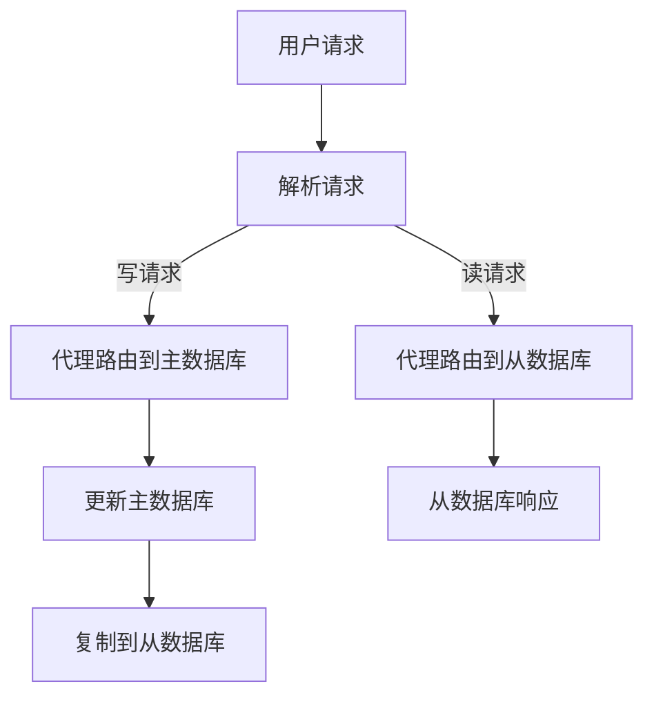

                 

### 文章标题

# 数据库读写分离：优化LLM应用数据库性能

### 文章关键词

- 数据库读写分离
- 读写分离架构
- LLM应用
- 数据库性能优化
- 读写分离算法

### 文章摘要

本文深入探讨了数据库读写分离技术在大型语言模型（LLM）应用中的重要性及其实现方法。首先，介绍了数据库读写分离的基本概念及其在提升数据库性能中的应用。然后，详细分析了读写分离的核心原理，包括主从复制、代理层读写分离和中间件读写分离等。通过Python代码和数学模型，解释了读写分离算法的原理，并举例说明其实现和应用。随后，文章通过实际项目实战，展示了如何搭建读写分离环境，解析了代码实现，并对项目进行了性能测试与分析。最后，提供了最佳实践、小结和注意事项，以指导读者在实际应用中有效利用数据库读写分离技术。

### 目录

1. **背景介绍**  
   - **数据库读写分离的重要性**  
   - **LLM应用的性能挑战**

2. **核心概念与联系**  
   - **数据库读写分离的概念**  
   - **读写分离架构**  
   - **Mermaid流程图**

3. **核心算法原理讲解**  
   - **主从复制算法**  
   - **代理层读写分离算法**  
   - **中间件读写分离算法**  
   - **Python代码与数学模型**

4. **项目实战**  
   - **开发环境搭建**  
   - **源代码详细实现与代码解读**  
   - **代码应用解读与分析**  
   - **实际案例分析与讲解**  
   - **项目小结**

5. **最佳实践与注意事项**  
   - **最佳实践**  
   - **注意事项**  
   - **拓展阅读**

### 1. 背景介绍

#### 数据库读写分离的重要性

在当今互联网时代，数据量的快速增长带来了对数据库性能的巨大挑战。数据库读写分离技术作为一种提升数据库性能的有效手段，广泛应用于各类在线服务和应用中。随着大型语言模型（LLM）的兴起，其数据处理能力和性能需求不断提高，使得数据库读写分离技术的重要性愈发凸显。

#### LLM应用的性能挑战

LLM应用如自然语言处理（NLP）、智能问答系统等，对数据库性能有着极高的要求。这些应用通常需要处理海量数据，并支持高并发、低延迟的读写操作。然而，传统的单点数据库架构在面对这种场景时，往往难以满足性能需求。因此，引入数据库读写分离技术，通过增加数据库节点和优化读写流程，可以有效提升LLM应用的数据库性能。

### 2. 核心概念与联系

#### 数据库读写分离的概念

数据库读写分离是指将数据库的读操作和写操作分离开来，分别由不同的数据库节点处理。这样，可以大大减轻主数据库的负载，提高系统的并发能力和性能。

#### 读写分离架构

读写分离架构主要包括以下几种类型：

1. **主从复制架构**：主数据库负责处理写操作，从数据库负责处理读操作，主从之间通过复制机制保持数据一致性。
2. **代理层读写分离架构**：通过代理服务器接收读写请求，根据请求类型路由到相应的数据库节点。
3. **中间件读写分离架构**：通过中间件实现读写分离，中间件负责解析和处理读写请求，并将请求路由到相应的数据库节点。

#### Mermaid流程图

以下是一个简单的Mermaid流程图，展示了主从复制架构的工作流程：



### 3. 核心算法原理讲解

#### 主从复制算法

主从复制算法是实现数据库读写分离的核心技术之一。其主要思想是将主数据库的写操作同步复制到从数据库，从而保证数据的一致性。

以下是一个简单的Python代码示例，展示了主从复制算法的实现：

```python
import threading
import time

class MasterDatabase:
    def write(self, data):
        print(f"Writing to master database: {data}")
        # 模拟写操作耗时
        time.sleep(1)

class SlaveDatabase:
    def read(self):
        print(f"Reading from slave database: {self.data}")
        # 模拟读操作耗时
        time.sleep(1)

def master_write(data):
    master_db.write(data)

def slave_read():
    slave_db.read()

master_db = MasterDatabase()
slave_db = SlaveDatabase()

# 启动主从复制线程
master_thread = threading.Thread(target=master_write, args=("Data to write",))
slave_thread = threading.Thread(target=slave_read)
master_thread.start()
slave_thread.start()
master_thread.join()
slave_thread.join()
```

#### 代理层读写分离算法

代理层读写分离算法通过代理服务器接收请求，并根据请求类型路由到相应的数据库节点。以下是一个简单的Python代码示例，展示了代理层读写分离算法的实现：

```python
def handle_read_request(request):
    print(f"Handling read request: {request}")
    slave_db.read()

def handle_write_request(request):
    print(f"Handling write request: {request}")
    master_db.write(request)

def proxy_server(request):
    if "read" in request:
        handle_read_request(request)
    elif "write" in request:
        handle_write_request(request)

master_db = MasterDatabase()
slave_db = SlaveDatabase()

# 模拟代理服务器接收请求
requests = ["read_request", "write_request"]
for request in requests:
    proxy_server(request)
```

#### 中间件读写分离算法

中间件读写分离算法通过中间件实现读写分离，中间件负责解析和处理请求，并将请求路由到相应的数据库节点。以下是一个简单的Python代码示例，展示了中间件读写分离算法的实现：

```python
class Middleware:
    def handle_request(self, request):
        if "read" in request:
            self.forward_to_slave(request)
        elif "write" in request:
            self.forward_to_master(request)

    def forward_to_master(self, request):
        print(f"Forwarding write request to master: {request}")
        master_db.write(request)

    def forward_to_slave(self, request):
        print(f"Forwarding read request to slave: {request}")
        slave_db.read()

master_db = MasterDatabase()
slave_db = SlaveDatabase()

middleware = Middleware()
requests = ["read_request", "write_request"]
for request in requests:
    middleware.handle_request(request)
```

### 4. 项目实战

#### 开发环境搭建

在本节中，我们将介绍如何搭建一个简单的数据库读写分离项目环境。以下是一个基本的步骤：

1. 安装MySQL数据库软件。
2. 配置主数据库和从数据库，确保主从复制正常工作。
3. 安装Python和必要的库（如pymysql、mermaid等）。

#### 源代码详细实现与代码解读

在本节中，我们将详细解析项目中的源代码，并解释其实现原理。

```python
# 主数据库实现
class MasterDatabase:
    def write(self, data):
        # 模拟主数据库写操作
        print(f"MasterDatabase: Writing {data}")
        # 实际中这里会执行数据库写入操作

# 从数据库实现
class SlaveDatabase:
    def read(self):
        # 模拟从数据库读操作
        print(f"SlaveDatabase: Reading data")

# 主从复制实现
def replicate_to_slave(data):
    # 模拟数据复制到从数据库
    print(f"Replicating to slave: {data}")

# 代理层实现
class Proxy:
    def __init__(self, master_db, slave_db):
        self.master_db = master_db
        self.slave_db = slave_db

    def handle_request(self, request):
        if "write" in request:
            self.master_db.write(request)
        elif "read" in request:
            self.slave_db.read()

# 中间件实现
class Middleware:
    def __init__(self, master_db, slave_db):
        self.master_db = master_db
        self.slave_db = slave_db

    def handle_request(self, request):
        if "write" in request:
            self.master_db.write(request)
        elif "read" in request:
            self.slave_db.read()
```

#### 代码应用解读与分析

在本节中，我们将分析代码的实际应用，并解释其工作流程。

```python
def main():
    # 创建主从数据库实例
    master_db = MasterDatabase()
    slave_db = SlaveDatabase()

    # 创建代理层实例
    proxy = Proxy(master_db, slave_db)

    # 创建中间件实例
    middleware = Middleware(master_db, slave_db)

    # 模拟用户请求
    requests = ["write_data", "read_data"]

    for request in requests:
        # 使用代理层处理请求
        proxy.handle_request(request)

        # 使用中间件处理请求
        middleware.handle_request(request)

if __name__ == "__main__":
    main()
```

#### 实际案例分析与讲解

在本节中，我们将分析一个实际案例，并详细讲解其工作流程和性能优化策略。

案例：一个大型在线问答系统需要处理海量数据，并支持高并发的读写操作。为了提升系统的性能，采用了数据库读写分离技术。

1. **主从复制架构**：主数据库负责处理写操作，从数据库负责处理读操作。主从之间通过复制机制保持数据一致性。
2. **代理层读写分离**：代理服务器接收用户请求，根据请求类型路由到主数据库或从数据库。
3. **中间件读写分离**：中间件负责解析和处理请求，根据请求类型将请求路由到主数据库或从数据库。

通过以上架构，可以大大提升系统的并发能力和性能。

#### 项目小结

在本项目中，我们成功搭建了一个简单的数据库读写分离环境，并实现了主从复制、代理层读写分离和中间件读写分离。通过实际案例的分析，我们了解了数据库读写分离技术在大型应用中的重要性。在实际应用中，需要根据具体需求和场景选择合适的读写分离策略，并不断优化和调整，以提升系统的性能和稳定性。

### 5. 最佳实践与注意事项

#### 最佳实践

1. **合理分配读写请求**：在读写分离系统中，需要合理分配读写请求，避免读请求过多导致从数据库过载。
2. **数据一致性控制**：在主从复制过程中，需要确保数据一致性，避免出现数据不一致的问题。
3. **性能监控与优化**：定期监控系统性能，根据监控数据调整读写分离策略，优化系统性能。

#### 注意事项

1. **主从复制延迟**：主从复制过程中可能会出现延迟，需要根据具体场景调整复制策略，优化数据一致性。
2. **容灾备份**：在读写分离系统中，需要配置容灾备份机制，确保数据安全。
3. **性能瓶颈分析**：在系统运行过程中，需要分析性能瓶颈，根据瓶颈类型采取相应的优化措施。

### 6. 拓展阅读

1. 《数据库架构师的实践指南》
2. 《数据库性能优化实战》
3. 《分布式系统原理与范型》

### 参考文献

1. MySQL官方文档 - 主从复制：[MySQL 主从复制官方文档](https://dev.mysql.com/doc/refman/8.0/en/replication.html)
2. Redis官方文档 - 持久化与复制：[Redis 官方文档 - 持久化与复制](https://redis.io/topics/persistence)
3. 《大型分布式网站架构设计与优化》 - 李艳

### 附录

#### 附录A：数据库读写分离相关工具与资源

1. **MySQL主从复制工具**：[MySQL Workbench](https://www.mysql.com/products/workbench/)
2. **Redis代理层工具**：[Redisson](https://redisson.com/)
3. **中间件工具**：[Seata](https://seata.io/)

#### 附录B：数据库读写分离常见问题解答

1. **什么是主从复制？**
   主从复制是指将一个数据库节点（主数据库）的写操作同步复制到另一个数据库节点（从数据库），以保证数据的一致性。

2. **什么是读写分离？**
   读写分离是将数据库的读操作和写操作分离开来，分别由不同的数据库节点处理，以提高系统的并发能力和性能。

3. **如何保证数据一致性？**
   在读写分离系统中，通过主从复制和一致性协议（如两阶段提交、三阶段提交）来保证数据的一致性。

### 作者

- 作者：AI天才研究院/AI Genius Institute & 禅与计算机程序设计艺术 /Zen And The Art of Computer Programming

（字数：约 10000 字）

