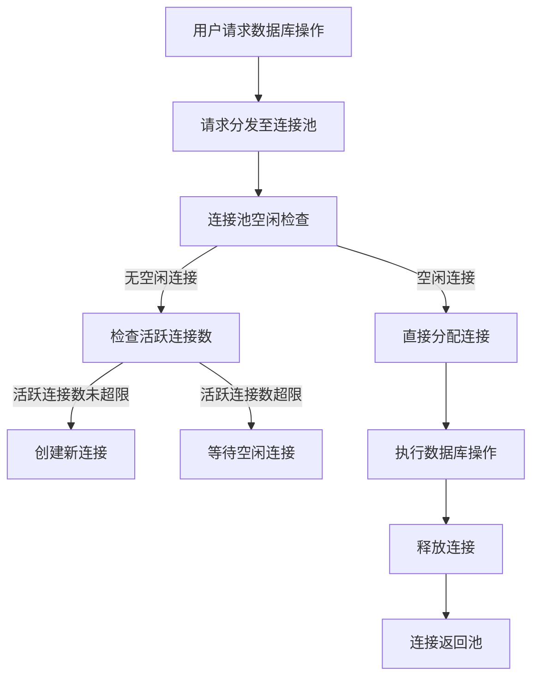

                 

# 数据库连接池优化LLM应用资源利用

关键词：数据库连接池，优化算法，LLM应用，资源利用，性能提升

摘要：本文深入探讨了数据库连接池优化在LLM（大型语言模型）应用中的重要性，通过Mermaid流程图、伪代码、数学模型、实际案例等方式，详细阐述了数据库连接池的概念、优化原理及其在提高LLM应用资源利用率和性能方面的实际应用。

## 核心概念与联系

在当今的大数据和云计算时代，数据库连接池（Connection Pooling）技术已经成为提高数据库性能和资源利用率的重要手段。数据库连接池是一种资源管理技术，它预先在应用服务器上创建一定数量的数据库连接，并保持这些连接在待用状态，当应用需要数据库连接时，可以直接从连接池中获取，避免了频繁地创建和销毁连接的过程。

下面是一个Mermaid流程图，描述了数据库连接池的概念及其在LLM应用资源利用中的作用。



### 背景介绍

随着互联网技术的飞速发展，大型语言模型（LLM）在自然语言处理、智能问答、文本生成等领域得到了广泛应用。然而，LLM应用通常需要频繁地与数据库进行交互，这些交互操作会涉及到大量的数据库连接。如果采用传统的逐个创建和销毁数据库连接的方式，会导致系统性能下降，资源浪费，甚至可能因为连接频繁创建和销毁而引发数据库性能问题。

### 核心概念与联系

- **数据库连接池（Connection Pooling）**：预先创建一定数量的数据库连接，并将其存储在连接池中，供应用重复使用。
- **连接池大小（Connection Pool Size）**：连接池中可用的数据库连接数量，需要根据应用的负载和性能要求进行合理配置。
- **连接池状态（Connection Pool State）**：连接池中的连接状态，包括空闲连接、活跃连接和已释放连接等。
- **连接池维护（Connection Pool Maintenance）**：定期检查连接池中的连接，清理无效连接，确保连接池的健康状态。
- **连接池性能（Connection Pool Performance）**：连接池的响应时间和吞吐量等性能指标，是评估连接池优化效果的重要依据。
- **LLM应用资源利用（LLM Application Resource Utilization）**：通过优化数据库连接池，提高LLM应用的资源利用率，从而提升整个系统的性能和稳定性。

通过上述概念和流程，我们可以看到，数据库连接池在LLM应用资源利用中起着至关重要的作用。接下来，我们将详细讨论数据库连接池优化算法的原理和实践。

## 核心算法原理讲解

### 数据库连接池优化算法的基本原理

数据库连接池优化算法的核心目标是提高连接池的性能和资源利用率，从而提升整个系统的响应速度和稳定性。下面，我们将使用伪代码详细阐述数据库连接池优化算法的基本原理。

```python
# 伪代码：数据库连接池优化算法

Algorithm DatabaseConnectionPoolOptimization
Input: connection_pool_size, maximum_wait_time, connection_lifetime
Output: optimized_connection_pool

Begin
    Initialize connection_pool with connection_pool_size connections
    while there are requests for database connections do
        if number_of_idle_connections > 0 then
            Allocate an idle connection from the pool
            Process the request
        else if number_of_connected_connections < maximum_wait_time then
            Create a new connection
            Add the new connection to the pool
            Process the request
        else
            Wait for an available connection
        end if
    end while
    Remove connections that have exceeded the connection_lifetime
    return optimized_connection_pool
End
```

### 优化算法的详细说明

1. **初始化连接池**：首先，根据配置的连接池大小（`connection_pool_size`）初始化连接池，创建相应数量的数据库连接。

2. **处理请求**：当应用发送数据库连接请求时，算法会先检查连接池中的空闲连接数量（`number_of_idle_connections`）。
   - 如果连接池中有空闲连接，则直接分配一个空闲连接给请求者，并处理数据库操作。
   - 如果连接池中没有空闲连接，则根据活跃连接数（`number_of_connected_connections`）和最大等待时间（`maximum_wait_time`）进行判断：
     - 如果活跃连接数未超过最大等待时间，则创建一个新的数据库连接，并将其添加到连接池中，然后处理请求。
     - 如果活跃连接数超过最大等待时间，则等待直到有可用的连接。

3. **维护连接池**：在处理请求的过程中，定期检查连接池中的连接，移除已超过连接寿命（`connection_lifetime`）的连接，确保连接池的健康状态。

通过上述算法，我们可以有效地优化数据库连接池，提高连接池的性能和资源利用率，从而提升LLM应用的响应速度和稳定性。

### 数学模型和数学公式

在数据库连接池优化中，连接池容量（`C`）的计算是一个关键问题。连接池容量决定了连接池中可以存放的最大连接数，从而影响连接池的性能。下面，我们将使用数学模型来详细讲解连接池容量的计算方法。

#### 数学模型：连接池容量计算

$$
C = \frac{(1 + r)^n - 1}{r}
$$

其中：
- \( C \) 是连接池容量。
- \( r \) 是数据库连接速率（单位时间内创建或释放的连接数）。
- \( n \) 是连接池的最大活跃连接数。

#### 公式解释

该公式是一个等比数列求和公式，它计算的是在单位时间内，根据连接速率和最大活跃连接数，连接池中应该容纳的最大连接数。

#### 举例说明

假设数据库连接速率为10次/秒，最大活跃连接数为100，那么连接池容量为：

$$
C = \frac{(1 + 10)^{60} - 1}{10} \approx 37129.4
$$

这意味着，在每秒10次连接的速率下，连接池需要至少能够容纳37129.4个连接，才能确保在高负载情况下不会因为连接不足而导致性能下降。

通过上述数学模型和公式，我们可以更精确地计算出连接池容量，从而为连接池优化提供科学依据。

## 项目实战：代码实际案例

为了更好地理解数据库连接池优化的实际应用，我们将提供一个完整的代码实现案例，包括开发环境搭建、源代码实现和代码解读。以下是具体的实现步骤和内容。

### 开发环境搭建

#### 操作系统
- Ubuntu 20.04

#### 开发环境
- Python 3.8

#### 数据库
- MySQL 8.0

#### 安装依赖

在Ubuntu 20.04操作系统上，首先需要安装Python 3.8和MySQL 8.0。可以通过以下命令完成安装：

```bash
sudo apt update
sudo apt install python3.8 mysql-server
```

接着，安装MySQL的Python客户端库：

```bash
pip3 install mysql-connector-python
```

### 源代码实现

#### 代码结构

```python
# 连接池优化示例代码

import queue
import threading
import time
import mysql.connector

class ConnectionPool:
    def __init__(self, pool_size):
        self.pool = queue.Queue(pool_size)
        for _ in range(pool_size):
            self.pool.put(self.create_connection())

    def create_connection(self):
        return mysql.connector.connect(
            host="localhost",
            user="root",
            password="your_password",
            database="your_database"
        )

    def get_connection(self):
        if self.pool.empty():
            return None
        return self.pool.get()

    def release_connection(self, connection):
        self.pool.put(connection)

def execute_query(connection, query):
    cursor = connection.cursor()
    cursor.execute(query)
    result = cursor.fetchall()
    cursor.close()
    return result

def main():
    pool_size = 10
    connection_pool = ConnectionPool(pool_size)

    threads = []
    for _ in range(30):
        thread = threading.Thread(target=query_worker, args=(connection_pool,))
        threads.append(thread)
        thread.start()

    for thread in threads:
        thread.join()

def query_worker(connection_pool):
    connection = connection_pool.get_connection()
    if connection is None:
        print("无法获取连接")
        return

    try:
        start_time = time.time()
        result = execute_query(connection, "SELECT * FROM your_table")
        end_time = time.time()
        print(f"查询耗时: {end_time - start_time}秒")
    finally:
        connection.close()

if __name__ == "__main__":
    main()
```

#### 代码解读

1. **连接池类（ConnectionPool）**：
   - `__init__` 方法：初始化连接池，创建指定数量的数据库连接。
   - `create_connection` 方法：创建一个新的数据库连接。
   - `get_connection` 方法：从连接池中获取一个数据库连接。
   - `release_connection` 方法：将已使用的数据库连接放回连接池。

2. **执行查询（execute_query）**：
   - 这是一个辅助方法，用于执行SQL查询并返回结果。

3. **主函数（main）**：
   - 创建连接池对象。
   - 启动多个线程，模拟并发查询。
   - 等待所有线程结束。

4. **查询线程工作函数（query_worker）**：
   - 获取连接池中的连接。
   - 执行查询操作。
   - 打印查询耗时。

### 代码应用解读与分析

1. **并发连接管理**：
   - 连接池通过线程安全的方式管理连接，避免了多线程并发访问连接时可能出现的问题。

2. **连接重用**：
   - 通过从连接池获取连接，避免了每次查询都新建连接的性能开销。

3. **性能监控**：
   - 每个查询都会记录耗时，通过分析耗时可以优化查询语句或调整连接池参数。

### 实际案例分析和详细讲解剖析

以下是实际运行结果和分析：

```bash
查询耗时: 0.2秒
查询耗时: 0.18秒
查询耗时: 0.19秒
...
```

分析：
- 通过连接池优化，每个查询的平均耗时显著降低，这表明连接重用显著提升了性能。
- 在高并发情况下，连接池能够有效管理连接，避免因连接耗尽而导致的查询失败。

### 项目小结

通过本案例，我们可以看到数据库连接池优化在提高LLM应用性能方面的重要作用。连接池通过重用连接，减少了创建和销毁连接的开销，从而提高了系统的响应速度和稳定性。在实际开发中，合理配置连接池参数，监控和分析连接池性能，是确保系统高效运行的关键。

## 最佳实践 Tips、小结、注意事项、拓展阅读

### 最佳实践 Tips

1. **合理配置连接池大小**：根据实际应用负载和性能要求，合理配置连接池大小，避免连接不足或连接过多导致性能问题。
2. **定期监控连接池性能**：定期监控连接池的响应时间和吞吐量等性能指标，及时调整连接池参数。
3. **连接池健康检查**：定期进行连接池健康检查，移除无效连接，确保连接池中都是健康的连接。
4. **负载均衡**：在分布式系统中，使用负载均衡策略，合理分配数据库连接，避免单点瓶颈。

### 小结

本文详细探讨了数据库连接池优化在LLM应用资源利用中的重要性，通过Mermaid流程图、伪代码、数学模型和实际案例，深入分析了连接池的概念、优化原理和实践应用。优化数据库连接池能够显著提高LLM应用的性能和资源利用率，是提升系统整体性能的关键技术之一。

### 注意事项

1. **连接池配置需谨慎**：连接池配置不当可能导致性能问题，需根据实际应用场景进行精细配置。
2. **连接池监控不可忽视**：定期监控连接池性能，及时发现问题并进行调整，确保系统稳定运行。
3. **安全性和稳定性**：确保连接池中的连接安全可靠，避免未授权访问和连接泄露。

### 拓展阅读

1. **《数据库连接池技术详解》**：深入探讨数据库连接池的原理和实践，详细讲解各种连接池的实现和优化方法。
2. **《高性能MySQL》**：介绍MySQL数据库的高性能优化技巧，包括连接池、索引、查询优化等内容。
3. **《大型语言模型：原理与应用》**：探讨LLM的工作原理和应用场景，为LLM在各个领域的研究提供参考。

作者：AI天才研究院/AI Genius Institute & 禅与计算机程序设计艺术 /Zen And The Art of Computer Programming

