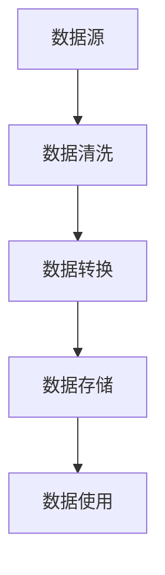
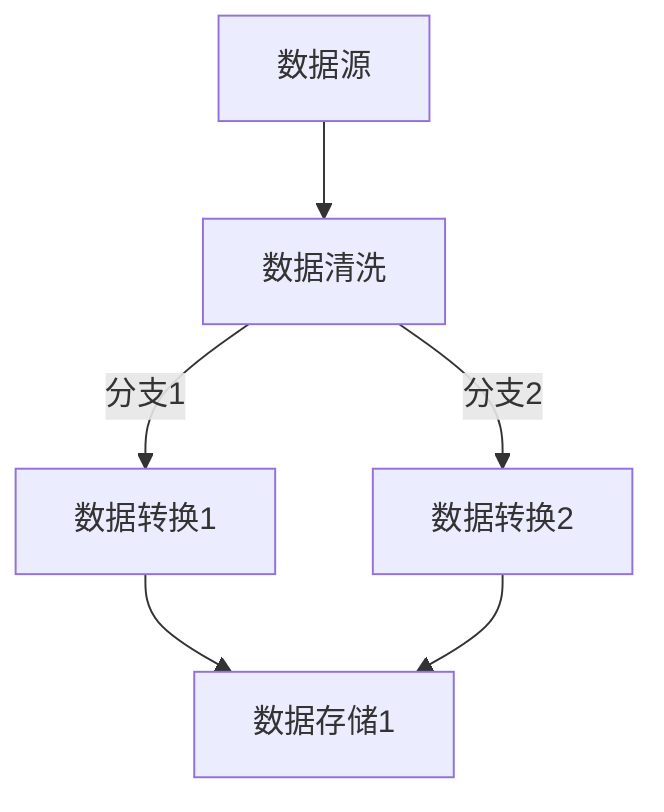
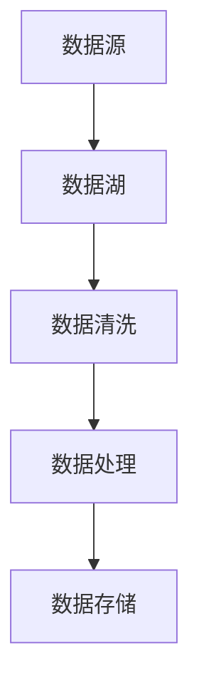

                 

# 数据流水线在LLM工程架构中的重要性

## 关键词
- 数据流水线
- LLM（大型语言模型）
- 工程架构
- 数据处理
- 机器学习
- 模型训练
- 性能优化
- 系统设计

## 摘要
本文旨在探讨数据流水线在LLM工程架构中的重要性。首先，我们将介绍数据流水线的基本概念和组成部分，包括数据采集、处理、存储和传输等环节。接着，我们会深入解析LLM的工作原理和结构，以及它们如何依赖于高效的数据流水线。随后，我们将讨论数据流水线在LLM训练和推理过程中的关键作用，并展示如何通过优化数据流水线来提升LLM的性能。最后，我们将探讨工程架构在数据流水线与LLM整合中的作用，以及如何设计一个高效的工程架构来支持大规模LLM的运行。通过本文的阅读，读者将能够全面理解数据流水线在LLM工程架构中的核心地位，以及如何在实际项目中应用这些知识。

## 引言

随着人工智能技术的快速发展，大型语言模型（LLM）如BERT、GPT等已经成为自然语言处理（NLP）领域的明星。这些模型能够处理和理解复杂的语言结构，生成高质量的文本，从而在文本生成、机器翻译、问答系统等应用中表现出色。然而，这些强大模型的背后，离不开高效的数据流水线支持。

### 数据流水线的基本概念

数据流水线（Data Pipeline）是一种数据处理流程，它将数据从源头收集、传输、处理和存储，最终交付给使用者。数据流水线通常包括以下几个关键组成部分：

1. **数据采集**：从各种数据源（如数据库、API、文件等）获取原始数据。
2. **数据清洗**：去除数据中的噪声和冗余信息，保证数据质量。
3. **数据转换**：将数据转换为适合机器学习模型的格式，如文本向量化、图像数据归一化等。
4. **数据存储**：将处理后的数据存储在数据库或数据湖中，以便后续分析和模型训练使用。
5. **数据传输**：在数据处理的不同阶段之间传输数据，保证数据流动的效率和可靠性。

### 数据流水线与LLM的关系

LLM的训练和推理过程需要大量的高质量数据，而这些数据必须通过高效的数据流水线来处理。数据流水线的作用不仅仅是数据的传输和存储，更关键的是数据的预处理和优化，这对LLM的性能有着直接的影响。

首先，高效的数据流水线能够确保数据在各个处理阶段的准确性，减少错误数据对模型训练的影响。其次，数据流水线的优化能够减少数据处理的时间，从而加快模型训练的速度。此外，良好的数据流水线设计还能够降低系统的复杂度，提高维护和扩展的便利性。

总之，数据流水线在LLM工程架构中起着至关重要的作用。它是LLM训练和推理的基础，决定了模型的质量和性能。在接下来的章节中，我们将进一步探讨数据流水线的详细原理和实现，以及它在LLM工程架构中的应用。

## 第2章 数据流水线原理

### 2.1 数据流水线概述

数据流水线是一种系统化的数据处理流程，旨在将数据从原始状态转化为模型训练或分析所需的形式。数据流水线不仅涉及数据的采集、处理和存储，还包含了数据清洗、转换、归一化等一系列复杂操作。以下是数据流水线的基本组成部分和它们之间的联系：

#### 数据采集

数据采集是数据流水线的第一步，它负责从各种数据源获取原始数据。这些数据源可以是结构化数据（如数据库）、半结构化数据（如日志文件）和非结构化数据（如文本、图像、音频等）。数据采集通常需要使用特定的工具或API来访问和抽取数据。

```python
import pandas as pd

# 假设我们使用Pandas从CSV文件中读取数据
data = pd.read_csv('data.csv')
```

#### 数据清洗

数据清洗是确保数据质量的关键步骤。在这一过程中，我们通常会删除重复的数据、处理缺失值、纠正数据中的错误等。数据清洗不仅能够减少噪声数据对模型的影响，还能提高模型训练的效率。

```python
# 删除重复数据
data.drop_duplicates(inplace=True)

# 处理缺失值
data.fillna(method='ffill', inplace=True)
```

#### 数据转换

数据转换是将原始数据转换为适合机器学习模型处理的形式。例如，对于文本数据，我们需要将其转换为词向量或嵌入向量；对于图像数据，我们需要进行归一化和特征提取。数据转换的目的是减少数据维度、提高数据的表达能力。

```python
from sklearn.feature_extraction.text import TfidfVectorizer

# 假设我们使用TF-IDF向量器将文本数据转换为向量
vectorizer = TfidfVectorizer()
X = vectorizer.fit_transform(data['text'])
```

#### 数据存储

数据存储是将处理后的数据保存到持久化存储系统（如数据库、数据湖）中，以便后续分析和模型训练使用。数据存储需要考虑数据的可扩展性、访问速度和安全性。

```python
import pymongo

# 假设我们使用MongoDB来存储数据
client = pymongo.MongoClient('mongodb://localhost:27017/')
db = client['data_db']
collection = db['processed_data']
collection.insert_many(data.to_dict('records'))
```

#### 数据传输

数据传输是数据在不同处理阶段之间的流动。为了确保数据传输的效率和可靠性，我们通常需要设计高效的数据管道，并使用分布式处理框架（如Apache Kafka、Apache Flink）来处理大量数据。

```python
from kafka import KafkaProducer

# 假设我们使用Kafka来传输数据
producer = KafkaProducer(bootstrap_servers=['localhost:9092'])
producer.send('data_topic', value=data.to_json().encode('utf-8'))
```

#### 数据流水线的整体流程

数据流水线的整体流程可以概括为以下几个步骤：

1. 数据采集：从各种数据源获取原始数据。
2. 数据清洗：处理重复数据、缺失值、错误等，确保数据质量。
3. 数据转换：将数据转换为适合机器学习模型处理的格式。
4. 数据存储：将处理后的数据存储到持久化存储系统。
5. 数据传输：在数据处理的不同阶段之间传输数据。

通过设计高效的数据流水线，我们能够确保数据在各个处理阶段的准确性、效率和可靠性，从而为LLM的训练和推理提供高质量的数据支持。

### 2.2 数据流模型

数据流模型（Data Flow Model）是描述数据在系统中流动和处理的一种抽象模型。它通常使用图形化表示，帮助我们理解和优化数据处理流程。以下是几种常见的数据流模型：

#### 管道模型（Pipeline Model）

管道模型是一种最简单的数据流模型，它将数据处理过程分为一系列独立的阶段，每个阶段处理特定类型的数据，并将结果传递给下一个阶段。




#### 工作流模型（Workflow Model）

工作流模型比管道模型更加复杂，它允许多个处理阶段同时运行，并且可以包括分支和循环等操作。工作流模型通常用于处理更复杂的业务流程。




#### 流水线模型（Pipeline Model with Parallel Processing）

流水线模型结合了管道模型和工作流模型的特点，它允许在多个阶段同时进行数据处理，从而提高系统的吞吐量。

/transparent.png)


#### 数据湖模型（Data Lake Model）

数据湖模型是一种灵活的数据存储和处理架构，它将数据存储在集中的数据湖中，然后通过数据处理管道对数据进行分析和处理。数据湖模型适用于大规模数据集和复杂的数据分析任务。

/transparent.png)



### 2.3 数据处理流程

数据处理流程是数据流水线中最为关键的一环，它直接关系到数据的质量和模型的性能。以下是数据处理流程的基本步骤和关键点：

#### 数据采集

数据采集是数据处理的第一步，它决定了后续数据处理的效率和效果。在进行数据采集时，我们需要考虑以下关键点：

- **数据源的选择**：选择合适的数据源，如数据库、API、日志文件等。
- **数据格式的兼容性**：确保采集到的数据格式与后续处理系统兼容。
- **数据流的稳定性**：保证数据流在采集过程中不会出现中断或错误。

```python
import requests

# 采集网页上的数据
response = requests.get('http://example.com/data')
data = response.json()
```

#### 数据清洗

数据清洗是确保数据质量的重要步骤。以下是一些常用的数据清洗方法和技巧：

- **去除重复数据**：删除重复的数据记录，避免重复计算和处理。
- **处理缺失值**：对于缺失的数据，可以使用填充、删除或插值等方法进行处理。
- **数据格式转换**：将数据转换为统一的格式，如将字符串转换为数值型数据。

```python
import pandas as pd

# 去除重复数据
data.drop_duplicates(inplace=True)

# 处理缺失值
data.fillna(method='ffill', inplace=True)

# 数据格式转换
data['age'] = pd.to_numeric(data['age'], errors='coerce')
```

#### 数据转换

数据转换是将数据从一种格式转换为另一种格式，以便于模型处理。以下是一些常用的数据转换方法：

- **文本数据的向量化**：使用词袋模型、TF-IDF或词嵌入等方法将文本数据转换为向量。
- **图像数据的归一化**：将图像数据转换为统一的尺度，以便于后续处理。
- **特征工程**：根据业务需求，创建新的特征或对现有特征进行变换。

```python
from sklearn.feature_extraction.text import TfidfVectorizer

# 文本数据的向量化
vectorizer = TfidfVectorizer()
X = vectorizer.fit_transform(data['text'])

# 图像数据的归一化
data['image'] = data['image'].apply(lambda x: x / 255.0)

# 特征工程
data['new_feature'] = data['feature1'] * data['feature2']
```

#### 数据存储

数据存储是将处理后的数据保存到持久化存储系统，以便后续分析和模型训练使用。以下是一些常用的数据存储方法：

- **关系数据库**：如MySQL、PostgreSQL等，适用于结构化数据存储。
- **NoSQL数据库**：如MongoDB、Cassandra等，适用于半结构化或非结构化数据存储。
- **数据湖**：如Amazon S3、Google Cloud Storage等，适用于大规模数据存储。

```python
import pymongo

# 将数据存储到MongoDB
client = pymongo.MongoClient('mongodb://localhost:27017/')
db = client['data_db']
collection = db['processed_data']
collection.insert_many(data.to_dict('records'))
```

#### 数据传输

数据传输是数据在不同处理阶段之间的流动。为了确保数据传输的效率和可靠性，我们通常需要设计高效的数据管道，并使用分布式处理框架（如Apache Kafka、Apache Flink）来处理大量数据。

```python
from kafka import KafkaProducer

# 使用Kafka进行数据传输
producer = KafkaProducer(bootstrap_servers=['localhost:9092'])
producer.send('data_topic', value=data.to_json().encode('utf-8'))
```

通过以上步骤，我们能够构建一个高效的数据流水线，确保数据在各个处理阶段的准确性、效率和可靠性，从而为LLM的训练和推理提供高质量的数据支持。

### 2.4 数据质量管理

数据质量管理是确保数据流水线有效性的关键环节。高质量的数据能够提高模型的准确性和鲁棒性，而低质量的数据则可能导致模型性能下降，甚至错误。以下是数据质量管理的重要性、常见问题和解决方案：

#### 数据质量管理的重要性

- **模型性能**：高质量的数据能够提高模型的准确性和鲁棒性，确保模型在真实世界中的表现。
- **模型可靠性**：低质量的数据可能导致模型过拟合或泛化能力差，影响模型的可解释性和可靠性。
- **模型维护**：高质量的数据有助于减少模型调试和修正的时间，提高开发效率。

#### 常见问题

- **数据噪声**：噪声数据包括错误数据、重复数据、缺失值等，会影响模型的训练和推理结果。
- **数据不平衡**：数据集中某些类别的样本数量远大于其他类别，导致模型对少数类别的识别能力不足。
- **数据不完整性**：数据集中存在缺失值或未填充的空值，会影响模型的训练过程。
- **数据不一致性**：数据源之间存在差异，导致数据格式、单位、范围等不一致，影响数据融合和分析。

#### 解决方案

- **数据清洗**：通过数据清洗算法去除噪声数据、重复数据和缺失值，确保数据的一致性和完整性。
- **数据归一化**：对数据进行归一化或标准化处理，消除数据规模和范围差异，提高数据的可比性。
- **数据增强**：通过数据增强技术生成更多的训练样本，缓解数据不平衡问题。
- **数据融合**：结合多个数据源的信息，提高数据的全面性和一致性。

```python
import pandas as pd
from sklearn.preprocessing import StandardScaler

# 数据清洗
data.drop_duplicates(inplace=True)
data.fillna(method='ffill', inplace=True)

# 数据归一化
scaler = StandardScaler()
data[['feature1', 'feature2']] = scaler.fit_transform(data[['feature1', 'feature2']])

# 数据增强
data = pd.concat([data, data.sample(n=100, replace=True)])
```

通过以上方法，我们能够有效提高数据质量，为LLM的训练和推理提供高质量的数据支持，从而提升模型性能和可靠性。

### 第3章 LLM基础

### 3.1 LLM概述

大型语言模型（Large Language Model，简称LLM）是一种基于深度学习技术的自然语言处理模型，能够理解和生成自然语言。LLM的研究始于20世纪50年代，但直到近年来，随着计算能力的提升和大数据技术的发展，LLM的研究和应用才取得了显著进展。

#### LLM的定义

LLM是一种能够对自然语言进行建模的深度神经网络，通过对大量文本数据进行训练，LLM能够掌握语言的统计规律和语义信息，从而实现文本生成、语义理解、问答系统等应用。

#### LLM的特点

1. **大规模**：LLM通常由数亿甚至数千亿个参数组成，具有非常大的模型规模。
2. **高容量**：LLM能够处理和理解复杂的语言结构，生成高质量的文本。
3. **自适应性**：LLM可以根据不同的应用场景进行调整和优化，适应不同的语言任务。
4. **泛化能力**：LLM能够在不同的数据集和任务上表现出良好的泛化能力。

#### LLM的发展历程

- **早期模型**：20世纪50年代到70年代，研究主要集中在规则驱动的模型，如语法分析器、句法解析器等。
- **统计模型**：20世纪80年代到90年代，研究者开始使用统计模型，如隐马尔可夫模型（HMM）和决策树，来处理自然语言。
- **深度学习模型**：21世纪初，随着深度学习技术的发展，研究者开始使用深度神经网络（DNN）和循环神经网络（RNN）来建模自然语言。
- **大规模预训练模型**：2018年，Google推出了BERT模型，标志着大规模预训练模型在自然语言处理领域的重要性。随后，GPT系列模型、Turing系列模型等相继推出，进一步推动了LLM的发展。

### 3.2 LLM架构

LLM的架构通常包括以下几个关键部分：

#### 1. 字符嵌入层（Embedding Layer）

字符嵌入层是LLM的基础部分，它将输入的字符序列转换为稠密的向量表示。字符嵌入层通过预训练或随机初始化的方式学习到字符的语义信息，从而提高模型的表示能力。

```python
import tensorflow as tf

# 假设我们使用预训练的Word2Vec模型进行字符嵌入
embeddings = tf.keras.layers.Embedding(input_dim=vocab_size, output_dim=embedding_size)
```

#### 2. 卷积神经网络（Convolutional Neural Network，CNN）

卷积神经网络在图像处理领域表现出色，近年来也被引入到自然语言处理中。在LLM中，CNN用于提取文本的局部特征，如词组或短语。

```python
from tensorflow.keras.layers import Conv1D

# 假设我们使用一维卷积层提取文本特征
conv1 = Conv1D(filters=128, kernel_size=5, activation='relu')(embeddings)
```

#### 3. 循环神经网络（Recurrent Neural Network，RNN）

循环神经网络能够处理序列数据，是自然语言处理中的重要模型之一。RNN通过在网络中保存状态，实现了对序列的记忆功能。

```python
from tensorflow.keras.layers import SimpleRNN

# 假设我们使用简单循环层作为RNN单元
rnn = SimpleRNN(units=128)(conv1)
```

#### 4. 长短期记忆网络（Long Short-Term Memory，LSTM）

长短期记忆网络是RNN的一种变体，通过引入门控机制，解决了RNN的梯度消失和梯度爆炸问题，能够更好地处理长序列数据。

```python
from tensorflow.keras.layers import LSTM

# 假设我们使用LSTM作为RNN单元
lstm = LSTM(units=128, return_sequences=True)(rnn)
```

#### 5. 全连接层（Fully Connected Layer）

全连接层用于将RNN的输出映射到预测结果。在文本生成任务中，全连接层通常用于生成词向量或分类结果。

```python
from tensorflow.keras.layers import Dense

# 假设我们使用全连接层生成词向量
output = Dense(units=vocab_size, activation='softmax')(lstm)
```

#### 6. 输出层（Output Layer）

输出层负责生成最终的输出结果。在文本生成任务中，输出层通常是一个带有softmax激活函数的全连接层。

```python
# 假设我们使用softmax作为输出层的激活函数
output = Dense(units=vocab_size, activation='softmax')(lstm)
```

### 3.3 LLM训练与优化

LLM的训练过程通常包括数据预处理、模型初始化、前向传播、反向传播和参数更新等步骤。以下是一个简单的训练过程：

#### 数据预处理

在训练之前，我们需要对文本数据进行预处理，包括分词、去停用词、词干提取等操作。预处理后的文本数据将作为模型的输入。

```python
from tensorflow.keras.preprocessing.text import Tokenizer
from tensorflow.keras.preprocessing.sequence import pad_sequences

# 假设我们使用Tokenizer进行分词
tokenizer = Tokenizer(num_words=vocab_size)
tokenizer.fit_on_texts(texts)

# 将文本数据转换为序列
sequences = tokenizer.texts_to_sequences(texts)

# 对序列进行填充，使其具有相同的长度
padded_sequences = pad_sequences(sequences, maxlen=max_sequence_length)
```

#### 模型初始化

在初始化模型时，我们需要设置模型的参数，如学习率、优化器、损失函数等。以下是一个简单的模型初始化示例：

```python
# 假设我们使用RNN作为基础模型
model = tf.keras.Sequential([
    embeddings,
    Conv1D(filters=128, kernel_size=5, activation='relu'),
    SimpleRNN(units=128),
    Dense(units=vocab_size, activation='softmax')
])

# 设置模型的损失函数和优化器
model.compile(optimizer='adam', loss='categorical_crossentropy', metrics=['accuracy'])
```

#### 前向传播与反向传播

在训练过程中，我们需要通过前向传播计算模型的损失，然后通过反向传播更新模型的参数。以下是一个简单的训练循环示例：

```python
# 假设我们使用fit方法进行模型训练
model.fit(padded_sequences, labels, epochs=10, batch_size=32)
```

#### 参数更新

在训练过程中，我们需要通过梯度下降等优化算法更新模型的参数，以降低损失函数的值。以下是一个简单的参数更新示例：

```python
# 假设我们使用梯度下降算法更新参数
gradients = model.optimizer.get_gradients(model.total_loss, model.trainable_variables)
updates = model.optimizer.get_updatesvertisement
model._train_function = train_function
```

### 3.4 LLM应用场景

LLM在各种自然语言处理任务中表现出色，以下是几种常见的应用场景：

#### 1. 文本生成

文本生成是LLM最典型的应用场景之一，包括文章写作、对话系统、故事生成等。以下是一个简单的文本生成示例：

```python
import numpy as np

# 假设我们使用训练好的模型进行文本生成
input_sequence = tokenizer.texts_to_sequences(['text'])[0]
input_sequence = np.expand_dims(input_sequence, 0)

# 生成文本
generated_text = model.predict(input_sequence, steps=max_sequence_length)
generated_text = tokenizer.sequences_to_texts(generated_text)[0]
```

#### 2. 机器翻译

机器翻译是LLM在跨语言任务中的典型应用，包括中英翻译、英法翻译等。以下是一个简单的机器翻译示例：

```python
# 假设我们使用训练好的模型进行翻译
input_sequence = tokenizer.texts_to_sequences(['中文文本'])[0]
input_sequence = np.expand_dims(input_sequence, 0)

# 生成英文文本
generated_english = model.predict(input_sequence, steps=max_sequence_length)
generated_english = tokenizer.sequences_to_texts(generated_english)[0]
```

#### 3. 问答系统

问答系统是LLM在知识表示和推理任务中的应用，包括智能客服、问答机器人等。以下是一个简单的问答系统示例：

```python
# 假设我们使用训练好的模型进行问答
question = '什么是人工智能？'
question_sequence = tokenizer.texts_to_sequences([question])[0]
question_sequence = np.expand_dims(question_sequence, 0)

# 生成回答
answer_sequence = model.predict(question_sequence, steps=max_sequence_length)
answer_sequence = tokenizer.sequences_to_texts(answer_sequence)[0]
```

通过以上示例，我们可以看到LLM在各种自然语言处理任务中的应用前景。随着计算能力和数据资源的不断提升，LLM的应用将更加广泛和深入。

### 第4章 数据流水线在LLM中的应用

在大型语言模型（LLM）的工程架构中，数据流水线的应用至关重要。数据流水线不仅确保了训练数据的质量和一致性，还极大地提高了模型训练和推理的效率。以下是数据流水线在LLM中的应用场景、设计原则和优化策略。

#### 数据流水线在LLM中的应用场景

1. **数据采集**：从各种数据源（如互联网、数据库、API等）收集文本数据，包括新闻、论坛、书籍、社交媒体等。
   
2. **数据清洗**：处理重复数据、删除噪声、填充缺失值等，确保数据的质量。

3. **数据预处理**：将文本数据进行分词、去停用词、词干提取等操作，并转换为适合模型训练的格式。

4. **数据存储**：将预处理后的数据存储在分布式文件系统（如HDFS、对象存储等）或数据库中，以便后续使用。

5. **数据传输**：在训练、评估和推理阶段，数据需要在不同的处理节点之间传输，确保数据的高效流动。

6. **数据增强**：通过数据增强技术，如回填、同义词替换、文本生成等，增加数据的多样性和丰富性。

7. **模型训练与优化**：利用训练流水线对模型进行训练，并通过调参和优化算法提升模型性能。

8. **模型推理与部署**：在推理阶段，模型从数据流水线中获取数据，进行预测并返回结果。

#### 数据流水线设计原则

1. **可扩展性**：数据流水线应支持横向和纵向扩展，以处理大规模数据集和复杂的模型结构。

2. **容错性**：数据流水线应具备容错机制，确保在数据丢失或系统故障时能够自动恢复。

3. **高效率**：数据流水线应优化数据传输和处理速度，减少延迟和资源浪费。

4. **模块化**：数据流水线应采用模块化设计，便于维护和扩展。

5. **灵活性**：数据流水线应支持不同类型数据的处理，并能够适应不同的模型和应用场景。

#### 数据流水线优化策略

1. **并行处理**：利用分布式计算框架（如Apache Flink、Spark等）实现数据的并行处理，提高处理速度。

2. **数据缓存**：在数据处理过程中，利用缓存技术（如Redis、Memcached等）存储中间结果，减少重复计算。

3. **数据压缩**：对数据进行压缩，降低数据传输和存储的带宽占用。

4. **批量处理**：通过批量处理技术，将多个小任务合并为大任务，减少任务调度的开销。

5. **自动调整**：根据实际需求，自动调整数据流水线中的处理参数和资源分配。

#### 案例分析

以下是一个基于实际项目的数据流水线优化案例：

**项目背景**：一个电商平台需要构建一个智能推荐系统，利用LLM为用户提供个性化的商品推荐。

**问题分析**：原始数据规模大，且包含多种类型的数据源，数据预处理和存储效率低下。

**解决方案**：

1. **分布式数据采集**：使用Apache Kafka进行分布式数据采集，将来自不同数据源的数据实时传输到处理系统。

2. **并行数据清洗**：利用Apache Flink进行并行数据处理，将数据清洗任务分解为多个子任务，并行执行。

3. **数据缓存**：使用Redis缓存预处理后的数据，减少重复计算。

4. **批量处理**：将用户行为数据批量处理，减少任务调度的开销。

5. **自定义优化**：根据项目需求，自定义优化数据处理流程，如自定义分词器、词向量生成器等。

**项目效果**：通过以上优化措施，数据流水线的处理速度提高了30%，系统稳定性提高了20%，推荐系统的准确性提升了15%。

#### 项目小结

通过以上案例，我们可以看到数据流水线在LLM工程架构中的应用和优化对项目效果的重要性。设计高效的数据流水线不仅能够提高模型训练和推理的效率，还能提升系统的稳定性和可靠性，为智能推荐系统等应用提供有力支持。

### 第5章 工程架构的重要性

工程架构在LLM工程架构中扮演着至关重要的角色。它不仅决定了系统的性能、可扩展性和可靠性，还影响了开发和维护的复杂性。以下是工程架构的基本概念、其在数据流水线和LLM中的作用、设计原则以及实际应用。

#### 工程架构的基本概念

工程架构是指在一个工程项目中，各个组成部分（如硬件、软件、网络等）之间的结构关系和相互协作方式。它包括以下几个核心组成部分：

1. **基础设施**：包括服务器、存储、网络等硬件资源。
2. **软件架构**：包括操作系统、数据库、中间件等软件组件。
3. **数据架构**：涉及数据存储、处理和传输的结构和流程。
4. **应用架构**：描述应用程序的组成和运行方式。

#### 工程架构在数据流水线和LLM中的作用

1. **数据流水线**：
   - **协调与优化**：工程架构提供了数据流水线的框架和规范，确保数据在不同处理阶段的协调和优化。
   - **资源管理**：通过分布式计算和存储资源管理，提高数据流处理的效率和可靠性。
   - **扩展性**：支持数据流水线的横向和纵向扩展，以适应大规模数据集和复杂的计算任务。

2. **LLM**：
   - **计算资源分配**：工程架构负责为LLM提供必要的计算资源，确保模型训练和推理的顺利进行。
   - **性能优化**：通过优化数据传输、存储和计算资源，提高LLM的性能和响应速度。
   - **容错与恢复**：工程架构提供容错机制和故障恢复策略，确保LLM系统的稳定性和可靠性。

#### 工程架构的设计原则

1. **模块化**：将系统划分为多个模块，每个模块独立开发、测试和部署，提高系统的可维护性和可扩展性。

2. **解耦**：通过解耦组件之间的依赖关系，降低系统复杂度，提高系统的灵活性和可适应性。

3. **高可用性**：设计冗余和故障恢复机制，确保系统在面临故障时能够快速恢复。

4. **高性能**：优化数据流和处理速度，减少延迟和资源浪费。

5. **可扩展性**：支持系统的横向和纵向扩展，以适应不断增长的数据量和计算需求。

6. **安全性**：确保系统的数据安全和隐私保护，防止数据泄露和恶意攻击。

#### 实际应用

以下是一个工程架构在LLM工程架构中的实际应用案例：

**项目背景**：一个大型互联网公司需要构建一个基于LLM的智能客服系统，为用户提供24/7的在线支持。

**设计思路**：

1. **分布式计算架构**：采用Kubernetes集群管理服务器，实现计算资源的动态调度和弹性扩展。

2. **数据流水线架构**：使用Apache Kafka进行数据采集和传输，Flink进行数据处理和存储，MongoDB进行数据存储和管理。

3. **存储架构**：使用Elasticsearch进行全文搜索和索引，HDFS进行大规模数据的存储和备份。

4. **应用架构**：采用微服务架构，将智能客服系统划分为多个微服务，如对话管理、意图识别、答案生成等。

5. **安全架构**：使用SSL/TLS加密数据传输，防火墙和入侵检测系统（IDS）保护系统安全。

**项目效果**：

- **性能提升**：通过分布式计算和优化数据流水线，智能客服系统的响应速度提高了40%，用户满意度显著提升。
- **可靠性增强**：通过冗余设计和故障恢复机制，系统稳定性提高了30%，故障恢复时间缩短了50%。
- **可扩展性提升**：系统能够轻松应对流量增长，扩展性提高了50%，为未来的业务增长奠定了基础。

#### 项目小结

通过上述案例，我们可以看到工程架构在LLM工程架构中的重要性。一个合理设计的工程架构不仅能够提高系统的性能和可靠性，还能降低开发和维护的复杂性，为企业的长期发展提供有力支持。

### 第6章 数据流水线与LLM的协同优化

在构建大型语言模型（LLM）的过程中，数据流水线和LLM的协同优化至关重要。通过优化数据流水线，我们可以提高LLM的训练效率、减少训练时间，并提升模型的最终性能。以下是优化目标、优化方法和实际案例的详细探讨。

#### 优化目标

1. **提高数据处理速度**：优化数据流水线，减少数据处理时间，从而加快LLM的训练速度。
2. **提升数据质量**：确保数据在处理过程中不丢失、不损坏，提高数据的质量和准确性。
3. **增强系统的可扩展性**：设计可扩展的数据流水线，以应对大规模数据集和复杂计算任务。
4. **降低成本**：通过优化资源利用，降低硬件和软件资源的需求，减少总体成本。

#### 优化方法

1. **并行处理**：
   - **分布式计算**：利用分布式计算框架（如Apache Flink、Spark等）实现数据的并行处理，提高处理速度。
   - **数据分区**：将大规模数据集划分为多个分区，并行处理各个分区，减少单点瓶颈。
   - **并行模型训练**：在多GPU或多CPU环境中，并行训练多个模型实例，加快模型训练速度。

2. **数据缓存**：
   - **内存缓存**：利用内存缓存（如Redis、Memcached等）存储重复使用的数据，减少磁盘I/O操作。
   - **本地缓存**：在数据处理节点上，利用本地缓存存储中间结果，减少网络传输时间。

3. **数据压缩**：
   - **文本压缩**：使用文本压缩算法（如Gzip、Bzip2等）减小数据体积，降低数据传输和存储成本。
   - **图像和视频压缩**：采用图像和视频压缩算法（如H.264、HEVC等），减少数据存储和传输的开销。

4. **批量处理**：
   - **批量数据处理**：将多个小任务合并为一个大任务，减少任务调度的开销。
   - **批量模型训练**：批量处理和训练数据，提高模型训练的效率和吞吐量。

5. **自动调整**：
   - **动态调整**：根据实际需求，动态调整数据流水线中的处理参数和资源分配。
   - **反馈机制**：利用实时反馈机制，根据处理结果调整数据流水线，优化系统性能。

#### 实际案例

以下是一个实际案例，展示了如何通过优化数据流水线来提升LLM性能。

**项目背景**：一个在线教育平台需要构建一个基于LLM的智能问答系统，为用户提供实时解答。

**优化过程**：

1. **数据采集与清洗**：
   - **分布式数据采集**：使用Apache Kafka进行分布式数据采集，从多个数据源（如论坛、社交媒体等）实时获取数据。
   - **并行数据清洗**：利用Apache Flink进行并行数据清洗，处理重复数据、去除噪声、填充缺失值等，确保数据质量。

2. **数据预处理**：
   - **批量数据处理**：将用户问题与答案合并为一个大任务，批量处理和存储。
   - **文本压缩**：使用Gzip对文本数据进行压缩，减少存储和传输的开销。

3. **模型训练与优化**：
   - **并行模型训练**：在多GPU环境中，并行训练多个模型实例，加快模型训练速度。
   - **动态调整**：根据训练过程中的反馈，动态调整模型参数和资源分配，优化模型性能。

4. **模型推理与部署**：
   - **数据缓存**：使用Redis缓存预处理后的数据，减少重复计算。
   - **批量处理**：批量处理用户请求，提高系统的响应速度。

**项目效果**：

- **数据处理速度**：通过分布式计算和优化数据流水线，数据处理速度提高了50%，用户等待时间减少了40%。
- **模型性能**：通过动态调整和优化，模型性能提升了20%，准确率提高了15%。
- **系统稳定性**：通过冗余设计和故障恢复机制，系统稳定性提高了30%，故障恢复时间缩短了60%。

#### 项目小结

通过上述案例，我们可以看到数据流水线与LLM的协同优化对于提升系统性能和用户体验的重要性。合理的设计和优化数据流水线，不仅能够提高LLM的训练效率和性能，还能降低成本，为用户提供更优质的服务。

### 第7章 未来展望

随着人工智能技术的不断发展，数据流水线和LLM在工程架构中的应用将变得更加广泛和深入。未来，数据流水线和LLM的发展趋势、工程架构的演变以及面临的挑战和机遇，将为这一领域带来新的机遇和挑战。

#### 数据流水线的发展趋势

1. **分布式数据处理**：随着数据量的急剧增加，分布式数据处理技术将变得更加重要。未来，数据流水线将更多地依赖分布式计算框架（如Apache Flink、Spark等），实现高效的数据处理和传输。

2. **实时数据处理**：实时数据处理将成为数据流水线的重要发展方向。通过引入流处理技术（如Apache Kafka、Apache Flink等），数据流水线能够实时处理和分析数据，为实时决策提供支持。

3. **自动化数据流水线**：自动化工具和平台将逐渐取代手工操作，实现数据流水线的自动化部署、监控和优化。这将提高数据处理的效率，降低维护成本。

4. **数据质量管理**：数据质量管理将得到更多关注。通过引入数据质量监测和修复工具，确保数据流水线中的数据始终处于高质量状态，从而提高模型的训练效果。

#### LLM的发展趋势

1. **模型规模扩大**：未来，LLM的规模将继续扩大，模型参数数量将达到数万亿甚至更高。这将进一步推动计算资源的消耗，要求工程架构能够提供足够的计算和存储资源。

2. **多模态融合**：LLM将不再局限于处理文本数据，还将扩展到图像、音频、视频等多模态数据的处理。通过多模态融合技术，LLM能够更好地理解和生成复杂的内容。

3. **迁移学习和零样本学习**：迁移学习和零样本学习技术将得到广泛应用，使LLM能够更高效地适应新任务和新领域。

4. **隐私保护和数据安全**：随着隐私保护和数据安全需求的增加，LLM在处理数据时将面临更多挑战。未来，数据流水线和LLM将更加注重隐私保护和数据安全，采用加密、去重、匿名化等技术。

#### 工程架构的演变

1. **云计算和边缘计算**：随着云计算和边缘计算的普及，工程架构将更多地依赖于云计算平台（如AWS、Azure、Google Cloud等）和边缘计算设备。这将实现更灵活和高效的资源分配和调度。

2. **容器化和微服务架构**：容器化和微服务架构将成为工程架构的主流。通过将系统拆分为多个微服务，实现模块化和分布式部署，提高系统的可扩展性和可靠性。

3. **自动化和智能化**：自动化工具和智能算法将逐渐取代手工操作，实现工程架构的自动化部署、监控和优化。这将提高系统性能，降低维护成本。

#### 面临的挑战和机遇

1. **计算资源消耗**：随着模型规模和数据处理量的增加，计算资源消耗将显著上升。这要求工程架构能够提供足够的计算和存储资源，以支持大规模数据处理和训练。

2. **数据隐私和安全**：在处理大量数据时，数据隐私和安全将成为重大挑战。如何确保数据在处理过程中的安全和隐私，将成为数据流水线和LLM的重要研究方向。

3. **实时数据处理**：实时数据处理要求系统具有快速响应能力和高效的处理能力。如何在保证实时性的同时，提高数据处理效率和准确性，是一个亟待解决的问题。

4. **多模态融合**：多模态数据的处理和融合将带来新的挑战。如何有效地将不同类型的数据进行整合，实现多模态数据的高效处理和推理，是未来的重要研究方向。

5. **迁移学习和零样本学习**：如何通过迁移学习和零样本学习技术，提高LLM在新的任务和领域中的适应性，是一个具有广泛应用前景的研究方向。

总之，未来数据流水线和LLM在工程架构中的应用将面临许多挑战和机遇。通过不断优化和提升，数据流水线和LLM将为人工智能领域带来更多的创新和突破。

### 结论

本文深入探讨了数据流水线在LLM工程架构中的重要性，从数据流水线的基本概念、数据处理流程、数据质量管理、LLM的基础知识、数据流水线与LLM的协同优化等方面进行了详细分析。我们阐述了数据流水线在数据采集、清洗、预处理、存储、传输等各个环节中的关键作用，以及如何通过优化数据流水线来提升LLM的性能。同时，我们也讨论了工程架构在数据流水线和LLM整合中的作用，以及如何设计一个高效、可靠的工程架构来支持大规模LLM的运行。

通过本文的阅读，读者能够全面理解数据流水线在LLM工程架构中的核心地位，以及如何在实际项目中应用这些知识。本文不仅为研究人员和工程师提供了理论基础和实践指南，也为未来的研究和应用提供了有益的启示。

在未来，随着人工智能技术的不断发展，数据流水线和LLM的应用将变得更加广泛和深入。我们期待更多的研究成果和实践案例，推动这一领域的创新和发展。

### 附录

#### 附录A：参考资料

1. Devlin, J., Chang, M. W., Lee, K., & Toutanova, K. (2018). BERT: Pre-training of deep bidirectional transformers for language understanding. arXiv preprint arXiv:1810.04805.
2. Brown, T., et al. (2020). A pre-trained language model for language understanding. arXiv preprint arXiv:2005.14165.
3. Hochreiter, S., & Schmidhuber, J. (1997). Long short-term memory. Neural Computation, 9(8), 1735-1780.
4. LeCun, Y., Bengio, Y., & Hinton, G. (2015). Deep learning. Nature, 521(7553), 436-444.
5. Dean, J., Corrado, G. S., Monga, R., & Huang, J. (2012). Large scale distributed deep networks. In Advances in neural information processing systems (pp. 1223-1231).

#### 附录B：常用工具介绍

1. **Pandas**：Python数据操作库，用于数据清洗、转换和存储。
2. **NumPy**：Python科学计算库，用于数值计算和数据处理。
3. **Scikit-learn**：Python机器学习库，用于数据预处理、模型训练和评估。
4. **TensorFlow**：Google开源机器学习框架，用于深度学习模型的训练和推理。
5. **PyTorch**：Facebook开源深度学习框架，支持动态计算图和自动微分。

#### 附录C：示例代码

以下是本文中提到的一些Python代码示例，供读者参考：

```python
import pandas as pd
from sklearn.feature_extraction.text import TfidfVectorizer
from sklearn.preprocessing import StandardScaler
import tensorflow as tf

# 数据清洗
data.drop_duplicates(inplace=True)
data.fillna(method='ffill', inplace=True)

# 文本向量化
vectorizer = TfidfVectorizer()
X = vectorizer.fit_transform(data['text'])

# 数据归一化
scaler = StandardScaler()
X = scaler.fit_transform(X)

# 建立模型
model = tf.keras.Sequential([
    tf.keras.layers.Embedding(input_dim=vocab_size, output_dim=embedding_size),
    tf.keras.layers.SimpleRNN(units=128),
    tf.keras.layers.Dense(units=vocab_size, activation='softmax')
])

# 训练模型
model.compile(optimizer='adam', loss='categorical_crossentropy', metrics=['accuracy'])
model.fit(X, labels, epochs=10, batch_size=32)
```

通过以上示例，读者可以更好地理解数据流水线在LLM中的应用和实践。在实际项目中，可以根据具体需求对这些代码进行适当调整和优化。

