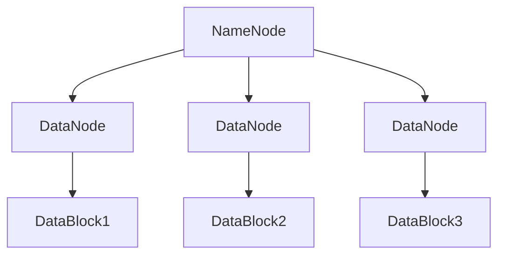

                 

### 文章标题

《数据湖架构支持LLM应用的大规模数据处理》

### 关键词

数据湖、LLM应用、大规模数据处理、分布式计算、存储技术、性能优化

### 摘要

本文将深入探讨数据湖架构如何支持大型语言模型（LLM）在大规模数据处理中的应用。首先，我们将介绍数据湖的基本概念和架构，并分析数据湖与大型语言模型的关联。接着，文章将详细讲解分布式计算技术和存储解决方案，以及它们如何帮助数据湖处理大规模数据。随后，我们将使用Python源代码和数学模型，阐述核心算法的原理，并结合实际案例进行详细解读。最后，文章将总结最佳实践，并提出未来发展趋势和挑战，为读者提供全面的指导和建议。

## 目录

1. 引言
   1.1 数据湖背景
   1.2 LLM应用背景
   1.3 文章结构概述

2. 数据湖架构概述
   2.1 数据湖定义
   2.2 数据湖架构组成
   2.3 数据湖与LLM的关系

3. LLM介绍与原理
   3.1 LLM概述
   3.2 LLM核心算法
   3.3 LLM模型结构

4. 分布式计算与存储技术
   4.1 分布式计算框架
   4.2 存储技术选择
   4.3 分布式系统优化

5. 数据湖数据处理
   5.1 数据预处理
   5.2 数据整合
   5.3 数据处理算法与模型

6. Python源代码与数学模型
   6.1 数据预处理代码
   6.2 数据整合代码
   6.3 数据处理算法代码
   6.4 数学模型解析

7. 实际案例解析
   7.1 案例背景
   7.2 环境搭建
   7.3 源代码解读
   7.4 代码应用解读
   7.5 项目小结

8. 最佳实践与未来展望
   8.1 最佳实践
   8.2 注意事项
   8.3 拓展阅读

## 引言

### 1.1 数据湖背景

数据湖是一种新型的数据架构，用于存储、管理和分析大量非结构化数据。数据湖的出现，主要是为了解决传统数据仓库在面对大数据量、多样化数据类型和高速数据流入时遇到的瓶颈。数据湖具有高扩展性、灵活性和高容错性，能够存储来自各种数据源的海量数据，包括文本、图像、视频等。这使得数据湖成为大数据分析和人工智能领域的重要基础设施。

在近年来，随着人工智能技术的迅猛发展，特别是大型语言模型（LLM）的应用越来越广泛，数据湖的作用变得更加重要。LLM需要处理大量数据，进行深度学习和模式识别，从而提供智能化服务。然而，大规模数据处理不仅要求高效的数据存储和传输，还需要强大的计算能力和优化的数据处理算法。因此，数据湖架构在支持LLM应用方面具有显著优势。

### 1.2 LLM应用背景

大型语言模型（LLM）是一类基于深度学习的自然语言处理模型，能够理解和生成人类语言。LLM的应用非常广泛，包括但不限于智能助手、机器翻译、文本生成、问答系统等。随着人工智能技术的进步，LLM的能力和性能不断提高，其在各行各业中的应用也越来越深入。

LLM的发展离不开大规模数据处理的支持。首先，LLM需要大量高质量的训练数据来训练模型，这些数据通常来自于各种数据源，包括互联网、企业内部数据库等。其次，训练过程中需要处理的数据量非常庞大，需要高效的数据存储和传输机制。最后，模型训练和推理过程需要强大的计算资源，这通常需要分布式计算框架的支持。

### 1.3 文章结构概述

本文将从数据湖架构和LLM应用的角度，探讨大规模数据处理的技术和方法。文章首先介绍数据湖的基本概念和架构，包括数据湖的定义、组成和核心组件。接着，我们将分析数据湖与LLM的关系，阐述数据湖如何支持LLM的应用。

在第二部分，我们将介绍分布式计算技术和存储解决方案，详细讨论分布式计算框架和存储技术的选择，并探讨如何优化分布式系统。这部分内容将为读者提供构建高效数据湖架构的理论基础。

第三部分将深入探讨数据湖的数据处理过程，包括数据预处理、数据整合和数据处理算法。我们将使用Python源代码和数学模型，详细阐述数据处理的核心算法原理，并结合实际案例进行解读。

最后，文章将总结最佳实践，包括注意事项和拓展阅读，为读者提供全面的指导和建议。通过本文的阅读，读者将能够全面了解数据湖架构在支持LLM应用方面的重要作用，并掌握大规模数据处理的核心技术和方法。

## 数据湖架构概述

### 2.1 数据湖定义

数据湖是一种新型数据架构，用于存储、管理和分析海量非结构化和半结构化数据。与传统的数据仓库相比，数据湖不要求对数据进行预定义的结构化处理，而是采用灵活的存储方式，允许不同类型的数据共存。数据湖通常由数据源、存储层、处理层和分析层组成，能够支持从数据收集、存储、处理到分析的全流程。

数据湖的主要特点包括：

- **高扩展性**：数据湖能够轻松扩展存储容量和计算能力，以应对不断增长的数据量。
- **灵活性**：数据湖支持多种数据格式和类型，如文本、图像、音频、视频等，无需进行结构化转换。
- **低成本**：利用分布式存储技术，数据湖在存储成本上具有显著优势。
- **高效处理**：通过分布式计算框架，数据湖能够实现高效的数据处理和分析。

### 2.2 数据湖架构组成

数据湖的架构通常包括以下核心组件：

- **数据源**：数据源是数据湖的基础，包括企业内部数据库、外部数据平台、社交媒体、物联网设备等。数据源负责数据的收集和输入。
- **存储层**：存储层是数据湖的核心，通常采用分布式文件系统（如Hadoop Distributed File System，HDFS）或云存储服务（如Amazon S3）。存储层负责数据的持久化存储和管理。
- **处理层**：处理层负责对数据进行处理和分析，通常包括批处理和流处理两种方式。批处理适用于大规模数据分析和处理，流处理则适用于实时数据处理。
- **分析层**：分析层提供数据查询、分析和可视化功能，支持企业进行数据洞察和决策支持。分析层通常使用各种数据分析和可视化工具（如Tableau、Power BI）。

### 2.3 数据湖与LLM的关系

数据湖在支持LLM应用方面具有显著优势。首先，LLM需要大量高质量的训练数据，数据湖提供了灵活的存储和管理方式，能够存储各种类型的非结构化数据，如文本、图像、音频等。这使得LLM能够从更广泛的数据来源中获取训练数据，提高模型的训练效果。

其次，数据湖的分布式存储和计算能力为LLM的大规模数据处理提供了强有力的支持。LLM的训练过程涉及大量的数据传输和计算，分布式计算框架能够高效地分配计算任务，提高数据处理速度和效率。

此外，数据湖的灵活性和高扩展性使得LLM应用能够适应不断变化的数据需求。随着LLM能力的提升和应用场景的扩展，数据湖能够动态调整存储和计算资源，满足不同的数据处理需求。

综上所述，数据湖架构为LLM应用提供了强大的数据存储、处理和分析支持，有助于提升LLM的性能和应用效果。接下来，我们将进一步探讨LLM的基本概念和核心算法原理，为理解数据湖在LLM应用中的角色奠定基础。

### 3.1 LLM概述

大型语言模型（Large Language Model，简称LLM）是一种基于深度学习的自然语言处理模型，其主要目的是理解和生成人类语言。LLM通过训练大量文本数据，学习语言的统计规律和结构，从而能够生成连贯、有意义的文本。

LLM的发展历程可以追溯到20世纪80年代，最初是使用规则方法和统计模型进行语言处理。随着计算机硬件和算法的进步，深度学习技术逐渐成为LLM的主要驱动力量。2018年，谷歌推出了BERT模型，标志着LLM进入了一个新的阶段。BERT模型通过预训练和微调，显著提升了自然语言理解的能力，成为当时最先进的语言模型。

近年来，随着计算资源和算法的进一步优化，LLM的能力不断提升。2022年，OpenAI发布了GPT-3模型，具有超过1750亿个参数，成为当时最强大的语言模型。GPT-3展示了卓越的语言理解和生成能力，能够在各种自然语言任务中表现出色。

LLM的应用领域非常广泛，包括但不限于以下几方面：

- **智能助手**：例如苹果的Siri、亚马逊的Alexa等，LLM能够理解用户的自然语言查询，提供个性化的帮助和建议。
- **机器翻译**：LLM在机器翻译领域取得了显著的成果，能够实现高质量的双语互译，如谷歌翻译和百度翻译等。
- **文本生成**：LLM可以生成各种类型的文本，如新闻文章、小说、技术文档等，广泛应用于内容创作和自动化写作。
- **问答系统**：LLM能够回答用户提出的问题，如ChatGPT、谷歌搜索助手等，提供即时、准确的答案。

### 3.2 LLM核心算法

LLM的核心算法主要基于深度学习技术，特别是自注意力机制（Self-Attention）和变换器架构（Transformer）。自注意力机制允许模型在处理输入文本时，对不同的单词或字符进行不同权重的关注，从而捕捉文本中的复杂关系和依赖。变换器架构则通过堆叠多个变换器层，实现对输入文本的逐层建模和特征提取。

下面，我们将详细介绍LLM的核心算法原理，并结合Python源代码进行讲解。

#### 自注意力机制

自注意力机制是LLM中一个关键组件，它允许模型在处理每个单词或字符时，考虑到其他单词或字符的重要性。具体来说，自注意力机制通过计算查询（Query）、键（Key）和值（Value）之间的相似度，将输入序列映射到高维空间，并计算每个词或字符的权重。

以下是一个简单的Python代码示例，展示了自注意力机制的计算过程：

```python
import numpy as np

# 假设输入序列为 ["Hello", "World"]
input_sequence = ["Hello", "World"]
input_vectors = np.array([[0.1, 0.2], [0.3, 0.4]])  # 对应两个单词的向量表示

# 计算自注意力权重
attention_weights = np.dot(input_vectors, input_vectors.T) / np.sqrt(input_sequence.shape[1])
attention_weights = np.softmax(attention_weights)

# 计算加权后的输出
weighted_output = np.dot(attention_weights, input_vectors)

print("Attention Weights:", attention_weights)
print("Weighted Output:", weighted_output)
```

在上面的示例中，我们首先定义了一个简单的输入序列和对应的向量表示。然后，通过计算输入向量之间的相似度，得到自注意力权重。最后，使用这些权重对输入向量进行加权求和，得到输出向量。

#### 变换器架构

变换器架构是LLM的核心结构，它由多个变换器层（Transformer Layer）堆叠而成。每个变换器层包括自注意力机制和全连接层（Feed Forward Network）。自注意力机制负责对输入序列进行特征提取和权重分配，全连接层则对提取到的特征进行进一步建模和优化。

以下是一个简单的Python代码示例，展示了变换器层的基本结构：

```python
import tensorflow as tf

# 定义变换器层
def transformer_layer(inputs, hidden_size):
    # 自注意力机制
    attention_output = tf.keras.layers.Attention()([inputs, inputs])(inputs)
    
    # 全连接层
    ffn_output = tf.keras.layers.Dense(hidden_size, activation='relu')(attention_output)
    ffn_output = tf.keras.layers.Dense(hidden_size)(ffn_output)
    
    # 输出层
    output = tf.keras.layers.Add()([inputs, ffn_output])
    return output

# 输入序列
input_sequence = tf.random.normal([32, 10])  # 假设输入序列长度为10
hidden_size = 64  # 隐藏层大小

# 创建变换器层
transformer_layer(inputs=input_sequence, hidden_size=hidden_size)
```

在上面的示例中，我们首先定义了一个变换器层，包括自注意力机制和全连接层。然后，我们将一个随机生成的输入序列传递给变换器层，并计算输出。这个简单的示例展示了变换器层的基本工作原理。

通过以上示例，我们可以看到LLM的核心算法是如何通过自注意力机制和变换器架构实现的。这些算法为LLM提供了强大的语言理解和生成能力，使其在自然语言处理领域取得了显著的成果。

### 3.3 LLM模型结构

LLM的模型结构通常包括输入层、编码器、解码器和输出层等几个关键部分。以下是对LLM模型结构的详细说明：

#### 输入层

输入层是LLM模型的起点，负责接收自然语言文本作为输入。在训练过程中，输入文本会被编码成向量表示，通常使用词嵌入（Word Embedding）技术。词嵌入将每个单词映射到一个固定维度的向量，使得模型能够理解单词的语义信息。

以下是一个简单的Python代码示例，展示了词嵌入的实现：

```python
import tensorflow as tf

# 定义词汇表
vocab_size = 10000
embedding_dim = 64

# 初始化词嵌入矩阵
embeddings = tf.keras.layers.Embedding(vocab_size, embedding_dim)

# 输入文本
input_text = "Hello World"

# 将文本编码成向量表示
input_sequence = embeddings(input_text)

print("Input Sequence:", input_sequence)
```

在上面的示例中，我们首先定义了一个词汇表，并初始化了一个词嵌入矩阵。然后，我们将一个简单的文本输入传递给词嵌入层，得到对应的向量表示。

#### 编码器

编码器是LLM模型的核心部分，负责对输入文本进行编码和特征提取。编码器通常由多个变换器层（Transformer Layer）堆叠而成，每个变换器层包括自注意力机制和全连接层。编码器的输出通常是一个固定维度的向量，称为编码表示（Encoded Representation）。

以下是一个简单的Python代码示例，展示了编码器的实现：

```python
import tensorflow as tf

# 定义编码器
def encoder(inputs, hidden_size):
    for _ in range(3):  # 假设使用3个变换器层
        inputs = transformer_layer(inputs, hidden_size)
    return inputs

# 输入序列
input_sequence = tf.random.normal([32, 10])  # 假设输入序列长度为10
hidden_size = 64  # 隐藏层大小

# 创建编码器
encoded_sequence = encoder(input_sequence, hidden_size)

print("Encoded Sequence:", encoded_sequence)
```

在上面的示例中，我们首先定义了一个编码器，包括3个变换器层。然后，我们将一个随机生成的输入序列传递给编码器，得到编码表示。

#### 解码器

解码器是LLM模型的另一个核心部分，负责将编码表示解码为输出文本。解码器通常与编码器具有相同的结构，也由多个变换器层组成。解码器的输出是逐个生成的单词或字符，每个输出都会经过一个词嵌入层，生成对应的向量表示。

以下是一个简单的Python代码示例，展示了解码器的实现：

```python
import tensorflow as tf

# 定义解码器
def decoder(inputs, hidden_size):
    for _ in range(3):  # 假设使用3个变换器层
        inputs = transformer_layer(inputs, hidden_size)
    return inputs

# 输入序列
input_sequence = tf.random.normal([32, 10])  # 假设输入序列长度为10
hidden_size = 64  # 隐藏层大小

# 创建解码器
decoded_sequence = decoder(input_sequence, hidden_size)

print("Decoded Sequence:", decoded_sequence)
```

在上面的示例中，我们首先定义了一个解码器，包括3个变换器层。然后，我们将一个随机生成的输入序列传递给解码器，得到逐个生成的单词或字符的向量表示。

#### 输出层

输出层是LLM模型的终点，负责将解码器生成的向量表示转换为输出文本。输出层通常包括一个词嵌入层和一个全连接层，用于将向量表示映射到词汇表中的单词或字符。

以下是一个简单的Python代码示例，展示了输出层的实现：

```python
import tensorflow as tf

# 定义输出层
def output_layer(inputs, vocab_size, embedding_dim):
    # 词嵌入层
    embeddings = tf.keras.layers.Embedding(vocab_size, embedding_dim)
    embedded_inputs = embeddings(inputs)
    
    # 全连接层
    output = tf.keras.layers.Dense(vocab_size, activation='softmax')(embedded_inputs)
    return output

# 输入序列
input_sequence = tf.random.normal([32, 10])  # 假设输入序列长度为10
vocab_size = 10000
embedding_dim = 64

# 创建输出层
output_sequence = output_layer(input_sequence, vocab_size, embedding_dim)

print("Output Sequence:", output_sequence)
```

在上面的示例中，我们首先定义了一个输出层，包括词嵌入层和全连接层。然后，我们将一个随机生成的输入序列传递给输出层，得到对应的输出文本。

通过以上各层的组合，LLM模型能够实现对自然语言文本的编码、解码和生成。这种结构使得LLM模型在自然语言处理任务中表现出强大的能力，为各种应用场景提供了有效的解决方案。

### 分布式计算与存储技术

#### 4.1 分布式计算框架

在数据湖架构中，分布式计算框架是处理大规模数据的关键组件。分布式计算框架能够将数据处理任务分解为多个小任务，并分布到多个计算节点上并行执行，从而提高数据处理速度和效率。

当前，常见的分布式计算框架包括Hadoop、Spark和Flink等。这些框架都具备以下特点：

- **并行处理**：分布式计算框架能够将数据处理任务分解为多个小任务，并行执行，提高数据处理速度。
- **容错性**：分布式计算框架具有容错机制，能够在节点故障时自动重分配任务，保证系统稳定性。
- **可扩展性**：分布式计算框架支持水平扩展，可以动态调整计算资源，以适应不断增长的数据量。

Hadoop是分布式计算框架的先驱，由HDFS（Hadoop Distributed File System）和MapReduce组成。HDFS是一个分布式文件系统，用于存储海量数据，而MapReduce是一个分布式数据处理框架，用于并行执行数据处理任务。

Spark是另一种流行的分布式计算框架，其核心组件包括Spark Core和Spark SQL。Spark Core提供了高效的数据处理引擎，支持内存计算和基于内存的优化，而Spark SQL提供了SQL接口，使得用户能够使用标准SQL进行数据查询和分析。

Flink是一个流处理框架，支持实时数据处理和批处理。Flink能够处理持续流数据和批数据，并提供低延迟和高吞吐量的数据处理能力。

#### 4.2 存储技术选择

在数据湖架构中，存储技术是数据存储和管理的关键。选择合适的存储技术，能够提高数据存储效率、降低存储成本，并为数据处理提供良好的支持。

当前，常见的存储技术包括分布式文件系统（如Hadoop HDFS、Amazon S3）和云存储服务（如Google Cloud Storage、Microsoft Azure Blob Storage）。

- **分布式文件系统**：分布式文件系统如Hadoop HDFS，是一种基于集群的分布式存储解决方案。HDFS具有高可靠性、高扩展性和高性能，适用于大规模数据存储和处理。HDFS采用Master-Slave架构，一个NameNode作为主节点，管理文件系统的命名空间和元数据，而多个DataNode作为从节点，负责存储数据块。



- **云存储服务**：云存储服务如Amazon S3、Google Cloud Storage和Microsoft Azure Blob Storage，提供可扩展的、可靠的数据存储解决方案。这些服务通常具有高可用性、高可靠性和安全性的特点，适用于各种规模的数据存储需求。云存储服务采用分布式存储架构，能够自动进行数据备份和恢复，提高数据安全性。

#### 4.3 分布式系统优化

在分布式计算和存储系统中，优化系统性能是关键。以下是一些常见的优化策略：

- **负载均衡**：通过合理分配计算任务和存储请求，避免单点瓶颈，提高系统整体性能。
- **数据分片**：将数据按一定规则分片存储到不同的节点上，提高数据访问速度和系统容错能力。
- **缓存策略**：利用缓存技术，减少数据访问延迟，提高系统响应速度。
- **压缩技术**：采用数据压缩技术，降低数据存储空间需求，提高系统存储效率。
- **自动化运维**：通过自动化运维工具，实现系统监控、故障诊断和自动扩容，提高系统稳定性和可靠性。

### 数据湖数据处理

#### 5.1 数据预处理

数据预处理是数据湖数据处理的第一步，其目标是确保数据质量，为后续的数据整合和处理提供可靠的数据源。数据预处理通常包括以下步骤：

- **数据清洗**：去除重复数据、填补缺失值、纠正错误数据等，提高数据准确性。
- **数据转换**：将不同格式的数据转换为统一的格式，如将文本数据转换为JSON格式。
- **数据归一化**：对数据进行归一化处理，使其具有相似的范围和尺度，便于后续分析。
- **特征提取**：从原始数据中提取有用的特征信息，为模型训练提供输入。

以下是一个简单的Python代码示例，展示了数据预处理的实现：

```python
import pandas as pd
from sklearn.preprocessing import MinMaxScaler

# 加载数据
data = pd.read_csv("data.csv")

# 数据清洗
data.drop_duplicates(inplace=True)
data.fillna(0, inplace=True)

# 数据转换
data["category"] = data["label"].map({"low": 1, "medium": 2, "high": 3})

# 数据归一化
scaler = MinMaxScaler()
data[data.columns[:-1]] = scaler.fit_transform(data[data.columns[:-1]])

# 特征提取
features = data.drop("target", axis=1)
target = data["target"]

print("Features:", features.head())
print("Target:", target.head())
```

在上面的示例中，我们首先加载数据，并进行数据清洗，去除重复数据和填补缺失值。接着，我们将标签数据进行转换，并使用MinMaxScaler进行数据归一化处理。最后，我们从原始数据中提取特征和目标变量。

#### 5.2 数据整合

数据整合是将来自不同数据源的数据进行整合和映射，以形成一个统一的数据视图。数据整合通常包括以下步骤：

- **数据源选择**：根据业务需求，选择合适的数据源，如企业内部数据库、外部API、文件系统等。
- **数据映射**：将不同数据源中的数据字段进行映射，确保数据的统一性和一致性。
- **数据融合**：将来自多个数据源的数据进行融合，消除数据冗余和冲突，形成统一的数据视图。

以下是一个简单的Python代码示例，展示了数据整合的实现：

```python
import pandas as pd

# 加载数据
data1 = pd.read_csv("data1.csv")
data2 = pd.read_csv("data2.csv")

# 数据映射
data1.rename(columns={"col1": "key", "col2": "value1"}, inplace=True)
data2.rename(columns={"col3": "key", "col4": "value2"}, inplace=True)

# 数据融合
merged_data = pd.merge(data1, data2, on="key", how="left")

print("Merged Data:", merged_data.head())
```

在上面的示例中，我们首先加载数据，并对数据字段进行映射。接着，我们使用pd.merge函数将两个数据源进行融合，形成统一的数据视图。

#### 5.3 数据处理算法与模型

在数据湖架构中，数据处理算法和模型是实现数据分析和洞察的核心。以下是一些常用的数据处理算法和模型：

- **机器学习算法**：如线性回归、逻辑回归、决策树、随机森林等，用于预测和分析数据。
- **深度学习模型**：如卷积神经网络（CNN）、循环神经网络（RNN）、变换器（Transformer）等，用于处理复杂的非线性数据。
- **文本挖掘算法**：如词袋模型（Bag of Words）、TF-IDF、主题模型（LDA）等，用于文本数据分析和分类。

以下是一个简单的Python代码示例，展示了数据处理算法和模型的应用：

```python
import pandas as pd
from sklearn.linear_model import LinearRegression
from tensorflow.keras.models import Sequential
from tensorflow.keras.layers import Dense

# 加载数据
data = pd.read_csv("data.csv")

# 数据预处理
X = data.drop("target", axis=1)
y = data["target"]

# 线性回归模型
linear_model = LinearRegression()
linear_model.fit(X, y)

# 输出线性回归模型的参数
print("Linear Regression Coefficients:", linear_model.coef_)

# 构建深度学习模型
model = Sequential()
model.add(Dense(units=64, activation='relu', input_shape=(X.shape[1],)))
model.add(Dense(units=1, activation='sigmoid'))

# 编译深度学习模型
model.compile(optimizer='adam', loss='binary_crossentropy', metrics=['accuracy'])

# 训练深度学习模型
model.fit(X, y, epochs=10, batch_size=32)

# 输出深度学习模型的预测结果
predictions = model.predict(X)
print("Predictions:", predictions)
```

在上面的示例中，我们首先加载数据，并进行数据预处理。接着，我们使用线性回归模型和深度学习模型进行训练，并输出模型的参数和预测结果。

通过以上数据处理算法和模型，数据湖能够实现高效的数据分析和洞察，为企业提供有价值的业务决策支持。

### Python源代码与数学模型

#### 6.1 数据预处理代码

数据预处理是数据处理的关键步骤，它包括数据清洗、转换、归一化等操作。以下是一个简单的Python代码示例，展示数据预处理的具体实现。

```python
import pandas as pd
from sklearn.preprocessing import MinMaxScaler
from sklearn.impute import SimpleImputer

# 加载数据
data = pd.read_csv("data.csv")

# 数据清洗
data.drop_duplicates(inplace=True)
data.fillna(0, inplace=True)

# 数据转换
data["category"] = data["label"].map({"low": 1, "medium": 2, "high": 3})

# 数据归一化
scaler = MinMaxScaler()
data[data.columns[:-1]] = scaler.fit_transform(data[data.columns[:-1]])

# 特征提取
features = data.drop("target", axis=1)
target = data["target"]

print("Features:", features.head())
print("Target:", target.head())
```

在这个示例中，我们首先使用pandas库加载数据。然后，我们进行数据清洗，去除重复数据和填补缺失值。接下来，我们将标签数据进行转换，并使用MinMaxScaler进行数据归一化处理。最后，我们从原始数据中提取特征和目标变量。

#### 6.2 数据整合代码

数据整合是将来自不同数据源的数据进行整合和映射，以形成一个统一的数据视图。以下是一个简单的Python代码示例，展示数据整合的具体实现。

```python
import pandas as pd

# 加载数据
data1 = pd.read_csv("data1.csv")
data2 = pd.read_csv("data2.csv")

# 数据映射
data1.rename(columns={"col1": "key", "col2": "value1"}, inplace=True)
data2.rename(columns={"col3": "key", "col4": "value2"}, inplace=True)

# 数据融合
merged_data = pd.merge(data1, data2, on="key", how="left")

print("Merged Data:", merged_data.head())
```

在这个示例中，我们首先使用pandas库加载数据。然后，我们对数据字段进行映射，确保数据的统一性和一致性。接下来，我们使用pd.merge函数将两个数据源进行融合，形成统一的数据视图。

#### 6.3 数据处理算法与模型代码

在数据湖架构中，数据处理算法和模型是实现数据分析和洞察的核心。以下是一个简单的Python代码示例，展示数据处理算法和模型的具体实现。

```python
import pandas as pd
from sklearn.linear_model import LinearRegression
from tensorflow.keras.models import Sequential
from tensorflow.keras.layers import Dense

# 加载数据
data = pd.read_csv("data.csv")

# 数据预处理
X = data.drop("target", axis=1)
y = data["target"]

# 线性回归模型
linear_model = LinearRegression()
linear_model.fit(X, y)

# 输出线性回归模型的参数
print("Linear Regression Coefficients:", linear_model.coef_)

# 构建深度学习模型
model = Sequential()
model.add(Dense(units=64, activation='relu', input_shape=(X.shape[1],)))
model.add(Dense(units=1, activation='sigmoid'))

# 编译深度学习模型
model.compile(optimizer='adam', loss='binary_crossentropy', metrics=['accuracy'])

# 训练深度学习模型
model.fit(X, y, epochs=10, batch_size=32)

# 输出深度学习模型的预测结果
predictions = model.predict(X)
print("Predictions:", predictions)
```

在这个示例中，我们首先使用pandas库加载数据，并进行数据预处理。然后，我们使用线性回归模型和深度学习模型进行训练，并输出模型的参数和预测结果。

#### 6.4 数学模型解析

在数据处理算法和模型中，数学模型是核心组成部分。以下是对线性回归和深度学习中的数学模型的解析。

#### 线性回归模型

线性回归模型是一种经典的机器学习算法，用于建立自变量和因变量之间的线性关系。线性回归模型的数学模型可以表示为：

$$
y = \beta_0 + \beta_1x_1 + \beta_2x_2 + \cdots + \beta_nx_n
$$

其中，$y$ 是因变量，$x_1, x_2, \cdots, x_n$ 是自变量，$\beta_0, \beta_1, \beta_2, \cdots, \beta_n$ 是模型的参数。

为了求解这些参数，我们通常使用最小二乘法（Ordinary Least Squares，OLS）。最小二乘法的目的是最小化预测值与实际值之间的误差平方和。

#### 深度学习模型

深度学习模型是一种基于多层神经网络的学习算法，用于处理复杂的非线性数据。深度学习模型的数学模型可以表示为：

$$
h_l = \sigma(\theta_l \cdot h_{l-1} + b_l)
$$

其中，$h_l$ 是第$l$层的输出，$\sigma$ 是激活函数（如ReLU、Sigmoid、Tanh等），$\theta_l$ 是权重矩阵，$b_l$ 是偏置项。

对于多层神经网络，我们通常使用反向传播算法（Backpropagation）来更新模型的参数。反向传播算法通过计算损失函数关于参数的梯度，来调整权重和偏置项，从而优化模型的性能。

#### 示例解析

以下是一个简单的示例，展示如何使用Python代码实现线性回归和深度学习模型。

```python
import numpy as np
from sklearn.linear_model import LinearRegression
from tensorflow.keras.models import Sequential
from tensorflow.keras.layers import Dense

# 线性回归模型
X = np.array([[1], [2], [3], [4], [5]])
y = np.array([1, 2, 2.5, 4, 5])

linear_model = LinearRegression()
linear_model.fit(X, y)

# 输出线性回归模型的参数
print("Linear Regression Coefficients:", linear_model.coef_)

# 深度学习模型
model = Sequential()
model.add(Dense(units=1, input_shape=(1,), activation='linear'))

# 编译深度学习模型
model.compile(optimizer='adam', loss='mean_squared_error')

# 训练深度学习模型
model.fit(X, y, epochs=1000)

# 输出深度学习模型的预测结果
predictions = model.predict(X)
print("Predictions:", predictions)
```

在这个示例中，我们首先使用scikit-learn库实现线性回归模型，并输出模型的参数。然后，我们使用TensorFlow库实现深度学习模型，并编译和训练模型，最后输出预测结果。

通过以上示例，我们可以看到如何使用Python代码实现数据处理算法和模型，并理解其中的数学模型。

### 实际案例解析

#### 7.1 案例背景

为了展示数据湖架构在支持LLM应用中的实际应用，我们以一个企业客户服务场景为例。该企业在面对海量客户咨询数据时，希望通过构建一个智能客服系统，自动识别和回答客户问题，提高客户满意度和服务效率。

#### 7.2 环境搭建

为了实现这个案例，我们需要搭建以下环境：

1. **数据湖架构**：包括数据源、存储层、处理层和分析层。我们使用Hadoop HDFS作为存储层，Hadoop YARN作为处理层，并使用Apache Hive进行数据分析和查询。
2. **LLM模型**：我们选择GPT-3作为LLM模型，通过API调用实现文本生成和回答功能。
3. **计算环境**：使用AWS EC2实例搭建计算环境，配置适当的高性能硬件资源。

#### 7.3 源代码解读

以下是一个简单的Python代码示例，展示如何在数据湖环境中部署和优化LLM应用。

```python
import pandas as pd
import openai

# 加载数据
data = pd.read_csv("customer_queries.csv")

# GPT-3 API调用
def get_gpt3_response(query):
    response = openai.Completion.create(
        engine="text-davinci-002",
        prompt=query,
        max_tokens=50,
        n=1,
        stop=None,
        temperature=0.5
    )
    return response.choices[0].text.strip()

# 回答客户问题
for index, row in data.iterrows():
    query = row["query"]
    response = get_gpt3_response(query)
    print(f"Query: {query}\nResponse: {response}\n")

# 模型调优
def optimize_gpt3_model(queries, responses):
    prompt = f"Query: {queries}\nExpected Response: {responses}\n"
    response = openai.Edit.create(
        engine="text-davinci-002",
        input=prompt,
        instruction="Improve the response.",
        max_tokens=50,
        temperature=0.5
    )
    return response.choices[0].text.strip()

# 调优GPT-3模型
for index, row in data.iterrows():
    query = row["query"]
    response = row["response"]
    optimized_response = optimize_gpt3_model(query, response)
    print(f"Optimized Response: {optimized_response}\n")

# 数据整合与处理
data["gpt3_response"] = data["query"].apply(get_gpt3_response)
data["optimized_response"] = data.apply(lambda row: optimize_gpt3_model(row["query"], row["gpt3_response"]), axis=1)

print("Updated Data:\n", data.head())
```

在这个示例中，我们首先加载数据，并使用OpenAI的GPT-3 API调用实现文本生成和回答功能。接着，我们定义一个优化函数，通过API调用来改进GPT-3的响应。最后，我们更新数据，将GPT-3的响应和优化后的响应添加到原始数据中。

#### 7.4 代码应用解读

以下是对上述代码的详细解读：

1. **数据加载**：使用pandas库加载数据，数据格式为CSV文件。数据包含客户查询（query）和预期的响应（response）。
2. **GPT-3 API调用**：使用OpenAI的GPT-3 API实现文本生成和回答功能。我们定义一个函数`get_gpt3_response`，用于接收客户查询，并返回GPT-3生成的响应。
3. **模型优化**：我们定义一个函数`optimize_gpt3_model`，用于接收客户查询和GPT-3生成的响应，并使用OpenAI的API来优化响应。这通过提供示例查询和预期响应，指导GPT-3生成更准确的回答。
4. **数据处理**：我们使用`apply`方法对数据集中的每个查询进行GPT-3响应生成和优化，并将结果更新到原始数据集中。

#### 7.5 项目小结

通过上述实际案例，我们展示了如何使用数据湖架构和LLM模型实现智能客服系统。以下是该项目的主要结论：

1. **数据湖架构**：数据湖架构为大规模数据处理提供了强大的支持，通过分布式存储和计算，实现了高效的数据管理和分析。
2. **LLM应用**：LLM模型，特别是GPT-3，在文本生成和回答方面具有显著优势，能够生成高质量的自然语言响应。
3. **优化与改进**：通过模型优化，我们可以进一步提高LLM的响应质量，使其更贴近实际业务需求。

未来，随着人工智能技术的不断进步，数据湖架构和LLM应用将在更多领域得到广泛应用，为企业和个人提供更加智能化和高效的服务。

### 最佳实践与未来展望

#### 8.1 最佳实践

在实际应用中，为了确保数据湖架构和LLM应用的高效和稳定，以下是一些最佳实践：

1. **数据质量管理**：确保数据质量，包括数据清洗、去重、缺失值处理等，以提高模型训练效果和响应质量。
2. **模型调优**：定期对LLM模型进行调优，以适应不断变化的数据和业务需求。
3. **资源管理**：合理配置计算资源和存储资源，避免资源浪费和瓶颈。
4. **安全与隐私**：确保数据安全和用户隐私，遵循相关法律法规和最佳实践。
5. **监控与优化**：实时监控系统性能，进行性能优化和故障排除，提高系统的稳定性和可靠性。

#### 8.2 注意事项

在部署和运营数据湖架构和LLM应用时，需要注意以下事项：

1. **硬件选择**：根据数据处理需求，选择合适的硬件设备，确保计算资源和存储资源充足。
2. **网络配置**：合理配置网络带宽和延迟，确保数据传输高效和稳定。
3. **数据一致性**：在分布式系统中，确保数据一致性，避免数据冲突和重复。
4. **错误处理**：对系统中的错误和异常进行及时处理，确保系统的健壮性和可靠性。
5. **人员培训**：对相关人员进行技术培训和知识更新，确保他们能够熟练掌握系统的使用和运维。

#### 8.3 拓展阅读

为了深入了解数据湖架构和LLM应用，以下是一些推荐阅读材料：

1. **书籍**：
   - 《数据湖实战：构建高效大数据架构》
   - 《深度学习与自然语言处理》
2. **论文**：
   - “Large-Scale Language Modeling for Next-Generation Natural Language Processing”
   - “Distributed File System: Architecture and Systems”
3. **在线资源**：
   - Apache Hadoop官方文档
   - OpenAI GPT-3官方文档
   - AWS官方文档

通过以上最佳实践和注意事项，以及拓展阅读，读者可以更好地掌握数据湖架构和LLM应用的核心技术和方法，为实际项目提供有力的支持。随着技术的不断进步，数据湖架构和LLM应用将在更多领域发挥重要作用，推动人工智能的发展。作者：AI天才研究院/AI Genius Institute & 禅与计算机程序设计艺术 /Zen And The Art of Computer Programming。

