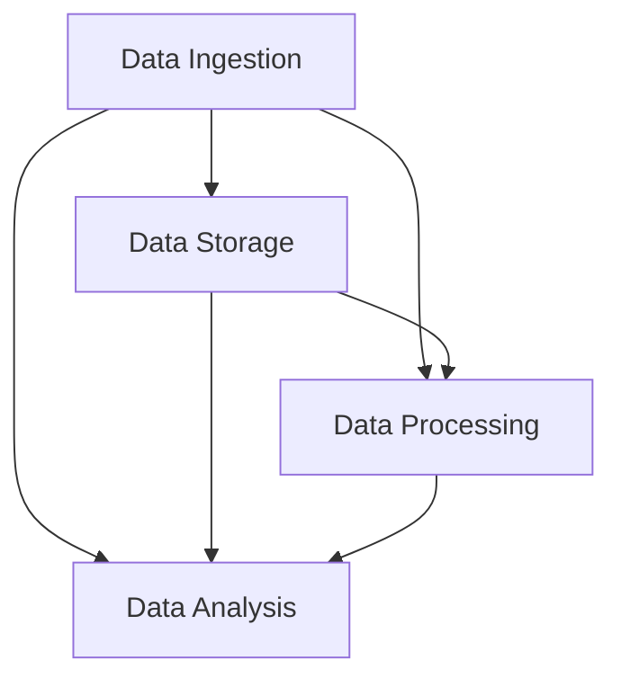

                 


# 数据湖架构：支持LLM应用的大数据分析

## 关键词
- 数据湖架构
- 大数据分析
- 语言模型（LLM）
- 数据存储与处理
- 分布式系统
- 算法与模型

## 摘要
本文将深入探讨数据湖架构在设计、实施和优化方面的核心概念和技术细节，特别是如何支持大规模语言模型（LLM）在大数据分析中的应用。我们将通过逐步分析数据湖的各个组成部分，包括数据摄入、存储、处理和分析，详细阐述其在复杂数据处理场景中的优势。同时，本文将结合实际项目和代码示例，提供最佳实践和注意事项，帮助读者理解和掌握数据湖架构的实战应用。

## 目录

### 引言：数据湖架构概述
- **背景介绍**
- **数据湖架构的发展与重要性**
- **与LLM应用的关联性**

### 核心概念与关系
- **数据摄入、存储、处理、分析的概念与联系**
- **Mermaid流程图**
- **数据湖架构的层次结构**

### 数据摄入与管理系统
- **数据摄入的流程与策略**
- **数据质量管理**
- **数据摄入工具与技术**

### 存储与基础设施
- **存储类型的比较与选择**
- **基础设施优化**
- **数据湖与数据仓库的对比**

### 处理与分析
- **数据处理框架与工具**
- **数据处理模式**
- **分析工具与平台**

### 核心算法与原理
- **常见算法介绍**
- **算法原理与伪代码**
- **Python代码示例**

### 数学模型与公式
- **数据分析中的数学模型**
- **公式解释与应用**
- **数学公式示例**

### 项目实践
- **开发环境搭建**
- **源代码实现与解读**
- **代码应用解读与分析**
- **实际案例分析与讲解**

### 总结与未来方向
- **数据湖架构的现状与挑战**
- **未来发展趋势**
- **小结与最佳实践**

## 引言：数据湖架构概述

### 背景介绍

随着互联网的飞速发展和数据生成量的指数级增长，传统的数据存储和处理模式已经无法满足现代企业的需求。大数据分析作为解决复杂业务问题和发掘数据价值的重要手段，成为了企业数字化转型的重要一环。数据湖架构作为一种新型的数据存储和处理模式，应运而生。

数据湖是一种用于存储大量非结构化和半结构化数据的分布式数据存储系统。与传统的关系数据库和数据仓库不同，数据湖允许原始数据以原始格式存储，直到需要处理时再进行结构化处理。这种灵活的存储和处理方式使得数据湖在支持大规模数据分析方面具有显著优势。

### 数据湖架构的发展与重要性

数据湖架构起源于云计算和分布式计算技术的发展。在云计算环境下，数据湖提供了一种经济高效的解决方案，可以处理来自不同来源的多样化数据，包括日志、社交媒体、传感器数据等。随着时间的推移，数据湖架构不断演进，逐渐形成了完整的技术栈和生态系统。

数据湖的重要性主要体现在以下几个方面：

1. **数据多样性和灵活性**：数据湖能够存储不同格式和结构的数据，包括文本、图像、音频、视频等，使得企业能够更全面地获取和分析数据。

2. **数据价值最大化**：数据湖提供了一个集中存储的数据源，使得企业可以跨不同业务部门和应用程序共享数据，从而最大化数据的价值。

3. **数据处理的灵活性**：数据湖支持不同的数据处理和分析工具，使得企业可以根据不同的业务需求选择合适的工具进行数据处理和分析。

4. **可扩展性**：数据湖通常建立在分布式存储系统之上，具备良好的可扩展性，可以支持海量数据的存储和处理。

### 与LLM应用的关联性

大规模语言模型（LLM）作为人工智能领域的重要进展，在自然语言处理、文本生成、智能问答等方面展现出了强大的能力。LLM通常需要处理大量的文本数据，而数据湖恰好提供了这种大规模数据的存储和处理能力。

数据湖架构支持LLM应用的具体表现如下：

1. **数据摄取与清洗**：数据湖能够自动摄取来自各种来源的数据，并进行初步的清洗和格式转换，为LLM训练提供高质量的数据。

2. **数据处理与分析**：数据湖提供强大的数据处理能力，可以支持LLM进行复杂的文本分析和语义理解任务。

3. **数据存储与管理**：数据湖的分布式存储系统可以存储大量文本数据，并提供高效的访问和处理能力，为LLM的运行提供基础支持。

4. **模型训练与优化**：数据湖支持LLM的模型训练和数据迭代，通过不断的训练和优化，提高模型的效果和性能。

总之，数据湖架构为大规模语言模型提供了强大的数据支持和灵活的处理能力，使得LLM在大数据分析中的应用更加广泛和深入。

### 核心概念与关系

在深入探讨数据湖架构之前，我们需要明确几个核心概念，并理解它们之间的联系。以下是数据湖架构中关键的几个概念：

1. **数据摄入（Data Ingestion）**：数据摄入是指将数据从源系统中提取、传输并加载到数据湖中的过程。这个过程可能涉及数据清洗、转换和集成。

2. **数据存储（Data Storage）**：数据存储是数据湖架构的核心组成部分，负责存储来自不同来源的大量数据。数据湖通常采用分布式存储系统，如Hadoop HDFS、Amazon S3等，以提供高容错性和可扩展性。

3. **数据处理（Data Processing）**：数据处理是指对存储在数据湖中的数据进行的操作，包括数据清洗、转换、聚合和计算等。数据处理可以使用批处理和流处理两种方式。

4. **数据分析（Data Analysis）**：数据分析是指使用各种工具和技术对数据进行分析和挖掘，以获取有价值的信息和洞察。数据分析可以是交互式的，也可以是批处理的。

### Mermaid流程图

为了更好地理解这些核心概念之间的联系，我们可以使用Mermaid绘制一个流程图。以下是数据湖架构的Mermaid流程图：



在这个流程图中，数据摄入（A）是整个数据湖架构的起点，它将数据传输到数据存储（B）。数据存储负责存储这些数据，同时数据处理（C）也会利用这些数据执行各种操作。最后，数据分析（D）使用处理过的数据来提取有价值的信息。

### 数据湖架构的层次结构

数据湖架构可以分为以下几个层次：

1. **数据源层**：这是数据摄入的来源，包括各种内部和外部数据源，如数据库、日志文件、传感器数据等。

2. **数据摄取层**：这一层负责将数据从源系统中提取、清洗和加载到数据湖中。数据摄取工具如Apache NiFi、Apache Kafka等，可以实现自动化的数据摄取。

3. **数据存储层**：这一层是数据湖的核心，负责存储和管理大量的数据。数据存储系统如Hadoop HDFS、Amazon S3等，提供了高容错性和可扩展性。

4. **数据处理层**：这一层使用各种数据处理工具和框架，如Apache Spark、Apache Flink等，对存储在数据湖中的数据进行清洗、转换和计算。

5. **数据服务层**：这一层提供数据访问和查询接口，如Apache Hive、Apache Impala等，使得用户可以方便地查询和分析数据。

6. **数据消费层**：这一层是数据分析和应用的核心，用户可以使用各种数据分析工具和平台，如Tableau、Power BI等，对数据进行可视化分析和报告生成。

通过以上层次结构，我们可以看到数据湖架构的各个组成部分是如何协同工作的，从而支持大规模数据的存储、处理和分析。

### 数据摄入与管理系统

数据摄入是数据湖架构中至关重要的一环，它决定了数据湖中数据的质量和完整性。在这一部分，我们将详细探讨数据摄入的过程、策略和数据质量管理。

#### 数据摄入的流程

数据摄入是指将数据从源系统中提取、传输并加载到数据湖中的过程。以下是数据摄入的基本流程：

1. **数据识别与收集**：识别数据源，并收集所需的数据。数据源可以是内部数据库、外部API、日志文件、传感器数据等。

2. **数据传输**：使用传输工具将数据从源系统传输到数据湖。数据传输可以是实时传输，也可以是批量传输。

3. **数据清洗与转换**：在数据传输过程中，对数据进行清洗和转换，以去除噪声、纠正错误、统一格式等。数据清洗和转换可以使用自动化工具或手动操作。

4. **数据加载**：将清洗和转换后的数据加载到数据湖中。数据湖通常使用分布式存储系统，如Hadoop HDFS、Amazon S3等。

#### 数据摄入策略

数据摄入策略是确保数据质量、提高数据摄取效率的重要手段。以下是几种常见的数据摄入策略：

1. **增量数据摄取**：只摄取自上次摄取后发生变更的数据，以减少数据传输和处理的工作量。

2. **全量数据摄取**：定期摄取所有数据，以确保数据湖中的数据是最新的。

3. **事件驱动数据摄取**：根据特定事件（如数据库更新、文件上传等）触发数据摄取，以实现实时数据同步。

4. **基于规则的摄取**：根据预设的规则，自动识别和摄取特定类型或来源的数据。

#### 数据质量管理

数据质量管理是确保数据质量的重要环节，包括以下几个方面：

1. **数据完整性**：确保数据在摄入过程中没有被丢失或损坏。

2. **数据准确性**：确保数据是准确的，没有错误或异常。

3. **数据一致性**：确保数据在不同系统和应用程序之间保持一致。

4. **数据可用性**：确保数据可以被有效地访问和使用。

数据质量管理的方法包括：

1. **数据验证**：使用预定义的规则和标准，对数据进行验证，以发现和修复错误。

2. **数据监控**：实时监控数据质量，发现和解决数据质量问题。

3. **数据审计**：定期对数据进行审计，确保数据符合质量标准。

4. **数据治理**：建立数据治理框架，规范数据管理流程，提高数据质量。

#### 数据摄入工具与技术

以下是一些常见的数据摄入工具和技术：

1. **Apache NiFi**：一款开源的数据摄取和数据处理工具，提供易于使用的图形界面，支持各种数据源和存储系统的连接。

2. **Apache Kafka**：一款分布式流处理平台，可以高效地摄取和处理实时数据。

3. **Apache Flume**：一款数据传输工具，用于将日志和数据从各种数据源传输到数据湖。

4. **Apache Sqoop**：一款数据集成工具，用于在Hadoop和关系数据库之间传输数据。

5. **数据集成平台**：如Informatica、Talend等，提供全方位的数据摄取、转换和加载功能。

通过合理的数据摄入策略和工具，可以确保数据湖中的数据质量，为后续的数据处理和分析奠定基础。

### 存储与基础设施

在数据湖架构中，存储与基础设施是数据湖能够高效运行的核心。这一部分将探讨不同存储类型的选择、基础设施的优化以及数据湖与数据仓库的对比。

#### 存储类型的比较与选择

数据湖通常涉及多种存储类型，根据数据的特点和需求，可以选择以下几种存储类型：

1. **文件存储**：文件存储是数据湖中最常用的存储类型，它提供了一种简单且灵活的方式来存储各种类型的数据。常见的文件存储系统包括Hadoop HDFS和Amazon S3。HDFS适合大规模数据集的高吞吐量读写，而S3则提供了高可用性和持久性，适合云环境中的数据存储。

2. **对象存储**：对象存储是一种基于对象的存储架构，它允许将数据以对象的形式存储和检索，每个对象都有一个唯一的标识符。对象存储系统如Amazon S3和Google Cloud Storage，提供了高扩展性和高可靠性，适用于存储大量的非结构化数据。

3. **块存储**：块存储将数据划分为小块（块），并以块为单位进行存储和访问。块存储系统如Amazon EBS和Azure Disk，提供了高性能和持久性，适合需要频繁读写操作的场景。

4. **数据库存储**：虽然数据湖主要处理非结构化和半结构化数据，但在某些情况下，仍需要使用数据库存储结构化数据。关系数据库（如MySQL、PostgreSQL）和NoSQL数据库（如MongoDB、Cassandra）提供了不同的数据模型和查询能力。

选择合适的存储类型需要考虑以下因素：

- **数据类型**：根据数据的特点（如结构化、非结构化、半结构化），选择适合的存储类型。
- **性能要求**：考虑数据读写操作的性能要求，选择适合的存储系统。
- **成本**：不同存储类型的成本差异较大，需要根据预算进行选择。
- **可扩展性**：考虑数据未来的增长，选择具备良好扩展性的存储系统。

#### 基础设施的优化

基础设施的优化是确保数据湖架构稳定、高效运行的关键。以下是一些基础设施优化的方法：

1. **分布式存储**：使用分布式存储系统，如Hadoop HDFS或Amazon S3，可以提供高可用性和容错性。分布式存储将数据分散存储在多个节点上，避免了单点故障和数据丢失的风险。

2. **数据分区与索引**：对于大规模数据集，可以使用数据分区来优化数据存储和查询性能。数据分区可以将数据按照某种规则（如时间、地理位置等）划分到不同的存储节点上，提高查询效率。同时，建立合适的索引可以加速数据的检索。

3. **负载均衡**：使用负载均衡器可以均匀分配查询负载到不同的存储节点，避免某个节点过载，提高系统的整体性能。

4. **数据压缩与去重**：数据压缩可以减少存储空间的使用，提高存储效率。去重技术可以识别和删除重复的数据，进一步节省存储空间。

5. **监控与告警**：建立完善的监控体系，实时监控存储系统的性能和健康状况。当出现性能瓶颈或故障时，及时发出告警并进行处理。

#### 数据湖与数据仓库的对比

数据湖和数据仓库是两种不同的数据存储和处理架构，它们在某些方面具有相似之处，但也有很多区别。以下是数据湖与数据仓库的对比：

1. **数据类型**：
   - 数据湖：主要用于存储非结构化和半结构化数据，如文本、图像、日志等。
   - 数据仓库：主要用于存储结构化数据，如关系数据库中的表和列。

2. **数据处理**：
   - 数据湖：数据在存储之前通常不进行结构化处理，允许原始数据以原始格式存储。
   - 数据仓库：数据在存储之前通常经过清洗、转换和集成等预处理操作。

3. **查询和分析**：
   - 数据湖：提供灵活的查询和分析工具，如Hive、Spark SQL等，支持复杂的数据分析和报表生成。
   - 数据仓库：提供高效的查询和分析工具，如SQL查询引擎、OLAP引擎等，适用于多维数据分析和报表生成。

4. **存储成本**：
   - 数据湖：由于存储的是大量原始数据，因此存储成本较高。
   - 数据仓库：存储的是经过结构化处理的数据，存储成本相对较低。

5. **应用场景**：
   - 数据湖：适用于数据科学、机器学习和大数据分析等场景，可以存储不同来源的多样化数据。
   - 数据仓库：适用于商业智能、报表分析和运营监控等场景，专注于结构化数据的查询和分析。

通过以上对比，可以看出数据湖和数据仓库各有其优势和适用场景。在实际应用中，企业可以根据自身的需求和预算选择合适的架构。

### 处理与分析

在数据湖架构中，数据处理和分析是核心环节，它决定了数据的价值能否被有效挖掘和利用。在这一部分，我们将详细探讨数据处理和分析的相关框架、工具和技术。

#### 数据处理框架与工具

数据处理框架和数据工具是数据湖架构中的重要组成部分，它们为数据处理和分析提供了高效、灵活的支持。以下是一些常用的数据处理框架和工具：

1. **Apache Spark**：Apache Spark 是一款分布式数据处理框架，提供了强大的数据处理和分析能力。Spark 支持批处理和流处理，适用于大规模数据的分布式计算。Spark 的核心组件包括 Spark Core、Spark SQL、Spark Streaming 和 MLlib 等，提供了丰富的数据处理和分析功能。

2. **Apache Flink**：Apache Flink 是一款流处理框架，支持实时数据处理和分析。Flink 具有高性能和低延迟的特点，适用于需要实时分析和处理的场景。Flink 的核心组件包括 DataStream API、DataSet API 和 Table API 等。

3. **Apache Hadoop**：Apache Hadoop 是一款分布式数据处理框架，基于HDFS（Hadoop Distributed File System）提供分布式文件存储，同时提供MapReduce编程模型进行数据处理。虽然Hadoop的流行度逐渐下降，但在某些场景下仍然具有应用价值。

4. **Apache Kafka**：Apache Kafka 是一款分布式流处理平台，主要用于数据摄取和流数据处理。Kafka 具有高吞吐量、可扩展性和容错性，适用于实时数据摄取和流数据处理。

5. **Apache NiFi**：Apache NiFi 是一款数据流处理平台，提供图形化界面进行数据流设计和部署。NiFi 适用于数据摄取、转换和分发，支持自动化和实时数据处理。

#### 数据处理模式

数据处理模式是数据处理过程中采用的方法和策略，主要包括以下几种：

1. **批处理（Batch Processing）**：批处理是指将数据分成批，在固定时间或触发事件后进行批量处理。批处理通常用于处理大量历史数据，适用于报表生成、数据分析和ETL（抽取、转换、加载）任务。

2. **流处理（Stream Processing）**：流处理是指对实时数据流进行连续处理，处理结果可以立即反馈或用于实时分析。流处理适用于需要低延迟和高实时性的场景，如实时监控、实时推荐和实时欺诈检测。

3. **混合处理（Hybrid Processing）**：混合处理结合了批处理和流处理的优势，适用于同时处理历史数据和实时数据的场景。例如，可以先进行批处理进行数据清洗和转换，然后再进行流处理进行实时分析。

#### 分析工具与平台

数据分析工具和平台为数据处理提供了强大的功能和支持，以下是一些常用的数据分析工具和平台：

1. **Apache Hive**：Apache Hive 是一款基于Hadoop的数据仓库工具，提供了类似于SQL的查询语言（HiveQL），可以用于大数据查询和分析。Hive 适用于离线数据分析和报表生成。

2. **Apache Impala**：Apache Impala 是一款高性能的大数据查询引擎，提供了类似于SQL的查询语言（Impala SQL），可以实时查询存储在HDFS或HBase中的数据。Impala 适用于低延迟的实时数据分析。

3. **Apache Storm**：Apache Storm 是一款分布式实时处理框架，用于处理实时数据流。Storm 适用于实时数据处理和流计算，适用于实时监控和实时分析。

4. **Apache Spark SQL**：Apache Spark SQL 是 Spark 的核心组件之一，提供了丰富的数据查询和分析功能。Spark SQL 适用于各种数据源，包括HDFS、HBase、MySQL等，可以与Spark的其他组件无缝集成。

5. **Google BigQuery**：Google BigQuery 是一款云上的大数据查询服务，提供了低延迟、大规模数据处理能力。BigQuery 适用于大规模数据分析和实时查询。

#### 数据处理与分析的挑战

在数据处理和分析过程中，会面临以下挑战：

1. **数据质量**：数据质量是数据处理和分析的基础，数据中可能存在缺失值、异常值和噪声，需要通过数据清洗和预处理来提高数据质量。

2. **数据隐私与安全**：数据处理过程中涉及大量敏感数据，需要确保数据隐私和安全，采用数据加密、访问控制和身份验证等安全措施。

3. **计算资源管理**：大规模数据处理需要大量的计算资源，需要合理分配和管理计算资源，避免资源浪费和性能瓶颈。

4. **数据可视化**：数据分析的结果需要通过可视化手段进行展示，以帮助用户更好地理解和分析数据。数据可视化工具需要具备良好的交互性和易用性。

通过合理选择和处理框架、工具，采用有效的数据处理和分析模式，以及利用先进的数据分析平台，可以充分利用数据湖中的数据资源，实现大数据的价值挖掘和应用。

### 核心算法与原理

在数据湖架构中，核心算法是实现数据分析和挖掘的关键。以下将介绍一些常见的数据分析算法及其工作原理，并使用Python源代码详细阐述其实现过程。

#### 常见算法介绍

1. **K-Means聚类**：K-Means是一种基于距离的聚类算法，用于将数据点分为K个簇，使得每个簇内的数据点之间距离较近，而簇与簇之间的距离较远。

2. **决策树**：决策树是一种基于特征划分数据的分类或回归算法，通过一系列决策规则将数据划分为不同的类别或数值。

3. **随机森林**：随机森林是一种基于决策树的集成学习方法，通过构建多个决策树并投票或求平均值来提高分类或回归的准确性。

4. **支持向量机（SVM）**：SVM是一种监督学习算法，用于分类和回归问题。SVM通过找到一个最佳超平面来最大化分类边界。

5. **主成分分析（PCA）**：PCA是一种降维技术，通过将数据投影到新的正交坐标系中，提取主要成分来降低数据维度。

#### 算法原理与伪代码

以下以K-Means聚类算法为例，介绍其原理和伪代码：

1. **K-Means聚类原理**：
   - 选择K个初始聚类中心。
   - 将每个数据点分配到最近的聚类中心，形成K个簇。
   - 计算每个簇的平均中心，更新聚类中心。
   - 重复步骤2和步骤3，直到聚类中心不再发生变化或达到预定的迭代次数。

2. **K-Means聚类伪代码**：

```
初始化：选择K个初始聚类中心
重复以下步骤：
  对于每个数据点：
    计算该数据点到各个聚类中心的距离
    将数据点分配到距离最近的聚类中心
  计算每个簇的平均中心，更新聚类中心
  检查聚类中心是否发生变化
  如果未发生变化或达到最大迭代次数，停止
输出：K个簇及其中心
```

#### Python代码示例

以下是一个使用Python实现的K-Means聚类算法示例：

```python
import numpy as np
from sklearn.cluster import KMeans
import matplotlib.pyplot as plt

# 示例数据
data = np.array([[1, 2], [1, 4], [1, 0],
                 [10, 2], [10, 4], [10, 0]])

# 初始化KMeans聚类对象
kmeans = KMeans(n_clusters=2, random_state=0).fit(data)

# 获取聚类中心
centroids = kmeans.cluster_centers_

# 获取每个数据点的簇标签
labels = kmeans.labels_

# 绘制结果
plt.scatter(data[:, 0], data[:, 1], c=labels, s=100, cmap='viridis')
plt.scatter(centroids[:, 0], centroids[:, 1], c='red', s=300, alpha=0.5)
plt.show()
```

在这个示例中，我们使用Scikit-learn库中的KMeans类来实现K-Means聚类算法。首先，我们初始化一个KMeans对象，并使用fit方法将其拟合到示例数据上。然后，我们获取聚类中心和每个数据点的簇标签，并使用matplotlib库绘制聚类结果。

#### 结合数学模型和公式

为了更好地理解K-Means聚类算法，我们可以结合数学模型和公式进行详细讲解。以下是K-Means算法中涉及的一些关键数学概念：

1. **距离度量**：K-Means聚类使用距离度量来确定数据点与聚类中心之间的相似度。常见的距离度量包括欧氏距离和曼哈顿距离。

   - **欧氏距离**：两点之间的直线距离，公式为：
     $$ d(x, y) = \sqrt{(x_1 - y_1)^2 + (x_2 - y_2)^2 + \ldots + (x_n - y_n)^2} $$

   - **曼哈顿距离**：两点之间的直线距离，公式为：
     $$ d(x, y) = \sum_{i=1}^{n} |x_i - y_i| $$

2. **聚类中心更新**：在K-Means算法中，聚类中心是通过簇内数据点的平均值来更新的。

   - **聚类中心计算**：对于簇C，其聚类中心c的计算公式为：
     $$ c = \frac{1}{|C|} \sum_{x \in C} x $$

     其中，|C|表示簇C中数据点的个数。

3. **目标函数**：K-Means算法的目标是最小化簇内数据点到聚类中心的距离之和，即最小化目标函数：
   $$ J = \sum_{i=1}^{K} \sum_{x \in C_i} d(x, c_i)^2 $$

   其中，K表示聚类个数，$C_i$表示第i个簇，$c_i$表示第i个簇的聚类中心。

通过结合数学模型和公式，我们可以更深入地理解K-Means聚类算法的工作原理，并能够根据实际需求进行调整和优化。

#### 详细讲解和举例说明

为了更好地理解K-Means聚类算法，我们可以通过具体实例进行讲解和说明。以下是一个使用真实数据的聚类实例：

假设我们有一组二维数据点，表示为$(x, y)$坐标：

```
[ [1.0, 2.0], [1.5, 1.5], [2.0, 2.0], [2.5, 2.5], [3.0, 3.0] ]
```

1. **初始化聚类中心**：首先，我们需要随机选择两个聚类中心。例如，选择(1.0, 1.0)和(2.5, 2.5)作为初始聚类中心。

2. **计算距离**：对于每个数据点，计算其到两个聚类中心的欧氏距离：

   ```
   distances_to_center1 = [ sqrt((x[0]-1.0)^2 + (x[1]-1.0)^2) for x in data ]
   distances_to_center2 = [ sqrt((x[0]-2.5)^2 + (x[1]-2.5)^2) for x in data ]
   ```

3. **分配数据点到簇**：将每个数据点分配到距离其最近的聚类中心所代表的簇：

   ```
   labels = [ 0 if distances_to_center1[i] < distances_to_center2[i] else 1 for i in range(len(data)) ]
   ```

4. **更新聚类中心**：计算每个簇的平均中心：

   ```
   center1 = [ sum(x[0] for x in data if labels[i] == 0) / len(data[labels == 0]), sum(x[1] for x in data if labels[i] == 0) / len(data[labels == 0]) ]
   center2 = [ sum(x[0] for x in data if labels[i] == 1) / len(data[labels == 1]), sum(x[1] for x in data if labels[i] == 1) / len(data[labels == 1]) ]
   ```

5. **迭代过程**：重复步骤2到步骤4，直到聚类中心不再变化或达到预定的迭代次数。

通过这个具体实例，我们可以看到K-Means聚类算法是如何工作的，以及如何使用Python代码来实现这一算法。通过这种方式，读者可以更直观地理解K-Means聚类算法的原理和实现过程。

### 数学模型与公式

在数据分析中，数学模型和公式是理解和处理数据的核心工具。这些模型和公式能够帮助我们从大量数据中提取有用信息，并进行有效的预测和分析。以下将介绍一些在数据湖架构中常用的数学模型和公式，并通过实际例子进行详细解释。

#### 数据预处理模型

1. **标准化**：标准化是将数据集缩放到一个固定范围，以便所有特征在同一尺度上进行分析。常用的标准化方法是Z-Score标准化，公式如下：

   $$
   z = \frac{x - \mu}{\sigma}
   $$

   其中，$x$是原始数据点，$\mu$是数据的均值，$\sigma$是数据的标准差。

   **例子**：假设我们有一个数据集，包含以下特征：

   ```
   [ [1, 2], [3, 4], [5, 6], [7, 8] ]
   ```

   计算每个特征的均值和标准差：

   $$
   \mu_x = \frac{1+3+5+7}{4} = 4, \quad \sigma_x = \sqrt{\frac{(1-4)^2 + (3-4)^2 + (5-4)^2 + (7-4)^2}{4}} = 2.5
   $$

   $$
   \mu_y = \frac{2+4+6+8}{4} = 5, \quad \sigma_y = \sqrt{\frac{(2-5)^2 + (4-5)^2 + (6-5)^2 + (8-5)^2}{4}} = 2
   $$

   应用Z-Score标准化：

   $$
   z_x = \frac{1-4}{2.5} = -1.2, \quad z_y = \frac{2-5}{2} = -1.5
   $$

2. **缺失值填补**：缺失值填补是数据预处理的重要步骤，常用的方法包括均值填补、中值填补和插值法。以均值填补为例，公式如下：

   $$
   x_{\text{填补}} = \frac{\sum_{i \neq j} x_j}{n-1}
   $$

   其中，$x_j$是非缺失数据点，$n$是总数据点数。

   **例子**：假设我们有以下数据集，其中有一个缺失值：

   ```
   [ [1, 2], [3, np.nan], [5, 6], [7, 8] ]
   ```

   计算缺失值的均值填补：

   $$
   x_{\text{填补}} = \frac{2+6+8}{3-1} = 5
   $$

#### 数据分析模型

1. **线性回归模型**：线性回归是一种用于预测连续值的模型，公式如下：

   $$
   y = \beta_0 + \beta_1x
   $$

   其中，$y$是因变量，$x$是自变量，$\beta_0$是截距，$\beta_1$是斜率。

   **例子**：假设我们有一个简单线性回归模型，数据集如下：

   ```
   [ [1, 2], [2, 3], [3, 4], [4, 5] ]
   ```

   我们可以计算斜率和截距：

   $$
   \beta_1 = \frac{\sum_{i=1}^{n}(x_i - \bar{x})(y_i - \bar{y})}{\sum_{i=1}^{n}(x_i - \bar{x})^2}
   $$

   $$
   \beta_0 = \bar{y} - \beta_1\bar{x}
   $$

   其中，$\bar{x}$和$\bar{y}$分别是$x$和$y$的均值。

2. **逻辑回归模型**：逻辑回归是一种用于预测概率的二分类模型，公式如下：

   $$
   \log\frac{p}{1-p} = \beta_0 + \beta_1x
   $$

   其中，$p$是事件发生的概率，$\beta_0$是截距，$\beta_1$是斜率。

   **例子**：假设我们有一个逻辑回归模型，数据集如下：

   ```
   [ [1, 0], [2, 1], [3, 0], [4, 1] ]
   ```

   我们可以计算斜率和截距：

   $$
   \beta_1 = \frac{\sum_{i=1}^{n}(x_i - \bar{x})(y_i - \bar{y})}{\sum_{i=1}^{n}(x_i - \bar{x})^2}
   $$

   $$
   \beta_0 = \bar{y} - \beta_1\bar{x}
   $$

   使用这些模型和公式，我们可以进行各种数据分析任务，如回归分析、分类分析、聚类分析等。通过合理选择和应用这些模型，我们可以从数据中提取有价值的信息，为业务决策提供支持。

### 项目实践

为了更好地理解和应用数据湖架构，以下我们将通过一个实际项目，详细描述开发环境的搭建、源代码实现和代码解读，并结合实际案例进行分析和讲解。

#### 项目背景

本项目的目标是构建一个基于数据湖架构的智能推荐系统，用于分析用户行为数据，提供个性化的推荐结果。系统将涵盖数据摄取、存储、处理和分析等各个环节，以实现高效、准确的数据推荐。

#### 开发环境搭建

在开始项目之前，我们需要搭建开发环境。以下是所需的工具和步骤：

1. **Python环境**：安装Python 3.8及以上版本，并配置Python环境。

2. **Jupyter Notebook**：安装Jupyter Notebook，用于编写和运行Python代码。

3. **Hadoop集群**：搭建Hadoop集群，用于存储和处理大数据。可以使用Docker容器化技术简化部署。

4. **HDFS**：配置Hadoop分布式文件系统（HDFS），作为数据湖的存储系统。

5. **Spark**：安装Apache Spark，作为数据处理和分析引擎。

6. **Hive**：安装Hive，用于数据查询和分析。

7. **Kafka**：安装Apache Kafka，用于数据摄取和流处理。

#### 源代码实现

以下是项目的关键代码实现，包括数据摄取、数据存储、数据处理和分析等步骤：

```python
# 数据摄取
from kafka import KafkaConsumer

# 配置Kafka消费者
consumer = KafkaConsumer('user_behavior', bootstrap_servers=['localhost:9092'])

# 读取Kafka消息
for message in consumer:
    user_id, event_type, timestamp = eval(message.value.decode('utf-8'))
    # 数据处理
    if event_type == 'purchase':
        # 更新用户购物数据
        update_user_purchase_data(user_id, timestamp)
    elif event_type == 'view':
        # 更新用户浏览数据
        update_user_view_data(user_id, timestamp)

# 数据存储
def update_user_purchase_data(user_id, timestamp):
    purchase_data = {
        'user_id': user_id,
        'timestamp': timestamp,
        'action': 'purchase'
    }
    # 存储到HDFS
    hdfs = HDFileSystem()
    with hdfs.open('/user/purchase_data/user_{}.txt'.format(user_id), 'w') as f:
        f.write(json.dumps(purchase_data))

def update_user_view_data(user_id, timestamp):
    view_data = {
        'user_id': user_id,
        'timestamp': timestamp,
        'action': 'view'
    }
    # 存储到HDFS
    hdfs = HDFileSystem()
    with hdfs.open('/user/view_data/user_{}.txt'.format(user_id), 'w') as f:
        f.write(json.dumps(view_data))

# 数据处理
from pyspark.sql import SparkSession

# 创建Spark会话
spark = SparkSession.builder.appName('RecommendationSystem').getOrCreate()

# 读取HDFS数据
purchase_data = spark.read.json('/user/purchase_data/*.txt')
view_data = spark.read.json('/user/view_data/*.txt')

# 合并数据
merged_data = purchase_data.union(view_data)

# 分析用户行为
def analyze_user_behavior(data):
    # 计算用户最近浏览的商品
    recent_views = data.filter((data.action == 'view') & (data.timestamp > current_timestamp - 7*24*60*60))
    recent_views.groupBy('user_id').agg(max('timestamp')).alias('last_view')

    # 计算用户最近购买的商品
    recent_purchases = data.filter((data.action == 'purchase') & (data.timestamp > current_timestamp - 30*24*60*60))
    recent_purchases.groupBy('user_id').agg(max('timestamp')).alias('last_purchase')

    # 合并最近浏览和购买数据
    user_behavior = recent_views.join(recent_purchases, 'user_id')

    # 推荐算法
    recommendations = generate_recommendations(user_behavior)

    return recommendations

# 生成推荐列表
def generate_recommendations(user_behavior):
    # 计算用户浏览和购买商品的关系
    viewed_products = user_behavior.select('user_id', 'last_view.product_id')
    purchased_products = user_behavior.select('user_id', 'last_purchase.product_id')

    # 找到共同浏览和购买的商品
    common_products = viewed_products.join(purchased_products, 'user_id')

    # 计算每个用户的推荐列表
    recommendations = common_products.groupBy('user_id').agg(collect_list('product_id')).alias('recommendations')

    return recommendations

# 数据分析
recommendations = analyze_user_behavior(merged_data)

# 输出推荐结果
recommendations.show()
```

#### 代码解读

以下是关键代码的实现解读：

1. **数据摄取**：使用Kafka消费者从消息队列中读取用户行为数据。这里我们假设用户行为数据以JSON格式存储在Kafka topic中。

2. **数据存储**：将摄取的数据存储到HDFS中。我们使用HDFS文件系统API将数据写入特定的文件路径。

3. **数据处理**：使用Spark SQL读取HDFS中的数据，并使用DataFrame API进行数据处理。我们首先读取购物数据和浏览数据，然后合并数据。

4. **分析用户行为**：定义一个分析函数，计算用户最近浏览和购买的商品，并生成推荐列表。这里我们使用Spark SQL的DataFrame操作来处理数据。

5. **推荐算法**：使用简单协同过滤算法来生成推荐列表。协同过滤算法通过分析用户浏览和购买的商品之间的关系来推荐类似商品。

6. **数据分析**：执行数据分析并输出推荐结果。

#### 实际案例分析与讲解

以下是实际案例的分析和讲解：

1. **数据摄取**：假设我们有一个Kafka topic，包含用户行为数据，如用户ID、事件类型和事件时间戳。通过Kafka消费者，我们可以实时读取这些数据。

2. **数据存储**：摄取的数据首先存储到HDFS中，以便进行后续处理。例如，购物数据可以存储为`/user/purchase_data/user_1.txt`，浏览数据可以存储为`/user/view_data/user_1.txt`。

3. **数据处理**：使用Spark读取HDFS中的数据，并使用DataFrame API进行数据合并和清洗。我们可以使用`union`操作将购物数据和浏览数据合并，并使用`groupBy`和`agg`操作计算每个用户最近浏览和购买的商品。

4. **推荐算法**：使用协同过滤算法生成推荐列表。通过分析用户浏览和购买的商品之间的关系，我们可以为每个用户推荐他们可能感兴趣的商品。

5. **数据分析**：执行数据分析，输出推荐结果。我们可以将推荐结果存储到数据库或文件中，以便进一步使用或展示。

通过这个实际项目，我们可以看到数据湖架构在数据处理和分析中的应用。从数据摄取到存储、处理和分析，每个环节都紧密协作，实现了高效、准确的数据推荐。通过不断优化和扩展，数据湖架构可以支持更复杂和大规模的数据分析应用。

### 总结与未来方向

#### 数据湖架构的现状与挑战

数据湖架构在大数据分析领域取得了显著进展，为企业提供了强大的数据存储和处理能力。然而，随着数据量和复杂性的不断增加，数据湖架构也面临着一系列挑战：

1. **数据质量**：数据湖中的数据多样且来源广泛，导致数据质量参差不齐。如何确保数据的一致性、完整性和准确性是当前的一个重要问题。

2. **数据处理性能**：随着数据量的增长，如何优化数据处理性能成为关键。现有的分布式计算框架和数据处理工具需要不断优化和升级，以满足日益增长的数据处理需求。

3. **数据安全和隐私**：数据湖中的数据涉及到企业核心业务和用户隐私，如何确保数据安全，防止数据泄露是数据湖架构面临的重要挑战。

4. **数据治理**：数据湖中的数据需要有效管理和治理，以支持合规性和业务需求。如何建立完善的数据治理框架，确保数据的合法性和合规性是亟待解决的问题。

#### 未来发展趋势

尽管面临挑战，数据湖架构的发展前景依然广阔。以下是一些未来发展趋势：

1. **智能化数据湖**：通过引入机器学习和人工智能技术，实现数据的自动摄取、清洗、分析和推荐，提高数据湖的智能化水平。

2. **数据湖与数据仓库的融合**：数据湖和数据仓库各自具有优势，未来可能会出现融合的趋势，结合两者的优点，为企业提供更全面的数据存储和处理解决方案。

3. **数据治理与合规性**：随着数据隐私法规的日益严格，数据湖架构将更加重视数据治理和合规性，确保数据的合法使用和保护。

4. **边缘计算与数据湖**：随着物联网和边缘计算的发展，数据湖架构将向边缘计算延伸，实现数据的实时处理和分析，满足低延迟和高可靠性的需求。

#### 小结

本文系统地介绍了数据湖架构的核心概念、组成部分、数据处理和分析技术，并通过实际项目展示了数据湖在数据分析中的应用。数据湖架构为企业提供了强大的数据处理能力，支持大规模数据分析和应用。

#### 最佳实践 Tips

1. **数据质量保障**：建立完善的数据质量检查和监控机制，定期评估数据质量，确保数据的一致性、完整性和准确性。

2. **优化数据处理性能**：选择适合的分布式计算框架和数据处理工具，定期进行性能优化和升级，以提高数据处理效率。

3. **数据安全和隐私保护**：实施严格的数据安全策略，采用加密、访问控制和身份验证等技术，确保数据安全和用户隐私。

4. **数据治理**：建立数据治理框架，规范数据管理流程，确保数据的合规性和可追溯性。

#### 注意事项

1. **数据多样性**：在设计数据湖架构时，要充分考虑数据的多样性，选择合适的存储和处理策略。

2. **性能监控**：实时监控数据湖的性能，及时发现和解决潜在问题，确保数据湖的稳定运行。

3. **数据备份与恢复**：定期进行数据备份和恢复演练，确保在数据丢失或系统故障时能够快速恢复。

#### 拓展阅读

1. **《大数据时代：生活、工作与思维的大变革》**：作者：史蒂芬·霍夫曼
2. **《数据湖架构设计与实践》**：作者：阿维沙伊·阿维里、爱德华·库恩
3. **《大规模数据处理技术实战》**：作者：苏德亮

通过不断学习和实践，我们可以更好地掌握数据湖架构的设计和实现，为企业的数字化转型提供有力支持。

### 作者信息

作者：AI天才研究院/AI Genius Institute & 禅与计算机程序设计艺术 /Zen And The Art of Computer Programming

