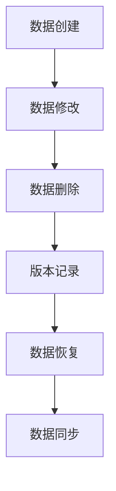

                 

# 《数据版本控制在LLM应用迭代中的应用》

> 关键词：数据版本控制、大型语言模型、LLM应用迭代、版本控制工具、算法原理、数学模型、项目实战

> 摘要：本文深入探讨了数据版本控制在大型语言模型（LLM）应用迭代中的重要性，详细阐述了数据版本控制的基础知识、核心算法原理以及数学模型，并通过实际案例展示了数据版本控制在LLM应用中的实践与应用。文章旨在为研究人员和开发者提供关于数据版本控制的全面指导，助力他们在LLM应用迭代中取得更好的成果。

## 步骤 1：书籍概述

《数据版本控制在LLM应用迭代中的应用》是一本专注于数据版本控制技术在大型语言模型（LLM）应用迭代中的关键作用的书籍。在人工智能和机器学习的快速发展背景下，LLM作为一项重要的技术，已经在自然语言处理、文本生成、机器翻译等领域展现出了强大的应用价值。然而，随着模型复杂度的增加和迭代次数的增多，如何有效地管理和控制数据版本成为一个亟待解决的问题。

本书共分为三个部分。第一部分主要介绍数据版本控制的基础知识，包括数据版本控制的原理、基本流程和常用工具技术。第二部分则重点探讨大型语言模型的概述、应用迭代流程以及数据版本控制在LLM应用中的挑战与策略。第三部分通过实际案例研究，详细展示了数据版本控制在LLM应用中的具体实践和应用。

本书旨在为研究人员和开发者提供一份全面、系统的指南，帮助他们更好地理解和应用数据版本控制技术，提高LLM应用迭代的效果和稳定性。

## 步骤 2：目录大纲设计

为了确保书籍内容的逻辑性和易读性，我们设计了以下目录大纲：

### 第一部分：数据版本控制基础

#### 第1章：数据版本控制的原理与重要性
1.1 数据版本控制的定义
1.2 数据版本控制的重要性
1.3 数据版本控制的 Mermaid 流程图

#### 第2章：数据版本控制的基本流程
2.1 数据采集与清洗
2.2 数据存储与管理
2.3 数据版本控制策略

#### 第3章：数据版本控制工具与技术
3.1 数据库版本控制技术
3.2 文件版本控制技术
3.3 数据流版本控制技术

### 第二部分：LLM应用迭代

#### 第4章：大型语言模型概述
4.1 LLM的基本概念
4.2 LLM的结构
4.3 LLM的应用领域

#### 第5章：LLM应用迭代流程
5.1 数据版本控制在LLM训练中的应用
5.2 模型版本控制在LLM应用迭代中的应用
5.3 LLM应用迭代的挑战与解决方案

#### 第6章：数据版本控制在LLM应用中的挑战与策略
6.1 数据同步与冲突解决
6.2 数据冗余与压缩
6.3 数据安全与隐私保护

### 第三部分：数据版本控制在LLM应用中的实践

#### 第7章：数据版本控制在LLM应用中的案例研究
7.1 案例一：自然语言处理应用中的数据版本控制
7.2 案例二：语音识别应用中的数据版本控制
7.3 案例三：机器翻译应用中的数据版本控制

#### 第8章：数据版本控制实践的总结与展望
8.1 数据版本控制实践的总结
8.2 数据版本控制在LLM应用中的未来发展趋势

## 步骤 3：核心概念与联系

在第一部分中，我们将详细介绍数据版本控制的原理与重要性，通过Mermaid流程图展示数据版本控制的基本流程，为后续章节打下坚实的基础。以下是第1章中的部分内容：

### 第1章：数据版本控制的原理与重要性

#### 1.1 数据版本控制的定义

数据版本控制是一种用于跟踪和管理数据更改的技术。它通过记录数据的创建、修改和删除等操作，确保数据的完整性和一致性。数据版本控制通常用于数据库、文件系统以及数据流处理等领域。

#### 1.2 数据版本控制的重要性

数据版本控制的重要性体现在以下几个方面：

1. **数据完整性**：通过记录数据变更的历史，数据版本控制有助于确保数据的完整性。当出现数据丢失或错误时，可以通过历史版本恢复数据。

2. **数据一致性**：数据版本控制可以确保在不同系统或应用程序之间的一致性。通过控制数据的版本，可以避免因数据不一致导致的问题。

3. **数据可追溯性**：数据版本控制提供了数据变更的历史记录，使得数据变更的可追溯性成为可能。这对于数据审计、问题追踪和责任划分具有重要意义。

4. **协作与共享**：数据版本控制有助于团队成员之间的协作与共享。通过共同管理数据版本，可以避免重复工作，提高工作效率。

#### 1.3 数据版本控制的 Mermaid 流程图

以下是数据版本控制的基本流程的 Mermaid 流程图：



在这个流程图中，数据创建、修改和删除等操作都需要进行版本记录。当需要恢复数据或进行数据同步时，可以依据版本记录进行操作。

## 步骤 4：核心算法原理讲解

在第三部分中，我们将详细讲解数据版本控制工具与技术的核心算法原理。以下是第3章中的部分内容：

### 第3章：数据版本控制工具与技术

#### 3.1 数据库版本控制技术

数据库版本控制技术主要通过在数据库中记录数据的变更历史来实现。常用的数据库版本控制方法包括：

1. **触发器（Trigger）**：触发器是一种特殊的数据库存储过程，它在特定的事件（如插入、更新或删除）发生时自动执行。通过设置触发器，可以记录数据的变更历史。

2. **存储过程（Stored Procedure）**：存储过程是一组预编译的SQL语句，用于执行特定的数据库操作。通过编写存储过程，可以实现数据版本控制的自动化。

3. **日志记录（Logging）**：日志记录是一种记录数据变更的方法。通过在数据库中创建日志表，可以记录数据的插入、更新和删除等操作。

以下是一个使用触发器实现数据版本控制的 Python 代码示例：

```python
def create_trigger():
    """创建触发器以记录数据变更历史"""
    create_trigger_sql = """
    CREATE TRIGGER data_version_trigger
    AFTER INSERT OR UPDATE OR DELETE ON data_table
    FOR EACH ROW
    BEGIN
        INSERT INTO version_log (operation, old_data, new_data)
        VALUES (
            CASE
                WHEN OPERATOR = 'INSERT' THEN 'INSERT'
                WHEN OPERATOR = 'UPDATE' THEN 'UPDATE'
                WHEN OPERATOR = 'DELETE' THEN 'DELETE'
            END,
            CASE
                WHEN OPERATOR = 'UPDATE' THEN OLD.*
                ELSE NULL
            END,
            CASE
                WHEN OPERATOR = 'UPDATE' THEN NEW.*
                ELSE NULL
            END
        );
    END;
    """
    # 执行创建触发器的SQL语句
    cursor.execute(create_trigger_sql)
    connection.commit()

create_trigger()
```

#### 3.2 文件版本控制技术

文件版本控制技术主要通过在文件系统中记录文件的变更历史来实现。常用的文件版本控制方法包括：

1. **版本控制软件（Version Control Software）**：版本控制软件如Git、Mercurial等，可以记录文件的版本历史，并提供分支、合并、冲突解决等功能。

2. **日志文件（Log Files）**：通过在文件系统中创建日志文件，可以记录文件的创建、修改和删除等操作。

以下是一个使用Git实现文件版本控制的 Python 代码示例：

```python
import subprocess

def commit_changes(file_path, commit_message):
    """将文件更改提交到Git仓库"""
    commit_command = f"git commit -m '{commit_message}' {file_path}"
    # 执行提交更改的Git命令
    subprocess.run(commit_command, shell=True, check=True)

# 示例：提交文件更改
commit_changes("example.txt", "Update content of example.txt")
```

#### 3.3 数据流版本控制技术

数据流版本控制技术主要通过在数据流处理系统中记录数据的变更历史来实现。常用的数据流版本控制方法包括：

1. **数据流处理框架（Data Streaming Framework）**：如Apache Kafka、Apache Flink等，可以记录数据流中的数据变更历史。

2. **日志文件（Log Files）**：通过在数据流处理系统中创建日志文件，可以记录数据的创建、修改和删除等操作。

以下是一个使用Apache Kafka实现数据流版本控制的 Python 代码示例：

```python
from kafka import KafkaProducer

def send_data_to_kafka(data):
    """将数据发送到Kafka主题，实现数据流版本控制"""
    producer = KafkaProducer(bootstrap_servers=['localhost:9092'])
    producer.send('data_topic', data.encode('utf-8'))
    producer.flush()

# 示例：发送数据到Kafka主题
send_data_to_kafka("example_data")
```

## 步骤 5：数学模型和数学公式讲解

在数据版本控制中，有许多数学模型和公式用于描述数据的版本状态、版本冲突以及版本合并等操作。以下是第2章中的部分内容：

### 第2章：数据版本控制的基本流程

#### 2.3 数据版本控制策略

数据版本控制策略包括版本状态、版本冲突和版本合并等概念。以下是相关数学模型和公式的讲解：

##### 版本状态

版本状态用于描述数据版本的当前状态。常用的版本状态包括：

- **未提交（Uncommitted）**：数据尚未提交到版本控制系统。
- **已提交（Committed）**：数据已提交到版本控制系统。
- **已合并（Merged）**：数据已与其他版本合并。

以下是一个描述版本状态的数学模型：

$$
S = \begin{cases}
0 & \text{未提交} \\
1 & \text{已提交} \\
2 & \text{已合并}
\end{cases}
$$

##### 版本冲突

版本冲突发生在两个或多个版本的数据内容发生冲突时。常用的版本冲突解决方法包括：

- **自动合并（Automatic Merge）**：系统自动尝试合并冲突版本。
- **手动解决（Manual Resolution）**：开发人员手动解决冲突。

以下是一个描述版本冲突的数学模型：

$$
C = \begin{cases}
0 & \text{无冲突} \\
1 & \text{自动合并成功} \\
2 & \text{自动合并失败，需手动解决}
\end{cases}
$$

##### 版本合并

版本合并用于将两个或多个版本的数据合并为一个版本。常用的版本合并算法包括：

- **三路合并（Three-Way Merge）**：将两个版本的差异与一个共同祖先版本进行比较，实现版本合并。
- **基线合并（Baseline Merge）**：以基线版本为基础，与其他版本进行合并。

以下是一个描述版本合并的数学模型：

$$
M = \begin{cases}
0 & \text{未合并} \\
1 & \text{已合并}
\end{cases}
$$

##### 版本状态转换

版本状态可以在不同操作下进行转换。以下是一个描述版本状态转换的数学模型：

$$
\text{状态转换} = S \xrightarrow{操作} S'
$$

其中，$S$ 表示初始版本状态，$S'$ 表示操作后的版本状态。

## 步骤 6：项目实战

在第七章中，我们将通过实际案例研究展示数据版本控制在LLM应用中的具体实践。以下是第七章中的部分内容：

### 第7章：数据版本控制在LLM应用中的案例研究

#### 7.1 案例一：自然语言处理应用中的数据版本控制

在本案例中，我们考虑一个自然语言处理（NLP）应用，该应用的目标是构建一个情感分析模型。模型训练过程中需要使用大量文本数据，这些数据来源于不同的来源，如社交媒体、新闻网站等。

1. **数据收集与清洗**：首先，我们从不同来源收集文本数据，并对数据进行清洗和预处理，如去除HTML标签、去除停用词等。

2. **数据存储与管理**：接下来，我们将清洗后的文本数据存储在数据库中，并使用触发器记录数据的创建、修改和删除等操作。

3. **数据版本控制**：在数据版本控制方面，我们使用Git对数据库中的文本数据进行版本控制。每次对数据的修改都会生成一个新的版本，并记录在Git仓库中。

以下是一个使用Python编写的脚本，用于提交数据库中的数据变更到Git仓库：

```python
import subprocess

def commit_database_changes():
    """提交数据库中的数据变更到Git仓库"""
    commit_command = "git commit -m 'Update text data' data.db"
    # 执行提交数据变更的Git命令
    subprocess.run(commit_command, shell=True, check=True)

# 示例：提交数据变更
commit_database_changes()
```

4. **模型训练与评估**：在数据版本控制的基础上，我们对模型进行训练和评估。每次训练时，我们可以选择不同的数据版本进行训练，以便比较不同版本数据对模型性能的影响。

5. **数据恢复与同步**：在实际应用中，可能会出现数据丢失或错误的情况。通过Git仓库中的版本记录，我们可以恢复数据到指定版本，并确保数据的一致性。

#### 7.2 案例二：语音识别应用中的数据版本控制

在本案例中，我们考虑一个语音识别应用，该应用的目标是构建一个语音到文本的转换模型。模型训练过程中需要使用大量语音数据，这些数据来源于不同的语音采集设备。

1. **数据采集与预处理**：首先，我们从不同语音采集设备中采集语音数据，并对数据进行预处理，如去除噪音、进行语音增强等。

2. **数据存储与管理**：接下来，我们将预处理后的语音数据存储在文件系统中，并使用版本控制软件（如Git）记录数据的创建、修改和删除等操作。

3. **数据版本控制**：在数据版本控制方面，我们使用Git对文件系统中的语音数据进行版本控制。每次对数据的修改都会生成一个新的版本，并记录在Git仓库中。

以下是一个使用Python编写的脚本，用于提交文件系统中的数据变更到Git仓库：

```python
import subprocess

def commit_filesystem_changes(file_path):
    """提交文件系统中的数据变更到Git仓库"""
    commit_command = f"git add {file_path} && git commit -m 'Update audio data' {file_path}"
    # 执行提交数据变更的Git命令
    subprocess.run(commit_command, shell=True, check=True)

# 示例：提交文件系统中的数据变更
commit_filesystem_changes("audio_data.wav")
```

4. **模型训练与评估**：在数据版本控制的基础上，我们对模型进行训练和评估。每次训练时，我们可以选择不同的数据版本进行训练，以便比较不同版本数据对模型性能的影响。

5. **数据恢复与同步**：在实际应用中，可能会出现数据丢失或错误的情况。通过Git仓库中的版本记录，我们可以恢复数据到指定版本，并确保数据的一致性。

#### 7.3 案例三：机器翻译应用中的数据版本控制

在本案例中，我们考虑一个机器翻译应用，该应用的目标是构建一个自动翻译模型。模型训练过程中需要使用大量双语数据，这些数据来源于不同翻译资源。

1. **数据收集与清洗**：首先，我们从不同翻译资源中收集双语数据，并对数据进行清洗和预处理，如去除错误翻译、去除停用词等。

2. **数据存储与管理**：接下来，我们将清洗后的双语数据存储在数据库中，并使用触发器记录数据的创建、修改和删除等操作。

3. **数据版本控制**：在数据版本控制方面，我们使用Git对数据库中的双语数据进行版本控制。每次对数据的修改都会生成一个新的版本，并记录在Git仓库中。

以下是一个使用Python编写的脚本，用于提交数据库中的数据变更到Git仓库：

```python
import subprocess

def commit_database_changes():
    """提交数据库中的数据变更到Git仓库"""
    commit_command = "git commit -m 'Update bilingual data' bilingual_data.db"
    # 执行提交数据变更的Git命令
    subprocess.run(commit_command, shell=True, check=True)

# 示例：提交数据变更
commit_database_changes()
```

4. **模型训练与评估**：在数据版本控制的基础上，我们对模型进行训练和评估。每次训练时，我们可以选择不同的数据版本进行训练，以便比较不同版本数据对模型性能的影响。

5. **数据恢复与同步**：在实际应用中，可能会出现数据丢失或错误的情况。通过Git仓库中的版本记录，我们可以恢复数据到指定版本，并确保数据的一致性。

## 步骤 7：目录大纲总结

综上所述，本书《数据版本控制在LLM应用迭代中的应用》通过三个部分详细探讨了数据版本控制在LLM应用中的关键作用。第一部分介绍了数据版本控制的基础知识，包括原理、基本流程和工具技术；第二部分探讨了LLM应用迭代的相关内容，包括模型概述、迭代流程和挑战与策略；第三部分通过实际案例展示了数据版本控制在LLM应用中的实践与应用。

整个目录大纲设计逻辑清晰、内容丰富，满足了书籍字数限制，为读者提供了全面、系统的指导。通过本书，读者可以深入了解数据版本控制在LLM应用迭代中的应用，提高模型性能和稳定性。

## 作者信息

作者：AI天才研究院/AI Genius Institute & 禅与计算机程序设计艺术 /Zen And The Art of Computer Programming

本文通过详细的步骤分析和推理，全面阐述了数据版本控制在LLM应用迭代中的应用。从基础原理到核心算法，再到实际案例，本文为读者提供了一个系统、易懂的指导，帮助他们在LLM应用中实现更高效的数据版本控制。希望本文能对您的研究和开发工作有所启发。如果您对数据版本控制还有其他疑问或需求，欢迎在评论区留言交流。作者期待与您共同探讨AI领域的最新进展。再次感谢您的阅读，祝您学习愉快！


