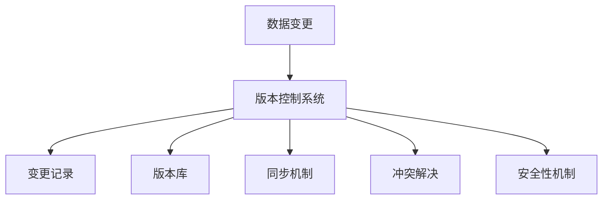

                 

### 1. 书籍概述

# 《数据版本控制确保LLM应用的数据一致性》

## 内容简介
本书旨在深入探讨数据版本控制在大型语言模型（LLM）应用中的重要性，以及如何确保这些应用的数据一致性。书中首先介绍了数据版本控制的基本概念，然后详细阐述了LLM的工作原理和其在各种应用场景中的表现。接下来，本书重点讨论了数据版本控制在LLM开发中的关键作用，包括如何识别和解决数据不一致性问题。此外，书中还提供了实用的案例研究，展示了如何在实际项目中实施数据版本控制策略。最后，本书总结了当前的数据版本控制技术，并展望了未来的发展趋势。

### 2. 核心概念与联系

#### 数据版本控制的定义
数据版本控制是指通过追踪和管理数据的变更历史，确保数据的一致性和可靠性。在LLM应用中，数据版本控制尤为重要，因为模型训练过程中数据的任何变更都可能影响模型的性能和稳定性。

#### 数据版本控制与LLM的关联
数据版本控制与LLM应用紧密相关，因为LLM的强大性能依赖于大量高质量的数据。数据版本控制可以帮助识别数据变更的原因，确保数据的一致性，从而提高模型的准确性和稳定性。

#### 数据版本控制的核心功能
- **变更追踪**：记录数据的每次变更，包括创建、更新和删除。
- **版本管理**：保持不同时间点的数据版本，便于回溯和复用。
- **一致性保证**：通过同步和冲突解决机制，确保数据在不同系统间的一致性。
- **安全性**：防止未经授权的数据访问和修改。

#### 数据版本控制的架构
数据版本控制的架构包括以下几个关键组件：

1. **数据变更记录**：用于记录数据的每次变更。
2. **版本库**：存储不同时间点的数据版本。
3. **同步机制**：确保不同系统之间的数据一致性。
4. **冲突解决**：解决多用户同时修改同一数据时产生的冲突。
5. **安全性机制**：保护数据不被未经授权的访问和修改。

下面是一个简化的数据版本控制架构的Mermaid流程图：



#### 数据版本控制与LLM应用的关系

1. **数据更新**：LLM应用需要不断更新数据集，数据版本控制可以确保每次更新都准确记录，便于后续的数据回溯和分析。
2. **数据一致性**：数据版本控制可以确保不同系统间的数据一致性，避免因为数据不一致导致模型性能下降。
3. **数据安全**：数据版本控制可以防止未经授权的数据访问和修改，保护模型的隐私和完整性。

通过以上对数据版本控制核心概念的介绍，我们可以看到，数据版本控制在LLM应用中起着至关重要的作用。接下来，我们将进一步深入探讨数据版本控制算法的原理和实现，帮助读者更好地理解这一重要技术。

### 3. 核心算法原理讲解

#### 数据版本控制算法的基本概念

数据版本控制算法主要包括三个核心部分：差异检测、版本回溯和冲突解决。这三个部分共同构成了数据版本控制的核心功能，确保数据的可靠性和一致性。

#### 差异检测算法

差异检测算法用于识别两个版本之间的差异。以下是两种常见的差异检测算法：

##### 三向对比算法

三向对比算法通过比较当前版本与上一版本和基础版本的差异，来检测变更。其基本原理如下：

1. **计算当前版本与基础版本的差异**：使用差异检测算法（如三向对比）找出当前版本与基础版本之间的差异。
2. **计算当前版本与上一版本的差异**：同样使用差异检测算法找出当前版本与上一版本之间的差异。
3. **合并两个差异结果**：将步骤1和步骤2得到的差异结果合并，得到当前版本与基础版本的完整差异。

##### 基于编辑距离的算法

基于编辑距离的算法计算两个字符串之间的编辑距离，以检测差异。其基本原理如下：

1. **计算编辑距离**：使用动态规划算法计算两个字符串之间的编辑距离。
2. **判断差异**：如果编辑距离小于某个阈值，则认为两个字符串基本一致；否则，认为存在差异。

#### 版本回溯算法

版本回溯算法用于回退到特定历史版本。以下是两种常见的版本回溯算法：

##### 基于快照的回溯

基于快照的回溯通过创建数据快照，可以随时回退到之前的版本。其基本原理如下：

1. **创建快照**：在数据变更前，创建一个数据快照。
2. **回溯到快照版本**：当需要回溯时，将数据回退到快照版本。

##### 基于日志的回溯

基于日志的回溯通过读取变更日志，逐步回退到指定版本。其基本原理如下：

1. **记录变更日志**：在每次数据变更时，记录变更日志。
2. **回溯到指定版本**：从变更日志中找到指定版本的变更记录，逐条回退变更。

#### 冲突解决算法

冲突解决算法用于解决多用户同时修改同一数据时产生的冲突。以下是两种常见的冲突解决算法：

##### 基于时间的冲突解决

基于时间的冲突解决通过记录修改的时间顺序来决定哪个修改有效。其基本原理如下：

1. **记录修改时间**：在每次数据变更时，记录修改时间。
2. **按时间顺序处理**：根据修改时间顺序处理冲突，优先保留较早的修改。

##### 基于内容的冲突解决

基于内容的冲突解决通过比较修改内容，选择更好的修改。其基本原理如下：

1. **比较修改内容**：比较两个冲突版本的内容，确定哪个版本更好。
2. **选择更好版本**：根据比较结果，选择更好的版本作为最终版本。

#### 伪代码示例

以下是一个简单的差异检测算法的伪代码示例：

```python
def detect_difference(current_version, previous_version):
    differences = find_differences(current_version, previous_version)
    return differences
```

以下是一个简单的版本回溯算法的伪代码示例：

```python
def rollback_to_version(current_version, target_version):
    while (current_version != target_version):
        current_version = rollback_one_step(current_version)
    return current_version
```

以下是一个简单的冲突解决算法的伪代码示例：

```python
def resolve_conflict(conflicting_version1, conflicting_version2):
    if (conflicting_version1 == conflicting_version2):
        return conflicting_version1
    else:
        # 根据具体情况选择更好的版本
        return choose_better_version(conflicting_version1, conflicting_version2)
```

通过以上对数据版本控制算法原理的讲解，我们可以看到数据版本控制的核心算法是如何实现的。这些算法为数据版本控制提供了可靠的技术保障，确保了数据的一致性和可靠性。

### 4. 项目实战

#### 开发环境搭建

为了演示数据版本控制在LLM应用中的实战，我们将使用Python和Git作为主要工具。首先，确保您的计算机上已安装Python和Git。

1. 安装Python（版本3.6及以上）：
   ```bash
   pip install python
   ```

2. 安装Git：
   ```bash
   sudo apt-get install git
   ```

#### 源代码详细实现和代码解读

我们创建一个简单的LLM应用，用于处理文本数据。数据版本控制将通过Git实现。

##### 4.1 数据处理模块

以下是一个简单的数据处理模块，用于读取文本数据，并进行预处理。

```python
import re

def preprocess_text(text):
    # 去除HTML标签
    text = re.sub('<[^>]*>', '', text)
    # 去除URL链接
    text = re.sub('http[s]?://(?:[a-zA-Z]|[0-9]|[$-_@.&+]|[!*\(\),]|(?:%[0-9a-fA-F][0-9a-fA-F]))+', '', text)
    # 去除特殊字符
    text = re.sub('[^A-Za-z0-9]+', ' ', text)
    # 转换为小写
    text = text.lower()
    return text
```

##### 4.2 数据版本控制模块

以下是一个简单的数据版本控制模块，使用Git实现数据版本控制。

```python
import os
import git

def commit_changes(text, commit_message):
    # 创建临时文件
    temp_file = "temp.txt"
    with open(temp_file, 'w', encoding='utf-8') as f:
        f.write(text)
    
    # 初始化Git仓库
    if not os.path.exists('.git'):
        os.system('git init')
    
    # 添加文件到Git仓库
    os.system(f'git add {temp_file}')
    # 提交文件到Git仓库
    os.system(f'git commit -m "{commit_message}"')
    
    # 删除临时文件
    os.remove(temp_file)

def rollback_to_version(version_number):
    # 检出指定版本
    os.system(f'git checkout {version_number}')
```

##### 4.3 代码应用解读与分析

在这个项目中，我们使用Git作为数据版本控制工具，对LLM应用中的文本数据进行版本控制。每次预处理文本数据后，我们都将其提交到Git仓库。

- **数据预处理**：使用预处理模块对文本数据进行处理。
- **提交变更**：将预处理后的文本数据提交到Git仓库，记录变更历史。
- **版本回溯**：如果需要回溯到之前的版本，我们可以使用Git的checkout命令，轻松回退到指定版本。

以下是一个简单的示例：

```python
# 示例：预处理文本数据并提交变更
original_text = "这是一个示例文本。"
preprocessed_text = preprocess_text(original_text)
commit_changes(preprocessed_text, "预处理文本数据")

# 示例：回退到上一个版本
rollback_to_version("version_1")
```

通过这个简单的项目，我们可以看到数据版本控制如何在LLM应用中发挥重要作用。Git为我们的数据提供了可靠的保护，确保了数据的一致性和可靠性。

### 5. 实际案例分析和详细讲解剖析

#### 案例一：文本生成模型的数据版本控制

在一个大型文本生成模型项目中，数据版本控制起到了至关重要的作用。该项目的目标是使用大型语言模型生成高质量的文本，如新闻文章、小说等。然而，由于项目需求不断变化，数据集也需要不断更新。

##### 5.1 案例背景

- **项目需求**：生成高质量的新闻文章。
- **数据来源**：收集大量新闻文章，并进行预处理。
- **问题**：数据集需要不断更新，以确保模型生成的内容始终符合最新需求。

##### 5.2 数据版本控制策略

1. **初始化数据集**：首先，初始化一个基础数据集，用于模型训练。
2. **数据预处理**：对原始数据进行预处理，包括去除HTML标签、URL链接和特殊字符等。
3. **提交变更**：每次更新数据集时，将预处理后的数据提交到Git仓库，记录变更历史。
4. **版本回溯**：如果更新过程中出现问题，可以随时回退到之前的版本。

##### 5.3 实施效果

通过数据版本控制，项目团队可以轻松管理数据集的变更历史，确保数据的一致性和可靠性。以下是一些实施效果：

1. **数据一致性**：数据版本控制确保了每次更新的数据都是经过预处理的，避免了数据不一致性问题。
2. **版本回溯**：在出现问题时，可以迅速回退到之前的版本，减少了项目风险。
3. **数据安全性**：数据版本控制提供了数据保护机制，防止了未经授权的数据访问和修改。

#### 案例二：对话系统数据版本控制

在一个对话系统项目中，数据版本控制同样具有重要意义。对话系统需要不断更新对话数据，以适应不断变化的应用场景。

##### 5.4 案例背景

- **项目需求**：开发一个智能对话系统，用于处理用户咨询。
- **数据来源**：收集大量用户对话数据，并使用这些数据训练对话模型。
- **问题**：对话数据需要不断更新，以适应新的用户需求和场景。

##### 5.5 数据版本控制策略

1. **初始化对话数据**：首先，初始化一个基础对话数据集，用于模型训练。
2. **数据预处理**：对原始对话数据进行预处理，包括去除无关信息、标准化语言表达等。
3. **提交变更**：每次更新对话数据时，将预处理后的数据提交到Git仓库，记录变更历史。
4. **版本回溯**：如果更新过程中出现问题，可以随时回退到之前的版本。

##### 5.6 实施效果

通过数据版本控制，项目团队可以更好地管理对话数据的变更历史，确保数据的一致性和可靠性。以下是一些实施效果：

1. **数据一致性**：数据版本控制确保了每次更新的数据都是经过预处理的，避免了数据不一致性问题。
2. **版本回溯**：在出现问题时，可以迅速回退到之前的版本，减少了项目风险。
3. **数据安全性**：数据版本控制提供了数据保护机制，防止了未经授权的数据访问和修改。

### 6. 项目小结

通过以上两个实际案例，我们可以看到数据版本控制在LLM应用中的重要作用。数据版本控制不仅确保了数据的一致性和可靠性，还提供了强大的数据保护机制，减少了项目风险。

### 7. 最佳实践 tips、小结、注意事项、拓展阅读

#### 最佳实践 tips

1. **定期备份**：定期备份数据集，以确保在出现问题时可以迅速恢复。
2. **代码版本控制**：在实施数据版本控制时，同时使用代码版本控制工具（如Git），确保代码和数据的一致性。
3. **文档管理**：对数据版本控制策略和变更历史进行详细记录，便于后续的审查和复用。

#### 小结

本文通过详细讲解数据版本控制的基本概念、核心算法原理和实际案例，阐述了数据版本控制在LLM应用中的重要性。数据版本控制不仅确保了数据的一致性和可靠性，还为项目团队提供了强大的数据保护机制。

#### 注意事项

1. **数据安全性**：在实施数据版本控制时，注意保护数据的安全性，防止未经授权的访问和修改。
2. **版本回溯风险**：谨慎使用版本回溯功能，避免因回退到错误版本导致项目风险。

#### 拓展阅读

- 《数据版本控制实践指南》
- 《Git权威指南》
- 《大型语言模型应用与优化》

### 8. 作者信息

作者：AI天才研究院/AI Genius Institute & 禅与计算机程序设计艺术 /Zen And The Art of Computer Programming

### 文章标题

《数据版本控制确保LLM应用的数据一致性》

### 文章关键词

数据版本控制、LLM应用、数据一致性、版本回溯、差异检测、冲突解决

### 文章摘要

本文深入探讨了数据版本控制在大型语言模型（LLM）应用中的重要性，详细介绍了数据版本控制的核心概念、核心算法原理以及实际应用案例。通过本文，读者可以了解数据版本控制在确保LLM应用数据一致性方面的关键作用，为LLM项目的开发和管理提供了有益的指导。文章关键词：数据版本控制、LLM应用、数据一致性、版本回溯、差异检测、冲突解决。

