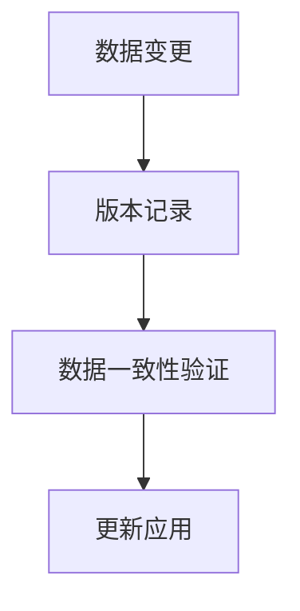

                 

# 数据版本控制：确保LLM应用的数据一致性

## 关键词
- 数据版本控制
- LLM应用
- 数据一致性
- 软件开发
- 数据库管理
- 版本控制工具

## 摘要
本文旨在探讨数据版本控制在大型语言模型（LLM）应用中的重要性。随着LLM在各个行业的广泛应用，数据一致性变得至关重要。本文首先介绍了数据版本控制的基本概念和核心要素，随后详细阐述了数据库版本控制、文件版本控制和代码版本控制三种关键技术。接着，通过实际案例展示了数据版本控制在金融、零售和制造业中的应用，并深入分析了数据版本控制在LLM应用中的角色、挑战和最佳实践。文章最后给出了数据版本控制相关的工具和算法，以及项目实战的具体步骤和代码实现，为读者提供全面的指导和参考。

## 第一部分：数据版本控制的基本概念

### 1.1 数据版本控制的定义
数据版本控制是一种管理数据变更和追踪数据历史的机制。在软件开发生命周期中，数据版本控制确保数据的一致性和准确性，防止数据丢失和错误。

### 1.2 数据版本控制的重要性
数据版本控制的重要性体现在以下几个方面：
- **数据完整性**：通过版本控制，可以确保数据在变更过程中的完整性和一致性。
- **回溯与恢复**：当出现数据错误或系统故障时，可以快速回溯到之前的数据版本，进行恢复。
- **协同工作**：版本控制使得多人在同一数据集上进行修改时，能够协同工作，避免冲突。
- **合规性**：在金融、医疗等行业，数据版本控制有助于满足法规要求，确保数据可追溯和审计。

### 1.3 数据版本控制的挑战
- **数据量大**：随着数据量的增加，版本控制系统的性能和存储需求会显著上升。
- **复杂关系**：数据之间的关系复杂，版本控制需要准确处理这些关系，以避免数据不一致。
- **实时性**：在需要实时处理数据的应用中，版本控制需要保证操作的实时性和一致性。

### 1.4 数据版本控制的核心要素
数据版本控制的核心要素包括：
- **版本标识**：为每个数据版本分配唯一的标识，方便追踪和管理。
- **变更记录**：记录每次数据变更的详细信息，包括变更时间、变更人员、变更内容等。
- **数据备份**：定期备份数据，以防数据丢失或损坏。
- **一致性验证**：在数据变更后，进行一致性验证，确保数据的有效性和正确性。

## 第一部分：数据版本控制的核心技术

### 1.1 数据库版本控制

#### 1.1.1 数据库版本控制的基本原理
数据库版本控制通过在数据库中创建多个版本的历史记录来管理数据变更。每次数据变更都会生成一个新的版本，同时保留旧版本的记录，以便回溯和比较。

#### 1.1.2 数据库版本控制工具
常见的数据库版本控制工具有：
- **PostgreSQL**：支持内置的版本控制功能，可以通过`CREATE TABLE AS`命令创建新版本。
- **MySQL**：支持使用`SAVEPOINT`和`ROLLBACK TO SAVEPOINT`进行版本控制。
- **Oracle**：提供`DBMS_REPCAT`包，用于数据库版本控制。

#### 1.1.3 数据库版本控制的应用场景
数据库版本控制适用于以下应用场景：
- **数据迁移**：在数据迁移过程中，可以使用版本控制来确保数据的一致性和准确性。
- **数据审计**：在需要审计数据变更的场景中，版本控制可以帮助追溯数据的历史记录。

### 1.2 文件版本控制

#### 1.2.1 文件版本控制的基本原理
文件版本控制通过在文件系统中跟踪文件的多个版本来管理文件的变更。每次文件修改都会生成一个新的版本，同时保留旧版本的副本。

#### 1.2.2 文件版本控制工具
常见的文件版本控制工具有：
- **Git**：一款流行的分布式版本控制工具，适用于源代码管理。
- **SVN**：一款集中式版本控制工具，适用于文档、网站等文件的版本控制。
- **Mercurial**：一款轻量级的分布式版本控制工具，与Git类似。

#### 1.2.3 文件版本控制的应用场景
文件版本控制适用于以下应用场景：
- **软件开发**：在软件开发过程中，版本控制可以帮助管理代码的多个版本，确保协作的顺利进行。
- **文档管理**：在文档管理中，版本控制可以确保文档的历史记录完整性和可追溯性。

### 1.3 代码版本控制

#### 1.3.1 代码版本控制的基本原理
代码版本控制通过在代码库中跟踪代码的多个版本来管理代码的变更。每次代码提交都会生成一个新的版本，同时保留旧版本的代码。

#### 1.3.2 代码版本控制工具
常见的代码版本控制工具有：
- **Git**：适用于大型项目和分布式团队协作。
- **SVN**：适用于中小型项目和单机工作环境。
- **Mercurial**：适用于个人项目和中小型团队协作。

#### 1.3.3 代码版本控制的应用场景
代码版本控制适用于以下应用场景：
- **软件开发**：在软件开发过程中，版本控制可以确保代码的完整性和可追溯性，提高开发效率。
- **项目管理**：在项目管理中，版本控制可以帮助追踪项目的进度和变更，确保项目的顺利进行。

## 第一部分：数据版本控制的应用与实践

### 1.1 数据版本控制在不同行业中的应用

#### 1.1.1 金融行业的数据版本控制
在金融行业，数据版本控制至关重要，主要用于确保交易数据的准确性和一致性。例如，在股票交易系统中，每次交易都会生成一个版本记录，确保交易历史清晰可查。

#### 1.1.2 零售行业的数据版本控制
在零售行业，数据版本控制用于管理商品信息、库存数据和销售记录等。通过版本控制，可以确保商品信息的实时更新和库存数据的一致性。

#### 1.1.3 制造业的数据版本控制
在制造业，数据版本控制主要用于管理生产数据、设备数据和工艺参数等。通过版本控制，可以确保生产数据的准确性和一致性，提高生产效率和产品质量。

### 1.2 数据版本控制的实践案例

#### 1.2.1 案例一：如何确保金融交易数据的一致性
在金融交易系统中，数据版本控制通过以下步骤确保数据一致性：
1. **数据录入**：每次交易发生后，将交易数据录入系统。
2. **版本记录**：生成交易版本记录，包含交易详情和版本号。
3. **一致性验证**：在每次交易完成后，对交易数据进行一致性验证，确保交易数据的准确性和一致性。
4. **数据备份**：定期备份交易数据，以防数据丢失或损坏。

#### 1.2.2 案例二：如何保障电商商品数据的更新
在电商系统中，商品数据版本控制通过以下步骤确保数据更新：
1. **商品信息录入**：将商品信息录入系统，包括商品名称、价格、库存等。
2. **版本记录**：生成商品信息版本记录，包含商品信息的变更时间和版本号。
3. **数据一致性验证**：在商品信息更新时，对商品信息进行一致性验证，确保数据的准确性和一致性。
4. **实时同步**：通过实时同步机制，将更新后的商品信息同步到所有相关系统。

#### 1.2.3 案例三：如何管理制造业的生产数据
在制造业的生产数据管理中，数据版本控制通过以下步骤确保生产数据的一致性和准确性：
1. **数据采集**：通过传感器和设备采集生产数据，包括生产进度、设备状态等。
2. **版本记录**：生成生产数据版本记录，包含采集时间和版本号。
3. **数据一致性验证**：在生产数据变更时，对生产数据进行一致性验证，确保数据的准确性和一致性。
4. **数据分析**：通过数据分析工具，对生产数据进行深入分析，优化生产流程和设备管理。

## 第一部分：数据版本控制与LLM应用

### 1.1 数据版本控制在LLM应用中的作用
数据版本控制在LLM应用中起着至关重要的作用，确保模型训练数据的一致性和准确性。以下是数据版本控制在LLM应用中的几个关键作用：
- **数据同步**：确保LLM模型在不同环境（如开发环境、测试环境和生产环境）中的数据一致。
- **数据校验**：通过数据版本控制，可以定期校验模型训练数据的质量，确保数据的准确性和一致性。
- **数据追溯**：在模型训练过程中，数据版本控制可以帮助追溯数据的来源和变更历史，方便问题的排查和解决。

### 1.2 数据版本控制在LLM应用中的挑战
在LLM应用中，数据版本控制面临以下挑战：
- **数据量大**：LLM模型训练数据通常非常庞大，版本控制系统的性能和存储需求高。
- **数据实时性**：在实时应用场景中，数据版本控制需要保证操作的实时性和一致性，以支持快速的数据更新和模型调整。
- **数据多样性**：LLM模型训练数据包括文本、图像、音频等多种类型，版本控制需要处理这些不同类型数据的版本管理和同步。

### 1.3 数据版本控制在LLM应用中的最佳实践
为了在LLM应用中有效地实施数据版本控制，以下是一些最佳实践：
- **使用分布式版本控制系统**：如Git，可以更好地处理大规模数据的版本控制。
- **数据同步机制**：建立数据同步机制，确保在不同环境中的数据一致。
- **数据校验和监控**：定期校验模型训练数据的质量，并实时监控数据变更，确保数据的一致性和准确性。
- **自动化流程**：通过自动化工具和脚本，简化数据版本控制流程，提高工作效率。

### 1.4 数据版本控制在LLM应用中的未来趋势
随着LLM技术的不断发展和应用场景的拓展，数据版本控制在未来将呈现以下趋势：
- **智能化**：数据版本控制系统将更加智能化，能够自动识别和解决数据变更中的冲突和问题。
- **多模态数据支持**：版本控制系统将支持多种类型的数据版本控制，如文本、图像、音频等。
- **云原生**：数据版本控制系统将逐步实现云原生架构，更好地支持大规模数据处理的实时性和灵活性。

## 附录

### 附录A：数据版本控制相关工具

#### 附录A.1：Git——一款强大的分布式版本控制工具
Git是一款分布式版本控制工具，适用于源代码管理、文档管理等多种场景。以下是Git的基本使用方法：
- **安装和配置**：在安装Git后，需要配置用户信息，包括用户名和邮箱。
- **基本命令**：包括`git clone`、`git commit`、`git push`、`git pull`等。
- **分支管理**：通过分支管理，可以轻松实现代码的并行开发和管理。

#### 附录A.2：SVN——一款集中式版本控制工具
SVN是一款集中式版本控制工具，适用于中小型项目和单机工作环境。以下是SVN的基本使用方法：
- **安装和配置**：在安装SVN后，需要配置版本库和用户权限。
- **基本命令**：包括`svn checkout`、`svn commit`、`svn update`等。
- **合并和冲突解决**：在多人协作开发中，SVN可以帮助解决代码合并和冲突。

#### 附录A.3：Mercurial——一款轻量级的分布式版本控制工具
Mercurial是一款轻量级的分布式版本控制工具，与Git类似，适用于多种场景。以下是Mercurial的基本使用方法：
- **安装和配置**：在安装Mercurial后，需要配置用户信息。
- **基本命令**：包括`hg clone`、`hg commit`、`hg push`、`hg pull`等。
- **分支管理**：通过分支管理，可以轻松实现代码的并行开发和管理。

## 核心概念与联系
数据版本控制的核心概念包括版本标识、变更记录、数据备份和数据一致性验证。这些概念之间的关系可以用Mermaid流程图表示：



### 数据版本控制算法
数据版本控制算法的核心是确保数据的一致性和准确性。以下是一个简化的数据版本控制算法的伪代码：

```
function data_version_control(data, version_list):
    for each version in version_list:
        if version is the latest version:
            apply_version(data, version)
        else:
            merge_version(data, version)
    return data
```

### 数据版本控制中的哈希算法
在数据版本控制中，哈希算法用于生成数据的唯一标识。以下是一个简单的哈希算法的数学模型：

$$
H = hash(data)
$$

### 数据一致性验证的阈值
在数据一致性验证中，可以使用哈希值的差异作为衡量一致性的指标。以下是一个简单的一致性验证阈值公式：

$$
threshold = \frac{1}{n} * \sum_{i=1}^{n} |H_i - H_{i'}|
$$

其中，$H_i$和$H_{i'}$分别是第$i$次和第$i'$次哈希值，$n$是哈希值的总数。

## 项目实战

### 实战一：使用Git进行数据版本控制

#### 开发环境搭建
1. **安装Git**：在操作系统上安装Git。
2. **创建版本库**：使用`git init`命令创建一个新的Git版本库。

#### 源代码实现
1. **添加文件**：将需要版本控制的文件添加到版本库中，使用`git add .`命令。
2. **提交版本**：将文件提交到版本库，使用`git commit -m "初始化版本"`命令。

#### 代码解读与分析
1. **初始化版本库**：创建一个新的Git版本库。
2. **添加文件到版本库**：将文件添加到版本库中。
3. **提交版本更改**：将文件提交到版本库，生成一个新的版本记录。

### 实战二：使用数据库进行版本控制

#### 开发环境搭建
1. **安装数据库**：安装PostgreSQL或其他数据库。
2. **创建数据库**：创建一个新的数据库。

#### 源代码实现
1. **创建版本表**：创建一个版本表，用于记录数据版本的历史。
   ```sql
   CREATE TABLE version (
       id SERIAL PRIMARY KEY,
       version_number INT,
       data BYTEA,
       created_at TIMESTAMP
   );
   ```
2. **数据变更**：在每次数据变更时，将变更数据插入版本表。
   ```sql
   INSERT INTO version (version_number, data, created_at)
   VALUES (nextval('version_number_seq'), data, now());
   ```

#### 代码解读与分析
1. **初始化数据库**：创建数据库和版本表。
2. **数据变更**：在每次数据变更时，记录变更数据到版本表。
3. **数据回溯**：在需要回溯时，可以根据版本号查询版本表，回溯到指定版本的数据。

### 实战三：使用文件版本控制

#### 开发环境搭建
1. **安装版本控制工具**：安装Git、SVN或Mercurial等版本控制工具。
2. **创建项目文件夹**：创建一个新的项目文件夹。

#### 源代码实现
1. **初始化版本库**：在项目文件夹中初始化版本库。
   ```bash
   git init
   ```
2. **提交版本**：将项目文件提交到版本库。
   ```bash
   git add .
   git commit -m "初始化版本"
   ```

#### 代码解读与分析
1. **初始化版本库**：在项目文件夹中创建版本库。
2. **提交版本更改**：将项目文件提交到版本库，生成新的版本记录。
3. **数据回溯**：在需要回溯时，使用版本控制工具查看历史版本，并恢复到指定版本。

### 项目小结
数据版本控制在现代软件开发中起着至关重要的作用。通过合理的数据版本控制，可以确保数据的一致性和准确性，提高系统的稳定性和可靠性。在实际项目中，可以根据需求选择合适的版本控制工具和技术，结合具体场景进行实施。

### 最佳实践 Tips
- **定期备份**：定期备份数据，以防数据丢失或损坏。
- **一致性验证**：在数据变更后，进行一致性验证，确保数据的准确性和完整性。
- **多人协作**：在多人协作开发中，合理使用分支管理，避免冲突。
- **自动化流程**：通过自动化工具和脚本，简化版本控制流程，提高工作效率。

### 注意事项
- **数据安全**：在数据版本控制中，确保数据的安全性和隐私性。
- **版本兼容性**：在数据变更时，考虑版本兼容性，确保不同版本的数据可以顺利切换。
- **性能优化**：在处理大规模数据时，注意性能优化，提高版本控制系统的效率。

### 拓展阅读
- [Git官方文档](https://git-scm.com/docs)
- [PostgreSQL官方文档](https://www.postgresql.org/docs/)
- [数据一致性验证算法研究](https://www.researchgate.net/publication/328756509_Altmetric_top_100_2021_Data_validation_algorithms_for_data_management_systems)
- [版本控制工具比较分析](https://www.tutorialspoint.com/computer_tutorials/developer_tutorials/version_control_tools_comparison.htm)

## 总结
数据版本控制是确保LLM应用数据一致性的关键。通过合理的数据版本控制，可以保障数据的完整性、一致性和可追溯性，提高系统的稳定性和可靠性。本文详细阐述了数据版本控制的基本概念、核心技术、应用与实践，以及与LLM应用的关系，为读者提供了全面的指导和参考。通过本文的学习，读者可以更好地理解和应用数据版本控制技术，提高软件开发和维护的效率和质量。作者：AI天才研究院/AI Genius Institute & 禅与计算机程序设计艺术 /Zen And The Art of Computer Programming

