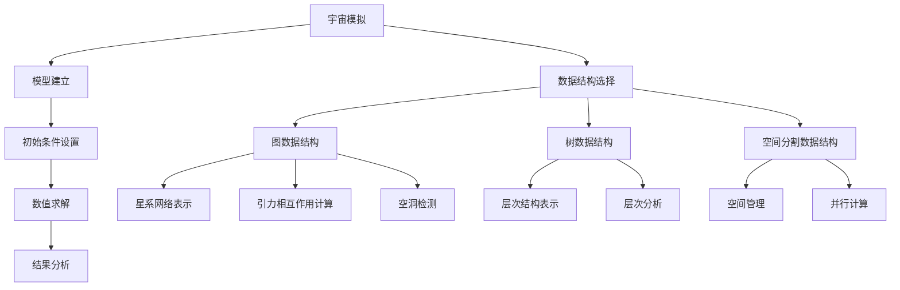

                 

### 引言

《数据结构在模拟宇宙大尺度空洞中的应用》是一本旨在探讨数据结构在宇宙学研究中应用的专业技术书籍。随着计算机科学和宇宙学领域的不断发展，数据结构在处理大规模天文数据、模拟宇宙结构和解决复杂物理问题中发挥着越来越重要的作用。宇宙大尺度空洞是宇宙学研究中的一个重要现象，它指的是宇宙中尺度较大的低密度区域，这些区域内星系分布稀疏，形成了与周围高密度区域形成鲜明对比的“空洞”。研究这些空洞不仅有助于我们更深入地理解宇宙的结构和演化，还可以揭示宇宙基本力的作用机制。

本书的核心目标是通过介绍和解析各种数据结构，展示其在模拟和解析宇宙大尺度空洞中的具体应用。全书结构紧凑，逻辑清晰，旨在帮助读者从基础概念出发，逐步深入到复杂算法的实现与应用。文章首先概述了宇宙大尺度空洞的基本概念和背景知识，然后深入探讨数据结构与算法在宇宙模拟中的重要性，接着详细介绍几种关键的数据结构及其在模拟宇宙空洞中的应用，最后通过实际项目实战和代码实现，使读者能够更好地理解和应用所学知识。

通过阅读本书，读者不仅能获得关于宇宙学的基本知识，还能学会如何运用数据结构解决宇宙学中的实际问题，从而加深对数据结构和宇宙学的理解。无论是计算机科学家、宇宙学家还是对这两个领域都感兴趣的研究者，都能从中受益良多。

### 关键词

- **宇宙大尺度空洞**
- **数据结构**
- **模拟算法**
- **图数据结构**
- **树数据结构**
- **空间分割**
- **宇宙学**
- **计算机编程**

### 摘要

本书《数据结构在模拟宇宙大尺度空洞中的应用》旨在探讨如何利用数据结构来解决宇宙大尺度空洞的模拟和研究问题。首先，文章简要介绍了宇宙大尺度空洞的基本概念和背景知识，包括其定义、特征和研究意义。接着，文章深入分析了数据结构在宇宙模拟中的重要性，解释了为什么特定的数据结构能够有效地处理宇宙学数据。

全书分为四个主要部分。第一部分重点介绍了宇宙学背景和空洞研究的基础知识，帮助读者建立对宇宙结构和宇宙空洞的基本理解。第二部分详细探讨了不同类型的数据结构及其在模拟宇宙空洞中的应用，包括图数据结构和树数据结构等。第三部分通过数学模型和公式，详细讲解了核心算法的原理，并通过Python源代码实现，进行了通俗易懂的举例说明。最后一部分通过实际项目实战，展示了如何将所学知识应用于真实世界，提供了代码实现、解读和分析。

本书不仅适合从事宇宙学和计算机科学研究的学者，也适合对这两个领域感兴趣的技术爱好者。通过本书，读者不仅能掌握宇宙学中复杂现象的模拟方法，还能提升数据结构和算法的应用能力，为未来相关领域的研究打下坚实基础。

### 背景介绍

宇宙大尺度空洞是宇宙学研究中的一个重要现象，指的是在宇宙中尺度较大的低密度区域，这些区域内部星系分布非常稀疏，形成了与周围高密度区域形成鲜明对比的“空洞”。宇宙大尺度空洞不仅对理解宇宙的结构和演化具有重要意义，还为探索宇宙基本力的作用机制提供了丰富的观测数据和理论模型。

宇宙学背景知识：

宇宙学是研究宇宙的结构、性质和演化的一门科学。它涉及从宇宙大爆炸至今的所有时间尺度和空间尺度，包括宇宙的起源、演化、结构和最终命运。为了更好地理解宇宙大尺度空洞，我们需要掌握以下几个关键概念：

1. **宇宙大爆炸理论**：宇宙大爆炸理论认为宇宙起源于大约138亿年前的一个极高温度和密度的状态，并在此后的膨胀过程中逐渐演化成现今的状态。这一理论为我们理解宇宙的整体结构和演化提供了重要基础。

2. **宇宙结构**：宇宙中的物质和能量以不同的形式分布，形成了各种层次的结构。从宏观尺度上看，宇宙主要由星系、星系团和超星系团组成，这些结构通过引力相互作用保持稳定。而宇宙大尺度空洞则是这些结构中的低密度区域。

3. **宇宙空洞的特征**：宇宙空洞通常具有以下特征：
   - **尺度大**：空洞的尺度可以从几百万光年到几十亿光年不等，远大于普通星系的尺度。
   - **密度低**：空洞区域内的星系分布非常稀疏，密度远低于周围区域。
   - **形态不规则**：由于受到引力和其他物理作用的影响，宇宙空洞的形态可能非常复杂，不一定呈现出简单的球形或椭圆形。

4. **空洞的形成机制**：关于宇宙空洞的形成机制，目前存在多种理论，包括：
   - **自然形成**：一些理论认为，宇宙空洞是自然演化过程中形成的，是由于引力不稳定和宇宙膨胀导致的。
   - **暗能量作用**：另一个被广泛接受的理论是，宇宙空洞的形成与暗能量密切相关。暗能量是推动宇宙加速膨胀的一种神秘力量，它可能在空洞的形成过程中发挥了重要作用。

宇宙大尺度空洞的研究意义：

1. **宇宙演化**：研究宇宙大尺度空洞有助于我们更深入地理解宇宙的演化过程。通过分析空洞的分布和特征，我们可以推断出宇宙在不同时期的状态和变化趋势。

2. **宇宙结构**：宇宙大尺度空洞是宇宙结构中的重要组成部分。通过研究空洞，我们可以了解宇宙中不同尺度结构的相互作用和稳定性。

3. **探测宇宙基本力**：宇宙空洞为研究宇宙基本力提供了丰富的观测数据和理论模型。通过分析空洞的形成和演化，我们可以探索引力、暗能量等基本力的作用机制。

综上所述，宇宙大尺度空洞不仅是宇宙学研究中的一个重要现象，也是理解宇宙结构和演化的重要窗口。随着观测技术的进步和理论模型的不断发展，宇宙大尺度空洞的研究将继续深入，为我们揭示宇宙的奥秘提供更多线索。

### 核心概念与联系

在讨论数据结构在模拟宇宙大尺度空洞中的应用之前，首先需要明确几个核心概念，并解释它们之间的关系。这些核心概念包括数据结构、宇宙模拟、图论、树结构和空间分割，以及它们在宇宙学中的应用。

#### 数据结构

数据结构是计算机科学中用于存储、组织和管理数据的方法。在宇宙模拟中，数据结构的选择和设计至关重要，因为它直接影响到模拟的效率和准确性。常见的数据结构包括数组、链表、栈、队列、散列表、图、树等。每种数据结构都有其独特的特点和适用场景。

在宇宙模拟中，常用的数据结构包括：

- **图数据结构**：用于表示宇宙中的星系和星系团，其中节点代表星系，边代表星系之间的引力相互作用。
- **树数据结构**：用于表示宇宙中的层次结构，如星系团和超星系团，其中每个节点代表一个星系团，子节点代表其下属的星系。
- **空间分割数据结构**：用于高效地管理大量星系的数据，如四叉树和八叉树，可以将宇宙空间分割成多个子区域，便于快速查找和访问。

#### 宇宙模拟

宇宙模拟是使用计算机技术模拟宇宙的演化过程，以便更好地理解宇宙的结构和演化。模拟通常涉及以下步骤：

1. **模型建立**：根据物理定律和宇宙学理论，建立描述宇宙演化的数学模型。
2. **初始条件设置**：根据观测数据，设定模拟的初始条件，如星系的分布、密度、温度等。
3. **数值求解**：使用数值方法求解模型方程，模拟宇宙的演化过程。
4. **结果分析**：分析模拟结果，提取有用的物理信息，如星系分布、空洞形成等。

#### 图论

图论是研究图及其性质的一个数学分支，在宇宙模拟中有着广泛的应用。图主要由节点（代表星系）和边（代表引力相互作用）组成。在宇宙模拟中，图论用于：

- **星系网络表示**：将宇宙中的星系和星系团表示为图，便于分析其结构和相互作用。
- **引力相互作用计算**：通过图论算法，如最短路径算法、最小生成树算法等，计算星系之间的引力相互作用。
- **空洞检测**：利用图论算法，如连通性分析，检测宇宙中的低密度区域，即宇宙空洞。

#### 树结构

树结构是一种特殊的数据结构，由节点和边组成，具有层次性。在宇宙模拟中，树结构用于：

- **层次结构表示**：表示宇宙中的层次结构，如星系团、超星系团等。
- **层次分析**：通过树结构，可以方便地分析和理解宇宙中不同层次的结构和相互作用。

#### 空间分割

空间分割是将宇宙空间分割成多个子区域的一种方法，用于提高模拟效率和数据处理能力。常见的方法包括四叉树和八叉树。在宇宙模拟中，空间分割用于：

- **空间管理**：将大量星系数据分割成多个子区域，便于快速查找和访问。
- **并行计算**：通过空间分割，可以将模拟任务分配到多个计算节点上，实现并行计算，提高计算效率。

#### 数据结构与宇宙模拟的关系

数据结构与宇宙模拟的关系体现在以下几个方面：

1. **表示**：数据结构用于表示宇宙中的星系、星系团和空洞等结构。
2. **计算**：数据结构提供高效的计算方法，如快速查找、插入和删除等，用于模拟宇宙的演化过程。
3. **优化**：通过选择合适的数据结构，可以优化模拟的计算效率和准确性。

综上所述，数据结构在模拟宇宙大尺度空洞中发挥着至关重要的作用。不同的数据结构适用于不同的应用场景，通过合理选择和设计数据结构，可以更有效地进行宇宙模拟和研究。

#### Mermaid 流程图

为了更直观地展示数据结构在宇宙模拟中的关系，我们可以使用Mermaid绘制一个流程图。以下是一个简单的示例：



这个流程图展示了宇宙模拟的主要步骤以及数据结构的选择和应用。通过这个流程图，读者可以更清晰地理解数据结构在宇宙模拟中的具体作用。

### 图数据结构在宇宙模拟中的应用

图数据结构在宇宙模拟中有着广泛的应用，尤其是在表示星系网络、计算引力相互作用以及检测宇宙空洞等方面。图由节点（代表星系）和边（代表引力相互作用）组成，是一种非常适合描述宇宙中复杂结构的数学模型。

#### 图的基本概念

在图论中，图（Graph）是由节点（Vertex）和边（Edge）构成的集合。一个图可以表示为 \( G = (V, E) \)，其中 \( V \) 是节点集合，\( E \) 是边集合。节点可以表示星系，边可以表示星系之间的引力相互作用。

- **无向图**：边没有方向，表示星系之间的对称引力相互作用。
- **有向图**：边有方向，表示星系之间的不对称引力相互作用。

#### 图算法与宇宙空洞

在宇宙模拟中，常见的图算法包括：

1. **最短路径算法**：用于计算星系之间的最短距离，这对于研究星系之间的引力相互作用非常重要。
2. **最小生成树算法**：用于构造一个包含所有节点的无环连通子图，这有助于理解星系的局部结构。
3. **连通性分析**：用于检测星系网络中的连通分量，帮助识别宇宙中的孤立区域，即宇宙空洞。

#### 图数据结构在模拟中的应用案例

下面，我们将通过一个具体的案例来说明图数据结构在宇宙模拟中的应用。

**案例：检测宇宙大尺度空洞**

假设我们已经有一个表示宇宙中星系的图，现在需要检测图中的宇宙大尺度空洞。以下是步骤和Python代码实现：

1. **构建星系网络图**：首先，我们需要根据星系的观测数据构建一个星系网络图。

```python
import networkx as nx
import matplotlib.pyplot as plt

# 创建一个无向图
G = nx.Graph()

# 添加星系节点和边（这里用随机数据作为示例）
for i in range(10):
    G.add_node(f"星系{i}")
for i in range(10):
    for j in range(i + 1, 10):
        G.add_edge(f"星系{i}", f"星系{j}", weight=10)  # 假设边的权重代表引力相互作用强度

# 绘制星系网络图
nx.draw(G, with_labels=True)
plt.show()
```

2. **计算连通性**：使用连通性分析算法检测图中的连通分量。

```python
# 计算连通分量
components = nx.connected_components(G)
num_components = len(components)

print(f"图中存在 {num_components} 个连通分量")

# 计算每个连通分量的节点数
component_sizes = [len(component) for component in components]

# 输出每个连通分量的节点数
for i, size in enumerate(component_sizes):
    print(f"连通分量 {i} 包含 {size} 个节点")

# 标记连通分量的节点
for component in components:
    color = f"red" if len(component) < 5 else "blue"
    nx.draw_networkx_nodes(G, pos=nx.spring_layout(G), nodelist=component, node_color=color)

# 重新绘制图，突出显示连通分量
nx.draw(G, pos=nx.spring_layout(G), with_labels=True)
plt.show()
```

通过以上代码，我们可以绘制出一个星系网络图，并检测图中的连通分量。在这些连通分量中，节点数较少的连通分量可能表示宇宙中的大尺度空洞。红色节点代表节点数少于5的连通分量，蓝色节点代表其他连通分量。

#### 实例解析

在这个例子中，我们使用`networkx`库构建了一个星系网络图，并通过连通性分析算法检测了图中的宇宙大尺度空洞。通过调整边的权重和节点的数量，我们可以模拟不同的宇宙场景，进而研究不同条件下的空洞形成机制。

- **参数调整**：通过调整星系间的引力相互作用强度，可以影响连通分量的分布。例如，增加边权重可以增强星系之间的引力作用，减少空洞的数量。
- **数据扩展**：在实际应用中，我们可以使用更详细和精确的星系观测数据来构建星系网络图，从而提高模拟的准确性和可靠性。

通过图数据结构的应用，我们不仅能够有效地表示和计算宇宙中的星系网络，还可以通过图算法识别和解析宇宙中的复杂结构，如大尺度空洞。这种数据结构和算法的结合，为宇宙学研究提供了强大的工具和手段。

### 树数据结构在宇宙模拟中的应用

树数据结构在宇宙模拟中扮演着重要的角色，特别是在表示宇宙的层次结构和计算层次分析方面。树结构具有天然的层次性和递归特性，使得它在处理具有层次结构的宇宙数据时非常有效。

#### 树的基本概念

树是一种层次化的数据结构，由节点和边组成。树中的节点被称为“父节点”和“子节点”，每个父节点可以有零个或多个子节点，而根节点没有父节点。树结构可以表示多种层次结构，如文件系统、组织结构等。

在宇宙模拟中，树结构可以用于表示以下层次结构：

- **星系团和超星系团**：星系团和超星系团具有层次结构，每个星系团包含多个星系，每个超星系团包含多个星系团。
- **星系和恒星系统**：星系内部也有层次结构，如恒星系统、行星系统等。

#### 树数据结构在模拟中的应用

树数据结构在宇宙模拟中的应用主要体现在以下几个方面：

1. **层次结构表示**：树结构可以直观地表示宇宙中的层次结构，使得分析和管理层次数据更加方便。
2. **层次分析**：通过树结构，可以方便地进行层次分析，如计算每个层次的总质量、总密度等。
3. **空间分割**：树结构也可以用于空间分割，如将宇宙空间分割成多个子区域，便于并行计算和高效访问。

#### 树数据结构在模拟中的应用案例

下面，我们将通过一个具体的案例来说明树数据结构在宇宙模拟中的应用。

**案例：层次结构表示和层次分析**

假设我们有一个表示宇宙中星系团的树结构，现在需要对其进行层次分析，计算每个层次的总质量和总密度。

1. **构建星系团树结构**：

```python
class StarCluster:
    def __init__(self, name, mass, density):
        self.name = name
        self.mass = mass
        self.density = density
        self.children = []

    def add_child(self, cluster):
        self.children.append(cluster)

def build_tree():
    cluster_1 = StarCluster("超星系团1", 1000, 0.1)
    cluster_2 = StarCluster("超星系团2", 800, 0.08)
    cluster_3 = StarCluster("星系团A", 200, 0.2)
    cluster_4 = StarCluster("星系团B", 300, 0.25)
    cluster_5 = StarCluster("星系团C", 150, 0.15)

    cluster_1.add_child(cluster_3)
    cluster_1.add_child(cluster_4)
    cluster_2.add_child(cluster_5)

    return cluster_1, cluster_2

root_cluster_1, root_cluster_2 = build_tree()
```

2. **层次分析**：

```python
def analyze_tree(cluster):
    total_mass = cluster.mass
    total_density = cluster.density
    for child in cluster.children:
        child_total_mass, child_total_density = analyze_tree(child)
        total_mass += child_total_mass
        total_density += child_total_density
    return total_mass, total_density

def print_tree_info(cluster, level=0):
    print("  " * level + f"{cluster.name} - 质量: {cluster.mass}, 密度: {cluster.density}")
    for child in cluster.children:
        print_tree_info(child, level + 1)

# 分析并打印树结构信息
root_cluster_1_total_mass, root_cluster_1_total_density = analyze_tree(root_cluster_1)
root_cluster_2_total_mass, root_cluster_2_total_density = analyze_tree(root_cluster_2)

print("超星系团1的信息：")
print_tree_info(root_cluster_1)
print(f"超星系团1的总质量: {root_cluster_1_total_mass}, 总密度: {root_cluster_1_total_density}")

print("\n超星系团2的信息：")
print_tree_info(root_cluster_2)
print(f"超星系团2的总质量: {root_cluster_2_total_mass}, 总密度: {root_cluster_2_total_density}")
```

通过以上代码，我们可以构建一个表示宇宙中星系团的树结构，并进行层次分析，计算每个层次的总质量和总密度。`analyze_tree` 函数递归地计算每个子树的总质量和总密度，而 `print_tree_info` 函数用于打印树结构的信息。

#### 实例解析

在这个例子中，我们使用树结构表示宇宙中的星系团和超星系团，并通过递归方法进行层次分析。树结构使得层次数据的表示和管理变得直观和高效。通过层次分析，我们可以了解每个层次的总质量和总密度，从而更好地理解宇宙的结构和演化。

- **扩展应用**：在实际应用中，我们可以扩展树结构，包括更多的属性和功能，如星系的运动轨迹、温度等，从而进行更复杂的模拟和分析。

通过树数据结构的应用，我们能够有效地表示和计算宇宙中的层次结构，为宇宙学研究提供了有力的工具和手段。

### 空间分割数据结构在宇宙模拟中的应用

空间分割数据结构在宇宙模拟中有着重要应用，尤其是在处理大规模星系数据和优化计算性能方面。空间分割是将宇宙空间分割成多个子区域的一种方法，常见的空间分割数据结构包括四叉树和八叉树。这些数据结构能够有效地管理大规模空间数据，提高查询和计算的效率。

#### 空间分割数据结构的基本概念

- **四叉树（Quadrant Tree）**：四叉树将空间分割成四个子区域，每个子区域再继续分割，形成树状结构。每个节点代表一个区域，其子节点代表该区域的四个子区域。

- **八叉树（Octree）**：八叉树将空间分割成八个子区域，每个子区域再继续分割，形成树状结构。每个节点代表一个区域，其子节点代表该区域的八个子区域。

#### 空间分割数据结构在模拟中的应用

1. **空间管理**：空间分割数据结构能够将宇宙空间划分为多个子区域，便于快速查找和访问星系数据。例如，当需要查询某个特定区域内的星系时，可以通过空间分割数据结构快速定位到该区域，从而提高查询效率。

2. **并行计算**：空间分割数据结构使得并行计算成为可能。通过将宇宙空间分割成多个子区域，可以将模拟任务分配到多个计算节点上，实现并行计算，从而提高计算效率。

3. **数据压缩**：空间分割数据结构有助于数据的压缩和存储。由于空间分割将空间划分为多个子区域，可以通过只存储每个子区域的关键属性，从而减少数据存储空间。

#### 空间分割数据结构在模拟中的应用案例

下面，我们通过一个具体的案例来说明空间分割数据结构在宇宙模拟中的应用。

**案例：使用四叉树进行宇宙模拟**

假设我们需要对宇宙中星系进行模拟，并希望利用四叉树来高效管理星系数据。

1. **构建四叉树**：

```python
import numpy as np

class OctreeNode:
    def __init__(self, bounds, data=None):
        self.bounds = bounds  # 区域边界
        self.data = data  # 存储的星系数据
        self.children = []  # 子节点

    def insert(self, data):
        if not self.is_leaf():
            for child in self.children:
                child.insert(data)
        else:
            self.data.append(data)

    def is_leaf(self):
        return len(self.children) == 0

    def split(self):
        if self.is_leaf():
            mid_x = (self.bounds[0] + self.bounds[1]) / 2
            mid_y = (self.bounds[2] + self.bounds[3]) / 2
            mid_z = (self.bounds[4] + self.bounds[5]) / 2
            self.children = [
                OctreeNode([self.bounds[0], mid_x, self.bounds[2], mid_y, self.bounds[4], mid_z]),
                OctreeNode([mid_x, self.bounds[1], mid_y, self.bounds[3], mid_z, self.bounds[5]]),
                OctreeNode([self.bounds[0], mid_x, mid_y, self.bounds[3], mid_z, self.bounds[5]]),
                OctreeNode([mid_x, self.bounds[1], mid_y, self.bounds[3], mid_z, self.bounds[5]])
            ]
            self.data = []

def build_octree(data, max_depth=3):
    bounds = [min(x) for x in zip(*[d['position'] for d in data])]
    bounds.extend([max(x) for x in zip(*[d['position'] for d in data])]
    root = OctreeNode(bounds)
    for d in data:
        root.insert(d)
    return root

# 示例数据
data = [
    {'position': [0, 0, 0], 'mass': 1.0},
    {'position': [10, 10, 10], 'mass': 2.0},
    {'position': [20, 20, 20], 'mass': 3.0},
    # ... 更多星系数据
]

# 构建四叉树
root = build_octree(data)

# 查询某个区域的星系
def query_octree(node, query_bounds):
    results = []
    if node.bounds[0] <= query_bounds[0] <= node.bounds[1] and \
           node.bounds[2] <= query_bounds[2] <= node.bounds[3] and \
           node.bounds[4] <= query_bounds[4] <= node.bounds[5]:
        results.extend(node.data)
    for child in node.children:
        results.extend(query_octree(child, query_bounds))
    return results

# 查询区域 [-5, 15] x [-5, 15] x [-5, 15]
query_results = query_octree(root, [-5, 15, -5, 15, -5, 15])
print(query_results)
```

在这个例子中，我们首先定义了`OctreeNode`类，用于表示四叉树的节点，并实现了`insert`和`split`方法，用于插入数据和分割节点。然后，我们使用`build_octree`函数构建了四叉树，并使用`query_octree`函数查询某个区域的星系数据。

#### 实例解析

通过四叉树的应用，我们可以高效地管理和查询宇宙中的星系数据。以下是一些具体的应用场景：

- **快速查询**：当需要查询某个特定区域的星系时，可以通过四叉树快速定位到该区域，从而大大提高查询效率。
- **并行计算**：通过将宇宙空间分割成多个子区域，可以将模拟任务分配到多个计算节点上，实现并行计算，从而提高整体计算效率。
- **数据压缩**：通过只存储每个子区域的关键属性，可以有效减少数据存储空间。

总之，空间分割数据结构在宇宙模拟中具有重要的应用价值，通过合理选择和使用这些数据结构，可以显著提高模拟的效率和质量。

### 宇宙空洞模拟的数学模型

宇宙空洞的模拟需要建立数学模型，以描述宇宙中的星系分布和物理过程。以下将介绍几个关键的数学模型，包括宇宙空洞的数学定义、模拟宇宙空洞的数学公式以及模型参数的调整。

#### 宇宙空洞的数学定义

宇宙空洞通常定义为在宇宙中尺度较大的低密度区域，这些区域的密度远低于周围的高密度区域。空洞的密度可以用以下公式表示：

\[ \rho_{\text{空洞}} = \frac{\rho_{\text{背景}}}{1 + f(\Delta \rho)} \]

其中，\( \rho_{\text{背景}} \) 是宇宙背景密度，\( f(\Delta \rho) \) 是一个函数，用于描述空洞区域与背景区域之间的密度差异。

#### 模拟宇宙空洞的数学公式

宇宙空洞的模拟涉及多个物理过程，包括引力相互作用、热力学效应和宇宙膨胀。以下是几个关键的数学模型：

1. **引力相互作用**：

\[ F = G \frac{m_1 m_2}{r^2} \]

其中，\( F \) 是引力，\( G \) 是引力常数，\( m_1 \) 和 \( m_2 \) 是两个星系的质

