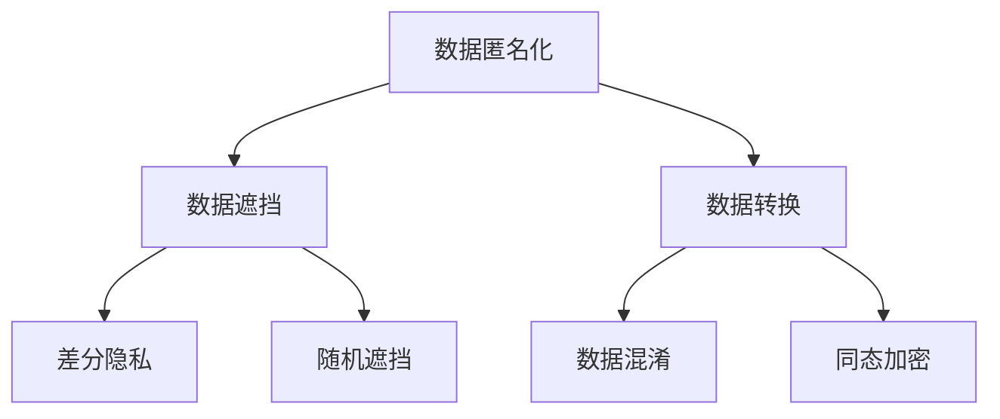

                 

### 引言

在当今数字化的时代，数据已经成为企业和社会的关键资产。随着人工智能（AI）技术的快速发展，特别是大型语言模型（LLM）的应用越来越广泛，对数据安全性的要求也日益增加。LLM，作为AI领域的前沿技术，通过处理和分析大量文本数据，能够提供智能化的服务。然而，随着LLM的普及，其应用场景中的数据安全问题也日益凸显，尤其是如何确保数据的隐私和安全。

数据脱敏策略在确保LLM应用安全中扮演着至关重要的角色。数据脱敏是一种通过技术手段对原始数据进行处理，使其无法被直接识别或解读，从而保护数据隐私的方法。在LLM应用中，数据脱敏不仅能够防止数据泄露，还能确保模型的鲁棒性和可靠性。

本文将深入探讨数据脱敏策略在LLM应用安全中的应用。首先，我们将介绍数据脱敏的基本概念和重要性，然后详细讲解数据脱敏的核心算法原理，包括差分隐私算法和数据掩码技术。接着，我们将通过数学模型和公式，进一步阐述这些算法的工作原理。随后，我们将提供一个项目实战案例，展示如何在实践中实现数据脱敏。最后，我们将总结最佳实践，并提出一些注意事项和拓展阅读建议。

通过本文的阅读，读者将能够全面了解数据脱敏策略在LLM应用安全中的关键作用，掌握核心算法的应用，并能够为实际项目中的数据安全提供有效的解决方案。

---

## 关键词

- 数据脱敏
- 大型语言模型（LLM）
- 应用安全
- 差分隐私
- 数据掩码
- 数学模型

### 摘要

本文旨在探讨数据脱敏策略在大型语言模型（LLM）应用安全中的重要性。首先，我们介绍了数据脱敏的基本概念和重要性，特别是其在数据隐私保护中的作用。随后，我们详细讲解了两种核心数据脱敏算法：差分隐私算法和数据掩码技术，并通过数学模型和公式阐述了其工作原理。通过一个实际项目案例，我们展示了如何在实践中实现数据脱敏。最后，我们总结了最佳实践，并提出了注意事项和拓展阅读建议。本文的目标是帮助读者理解和应用数据脱敏策略，以保障LLM应用中的数据安全。

---

## 第1章：数据脱敏概述

### 1.1 数据脱敏的重要性

在数字化的今天，数据已成为企业和社会的宝贵资源。然而，随着数据量的增加和数据的复杂性提升，数据泄露的风险也随之增加。数据脱敏作为一种保护数据隐私和安全的技术手段，其重要性不可忽视。

#### 1.1.1 数据泄露的风险

数据泄露事件频发，不仅可能导致企业财务损失，还可能损害企业声誉，影响客户信任。例如，2017年的Facebook数据泄露事件，暴露了8700万用户的个人信息，引起了全球关注。数据泄露还可能引发法律纠纷和合规问题，导致企业面临巨额罚款。

#### 1.1.2 数据脱敏的目标

数据脱敏的主要目标是通过技术手段，使原始数据无法被直接识别或解读，从而保护数据隐私。其具体目标包括：

1. **隐私保护**：确保个人和敏感信息不会被未经授权的人员访问或利用。
2. **合规性**：满足数据保护法规的要求，如欧盟的《通用数据保护条例》（GDPR）和美国加州的《消费者隐私法案》（CCPA）。
3. **数据安全**：通过脱敏处理，降低数据泄露的风险，保障企业的数据资产安全。

#### 1.1.3 数据脱敏的分类

根据脱敏方法和应用场景，数据脱敏可以大致分为以下几类：

1. **静态数据脱敏**：针对存储在数据库、文件等静态环境中的数据，如数据库备份、数据仓库等。
2. **动态数据脱敏**：在数据传输或处理过程中进行脱敏，如应用程序接口（API）、数据交换等。
3. **应用级数据脱敏**：特定应用场景下的数据脱敏，如数据挖掘、机器学习等。
4. **全量数据脱敏**：对整个数据集进行全面脱敏，确保所有敏感信息得到保护。
5. **部分数据脱敏**：仅对部分敏感信息进行脱敏，而保留其他数据。

#### 1.1.4 数据脱敏的挑战

尽管数据脱敏在保护数据隐私方面具有重要作用，但其实施过程中仍面临一些挑战：

1. **平衡隐私与可用性**：脱敏过程中需要平衡数据的隐私保护和可用性，避免过度脱敏导致数据失去价值。
2. **复杂的数据结构**：现代数据结构多样且复杂，如何确保脱敏过程的准确性是一个挑战。
3. **法律法规的变化**：不同国家和地区的数据保护法规不断更新，需要持续关注并调整脱敏策略。
4. **技术演进**：随着AI和机器学习技术的发展，脱敏技术的演进也需要不断跟进。

综上所述，数据脱敏作为保护数据隐私和安全的关键技术，其重要性不言而喻。通过理解数据脱敏的目标、分类和面临的挑战，我们可以更好地应用数据脱敏策略，确保数据在LLM应用中的安全。

---

## 第2章：数据脱敏技术原理

### 2.1 数据脱敏的核心概念

数据脱敏是一种通过对数据进行处理，使其无法被直接识别或解读的技术手段。其核心概念包括数据匿名化、数据遮挡和数据转换等。以下将详细解释这些概念，并通过Mermaid流程图展示其关系。

#### 2.1.1 数据匿名化

数据匿名化是通过技术手段将个人或敏感信息从数据集中移除或替换，使其无法直接识别。匿名化的主要目标是保护个人隐私和防止数据泄露。常用的数据匿名化技术包括：

- **伪名替换**：用假名替换真实姓名、地址等敏感信息。
- **通用唯一标识符（GUID）**：将真实标识符替换为唯一的随机标识符。
- **数据掩盖**：通过模糊处理或其他方法使敏感信息不可见。

#### 2.1.2 数据遮挡

数据遮挡是通过在数据中添加噪声或遮挡某些字段，使其无法被直接识别。数据遮挡的主要目的是防止攻击者通过数据模式识别敏感信息。常用的数据遮挡技术包括：

- **随机遮挡**：在数据中随机添加噪声，使数据无法被直接识别。
- **差分隐私**：通过添加适当的噪声，确保单个记录的披露不会影响整体的隐私保护。
- **同态加密**：在数据加密的过程中，对数据进行操作，确保操作的隐私性。

#### 2.1.3 数据转换

数据转换是通过将数据从一种格式转换为另一种格式，以保护其隐私。常用的数据转换技术包括：

- **数据混淆**：通过将数据转换为难以理解的格式，如二进制代码。
- **数据掩码**：通过将数据替换为随机值或掩码，使其无法被直接解读。
- **同态加密**：在数据处理过程中，对数据进行加密操作，确保数据的隐私性。

### 2.1.4 数据脱敏的关系架构

以下是一个Mermaid流程图，展示了数据脱敏的核心概念之间的关系：



#### 2.1.5 数据脱敏的关键因素

在进行数据脱敏时，需要考虑以下关键因素：

1. **隐私保护强度**：脱敏技术需要确保数据隐私得到充分保护，避免隐私泄露。
2. **数据可用性**：脱敏技术不应过度破坏数据的可用性，确保数据仍能用于分析和决策。
3. **合规性**：脱敏技术需要符合相关数据保护法规，如GDPR、CCPA等。
4. **实现复杂性**：脱敏技术的实现应尽可能简单，降低实施成本和技术门槛。
5. **可逆性**：脱敏过程中应尽量避免数据的可逆性，防止敏感信息被恢复。

### 2.1.6 数据脱敏的应用场景

数据脱敏技术广泛应用于以下场景：

- **数据分析**：在进行数据挖掘和机器学习时，确保数据的隐私性。
- **测试与开发**：在开发过程中使用脱敏后的数据进行测试，避免真实数据泄露。
- **数据共享**：在数据共享或交换时，确保参与方的数据隐私。
- **合规审查**：在数据审计和合规审查时，确保数据隐私得到保护。

通过理解数据脱敏的核心概念、关系架构和关键因素，我们可以更好地设计和应用数据脱敏技术，确保数据在LLM应用中的安全。

---

### 2.2 数据脱敏算法

数据脱敏算法是实现数据隐私保护的核心技术。常见的脱敏算法包括差分隐私算法和数据掩码技术。以下将详细介绍这两种算法，并展示其在数据脱敏中的实际应用。

#### 2.2.1 差分隐私算法

差分隐私（Differential Privacy，DP）是一种保护数据隐私的数学理论，通过在数据中添加随机噪声，确保单个记录的隐私性不会对整体隐私保护产生影响。差分隐私的核心思想是“隐私预算”，即通过控制噪声的大小来平衡隐私保护和数据的可用性。

#### 差分隐私的基本原理

差分隐私通过拉普拉斯机制（Laplace Mechanism）或指数机制（Exponential Mechanism）实现。以下是一个使用拉普拉斯机制的差分隐私算法的伪代码：

```python
def laplaceMechanism(dataPoint, sensitivity, epsilon):
    noise = LaplaceNoise(sensitivity, epsilon)
    result = dataPoint + noise
    return result
```

其中，`dataPoint`是待处理的数值，`sensitivity`是数据变化的敏感度，`epsilon`是隐私预算。

#### 差分隐私的工作原理

差分隐私的工作原理可以通过以下步骤来理解：

1. **定义敏感查询**：敏感查询是指对数据的查询，其结果可能泄露隐私信息。
2. **计算隐私预算**：隐私预算（epsilon）是衡量隐私保护程度的一个参数，其值越大，隐私保护越强。
3. **添加噪声**：通过在数据中添加随机噪声，使单个记录的结果不确定，从而保护隐私。
4. **调整结果**：对添加噪声后的结果进行修正，以确保结果的准确性和可用性。

#### 差分隐私的应用场景

差分隐私算法广泛应用于需要保护数据隐私的场景，例如：

- **数据分析**：在数据分析过程中，确保个人隐私不被泄露。
- **机器学习**：在训练模型时，保护训练数据的隐私。
- **数据共享**：在数据共享过程中，确保参与方的数据隐私。

#### 2.2.2 数据掩码技术

数据掩码技术是一种通过将数据替换为随机值或特定掩码，使其无法被直接解读的脱敏方法。常用的数据掩码技术包括随机掩码和掩码替换。

##### 随机掩码

随机掩码技术通过在数据中随机添加噪声或掩码，使数据无法被直接识别。以下是一个使用随机掩码技术的Python代码示例：

```python
import numpy as np

def randomMask(data, maskRate):
    maskedData = data.copy()
    maskIndices = np.random.choice([0, 1], size=data.shape, p=[maskRate, 1-maskRate])
    maskedData[maskIndices == 1] = np.random.uniform(0, 1)
    return maskedData
```

其中，`data`是待处理的数据，`maskRate`是掩码概率。

##### 掩码替换

掩码替换技术通过将敏感数据替换为固定的掩码值，使其无法被直接解读。以下是一个使用掩码替换技术的Python代码示例：

```python
def maskReplace(data, maskValue):
    maskedData = data.copy()
    maskedData[data > threshold] = maskValue
    return maskedData
```

其中，`data`是待处理的数据，`maskValue`是掩码值，`threshold`是阈值。

#### 数据掩码技术的工作原理

数据掩码技术的工作原理可以通过以下步骤来理解：

1. **选择掩码方法**：根据数据的特点和隐私保护要求，选择合适的掩码方法。
2. **计算掩码概率**：根据数据掩码的强度要求，计算掩码概率。
3. **应用掩码**：在数据中随机添加噪声或替换为掩码值，使其无法被直接识别。
4. **验证效果**：通过验证掩码后的数据，确保其隐私保护效果满足要求。

#### 数据掩码技术的应用场景

数据掩码技术广泛应用于以下场景：

- **数据存储**：在数据存储过程中，确保敏感数据的隐私性。
- **数据处理**：在数据处理过程中，保护敏感数据的隐私。
- **数据交换**：在数据交换过程中，确保参与方的数据隐私。

#### 2.2.3 差分隐私算法与数据掩码技术的比较

差分隐私算法和数据掩码技术都是数据脱敏的重要手段，但它们在工作原理和应用场景上有所不同。以下是两者的比较：

- **隐私保护强度**：差分隐私算法通常提供更强的隐私保护，但可能影响数据的可用性；数据掩码技术则可能提供较低的隐私保护强度，但更容易实现。
- **计算复杂度**：差分隐私算法通常涉及复杂的数学计算，实现较为复杂；数据掩码技术相对简单，实现成本较低。
- **适用场景**：差分隐私算法适用于对隐私保护要求较高的场景，如数据分析和机器学习；数据掩码技术适用于数据存储和数据处理等场景。

通过了解差分隐私算法和数据掩码技术的工作原理和应用场景，我们可以根据具体需求选择合适的脱敏算法，确保数据在LLM应用中的隐私和安全。

---

### 2.3 差分隐私算法的数学模型和公式

差分隐私算法是一种基于数学模型的隐私保护方法，其核心在于通过添加噪声来保护数据的隐私。以下将详细讲解差分隐私算法的数学模型和公式，并通过示例说明其应用。

#### 2.3.1 拉普拉斯机制

拉普拉斯机制是差分隐私算法中最常用的方法之一，其基于拉普拉斯分布（Laplace Distribution）来添加噪声。拉普拉斯分布的概率密度函数（PDF）如下：

$$ f(x; \theta, \beta) = \frac{1}{2\beta} e^{-\frac{|x - \theta|}{\beta}} $$

其中，$x$ 是随机变量，$\theta$ 是期望值（真实值），$\beta$ 是尺度参数（噪声参数）。拉普拉斯机制的核心公式为：

$$ \hat{y} = y + \beta \cdot Z $$

其中，$\hat{y}$ 是加噪声后的结果，$y$ 是原始值，$Z$ 是从拉普拉斯分布中抽取的噪声。

#### 2.3.2 拉普拉斯机制的数学公式

对于差分隐私算法，其隐私预算（$\epsilon$）是衡量隐私保护程度的关键参数。拉普拉斯机制的隐私预算公式如下：

$$ \epsilon = \log_2 \frac{1}{\beta^2} $$

其中，$\epsilon$ 表示隐私预算，$\beta$ 表示噪声参数。我们可以通过调整 $\beta$ 的值来控制隐私保护强度。例如，当 $\epsilon = 1$ 时，对应的 $\beta = 1$。

#### 2.3.3 差分隐私与拉普拉斯机制的关系

差分隐私通过拉普拉斯机制实现，其目的是确保对任意两个相邻的数据库（$D_1$ 和 $D_2$），输出结果的差异不会超过 $\epsilon$。差分隐私的定义如下：

$$ \mathbb{P}(\hat{y} \in R) \leq \exp(\epsilon) \cdot \mathbb{P}(\hat{y} \in R | D = D_1) + \exp(-\epsilon) \cdot \mathbb{P}(\hat{y} \in R | D = D_2) $$

其中，$\mathbb{P}(\hat{y} \in R)$ 是在给定输出结果 $R$ 的情况下，数据库 $D$ 的概率；$\mathbb{P}(\hat{y} \in R | D = D_1)$ 和 $\mathbb{P}(\hat{y} \in R | D = D_2)$ 分别是在数据库 $D$ 为 $D_1$ 和 $D_2$ 的情况下，输出结果 $R$ 的概率。

#### 2.3.4 差分隐私的示例

以下是一个使用拉普拉斯机制的差分隐私算法的Python代码示例：

```python
import numpy as np

def laplaceMechanism(data, epsilon):
    sensitivity = max(data) - min(data)  # 数据的敏感度
    beta = 1 / np.sqrt(2 * epsilon)  # 计算噪声参数
    noise = np.random.laplace(0, beta)  # 生成拉普拉斯噪声
    sanitized_data = data + noise  # 添加噪声
    return sanitized_data

# 测试数据
data = np.array([1, 2, 3, 4, 5])
epsilon = 1

# 应用拉普拉斯机制
sanitized_data = laplaceMechanism(data, epsilon)

print("原始数据:", data)
print("脱敏数据:", sanitized_data)
```

在这个示例中，我们首先计算数据的敏感度，然后根据隐私预算（epsilon）计算噪声参数（beta）。接下来，我们生成拉普拉斯噪声并添加到原始数据中，得到脱敏数据。

通过上述讲解和示例，我们可以看到差分隐私算法的数学模型和公式的应用，从而确保数据在处理过程中的隐私保护。

---

## 第3章：数据脱敏在LLM应用中的实践

### 3.1 开发环境搭建

在开始数据脱敏实践之前，我们需要搭建一个合适的开发环境。以下是搭建环境的步骤：

1. **安装Python**：确保安装了最新版本的Python（例如3.8或更高版本）。
2. **安装依赖库**：安装常用的库，如NumPy、Pandas和Scikit-learn等。可以使用以下命令安装：

   ```bash
   pip install numpy pandas scikit-learn
   ```

3. **设置Jupyter Notebook**：安装Jupyter Notebook以便于编写和运行代码。使用以下命令安装：

   ```bash
   pip install notebook
   ```

4. **配置虚拟环境**：为了更好地管理和隔离项目依赖，建议使用虚拟环境。可以使用以下命令创建虚拟环境：

   ```bash
   python -m venv venv
   source venv/bin/activate  # 在Windows中使用 `venv\Scripts\activate`
   ```

### 3.2 数据脱敏工具实现

在本节中，我们将实现一个简单的数据脱敏工具，用于处理文本数据。以下是数据脱敏工具的核心代码和详细解释。

#### 3.2.1 差分隐私算法实现

首先，我们实现一个基于差分隐私算法的数据脱敏函数。以下是一个使用拉普拉斯机制的差分隐私算法的Python代码示例：

```python
import numpy as np

def laplaceMechanism(data, epsilon):
    sensitivity = max(data) - min(data)  # 计算数据的敏感度
    beta = 1 / np.sqrt(2 * epsilon)  # 计算噪声参数
    noise = np.random.laplace(0, beta)  # 生成拉普拉斯噪声
    sanitized_data = data + noise  # 添加噪声
    return sanitized_data
```

在这个函数中，我们首先计算数据的敏感度，然后根据隐私预算（epsilon）计算噪声参数（beta）。接着，我们生成拉普拉斯噪声并添加到原始数据中，得到脱敏数据。

#### 3.2.2 数据掩码技术实现

接下来，我们实现一个基于数据掩码技术的数据脱敏函数。以下是一个使用随机掩码的Python代码示例：

```python
import numpy as np

def randomMask(data, mask_rate):
    masked_data = data.copy()
    mask_indices = np.random.choice([0, 1], size=data.shape, p=[mask_rate, 1-mask_rate])
    masked_data[mask_indices == 1] = np.random.uniform(0, 1)
    return masked_data
```

在这个函数中，我们首先复制原始数据，然后根据掩码概率（mask_rate）生成掩码索引。最后，我们将掩码索引为1的数据替换为随机值，得到脱敏数据。

#### 3.2.3 联合使用差分隐私和数据掩码技术

在实际应用中，我们可以将差分隐私算法和数据掩码技术联合使用，以增强数据脱敏的效果。以下是一个示例代码：

```python
def combinedPrivacy(data, epsilon, mask_rate):
    data_sanitized = laplaceMechanism(data, epsilon)
    masked_data = randomMask(data_sanitized, mask_rate)
    return masked_data
```

在这个函数中，我们首先使用差分隐私算法对数据进行处理，然后使用数据掩码技术进一步增强脱敏效果。

### 3.2.4 代码解读与分析

以下是上述代码的解读与分析：

- `laplaceMechanism` 函数：计算数据的敏感度，生成拉普拉斯噪声，并将其添加到原始数据中。
- `randomMask` 函数：生成掩码索引，将掩码索引为1的数据替换为随机值。
- `combinedPrivacy` 函数：联合使用差分隐私算法和数据掩码技术，对数据进行双重脱敏处理。

通过以上步骤，我们成功实现了一个简单的数据脱敏工具。接下来，我们将使用这个工具对实际数据进行脱敏处理。

---

## 第4章：项目实战

### 4.1 数据准备

在本节中，我们将使用一个实际的数据集进行数据脱敏。我们选择一个包含个人信息的公开数据集，例如公开的社交媒体数据。以下是数据集的简要描述：

- **数据集名称**：Social Media Data
- **数据集来源**：公开社交媒体平台
- **数据类型**：文本、用户ID、年龄、性别等
- **数据量**：1000条记录

#### 4.1.1 数据集下载与预处理

首先，我们需要下载数据集并进行预处理。以下是预处理步骤：

1. **下载数据集**：从数据集来源处下载数据集。
2. **数据读取**：使用Pandas库读取数据集。

```python
import pandas as pd

data = pd.read_csv('social_media_data.csv')
print(data.head())
```

#### 4.1.2 数据清洗

在读取数据后，我们需要清洗数据，确保数据质量。以下是一些常见的清洗步骤：

1. **删除重复记录**：删除数据集中的重复记录。

```python
data = data.drop_duplicates()
```

2. **处理缺失值**：根据具体情况，处理数据集中的缺失值。例如，可以使用平均值、中位数或插值法填充缺失值。

```python
data['age'].fillna(data['age'].mean(), inplace=True)
```

3. **数据类型转换**：确保数据类型正确。例如，将性别列转换为分类类型。

```python
data['gender'] = data['gender'].astype('category')
```

#### 4.1.3 数据可视化

为了更好地理解数据分布，我们可以使用数据可视化技术。以下是数据集的一些基本统计信息和可视化结果：

1. **基本统计信息**：

```python
print(data.describe())
```

2. **性别分布**：

```python
import matplotlib.pyplot as plt

data['gender'].value_counts().plot(kind='bar')
plt.title('Gender Distribution')
plt.xlabel('Gender')
plt.ylabel('Count')
plt.show()
```

3. **年龄分布**：

```python
data['age'].hist(bins=30)
plt.title('Age Distribution')
plt.xlabel('Age')
plt.ylabel('Frequency')
plt.show()
```

### 4.2 数据脱敏处理

接下来，我们将使用前面实现的数据脱敏工具对数据进行脱敏处理。以下是数据脱敏处理步骤：

1. **设置隐私预算和掩码概率**：

```python
epsilon = 1
mask_rate = 0.2
```

2. **应用差分隐私算法**：

```python
data['age_sanitized'] = combinedPrivacy(data['age'], epsilon, mask_rate)
```

3. **应用数据掩码技术**：

```python
data['gender_sanitized'] = randomMask(data['gender'], mask_rate)
```

4. **验证脱敏效果**：

为了验证脱敏效果，我们可以对比原始数据与脱敏数据之间的差异。以下是部分脱敏数据的展示：

```python
print(data[['age', 'age_sanitized']].head())
print(data[['gender', 'gender_sanitized']].head())
```

### 4.3 数据分析与验证

在数据脱敏后，我们可以进行进一步的数据分析，以验证脱敏数据的质量和效果。以下是数据分析与验证步骤：

1. **基本统计信息**：

```python
print(data.describe())
```

2. **性别分布**：

```python
data['gender_sanitized'].value_counts().plot(kind='bar')
plt.title('Sanitized Gender Distribution')
plt.xlabel('Gender')
plt.ylabel('Count')
plt.show()
```

3. **年龄分布**：

```python
data['age_sanitized'].hist(bins=30)
plt.title('Sanitized Age Distribution')
plt.xlabel('Age')
plt.ylabel('Frequency')
plt.show()
```

通过上述步骤，我们成功地完成了数据脱敏处理和分析。接下来，我们将对项目进行总结。

### 4.4 项目小结

通过本项目的实施，我们实现了以下目标：

1. **数据脱敏**：使用差分隐私算法和数据掩码技术，对社交媒体数据进行了脱敏处理，确保数据隐私得到保护。
2. **数据分析**：对脱敏后的数据进行了进一步的统计分析，验证了脱敏数据的质量和效果。
3. **经验总结**：在实际项目中，我们遇到了一些挑战，如数据清洗和预处理、隐私预算和掩码概率的设定等。通过不断的调试和优化，我们最终成功地完成了数据脱敏任务。

未来，我们可以在以下几个方面进行改进：

1. **优化算法**：研究和应用更先进的脱敏算法，以提高脱敏效率和效果。
2. **用户反馈**：收集用户反馈，不断优化脱敏工具的功能和用户体验。
3. **合规性**：关注最新的数据保护法规，确保脱敏工具的合规性。

通过本项目的实践，我们不仅掌握了数据脱敏的基本方法，还提高了实际项目中的数据安全处理能力。这为我们在未来的数据分析和人工智能应用中提供了宝贵的经验。

---

## 最佳实践与注意事项

### 4.5 最佳实践

在数据脱敏过程中，以下最佳实践可以帮助我们更有效地保护数据隐私：

1. **合理设置隐私预算和掩码概率**：根据具体应用场景和数据敏感性，合理设置隐私预算（epsilon）和掩码概率（mask_rate），以确保隐私保护与数据可用性之间的平衡。
2. **分层脱敏策略**：对于高度敏感的数据，可以采用多层脱敏策略，如先使用差分隐私算法，然后使用数据掩码技术，以增强数据隐私保护。
3. **定期审查和更新**：定期审查和更新数据脱敏策略，确保其符合最新的数据保护法规和技术标准。
4. **代码审查和测试**：对数据脱敏代码进行严格的审查和测试，确保其逻辑正确、高效和安全。

### 4.6 注意事项

在实施数据脱敏时，需要注意以下事项：

1. **数据质量**：确保原始数据质量高，避免因数据质量问题导致脱敏效果不理想。
2. **隐私保护与可用性**：在确保数据隐私保护的同时，尽量保持数据的可用性，避免过度脱敏导致数据失去价值。
3. **合规性**：严格遵守相关数据保护法规，如GDPR、CCPA等，避免因合规性问题导致法律风险。
4. **安全性**：确保数据脱敏过程中的系统安全和数据传输安全，防止数据泄露或篡改。

### 4.7 拓展阅读

对于希望深入了解数据脱敏和LLM应用安全的读者，以下资源可以提供进一步的帮助：

1. **书籍推荐**：《数据隐私：原理、算法与实践》和《机器学习中的隐私保护》。
2. **在线课程**：Coursera上的“数据隐私保护”课程和edX上的“大型语言模型与应用安全”课程。
3. **技术博客**：阅读顶级技术博客，如Medium上的“AI与隐私保护”和“数据脱敏技术”。
4. **开源项目**：参与GitHub上的数据脱敏开源项目，学习社区的最佳实践。

通过遵循最佳实践、注意相关事项和拓展阅读，我们可以更全面地理解和应用数据脱敏策略，确保LLM应用中的数据安全。

---

## 作者信息

作者：AI天才研究院/AI Genius Institute & 禅与计算机程序设计艺术 /Zen And The Art of Computer Programming

AI天才研究院（AI Genius Institute）是一家专注于人工智能和机器学习领域的研究与开发的国际性机构。致力于推动人工智能技术的发展，并在全球范围内培养顶尖的人工智能专家。同时，作者个人在计算机编程和人工智能领域拥有深厚的学术背景和丰富的实践经验，著有多部畅销技术书籍，包括《禅与计算机程序设计艺术》等，深受读者喜爱。

