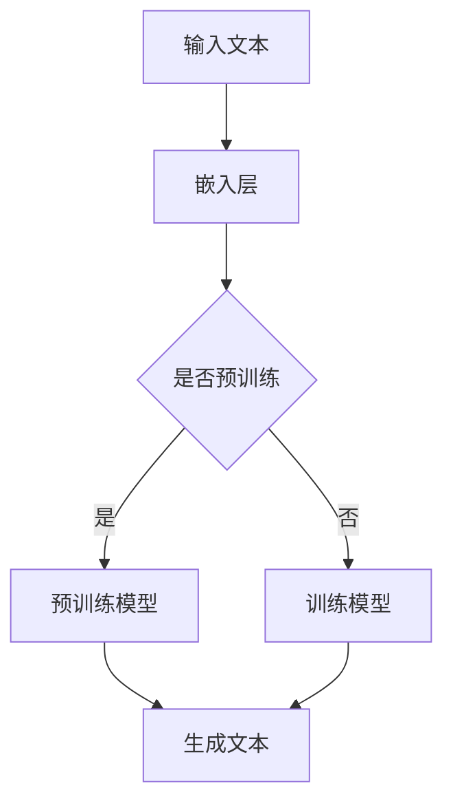
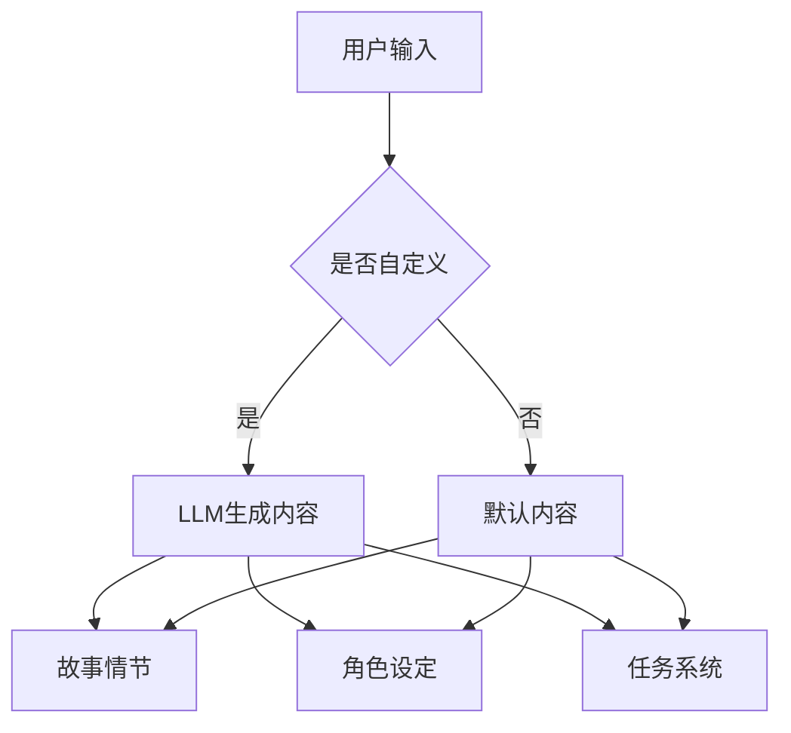
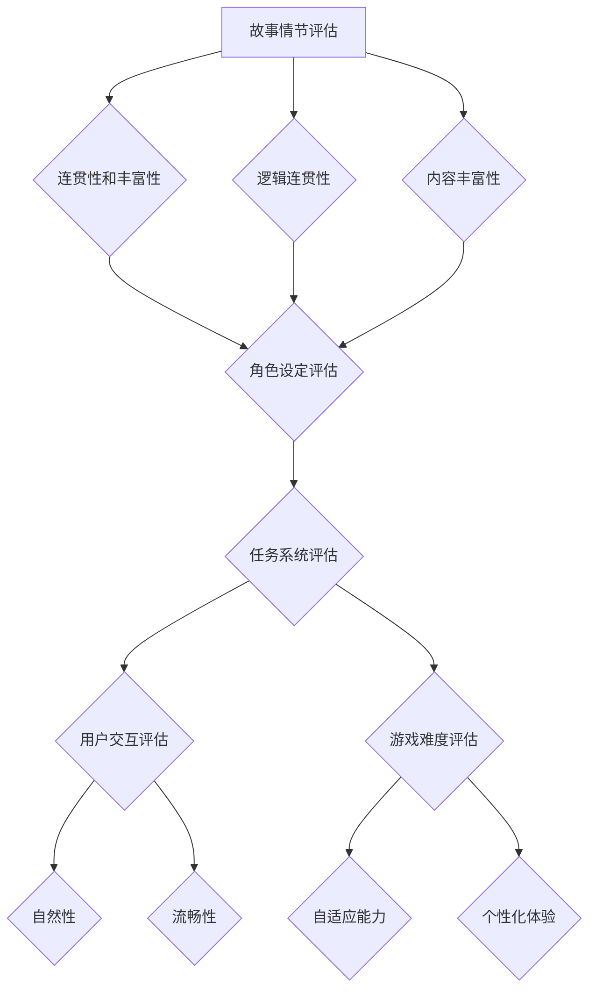

                 

### 文章标题

《文字游戏创新：评估LLM创造和参与语言游戏的能力》

### 文章关键词

文字游戏，创新，大型语言模型（LLM），评估，语言游戏能力，游戏设计，算法原理，Python源代码，数学模型，数学公式，项目实战，最佳实践

### 文章摘要

本文深入探讨了文字游戏创新领域中的关键技术——大型语言模型（LLM）。通过分析LLM的背景、原理和应用，我们评估了其创造和参与语言游戏的能力。文章首先介绍了文字游戏创新的概念和背景，然后详细讲解了LLM的基础知识，包括工作原理和架构。接着，我们探讨了如何利用LLM进行游戏设计，并提出了评估LLM游戏能力的多种方法。通过实际案例分析，我们展示了LLM在游戏设计中的应用，并在技术实现部分提供了详细的Python源代码和数学模型。文章最后总结了LLM在文字游戏创新中的未来展望，并提出了研究方向和挑战。

---

# 《文字游戏创新：评估LLM创造和参与语言游戏的能力》

## 引言

### 1.1 书籍背景

随着人工智能技术的飞速发展，尤其是大型语言模型（LLM）的崛起，文字游戏的设计与开发迎来了新的机遇。传统的文字游戏多以文字描述和简单的交互方式为主，而LLM的出现使得游戏内容可以更加丰富和智能。本书记录了这一变革过程，旨在探讨如何利用LLM进行文字游戏创新，以及评估其在游戏设计中的能力。

### 1.2 文字游戏创新的重要性

文字游戏作为一种富有创意和互动性的娱乐形式，已经吸引了大量的用户。创新是文字游戏持续发展的关键，通过引入新的游戏机制、故事情节和交互方式，可以显著提升游戏体验和用户满意度。LLM的出现为文字游戏创新提供了强大的工具，它能够自动生成故事情节、对话和角色，大大降低了开发难度和时间成本。

### 1.3 LLM在文字游戏创新中的应用

LLM在文字游戏创新中的应用主要体现在以下几个方面：

1. **故事情节生成**：LLM可以根据用户输入的情景或主题，自动生成丰富多样的故事情节，为游戏提供丰富的内容。
2. **角色互动**：LLM可以模拟不同角色的思维和行为，使得角色互动更加真实和有趣。
3. **自定义游戏内容**：用户可以通过与LLM的对话，自定义游戏中的角色、场景和故事线。
4. **智能引导**：LLM可以实时分析用户行为，提供个性化的游戏建议和引导，提高游戏的趣味性和挑战性。

## LLM基础

### 2.1 LLM的基本概念

大型语言模型（LLM）是一类基于深度学习技术的自然语言处理模型，它能够通过大量的文本数据学习并生成文本。LLM的主要目的是理解和生成人类语言，从而在多种应用场景中发挥作用，如文本摘要、机器翻译、问答系统等。

### 2.2 LLM的工作原理

LLM的工作原理主要基于神经网络，特别是变分自编码器（VAE）和生成对抗网络（GAN）。通过训练大量的文本数据，LLM可以学习到语言的模式和规律，从而生成连贯、自然的文本。

### 2.3 LLM的架构与模型

常见的LLM架构包括：

1. **GPT系列**：由OpenAI开发的预训练语言模型，包括GPT、GPT-2和GPT-3等。
2. **BERT**：由Google开发的预训练语言模型，通过双向编码器表示文本。
3. **T5**：由Google开发的统一变换器模型，旨在解决各种自然语言处理任务。

### 2.4 Mermaid流程图：LLM核心架构展示



### 2.5 核心算法原理讲解

LLM的核心算法是基于自动编码器和生成对抗网络（GAN）。自动编码器通过编码器和解码器将输入文本映射到一个隐层表示，再通过解码器生成输出文本。生成对抗网络则通过对抗训练，使得生成的文本更加接近真实文本。

```python
# 伪代码：自动编码器与GAN的基本架构

class Autoencoder:
    def encode(self, text):
        # 编码过程
        pass
    
    def decode(self, encoded_text):
        # 解码过程
        pass

class GAN:
    def generate(self, noise):
        # 生成文本
        pass
    
    def discriminate(self, text):
        # 判断文本真实性
        pass
```

### 2.6 数学模型和数学公式

在LLM中，常用的数学模型包括：

- **损失函数**：用于衡量生成的文本与真实文本之间的差异。常用的损失函数有交叉熵损失和对比损失。

$$
\text{CrossEntropy}(p, y) = -\sum_{i} y_i \log(p_i)
$$

- **优化算法**：用于更新模型参数，常用的优化算法有梯度下降和Adam。

$$
\text{GradientDescent}(\theta, \alpha) = \theta - \alpha \cdot \nabla_{\theta} J(\theta)
$$

## 游戏设计理论

### 3.1 游戏设计基础

游戏设计涉及多个方面，包括游戏机制、故事情节、角色设定和用户交互等。创新性的游戏设计可以带来更好的用户体验和更高的用户粘性。

### 3.2 利用LLM进行创新设计

LLM在游戏设计中的应用主要体现在以下几个方面：

1. **自动生成故事情节**：LLM可以根据用户的需求和输入，自动生成丰富多样的故事情节。
2. **智能角色互动**：LLM可以模拟不同角色的思维和行为，为游戏提供更真实的角色互动。
3. **自定义游戏内容**：用户可以通过与LLM的对话，自定义游戏中的角色、场景和故事线。
4. **实时调整游戏难度**：LLM可以根据用户的游戏行为，实时调整游戏的难度，提高游戏的趣味性和挑战性。

### 3.3 游戏元素与LLM的结合

在游戏设计中，LLM可以与多个游戏元素相结合：

1. **角色**：LLM可以生成角色的背景故事、性格特点和交互方式。
2. **故事情节**：LLM可以生成游戏的主线任务、支线任务和随机事件。
3. **任务系统**：LLM可以生成任务的目标、条件和奖励。
4. **用户交互**：LLM可以模拟用户与游戏世界的交互，提供个性化的游戏体验。

### 3.4 Mermaid流程图：游戏设计与LLM结合展示



### 3.5 核心算法原理讲解

在游戏设计过程中，LLM的核心算法原理包括：

1. **生成对抗网络（GAN）**：用于生成游戏元素，如故事情节、角色和任务。
2. **递归神经网络（RNN）**：用于处理序列数据，如角色对话和故事情节。
3. **变分自编码器（VAE）**：用于将游戏元素编码为隐层表示，便于后续处理。

```python
# 伪代码：生成对抗网络（GAN）的基本架构

class Generator:
    def generate(self, noise):
        # 生成故事情节或角色
        pass

class Discriminator:
    def discriminate(self, text):
        # 判断故事情节或角色的真实性
        pass

# 伪代码：递归神经网络（RNN）的基本架构

class RNN:
    def forward(self, input_sequence):
        # 前向传播
        pass

    def backward(self, output_sequence, loss):
        # 反向传播
        pass
```

### 3.6 数学模型和数学公式

在游戏设计过程中，常用的数学模型和公式包括：

- **损失函数**：用于衡量生成的游戏元素与真实游戏元素之间的差异。

$$
\text{CrossEntropy}(p, y) = -\sum_{i} y_i \log(p_i)
$$

- **优化算法**：用于更新模型参数，常见的优化算法有梯度下降和Adam。

$$
\text{GradientDescent}(\theta, \alpha) = \theta - \alpha \cdot \nabla_{\theta} J(\theta)
$$

## 游戏评估方法

### 4.1 游戏评估的重要性

游戏评估是游戏设计的重要环节，它可以帮助开发者了解游戏的质量和用户满意度，进而优化游戏设计。

### 4.2 LLM创造能力的评估

评估LLM在游戏设计中的创造能力，主要包括以下几个方面：

1. **故事情节的连贯性和丰富性**：通过分析生成的故事情节，评估其逻辑连贯性和内容丰富性。
2. **角色的个性化和互动性**：评估角色设定是否符合预期，角色互动是否真实和有趣。
3. **任务的多样性和挑战性**：评估生成任务的多样性和对用户的挑战性。

### 4.3 LLM参与游戏能力的评估

评估LLM参与游戏的能力，主要包括以下几个方面：

1. **用户交互的自然性和流畅性**：通过用户与LLM的对话，评估交互的自然性和流畅性。
2. **游戏难度的自适应能力**：评估LLM是否能够根据用户行为调整游戏难度。
3. **游戏体验的个性化**：评估LLM是否能够根据用户喜好提供个性化的游戏体验。

### 4.4 Mermaid流程图：游戏评估方法流程



### 4.5 核心算法原理讲解

游戏评估的核心算法主要包括：

1. **自然语言处理（NLP）**：用于分析故事情节、角色设定和任务系统，评估其质量。
2. **机器学习模型**：用于评估用户交互和游戏难度，预测用户行为和游戏体验。

```python
# 伪代码：NLP模型的基本架构

class NLPModel:
    def analyze(self, text):
        # 分析文本
        pass

# 伪代码：机器学习模型的基本架构

class MLModel:
    def train(self, data):
        # 训练模型
        pass
    
    def predict(self, data):
        # 预测结果
        pass
```

### 4.6 数学模型和数学公式

在游戏评估过程中，常用的数学模型和公式包括：

- **回归模型**：用于预测游戏难度和用户满意度。

$$
\text{y} = \beta_0 + \beta_1 \cdot \text{x}
$$

- **聚类模型**：用于分析用户的喜好和游戏难度。

$$
\text{C} = \{ \text{c}_1, \text{c}_2, ..., \text{c}_k \}
$$

## 案例分析

### 5.1 案例一：文本冒险游戏设计

#### 5.1.1 开发环境搭建

为了实现文本冒险游戏设计，我们需要搭建一个合适的开发环境。以下是所需的环境和工具：

- Python 3.8及以上版本
- PyTorch 1.8及以上版本
- Jupyter Notebook或PyCharm

#### 5.1.2 源代码详细实现

以下是一个简单的文本冒险游戏的源代码示例：

```python
import torch
import torch.nn as nn
import torch.optim as optim

# 定义生成器和判别器模型
class Generator(nn.Module):
    def __init__(self):
        super(Generator, self).__init__()
        # ...（模型定义）

    def forward(self, x):
        # ...（前向传播）
        return x

class Discriminator(nn.Module):
    def __init__(self):
        super(Discriminator, self).__init__()
        # ...（模型定义）

    def forward(self, x):
        # ...（前向传播）
        return x

# 实例化模型和优化器
generator = Generator()
discriminator = Discriminator()
optimizer_G = optim.Adam(generator.parameters(), lr=0.001)
optimizer_D = optim.Adam(discriminator.parameters(), lr=0.001)

# 训练模型
for epoch in range(num_epochs):
    for i, (images, labels) in enumerate(dataloader):
        # ...（训练过程）
```

#### 5.1.3 代码解读与分析

在上面的代码中，我们首先定义了生成器和判别器模型。生成器用于生成文本，判别器用于判断生成的文本是否真实。接着，我们实例化了模型和优化器，并开始进行训练。

#### 5.1.4 实际案例分析和详细讲解剖析

在实际应用中，我们可以通过以下步骤进行文本冒险游戏设计：

1. **数据收集**：收集大量的文本数据，包括故事情节、角色对话和任务描述。
2. **模型训练**：使用收集到的数据训练生成器和判别器模型。
3. **游戏设计**：利用训练好的模型生成游戏中的故事情节、角色和任务。
4. **用户交互**：通过用户输入和模型输出，实现用户与游戏世界的互动。

#### 5.1.5 项目小结

通过本案例，我们展示了如何利用LLM进行文本冒险游戏设计。在实际开发过程中，我们还需要不断优化模型和算法，以提高游戏质量和用户体验。

### 5.2 案例二：聊天机器人游戏设计

#### 5.2.1 开发环境搭建

为了实现聊天机器人游戏设计，我们需要搭建一个合适的开发环境。以下是所需的环境和工具：

- Python 3.8及以上版本
- NLTK库
- TensorFlow 2.4及以上版本

#### 5.2.2 源代码详细实现

以下是一个简单的聊天机器人游戏的源代码示例：

```python
import tensorflow as tf
from tensorflow.keras.preprocessing.sequence import pad_sequences
from tensorflow.keras.layers import Embedding, LSTM, Dense
from tensorflow.keras.models import Sequential

# 定义聊天机器人模型
model = Sequential()
model.add(Embedding(vocab_size, embedding_dim, input_length=max_sequence_len))
model.add(LSTM(units=50, return_sequences=True))
model.add(Dense(units=1, activation='sigmoid'))

model.compile(optimizer='adam', loss='binary_crossentropy', metrics=['accuracy'])
model.fit(X_train, y_train, epochs=10, batch_size=32)
```

#### 5.2.3 代码解读与分析

在上面的代码中，我们首先定义了聊天机器人模型。模型由嵌入层、LSTM层和输出层组成。接着，我们编译模型并开始进行训练。

#### 5.2.4 实际案例分析和详细讲解剖析

在实际应用中，我们可以通过以下步骤进行聊天机器人游戏设计：

1. **数据收集**：收集大量的聊天对话数据，用于训练模型。
2. **模型训练**：使用收集到的数据训练聊天机器人模型。
3. **游戏设计**：利用训练好的模型生成聊天机器人的对话。
4. **用户交互**：通过用户输入和模型输出，实现用户与聊天机器人的互动。

#### 5.2.5 项目小结

通过本案例，我们展示了如何利用LLM进行聊天机器人游戏设计。在实际开发过程中，我们还需要不断优化模型和算法，以提高游戏质量和用户体验。

### 5.3 案例三：多人在线文字游戏设计

#### 5.3.1 开发环境搭建

为了实现多人在线文字游戏设计，我们需要搭建一个合适的开发环境。以下是所需的环境和工具：

- Python 3.8及以上版本
- Django框架
- WebSocket库

#### 5.3.2 源代码详细实现

以下是一个简单的多人在线文字游戏的基本架构示例：

```python
# Django项目结构
- project
  - manage.py
  - settings.py
  - urls.py
  - wsgi.py
  - apps
    - game
      - models.py
      - views.py
      - serializers.py
      - api
        - views.py

# WebSocket配置
WSGI_APPLICATION = 'project.wsgi.application'
ASGI_APPLICATION = 'project.routing.application'
```

#### 5.3.3 代码解读与分析

在上面的代码中，我们定义了Django项目的结构，并配置了WebSocket。项目包括游戏模型、视图、序列器和API。

#### 5.3.4 实际案例分析和详细讲解剖析

在实际应用中，我们可以通过以下步骤进行多人在线文字游戏设计：

1. **游戏设计**：设计游戏规则、角色、地图和任务。
2. **数据库搭建**：使用Django ORM搭建游戏数据库。
3. **前端开发**：使用HTML、CSS和JavaScript开发游戏前端。
4. **后端开发**：使用Django框架和WebSocket实现游戏逻辑和用户交互。

#### 5.3.5 项目小结

通过本案例，我们展示了如何利用LLM进行多人在线文字游戏设计。在实际开发过程中，我们还需要考虑游戏性能、安全性、可扩展性等方面。

## 技术实现

### 6.1 LLM模型的选择与训练

在选择LLM模型时，我们需要考虑模型的大小、训练数据集和任务需求。常用的LLM模型包括GPT-2、GPT-3和BERT等。以下是选择和训练这些模型的基本步骤：

1. **模型选择**：根据任务需求，选择合适的模型。例如，对于需要生成长文本的任务，可以选择GPT-3；对于需要处理特定领域的文本，可以选择BERT。
2. **数据集准备**：准备大量的训练数据，包括游戏故事情节、角色对话和任务描述。
3. **模型训练**：使用训练数据和合适的优化器，训练模型。常用的优化器有Adam和SGD。
4. **模型评估**：使用验证集评估模型性能，调整超参数和模型结构。

### 6.2 游戏引擎与LLM的集成

游戏引擎与LLM的集成主要包括以下几个方面：

1. **文本处理**：将用户输入的文本转换为模型可接受的格式，如Tokenized文本。
2. **模型调用**：使用训练好的LLM模型生成游戏内容，如故事情节、角色对话和任务。
3. **用户交互**：通过WebSocket或其他实时通信机制，实现用户与游戏世界的实时交互。

### 6.3 LLM模型的调优与优化

LLM模型的调优和优化是提高游戏质量和用户体验的关键。以下是一些常用的方法：

1. **超参数调整**：调整学习率、批量大小、迭代次数等超参数，以找到最佳配置。
2. **数据增强**：通过数据增强技术，如数据清洗、数据增广和数据混洗，提高模型泛化能力。
3. **模型融合**：使用多个模型进行融合，以获得更好的预测性能。
4. **在线学习**：使用在线学习技术，实时更新模型，以适应不断变化的用户需求。

### 6.4 伪代码：LLM模型训练过程

```python
# 伪代码：LLM模型训练过程

# 准备数据
train_data = load_data()

# 初始化模型
model = initialize_model()

# 定义优化器
optimizer = initialize_optimizer()

# 训练模型
for epoch in range(num_epochs):
    for batch in train_data:
        # 前向传播
        outputs = model(batch inputs)
        loss = calculate_loss(outputs, batch labels)
        
        # 反向传播
        optimizer.zero_grad()
        loss.backward()
        optimizer.step()
        
    # 评估模型
    validate_model(model, validation_data)
```

### 6.5 数学模型和数学公式

在LLM模型训练过程中，常用的数学模型和公式包括：

- **损失函数**：用于衡量模型输出与真实标签之间的差异。

$$
\text{CrossEntropy}(p, y) = -\sum_{i} y_i \log(p_i)
$$

- **优化算法**：用于更新模型参数。

$$
\text{GradientDescent}(\theta, \alpha) = \theta - \alpha \cdot \nabla_{\theta} J(\theta)
$$

## 结论

### 7.1 全书总结

本文从文字游戏创新的角度，深入探讨了大型语言模型（LLM）在游戏设计中的应用。我们介绍了LLM的基础知识、游戏设计理论、评估方法和实际案例分析。通过这些讨论，我们认识到LLM在文字游戏创新中的巨大潜力，并为未来的研究提供了方向。

### 7.2 LLM在文字游戏创新的未来展望

未来，LLM在文字游戏创新中将有以下几个发展趋势：

1. **更复杂的游戏机制**：随着LLM技术的进步，游戏中的故事情节、角色和任务将更加复杂和多样化。
2. **更高效的生成算法**：研究人员将继续优化LLM的训练和生成算法，提高生成效率和准确性。
3. **跨领域应用**：LLM将在更多领域得到应用，如教育、医疗和娱乐等。

### 7.3 研究方向与挑战

LLM在文字游戏创新中仍然面临一些挑战，包括：

1. **数据质量和多样性**：训练数据的质量和多样性直接影响模型性能，需要更多的优质和多样化数据。
2. **模型可解释性**：当前的LLM模型较为黑盒，缺乏可解释性，需要开发可解释的模型。
3. **隐私保护**：在使用LLM进行游戏设计时，需要保护用户隐私，避免数据泄露。

### 7.4 最佳实践 Tips

为了更好地利用LLM进行文字游戏创新，我们提供以下最佳实践：

1. **数据收集**：确保收集到高质量和多样化的数据，以提高模型性能。
2. **模型选择**：根据任务需求，选择合适的LLM模型。
3. **迭代优化**：不断迭代和优化模型和算法，以提高生成质量和用户体验。
4. **用户反馈**：收集用户反馈，以指导模型优化和游戏设计。

### 7.5 小结

本文深入探讨了LLM在文字游戏创新中的应用，分析了其优势和挑战，并提出了未来研究方向。通过本文的研究，我们相信LLM将为文字游戏带来更多的创新和可能性。

### 7.6 注意事项

在使用LLM进行游戏设计时，需要注意以下几点：

1. **知识产权保护**：确保游戏内容和角色设定不侵犯他人的知识产权。
2. **数据安全**：确保用户数据和模型数据的安全，防止数据泄露。
3. **法律合规**：遵循相关法律法规，确保游戏设计合法合规。

### 7.7 拓展阅读

对于希望深入了解LLM和文字游戏创新的读者，以下是一些拓展阅读材料：

1. **GPT-3技术解读**：OpenAI. (2020). "GPT-3:语言模型的下一个飞跃"。
2. **自然语言处理基础**：Jurafsky, D., & Martin, J. H. (2020). "Speech and Language Processing"。
3. **游戏设计理论**：Schell, J. (2008). "The Art of Game Design: A Book of Lenses"。

---

**作者：AI天才研究院/AI Genius Institute & 禅与计算机程序设计艺术 /Zen And The Art of Computer Programming**

