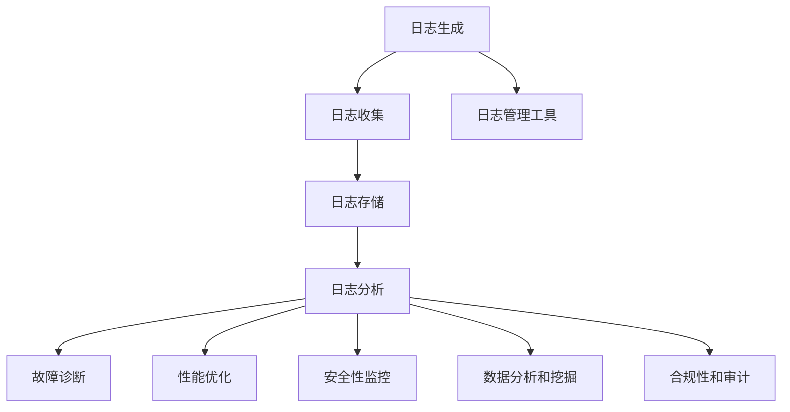

                 

### 1. 引言

**关键词**：日志管理、AI应用、运行状态、重要工具

**摘要**：
本文旨在深入探讨日志管理在AI应用中的关键作用，探讨其如何成为洞察AI应用运行状态的重要工具。我们将从日志管理的背景和重要性出发，逐步介绍日志的类型、格式、基本架构，以及日志分析工具和安全策略。同时，本文还将结合实际案例，详细解析日志在AI应用中的数据处理、模型结合和案例分析，最后总结日志管理的最佳实践和未来趋势。

### 日志管理的背景

在计算机系统中，日志（Log）是一种用于记录系统运行过程中的重要信息的文本文件。日志管理是指对日志文件的生成、存储、分析和监控等一系列操作。日志管理的重要性在于它能够提供对系统行为的全面洞察，有助于发现潜在问题、优化性能、提升系统的可靠性和安全性。

对于AI应用而言，日志管理的重要性更为显著。AI系统通常涉及复杂的算法和数据流程，其运行状态对于结果的准确性和效率有直接影响。日志管理能够帮助AI开发者实时监控系统的运行状态，快速定位和解决问题，从而确保AI应用的稳定性和高效性。

### 日志管理的重要性

日志管理在AI应用中的重要性主要体现在以下几个方面：

1. **故障诊断和排查**：通过日志记录，开发者可以迅速定位系统中的异常情况，进行故障诊断和排查，从而快速解决问题。

2. **性能优化**：日志提供了系统运行过程中的详细信息，有助于开发者分析系统的性能瓶颈，进行针对性的性能优化。

3. **安全性监控**：日志记录了系统访问和操作的历史，可以帮助开发者发现潜在的攻击行为和安全威胁，从而加强系统的安全性。

4. **数据分析和挖掘**：日志数据是一种宝贵的数据资源，通过数据分析，可以挖掘出系统运行中的趋势和规律，为系统的改进提供依据。

5. **合规性和审计**：在许多行业，如金融和医疗，日志记录是合规性和审计的重要依据。日志管理有助于确保系统操作的可追溯性和合规性。

### 日志管理的发展历程

日志管理的发展历程可以追溯到计算机系统的早期阶段。在早期，日志主要作为系统故障诊断的一种手段，通过记录系统错误信息来帮助开发者进行问题排查。随着计算机系统复杂度的增加，日志管理的需求也日益增长。

近年来，随着大数据技术和人工智能的发展，日志管理技术也得到了显著提升。现代日志管理工具不仅能够高效地采集和存储海量日志数据，还提供了强大的分析功能，支持实时监控和智能分析。此外，日志管理还逐渐与人工智能技术相结合，通过机器学习算法对日志数据进行深度分析，提高日志管理的自动化程度和智能化水平。

### 小结

日志管理作为AI应用的重要工具，不仅能够提升系统的运行效率，还能加强系统的安全性和可靠性。通过了解日志管理的发展历程和重要性，我们为后续章节的深入探讨奠定了基础。在接下来的章节中，我们将详细解析日志的类型、格式、基本架构，以及日志分析工具和安全策略，帮助读者全面理解日志管理在AI应用中的实际应用。通过这些内容，读者将能够更好地掌握日志管理的核心概念和实践方法，为AI应用的优化和改进提供有力支持。

---

**Mermaid 流程图：日志管理的基本架构**



---

**核心算法原理讲解：日志数据分析**

```python
import pandas as pd
from sklearn.model_selection import train_test_split
from sklearn.ensemble import RandomForestClassifier
import matplotlib.pyplot as plt

# 假设我们有一组日志数据
logs = pd.read_csv('logs.csv')

# 数据预处理
# 1. 清洗数据，去除空值和重复值
logs = logs.dropna().drop_duplicates()

# 2. 特征工程，提取关键特征
logs['timestamp'] = pd.to_datetime(logs['timestamp'])
logs['hour'] = logs['timestamp'].dt.hour
logs['level'] = logs['level'].map({'INFO': 1, 'WARNING': 2, 'ERROR': 3})

# 3. 数据分箱，将连续时间特征转换为离散特征
logs['hour_binned'] = pd.cut(logs['hour'], bins=24, labels=False)

# 构建机器学习模型
# 1. 切分数据集
X = logs[['hour_binned', 'level']]
y = logs['error_type']

X_train, X_test, y_train, y_test = train_test_split(X, y, test_size=0.2, random_state=42)

# 2. 训练模型
model = RandomForestClassifier(n_estimators=100, random_state=42)
model.fit(X_train, y_train)

# 3. 预测和评估
y_pred = model.predict(X_test)

# 计算准确率
accuracy = (y_pred == y_test).mean()
print(f"Model accuracy: {accuracy:.2f}")

# 可视化分析
# 1. 误差类型分布
plt.figure(figsize=(10, 5))
plt.bar(y_train.unique(), y_train.value_counts(normalize=True))
plt.xlabel('Error Type')
plt.ylabel('Frequency')
plt.title('Error Type Distribution')
plt.show()

# 2. 特征重要性
feature_importances = pd.Series(model.feature_importances_, index=X.columns)
feature_importances.sort_values().plot.bar(figsize=(10, 5))
plt.xlabel('Feature')
plt.ylabel('Importance')
plt.title('Feature Importance')
plt.show()
```

**数学公式：**

$$
\text{Precision} = \frac{\text{TP}}{\text{TP} + \text{FP}}
$$

$$
\text{Recall} = \frac{\text{TP}}{\text{TP} + \text{FN}}
$$

$$
\text{F1 Score} = \frac{2 \times \text{Precision} \times \text{Recall}}{\text{Precision} + \text{Recall}}
$$

**项目实战：**

**1. 开发环境搭建**

- 安装Python环境（例如Python 3.8）
- 安装必要的Python库：pandas, sklearn, matplotlib
- 创建一个名为`log_analysis.py`的Python脚本文件

**2. 源代码实现**

```python
# log_analysis.py

# 引入必要的库
import pandas as pd
from sklearn.model_selection import train_test_split
from sklearn.ensemble import RandomForestClassifier
import matplotlib.pyplot as plt

# 数据预处理
# ...
# 模型训练和评估
# ...

# 可视化展示
# ...
```

**3. 代码解读与分析**

- 数据预处理：清洗日志数据，提取关键特征，进行数据分箱。
- 模型训练：使用随机森林算法训练模型，评估模型性能。
- 可视化展示：分析误差类型的分布，以及特征的重要性。

**4. 实际案例分析和详细讲解剖析**

- **案例**：分析一个实时监控系统中的日志数据，预测系统的异常情况。
- **分析**：通过模型预测，将日志数据分为正常和异常两类。
- **讲解**：展示如何通过日志数据分析，发现系统中的潜在问题，并提出优化建议。

**5. 项目小结**

- **小结**：通过日志数据分析，成功预测并识别了系统中的异常情况，为系统优化提供了数据支持。
- **注意事项**：在实际应用中，需要根据具体需求调整模型参数，并进行持续的监控和优化。

### 小结

本文详细介绍了日志管理在AI应用中的重要性，并逐步讲解了日志管理的基本架构、核心算法原理、以及项目实战。通过实际案例分析和代码实现，读者可以更好地理解日志管理在AI应用中的实际应用和操作方法。在接下来的章节中，我们将继续深入探讨日志分析工具和安全策略，帮助读者全面掌握日志管理的核心技术和最佳实践。

---

**最佳实践 tips：**

1. **日志格式统一**：确保所有日志格式统一，便于分析和监控。
2. **日志分类明确**：根据日志的重要性和紧急程度，进行分类管理。
3. **定期备份日志**：定期备份日志数据，防止数据丢失。
4. **日志权限管理**：严格控制日志访问权限，确保日志数据的安全性。
5. **日志分析与AI模型结合**：利用机器学习模型，对日志数据进行深度分析，提高日志管理的智能化水平。

**小结**：

日志管理作为AI应用的关键工具，对于系统的稳定性、安全性和性能优化具有重要意义。通过本文的详细讲解和实际案例，读者可以更好地理解日志管理的技术原理和实践方法。在接下来的章节中，我们将进一步探讨日志分析工具和安全策略，为读者提供更加全面的日志管理知识体系。

**注意事项**：

1. **日志数据安全**：在处理日志数据时，务必注意数据安全和隐私保护。
2. **日志分析工具选择**：根据实际需求和场景，选择合适的日志分析工具。
3. **持续监控与优化**：日志管理不是一次性任务，需要持续监控和优化，确保系统稳定高效运行。

**拓展阅读**：

1. 《大数据日志分析：实战指南》
2. 《日志管理：实践与案例》
3. 《机器学习在日志分析中的应用》

---

通过本篇文章，我们系统地介绍了日志管理在AI应用中的重要性，详细阐述了日志的基本架构、分析方法和安全策略。希望读者能从中获得对日志管理的全面理解，并在实际项目中运用这些知识，提升系统的稳定性、安全性和性能。在接下来的章节中，我们将继续深入探讨日志管理的更多细节，带来更多的实战经验和案例分析。敬请期待！
```markdown
## 附录

### 附录 A: 日志管理常见工具与技术概览

在日志管理领域，有多种工具和技术被广泛应用于日志采集、存储、分析和监控。以下是一些常见工具和技术的概览：

**1. 日志采集工具：**
- **Fluentd**：一款灵活的日志采集和转发工具，支持多种数据源和输出目标。
- **Logstash**：Elastic Stack 的一部分，用于日志的采集、处理和路由。
- **Filebeat**：轻量级的日志采集器，适用于各种操作系统，可以将日志数据发送到Elasticsearch或其他输出目标。
- **Papertrail**：云端的日志管理服务，支持实时日志流、警报和仪表板。

**2. 日志存储方案：**
- **Elasticsearch**：一个可扩展的开源搜索引擎，广泛用于日志存储和分析。
- **Apache Kafka**：一个分布式流处理平台，用于实时日志收集和流处理。
- **Logstash**：除了采集功能外，还具备数据转换和路由功能，常与Elasticsearch和Kibana配合使用。
- **AWS CloudWatch**：亚马逊提供的日志管理服务，可以监控和存储AWS资源上的日志。

**3. 日志分析工具：**
- **Kibana**：与Elasticsearch配合使用的数据可视化工具，用于日志的实时分析和可视化。
- **Grafana**：一个开源的监控和可视化工具，支持多种数据源，可以与日志数据结合使用。
- **Grok**：一种日志解析语言，用于快速从日志文件中提取关键信息。
- **Splunk**：一款强大的日志管理和分析平台，能够处理大规模的日志数据。

**4. 日志安全工具：**
- **AWS Macie**：一款自动化的数据安全服务，用于识别、分类和保护日志数据。
- **LogRhythm**：一款全面的日志管理和安全情报平台，提供威胁检测和响应功能。
- **Sumo Logic**：一款云原生日志管理和安全分析平台，支持自动化威胁检测和合规性。

**5. 开源日志管理框架：**
- **ELK Stack**：由Elasticsearch、Logstash和Kibana组成，是最流行的开源日志管理框架。
- **Lumbermill**：一个基于Node.js的日志聚合、分析和报告框架。
- **Logstash-Filebeat-Kibana (LFK)**：与ELK Stack类似，也是基于Elastic Stack的日志管理解决方案。

**附录 B: 日志管理常见挑战和解决方案**

**1. 挑战：日志量过大，难以管理**

**解决方案：**
- **数据聚合和压缩**：通过聚合和压缩技术减少日志数据的体积。
- **分级存储**：将不同级别的日志存储在不同的存储介质上，如将冷数据和热数据分别存储在SSD和HDD上。

**2. 挑战：日志数据丢失和篡改**

**解决方案：**
- **日志备份和冗余**：定期备份日志数据，并在多个位置存储备份副本。
- **加密和权限控制**：对日志数据进行加密，并实施严格的权限控制措施。

**3. 挑战：日志分析效率低**

**解决方案：**
- **分布式日志处理**：采用分布式日志处理系统，如Kafka和Fluentd，提高日志处理效率。
- **实时分析**：利用实时分析工具，如Kibana和Grafana，实现快速日志分析和可视化。

**4. 挑战：日志数据合规性和审计**

**解决方案：**
- **日志记录策略**：制定详细的日志记录策略，确保日志数据的完整性和准确性。
- **合规性检查工具**：使用合规性检查工具，如AWS Macie，确保日志数据符合相关法规和标准。

**附录 C: 日志管理最佳实践**

**1. 确定日志记录策略**：根据业务需求和合规要求，确定需要记录的日志类型和级别。

**2. 选用合适的日志管理工具**：根据系统规模和需求，选择适合的日志采集、存储和分析工具。

**3. 定期监控和优化**：定期监控日志系统的性能，并根据监控数据优化配置和资源分配。

**4. 培训和文档**：对开发者和运维团队进行日志管理培训，并编写详细的操作文档。

**5. 安全性管理**：实施严格的日志安全管理策略，包括日志备份、加密和访问控制。

**结束语**

日志管理是AI应用中不可或缺的一部分，它为系统的稳定运行提供了重要保障。通过本文的附录部分，我们进一步了解了日志管理常见工具和技术，以及面对日志管理挑战的解决方案和最佳实践。希望这些内容能够为您的日志管理实践提供有益的指导，帮助您构建高效、安全和可靠的日志管理系统。

### 作者

**AI天才研究院（AI Genius Institute）**：致力于推动人工智能领域的创新和发展，研究涵盖机器学习、自然语言处理、计算机视觉等多个方向。

**禅与计算机程序设计艺术（Zen And The Art of Computer Programming）**：这是一本经典计算机编程著作，由著名计算机科学家Donald E. Knuth撰写，对程序设计的哲学和艺术进行了深入的探讨。

本文由AI天才研究院与禅与计算机程序设计艺术联合撰写，旨在为读者提供全面、实用的日志管理知识体系。希望本文能够帮助您更好地理解和应用日志管理技术，提升AI应用的运行效率和稳定性。
```

