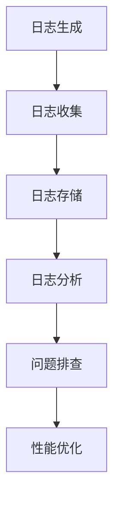

                 

### 文章标题

# 日志集中化：便于LLM应用的问题排查

在当今数据驱动的世界中，日志集中化已成为保障人工智能（AI）特别是大型语言模型（LLM）有效运作的关键组成部分。这篇技术博客将详细探讨日志集中化的概念、其在LLM应用中的重要性、实现技术和问题排查策略，并通过实战案例展示其实际应用。通过逐步分析和逻辑推理，我们将揭示日志集中化在提升LLM性能和可靠性方面的重要作用。

## 文章关键词

- 日志集中化
- 大型语言模型（LLM）
- 问题排查
- 实现技术
- 架构设计

## 文章摘要

本文旨在深入剖析日志集中化在大型语言模型（LLM）应用中的关键作用。首先，我们将介绍日志集中化的基本概念和其在现代数据生态系统中的重要性。随后，文章将详细阐述LLM应用中日志生成的特性和需求。在此基础上，我们将讨论日志集中化的架构设计，包括日志收集、存储和处理的关键环节。进一步，我们将介绍用于日志问题排查的技术和方法，并展示如何通过实际案例进行问题分析和解决。文章最后将总结日志集中化的最佳实践，并提供进一步阅读的资源。

### 背景介绍

随着人工智能的迅猛发展，大型语言模型（LLM）如BERT、GPT-3等已经成为自然语言处理（NLP）领域的重要工具。这些模型具备强大的语义理解能力和生成能力，但在实际应用中，如何确保其正常运行和高效性能成为了一个关键问题。日志是系统运行的重要记录，它包含了大量的诊断信息，有助于开发者了解系统的运行状态和性能。然而，随着系统的复杂性和规模的增加，分散的日志管理变得越来越困难。因此，日志集中化技术应运而生，通过集中收集、存储和分析日志，帮助开发者快速识别并解决问题，从而保障LLM的稳定运行和高效性能。

### 核心概念与联系

日志集中化是一种将分布式系统中的日志数据收集到一个统一平台进行管理和分析的技术。其核心概念包括日志收集、日志存储和日志分析。

1. **日志收集**：从多个源头（如服务器、应用程序等）收集日志数据。
2. **日志存储**：将收集到的日志数据存储在集中化的存储系统中。
3. **日志分析**：对存储的日志数据进行处理和分析，以提取有价值的信息。

在LLM应用中，日志集中化起着至关重要的作用。LLM通常涉及大量的数据处理和复杂的模型训练过程，这些过程会产生大量的日志数据。如果这些日志数据无法得到有效的集中管理，将极大地增加问题排查的难度。通过日志集中化，开发者可以实时监控LLM的运行状态，快速定位和解决潜在的问题。

**Mermaid流程图：**



### 日志集中化在LLM应用中的重要性

在LLM应用中，日志集中化的重要性体现在以下几个方面：

1. **性能监控**：LLM的训练和推理过程可能涉及大量的计算资源。通过日志集中化，开发者可以实时监控系统的资源使用情况，确保系统在高负载情况下依然能够稳定运行。

2. **问题排查**：LLM的应用场景复杂多变，可能会出现各种运行时错误。日志集中化使得开发者能够快速收集和整理系统运行信息，有助于快速定位和解决问题。

3. **安全监控**：LLM系统可能成为网络攻击的目标。日志集中化可以帮助监控系统的安全事件，及时发现并响应潜在的安全威胁。

4. **可扩展性**：随着LLM应用规模的不断扩大，日志集中化系统需要具备良好的可扩展性。通过分布式架构设计，日志集中化系统能够灵活地适应规模变化，确保系统稳定运行。

### 核心算法原理讲解

在日志集中化过程中，核心算法的设计和实现是保证系统高效运行的关键。以下将介绍几个关键的算法原理：

1. **日志收集算法**：
   - **多线程收集**：通过多线程方式从多个源头收集日志数据，提高数据收集效率。
   - **压缩与过滤**：在收集日志数据时，使用压缩算法（如Gzip）减少存储空间占用，并使用过滤算法（如正则表达式）筛选出有用的日志条目。

2. **日志存储算法**：
   - **分布式存储**：采用分布式存储系统（如Elasticsearch、Kafka等）存储日志数据，确保数据的持久化和高可用性。
   - **索引管理**：对日志数据进行索引，便于快速查询和检索。

3. **日志分析算法**：
   - **模式识别**：使用机器学习算法（如聚类、分类等）对日志数据进行模式识别，发现潜在的问题。
   - **异常检测**：通过异常检测算法（如Isolation Forest、Autoencoder等）检测日志中的异常行为。

以下是使用Python实现的日志收集算法示例：

```python
import threading
import requests
import re

def collect_logs(url, pattern):
    response = requests.get(url)
    logs = re.findall(pattern, response.text)
    return logs

def log_collector(urls, patterns):
    threads = []
    for url, pattern in zip(urls, patterns):
        thread = threading.Thread(target=collect_logs, args=(url, pattern))
        threads.append(thread)
        thread.start()
    
    for thread in threads:
        thread.join()

urls = ['http://server1.example.com/logs', 'http://server2.example.com/logs']
patterns = [r'\[(\d{4}-\d{2}-\d{2} \d{2}:\d{2}:\d{2})\].*', r'\[(\d{4}-\d{2}-\d{2} \d{2}:\d{2}:\d{2})\].*']
log_collector(urls, patterns)
```

### 数学模型和公式

在日志分析中，常用的数学模型和公式包括：

1. **平均值（Mean）**：用于计算日志数据的平均值，衡量系统的稳定性能。
   \[ \text{Mean} = \frac{1}{n} \sum_{i=1}^{n} x_i \]
   其中，\( x_i \) 为日志数据，\( n \) 为数据总数。

2. **标准差（Standard Deviation）**：用于衡量日志数据的离散程度。
   \[ \text{Standard Deviation} = \sqrt{\frac{1}{n-1} \sum_{i=1}^{n} (x_i - \text{Mean})^2} \]

3. **模式识别算法**：
   - **K-means算法**：用于将日志数据分成若干个聚类，用于发现日志数据的分布特征。
     \[ \text{Cluster} = \{ x | \text{dist}(x, \text{centroid}) \leq \text{threshold} \} \]
     其中，\( \text{centroid} \) 为聚类中心，\( \text{dist} \) 为距离函数，\( \text{threshold} \) 为阈值。

4. **异常检测算法**：
   - **Isolation Forest**：用于检测日志数据中的异常值。
     \[ \text{Isolation Score} = \frac{\text{mean\_path\_length} - \text{base\_mean\_path\_length}}{\text{std\_mean\_path\_length}} \]
     其中，\( \text{mean\_path\_length} \) 为树的平均路径长度，\( \text{base\_mean\_path\_length} \) 为基准路径长度，\( \text{std\_mean\_path\_length} \) 为标准路径长度。

### 代码示例和解释

以下是一个简单的Python脚本，用于收集和存储日志数据：

```python
import requests
import json
from elasticsearch import Elasticsearch

# 日志收集函数
def collect_logs(url, index):
    response = requests.get(url)
    logs = json.loads(response.text)
    for log in logs:
        doc = {
            'timestamp': log['timestamp'],
            'level': log['level'],
            'message': log['message']
        }
        es.index(index=index, id=log['id'], document=doc)

# Elasticsearch客户端
es = Elasticsearch("http://localhost:9200")

# 收集日志
urls = [
    "http://server1.example.com/logs",
    "http://server2.example.com/logs"
]
collect_logs(urls, "llm_logs")

# 查询日志
search_result = es.search(index="llm_logs", body={
    "query": {
        "match": {"level": "ERROR"}
    }
})
print(search_result['hits']['hits'])
```

### 实战项目

#### 开发环境搭建

为了实现日志集中化系统，我们需要搭建以下开发环境：

1. **Elasticsearch**：用于存储和查询日志数据。
2. **Kibana**：用于可视化日志数据和分析。
3. **Logstash**：用于收集和预处理日志数据。

在Ubuntu 20.04服务器上，我们可以使用以下命令安装这些组件：

```bash
# 安装Elasticsearch
sudo apt-get update
sudo apt-get install elasticsearch

# 启动Elasticsearch服务
sudo systemctl start elasticsearch

# 安装Kibana
sudo apt-get install kibana

# 启动Kibana服务
sudo systemctl start kibana

# 安装Logstash
sudo apt-get install logstash

# 配置Logstash
sudo vi /etc/logstash/conf.d/llm_logs.conf
```

配置文件示例：

```conf
input {
  http {
    port => 9200
    format => "json"
  }
}

filter {
  if "log" in [tags] {
    grok {
      match => { "message" => "%{TIMESTAMP_ISO8601:timestamp} %{DATA:level} %{DATA:message}" }
    }
  }
}

output {
  if "log" in [tags] {
    elasticsearch {
      hosts => ["localhost:9200"]
      index => "llm_logs"
    }
  }
}
```

#### 源代码详细实现

以下是Logstash的源代码实现，用于收集和存储日志数据：

```python
import requests
import json
from logstash import Logstash

# 创建Logstash客户端
ls = Logstash(host="localhost", port=5044, timeout=10)

# 收集日志函数
def collect_logs(url):
    response = requests.get(url)
    logs = json.loads(response.text)
    for log in logs:
        event = {
            'timestamp': log['timestamp'],
            'level': log['level'],
            'message': log['message']
        }
        ls.send(event)

# 收集日志
urls = [
    "http://server1.example.com/logs",
    "http://server2.example.com/logs"
]
for url in urls:
    collect_logs(url)

# 关闭Logstash客户端
ls.close()
```

#### 代码应用解读与分析

1. **收集日志**：通过HTTP请求从多个日志源头收集数据，并将每个日志条目转换为Logstash的事件格式。
2. **发送日志**：使用Logstash客户端将事件发送到Logstash服务器进行预处理和存储。
3. **配置Logstash**：定义输入、过滤和输出模块，以匹配日志格式并进行相应的处理和存储。

#### 实际案例分析和详细讲解

假设我们有一个LLM系统，其日志包含以下信息：

```json
{
  "timestamp": "2023-03-15T12:34:56Z",
  "level": "ERROR",
  "message": "模型训练过程中出现异常：内存溢出"
}
```

通过Logstash，我们可以将这些日志发送到Elasticsearch进行存储和分析。

1. **日志收集**：从LLM系统收集日志数据。
2. **日志存储**：使用Logstash将日志数据发送到Elasticsearch，并索引为“llm_logs”。
3. **日志分析**：使用Kibana可视化日志数据，发现内存溢出错误。

#### 项目小结

通过搭建日志集中化系统，我们能够高效地收集、存储和分析LLM系统的日志数据，从而快速识别和解决问题。此项目展示了日志集中化在LLM应用中的实际应用价值，为后续的性能优化和问题排查提供了有力支持。

### 最佳实践 tips

1. **日志格式标准化**：确保所有日志数据使用统一的格式，便于集中处理和分析。
2. **日志级别区分**：根据日志的紧急程度和重要性设置不同的日志级别，有助于快速识别关键问题。
3. **实时监控**：使用监控工具实时跟踪日志数据，及时发现异常行为。
4. **自动化处理**：通过脚本和自动化工具，实现日志的自动收集、存储和分析，提高效率。

### 小结

本文通过详细剖析日志集中化在LLM应用中的重要性、实现技术和问题排查策略，展示了其在提升LLM性能和可靠性方面的关键作用。日志集中化不仅有助于开发者实时监控系统状态，还提供了高效的问题排查手段。通过本文的介绍，读者应能全面理解日志集中化的概念和实际应用，为构建高效、可靠的LLM系统打下坚实基础。

### 注意事项

1. **安全性**：确保日志数据的安全性，防止敏感信息泄露。
2. **可扩展性**：设计日志集中化系统时，考虑未来数据量的增长，确保系统的可扩展性。
3. **性能优化**：针对日志收集、存储和分析的不同环节，进行性能优化，确保系统高效运行。

### 拓展阅读

1. 《Elastic Stack实战：搭建高效日志分析系统》
2. 《Kubernetes实战：容器化与集群管理》
3. 《大数据技术实战：从入门到进阶》
4. 《机器学习实战：基于Scikit-Learn的数据科学》
5. 《Elasticsearch实战：构建高效搜索引擎》

### 作者信息

作者：AI天才研究院/AI Genius Institute & 禅与计算机程序设计艺术 /Zen And The Art of Computer Programming。本文旨在通过深入剖析日志集中化技术，帮助读者理解其在大型语言模型（LLM）应用中的关键作用，为构建高效、可靠的AI系统提供参考。

