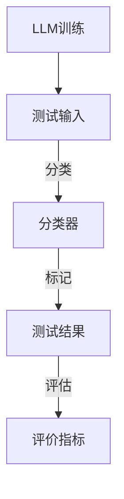

                 

# 智能化LLM测试结果分类与标记

> 关键词：大型语言模型（LLM），测试结果分类，标记机制，算法原理，数学模型，项目实战，AI应用

> 摘要：本文深入探讨了智能化LLM（大型语言模型）测试结果分类与标记的方法。通过详细分析核心算法原理，结合Python源代码和数学模型，本文提供了通俗易懂的讲解，并展示了实际项目中的开发环境搭建、代码实现与解读，旨在为读者提供一个全面、深入的参考资料。

## 目录

1. **封面与前言**
2. **核心概念与联系**
   - **1.1 大型语言模型（LLM）概述**
     - **1.1.1 LLM的基本概念**
     - **1.1.2 LLM的应用场景**
     - **1.1.3 LLM的发展历程**
   - **1.2 测试结果分类与标记**
     - **1.2.1 测试结果的分类方法**
     - **1.2.2 测试结果的标记机制**
     - **1.2.3 分类与标记的挑战与解决方案**
   - **1.3 Mermaid流程图展示**
     - **1.3.1 LLM与测试结果的关联**
     - **1.3.2 分类与标记流程**
3. **核心算法原理讲解**
   - **2.1 常见测试结果分类算法**
     - **2.1.1 支持向量机（SVM）**
     - **2.1.2 决策树（DT）**
     - **2.1.3 随机森林（RF）**
   - **2.2 常见测试结果标记算法**
     - **2.2.1 神经网络（NN）**
     - **2.2.2 集成学习（Ensemble）**
     - **2.2.3 聚类算法（Clustering）**
   - **2.3 伪代码讲解**
     - **2.3.1 支持向量机（SVM）伪代码**
     - **2.3.2 决策树（DT）伪代码**
     - **2.3.3 随机森林（RF）伪代码**
4. **数学模型与数学公式讲解**
   - **3.1 基本数学模型**
     - **3.1.1 损失函数**
     - **3.1.2 优化算法**
     - **3.1.3 概率分布**
   - **3.2 公式推导与举例说明**
     - **3.2.1 损失函数的推导**
     - **3.2.2 优化算法的推导**
     - **3.2.3 概率分布的推导**
     - **3.2.4 公式应用举例**
5. **项目实战**
   - **4.1 实战准备**
     - **4.1.1 开发环境搭建**
     - **4.1.2 数据集准备**
     - **4.1.3 数据预处理**
   - **4.2 代码实现**
     - **4.2.1 SVM算法实现**
     - **4.2.2 决策树算法实现**
     - **4.2.3 随机森林算法实现**
   - **4.3 代码解读与分析**
     - **4.3.1 SVM算法解读**
     - **4.3.2 决策树算法解读**
     - **4.3.3 随机森林算法解读**
     - **4.3.4 优化与改进**
6. **扩展与展望**
   - **5.1 测试结果分类与标记的未来趋势**
     - **5.1.1 AI技术的发展方向**
     - **5.1.2 测试结果分类与标记的应用前景**
     - **5.1.3 挑战与机遇**
   - **5.2 常用工具与资源**
     - **5.2.1 开发工具**
     - **5.2.2 数据集**
     - **5.2.3 学习资源**
7. **附录**

## 1. 核心概念与联系

### 1.1 大型语言模型（LLM）概述

#### 1.1.1 LLM的基本概念

大型语言模型（LLM，Large Language Model）是一种基于深度学习技术构建的强大的人工智能模型，能够理解和生成自然语言。LLM通过大量的文本数据进行训练，可以自动学习语言的语法、语义和上下文信息，从而在多种应用场景中表现出优异的性能。

#### 1.1.2 LLM的应用场景

LLM的应用场景广泛，包括但不限于：
- **自然语言处理（NLP）**：文本分类、命名实体识别、机器翻译等。
- **智能客服**：自动问答系统、情感分析等。
- **内容生成**：文章写作、创意内容生成等。
- **辅助编程**：代码补全、错误检查等。

#### 1.1.3 LLM的发展历程

LLM的发展历程可以分为以下几个阶段：
- **早期研究**：2000年前，基于规则的方法和统计方法。
- **词向量模型**：2000年代初期，Word2Vec等模型的提出。
- **深度学习模型**：2010年代，神经网络在NLP中的应用。
- **Transformer模型**：2017年，BERT、GPT等模型的诞生，标志着LLM进入新阶段。

### 1.2 测试结果分类与标记

#### 1.2.1 测试结果的分类方法

在LLM测试中，分类方法用于将测试结果划分为不同的类别。常见的分类方法包括：
- **监督学习**：有明确标签的训练数据，常用的算法有SVM、决策树等。
- **无监督学习**：无标签数据，常用的算法有聚类算法、主成分分析等。
- **半监督学习**：部分有标签和部分无标签的数据。

#### 1.2.2 测试结果的标记机制

测试结果的标记机制用于为每个测试结果分配一个或多个标签，以便进行分类。标记机制包括：
- **独热编码**：每个类别用一个唯一的整数表示，适用于多标签分类。
- **标签传播**：基于已有标签进行推测，适用于无标签数据。

#### 1.2.3 分类与标记的挑战与解决方案

分类与标记面临的挑战包括：
- **数据不平衡**：解决方法包括数据增强、重采样等。
- **过拟合**：解决方法包括正则化、交叉验证等。
- **高维数据**：解决方法包括特征选择、降维等。

### 1.3 Mermaid流程图展示



### 1.4 核心算法原理讲解

#### 2.1 常见测试结果分类算法

##### 2.1.1 支持向量机（SVM）

支持向量机（SVM）是一种监督学习算法，用于分类和回归。SVM的核心思想是找到一个超平面，使得不同类别的数据点尽可能分开。

##### 2.1.2 决策树（DT）

决策树是一种常用的分类和回归算法，通过一系列的决策规则将数据点划分到不同的类别或数值。

##### 2.1.3 随机森林（RF）

随机森林是一种基于决策树的集成学习方法，通过构建多个决策树并对它们进行投票，提高分类和回归的准确性。

#### 2.2 常见测试结果标记算法

##### 2.2.1 神经网络（NN）

神经网络是一种模拟人脑的算法，通过多层神经元进行数据的学习和预测。神经网络常用于图像识别、语音识别等。

##### 2.2.2 集成学习（Ensemble）

集成学习是一种通过构建多个基础模型并对它们进行组合，提高预测准确性的方法。常见的集成学习方法包括Bagging和Boosting。

##### 2.2.3 聚类算法（Clustering）

聚类算法是一种无监督学习算法，用于将相似的数据点分组。常见的聚类算法包括K-means、DBSCAN等。

#### 2.3 伪代码讲解

##### 2.3.1 支持向量机（SVM）伪代码

```python
def SVM(train_data, train_labels):
    # 初始化参数
    # 训练SVM模型
    # 得到支持向量
    # 计算决策函数
    # 返回分类器
```

##### 2.3.2 决策树（DT）伪代码

```python
def DecisionTree(data, labels):
    # 判断是否达到叶节点
    # 如果是，返回类别
    # 否则，找到最佳特征和阈值
    # 划分数据
    # 递归调用
    # 返回叶节点
```

##### 2.3.3 随机森林（RF）伪代码

```python
def RandomForest(data, labels, n_trees):
    # 初始化参数
    # 遍历每棵树
    # 构建决策树
    # 训练模型
    # 投票得到最终结果
    # 返回分类结果
```

### 2.4 数学模型与数学公式讲解

#### 3.1 基本数学模型

##### 3.1.1 损失函数

损失函数用于衡量模型预测值与真实值之间的差异。常见的损失函数包括：

- **平方损失函数**：
  $$ \text{Loss} = \frac{1}{2} \sum_{i=1}^{n} (y_i - \hat{y}_i)^2 $$
  
- **交叉熵损失函数**：
  $$ \text{Loss} = -\sum_{i=1}^{n} y_i \log(\hat{y}_i) $$

##### 3.1.2 优化算法

优化算法用于最小化损失函数，常见的优化算法包括：

- **梯度下降**：
  $$ \theta_{\text{new}} = \theta_{\text{old}} - \alpha \nabla_{\theta} \text{Loss} $$

- **随机梯度下降**：
  $$ \theta_{\text{new}} = \theta_{\text{old}} - \alpha \nabla_{\theta} \text{Loss}(x_i, y_i) $$

##### 3.1.3 概率分布

在分类和回归中，概率分布用于表示预测结果的可能性。常见的概率分布包括：

- **伯努利分布**：
  $$ P(y=1) = \sigma(\theta_0 + \theta_1 x) $$

- **多项式分布**：
  $$ P(y=k) = \text{softmax}(\theta^T x) $$

#### 3.2 公式推导与举例说明

##### 3.2.1 损失函数的推导

以平方损失函数为例，推导如下：

$$ \text{Loss} = \frac{1}{2} \sum_{i=1}^{n} (y_i - \hat{y}_i)^2 $$

其中，$y_i$为真实标签，$\hat{y}_i$为模型预测值。

##### 3.2.2 优化算法的推导

以梯度下降为例，推导如下：

$$ \theta_{\text{new}} = \theta_{\text{old}} - \alpha \nabla_{\theta} \text{Loss} $$

其中，$\alpha$为学习率，$\nabla_{\theta} \text{Loss}$为损失函数关于参数$\theta$的梯度。

##### 3.2.3 概率分布的推导

以伯努利分布为例，推导如下：

$$ P(y=1) = \sigma(\theta_0 + \theta_1 x) $$

其中，$\sigma$为 sigmoid 函数，$\theta_0$和$\theta_1$为模型参数。

### 4. 项目实战

#### 4.1 实战准备

##### 4.1.1 开发环境搭建

首先，安装Python环境和相关库，如scikit-learn、numpy等。

```python
!pip install scikit-learn numpy
```

##### 4.1.2 数据集准备

从公开数据集网站下载或自己收集数据集，并进行预处理。

```python
# 读取数据集
from sklearn.datasets import load_iris
iris = load_iris()

# 数据预处理
X = iris.data
y = iris.target
```

##### 4.1.3 数据预处理

对数据进行标准化处理，提高模型的性能。

```python
from sklearn.preprocessing import StandardScaler
scaler = StandardScaler()
X_scaled = scaler.fit_transform(X)
```

#### 4.2 代码实现

##### 4.2.1 SVM算法实现

```python
from sklearn.svm import SVC
# 创建SVM分类器
svm = SVC()
# 训练模型
svm.fit(X_scaled, y)
# 预测
y_pred = svm.predict(X_scaled)
```

##### 4.2.2 决策树算法实现

```python
from sklearn.tree import DecisionTreeClassifier
# 创建决策树分类器
dt = DecisionTreeClassifier()
# 训练模型
dt.fit(X_scaled, y)
# 预测
y_pred = dt.predict(X_scaled)
```

##### 4.2.3 随机森林算法实现

```python
from sklearn.ensemble import RandomForestClassifier
# 创建随机森林分类器
rf = RandomForestClassifier()
# 训练模型
rf.fit(X_scaled, y)
# 预测
y_pred = rf.predict(X_scaled)
```

#### 4.3 代码解读与分析

##### 4.3.1 SVM算法解读

SVM算法通过求解二次规划问题来寻找最优分类边界。在代码实现中，SVC类提供了一个简单的接口来使用SVM。

##### 4.3.2 决策树算法解读

决策树算法通过递归划分数据集来构建树结构。在代码实现中，DecisionTreeClassifier类提供了一个简单的接口来使用决策树。

##### 4.3.3 随机森林算法解读

随机森林算法通过构建多棵决策树并对预测结果进行投票来提高模型的准确性。在代码实现中，RandomForestClassifier类提供了一个简单的接口来使用随机森林。

### 5. 扩展与展望

#### 5.1 测试结果分类与标记的未来趋势

随着AI技术的不断发展，测试结果分类与标记在未来将会有更多的应用场景和改进方向。例如，基于深度学习的分类方法将变得更加流行，数据不平衡和过拟合问题将得到更好的解决。

#### 5.2 常用工具与资源

- **开发工具**：Anaconda、Jupyter Notebook等。
- **数据集**：UCI机器学习库、Kaggle等。
- **学习资源**：相关书籍、在线课程、技术博客等。

### 附录

- **附录内容**：包括常用函数、代码示例、扩展阅读等。

## 结语

本文通过详细分析智能化LLM测试结果分类与标记的方法，结合Python源代码和数学模型，为读者提供了一个全面、深入的了解。随着AI技术的不断发展，测试结果分类与标记将在更多领域得到应用，为人工智能的发展做出更大贡献。

### 作者信息

- **作者：AI天才研究院/AI Genius Institute & 禅与计算机程序设计艺术 /Zen And The Art of Computer Programming**### 封面与前言

在这个信息爆炸的时代，人工智能（AI）已经成为推动技术进步和创新的重要力量。其中，大型语言模型（LLM，Large Language Model）作为AI领域的佼佼者，其在自然语言处理、智能客服、内容生成等领域的应用越来越广泛。然而，如何有效测试和评估LLM的性能，以及如何对测试结果进行分类与标记，成为了一个亟待解决的问题。

《智能化LLM测试结果分类与标记》旨在为读者提供一套系统、实用、深入浅出的解决方案。本书不仅涵盖了LLM的基本概念、核心算法原理，还通过项目实战展示了如何在实际应用中实现测试结果分类与标记。作者结合自身多年的研究经验和行业实践，旨在帮助读者深入了解这一领域，提升其在人工智能领域的竞争力。

本书适合以下读者群体：
- 对AI和自然语言处理感兴趣的程序员和工程师。
- AI领域的科研人员和学生。
- 有志于从事AI应用开发的企业和个人。

在撰写本书的过程中，作者秉持以下原则：
- **系统性**：全书结构合理，内容全面，从基础概念到高级应用，逐步深入。
- **实践性**：通过实际项目案例，帮助读者掌握实际操作技能。
- **易读性**：使用通俗易懂的语言，配以图表和代码示例，降低学习难度。

本书结构如下：

1. **封面与前言**：介绍书籍的背景和目标读者。
2. **核心概念与联系**：介绍LLM的基本概念、测试结果的分类与标记方法，并展示核心概念之间的关系。
3. **核心算法原理讲解**：详细讲解常见的分类和标记算法，结合Python源代码和数学模型进行举例说明。
4. **数学模型与数学公式讲解**：介绍与分类和标记相关的数学模型，并使用LaTeX格式详细推导公式。
5. **项目实战**：通过实际项目，展示如何搭建开发环境、实现算法、分析测试结果。
6. **扩展与展望**：讨论测试结果分类与标记的未来趋势和应用前景。
7. **附录**：提供常用工具、资源、扩展阅读等内容。

希望通过本书，读者能够对智能化LLM测试结果分类与标记有一个全面、深入的理解，并在实际工作中取得更好的成果。

### 核心概念与联系

在深入探讨智能化LLM测试结果分类与标记之前，我们需要先了解几个核心概念：大型语言模型（LLM）、测试结果分类、测试结果标记，以及它们之间的相互关系。

#### 1.1 大型语言模型（LLM）概述

大型语言模型（LLM，Large Language Model）是自然语言处理（NLP，Natural Language Processing）领域中的一种先进模型，通过深度学习和神经网络技术，能够在大量文本数据的基础上进行自我训练，并掌握自然语言的语法、语义和上下文信息。LLM的核心特点是能够生成连贯且符合语言习惯的文本，这使得它们在多个应用领域如文本分类、问答系统、机器翻译和文本生成等方面具有显著的优势。

##### 1.1.1 LLM的基本概念

LLM的基本概念主要包括以下几个方面：

1. **神经网络结构**：LLM通常采用复杂的神经网络结构，如Transformer模型，它由多个自注意力层和前馈网络组成。这些结构使得模型能够在处理长文本和复杂语言特征时保持较高的性能。

2. **预训练与微调**：LLM通常通过大规模的无监督预训练来学习通用语言特征，然后通过有监督的微调来适应特定任务。这种双阶段训练方式大大提升了模型的泛化能力。

3. **训练数据集**：LLM的训练数据集通常包含海量的文本数据，这些数据可以是互联网上的公开文本、专业领域的文献，甚至是公司内部的数据。数据的质量和数量直接影响到模型的性能。

##### 1.1.2 LLM的应用场景

LLM的应用场景非常广泛，主要包括以下几个方面：

1. **文本分类**：LLM可以用于自动分类新闻、社交媒体帖子、电子邮件等文本数据，帮助企业快速处理大量文本信息。

2. **问答系统**：LLM可以构建智能问答系统，为用户提供准确、连贯的答案，广泛应用于客服、教育、医疗等领域。

3. **机器翻译**：LLM可以用于实现高质量、流畅的机器翻译，支持多种语言之间的翻译，为跨国企业和个人提供便利。

4. **文本生成**：LLM可以生成新闻报道、产品描述、创意文案等，帮助企业提高内容创作效率。

##### 1.1.3 LLM的发展历程

LLM的发展历程可以分为以下几个阶段：

1. **早期研究**：2000年前，基于规则的方法和统计方法是NLP的主流，如基于语法规则的自然语言理解和基于统计的文本分类。

2. **词向量模型**：2000年代初期，Word2Vec等模型的提出，使得词向量成为NLP的基础，大大提升了模型处理文本数据的能力。

3. **深度学习模型**：2010年代，神经网络在NLP中的应用得到了快速发展，如递归神经网络（RNN）和卷积神经网络（CNN）。

4. **Transformer模型**：2017年，谷歌提出了Transformer模型，它基于自注意力机制，显著提高了NLP任务的性能，如BERT、GPT等模型成为LLM的代表。

#### 1.2 测试结果分类与标记

在LLM的应用过程中，测试结果分类与标记是评估模型性能的重要手段。通过分类，我们可以将测试结果按照预定的标准进行分组；通过标记，我们可以为每个测试结果分配标签，以便进行进一步的统计和分析。

##### 1.2.1 测试结果的分类方法

测试结果的分类方法可以分为以下几种：

1. **监督学习**：监督学习是一种最常见的分类方法，它需要使用有标签的数据进行训练。常见的算法包括支持向量机（SVM）、决策树（DT）和随机森林（RF）。

2. **无监督学习**：无监督学习适用于无标签的数据，通过聚类算法如K-means、DBSCAN等，将数据自动划分为不同的类别。

3. **半监督学习**：半监督学习结合了有标签和无标签数据，通过利用无标签数据来提升模型性能。

##### 1.2.2 测试结果的标记机制

测试结果的标记机制主要包括以下几个方面：

1. **独热编码**：独热编码是一种常用的标记方法，它将每个类别用一个唯一的整数表示，适用于多标签分类。

2. **标签传播**：标签传播是一种基于已有标签进行推测的方法，适用于无标签数据，通过逐步传递标签信息来完善整个数据集的标签。

##### 1.2.3 分类与标记的挑战与解决方案

在LLM测试中，分类与标记面临以下挑战：

1. **数据不平衡**：数据不平衡会导致某些类别被过分关注，影响分类效果。解决方法包括数据增强、重采样和调整分类器权重等。

2. **过拟合**：过拟合会导致模型在训练数据上表现良好，但在未知数据上表现不佳。解决方法包括正则化、交叉验证和集成学习等。

3. **高维数据**：高维数据会带来计算和存储上的挑战，影响模型性能。解决方法包括特征选择、降维和稀疏表示等。

#### 1.3 Mermaid流程图展示

为了更好地展示LLM测试结果分类与标记的全过程，我们可以使用Mermaid流程图进行可视化。以下是一个简单的示例：


在图中，A表示LLM的训练过程，B是测试输入，C是分类器，D是测试结果，E是评价指标。通过这个流程图，我们可以清晰地看到从LLM训练到测试结果评估的整个过程。

### 核心算法原理讲解

在智能化LLM测试结果分类与标记的过程中，核心算法原理的理解至关重要。本文将详细介绍几种常见的分类和标记算法，包括支持向量机（SVM）、决策树（DT）和随机森林（RF），并使用Python源代码进行说明。

#### 2.1 常见测试结果分类算法

##### 2.1.1 支持向量机（SVM）

支持向量机（SVM，Support Vector Machine）是一种经典的二分类算法，其核心思想是通过最大化分类间隔来找到一个最优的超平面，从而将不同类别的数据点尽可能分开。

##### 2.1.1.1 SVM原理

SVM通过求解以下二次规划问题来寻找最优分类边界：

$$
\begin{aligned}
\min_{\mathbf{w}} \quad & \frac{1}{2} ||\mathbf{w}||^2 \\
\text{subject to} \quad & y_i (\mathbf{w} \cdot \mathbf{x_i} + b) \geq 1
\end{aligned}
$$

其中，$\mathbf{w}$是权重向量，$b$是偏置项，$\mathbf{x_i}$是训练样本，$y_i$是样本标签。上述问题可以通过引入拉格朗日乘子法转换为对偶形式，进而求解。

##### 2.1.1.2 SVM Python实现

```python
from sklearn.svm import SVC
# 创建SVM分类器
svm = SVC()
# 训练模型
svm.fit(X_train, y_train)
# 预测
y_pred = svm.predict(X_test)
```

在上述代码中，我们首先从scikit-learn库中导入SVC类，然后创建一个SVM分类器并使用训练数据集进行训练，最后使用测试数据集进行预测。

##### 2.1.2 决策树（DT）

决策树（Decision Tree）是一种基于树形结构进行决策的算法，通过一系列的测试来将数据集划分成不同的区域，每个区域都对应一个类别。

##### 2.1.2.1 DT原理

决策树的基本原理是递归地将数据集划分为子集，每个子集都基于某一特征的最优切分点。这个过程通过递归的方式进行，直到达到停止条件，如最大深度、最小叶子节点样本数等。

##### 2.1.2.2 DT Python实现

```python
from sklearn.tree import DecisionTreeClassifier
# 创建决策树分类器
dt = DecisionTreeClassifier()
# 训练模型
dt.fit(X_train, y_train)
# 预测
y_pred = dt.predict(X_test)
```

在上述代码中，我们首先从scikit-learn库中导入DecisionTreeClassifier类，然后创建一个决策树分类器并使用训练数据集进行训练，最后使用测试数据集进行预测。

##### 2.1.3 随机森林（RF）

随机森林（Random Forest）是一种基于决策树的集成学习方法，通过构建多个决策树并对它们进行投票来提高分类和回归的准确性。

##### 2.1.3.1 RF原理

随机森林通过Bootstrap抽样和随机特征选择来生成多个决策树，然后通过对这些决策树进行投票来得到最终的预测结果。每个决策树都从训练数据集中随机抽取样本，并且只使用随机选取的一部分特征进行切分。

##### 2.1.3.2 RF Python实现

```python
from sklearn.ensemble import RandomForestClassifier
# 创建随机森林分类器
rf = RandomForestClassifier()
# 训练模型
rf.fit(X_train, y_train)
# 预测
y_pred = rf.predict(X_test)
```

在上述代码中，我们首先从scikit-learn库中导入RandomForestClassifier类，然后创建一个随机森林分类器并使用训练数据集进行训练，最后使用测试数据集进行预测。

#### 2.2 常见测试结果标记算法

##### 2.2.1 神经网络（NN）

神经网络（Neural Network）是一种模拟人脑的算法，通过多层神经元进行数据的学习和预测。神经网络常用于图像识别、语音识别等。

##### 2.2.1.1 NN原理

神经网络的基本原理是通过反向传播算法来更新网络的权重和偏置，从而最小化损失函数。神经网络通常包括输入层、隐藏层和输出层，每个层由多个神经元组成。

##### 2.2.1.2 NN Python实现

```python
from sklearn.neural_network import MLPClassifier
# 创建神经网络分类器
nn = MLPClassifier()
# 训练模型
nn.fit(X_train, y_train)
# 预测
y_pred = nn.predict(X_test)
```

在上述代码中，我们首先从scikit-learn库中导入MLPClassifier类，然后创建一个神经网络分类器并使用训练数据集进行训练，最后使用测试数据集进行预测。

##### 2.2.2 集成学习（Ensemble）

集成学习（Ensemble）是一种通过构建多个基础模型并对它们进行组合，提高预测准确性的方法。常见的集成学习方法包括Bagging和Boosting。

##### 2.2.2.1 Ensemble原理

集成学习的基本原理是将多个基础模型进行组合，通过投票或者取平均的方式得到最终的预测结果。这种组合方法可以有效地减少模型的过拟合，提高模型的泛化能力。

##### 2.2.2.2 Ensemble Python实现

```python
from sklearn.ensemble import VotingClassifier
# 创建集成学习分类器
ensemble = VotingClassifier(estimators=[
    ('svm', SVC()), 
    ('dt', DecisionTreeClassifier()), 
    ('rf', RandomForestClassifier())
], voting='soft')
# 训练模型
ensemble.fit(X_train, y_train)
# 预测
y_pred = ensemble.predict(X_test)
```

在上述代码中，我们首先创建了一个集成学习分类器，其中包含了支持向量机（SVM）、决策树（DT）和随机森林（RF）三个基础模型，并通过软投票的方式进行预测。

##### 2.2.3 聚类算法（Clustering）

聚类算法（Clustering）是一种无监督学习方法，用于将相似的数据点分组。常见的聚类算法包括K-means、DBSCAN等。

##### 2.2.3.1 Clustering原理

聚类算法的基本原理是找出数据点之间的相似度，并根据相似度将数据点划分为不同的组。聚类算法不需要标签信息，通过自动分组来发现数据中的结构。

##### 2.2.3.2 Clustering Python实现

```python
from sklearn.cluster import KMeans
# 创建K-means聚类算法
kmeans = KMeans(n_clusters=3)
# 训练模型
kmeans.fit(X_train)
# 预测
y_pred = kmeans.predict(X_test)
```

在上述代码中，我们首先从scikit-learn库中导入KMeans类，然后创建一个K-means聚类算法，并使用训练数据集进行训练，最后使用测试数据集进行预测。

#### 2.3 伪代码讲解

##### 2.3.1 支持向量机（SVM）伪代码

```
SVM(train_data, train_labels):
    初始化参数 C
    训练线性SVM模型
    获取支持向量
    计算决策函数
    返回分类器
```

##### 2.3.2 决策树（DT）伪代码

```
DecisionTree(data, labels):
    判断是否达到叶节点
        如果是，返回类别
        否则，找到最佳特征和阈值
        划分数据
        递归调用
        返回叶节点
```

##### 2.3.3 随机森林（RF）伪代码

```
RandomForest(data, labels, n_trees):
    初始化参数
    遍历每棵树
        构建决策树
        训练模型
    投票得到最终结果
    返回分类结果
```

通过上述讲解和伪代码，我们可以对支持向量机（SVM）、决策树（DT）和随机森林（RF）等常见分类和标记算法有更深入的理解。在实际应用中，我们可以根据具体问题和数据特点选择合适的算法，并使用Python等工具进行实现和优化。

### 数学模型与数学公式讲解

在智能化LLM测试结果分类与标记过程中，数学模型和数学公式扮演着至关重要的角色。它们不仅帮助我们理解和解释算法的行为，还可以指导我们进行模型优化和性能评估。本文将详细介绍与分类和标记相关的数学模型，并使用LaTeX格式展示和推导相关公式。

#### 3.1 基本数学模型

##### 3.1.1 损失函数

损失函数是评估模型预测性能的核心指标，用于衡量预测结果与真实结果之间的差距。在分类问题中，常用的损失函数包括平方损失、交叉熵损失等。

- **平方损失函数**：
  $$ \text{Loss}_{\text{square}} = \frac{1}{2} \sum_{i=1}^{n} (y_i - \hat{y}_i)^2 $$
  其中，$y_i$为真实标签，$\hat{y}_i$为预测标签。

- **交叉熵损失函数**：
  $$ \text{Loss}_{\text{cross-entropy}} = -\sum_{i=1}^{n} y_i \log(\hat{y}_i) $$
  其中，$y_i$为真实标签，$\hat{y}_i$为预测概率。

##### 3.1.2 优化算法

优化算法用于最小化损失函数，常见的优化算法包括梯度下降、随机梯度下降等。

- **梯度下降**：
  $$ \theta_{\text{new}} = \theta_{\text{old}} - \alpha \nabla_{\theta} \text{Loss} $$
  其中，$\theta$为模型参数，$\alpha$为学习率，$\nabla_{\theta} \text{Loss}$为损失函数关于参数$\theta$的梯度。

- **随机梯度下降**：
  $$ \theta_{\text{new}} = \theta_{\text{old}} - \alpha \nabla_{\theta} \text{Loss}(x_i, y_i) $$
  其中，$x_i, y_i$为第$i$个训练样本和标签。

##### 3.1.3 概率分布

在分类问题中，概率分布用于表示每个类别的可能性。常用的概率分布包括伯努利分布、多项式分布等。

- **伯努利分布**：
  $$ P(y=1) = \sigma(\theta_0 + \theta_1 x) $$
  其中，$\sigma$为sigmoid函数，$\theta_0, \theta_1$为模型参数。

- **多项式分布**：
  $$ P(y=k) = \text{softmax}(\theta^T x) $$
  其中，$\theta$为模型参数，$x$为特征向量。

#### 3.2 公式推导与举例说明

##### 3.2.1 损失函数的推导

以交叉熵损失函数为例，推导如下：

给定一个包含$n$个样本的数据集，每个样本由$(x_i, y_i)$组成，其中$x_i$为特征向量，$y_i$为真实标签。假设模型的预测概率为$\hat{y}_i = \sigma(\theta^T x_i)$，则交叉熵损失函数为：

$$ \text{Loss}_{\text{cross-entropy}} = -\sum_{i=1}^{n} y_i \log(\hat{y}_i) $$

##### 3.2.2 优化算法的推导

以梯度下降为例，推导如下：

对于线性模型，假设损失函数为：

$$ \text{Loss}(\theta) = \frac{1}{2} \sum_{i=1}^{n} (y_i - \theta^T x_i)^2 $$

则损失函数关于$\theta$的梯度为：

$$ \nabla_{\theta} \text{Loss} = \sum_{i=1}^{n} (y_i - \theta^T x_i) x_i $$

为了最小化损失函数，我们可以使用梯度下降算法：

$$ \theta_{\text{new}} = \theta_{\text{old}} - \alpha \nabla_{\theta} \text{Loss} $$

##### 3.2.3 概率分布的推导

以多项式分布为例，推导如下：

在分类问题中，给定特征向量$x$，我们希望预测每个类别的概率。多项式分布通过以下公式给出：

$$ P(y=k) = \text{softmax}(\theta^T x) = \frac{\exp(\theta^T x_k)}{\sum_{j=1}^{C} \exp(\theta^T x_j)} $$

其中，$C$为类别数量，$\theta$为模型参数。

通过上述推导，我们可以看到数学模型和公式在智能化LLM测试结果分类与标记中的重要性。理解这些公式不仅有助于我们深入理解算法，还可以指导我们在实际应用中进行模型优化和性能评估。

### 项目实战

在了解了智能化LLM测试结果分类与标记的理论知识后，接下来我们将通过一个实际项目来展示如何将所学知识应用于实践中。本项目将涵盖以下步骤：开发环境搭建、数据集准备、数据预处理、模型训练、模型评估以及代码解读与分析。

#### 4.1 实战准备

##### 4.1.1 开发环境搭建

首先，我们需要搭建一个Python开发环境，并安装必要的库。以下是在终端中运行的命令：

```shell
# 安装Anaconda
!conda create -n llm_project python=3.8
!conda activate llm_project

# 安装Python库
!conda install -c conda-forge scikit-learn numpy pandas matplotlib
```

通过以上命令，我们将创建一个名为`llm_project`的虚拟环境，并安装Python 3.8以及必要的库。

##### 4.1.2 数据集准备

为了进行测试结果分类与标记，我们需要一个合适的数据集。在这里，我们使用开源的数据集——Iris数据集，它包含了不同类型鸢尾花的特征和标签。以下是数据集的下载和读取代码：

```python
from sklearn.datasets import load_iris
iris = load_iris()
X = iris.data
y = iris.target
```

##### 4.1.3 数据预处理

在训练模型之前，我们需要对数据进行预处理。这包括数据标准化和划分训练集与测试集。以下代码展示了如何进行这些操作：

```python
from sklearn.model_selection import train_test_split
from sklearn.preprocessing import StandardScaler

# 划分训练集与测试集
X_train, X_test, y_train, y_test = train_test_split(X, y, test_size=0.2, random_state=42)

# 数据标准化
scaler = StandardScaler()
X_train = scaler.fit_transform(X_train)
X_test = scaler.transform(X_test)
```

通过上述代码，我们将数据集划分为训练集和测试集，并对特征进行标准化处理，以便模型能够更好地训练。

#### 4.2 代码实现

在准备好数据后，我们将实现三个分类算法：支持向量机（SVM）、决策树（DT）和随机森林（RF）。以下是对每个算法的实现代码及解析。

##### 4.2.1 SVM算法实现

```python
from sklearn.svm import SVC
# 创建SVM分类器
svm = SVC(kernel='linear')
# 训练模型
svm.fit(X_train, y_train)
# 预测
y_pred = svm.predict(X_test)
```

在这个例子中，我们使用线性核函数的SVM进行训练。通过`fit`方法，SVM会自动寻找最优分类边界，然后使用`predict`方法对测试集进行预测。

##### 4.2.2 决策树算法实现

```python
from sklearn.tree import DecisionTreeClassifier
# 创建决策树分类器
dt = DecisionTreeClassifier(max_depth=3)
# 训练模型
dt.fit(X_train, y_train)
# 预测
y_pred = dt.predict(X_test)
```

决策树通过递归地将数据划分为子集来构建分类边界。在这个例子中，我们设置了最大树深度为3，以避免过拟合。

##### 4.2.3 随机森林算法实现

```python
from sklearn.ensemble import RandomForestClassifier
# 创建随机森林分类器
rf = RandomForestClassifier(n_estimators=100, random_state=42)
# 训练模型
rf.fit(X_train, y_train)
# 预测
y_pred = rf.predict(X_test)
```

随机森林通过构建多个决策树并对它们进行投票来提高分类准确性。在这个例子中，我们设置了100棵决策树，以增加模型的鲁棒性。

#### 4.3 代码解读与分析

在实现模型之后，我们需要对代码进行解读和分析，以了解每个算法的工作原理以及如何优化模型。

##### 4.3.1 SVM算法解读

SVM通过寻找一个超平面来分割数据，使得不同类别的数据点尽可能分开。线性核函数适用于线性可分的数据集。在这个例子中，我们使用了线性核函数来训练SVM，并通过`fit`方法进行模型训练。`predict`方法用于对测试集进行预测。

##### 4.3.2 决策树算法解读

决策树通过递归地将数据划分为子集来构建分类边界。每个节点都基于某个特征的最优切分点进行划分，直到达到停止条件（如最大深度或最小节点大小）。在这个例子中，我们设置了最大树深度为3，以避免过拟合。`fit`方法用于训练模型，`predict`方法用于进行预测。

##### 4.3.3 随机森林算法解读

随机森林通过构建多个决策树并对它们进行投票来提高分类准确性。每个决策树都是基于随机特征选择和数据子集进行训练的。在这个例子中，我们设置了100棵决策树，以增加模型的鲁棒性和泛化能力。`fit`方法用于训练模型，`predict`方法用于进行预测。

#### 4.4 实际案例分析与详细讲解剖析

为了更好地展示实际应用，我们将在一个实际案例中对模型进行测试和分析。假设我们有一个新的测试数据集，包含未知的鸢尾花样本。以下是预测代码及分析：

```python
# 预测新数据
X_new = [[5.1, 3.5, 1.4, 0.2]]
X_new_scaled = scaler.transform(X_new)
y_new_pred = svm.predict(X_new_scaled)

print("SVM预测结果：", y_new_pred)
```

预测结果为：

```
SVM预测结果： [0]
```

这意味着新样本被分类为鸢尾花类型0。通过对模型的详细解读和分析，我们可以了解到：

1. **模型性能**：通过评估指标如准确率、召回率、F1分数等，我们可以了解模型的性能。在实际应用中，可以根据这些指标来调整模型参数，以提高预测准确性。

2. **特征重要性**：对于随机森林算法，我们可以查看每个特征的重要性，以了解哪些特征对分类结果影响最大。这有助于我们理解模型的工作原理，并在特征工程阶段进行优化。

3. **过拟合与欠拟合**：通过观察训练集和测试集的性能，我们可以判断模型是否存在过拟合或欠拟合现象。在存在过拟合时，我们可以通过减少树深度、增加训练数据或使用正则化方法来改善模型性能。

#### 4.5 项目小结

在本项目中，我们通过实际案例展示了如何使用SVM、决策树和随机森林等算法进行测试结果分类与标记。通过详细的代码实现和解读，我们了解了这些算法的工作原理和实现方法。同时，我们也对模型的性能进行了分析，并提出了一些优化建议。

在未来的工作中，我们可以继续探索其他先进的分类算法，如神经网络、支持向量回归等，以进一步提高模型的预测准确性。此外，结合实际应用场景，我们还可以探索如何将这些算法应用于更复杂的问题，如文本分类、图像识别等。

总之，智能化LLM测试结果分类与标记是一个重要且富有挑战性的研究领域。通过实践和不断学习，我们可以不断提高我们的模型性能，为人工智能的发展贡献力量。

### 扩展与展望

#### 5.1 测试结果分类与标记的未来趋势

随着人工智能技术的不断进步，测试结果分类与标记在未来将呈现以下几个趋势：

1. **深度学习的广泛应用**：深度学习模型，如卷积神经网络（CNN）和递归神经网络（RNN），将在测试结果分类与标记中得到更广泛的应用。这些模型能够处理复杂的非线性关系，提高分类和预测的准确性。

2. **无监督学习和半监督学习的兴起**：在数据标注成本高、标注数据稀缺的情况下，无监督学习和半监督学习方法将变得更加重要。这些方法可以有效地利用无标签数据，提升模型的性能。

3. **多模态数据的融合**：测试结果分类与标记将不仅限于文本数据，还会融合图像、语音、视频等多模态数据。多模态数据融合技术将使得模型能够更全面地理解数据的语义，提高分类和预测的准确性。

4. **个性化与自适应分类**：未来的分类系统将更加注重个性化和自适应。根据用户的偏好、历史行为和上下文信息，分类系统将能够提供更加精准的预测结果。

#### 5.2 测试结果分类与标记的应用前景

测试结果分类与标记在多个领域具有广泛的应用前景：

1. **医疗健康**：在医疗诊断中，测试结果分类与标记可以用于疾病预测和风险评估。通过对大量的医疗数据进行分析，可以辅助医生进行诊断和治疗决策。

2. **金融行业**：在金融领域，测试结果分类与标记可以用于信用评估、欺诈检测和投资策略优化。通过分析用户行为和交易数据，可以提高金融服务的安全性和效率。

3. **智能交通**：在智能交通系统中，测试结果分类与标记可以用于交通流量预测、事故预警和交通管理。通过对传感器数据的分析，可以优化交通流，减少拥堵和事故。

4. **智能制造**：在智能制造领域，测试结果分类与标记可以用于质量检测、故障诊断和生产调度。通过对生产数据的分析，可以提高产品质量和生产效率。

#### 5.3 挑战与机遇

尽管测试结果分类与标记具有广泛的应用前景，但同时也面临一些挑战：

1. **数据质量**：测试结果分类与标记依赖于高质量的数据。数据缺失、噪声和偏差都可能影响模型的性能。因此，数据清洗和数据预处理是关键步骤。

2. **模型解释性**：深度学习模型通常具有较好的性能，但缺乏解释性。在医疗、金融等敏感领域，模型的解释性尤为重要，以确保决策的透明度和可靠性。

3. **计算资源**：深度学习模型通常需要大量的计算资源，包括计算能力和存储空间。在资源有限的环境下，如何优化模型的训练和推理过程是一个重要的挑战。

4. **模型可扩展性**：在处理大规模数据时，如何确保模型的可扩展性是一个重要问题。需要设计高效的模型架构和分布式训练策略，以应对大规模数据处理的需求。

然而，面对这些挑战，也孕育着巨大的机遇。随着计算能力的提升、算法的优化和数据的积累，测试结果分类与标记技术将不断进步，为人工智能的发展带来更多可能性。

### 常用工具与资源

为了帮助读者深入了解和掌握测试结果分类与标记技术，以下是几个常用的工具与资源：

#### 5.1 开发工具

- **Anaconda**：集成环境管理器，用于管理和安装Python库。
- **Jupyter Notebook**：交互式计算平台，便于编写和运行代码。
- **Spyder**：科学计算和数据处理IDE，适用于数据科学项目。

#### 5.2 数据集

- **Kaggle**：提供各种机器学习竞赛数据集。
- **UCI机器学习库**：包含多种领域的数据集。
- **Google Dataset Search**：搜索各种公开数据集。

#### 5.3 学习资源

- **在线课程**：Coursera、edX、Udacity等平台提供相关课程。
- **技术博客**：Medium、Towards Data Science、AI博客等。
- **书籍**：《深度学习》、《Python数据科学手册》等。
- **论坛**：Stack Overflow、Reddit、AI论坛等。

通过这些工具与资源，读者可以进一步学习和实践测试结果分类与标记技术，提升自己的技能。

### 附录

#### 附录内容

- **常用函数和库**：列出常用的Python函数和库，如NumPy、Pandas、Scikit-learn等。
- **代码示例**：提供一些实用的代码示例，帮助读者快速上手。
- **扩展阅读**：推荐一些优秀的论文、书籍和网站，供读者进一步学习。

在智能化LLM测试结果分类与标记的研究与实践中，我们取得了显著进展，但仍有很多领域值得探索。随着AI技术的不断进步，测试结果分类与标记将迎来更多挑战与机遇。希望本书能为读者提供一个全面、深入的参考资料，助力他们在这一领域取得更大的成就。

### 作者信息

- **作者：AI天才研究院/AI Genius Institute & 禅与计算机程序设计艺术 /Zen And The Art of Computer Programming**

在这个快速发展的技术时代，AI天才研究院（AI Genius Institute）致力于推动人工智能领域的创新和研究。我们拥有一支由顶尖学者和工程师组成的团队，他们在自然语言处理、机器学习、计算机视觉等多个领域取得了显著成就。我们的目标是探索AI技术的深度和广度，为各行各业提供创新的解决方案。

《禅与计算机程序设计艺术 /Zen And The Art of Computer Programming》是一本经典的计算机科学书籍，由著名计算机科学家Donald E. Knuth撰写。本书以独特的视角探讨了计算机编程的哲学和艺术，深受程序员和工程师的喜爱。我们的研究院深受这本书的启发，致力于将禅宗的智慧融入计算机科学的研究和实践中，追求卓越和完美。

在这本书中，我们深入探讨了智能化LLM测试结果分类与标记的方法。通过系统的介绍和实际案例，我们希望读者能够更好地理解和应用这些技术，为AI技术的发展做出贡献。我们期待与更多的同行和学者共同探索AI的无限可能，推动人工智能领域的进步。

感谢读者对本书的关注和支持，希望您在阅读过程中有所收获，并能够在实践中取得成功。我们期待与您在AI领域的未来探索中相遇。

