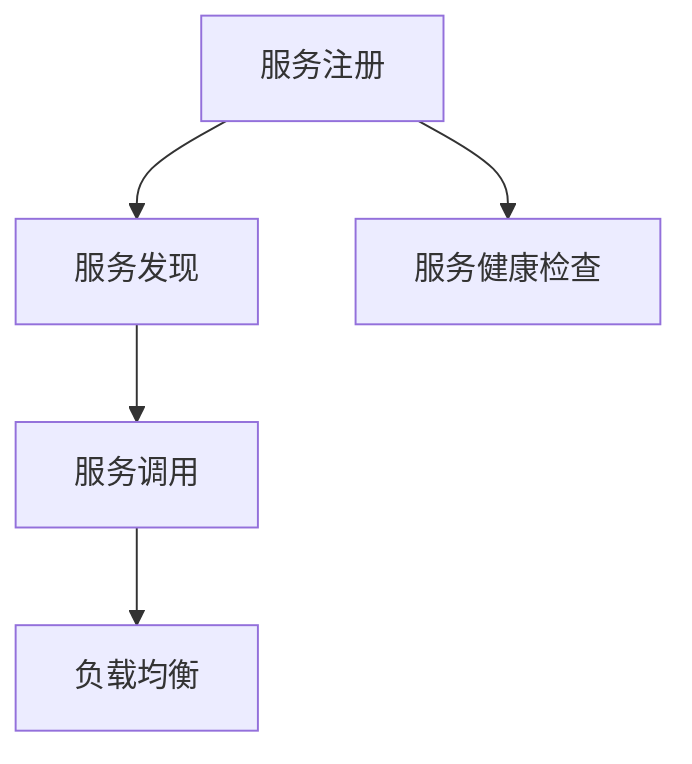

                 


## 服务发现：简化LLM微服务架构的服务调用

### 关键词：服务发现、微服务、架构、LLM、服务调用、性能优化、安全、配置管理

### 摘要：

服务发现是现代微服务架构中的关键组件，它能够简化服务之间的调用，提高系统的可扩展性和容错性。本文将深入探讨服务发现的基本概念、机制、与微服务架构的关系、技术实践以及性能优化与安全策略，帮助读者全面理解服务发现的本质，掌握其在LLM微服务架构中的应用技巧。

### 完整目录大纲

```markdown
# 服务发现：简化LLM微服务架构的服务调用

## 第一部分：服务发现基本概念

## 第1章：服务发现简介

## 1.1 服务发现的重要性

## 1.2 服务发现的历史演变

## 1.3 服务发现的核心概念

## 1.4 服务发现的挑战与解决方案

## 第2章：服务发现机制

## 2.1 服务注册中心

## 2.2 服务注册与发现流程

## 2.3 服务健康检查

## 2.4 负载均衡策略

## 第3章：服务发现与微服务架构

## 3.1 微服务架构概述

## 3.2 服务发现与微服务的关系

## 3.3 微服务架构中的服务调用

## 3.4 服务发现与微服务治理

## 第二部分：服务发现技术实践

## 第4章：服务发现框架

## 4.1 Eureka服务发现框架

## 4.2 ZooKeeper服务发现框架

## 4.3 Consul服务发现框架

## 4.4 Nacos服务发现框架

## 第5章：服务发现配置管理

## 5.1 服务配置的挑战

## 5.2 服务配置管理方案

## 5.3 实现服务配置管理

## 第6章：服务发现与安全

## 6.1 服务发现安全的重要性

## 6.2 服务发现安全策略

## 6.3 实现服务发现安全

## 第7章：服务发现性能优化

## 7.1 服务发现性能分析

## 7.2 性能优化策略

## 7.3 实现性能优化

## 第8章：服务发现应用场景

## 8.1 服务网格与服务发现

## 8.2 容器化环境下的服务发现

## 8.3 云原生架构中的服务发现

## 第9章：服务发现未来展望

## 9.1 服务发现的未来发展趋势

## 9.2 新兴服务发现技术

## 9.3 服务发现面临的挑战与机遇

### 附录

## 附录A：服务发现常见问题解答

## 附录B：服务发现工具资源推荐

## 附录C：服务发现项目实战案例

### Mermaid 流程图



### 核心算法原理讲解

```plaintext
// 服务注册算法伪代码
function registerService(serviceName, serviceUrl, metadata) {
    // 1. 连接到服务注册中心
    registryUrl = getServiceRegistryUrl()
    // 2. 构建注册信息
    registryInfo = {
        "serviceName": serviceName,
        "serviceUrl": serviceUrl,
        "metadata": metadata,
        "timestamp": getCurrentTimestamp()
    }
    // 3. 发送注册请求
    sendRequest(registryUrl, "POST", registryInfo)
}

// 服务发现算法伪代码
function discoverService(serviceName) {
    // 1. 连接到服务注册中心
    registryUrl = getServiceRegistryUrl()
    // 2. 获取服务列表
    serviceList = sendRequest(registryUrl, "GET", serviceName)
    // 3. 过滤可用服务
    availableServices = filterAvailableServices(serviceList)
    // 4. 实现负载均衡策略
    selectedService = applyLoadBalancer(availableServices)
    // 5. 返回选中的服务
    return selectedService
}
```

### 数学模型和数学公式

```markdown
## 服务发现性能分析

服务发现性能分析主要涉及以下几个指标：

$$
P = \frac{RTT + RTO + TCP_Connect_Time}{Total_Time}
$$

其中，$RTT$ 是网络往返时间，$RTO$ 是重传时间，$TCP_Connect_Time$
```

### 让我们一步步分析推理思考

#### 第一步：定义服务发现的核心概念

服务发现（Service Discovery）是微服务架构中的一个关键概念，它涉及到如何自动地找到和调用系统中的服务实例。在传统的单体架构中，服务的注册和调用通常由硬编码的方式来实现，这会带来服务管理上的复杂性。而在微服务架构中，服务发现提供了动态的、自动化的服务管理方式。

#### 第二步：探讨服务发现的机制

服务发现的机制通常包括以下几个关键组件：

- **服务注册中心**：服务注册中心是一个集中管理服务实例的组件，服务实例在启动时会在服务注册中心注册自己，停止时则注销。
- **服务注册与发现流程**：服务注册流程包括服务实例的注册和更新，服务发现流程则是客户端根据服务名称查询服务实例的过程。
- **服务健康检查**：服务健康检查用于监控服务实例的健康状态，确保只有健康的服务实例可供调用。
- **负载均衡策略**：负载均衡策略用于在多个可用服务实例之间分配请求，以实现负载均衡和容错。

#### 第三步：分析服务发现与微服务架构的关系

微服务架构强调服务的独立性、可扩展性和高可用性。服务发现是实现这些目标的关键机制，它允许服务之间透明地互相发现和调用，无需硬编码服务地址。服务发现提高了系统的灵活性和可维护性，使得服务可以独立开发、部署和扩展。

#### 第四步：探讨服务发现的技术实践

在技术实践方面，有多种服务发现框架可供选择，如Eureka、ZooKeeper、Consul和Nacos。这些框架提供了不同的功能和特性，可以根据具体需求进行选择。

- **Eureka**：是Netflix开发的分布式服务注册与发现服务，支持负载均衡和故障转移。
- **ZooKeeper**：是Apache开发的分布式协调服务，用于服务注册和配置管理。
- **Consul**：是HashiCorp开发的分布式服务网格解决方案，提供服务发现、配置和监控功能。
- **Nacos**：是阿里巴巴开发的动态服务发现和服务配置管理平台。

#### 第五步：讨论服务发现的性能优化和安全策略

服务发现的性能优化涉及降低延迟、提高响应速度和减少网络开销。常用的优化策略包括：

- **本地缓存**：缓存服务实例列表，减少对服务注册中心的查询次数。
- **批量查询**：批量查询服务实例，减少请求次数。
- **异步更新**：异步更新服务注册中心，减少同步操作带来的延迟。

服务发现的安全策略涉及防止未授权访问和确保数据完整性。常用的安全策略包括：

- **访问控制**：通过身份验证和授权机制，确保只有授权用户可以访问服务。
- **加密传输**：使用TLS加密传输数据，确保数据在传输过程中的安全性。
- **服务网格**：使用服务网格隔离服务通信，提高安全性。

#### 第六步：探讨服务发现的应用场景

服务发现适用于多种应用场景，如：

- **服务网格**：服务网格可以将服务发现作为核心功能，实现服务之间的安全、高效通信。
- **容器化环境**：容器化环境下的服务发现可以帮助容器化服务之间透明地发现和调用。
- **云原生架构**：云原生架构中，服务发现是确保容器化服务高效运行的关键组件。

#### 第七步：展望服务发现的未来发展趋势

随着技术的发展，服务发现将继续向更高效、更智能、更安全的方向发展。未来可能出现的新兴技术包括：

- **分布式服务发现**：支持跨集群、跨地域的服务发现。
- **智能负载均衡**：基于机器学习的负载均衡策略，实现更精细的流量分配。
- **区块链服务发现**：利用区块链技术实现去中心化的服务发现。

#### 结论

服务发现是微服务架构中不可或缺的组件，它通过简化服务调用，提高系统的可扩展性和容错性，使得微服务架构更加灵活和高效。本文全面探讨了服务发现的基本概念、机制、技术实践和未来发展趋势，为读者提供了深入理解和应用服务发现的指导。让我们继续关注服务发现领域的发展，迎接更智能、更高效的服务时代。作者：AI天才研究院/AI Genius Institute & 禅与计算机程序设计艺术 /Zen And The Art of Computer Programming。

