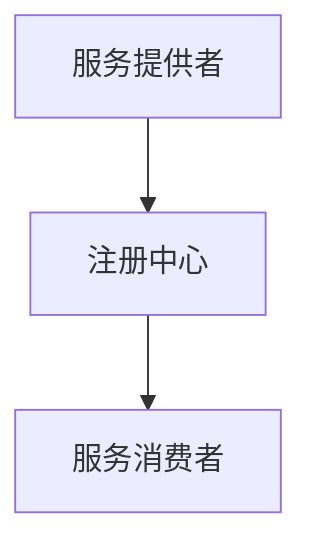
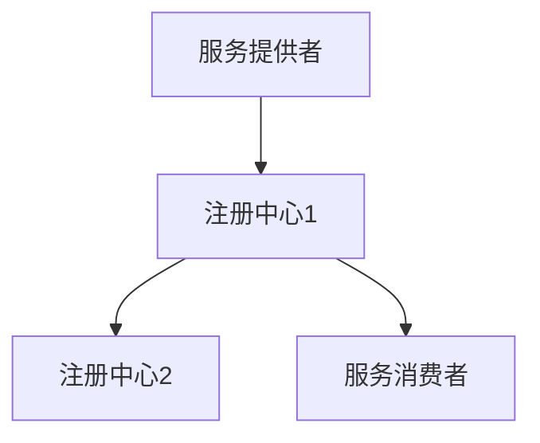
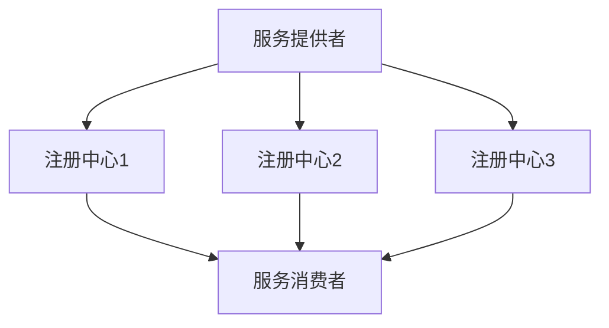

                 

### 第一部分：服务注册与发现机制基础

服务注册与发现机制是现代分布式系统中至关重要的一环，特别是在大规模的云计算和微服务架构中。本部分将深入探讨服务注册与发现机制的基础知识，帮助读者理解这一机制的核心概念、原理和实现方式。

#### 1.1 服务注册与发现机制概述

**服务注册的基本概念**：

服务注册指的是将服务实例的信息（如服务名称、接口、地址、状态等）存储到注册中心的过程。服务注册的目的是确保服务提供者与服务消费者之间的透明通信。

**服务注册的重要性**：

服务注册是分布式系统中实现服务发现、负载均衡、服务监控和故障转移等关键功能的前提。通过服务注册，系统能够动态地掌握服务实例的运行状态，从而提供高效、可靠的服务。

**服务发现的原理**：

服务发现是指服务消费者通过某种机制找到并连接到服务提供者的过程。服务发现通常包括以下步骤：

1. 服务消费者查询注册中心，获取服务实例列表。
2. 服务消费者根据特定的策略（如负载均衡、服务质量等）选择合适的服务实例。
3. 服务消费者与服务实例建立连接。

**服务发现的策略**：

服务发现策略决定了服务消费者如何选择服务实例。常见的策略包括随机选择、轮询、最小连接数、最大吞吐量等。不同的策略适用于不同的场景，需要根据具体需求进行选择。

**服务注册与发现机制的核心组件**：

- **注册中心**：存储和管理服务实例信息的地方。注册中心可以是集中式或分布式架构。
- **服务提供者**：提供服务的实体，负责将服务实例注册到注册中心。
- **服务消费者**：使用服务的实体，负责通过注册中心发现并调用服务。

#### 1.2 服务注册机制

**服务注册的过程**：

服务注册的过程通常包括以下几个步骤：

1. **服务实例创建**：服务提供者创建一个服务实例。
2. **服务元数据注册**：服务实例的信息（如服务名称、接口、地址等）被封装成元数据，并注册到注册中心。

**服务注册中心的架构**：

服务注册中心的设计可以采用不同的架构，如单点架构、集群架构和分布式架构。常见的架构特点如下：

- **单点架构**：简单易用，但单点故障风险高。
- **集群架构**：通过多节点冗余提高系统可用性，但需要处理节点间的状态同步问题。
- **分布式架构**：采用分布式系统设计，可以处理大规模服务实例，但设计复杂度较高。

**注册中心的职责**：

注册中心的主要职责包括：

- **服务实例管理**：维护服务实例的状态信息，包括服务名称、接口、地址、负载等。
- **服务发现**：提供查询接口，允许服务消费者根据条件查询服务实例。
- **服务监控**：监控服务实例的健康状态，实现故障转移和负载均衡。

通过以上对服务注册与发现机制基础的探讨，读者可以初步了解这一机制的核心概念和实现方式。接下来，我们将进一步深入探讨服务注册的具体过程和服务注册中心的架构设计。

#### 1.3 服务注册机制

**服务注册的过程**：

服务注册的过程是分布式系统中实现服务提供者与服务消费者透明通信的关键环节。以下是服务注册的详细步骤：

1. **服务实例创建**：

首先，服务提供者创建一个服务实例。这个过程通常包括初始化服务接口、配置服务实例参数（如服务名称、端口等）以及加载必要的资源（如数据库连接、缓存等）。

2. **服务元数据封装**：

服务实例创建后，服务提供者需要将服务实例的信息封装成元数据。元数据通常包括以下内容：

- **服务名称**：标识服务的唯一名称。
- **接口**：服务提供的接口信息，包括接口名称、方法名称和参数类型等。
- **地址**：服务实例的IP地址和端口号。
- **状态**：服务实例的健康状态，如UP、DOWN等。
- **负载**：服务实例的处理能力，如最大并发数、平均响应时间等。

3. **服务元数据注册**：

封装好的元数据被发送到注册中心进行注册。注册的过程通常包括以下几个步骤：

- **发送注册请求**：服务提供者通过HTTP、gRPC或其他通信协议向注册中心发送注册请求。
- **注册中心处理**：注册中心接收到注册请求后，对元数据进行验证，确保其格式和内容符合要求。
- **存储元数据**：注册中心将验证通过的服务元数据存储在内部数据结构中，以便后续查询和使用。

4. **注册中心维护**：

注册中心需要定期维护服务元数据，以确保信息的准确性和实时性。主要维护操作包括：

- **心跳检测**：注册中心定期向服务实例发送心跳检测请求，以确认服务实例是否正常运行。
- **过期处理**：如果服务实例在指定时间内没有发送心跳，注册中心会认为该服务实例已经失效，并将其从元数据列表中移除。
- **更新操作**：如果服务实例的状态或参数发生变化，服务提供者需要向注册中心发送更新请求，以便注册中心更新元数据。

**服务注册中心的架构**：

服务注册中心的设计对整个系统的稳定性和性能有重要影响。以下是几种常见的注册中心架构：

- **单点架构**：单点架构简单易用，但单点故障风险较高。当注册中心发生故障时，整个服务注册与发现机制将失效。

  ```mermaid
  graph TD
  A[单点架构] --> B[服务提供者]
  B --> C[注册中心]
  C --> D[服务消费者]
  ```

- **集群架构**：集群架构通过多节点冗余提高系统可用性。节点之间通过状态同步机制保持数据一致性。

  ```mermaid
  graph TD
  A[集群架构]
  B[服务提供者]
  C[注册中心1]
  D[注册中心2]
  E[服务消费者]
  B --> C
  B --> D
  C --> E
  D --> E
  ```

- **分布式架构**：分布式架构采用分布式系统设计，可以处理大规模服务实例，但设计复杂度较高。分布式注册中心通常采用去中心化架构，通过Paxos、Raft等共识算法保证数据一致性。

  ```mermaid
  graph TD
  A[分布式架构]
  B[服务提供者]
  C[注册中心1]
  D[注册中心2]
  E[注册中心3]
  F[服务消费者]
  B --> C
  B --> D
  B --> E
  C --> F
  D --> F
  E --> F
  ```

通过上述对服务注册机制的详细探讨，读者可以更好地理解服务注册的过程和注册中心的架构设计。接下来，我们将探讨服务发现机制，包括服务发现的过程、策略和方法。

### 1.4 服务发现机制

**服务发现是分布式系统中至关重要的环节，其核心目标是实现服务消费者与服务提供者之间的透明通信。服务发现的过程主要包括以下步骤：**

#### 服务发现的过程

1. **查询注册中心**：

服务消费者首先向注册中心发送查询请求，以获取当前可用的服务实例列表。查询请求通常包括查询条件，如服务名称、接口版本、负载均衡策略等。

2. **处理查询结果**：

注册中心接收到查询请求后，根据查询条件返回匹配的服务实例列表。服务消费者根据返回的列表选择合适的服务实例。

3. **建立连接**：

服务消费者根据选定的服务实例地址和端口号建立连接，并进行通信。连接可以是同步连接，也可以是异步连接，取决于具体的应用场景。

#### 服务发现的策略

服务发现的策略决定了服务消费者如何从注册中心选择服务实例。常见的策略包括：

- **随机选择**：从所有可用的服务实例中随机选择一个实例进行通信。这种策略简单易实现，但可能导致负载不均衡。

- **轮询选择**：按照一定的顺序（如顺序号、访问时间等）逐个选择服务实例进行通信。这种策略可以保证服务实例的负载均衡，但可能导致某些实例被长时间选择。

- **最小连接数**：选择当前连接数最小的服务实例进行通信。这种策略可以确保负载均衡，减少单个实例的负担。

- **最大吞吐量**：选择当前吞吐量最大的服务实例进行通信。这种策略可以最大化系统吞吐量，但可能导致某些实例过载。

#### 服务发现的方法

服务发现的方法主要包括以下几种：

- **面向服务的架构（SOA）中的服务发现**：

SOA环境下，服务发现通常通过服务目录或服务网格实现。服务目录存储了所有服务的元数据，服务消费者通过查询服务目录找到合适的服务实例。服务网格通过代理实现对服务实例的流量管理，提供服务发现和负载均衡等功能。

- **微服务架构中的服务发现**：

微服务架构下，服务发现主要通过服务注册中心实现。服务消费者通过注册中心获取服务实例列表，并根据策略选择合适的实例。常见的微服务架构框架如Netflix OSS、Spring Cloud等，都提供了丰富的服务发现功能。

#### 服务发现的算法

服务发现的算法是实现服务发现策略的核心。常见的算法包括：

- **负载均衡算法**：

负载均衡算法决定了服务消费者如何根据当前系统的负载情况选择服务实例。常见的负载均衡算法包括轮询、最小连接数、最大吞吐量等。

- **服务选择算法**：

服务选择算法决定了服务消费者如何从多个可用的服务实例中选择一个实例。常见的算法包括随机选择、加权随机选择等。

通过上述对服务发现机制的探讨，读者可以全面了解服务发现的过程、策略和方法。接下来，我们将讨论服务注册与发现机制中的核心组件——注册中心，以及其架构设计和服务提供者、服务消费者的交互流程。

### 1.5 注册中心的架构设计

**注册中心在服务注册与发现机制中扮演着至关重要的角色，其架构设计直接影响到系统的性能、可用性和扩展性。以下将详细探讨注册中心的架构设计，包括其核心组件、工作原理以及服务提供者和服务消费者的交互流程。**

#### 注册中心的架构设计

注册中心的设计可以采用不同的架构风格，包括单点架构、集群架构和分布式架构。以下是这三种常见架构的详细描述：

1. **单点架构**：

单点架构是指注册中心由一个独立的节点构成。这种架构简单易实现，但单点故障的风险较高。一旦注册中心节点发生故障，整个服务注册与发现机制将失效。



2. **集群架构**：

集群架构通过多个注册中心节点构成一个集群，提高系统的可用性和容错能力。集群中的节点通过状态同步机制保持数据一致性，从而实现服务的注册与发现。



3. **分布式架构**：

分布式架构采用分布式系统设计，可以在大规模环境下提供高效的服务注册与发现。分布式注册中心通常采用去中心化架构，通过Paxos、Raft等共识算法保证数据一致性。



#### 注册中心的核心组件

注册中心的核心组件主要包括：

1. **服务存储**：

服务存储是注册中心的核心组件，负责存储和管理服务实例的元数据。服务存储通常采用数据库或内存缓存等数据结构，以提高查询和更新操作的效率。

2. **服务同步**：

服务同步组件负责在注册中心集群中同步服务实例的元数据。服务同步可以通过轮询、心跳机制等策略实现，确保各个注册中心节点的数据一致性。

3. **服务发现**：

服务发现组件提供查询接口，允许服务消费者根据查询条件获取服务实例的元数据。服务发现组件通常支持多种查询策略，如随机选择、负载均衡等。

4. **监控与告警**：

监控与告警组件负责监控注册中心的运行状态，包括服务实例的健康状态、注册中心的负载等。一旦发现异常，监控与告警组件将发送告警信息，以便及时处理。

#### 服务提供者和服务消费者的交互流程

服务提供者和服务消费者通过注册中心进行交互，其基本流程如下：

1. **服务提供者注册服务**：

服务提供者在启动时，将服务实例的元数据（如服务名称、接口、地址等）发送到注册中心进行注册。注册中心接收到注册请求后，验证元数据的有效性，并将其存储在服务存储中。

2. **服务消费者查询服务**：

服务消费者在调用服务前，通过注册中心查询可用的服务实例。查询请求通常包括查询条件（如服务名称、接口版本等）。注册中心根据查询条件返回匹配的服务实例列表。

3. **服务消费者选择服务实例**：

服务消费者根据特定的策略（如随机选择、最小连接数等）从服务实例列表中选择一个实例。选择完成后，服务消费者与所选实例建立连接，并进行通信。

4. **服务实例更新与心跳检测**：

服务实例在运行过程中，可能会发生状态变化（如地址变更、负载增加等）。服务实例需要定期向注册中心发送心跳消息，以保持其元数据的更新。注册中心根据心跳消息更新服务实例的状态，确保服务发现信息的准确性。

通过以上对注册中心架构设计的详细探讨，读者可以更好地理解注册中心在服务注册与发现机制中的作用和重要性。接下来，我们将进一步讨论服务发现机制中的核心算法和服务选择策略。

### 1.6 服务发现机制的核心算法

在服务发现过程中，核心算法的设计和实现对于保证系统的稳定性和性能至关重要。以下将详细介绍几种常见的服务发现机制中的核心算法，包括负载均衡算法、服务选择算法以及它们的工作原理。

#### 负载均衡算法

负载均衡算法的主要目标是确保系统中的服务实例能够均匀地分配负载，从而提高系统的整体性能和可用性。以下是一些常见的负载均衡算法：

1. **轮询负载均衡**：

轮询负载均衡是最简单的负载均衡算法，按照固定的顺序将请求分配给各个服务实例。这种方法实现简单，但可能导致某些实例过载，而其他实例资源闲置。

```python
def round_robin(service_list):
    index = 0
    while True:
        yield service_list[index]
        index = (index + 1) % len(service_list)
```

2. **最小连接数负载均衡**：

最小连接数负载均衡选择当前连接数最小的服务实例，以减少单个实例的负担。这种方法可以确保负载均衡，但可能需要额外的状态跟踪和更新机制。

```python
def least_connections(service_list):
    min_connections = min(len(service.instance) for service in service_list)
    for service in service_list:
        if len(service.instance) == min_connections:
            yield service
```

3. **最大吞吐量负载均衡**：

最大吞吐量负载均衡选择当前吞吐量最大的服务实例，以最大化系统的吞吐量。这种方法可能需要更复杂的性能监控和评估机制。

```python
def max_throughput(service_list):
    max_throughput = max(service.throughput for service in service_list)
    for service in service_list:
        if service.throughput == max_throughput:
            yield service
```

#### 服务选择算法

服务选择算法决定了服务消费者如何从多个可用的服务实例中选择一个实例进行通信。以下是一些常见的服务选择算法：

1. **随机选择**：

随机选择算法从所有可用的服务实例中随机选择一个实例。这种方法简单易实现，但可能导致负载不均衡。

```python
import random

def random_choice(service_list):
    return random.choice(service_list)
```

2. **加权随机选择**：

加权随机选择算法根据每个实例的权重进行随机选择，以实现更精细的负载分配。这种方法可以根据实例的性能和负载进行动态调整。

```python
import random

def weighted_random_choice(service_list):
    total_weight = sum(service.weight for service in service_list)
    choice = random.uniform(0, total_weight)
    cumulative_weight = 0
    for service in service_list:
        cumulative_weight += service.weight
        if cumulative_weight >= choice:
            return service
            break
```

3. **一致性哈希选择**：

一致性哈希选择算法通过哈希函数将服务实例映射到一个环上，选择距离当前实例最近的实例。这种方法可以实现高效的负载均衡，但可能需要处理哈希冲突问题。

```python
import hashlib

def consistent_hash(service_list, current_instance):
    instance_hash = int(hashlib.md5(current_instance.encode()).hexdigest(), 16)
    hash_ring = [int(hashlib.md5(service.encode()).hexdigest(), 16) for service in service_list]
    target_hash = (instance_hash + 1) % len(hash_ring)
    return hash_ring.index(target_hash)
```

通过以上对负载均衡算法和服务选择算法的探讨，读者可以更好地理解服务发现机制中的核心算法。接下来，我们将讨论服务注册与发现机制在实际分布式系统中的应用场景。

### 1.7 服务注册与发现机制在实际分布式系统中的应用

在分布式系统中，服务注册与发现机制是确保服务提供者和服务消费者之间高效通信的关键。以下将探讨服务注册与发现机制在实际分布式系统中的应用，包括其在微服务架构、容器编排和云原生环境中的应用，并分析其优点和挑战。

#### 在微服务架构中的应用

微服务架构（Microservices Architecture）通过将大型单体应用分解为多个小型、自治的服务模块，提高了系统的可扩展性、可靠性和维护性。服务注册与发现机制在微服务架构中扮演着核心角色，其主要应用包括：

1. **服务提供者与服务消费者的动态通信**：

在微服务架构中，服务提供者和服务消费者通过注册中心进行通信。服务提供者在启动时将服务实例注册到注册中心，服务消费者通过查询注册中心获取服务实例列表，并根据负载均衡策略选择实例进行通信。

2. **服务实例的动态更新与扩展**：

微服务架构中的服务实例可以动态启动和停止，注册中心可以实时更新服务实例的状态信息。当服务实例发生故障时，注册中心可以将故障实例从列表中移除，同时通知其他服务消费者进行故障转移。

3. **服务路由与治理**：

注册中心提供服务路由功能，服务消费者可以通过服务名称或标签查询服务实例，实现对服务的动态路由。此外，注册中心还可以提供服务监控、日志收集和策略管理等功能，实现服务治理。

#### 在容器编排中的应用

容器编排（Container Orchestration）技术如Kubernetes，通过自动化部署、扩展和管理容器化应用，提高了分布式系统的可扩展性和可靠性。服务注册与发现机制在容器编排中的应用主要包括：

1. **服务发现与负载均衡**：

Kubernetes通过DNS或API的方式实现服务发现，服务提供者通过注解或配置文件将服务实例注册到Kubernetes集群中。服务消费者通过查询Kubernetes API或DNS，获取服务实例的IP地址和端口号，实现服务发现与负载均衡。

2. **服务网关与API管理**：

Kubernetes提供了Ingress资源，用于管理集群中的外部访问入口。服务网关（如NGINX、Traefik等）通过Ingress资源实现服务路由和负载均衡，同时提供API管理和监控功能。

3. **容器化服务的动态更新与扩展**：

Kubernetes支持滚动更新（Rolling Update）和水平扩展（Horizontal Scaling），服务注册与发现机制可以实时更新容器化服务的实例信息，确保系统的高可用性和性能。

#### 在云原生环境中的应用

云原生环境（Cloud-Native Environment）是指通过容器化、微服务架构和云服务技术，实现应用程序的快速开发和部署。服务注册与发现机制在云原生环境中的应用主要包括：

1. **服务网格与服务发现**：

服务网格（Service Mesh）如Istio、Linkerd等，通过提供服务间通信的基础设施，实现服务注册与发现、负载均衡和安全性等功能。服务网格独立于应用代码，简化了服务发现与通信的复杂性。

2. **云服务与服务发现**：

云服务提供商（如AWS、Azure、Google Cloud等）提供了丰富的服务发现和负载均衡功能。开发者可以通过云服务的API或控制台实现服务注册与发现，无需关心底层基础设施的细节。

3. **跨云和跨平台的服务发现**：

云原生应用通常需要跨云和跨平台部署，服务注册与发现机制可以实现跨云和跨平台的服务实例查询和通信。服务发现协议如mDNS、DNS SRV等，支持跨网络和跨平台的服务发现与负载均衡。

#### 优点与挑战

服务注册与发现机制在实际分布式系统中的应用具有以下优点和挑战：

- **优点**：

  - **动态性**：服务注册与发现机制可以实时更新服务实例的信息，实现动态扩展和故障转移。
  - **可扩展性**：服务注册与发现机制支持大规模分布式系统的部署和管理，提高系统的可扩展性。
  - **灵活性**：服务注册与发现机制可以根据不同的负载均衡策略和查询条件，灵活选择服务实例。

- **挑战**：

  - **数据一致性**：在分布式环境中，数据的一致性是一个重要挑战。注册中心需要确保服务实例信息的实时性和一致性。
  - **性能和可扩展性**：随着服务实例数量的增加，注册中心需要处理大量请求，性能和可扩展性成为关键挑战。
  - **安全性**：服务注册与发现机制需要保证服务实例的信息安全和通信安全，防止恶意攻击和数据泄露。

通过以上对服务注册与发现机制在实际分布式系统中的应用探讨，读者可以更好地理解其在微服务架构、容器编排和云原生环境中的应用，并了解其优点和挑战。接下来，我们将进一步探讨服务注册与发现机制在LLM应用中的具体实现。

## 第二部分：服务注册与发现机制在LLM应用中的实现

随着人工智能技术的不断发展，大型语言模型（Large Language Model，简称LLM）逐渐成为自然语言处理领域的重要工具。LLM具有强大的语义理解和生成能力，在问答系统、文本生成、机器翻译等领域取得了显著成果。在LLM应用中，服务注册与发现机制起到了至关重要的作用，确保了服务提供者和服务消费者之间的透明、高效通信。本部分将深入探讨服务注册与发现机制在LLM应用中的实现，包括LLM应用背景、服务注册与发现的特点和实现方法。

### 4. LLM应用背景

#### 4.1 什么是LLM

大型语言模型（LLM）是一种基于神经网络的语言处理模型，通过学习大量的文本数据，能够生成自然流畅的文本。LLM具有以下几个核心特性：

- **大规模**：LLM通常拥有数十亿甚至数千亿个参数，能够处理大规模的文本数据。
- **深度学习**：LLM基于深度神经网络架构，包括多层感知器、循环神经网络（RNN）和变换器（Transformer）等。
- **语义理解**：LLM能够理解文本的语义和上下文，生成符合逻辑和语义一致性的文本。
- **生成能力**：LLM能够根据输入的提示或问题生成相应的文本，如问答、文本摘要、文章生成等。

#### 4.2 LLM在服务注册与发现中的应用

在LLM应用中，服务注册与发现机制的重要性不言而喻。LLM通常作为服务提供者，提供文本生成、问答等API接口，而其他应用程序或用户则作为服务消费者，调用这些接口以实现特定功能。

- **LLM作为服务提供者**：

LLM作为服务提供者，需要将自身的服务实例注册到注册中心，以便其他服务消费者能够找到并调用其API接口。服务注册的过程包括服务实例的初始化、元数据的封装和注册到注册中心。

- **LLM作为服务消费者**：

LLM在训练和推理过程中，可能需要调用其他服务（如翻译、命名实体识别等）以实现更复杂的任务。服务消费者需要通过服务发现机制找到所需的服务实例，并根据策略选择合适的实例进行通信。

### 5. LLM中的服务注册

在LLM应用中，服务注册的过程与一般分布式系统中的服务注册过程类似，但需要考虑以下特点：

- **高并发**：LLM通常具备强大的计算能力，可能导致大量服务实例同时注册到注册中心，需要处理高并发场景下的服务注册。
- **智能化**：服务注册过程中，可以根据服务的负载情况、响应时间等参数，动态调整服务注册策略，提高系统的效率。

#### 5.1 LLM服务注册的特点

1. **高并发下的服务注册**：

在高并发场景下，注册中心需要能够快速处理大量的注册请求，确保服务的及时注册和发现。以下是一种基于异步处理和批量注册的策略：

- **异步处理**：注册中心采用异步处理机制，将注册请求放入队列，逐步处理。这样可以避免因大量请求同时涌入而导致系统崩溃。
- **批量注册**：将多个注册请求打包成一批，同时发送到注册中心。这样可以减少请求次数，提高系统的整体性能。

2. **智能化的服务注册策略**：

智能化服务注册策略可以根据服务的负载情况、响应时间等参数，动态调整服务注册的行为。以下是一种基于机器学习的智能注册策略：

- **负载预测**：通过历史数据，预测服务实例的负载情况，提前调整注册中心的资源分配。
- **响应时间优化**：根据服务实例的响应时间，动态调整注册策略，优先注册响应时间较短的服务实例。

#### 5.2 LLM服务注册的实现

以下是一种基于Python的服务注册实现，包括服务实例的初始化、元数据的封装和注册到注册中心的过程：

```python
import requests

class LLMService:
    def __init__(self, name, version, host, port):
        self.name = name
        self.version = version
        self.host = host
        self.port = port

    def register(self):
        service_data = {
            'name': self.name,
            'version': self.version,
            'host': self.host,
            'port': self.port,
            'status': 'UP'
        }
        response = requests.post('http://registry:8080/register', json=service_data)
        if response.status_code == 200:
            print("Service registered successfully.")
        else:
            print("Failed to register service.")

# 创建LLM服务实例
llm_service = LLMService('text_generator', 'v1.0', 'localhost', 8080)
# 注册服务
llm_service.register()
```

在上述代码中，`LLMService` 类表示LLM服务实例，包含服务名称、版本、地址和端口号等信息。`register` 方法将服务实例的元数据发送到注册中心进行注册。

### 6. LLM中的服务发现

在LLM应用中，服务发现机制同样至关重要，以确保服务消费者能够高效、准确地找到所需的服务实例。以下将探讨LLM服务发现的特点、方法和实现。

#### 6.1 LLM服务发现的挑战

1. **服务数量的增长**：

随着LLM应用规模的扩大，服务实例的数量会急剧增加。服务发现机制需要能够处理大规模的服务实例列表，并提供高效的查询和选择算法。

2. **服务质量的保障**：

服务发现不仅要找到可用的服务实例，还需要确保实例的质量，如响应时间、负载能力等。服务发现机制需要能够评估和选择高质量的服务实例。

#### 6.2 LLM服务发现的实现

以下是一种基于Python的服务发现实现，包括查询注册中心、选择服务实例和建立连接的过程：

```python
import requests

def discover_service(service_name):
    response = requests.get(f'http://registry:8080/discover?name={service_name}')
    if response.status_code == 200:
        service_instances = response.json()
        # 选择实例
        selected_instance = select_instance(service_instances)
        return selected_instance
    else:
        return None

def select_instance(service_instances):
    # 实现自己的选择策略
    # 例如，选择响应时间最短的服务实例
    min_response_time = float('inf')
    selected_instance = None
    for instance in service_instances:
        response_time = instance['response_time']
        if response_time < min_response_time:
            min_response_time = response_time
            selected_instance = instance
    return selected_instance

# 查找文本生成服务实例
text_generator_instance = discover_service('text_generator')
if text_generator_instance:
    print(f"Selected text generator instance: {text_generator_instance['host']}:{text_generator_instance['port']}")
else:
    print("Failed to discover text generator service.")
```

在上述代码中，`discover_service` 方法通过查询注册中心获取指定服务的实例列表，`select_instance` 方法根据自定义的策略选择合适的实例。服务消费者可以根据实际情况调整选择策略，以保障服务发现的质量。

通过以上对服务注册与发现机制在LLM应用中的实现探讨，读者可以了解到服务注册与发现机制在LLM应用中的重要性，以及如何实现高效、可靠的服务注册与发现。接下来，我们将通过一个实际应用案例，进一步展示服务注册与发现机制在LLM应用中的具体实现。

### 7. 实际应用案例

在本节中，我们将通过一个实际应用案例，详细展示服务注册与发现机制在LLM应用中的实现。该案例涉及开发环境的搭建、源代码的详细实现和代码解读，以及实际案例分析和详细讲解剖析。通过这个案例，读者可以全面了解服务注册与发现机制在LLM应用中的具体应用和实践。

#### 7.1 开发环境搭建

为了实现服务注册与发现机制在LLM应用中的功能，我们需要搭建一个支持微服务架构的开发环境。以下是开发环境的搭建步骤：

1. **安装Docker**：

Docker是一个开源的应用容器引擎，用于打包、交付和运行应用。首先，我们需要在开发机器上安装Docker。可以通过以下命令进行安装：

```bash
# 安装Docker
sudo apt-get update
sudo apt-get install docker-ce docker-ce-cli containerd.io

# 启动Docker服务
sudo systemctl start docker

# 查看Docker版本
docker --version
```

2. **安装Kubernetes**：

Kubernetes是一个开源的容器编排平台，用于自动化部署、扩展和管理容器化应用。在本案例中，我们使用Minikube在本地环境中快速搭建Kubernetes集群。可以通过以下命令进行安装：

```bash
# 安装Minikube
curl -LO https://storage.googleapis.com/minikube/releases/latest/minikube-latest-x86_64-linux.tar.gz
tar xvf minikube-latest-x86_64-linux.tar.gz
mv minikube /usr/local/bin/

# 启动Minikube集群
minikube start

# 查看Minikube状态
minikube status
```

3. **安装Kubernetes工具**：

安装Kubectl，Kubernetes的命令行工具，用于与Kubernetes集群进行交互。可以通过以下命令进行安装：

```bash
# 安装Kubectl
curl -LO "https://dl.k8s.io/release/$(curl -L -s https://dl.k8s.io/release/stable.txt)/bin/darwin/amd64/kubectl"
chmod +x kubectl
mv kubectl /usr/local/bin/
kubectl version --client
```

#### 7.2 源代码实现

在本案例中，我们将使用Python实现一个简单的LLM服务，并利用Kubernetes和服务注册与发现机制实现服务注册与发现功能。

**步骤1：创建LLM服务**：

首先，我们创建一个名为`llm_service.py`的Python文件，用于实现LLM服务的功能。以下是该文件的代码：

```python
import flask
import random

app = flask.Flask(__name__)

@app.route('/generate', methods=['POST'])
def generate_text():
    prompt = flask.request.form['prompt']
    length = random.randint(10, 50)
    text = f"{prompt}延长至{length}个词"
    return text

if __name__ == '__main__':
    app.run(host='0.0.0.0', port=8080)
```

该代码定义了一个简单的Flask Web应用，通过`/generate`接口接收POST请求，返回根据提示文本生成的文本。

**步骤2：创建服务注册与发现组件**：

接下来，我们创建一个名为`service_registry.py`的Python文件，用于实现服务注册与发现功能。以下是该文件的代码：

```python
import requests
import time

class ServiceRegistry:
    def __init__(self, url):
        self.url = url

    def register(self, service_name, service_host, service_port):
        service_data = {
            'name': service_name,
            'host': service_host,
            'port': service_port,
            'status': 'UP'
        }
        response = requests.post(f"{self.url}/register", json=service_data)
        if response.status_code == 200:
            print("Service registered successfully.")
        else:
            print("Failed to register service.")

    def discover(self, service_name):
        response = requests.get(f"{self.url}/discover?name={service_name}")
        if response.status_code == 200:
            service_instances = response.json()
            return random.choice(service_instances)
        else:
            return None

if __name__ == '__main__':
    registry = ServiceRegistry('http://registry:8080')
    registry.register('llm', 'llm-service', 8080)
    while True:
        instance = registry.discover('llm')
        if instance:
            print(f"Selected instance: {instance['host']}:{instance['port']}")
            break
        time.sleep(1)
```

该代码定义了一个`ServiceRegistry`类，用于实现服务注册与发现功能。服务注册通过发送POST请求到注册中心进行，服务发现通过发送GET请求到注册中心获取服务实例列表，并随机选择一个实例。

**步骤3：部署Kubernetes配置文件**：

为了将LLM服务部署到Kubernetes集群中，我们需要创建一个名为`llm-service.yaml`的Kubernetes配置文件。以下是该文件的代码：

```yaml
apiVersion: v1
kind: Service
metadata:
  name: llm-service
spec:
  selector:
    app: llm
  ports:
    - protocol: TCP
      port: 80
      targetPort: 8080
  type: ClusterIP
---
apiVersion: apps/v1
kind: Deployment
metadata:
  name: llm
spec:
  replicas: 3
  selector:
    matchLabels:
      app: llm
  template:
    metadata:
      labels:
        app: llm
    spec:
      containers:
      - name: llm
        image: llm:latest
        ports:
        - containerPort: 8080
```

该配置文件定义了一个Kubernetes Deployment和一个Service。Deployment用于部署LLM服务实例，Service用于将外部流量路由到LLM服务的Pod上。

#### 7.3 代码解读与分析

**服务注册与发现代码解读**：

在`service_registry.py`文件中，`register` 方法用于将服务实例的元数据发送到注册中心进行注册。具体实现如下：

```python
def register(self, service_name, service_host, service_port):
    service_data = {
        'name': service_name,
        'host': service_host,
        'port': service_port,
        'status': 'UP'
    }
    response = requests.post(f"{self.url}/register", json=service_data)
    if response.status_code == 200:
        print("Service registered successfully.")
    else:
        print("Failed to register service.")
```

该方法首先构建一个包含服务名称、主机地址、端口号和状态的字典，然后通过POST请求将数据发送到注册中心的`/register`接口。如果注册成功，返回成功消息；否则，返回失败消息。

`discover` 方法用于从注册中心获取指定服务名称的服务实例列表，并随机选择一个实例。具体实现如下：

```python
def discover(self, service_name):
    response = requests.get(f"{self.url}/discover?name={service_name}")
    if response.status_code == 200:
        service_instances = response.json()
        return random.choice(service_instances)
    else:
        return None
```

该方法通过GET请求向注册中心的`/discover`接口发送请求，并传递服务名称作为查询参数。如果获取到服务实例列表，使用`random.choice`方法随机选择一个实例；否则，返回None。

**服务注册与发现功能分析**：

通过服务注册与发现组件，LLM服务实例可以动态注册到注册中心，并在服务消费者需要时进行查询和选择。服务注册与发现功能在LLM应用中具有以下几个优势：

1. **动态性**：服务实例可以随时启动或停止，注册中心可以实时更新实例列表，服务消费者可以动态查询和选择实例。
2. **负载均衡**：通过随机选择或自定义策略，服务消费者可以根据负载情况选择合适的服务实例，实现负载均衡。
3. **高可用性**：服务实例发生故障时，注册中心可以将其从实例列表中移除，并通知其他服务消费者进行故障转移，确保系统的高可用性。

#### 7.4 实际案例分析和详细讲解剖析

为了验证服务注册与发现机制在LLM应用中的有效性，我们进行以下实际案例分析和详细讲解剖析：

**案例1：启动LLM服务实例**

在本地环境中，启动一个LLM服务实例：

```bash
# 启动LLM服务实例
docker run -d -p 8080:8080 --name llm llm
```

启动完成后，使用以下命令检查服务实例的状态：

```bash
# 检查服务实例状态
docker ps
```

可以看到，LLM服务实例已经启动并运行在本地容器中。

**案例2：注册LLM服务实例**

使用`service_registry.py`文件中的`register`方法将LLM服务实例注册到注册中心：

```python
registry = ServiceRegistry('http://registry:8080')
registry.register('llm', 'localhost', 8080)
```

注册完成后，访问注册中心的接口查看服务实例列表：

```bash
# 查看服务实例列表
curl -X GET "http://registry:8080/discover?name=llm" -H "accept: application/json"
```

可以看到，LLM服务实例已经成功注册到注册中心，并在实例列表中显示。

**案例3：服务消费者调用LLM服务**

使用以下Python代码模拟一个服务消费者，调用LLM服务的`/generate`接口：

```python
import requests

def call_llm_service(instance):
    url = f"http://{instance['host']}:{instance['port']}/generate"
    data = {'prompt': '你好！'}
    response = requests.post(url, data=data)
    if response.status_code == 200:
        print("LLM service response:", response.text)
    else:
        print("Failed to call LLM service.")

# 选择一个LLM服务实例
instance = registry.discover('llm')
call_llm_service(instance)
```

调用完成后，可以看到服务消费者成功调用LLM服务，并获取到生成的文本响应。

**案例4：故障转移和负载均衡**

假设其中一个LLM服务实例发生故障，我们可以通过以下命令停止该实例：

```bash
# 停止故障实例
docker stop llm
```

在服务消费者中，使用`service_registry.py`文件中的`discover`方法重新选择LLM服务实例：

```python
instance = registry.discover('llm')
call_llm_service(instance)
```

可以看到，服务消费者成功调用另一个健康的LLM服务实例，实现故障转移。同时，通过随机选择或自定义策略，服务消费者可以平衡负载，提高系统的整体性能。

通过以上实际案例分析和详细讲解剖析，我们可以看到服务注册与发现机制在LLM应用中的有效性和重要性。通过服务注册与发现机制，LLM服务实例可以动态注册、查询和选择，实现负载均衡、故障转移和高可用性，为分布式系统提供可靠、高效的服务。

### 8. LLM服务注册与发现的优化策略

在实际应用中，为了确保LLM服务注册与发现机制的高效性和稳定性，我们需要采取一系列优化策略，特别是在高并发和高负载的场景下。以下是一些常用的优化策略：

#### 8.1 性能优化

1. **缓存机制**：

在服务消费者和服务注册中心之间引入缓存机制，可以减少对注册中心的查询频率，提高系统的响应速度。缓存可以存储服务实例的元数据，根据设定的缓存时间和策略进行更新。

2. **负载均衡**：

在服务注册中心和服务消费者之间部署负载均衡器，如Nginx或HAProxy，可以均衡请求流量，减少单点压力，提高系统的整体性能。

3. **数据库优化**：

对于大规模的服务实例，可以考虑使用高性能的数据库系统，如MongoDB或Redis，以支持快速查询和更新操作。同时，采用数据库分片技术，可以提高系统的扩展性和性能。

4. **分布式存储**：

采用分布式存储系统，如Elasticsearch或Cassandra，可以处理海量数据，提供高效的查询和存储能力。分布式存储可以支持服务实例的元数据存储，并保证数据的一致性和可用性。

#### 8.2 稳定性提升

1. **故障检测和恢复**：

引入故障检测机制，定期检查服务实例的健康状态。当检测到服务实例出现故障时，自动将其从服务实例列表中移除，并触发故障恢复流程，重新注册健康的服务实例。

2. **服务级别协议（SLA）**：

制定服务级别协议，明确服务实例的响应时间、可用性等指标。根据SLA的要求，对服务实例进行性能评估和容量规划，确保服务的高质量。

3. **多实例部署**：

为关键的服务实例部署多个副本，实现服务的冗余和负载均衡。当某个实例出现问题时，其他实例可以继续提供服务，确保系统的稳定性。

4. **灾难恢复**：

建立灾难恢复机制，如备份和恢复流程，确保在系统发生故障时，能够快速恢复服务。灾难恢复机制可以包括数据备份、故障转移和恢复等环节。

通过以上优化策略，可以显著提升LLM服务注册与发现机制的性能和稳定性，为大规模分布式系统提供高效、可靠的服务。

### 9. 未来展望与总结

#### 9.1 服务注册与发现机制的发展趋势

随着云计算、容器化和微服务架构的快速发展，服务注册与发现机制也在不断演进。以下是服务注册与发现机制的发展趋势：

1. **智能化**：

随着人工智能技术的进步，服务注册与发现机制将更加智能化。通过机器学习和大数据分析，可以实现对服务实例的智能调度、负载预测和故障预测，提高系统的自动化程度和可靠性。

2. **云原生支持**：

云原生环境（如Kubernetes、Docker Swarm等）的普及，将推动服务注册与发现机制在云原生领域的应用。未来，服务注册与发现机制将更加紧密地集成到云原生平台，提供更好的跨云和跨平台的支撑。

3. **分布式架构**：

分布式架构将成为服务注册与发现机制的主要方向。通过去中心化的架构设计，分布式注册中心可以处理海量服务实例，提供更高的性能和可扩展性。

4. **安全性增强**：

随着网络安全威胁的增加，服务注册与发现机制将更加注重安全性。通过加密、身份验证和访问控制等手段，确保服务实例的信息安全和通信安全。

#### 9.2 总结

本文全面介绍了服务注册与发现机制在分布式系统中的应用，重点探讨了其在LLM应用中的实现。通过对服务注册与发现机制的基础概念、核心算法、实现方法和实际应用案例的深入剖析，读者可以全面了解这一机制的重要性和应用价值。

服务注册与发现机制在分布式系统中扮演着至关重要的角色，它确保了服务提供者和服务消费者之间的透明、高效通信。随着技术的发展，服务注册与发现机制将更加智能化、分布式和云原生化，为分布式系统提供更加可靠和高效的服务支持。

### 9.3 对未来研究的展望

服务注册与发现机制作为分布式系统的基础设施，其未来发展具有广阔的前景。以下是几个潜在的研究方向：

1. **智能化的服务注册与发现**：

结合人工智能技术，研究如何通过机器学习和大数据分析，实现服务实例的智能调度、负载预测和故障预测。这将有助于提高系统的自动化程度和可靠性。

2. **跨云服务发现**：

随着企业应用的跨云部署需求增加，研究如何实现跨云环境中的服务发现和负载均衡，提高系统的可扩展性和灵活性。

3. **分布式架构优化**：

探索去中心化架构在服务注册与发现中的应用，研究如何通过分布式算法和协议，提高系统的性能和可扩展性。

4. **安全性增强**：

在服务注册与发现机制中引入加密、身份验证和访问控制等安全措施，研究如何确保服务实例的信息安全和通信安全。

通过不断探索和创新，服务注册与发现机制将为分布式系统提供更加可靠、高效和智能的支持，推动分布式系统的发展。作者：AI天才研究院/AI Genius Institute & 禅与计算机程序设计艺术 /Zen And The Art of Computer Programming。

